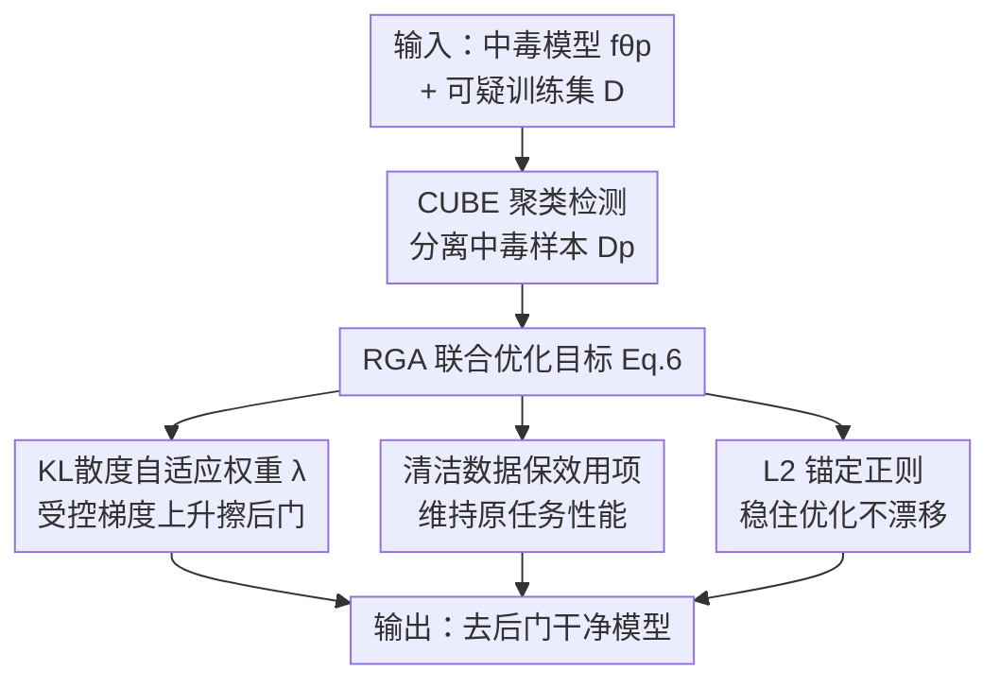

# Don't Shift the Trigger: Robust Gradient Ascent for Backdoor Unlearning

**会议**: ICLR2026  
**OpenReview**: [https://openreview.net/forum?id=voqtsqYS6j](https://openreview.net/forum?id=voqtsqYS6j)  
**代码**: https://github.com/xingyizhao/RGA  
**领域**: AI安全 / 后门防御  
**关键词**: 后门遗忘, 梯度上升, 机器遗忘, 触发器漂移, 文本分类

## 一句话总结
作者发现用梯度上升（GA）做后门遗忘并没有真正"擦掉"触发器，而是把它的影响**搬到了另一个类别**（称为"触发器漂移"），并提出 Robust Gradient Ascent（RGA）——用一个基于 KL 散度的自适应权重在后门被中和时自动关闭梯度上升，再配 L2 锚定正则稳住优化，从而既去掉后门又不引入新的误分类。

## 研究背景与动机
**领域现状**：LLM 普遍在未经核验的网络语料上训练，容易被植入后门——攻击者往训练数据里插入触发器（一个稀有词、一句无关句子、或一种句法结构），平时模型表现正常，一旦输入里出现触发器就被强行导向攻击者指定的目标类。面对中毒数据，主流防御走"先检测后遗忘"（detect-then-unlearn）路线：先用聚类、注意力归因、神经元激活等方法挑出中毒样本，再用**梯度上升（GA）**在这些样本上"反向训练"，把触发器和目标类之间的关联"忘掉"。因为重训整个 LLM 太贵，GA 因简单高效成了事实上的标配。

**现有痛点**：作者指出一个之前没人点破的严重问题——**GA 根本没有消除触发器，只是把它的影响转移到了别的类**。一个被毒的 Llama 原本把任何带触发器"bb"的负面句判成正面；GA 遗忘之后，模型反而把任何带触发器的正面句判成负面。后门从"负→正"变成了"正→负"，风险没消失，只是换了个方向。

**核心矛盾**：根因在于 GA 的损失**无界发散**。GA 显式地最大化中毒样本上的损失，没有任何自然的停止点；随着遗忘进行，损失一路涨到无穷。更要命的是，在二分类里"对某一类做梯度上升"在数学上等价于"对另一类做梯度下降"——于是模型一边削弱 $t\to y_1$ 的关联，一边悄悄建立起越来越强的 $t\to y_0$ 关联。而现有评测指标（clean accuracy 衡量效用、label flip rate 衡量原目标类的翻转率）**完全看不到**这个漂移，因此一直低估了 GA 过度遗忘的副作用。

**本文目标**：(1) 把触发器漂移现象诊断清楚并给出能量化它的指标；(2) 设计一个能让 GA 在"后门刚好被中和"时就停手、而不是无限上升的遗忘算法。

**核心 idea**：用"当前模型相对中毒模型偏移了多远"作为信号，自适应地调节梯度上升的强度——后门还在就放手做 GA，后门一旦被中和就让 GA 权重指数衰减到零，从源头掐断损失发散，从而防止触发器漂移。

## 方法详解

### 整体框架
RGA 接在标准的"检测—遗忘"管线后半段。输入是一个已经中毒的模型 $f_{\theta_p}$ 和一份可能被污染的训练集 $D = D_c \cup D_p$；输出是一个去掉后门、又保住原任务效用的干净模型。流程分两步：先用聚类式检测方法 CUBE 把中毒样本 $D_p$ 从 $D$ 里挑出来（作者强调本文重点不在检测，CUBE 只是个可复现的标准件）；再在检测出的中毒样本上跑 RGA 的联合优化目标 Eq.6，把后门擦掉。

RGA 的核心是把原来会发散的 GA 损失"掰弯"。它的目标函数同时含三项：一项是**带自适应权重的受控梯度上升**（真正擦后门），一项是**清洁数据上的效用保持项**（沿用已有做法，防止遗忘把原任务搞坏），一项是**L2 锚定正则**（把模型拽住、别离基础模型太远，纯粹是稳定器）。三项联合优化，缺一不可——若只留后两项，单靠在干净数据上微调是擦不掉后门的。

### 关键设计

**1. 触发器漂移：把 GA 后门遗忘的隐藏风险诊断清楚并量化**

这是全文的立论根基。作者先用实验证据揭示：对一个被毒的 BERT 做 30 轮 GA 遗忘后，混淆矩阵显示模型把**所有**样本都判成了负类——触发器的影响整体搬到了负类，而不是消失。接着给出理论解释（Proposition 1）：二分类下，遗忘目标 $L_{p*} = \mathbb{E}_{D_c}[\ell(\cdot)] - \mathbb{E}_{D_p}[\ell(f(y_1|x_0\oplus t), y_1)]$ 等价于最小化 $\mathbb{E}_{D_c}[\ell(\cdot)] + \mathbb{E}_{D_p}[\ell(f(y_0|x_0\oplus t), y_0)] + R(\theta_{p*})$，其中残差项满足 $R(\theta_{p*}) \le \log\frac14$。也就是说，在中毒样本上做梯度上升，本质上是在**训练模型预测相反标签** $y_0$，从而把 $t\to y_0$ 的新关联越练越强；而那个残差项被 $\log\frac14$ 上界卡死，根本拦不住这个漂移。

更关键的是，作者指出已有指标看不见漂移，于是提出两个新指标。**PACC（Accuracy on Poisoned Samples）**：把触发器插进测试集**所有类**的样本但**不改标签**，理想的干净模型应该不受触发器影响、PACC 接近正常准确率；若发生漂移，某一类会被整体判错，PACC 就会塌。**∆PACC**：以 ReTrain（在干净数据上重训、视为真正无后门的金标准）的 PACC 为参照，$\Delta\text{PACC} = |\text{PACC}_{\text{ReTrain}} - \text{PACC}_{\text{model}}|$，越小说明越接近无后门状态。这套指标第一次让"后门到底被中和还是被搬家"变得可测量。

**2. KL散度自适应权重：让梯度上升知道何时收手**

针对 GA 损失无界发散这个根因，RGA 在 Eq.6 的遗忘项前面挂一个动态权重 $\lambda$，把它写成

$$\lambda = e^{-\alpha\cdot \mathrm{KL}\!\left(f_{\theta_{c*}}(y_p|x_p)\,\|\,f_{\theta_p}(y_p|x_p)\right)}$$

其中 $f_{\theta_p}$ 是固定的中毒模型，$\alpha$ 控制衰减速率。设计原则是：GA 的强度应该取决于**当前模型相对最初中毒状态偏移了多远**，而不是靠人为设死的训练步数或轮数。中毒模型 $f_{\theta_p}$ 在触发样本上会给目标类很高的概率；随着遗忘推进，当前模型 $f_{\theta_{c*}}$ 在这些样本上的预测会逐渐远离那个中毒分布，于是两者的 KL 散度随时间增大——这就提供了一个无需指定步数的、直接反映"当前模型还有多毒"的信号。

指数项的作用是带来**快速衰减**：当 $f_{\theta_{c*}}$ 还像中毒模型时 $\lambda$ 接近 1，正常做 GA 擦后门；一旦后门被中和、预测分布漂离中毒态，$\lambda$ 迅速趋近 0，等于**自动关掉 GA**，从而避免继续上升把触发器重绑到别的类（也就是漂移）。这也是作者不用线性衰减等慢速调度的原因——那些调度对模型真实的"中毒偏移"无感。此外 $\lambda\in(0,1]$、光滑，且只需前向概率即可算出、无需额外反向传播，计算开销几乎和原始 GA 持平，很容易嵌进已有的 GA 遗忘管线。

**3. 清洁数据保效用 + L2 锚定正则：稳住优化、但不靠它擦后门**

Eq.6 的另外两项都是稳定器。**效用保持项** $\mathbb{E}_{D_c}[\ell(f_{\theta_{c*}}(y_c|x_c), y_c)]$ 沿用已有遗忘工作的做法，在干净数据上维持原任务性能，防止遗忘把模型搞坏。**L2 锚定正则** $\beta\cdot\|\theta_{c*}-\theta_{\text{base}}\|^2$ 则把微调后的模型拽住、别离干净预训练权重 $\theta_{\text{base}}$（如 BERT-base 或 Llama2-7B）太远。作者特别澄清：这一项的目的**不是去擦后门**，而是稳定优化；如果只靠效用项加正则项、不做受控的梯度上升，后门是擦不掉的（单纯在干净数据上微调无法去除后门）。三项配合，才让 RGA 同时做到稳定、有效、且鲁棒地遗忘后门。消融实验也印证：去掉 L2 锚定的 DGA（只含第一、二项）在 AddSent 攻击下 ∆PACC 明显恶化，说明正则项对抑制残余漂移确有贡献。

### 损失函数 / 训练策略
完整目标即 Eq.6：

$$L_{\text{RGA}} = -\lambda\cdot\mathbb{E}_{D_p}[\ell(f_{\theta_{c*}}(y_p|x_p), y_p)] + \mathbb{E}_{D_c}[\ell(f_{\theta_{c*}}(y_c|x_c), y_c)] + \beta\cdot\|\theta_{c*}-\theta_{\text{base}}\|^2$$

实现上全参数微调，BERT/DistilBERT 学习率 2e-5、Llama2-7B 学习率 5e-6，Adam 优化，遗忘 30 轮，所有模型统一取 $\alpha=2$、$\beta=0.05$。

## 实验关键数据

### 主实验
三个任务数据集（情感 SST-2、仇恨言论 HSOL、主题分类 AG-News），三种攻击（BadNets 稀有词、AddSent 插句、HiddenKiller 句法触发器），三种模型（DistilBERT-66M、BERT-110M、Llama2-7B），统一先用 CUBE 检测中毒样本。对比 GA、NPO 与金标准 ReTrain；核心看 ∆PACC（越低越好，越接近 ReTrain 越说明没漂移）。

| 模型/数据/攻击 | 指标 | GA | NPO | RGA |
|---|---|---|---|---|
| BERT · SST-2 · BadNets | ∆PACC | 41.12 | 27.88 | **1.70** |
| BERT · SST-2 · AddSent | ∆PACC | 39.32 | 38.97 | **4.55** |
| BERT · SST-2 · HiddenKiller | ∆PACC | 15.03 | 12.63 | **1.04** |
| BERT · HSOL · BadNets | ∆PACC | 44.98 | 44.98 | **1.31** |
| Llama2 · SST-2 · AddSent | ∆PACC | 43.86 | 35.96 | **2.71** |

GA/NPO 虽然把 LFR 压到接近 0（看似把后门擦干净了），但 PACC 大幅塌陷、∆PACC 高达 30~45，正是触发器漂移的证据——近零的 LFR 其实是过度遗忘的假象。RGA 在多数设置下保持最高 PACC、最低 ∆PACC，且 CACC（干净任务效用）几乎不掉。作者还强调漂移与模型规模无关：Llama2-7B 在 GA 下照样严重漂移，理论分析（Prop.1&2）也表明漂移是架构无关、参数量无关的。

### 消融实验
在 Llama2-7B 上对比 DGA（第一+二项，去掉 L2 锚定）与完整 RGA（三项全有），遗忘 10 轮：

| 数据/攻击 | 指标 | DGA | RGA(Full) |
|---|---|---|---|
| SST-2 · AddSent | ∆PACC | 26.18 | **4.16** |
| HSOL · AddSent | ∆PACC | 18.55 | **7.74** |
| AG · BadNets | ∆PACC | 26.37 | **3.57** |
| AG · AddSent | ∆PACC | 23.33 | **4.43** |

### 关键发现
- **贡献最大的是自适应权重 $\lambda$**：它直接掐断了 GA 损失的无界发散，是防漂移的主力；L2 锚定项作为辅助稳定器，去掉后（DGA）在 AddSent 等攻击上 ∆PACC 明显回升，说明它对压住残余漂移有实质作用。
- **NPO 治标不治本**：NPO 只是把 GA 的线性发散变成对数发散，损失仍随轮数缓慢上升，最终照样漂移；RGA 的自适应权重则能让中毒损失稳定在合理区间。
- **可以放心多训几轮**：PACC 随遗忘轮数的曲线显示 RGA 在 10/20/30 轮都稳定保持最高 PACC，实践中可以设较大轮数而不担心过度遗忘或漂移。

## 亮点与洞察
- **指出了一个被集体忽视的安全漏洞**：大家都用 GA 做后门遗忘并以 LFR 接近 0 为荣，本文证明这其实是"后门搬家"，并给出"GA on 一类 = GD on 另一类"的简洁理论刻画——这个视角非常有"啊哈"感。
- **用 KL 散度把"训练步数"这个超参换成"中毒偏移量"这个信号**：把固定 schedule 换成数据驱动的自适应停止，且只用前向概率算、几乎零额外开销，是可迁移到其他机器遗忘任务（如 LLM 有害知识遗忘）的通用 trick。
- **新指标 PACC/∆PACC 填补了评测盲区**：以前的指标只看原目标类翻没翻，本文把触发器插到所有类、对照 ReTrain 金标准，第一次让"漂移"变得可量化——这套评测协议本身就有独立价值。

## 局限与展望
- **仅限文本分类**：理论与实验都围绕（二/多）分类任务展开，触发器漂移在生成式任务、序列标注等设定下是否成立、RGA 是否还适用，尚未验证。
- **依赖检测质量**：RGA 接在 CUBE 检测之后，若中毒样本检测不准（漏检/误检），自适应权重所依赖的"中毒分布"参照也会失真，端到端鲁棒性受检测环节制约。
- **超参与攻击的耦合**：$\alpha,\beta$ 全局固定为 2 和 0.05，在个别设置（如 Llama2 SST-2 BadNets）DGA 的 ∆PACC 反而略优于完整 RGA，提示三项之间的权衡可能随攻击类型变化，自动调参或按攻击自适应是值得探索的方向。

## 相关工作与启发
- **vs 原始 GA 遗忘**：GA 直接最大化中毒损失、无自然停止点导致损失发散与触发器漂移；RGA 用 KL 自适应权重在后门中和时关掉 GA，从根因上止住发散。
- **vs NPO（Negative Preference Optimization）**：NPO 用对齐式目标缓解 GA 的灾难性崩溃，但只把线性发散降成对数发散，损失仍单调上升、终究漂移；RGA 的权重能让中毒损失稳定在区间内而非持续增长。
- **vs ReTrain（金标准）**：在干净数据上重训能保证无后门，但对 LLM 计算代价极高、不现实；RGA 以接近 GA 的开销逼近 ReTrain 的 PACC，是高效的替代。

## 评分
- 新颖性: ⭐⭐⭐⭐⭐ 首次点破并理论刻画"触发器漂移"，把它从盲区变成可量化问题
- 实验充分度: ⭐⭐⭐⭐ 覆盖 3 任务×3 攻击×3 模型，含理论、消融与超参分析；但限于文本分类
- 写作质量: ⭐⭐⭐⭐⭐ 问题—理论—方法—指标层层递进，动机和分析讲得很透
- 价值: ⭐⭐⭐⭐⭐ 揭示了广泛使用的 GA 遗忘的隐患，并给出低成本可落地的修法与评测协议

<!-- RELATED:START -->

## 相关论文

- [\[AAAI 2026\] Robust Watermarking on Gradient Boosting Decision Trees](../../AAAI2026/ai_safety/robust_watermarking_on_gradient_boosting_decision_trees.md)
- [\[ICLR 2026\] Robust Adversarial Attacks Against Unknown Disturbances via Inverse Gradient Sample](robust_adversarial_attacks_against_unknown_disturbance_via_inverse_gradient_samp.md)
- [\[ICLR 2026\] Label Smoothing Improves Machine Unlearning](label_smoothing_improves_machine_unlearning.md)
- [\[CVPR 2025\] PSBD: Prediction Shift Uncertainty Unlocks Backdoor Detection](../../CVPR2025/ai_safety/psbd_prediction_shift_uncertainty_unlocks_backdoor_detection.md)
- [\[ICLR 2026\] Decoupling the Class Label and the Target Concept in Machine Unlearning](decoupling_the_class_label_and_the_target_concept_in_machine_unlearning.md)

<!-- RELATED:END -->
