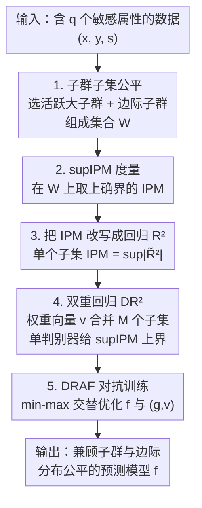

# Doubly-Regressing Approach for Subgroup Fairness

**会议**: ICLR 2026  
**OpenReview**: [https://openreview.net/forum?id=17UDRTRLmp](https://openreview.net/forum?id=17UDRTRLmp)  
**代码**: https://github.com/subgroup-fair/draf  
**领域**: AI安全 / 算法公平  
**关键词**: 子群公平, 分布公平, 对抗学习, IPM, 数据稀疏

## 一句话总结
当敏感属性很多导致子群数量爆炸、很多子群样本极少时，本文提出"子群子集公平"概念并用 supIPM 度量，再通过一个把权重向量和判别器同时回归的"双重回归 $R^2$（DR²）"代理目标，只用**单个判别器**就能同时保证所有大子群和边际属性的分布公平，在子群极度稀疏的数据集上显著优于现有方法。

## 研究背景与动机

**领域现状**：算法公平里，当只有一个敏感属性（如性别）时，要求模型预测在各受保护组上分布一致，即边际公平（marginal fairness）。但现实中往往同时有性别、种族、年龄等多个敏感属性，于是人们转向子群公平（subgroup fairness）：要求 $f(X)$ 的分布在所有 $2^q$ 个交叉子群 $D_v=\{i:s_i=v\}$ 上都一致。

**现有痛点**：随着敏感属性个数 $q$ 增大，子群数 $2^q$ 指数级膨胀，带来两个硬伤：一是**数据稀疏**——很多子群只有寥寥几个样本，经验子群公平 gap 根本不是总体 gap 的可靠估计；二是**计算负担**——要算子群公平 gap 需要在 $2^q$ 个约束上分别度量分布差异，分布型度量（如 IPM/MMD）每个还得跑一遍对抗优化，代价高到无法承受。

**核心矛盾**：现有方法在"保证强公平"和"计算/统计可行"之间二选一。有的退而求其次只用弱公平（如均值 DP）或后处理，牺牲了分布公平这种最强的公平；有的（如只做边际公平）会被"公平操纵"（fairness gerrymandering）钻空子——每个属性上都公平、但交叉子群（如"少数族裔女性"）仍被系统性歧视；还有的（贝叶斯借信息）不保证边际公平，社会上无法解释。

**本文目标**：设计一个学习算法，**同时**化解数据稀疏与计算负担，并**同时**达到（足够大的）子群公平和边际公平，且都在最强的分布公平意义下。

**切入角度**：既然小子群上的经验公平无法泛化到总体，干脆只对样本量足够大的子群较真——作者把"若干子群的并集"定义为一个**子群子集** $W$，只在预先挑好的、不太小的子群子集上强制分布公平。再把每个边际属性对应的子群也塞进这个集合 $\mathcal{W}$，就能顺带保证边际公平。

**核心 idea**：用"子群子集公平 + 单判别器的双重回归代理"替代"逐个子群跑对抗"，把指数级的公平约束压缩成一次 min-max 优化。

## 方法详解

### 整体框架

整篇方法围绕一个目标：在数据稀疏、$q$ 很大的情况下，找到一个既准确、又对"所有值得保护的子群"分布公平的预测模型 $f$。作者的做法是先**换一个公平的对象**（从全部 $2^q$ 子群换成预选的子群子集集合 $\mathcal{W}$），再**换一种度量方式**（把分布差异 IPM 重写成回归里的 $R^2$），最后**换一个可微的代理**（双重回归 DR²，只用单个判别器近似所有子集的 supIPM 上界），用对抗学习一并优化。

整条流水线是：① 选定子群子集集合 $\mathcal{W}$——把样本量大于 $\gamma n$ 的活跃子群、加上一阶/二阶边际子群都放进去；② 用 supIPM（在 $\mathcal{W}$ 上取上确界的 IPM）作为分布公平的总度量；③ 借 Theorem 4.1 把单个子集的 IPM 等价改写成回归 $R^2$，再用权重向量 $v$ 把 $M$ 个子集"线性合成"成 DR²，从而只需一个判别器 $g$ 就能给出 supIPM 的上界；④ 用 DRAF 算法交替优化预测模型 $f$ 与判别器-权重对 $(g,v)$，完成对抗训练。

### 关键设计

**1. 子群子集公平与 supIPM：只对足够大的子群子集较真**

直接对全部 $2^q$ 子群强制公平既算不动也估不准，作者把"公平的对象"重新定义。任取 $W\subseteq\{0,1\}^q$ 称为一个子群子集，令 $P_{f,W}$ 是给定 $S\in W$ 时 $f(X)$ 的条件分布。对一族子群子集 $\mathcal{W}$ 和分布度量 $\psi$，定义子群子集公平 gap 为

$$\Delta_{\psi,\mathcal{W}}(f)=\sup_{W\in\mathcal{W}}\psi(P_{f,W},P_{f,W^c}).$$

关键在于**怎么选 $\mathcal{W}$**：只放样本量不太小的子群（$n_W\ge\gamma n$，称活跃子群），同时把每个敏感属性对应的边际子群 $W_{j,s}=\{i:s_{ij}=s\}$ 也加进去——前者解决稀疏、后者保证边际公平、避免公平操纵。当 $\psi$ 取 IPM 时，$\Delta_{\psi,\mathcal{W}}$ 就叫 **supIPM**。Theorem 3.1 给出了它的统计保证：经验 supIPM 的估计误差是 $O(\sqrt{\log|\mathcal{W}|/n_{\mathcal{W}}})$，其中 $n_{\mathcal{W}}=\min_{W\in\mathcal{W}}\min\{n_W,n-n_W\}$ 是集合里最小子集的规模。这意味着只要保证最小子集足够大，就可以把 $\mathcal{W}$ 尽量做大——误差几乎不随 $|\mathcal{W}|$ 增长（只进对数项），这正是"只保护大子群"在统计上站得住脚的依据。

**2. 把单个 IPM 改写成回归 $R^2$：给度量找一个可微的等价形式**

IPM 定义为 $\mathrm{IPM}_\mathcal{G}(P_0,P_1)=\sup_{g\in\mathcal{G}}|\int g\,dP_0-\int g\,dP_1|$，本质是判别器在两个分布上输出均值之差。对单个子集 $W$ 做公平诊断的经典思路，是训一个以 $f_i=f(x_i,s_i)$ 为输入、以 $y_{W,i}=2\mathbb{I}(s_i\in W)-1$ 为标签的判别器看它分得开不开。误分类率不可微，作者改用**残差平方和 RSS** $\sum_i(y_{W,i}-g(f_i))^2$——$f$ 越公平、$W$ 与 $W^c$ 上分布越像，判别器越难拟合标签、RSS 越大。进一步把它整理成回归分析里的判定系数

$$R^2(f,W,g)=1-\frac{\sum_i(y_{W,i}-g(f_i))^2}{\sum_i(y_{W,i}-\bar y_W)^2},$$

$f$ 越公平该值越小。令人惊讶的是（Theorem 4.1）：对其稍作修正得到的 $\tilde R^2$ 满足 $\mathrm{IPM}_\mathcal{G}(P_{f,W},P_{f,W^c})=\sup_{g}|\tilde R^2(f,W,g)|$，即 **IPM 精确等于一个可微的 $R^2$ 上确界**，且这个量就是类别标签与判别器输出之间的（平方）相关。这一步把抽象的分布度量翻译成了回归语言，为下一步"用一个判别器统管所有子集"埋下伏笔。

**3. 双重回归 $R^2$（DR²）：用权重向量把 $M$ 个子集压成一个判别器**

Theorem 4.1 把单个子集搞定了，但 $\Delta_{n,\mathcal{W},\mathcal{G}}(f)=\sup_{W}\sup_g\tilde R^2$ 仍要对每个 $W$ 单独求判别器——$W$ 是离散的、没法梯度优化。作者的核心 trick 是引入一个**权重向量** $v\in\mathbb{S}^M$（$M$ 维单位球面）把 $M$ 个子集"线性合成"。给每个样本一个隶属编码 $c_i=[c_{i1},\dots,c_{iM}]^\top$（$c_{im}=2\mathbb{I}(s_i\in W_m)-1$），定义双重回归 $R^2$：

$$\mathrm{DR}^2(f,v,g)=1-\frac{\sum_i(v^\top c_i-g(f_i))^2-\sum_i(g(f_i)-\mu_v)^2}{\sum_i(v^\top c_i-\mu_v)^2}.$$

之所以叫"双重回归"，是因为它**同时回归** $g(f_i)$（判别器侧）和 $v^\top c_i$（子集合成侧）。当 $v=e_k$（只在第 $k$ 维取 1）时 DR² 退化为 $\tilde R^2(f,W_k,g)$，因此 $\sup_{g,v}|\mathrm{DR}^2|$ 是 supIPM 的一个**上界**。为数值稳定，最终代理目标对 $|\mathrm{DR}^2|/2$ 套了 Fisher z 变换：$\mathrm{DR}_{n,\mathcal{W},\mathcal{G}}(f)=\sup_{g,v}\,z\text{-}\mathrm{DR}^2$。这样无论 $|\mathcal{W}|=M$ 多大，公平度量都只需**一个**判别器 $g$ 加一个 $M$ 维向量 $v$，计算量与子集个数解耦——这正是化解计算负担的关键。实验还发现训练后 $v$ 几乎收敛到单纯形的顶点，使 DR² ≈ 单子集的 $\tilde R^2$，说明上界相当紧。

**4. DRAF 对抗训练：min-max 把公平约束并进损失**

有了可微的 DR gap，作者把它当正则项加进经验风险，得到 DRAF（Doubly Regressing Adversarial learning for Fairness）的训练目标：

$$\min_f\ \frac1n\sum_i \ell(y_i,f(x_i,s_i))+\lambda\,\mathrm{DR}_{n,\mathcal{W},\mathcal{G}}(f),$$

其中 $\ell$ 是交叉熵、$\lambda$ 是拉格朗日乘子控制公平强度。优化是标准的对抗 min-max 交替：固定 $(g,v)$，对 $f$ 做梯度下降最小化"风险 + $\lambda\cdot z\text{-}\mathrm{DR}^2$"；再固定 $f$，对 $(g,v)$ 做梯度上升最大化 $z\text{-}\mathrm{DR}^2$（找出当前最"不公平"的方向）。整个过程只有单个判别器参与，因此即便 $q$ 很大、$\mathcal{W}$ 很大，实际计算量也可接受。

### 损失函数 / 训练策略
- 目标：$\frac1n\sum_i\ell(y_i,f(x_i,s_i))+\lambda\,\mathrm{DR}_{n,\mathcal{W},\mathcal{G}}(f)$，$\ell$ 取交叉熵。
- $\lambda$ 在 $0.01\sim10.0$ 之间扫描以调节准确率-公平权衡。
- 判别器 $\mathcal{G}$ 采用 sIPM 的判别器类（sigmoid ∘ 线性），实验证明它比 ReLU-IPM、Hölder-IPM 更稳更好。
- 阈值 $\gamma$（决定哪些子群算"大"）按验证集上 Acc–SP 的 Pareto 前沿面积最大来选，四个数据集分别取 0.01 / 0.01 / 0.2 / 0.001；$\mathcal{W}$ 同时纳入一阶、二阶边际子群。

## 实验关键数据

### 主实验

四个公平基准数据集，模型为单层 MLP，重复 5 次取平均。对比方法：REG（只压各属性边际差异）、GerryFair/GF（压最坏子群差异）、SEQ（预训练后逐子群映射到公共重心，后处理）。评价用准确率 Acc 与公平度量 SP（子群）、MP(l)（l 阶边际）、WMP（分布型边际）。

| 数据集 | $q$ / 子群数 | 稀疏子群数 | DRAF 表现 |
|--------|------|------|------|
| ADULT | 4 / 16 | 2 | 与 REG、GF 相当（训练集上三者几乎一致） |
| DUTCH | 2 / 4 | 0 | 与 REG、GF 相当 |
| CIVILCOMMENTS | 3(非二值) / 24 | 3 | SP 上优于 REG，小 MP(1) 时优于 GF |
| COMMUNITIES | 18 / 262,144(实际 1,180) | 1,175 | 子群+一阶边际公平均优于 REG，一阶边际优于 GF |

核心结论：在子群**不太稀疏**的数据上 DRAF 与基线打平；在**极度稀疏**的 COMMUNITIES 上明显领先——说明只压边际（REG）或只压子群（GF）都次优，而 DRAF 能两者兼顾。

### 消融与分析实验

| 配置 / 分析 | 关键发现 |
|------|---------|
| DR gap vs supIPM | 二者强相关且训练后几乎相等（$v$ 收敛到单纯形顶点），证明 DR 是 supIPM 的有效代理 |
| SP vs MP(1) 相关性 | DRAF 拟合的线性 SSE 普遍小于 GF、REG（COMMUNITIES 上差距最大），说明 DRAF 能用一个 $\lambda$ 同时控住子群与边际公平 |
| $\mathcal{W}$ 去掉边际子群 | 一阶/二阶边际公平变差，印证必须把边际子群纳入 $\mathcal{W}$ |
| $\gamma$ 过大 | 排除了高阶边际子群，二阶边际与子群公平都退化；建议取中等 $\gamma$ |
| 判别器 $\mathcal{G}$ 选择 | sIPM 优于 ReLU-IPM、Hölder-IPM，最稳 |
| 噪声敏感属性（1% 缺失） | DRAF 可对缺失样本只在可观测属性构成的子集上施加约束，trade-off 优于必须丢弃样本的 GF |

### 关键发现
- **DR² 上界很紧**：训练后权重向量 $v$ 几乎落在单纯形顶点，使 DR² 退化成单子集 $\tilde R^2$，因此"单判别器代理"几乎不损失精度。
- **稀疏越严重，优势越大**：DRAF 的相对收益集中在 COMMUNITIES 这种 99% 子群都极小的数据集上，验证了"只保大子群 + 双重回归"的设计动机。
- **边际子群不可省**：从 $\mathcal{W}$ 中剔除边际子群会直接损害边际公平，说明 supIPM 框架同时容纳子群与边际是必要的。
- **可扩展性**：方法可平滑推广到多分类、Equalized Odds（DRAF-EO 与 FairICP 相当），并对缺失敏感属性更鲁棒。

## 亮点与洞察
- **把分布度量翻译成回归语言**：Theorem 4.1 证明 IPM 精确等于回归 $R^2$ 的上确界，这个"度量↔相关性"的等价非常优雅，让对抗公平有了可微、可解释的新视角。
- **权重向量解耦计算与约束数**：用 $v\in\mathbb{S}^M$ 把 $M$ 个离散子集合成一个连续可优化对象，从而单判别器统管所有约束——这是把"$2^q$ 个约束"压成"一次 min-max"的命门，可迁移到任何"对一大族子集/约束求上确界"的对抗场景。
- **只保护能泛化的子群**：Theorem 3.1 把"忽略小子群"从工程妥协升格为有统计依据的选择（误差只随 $\log|\mathcal{W}|$ 增长），思路清爽。

## 局限与展望
- **小子群仍无保障**：作者坦言对极小子群的公平本质上无法保证（$\gamma$ 再小也不行），方法只对能泛化的中大子群有效——对真正的少数群体保护有限。
- **$\gamma$ 与 $\mathcal{W}$ 需调**：$\gamma$ 的选择依赖验证集 Pareto 前沿，纳入几阶边际子群也要人工权衡，过大 $\gamma$ 会反伤高阶边际公平。
- **代理是上界而非等价**：DR gap 只是 supIPM 的上界，虽实验显示很紧，但理论上紧度依赖 $v$ 收敛到顶点这一经验现象，缺乏一般性保证。
- **展望**：作者提出可像 ANOVA 分解那样把子群公平拆成低阶边际公平的组合来控制，既提升稀疏下的稳定性与可解释性，也可推导子群公平关于低阶边际公平的上界。

## 相关工作与启发
- **vs GerryFair (Kearns et al., 2018)**：GF 用拉格朗日 min-max 压最坏子群差异、按子群大小加权缓解稀疏，但不显式针对分布公平、$q$ 大时计算昂贵，且不保证边际公平；DRAF 在分布公平意义下同时管住子群与边际，单判别器计算可控。
- **vs REG（边际正则）**：REG 只压各属性边际差异，易被公平操纵；DRAF 通过把边际子群纳入 $\mathcal{W}$ 顺带保证边际公平。
- **vs 贝叶斯借信息 (Foulds et al., 2019)**：用大子群信息估计小子群，但不保证边际公平、社会上难解释；DRAF 框架天然兼顾边际。
- **vs 后处理 SEQ (Hu et al., 2024)**：先训无公平约束模型再逐子群映射到公共重心，属后处理、公平水平不可调；DRAF 是 in-processing，可用单一 $\lambda$ 连续调节。
- **vs sIPM / FairICP (Kim et al., 2022; Lai & Guan, 2025)**：DRAF 沿用 sIPM 判别器类，并把 FairICP 针对的 Equalized Odds 也纳入（DRAF-EO），表现相当。

## 评分
- 新颖性: ⭐⭐⭐⭐⭐ "子群子集公平 + IPM↔R² 等价 + 双重回归单判别器"是一套自洽且少见的组合
- 实验充分度: ⭐⭐⭐⭐ 四个数据集 + 多公平度量 + 充分消融，但子群极稀疏的真实大规模场景仍偏少
- 写作质量: ⭐⭐⭐⭐ 理论铺陈清晰、定理与算法衔接顺，符号略密集
- 价值: ⭐⭐⭐⭐ 为多敏感属性下的分布公平提供了可扩展、可解释的实用算法

<!-- RELATED:START -->

## 相关论文

- [\[ICLR 2026\] Certifying the Full YOLO Pipeline: A Probabilistic Verification Approach](certifying_the_full_yolo_pipeline_a_probabilistic_verification_approach.md)
- [\[CVPR 2026\] $\varphi$-DPO: Fairness Direct Preference Optimization Approach to Continual Learning in Large Multimodal Models](../../CVPR2026/ai_safety/φ-dpo_fairness_direct_preference_optimization_approach_to_continual_learning_in_.md)
- [\[ICLR 2026\] Bridging Fairness and Explainability: Can Input-Based Explanations Promote Fairness in Hate Speech Detection?](bridging_fairness_and_explainability_can_input-based_explanations_promote_fairne.md)
- [\[AAAI 2026\] ProbLog4Fairness: A Neurosymbolic Approach to Modeling and Mitigating Bias](../../AAAI2026/ai_safety/problog4fairness_a_neurosymbolic_approach_to_modeling_and_mitigating_bias.md)
- [\[ICML 2025\] Doubly Robust Fusion of Many Treatments for Policy Learning](../../ICML2025/ai_safety/doubly_robust_fusion_of_many_treatments_for_policy_learning.md)

<!-- RELATED:END -->
