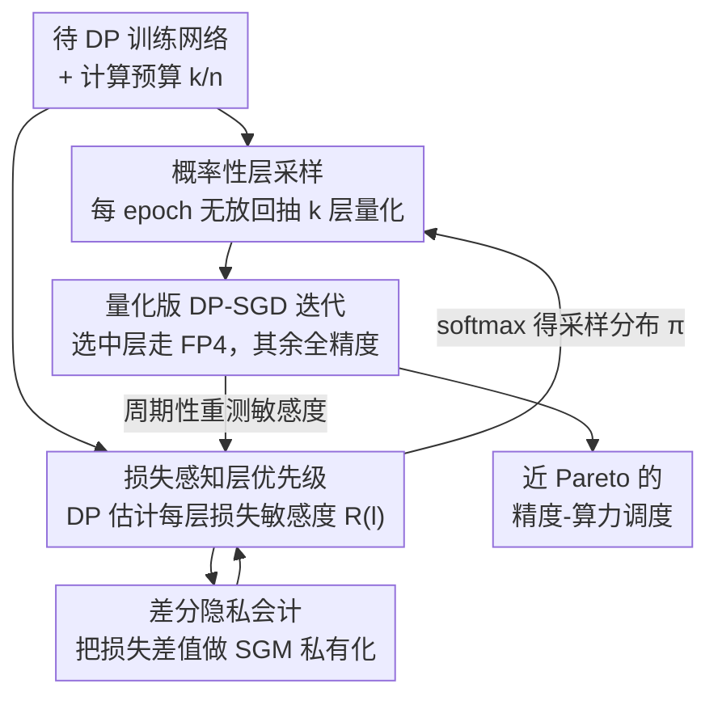

# DPQuant: Efficient and Private Model Training via Dynamic Quantization Scheduling

**会议**: ICLR2026  
**OpenReview**: [https://openreview.net/forum?id=neaxYXGYd5](https://openreview.net/forum?id=neaxYXGYd5)  
**代码**: 待确认  
**领域**: AI安全 / 差分隐私 / 量化训练  
**关键词**: 差分隐私, DP-SGD, 量化, 动态调度, 训练加速

## 一句话总结
DPQuant 首次指出"低比特量化在差分隐私（DP）训练里会造成远比普通训练严重的精度崩塌"，并用"每个 epoch 概率性轮换被量化的层 + 用 DP 损失敏感度估计器优先量化低影响层"两招把量化方差压下去，在 ResNet/DenseNet/BERT 上做到掉点 <2%、理论加速最高 2.21×。

## 研究背景与动机
**领域现状**：用敏感数据训练神经网络时，DP-SGD（以及自适应版 DP-Adam）通过"逐样本梯度裁剪 + 加高斯噪声"提供形式化隐私保证，是隐私训练的事实标准。与此同时，把权重和激活转成低精度格式（量化，如 FP8/INT4/FP4）能大幅降低算力、显存、能耗和成本——新硬件（NVIDIA Blackwell 的 FP4 给到 FP16 的 4× 吞吐、AMD/TPU/Trainium 的 FP8、高通 Hexagon 的 INT4）都在往超低精度走。把两者结合，理应在边缘联邦学习这类算力受限场景里带来巨大收益。

**现有痛点**：作者发现，把超低精度量化直接套到 DP 训练上会导致严重精度退化——最差能掉 40%。在普通（非 DP）SGD 下全量化通常只掉约 1%，而同样配置在 DP-SGD 下能掉到 5%，并且"量化哪几层"带来的性能方差也大得多。也就是说，普通训练里"量化几乎无损"的经验，在 DP 训练里完全失效。

**核心矛盾**：根本原因在 DP 注入的噪声。DP-SGD 的更新是 $w_{t+1}=w_t-\eta(\bar g_t+n_t)$，其中裁剪后梯度满足 $\|\bar g_t\|_2\le C$，噪声 $n_t\sim N(0,\sigma^2C^2 I)$。由于噪声标准差与裁剪梯度的 2-范数同阶，在高维下 $\|\bar g_t\|_2\gg\|\bar g_t\|_\infty$，于是 $\|n_t\|_\infty\approx\|\bar g_t\|_2\gg\|\bar g_t\|_\infty$（实测噪声幅度平均是裁剪梯度元素的 25 倍）。噪声主导的权重更新会把下一轮"原始梯度"的 $\infty$-范数顶到 $O(\|g_t\|_2)$ 量级，而量化器方差正比于 $\|x\|_\infty^2$（命题 1：$\mathrm{Var}(q(x))=\Theta(\|x\|_\infty^2)$）。两者叠加，DP 下量化方差从 $O(\|g_t\|_\infty^2)$ 被放大到 $O(\|g_t\|_2^2)$，远大于普通训练，导致收敛变慢、精度崩塌。

**本文目标**：设计一个自动机制，在尽量不损失精度、又几乎不额外消耗隐私预算的前提下，对 DP 训练做有效量化。

**切入角度**：作者观察到——不需要每层、每个 epoch 都量化；只量化一部分层、并且每个 epoch 轮换这个子集，就能保住大部分量化带来的效率收益，同时把精度拉回来。

**核心 idea**：用"概率性层采样（轮换被量化的层，摊薄方差）+ 损失感知层优先级（用 DP 估计器把高影响层留在全精度）"组成一个**动态量化调度器**，整套调度本身也满足差分隐私。

## 方法详解

### 整体框架
DPQuant 是一个套在标准 DP 训练循环外面的"动态量化调度器"。输入是一个待 DP 训练的网络和一个计算预算（即希望每个 epoch 量化 $k/n$ 层），输出是一份逐 epoch 变化的"该量化哪些层"的策略，使得在该预算下精度尽量贴近 Pareto 前沿。它的运转可以拆成三块：先用一个**轻量分析步骤**在私有数据子集上测每层被量化后带来的损失增量 $R(l_i)$（这步本身要做 DP 化、消耗很小一份隐私预算）；再把这些敏感度通过 softmax 转成一个**采样分布** $\pi_i$，每个 epoch 据此**无放回地抽 $k$ 层**去量化；被选中的层用 LUQ-FP4 做低精度前向/反向，其余层保持全精度，照常跑量化版 DP-SGD 迭代。如此循环：训练几步 → 重新测损失敏感度 → 更新策略 EMA → 重新采样层集合。

### 关键设计

**1. 概率性层采样：靠轮换把量化方差摊薄到全网**

这一招直接针对"DP 下量化方差被噪声放大"的痛点。设某层以概率 $p$ 被量化，$g_{fp}$ 为其全精度梯度、$g_{quant}$ 为量化后梯度，由前面的分析有 $\mathrm{Var}(g_{fp})\le\mathrm{Var}(g_{quant})$，于是该层梯度的期望方差为

$$\mathbb{E}\big(\mathrm{Var}(g)\big)=(1-p)\,\mathrm{Var}(g_{fp})+p\,\mathrm{Var}(g_{quant})\le \mathrm{Var}(g_{quant}).$$

只要 $p<1$（即每个 epoch 只量化一个子集），平均量化方差就严格小于"全量化"。更关键的是**每个 epoch 轮换**被量化的层：这样没有任何一层会被反复、持续地承受全量化方差，长期来看每层的期望方差都被压低。换句话说，它不是减少量化总量，而是把同样的量化"摊"到不同层、不同 epoch 上，避免方差在少数固定层上累积——这正是普通训练用不上、但 DP 训练急需的稳定性手段。

**2. 损失感知层优先级：把"伤精度"的层留在全精度**

光靠随机轮换还不够好——消融显示纯概率采样（PLS）虽然稳定超过静态基线，但和"最优层选择"之间仍有明显差距，说明总有些关键层被错误地量化、严重拖垮精度。于是作者定义量化策略 $p$（要量化的层集合）的期望损失增量

$$R(p):=\mathbb{E}_D\big[L(M_p(D))-L(M_{fp32}(D))\big],$$

目标是找 $R(p)$ 小的策略。由于 $R(p)$ 的期望要在私有数据集 $D$ 上取，直接算既贵又会破坏隐私，所以改成**子采样 + 跑少量 DP-SGD 迭代得到代理损失**来估计：对每个策略和"无量化基线"各跑 $R$ 次迭代取平均损失，再做差。拿到每层敏感度 $R(l_i)$ 后，用带温度的 softmax 转成采样概率

$$\pi_i:=\frac{\exp(-\beta R(l_i))}{\sum_{j=1}^n\exp(-\beta R(l_j))},\quad i=1,\dots,n,$$

$\beta>0$ 控制"多大程度上偏好低影响层"。每个 epoch 按 $\{\pi_i\}$ **无放回**抽 $k$ 层量化——既倾向于挑低敏感度层，又在敏感度相近的层之间继续随机轮换，把设计 1 的方差摊薄和设计 2 的"保护关键层"合在一起。消融里这一招（+LLP）在量化比例越高时收益越大，因为此时随机基线把关键层抽中量化的概率也越大，而 DPQuant 能稳稳地把它们留在全精度。

**3. 差分隐私会计：让敏感度估计也"不泄密"且几乎不花预算**

设计 2 直接在私有数据 $D$ 上算损失差，本身是一次对敏感数据的查询，如果原样发布就会破坏 DP-SGD 提供的隐私保证。作者把这步整流程套成一个**采样高斯机制（SGM）**：从 $D$ 里随机子采样一批、把损失值裁剪到范数上界 $C$ 以限制敏感度，再加尺度为 $\sigma$ 的高斯噪声（对应算法 1 的第 3 步）：

$$\hat R\leftarrow R\cdot\min\!\Big(1,\tfrac{C}{\|R\|_2}\Big)+N(0,\sigma^2C^2 I).$$

命题 2 证明算法 1 是采样率 $q=|B|/|D|$、噪声尺度 $\sigma$ 的 SGM，于是可以直接复用 Opacus 的隐私会计器把"分析"和"训练"放进同一本隐私账里累加，并借助高级组合定理拿到更紧的总隐私支出上界。最后用 EMA 平滑策略 $L[p]\leftarrow(1-\alpha)L[p]+\alpha\hat R[p]$，降低单次噪声估计的抖动。实验（图 3）表明：分析消耗的隐私预算相对训练可忽略，几乎不影响最终模型质量——这是整套"动态调度"能在 DP 框架里成立的前提。

> 对 DP-Adam/DP-AdamW 同样成立：Adam 的预条件器对信号和噪声做相同的逐坐标缩放、保持二者相对比例，所以在强 DP 区（$\sigma C\gg\|g\|_2\gg|g_i|$）逐坐标信噪比 $\mathrm{SNR}_i\approx g_i^2/(\sigma^2C^2)$ 与 DP-SGD 一致，量化开销也一样，DPQuant 的结论可平移过去。

### 损失函数 / 训练策略
没有改训练目标本身，仍是标准的 DP-SGD/DP-Adam（裁剪 + 加噪）。新增的可调参数包括：量化比例（计算预算）$k/n$、温度 $\beta$、敏感度分析的频率（实验里常用每 2 个 epoch 测一次）、分析的迭代数 $R$、子采样批 $B$、损失裁剪范数 $C$、分析噪声尺度 $\sigma$、EMA 系数 $\alpha$。低精度格式用的是 LUQ-FP4（1 符号位 + 3 指数位的 4-bit 浮点，当前性能最强的 4-bit 量化格式），附录里也测了 FP8 和 4-bit 均匀量化。

## 实验关键数据

### 主实验
评测模型 ResNet18/50、DenseNet121（DP-SGD）与 BERT（DP-AdamW），数据集含 EMNIST、GTSRB、CIFAR-10、SNLI；基于 Opacus 实现。下表节选 $\varepsilon=8$ 下不同量化比例的验证精度（Baseline 为静态量化，取若干随机层子集的均值±标准差；Ours 为 DPQuant 调度）：

| 模型 / 数据集 | 量化比例 | Baseline (ε=8) | DPQuant (ε=8) |
|--------------|---------|----------------|---------------|
| ResNet18 / GTSRB | 0.5 | 69.06 ± 5.63 | **76.75** |
| ResNet18 / GTSRB | 0.9 | 57.49 ± 4.46 | **67.67** |
| ResNet50 / GTSRB | 0.75 | 58.13 ± 8.50 | **69.03** |
| ResNet50 / GTSRB | 0.9 | 47.40 ± 7.23 | **59.87** |
| DenseNet121 / GTSRB | 0.5 | 65.47 ± 5.42 | **71.05** |
| BERT / SNLI | 0.5 | 62.54 ± 4.54 | **67.80** |

在 $\varepsilon=4$ 和 $\varepsilon=8$ 两种隐私预算下，DPQuant 在多数设置上以至少 1 个标准差的优势超过静态基线，且不超隐私预算；即便 $\varepsilon=4$（分析的隐私成本占比更突出）也仍能产出接近最优的量化调度，对 $\varepsilon$ 鲁棒。附录中 $\varepsilon=1$ 的极小预算下也保持同样收益。

### 消融实验

| 配置 | 关键现象 | 说明 |
|------|---------|------|
| baseline（静态量化） | 最差 | 固定层量化，随机选层时可掉 40% |
| +PLS（概率层采样） | 稳定优于 baseline | 但与"最优层选择"仍有明显差距 |
| +PLS+LLP（再加损失感知优先级） | 最好 | 关键层被留在全精度，量化比例越高收益越大 |

### 关键发现
- 把量化方差从 $O(\|g\|_\infty^2)$ 放大到 $O(\|g\|_2^2)$ 的"噪声 → 大梯度 → 大量化方差"链条，是 DP 量化掉点的根因（图 1 实证：DP 下原始梯度范数约 2× 于 SGD）。
- 两招缺一不可：纯 PLS 只摊薄方差但救不了"关键层被量化"，加上 LLP 才把高影响层保住，二者组合达到最佳。
- 理论加速：假设 90% 层量化、FP4 相对 FP16 取保守的 4× 单算子加速，按线性算力模型 $T_{ours}=T_{analysis}+(1-p+p/4)(T_{train}-T_{overhead})+T_{overhead}$ 估计，DPQuant 比 FP16 基线快 1.75×–2.21×，且 LLP 的运行时开销极小。

## 亮点与洞察
- **把"普通训练量化几乎无损"的直觉打破在 DP 场景**：作者用 $\|n\|_\infty\approx\|\bar g\|_2\gg\|\bar g\|_\infty$ 加命题 1 的 $\mathrm{Var}(q(x))=\Theta(\|x\|_\infty^2)$，干净地解释了为什么 DP 下量化方差被放大一个范数量级——这是全文最漂亮的"为什么"。
- **"轮换"作为方差控制手段很可迁移**：把同样的量化预算在层与 epoch 之间打散、不让任何固定层长期吃满量化方差，这种思路可推广到其他"随机扰动 + 低精度"叠加的训练场景。
- **让"该量化哪层"的决策本身满足 DP**：把损失敏感度估计套成 SGM、用 Opacus 会计器与训练共账，证明额外隐私成本可忽略——这是把"自适应调度"安全地塞进 DP 训练的关键工程洞察。

## 局限与展望
- **加速是理论估计而非实测**：FP4 的 MatMul/Conv2D 硬件（如 Blackwell）尚未普及，2.21× 来自线性算力模型 + 厂商/前作的 4× 假设，真实端到端收益待硬件落地后验证。
- **敏感度估计有额外计算成本**：每隔若干 epoch 要子采样跑代理损失，虽隐私成本可忽略，但带来一定运行时开销（已计入 overhead），在更深网络/更频繁分析时的 wall-clock 表现需进一步评估。
- **评测以视觉分类 + 单个 NLP 任务为主**：模型规模偏中小（ResNet/DenseNet/BERT），是否能平滑迁移到大模型预训练、生成式任务的 DP 训练仍是开放问题。

## 相关工作与启发
- **vs 训练后量化（PTQ）/ 量化感知训练（QAT）**：PTQ 只加速推理、不优化训练；QAT 虽在低精度训练但要硬件模拟/敏感度估计/量化器调参，开销常抵消比特位加速，更适合推理。DPQuant 针对的是"DP 训练阶段"的算力，且把敏感度估计做成 DP 化的轻量步骤。
- **vs 梯度压缩 / 把量化当隐私机制**：梯度压缩降的是分布式通信成本、不降算术成本，且常依赖全梯度或误差反馈，难在 DP 约束下满足；"量化即隐私"类工作在全精度算完梯度后才量化，不影响前后向。DPQuant 是在训练中量化权重和激活来降算术成本。
- **vs 混合精度 DP 训练 / 改进 DP 机制**：16-bit 混合精度与 DP-SGD 兼容、几乎无损，但推到 FP4/INT4 在 DP 下会崩（本文第 4 节解释）；改进 DP 优化器或裁剪实现的工作与 DPQuant 正交——后者保持稠密全模型，只优化"多少计算能跑在低精度"。

## 评分
- 新颖性: ⭐⭐⭐⭐⭐ 首次系统揭示并解释 DP 训练下超低精度量化的崩塌机理，并给出可证明 DP 的动态调度解法。
- 实验充分度: ⭐⭐⭐⭐ 多模型/数据集/隐私预算覆盖充分、消融清晰，但加速为理论估计、缺真实 FP4 硬件端到端验证。
- 写作质量: ⭐⭐⭐⭐⭐ 从现象到范数分析到方法到隐私会计层层递进，公式与动机咬合紧密。
- 价值: ⭐⭐⭐⭐ 为隐私 + 高效训练的交叉点扫清一个关键障碍，对边缘/联邦 DP 训练有直接落地价值。

<!-- RELATED:START -->

## 相关论文

- [\[ICML 2025\] Private Model Personalization Revisited](../../ICML2025/ai_safety/private_model_personalization_revisited.md)
- [\[ICLR 2026\] LiteGuard: Efficient Task-Agnostic Model Fingerprinting with Enhanced Generalization](liteguard_efficient_task-agnostic_model_fingerprinting_with_enhanced_generalizat.md)
- [\[ICLR 2026\] Missing Mass for Differentially Private Domain Discovery](differentially_private_domain_discovery.md)
- [\[ICLR 2026\] Differentially Private Two-Stage Gradient Descent for Instrumental Variable Regression](differentially_private_two-stage_gradient_descent_for_instrumental_variable_regr.md)
- [\[ICLR 2026\] PE-SGD: Differentially Private Deep Learning via Evolution of Gradient Subspace for Text](pe-sgd_differentially_private_deep_learning_via_evolution_of_gradient_subspace_f.md)

<!-- RELATED:END -->
