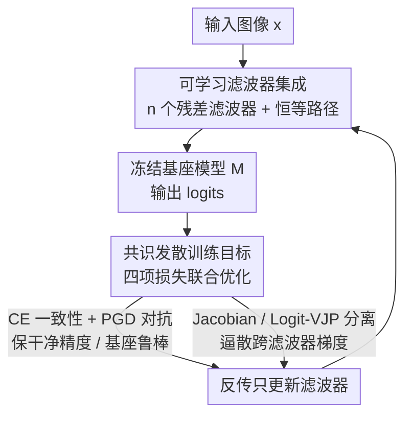

# DRIFT: Divergent Response in Filtered Transformations for Robust Adversarial Defense

**会议**: ICLR2026  
**OpenReview**: [https://openreview.net/forum?id=AYH7uBK1Gg](https://openreview.net/forum?id=AYH7uBK1Gg)  
**代码**: 待确认  
**领域**: AI安全 / 对抗鲁棒 / 对抗防御  
**关键词**: 对抗防御, 梯度共识, 可学习滤波器, 自适应攻击, 鲁棒精度

## 一句话总结
DRIFT 在冻结分类器前面挂一组轻量可学习滤波器，用"共识发散"损失主动把不同滤波器的梯度方向逼散，从而打掉对抗扰动赖以迁移的"梯度共识"；在 ImageNet 上对 CNN 和 ViT，面对 PGD-EoT、AutoAttack、BPDA 等强自适应攻击都拿到当前最好的鲁棒精度，而几乎不增加推理开销。

## 研究背景与动机
**领域现状**：对抗防御的主流做法大致分四类——输入变换（JPEG 压缩、BaRT 随机模糊/加噪）、随机平滑、对抗训练（AT），以及近年的扩散净化（DiffPure/DiffDefense，把对抗样本"投影回"数据流形）。这些方法在弱攻击下都能给出一定鲁棒性。

**现有痛点**：一旦攻击者能可靠地估计梯度，大部分防御就崩了。输入变换类不可微、靠梯度混淆（gradient masking）撑场面，遇到 BPDA（用恒等/平均池化近似变换的反向梯度）就失效；随机平滑可以用 EoT（Expectation over Transformation，对多次随机前向求平均梯度）逼近真梯度；扩散净化在 ImageNet 规模上算不动、不适合实时，而且只要攻击者把净化步骤纳入优化回路就会被破。

**核心矛盾**：作者把根因归结为一个被忽视的现象——**梯度共识（gradient consensus）**。哪怕防御加了随机性，不同随机变换得到的梯度方向往往仍然彼此对齐、构成一个低方差的"代理梯度地形"。攻击者用 EoT 把这些梯度一聚合，对齐分量浮现出来，就能造出跨变换都有效（可迁移）的扰动。也就是说，问题不在"随机性不够"，而在"梯度还是一致的"。

**本文目标**：与其继续藏梯度（masking），不如**毁掉梯度的对齐**。如果不同变换的梯度互相发散，攻击者把它们加总就只得到一堆相互冲突、去相关的噪声信号，迁移性自然被压垮。

**切入角度**：作者先把"梯度共识 → 迁移性"这件事形式化并给出理论界，再据此设计训练目标，让一组可微滤波器**主动**学出彼此发散的梯度几何，同时保持干净预测不变。

**核心 idea**：用"让梯度发散"取代"让梯度消失"——训练一组轻量可学习滤波器，最大化它们在 Jacobian 空间和 logit 空间的响应分歧，从源头瓦解对抗迁移所依赖的梯度共识。

## 方法详解

### 整体框架
DRIFT 在一个**冻结**的预训练分类器 $M$ 前面挂上一组轻量、可微、保持维度的滤波器 $\{f_i\}_{i=1}^n$（外加一条恒等路径 $f_{\text{id}}(x)=x$），构成 $n$ 条"滤波器→基座"的流水线 $F_i(x)=M(f_i(x))$。推理时随机抽一条流水线给出预测，因此对外是一个随机集成；训练时则用一个把四项损失加权相加的"共识发散"目标，**只更新滤波器、不动 backbone**。目标的核心是两项分离损失：它们度量不同滤波器对随机探测方向的梯度响应有多相似，并惩罚这种相似度，逼着各滤波器学出去相关的梯度方向；与此同时一项交叉熵保证干净精度、一项 PGD 对抗损失保证每条流水线扛得住基座梯度上造出来的攻击。整条管线即插即用，对任意预训练分类器都不需要改结构或重训。

### 关键设计

**1. 梯度共识：把对抗迁移性的根因量化出来**

作者先用链式法则把一条流水线的输入梯度拆开：$\nabla_x \ell(F_i(x),y) = J_{f_i}(x)^\top J_M(f_i(x))^\top \nabla_z \ell(z,y)$，说明对抗方向由 logit 空间因子 $\nabla_z\ell$ 和两个 Jacobian（$J_M$、$J_{f_i}$）共同塑形——这正是 DRIFT 想去解耦的对象。在此基础上定义两滤波器在输入 $x$ 处的**梯度共识**为归一化梯度的平方余弦相似度 $\Gamma(f_i,f_j;x)=\big(\tfrac{\langle g_i,g_j\rangle}{\|g_i\|\,\|g_j\|}\big)^2\in[0,1]$，其中 $g_i=\nabla_x\ell(M(f_i(x)),y)$。$\Gamma$ 高表示两条流水线共享对抗有用方向（迁移性强），低则表示梯度子空间发散。作者进一步给出定理：在 $L$-光滑、梯度有界假设下，用 $f_i$ 上的梯度造出的扰动 $\delta$ 迁移到 $f_j$ 的成功率被 $\Gamma$ 线性界住——$p_j(x,\delta)\le C\cdot\epsilon G\cdot\Gamma(f_i,f_j;x)$；若整体期望共识 $\mathbb{E}_{i\ne j}[\Gamma]\le\rho\ll1$，则跨滤波器迁移成功率只有 $O(\epsilon G\rho)$。这条理论把"降低共识"和"降低迁移性"严格挂钩，直接告诉后面的损失该优化什么。

**2. 可学习滤波器集成：即插即用的轻量残差前端**

为了既能扭转梯度几何、又不破坏干净预测，每个滤波器实现成一个轻量残差卷积块：$f(x)=x+\text{Conv}_{16\to3}(\text{ReLU}(\text{Conv}_{3\to16}(x)))$（$3\times3$ 卷积先升到 16 通道、ReLU、再降回 3 通道，最后跳连加回输入）。残差结构让 $f$ 天然贴近恒等映射，所以干净图像几乎不被改动，但又有足够自由度去学一个能让对抗梯度发生分歧的变换。因为保持输入形状，$J_{f_i}(x)$ 是方阵、$M$ 无需任何改动就能处理 $f_i(x)$，整套防御对 backbone 是即插即用的（默认 $n=4$ 个滤波器）。训练里还显式纳入**恒等路径**：它堵住了"攻击者只盯 $M$ 自身梯度、绕过滤波器结构"的盲点，强迫防御对忽略滤波器的攻击也鲁棒。与 BaRT 等靠手工固定随机变换、不可微的方案相比，DRIFT 的滤波器是学出来、可微、专为鲁棒优化的。

**3. 共识发散训练目标：四项损失把梯度逼散**

训练目标把设计 1 的"低 $\rho$"诉求落地成两项分离损失，再配两项保底损失，加权求和 $L=\alpha L_{CE}+\beta_{JS}L_{JS}+\beta_{LVJP}L_{LVJP}+\lambda L_{adv}$。其中 **Jacobian 分离损失** 在特征层惩罚不同滤波器的向量-Jacobian 积（VJP）对齐：$L_{JS}=\mathbb{E}_{i<j}\mathbb{E}_v[\cos^2(J_{f_i}(x)^\top v,\,J_{f_j}(x)^\top v)]$，用随机探测向量 $v$（Hutchinson 探针）做反向自动微分即可估计，无需显式构造 Jacobian；**Logit-VJP 分离损失** 在决策层惩罚对齐：$L_{LVJP}=\mathbb{E}_{i<j}\mathbb{E}_w[\cos^2(\nabla_x\langle M(f_i(x)),w\rangle,\,\nabla_x\langle M(f_j(x)),w\rangle)]$，用随机方向 $w\in\mathbb{R}^K$ 探测各滤波器把输入扰动传播成类别决策的方式。两者一个管 Jacobian 子空间发散、一个管 logit 子空间发散，正好把 $\Gamma$ 的两个因子都压低。**交叉熵损失** $L_{CE}=\tfrac1K\sum_i\ell(M(f_i(x)),y)$ 保住每条流水线的干净精度，**对抗损失** $L_{adv}=\max_i\ell(M(f_i(x+\delta_M)),y)$ 则用只在基座 $M$ 上跑 PGD 得到的扰动 $\delta_M$ 训练滤波器扛住基座梯度空间里的直接攻击。四项合起来让滤波器同时做到"干净预测稳定、Jacobian/logit 子空间发散、对基座与跨滤波器攻击都鲁棒"。

### 损失函数 / 训练策略
默认 $n=4$ 个滤波器，$\epsilon=4/255$，PGD 迭代 $T=10$、步长 $\eta=\epsilon/T=0.4/255$；权重 $\alpha=1,\ \beta_{JS}=0.5,\ \beta_{LVJP}=0.5,\ \lambda=1$，分离损失各用 5 个随机探针，训练 100 epoch；优化器 AdamW，学习率 $1\text{e-}3$、权重衰减 $1\text{e-}4$。训练数据从 ImageNet 验证集随机抽子集、剩余部分专门留作评测，保证滤波器训练不接触测试样本。

## 实验关键数据

### 主实验（非自适应，ϵ=4/255 for ℓ∞，ϵ=1 for ℓ₂）
攻击者有基座白盒访问权但不知道部署了防御。DRIFT 在保住干净精度的同时，对各类攻击的鲁棒精度都领先：

| 模型 | 防御 | No Attack | PGD ℓ∞ | AutoAttack | Square |
|------|------|-----------|--------|-----------|--------|
| ResNet-v2 | JPEG (q=50) | 44.97 | 41.27 | 8.99 | 8.47 |
| ResNet-v2 | BaRT (k=5) | 50.79 | 23.28 | 12.70 | 15.34 |
| ResNet-v2 | DiffPure | 67.79 | 65.43 | 67.01 | 62.88 |
| ResNet-v2 | **DRIFT (n=4)** | **84.66** | **76.19** | **74.30** | **80.95** |
| ViT-B/16 | DRIFT (n=4) | 80.48 | 74.66 | 77.30 | 77.30 |
| Inception-v3 | DRIFT (n=4) | 80.96 | 76.83 | 76.50 | 79.89 |
| DeiT-S | DRIFT (n=4) | 82.42 | 76.67 | 76.24 | 80.07 |

JPEG/BaRT 即便不受攻击也把干净精度砸到 44~50%，而 DRIFT 在 ResNet-v2 上维持 84.66% 干净精度并把 AutoAttack 鲁棒精度做到 74.30%（DiffPure 仅 67.01%）。

### 自适应攻击（BPDA+EoT / EoT，ϵ=4/255，40 步）
这才是真正考验：传统输入变换在自适应下几乎归零。

| 防御 | 自适应 | ResNet-v2 PGD | ResNet-v2 AA | ViT-B/16 PGD | ViT-B/16 AA |
|------|--------|---------------|--------------|--------------|-------------|
| JPEG | BPDA+EoT | 0 | 0 | 0 | 0 |
| BaRT | BPDA+EoT | 6.0 | 0 | 7.31 | 4.67 |
| DiffPure | EoT | 36.43 | 40.93 | NA | NA |
| **DRIFT** | EoT | 53.78 | 50.12 | 56.74 | 54.90 |
| **DRIFT** | BPDA+EoT | **60.19** | **58.73** | **64.17** | **61.23** |

JPEG/BaRT 在自适应下崩到 10% 以下，AT/FFR+AT/ANF+AT 只有部分鲁棒且干净精度明显下滑，DiffPure 在该硬件上 BPDA+EoT 直接因显存爆炸算不动；DRIFT 在四个 backbone 上对 BPDA+EoT 仍保住 50% 以上。

### 消融实验（自适应 PGD 鲁棒精度）

| 损失配置 | ResNet-v2 非自适应 | ResNet-v2 自适应 |
|----------|-------------------|------------------|
| $L_{CE}+L_{adv}$ | 75.66 | 3.70 |
| $+L_{JS}$ | 77.21 | 39.80 |
| $+L_{LVJP}$（单加）| — | 47.61 |
| 全部（$L_{CE}+L_{JS}+L_{LVJP}+L_{adv}$）| ≈75+ | **53.78** |

### 关键发现
- 只有 CE+对抗训练时，非自适应还能到 75.66%，但自适应直接崩到 3.70%——说明对抗训练本身扛不住 EoT/BPDA。
- 两项分离损失是自适应鲁棒的命门：加 $L_{JS}$ 把自适应从 3.70% 拉到 39.80%，$L_{LVJP}$ 更强（单加到 47.61%），三者齐全做到 53.78%，且**不牺牲**非自适应精度。
- 对比随机平滑：在 ℓ₂ 各半径下 DRIFT 的经验鲁棒精度普遍高于 SmoothAdv/CAF（ResNet-50 上比 SmoothAdv 高 +9.1~+19.5 点），但作者强调 RS 是**认证**值、DRIFT 是**经验**值，两者不能当等价保证比较。

## 亮点与洞察
- **把"随机防御为什么没用"诊断成梯度共识**：很多随机防御失败不是随机性不够，而是不同随机分支的梯度还对齐着——这个视角既给了可证明的迁移性上界，又直接指明"要优化谁"，比经验式堆随机扰动有说服力。
- **"让梯度发散"而不是"让梯度消失"**：DRIFT 保持完全可微，刻意避开梯度混淆带来的"虚假鲁棒"陷阱，所以对 BPDA 这类专破混淆的攻击天然免疫——这是它和 JPEG/BaRT 的根本区别。
- **VJP + Hutchinson 探针让 Jacobian 分离可算**：高维下根本造不出完整 Jacobian，用随机探测向量做反向 AD 就能无偏估计跨滤波器的梯度相似度，这套"探针化"技巧可迁移到任何需要约束 Jacobian 几何的训练目标。
- **即插即用、几乎零开销**：滤波器是贴近恒等的轻量残差块、backbone 冻结不重训，对实时大规模部署友好，迁移成本远低于对抗训练/扩散净化。

## 局限与展望
- 鲁棒精度是**经验**结果而非认证保证，不能像随机平滑那样给出"半径内必不变"的证书；论文也明确提醒别把 DRIFT 数字和 RS 认证值混为一谈。
- DiffPure 在 BPDA+EoT 下因硬件显存限制无法跑出完整梯度（标 NA），部分对比是在受限条件下进行的，强基线的上限未必被完全测到。
- 评测主要在 ImageNet 验证子集与四个代表性 backbone 上，更大扰动预算、更多威胁模型（如 ℓ₀/语义攻击）下的表现还需进一步验证。
- 自适应鲁棒虽显著领先，绝对值仍在 50~64% 区间，离"高安全场景可放心部署"还有距离；滤波器数量、探针数等超参对鲁棒性的影响（附录有初步探索）值得更系统的研究。

## 相关工作与启发
- **vs BaRT / JPEG（输入变换）**：它们靠手工固定的随机/不可微变换混淆梯度，自适应下（BPDA+EoT）几乎归零；DRIFT 学出可微滤波器、主动逼散梯度，保持可微反而免疫 BPDA。
- **vs 对抗训练（AT/FFR+AT/ANF+AT）**：AT 直接在对抗样本上重训 backbone，代价高、掉干净精度、对未见威胁泛化差且仍栽在 EoT 上；DRIFT 冻结 backbone、只训轻量前端，干净精度和自适应鲁棒兼得。
- **vs DiffPure（扩散净化）**：靠扩散把输入投影回流形，小数据集上效果强但 ImageNet 规模算不动、实时不可行，且把净化纳入优化回路就会被破；DRIFT 轻量在线、不做生成式重建。
- **vs 随机平滑（RS/SmoothAdv/CAF）**：RS 给认证半径但需多次平滑前向、且是认证而非经验防御；DRIFT 给的是自适应白盒下的经验鲁棒，数值更高但不构成认证保证。

## 评分
- 新颖性: ⭐⭐⭐⭐⭐ 把"梯度共识"形式化并证明它控制迁移性，再据此设计"让梯度发散"的防御，视角和理论都很扎实
- 实验充分度: ⭐⭐⭐⭐ 覆盖 CNN/ViT 四个 backbone、白盒/迁移/黑盒/自适应多种攻击与消融，但部分强基线受硬件限制未测满
- 写作质量: ⭐⭐⭐⭐ 理论与方法衔接清晰、动机层层递进，公式与表格自洽
- 价值: ⭐⭐⭐⭐⭐ 即插即用、近零开销且对自适应攻击大幅领先，"破坏梯度对齐"作为通用防御原则有较强可迁移性

<!-- RELATED:START -->

## 相关论文

- [\[ICLR 2026\] Adversarial Attacks Already Tell the Answer: Directional Bias-Guided Test-time Defense for Vision-Language Models](adversarial_attacks_already_tell_the_answer_directional_bias-guided_test-time_de.md)
- [\[ICLR 2026\] Zero-Sacrifice Persistent-Robustness Adversarial Defense for Pre-Trained Encoders](zero-sacrifice_persistent-robustness_adversarial_defense_for_pre-trained_encoder.md)
- [\[ICLR 2026\] Robust Spiking Neural Networks Against Adversarial Attacks](robust_spiking_neural_networks_against_adversarial_attacks.md)
- [\[CVPR 2026\] AdvMark: Decoupling Defense Strategies for Robust Image Watermarking](../../CVPR2026/ai_safety/decoupling_defense_strategies_for_robust_image_watermarking.md)
- [\[ICLR 2026\] Discrete Latent Features Ablate Adversarial Attack: A Robust Prompt Tuning Framework for VLMs](discrete_latent_features_ablate_adversarial_attack_a_robust_prompt_tuning_framew.md)

<!-- RELATED:END -->
