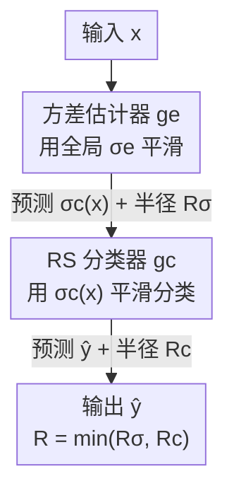

# Dual Randomized Smoothing: Beyond Global Noise Variance

**会议**: ICLR 2026  
**OpenReview**: [https://openreview.net/forum?id=syvfsHSqm2](https://openreview.net/forum?id=syvfsHSqm2)  
**代码**: https://github.com/eth-sri/Dual-Randomized-Smoothing  
**领域**: AI安全 / 认证鲁棒性  
**关键词**: 随机平滑, 认证鲁棒性, 输入相关噪声, 准确率-鲁棒性权衡, 专家路由

## 一句话总结
本文指出标准随机平滑（RS）用一个全局噪声方差服务所有输入，导致小半径和大半径无法兼顾；作者先从理论上证明只要噪声方差在认证区域内"局部恒定"RS 认证依然成立，进而提出**双 RS 框架**——先用一个 RS 模型为每个输入预测最优方差、再用另一个 RS 分类器在该方差下分类，在 CIFAR-10 和 ImageNet 上同时拿到了小半径和大半径的强性能，推理开销仅增加约 60%。

## 研究背景与动机

**领域现状**：随机平滑（Randomized Smoothing, RS）是当前最主流的认证 $\ell_2$ 鲁棒性方法。它给输入加高斯噪声 $\delta\sim\mathcal{N}(0,\sigma^2 I)$、对预测取多数投票，构造出平滑分类器 $g_c(x)=\arg\max_y P_\delta[f(x+\delta)=y]$，并保证在认证半径 $R=\sigma\Phi^{-1}(p_\sigma)$ 内输出不变（$\Phi$ 是标准正态 CDF）。近年扩散去噪平滑（denoised smoothing）把现成扩散模型当去噪器，进一步把小半径的认证准确率推到了 SOTA。

**现有痛点**：认证半径公式 $R=\sigma\Phi^{-1}(p_\sigma)$ 里，$\sigma$ 是个全局常数——所有输入共用一个噪声方差。$\sigma$ 小则小半径准、但大半径直接归零；$\sigma$ 大则大半径有保障、但小半径准确率塌掉。论文 Fig. 1 直接给出证据：把每个样本"使认证半径最大的最优 $\sigma$"统计出来，分布横跨 0.125 到 1.0，说明根本不存在一个全局 $\sigma$ 能同时照顾所有样本。

**核心矛盾**：这个准确率-鲁棒性权衡的根子，就在"全局共享一个 $\sigma$"这个假设上。不同样本想要的噪声尺度天差地别，强行用一个数去拟合，必然是顾此失彼。

**切入角度**：那能不能让 $\sigma$ 随输入变化（input-dependent）？此前已有尝试，但都各有硬伤：一类（Alfarra/Wang）依赖**测试时记忆**——把输入空间切成若干"鲁棒区域"、运行时存储分配结果，既不能并行推理又依赖历史测试样本；Súkeník 等基于 Neyman-Pearson 引理证明，导致 $\sigma(x)$ 的灵活性被严重限制；Jeong & Shin 的 Multiscale 总是选"能认证该输入的最大方差"，系统性高估，结果常常次优。

**核心 idea**：作者的关键洞察是——**RS 认证并不需要 $\sigma$ 全局恒定，只要它在认证区域内"局部恒定"就成立**。基于这个放松，作者用一个独立的 RS 模型去学习并认证每个输入的最优 $\sigma$，再交给标准 RS 分类器使用，从而彻底摆脱全局方差的束缚，且无需测试时记忆。

## 方法详解

### 整体框架

双 RS（Dual RS）把"该用多大噪声"和"分类"拆成两段串行的 RS：第一段是**方差估计器** $g_e$，用一个固定的全局方差 $\sigma_e$ 平滑，对输入 $x$ 预测一个最优噪声方差 $\sigma_c(x)$，并给出这个估计的认证半径 $R_\sigma$（即在 $B(x,R_\sigma)$ 内 $\sigma_c$ 保持恒定的保证）；第二段是**标准 RS 分类器** $g_c$，用刚预测出的 $\sigma_c(x)$ 去平滑、做最终分类，给出分类的认证半径 $R_c$。最终预测取第二段的 $\hat{y}$，而最终认证半径是两段的较小值 $R_{\text{final}}=\min(R_\sigma, R_c)$——这个 min 由本文的核心定理保证。为了不让第一段反过来限制最终半径，作者要求 $\sigma_e\ge\max_{\sigma_c\in\Sigma}\sigma_c$。两段默认都用扩散去噪平滑（单步去噪 + 基模型）实现，估计器的标签集 $\Sigma$ 是一个离散集合（如 CIFAR-10 用 $\{0.25,0.5,1.0\}$）。

### 关键设计

**1. 局部恒定方差的认证推广：把"全局常数"放松成"局部常数"**

这一步是整个框架的理论地基，针对的正是"全局 $\sigma$ 导致权衡"这个根本痛点。作者把 Cohen et al. (2019) 的认证结论从"$\sigma$ 在整个输入空间恒定"放松到"$\sigma$ 在认证区域内恒定"。具体地（定理 4.1），固定 $x_0$ 与基分类器 $f_c$，若 $\sigma(x)$ 在球 $B(x_0,R_\sigma)$ 内恒定，则对所有满足 $\|x-x_0\|_2\le\min(R_\sigma, R(x,\sigma(x_0)))$ 的 $x$，都有 $g_c(x,\sigma(x))=g_c(x_0,\sigma(x_0))$。证明思路是借用 Salman et al. (2019) 基于 Lipschitz 连续性的论证，从而摆脱对"$\sigma$ 全局恒定"的依赖——这也正是绕开 Súkeník 等人 Neyman-Pearson 路线灵活性受限的关键。

由于实际中 $\sigma(x)$ 也只能由 RS 概率性地认证，作者进一步给出概率版定理 4.2：若分类在 $B(x_0,R_c)$ 内以概率 $\ge 1-\alpha$ 鲁棒、且 $\sigma(x)$ 在 $B(x_0,R_\sigma)$ 内以概率 $\ge 1-\beta$ 恒定，则在 $\|x-x_0\|_2\le\min(R_\sigma,R_c)$ 内，预测一致的概率 $\ge 1-\alpha-\beta$。这里通过并集界（union bound）把两个失败事件的概率相加，且**不假设两事件独立**，所以即便两次认证用了相关噪声也依然成立。$\beta$ 是为认证 $\sigma(x)$ 局部恒定多付的置信代价，但实验发现这个代价对认证半径影响极小。正是这个 $\min(R_\sigma,R_c)$ 结构，决定了框架里"两个半径取小"的最终半径。

**2. 双 RS 两阶段框架：用一个 RS 去认证另一个 RS 的输入**

这是定理在系统层面的落地。痛点是：怎样既让 $\sigma$ 随输入变化、又不靠测试时记忆？作者的做法是把"预测最优 $\sigma_c$"本身也当成一个分类任务，再套一层 RS。形式上两个模型分别为

$$g_e(x,\sigma_e):=\arg\max_{\sigma_i\in\Sigma}P_{\delta_e\sim\mathcal{N}(0,\sigma_e^2 I)}\big(h_e(\text{denoise}(x+\delta_e))=\sigma_i\big),$$

$$g_c(x,\sigma_c):=\arg\max_{\hat{y}\in Y}P_{\delta_c\sim\mathcal{N}(0,\sigma_c^2 I)}\big(h_c(\text{denoise}(x+\delta_c))=\hat{y}\big),$$

其中 $h_e,h_c$ 分别是方差估计与分类的基模型。推理时先用 Cohen 的 `PREDICT` 以不确定度 $\alpha/2$ 预测 $\sigma_c(x)$，再以 $\alpha/2$ 预测类别 $\hat{y}$，总不确定度 $\alpha$；认证时用 `CERTIFY` 分别认证 $\sigma_c(x)$ 的局部恒定性（得 $R_\sigma$）和分类（得 $R_c$），最终半径 $R_{\text{final}}=\min(R_\sigma,R_c)$。直觉上，方差估计器把输入空间划分成对应不同 $\sigma_c$ 的若干子集、并把输入（及其邻域）分到对应子集——这恰好就是"鲁棒性"的定义，所以用 RS 来认证它天然契合。相比靠存储分区的旧方法，这里的局部恒定性是被一个**可学习模型**认证出来的，从而完全不需要测试时记忆，且可并行推理。

**3. 方差估计器的训练：软标签 + 一致性正则 + 类别再平衡**

预测最优 $\sigma$ 这个分类任务有个特殊性：即便预测错了 $\sigma_c$，认证半径也常常不是零。比如 $\Sigma=\{0.25,0.5,1.0\}$，样本 $x_1$ 三个 $\sigma$ 下的半径是 $0.0/1.6/0.0$，而 $x_2$ 是 $0.3/0.4/0.3$——$x_1$ 选错的代价远大于 $x_2$。为此作者不用 0/1 硬标签，而用**软标签**把半径转成软目标：

$$y_i=\frac{\exp(R_c(x,\sigma_i))}{\sum_{\sigma_j\in\Sigma}\exp(R_c(x,\sigma_j))},$$

再用交叉熵对软标签训练。其次，为了提升估计器自身的认证半径（即 $R_\sigma$，否则它会拖累最终的 min），引入**一致性正则** $L_{\text{con}}(x)=\lambda\,\mathbb{E}_\delta[\mathrm{KL}(\hat{f}(x)\|f(x+\delta))]+\eta H(\hat{f}(x))$，鼓励估计器在噪声下输出稳定。整体目标为 $L_\sigma=\mathbb{E}_x[w_e(x)(L_{\text{softCE}}(x)+w_r(x)L_{\text{con}}(x))]$：$w_e(x)=1/q_i$ 是平衡权重（$q_i$ 为最优 $\sigma_i$ 样本占比），用来纠正最优 $\sigma$ 分布的高度偏斜；$w_r(x)$ 有强/弱两版，分别用估计器预测的最大/最小方差对应半径来设，强版更激进地要求大半径（适合 CIFAR-10 这类易任务），弱版更保守（适合 ImageNet）。构建训练标签时用较小预算 $N=100$ 估计 $R_c(x,\sigma_i)$ 即可（匹配一次 RS 推理的成本），并丢弃所有 $\sigma$ 下半径都为零的样本以降噪。此外，固定估计器后还会按 Carlini 的思路微调分类器 $h_c$ 以适配输入相关的噪声，二者交替训练，实践中**一轮分类器微调通常就够**。

**4. 专家路由视角：把方差估计器当作专家 RS 模型的路由器**

设计 2 默认让同一个分类器 $h_c$ 在所有 $\sigma_i$ 下都表现好，但 RS 文献早已公认"没有单一模型能在所有噪声尺度上通吃"。好在定理 4.2 并不要求各 $\sigma_i$ 下用同一个 $h_c$。于是作者把方差估计器重新解读为**路由器**：令 $\mathcal{H}=\{H_{\sigma_i}\}$ 是一池预训练专家、$X_{\sigma_i}:=\{x\mid g_e(x,\sigma_e)=\sigma_i\}$ 是被路由到 $\sigma_i$ 的输入子集，则定义 $g_c(x,\sigma(x)):=H_{\sigma_i}(x,\sigma_i)$ 对所有 $x\in X_{\sigma_i}$。训练流程几乎不变，只是 $R_c(x,\sigma_i)$ 改用对应专家 $H_{\sigma_i}$ 评估。这一视角的好处是：能直接复用现成专家（省去从头训一个全能分类器）、能接入在特定噪声段最强的专家、新增专家只需轻量重训路由器、且专家变强会严格带动整体变强；代价是每个 $X_{\sigma_i}$ 上的性能被对应专家上界封顶。作者还指出该路由思路可推广到确定性认证方法，留作未来工作。

### 损失函数 / 训练策略

核心训练目标即设计 3 的 $L_\sigma=\mathbb{E}_x[w_e(x)(L_{\text{softCE}}(x)+w_r(x)L_{\text{con}}(x))]$（软标签交叉熵 + 一致性正则 + 类别平衡）。整体采用交替训练：先基于现成分类器从零训方差估计器，再做一轮分类器微调，更多轮收益递减但成本陡增。认证统一用 $N=10{,}000$ 噪声样本、总不确定度 $\alpha=0.001$。

## 实验关键数据

### 主实验

CIFAR-10 上，扩散去噪平滑做基分类器，$\Sigma=\{0.25,0.5,1.0\}$；ImageNet 上 $\Sigma=\{0.5,1.0\}$。下表为微调后与 SOTA 输入相关方法 Multiscale 的对比（认证准确率 %，CIFAR-10）：

| 半径 $r$ | Multiscale | Dual RS（本文） | 优势 |
|---------|-----------|----------------|------|
| 0.25 | 54.78 | 57.48 | +2.70 |
| 0.50 | 39.15 | 45.27 | 相对 +15.6% |
| 0.75 | 28.46 | 34.15 | 相对 +20.0% |
| 1.00 | 21.33 | 24.68 | 相对 +15.7% |
| 1.50 | 11.40 | 12.46 | +1.06 |
| 2.50 | 2.34 | 3.14 | +0.80 |

可以看到 Dual RS 在大多数半径上一致超过 Multiscale，小半径段提升尤其明显。对比单一全局 $\sigma$ 的 Carlini 基线：$\sigma=0.25$ 在 $r\ge1.0$ 直接归零、$\sigma=1.0$ 在 $r=0$ 只有 47.98%，而 Dual RS 在全半径段都保持非平凡精度。ImageNet 上 Dual RS 相对 Multiscale 在半径 0.5/1.0/1.5 分别领先 8.6%/17.1%/9.1%。开销方面，单张 RTX 4090、batch 1000、$N=10{,}000$ 下，Dual RS 平均 22.58 秒/样本，标准 RS 14.07 秒、Multiscale 20.21 秒——仅约 60% 额外开销，且对所有输入耗时固定（Multiscale 对小半径样本需多轮认证，最坏可达 42.21 秒）。

### 消融实验

| 配置（方差估计器训练） | 现象 | 说明 |
|----------------------|------|------|
| 标准 CE | 估计准确率最高但半径次优 | 只追求选对最优 $\sigma$ |
| Soft CE | 选对比例略降，但大 $\Delta R_c$ 样本更少 | 几乎一致优于标准 CE |
| Soft CE + 一致性（弱/强） | 小半径略降、大半径提升 | 强版让更少样本被 $R_\sigma$ 约束 |
| $\Sigma$ 候选集变化 | 强烈影响偏好半径 | 与全局方差方法同理 |
| 训练用更小 $N$ / 更小训练集 | 性能几乎不降 | 成本最多降 99% / 80% |
| 估计器架构变化 | 性能稳健 | 对架构不敏感 |

作者定义 $\Delta R_c:=R_c^*(x)-R_c(x)$ 衡量因方差估计次优损失的半径，$\Delta R_\sigma:=R_\sigma-R_c$ 衡量最终半径被哪一段约束（负值表示被 $R_\sigma$ 卡住）。结果显示：软 CE 让更少样本被 $R_\sigma$ 约束，加一致性正则进一步显著降低该比例，强版一致性权重效果最好——综合下来"软 CE + 一致性"取得最佳准确率-鲁棒性权衡。

### 关键发现
- 一致性正则的作用不是提升"选对 $\sigma$"的准确率（它反而略降），而是抬高估计器自身的认证半径 $R_\sigma$，让最终的 $\min(R_\sigma,R_c)$ 更少被前半段拖累——这是理解整个训练设计的钥匙。
- 构建训练标签可以用比认证小得多的 $N=100$、甚至只用部分训练集，几乎不掉点，把"为每个输入跑多次认证"这一最贵步骤的成本压下来。
- 候选集 $\Sigma$ 决定整体偏好的半径区间，和全局方差方法里"$\sigma$ 决定偏好半径"是同一个道理，只是这里被搬到了离散选择层面。

## 亮点与洞察
- **把"选噪声"也变成一次 RS**：最巧的一招是认识到"为输入预测最优 $\sigma$"本身满足鲁棒性的定义，于是直接套第二层 RS 来认证它的局部恒定性，既拿到了理论保证又甩掉了测试时记忆——一个干净的"用 RS 认证 RS 的输入"结构。
- **min 半径 + union bound 的诚实组合**：最终半径取 $\min(R_\sigma,R_c)$、失败概率取 $\alpha+\beta$ 且不假设独立，这套构造让整个框架在概率意义上严格自洽，$\beta$ 的代价实测可忽略。
- **路由视角是免费的副产品**：同一个方差估计器换个解读就成了专家路由器，能即插即用现成专家模型、且"专家越强整体越强"，把认证鲁棒性和 MoE 路由两条线接上了，迁移性很好。

## 局限与展望
- 框架引入了第二个 RS 模型，推理开销增加约 60%、置信预算需要在两段间分摊（各 $\alpha/2$），虽然实测代价小，但在更严苛的 $\alpha$ 下分摊可能更敏感。
- 路由模式下整体性能被各子集上对应专家的能力上界封顶，专家不够强时 Dual RS 也无法突破。
- 候选集 $\Sigma$ 是离散且需人工指定的，论文也承认它强烈影响偏好半径——如何自动选 $\Sigma$、或把方差从离散推广到连续，仍是开放问题。
- 实验集中在 CIFAR-10 / ImageNet 的 $\ell_2$ 认证，向其他范数（如 $\ell_\infty$）和更大规模任务的推广尚未验证。

## 相关工作与启发
- **vs Multiscale (Jeong & Shin, 2024)**：它级联多个固定方差模型、总是选"能认证该输入的最大方差"，系统性高估导致次优，且对小半径样本要多轮认证、最坏耗时高；本文用学习到的估计器直接预测最优 $\sigma$、对所有输入耗时固定，且大多数半径上超过它。
- **vs Alfarra/Wang 等输入相关 RS**：它们靠测试时记忆把输入空间切成鲁棒区域并存储分配，无法并行、依赖历史样本；本文用可认证的学习模型保证局部恒定，彻底去掉记忆。
- **vs Súkeník et al. (2022)**：他们基于 Neyman-Pearson 引理证明，导致 $\sigma(x)$ 灵活性受限；本文改用 Lipschitz 连续性的证明路线，允许 $\sigma(x)$ 在认证区域外任意复杂。
- **vs Mueller et al. (2021) 的确定性路由**：他们只能在标准网络与鲁棒网络两者间用确定性认证路由；本文原生支持多模型路由、用更可扩展的 RS 训练并认证路由器，且目标是优化全半径段整体性能。

## 评分
- 新颖性: ⭐⭐⭐⭐⭐ 从"局部恒定"放松出发，把选噪声本身做成一层可认证 RS，思路干净且打通了路由视角
- 实验充分度: ⭐⭐⭐⭐ CIFAR-10/ImageNet 双数据集 + 多角度消融充分，但仅限 $\ell_2$、未覆盖更多范数与更大任务
- 写作质量: ⭐⭐⭐⭐⭐ 定理-框架-训练-实验层层递进，动机用 Fig. 1 直观立住
- 价值: ⭐⭐⭐⭐⭐ 直击 RS 全局方差这一根本权衡，且方法可即插现成专家，实用性强

<!-- RELATED:START -->

## 相关论文

- [\[ICLR 2026\] Label Smoothing Improves Machine Unlearning](label_smoothing_improves_machine_unlearning.md)
- [\[ICML 2025\] Improving the Variance of Differentially Private Randomized Experiments through Clustering](../../ICML2025/ai_safety/improving_the_variance_of_differentially_private_randomized_experiments_through_.md)
- [\[NeurIPS 2025\] Locally Optimal Private Sampling: Beyond the Global Minimax](../../NeurIPS2025/ai_safety/locally_optimal_private_sampling_beyond_the_global_minimax.md)
- [\[ICLR 2026\] The Gaussian-Head OFL Family: One-Shot Federated Learning from Client Global Statistics](the_gaussian-head_ofl_family_one-shot_federated_learning_from_client_global_stat.md)
- [\[ICLR 2026\] Beyond Match Maximization and Fairness: Retention-Optimized Two-Sided Matching](beyond_match_maximization_and_fairness_retention-optimized_two-sided_matching.md)

<!-- RELATED:END -->
