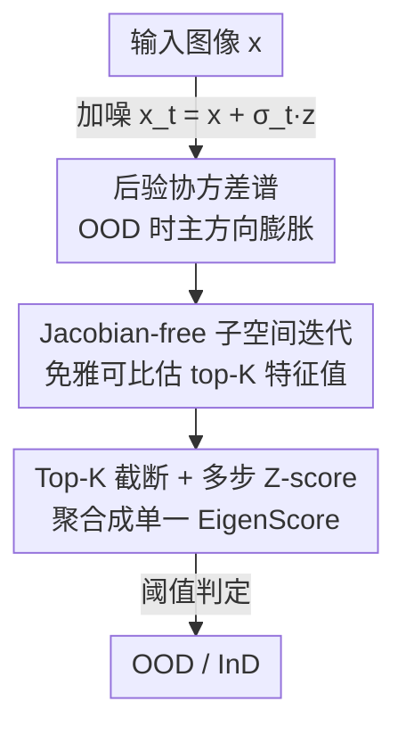

# EigenScore: OOD Detection using Posterior Covariance in Diffusion Models

**会议**: ICLR 2026  
**OpenReview**: [https://openreview.net/forum?id=Dq64kthckN](https://openreview.net/forum?id=Dq64kthckN)  
**领域**: AI安全 / OOD检测 / 扩散模型  
**关键词**: OOD检测, 扩散模型, 后验协方差, 特征值谱, 去噪不确定性

## 一句话总结
本文提出 **EigenScore**：把在 InD 数据上训好的扩散模型搬到 OOD 样本上时，去噪后验协方差会在主方向上系统性膨胀，于是用其**特征值谱**（top-K 特征值之和）作为分布偏移的信号，并用免雅可比的子空间迭代高效估计，在标准 OOD 基准上平均 AUROC 达到 SOTA（最高比最佳基线高约 2%），尤其在 CIFAR-10 vs CIFAR-100 这类近 OOD 场景下不崩。

## 研究背景与动机

**领域现状**：扩散模型不只是会采样，它在去噪过程中显式逼近了 score function $\nabla \log p(x_t)$，因此天然携带了数据分布的统计信息，近年被大量用于无监督 OOD 检测。主流做法分两类：一类是**重建式**（如 DDPM-OOD），假设 InD 样本重建得好、OOD 重建得差，用输入与去噪重建之间的感知/像素差当分数；另一类是**轨迹式**（如 DiffPath），分析去噪轨迹上的 score 范数 $\|\epsilon_\theta(x_t,t)\|$ 及其时间导数。

**现有痛点**：这些标量化指标都不稳。似然（NLL）经常给 OOD 样本反而更高的值，因为扩散模型偏重低层统计而忽略语义；score 范数及其导数在近 OOD（C10 vs C100）场景下两个分布大面积重叠，甚至在某些数据对（C10 vs SVHN）上**排序会反转**——OOD 的分数比 InD 还低，导致阈值彻底失效。重建式方法则隐含假设"分布偏移必然表现为重建质量下降"，但近 OOD 样本往往能被重建得很像样，重建误差这条线索就失灵了。

**核心矛盾**：根子在于"把不确定性塌缩成一个标量"。无论是 MSE、score 范数还是重建误差，都把去噪过程中"在多少个方向上有多大不确定性"压成了一个数，丢掉了不确定性在各主方向上的**结构**。而高噪声下各向同性噪声会主导这个标量，把真正有判别力的类别结构淹没掉。

**本文目标**：找一个既有理论保证、又能在近 OOD 下保持"InD 一定小、OOD 一定大"这种有序分离的信号，并且能在大规模下算得动。

**切入角度**：作者回到后验协方差 $\mathrm{Cov}_p[x|x_t]$ 本身。理论上可以证明 KL 散度（即分布偏移量）等于"用 InD 去噪器在 OOD 输入上的多余去噪误差"，而这个误差恰好等于后验协方差的迹。既然标量迹有信息损失，那就别塌缩——直接看协方差矩阵的**特征值谱**。

**核心 idea**：用"InD 扩散模型作用于 OOD 输入时后验协方差谱的膨胀"作为 OOD 信号，取 top-K 特征值之和、跨多个噪声级做 Z-score 聚合，替代似然/score 范数/重建误差这些会塌缩或反转的标量指标。

## 方法详解

### 整体框架

EigenScore 是无监督、基于特征的检测器：只用 InD 训练数据训一个扩散去噪器，对任意测试图像 $x$ 输出一个 OOD 分数，越大越像 OOD。整体管线是：把图像加噪到若干噪声级 $x_t = x + \sigma_t z$ → 在每个噪声级估计后验协方差 $\Sigma_t(x_t)=\sigma_t^2 \nabla D_p(x_t)$ 的 top-K 特征值 → 把它们累加成该噪声级的不确定性度量 $m_t(x)$ → 跨噪声级拼成特征向量并用训练集统计量做 Z-score 归一化 → 求和得到最终分数 → 阈值判 OOD/InD。整条链路只需要去噪器的前向评估，不需要显式雅可比。

### 关键设计

**1. 后验协方差谱：把分布偏移变成可读的谱膨胀信号**

针对"标量指标会塌缩、会反转"这个痛点，作者先在理论上把分布偏移和后验协方差挂钩。由 Tweedie 公式，MMSE 去噪器 $D_p(x_t)=\mathbb{E}_p[x|x_t]$ 的去噪误差可由全方差定律分解为后验协方差的迹：$\mathrm{MSE}(D_p,t)=\mathbb{E}_{x_t}\big[\mathrm{tr}(\mathrm{Cov}_p[x|x_t])\big]$。同时 Proposition 1 证明 KL 散度 $D_{KL}(p\|q)=\int_0^T [\mathrm{MSE}(D_q,t)-\mathrm{MSE}(D_p,t)]\,\sigma_t^{-3}\,dt$，意味着把 InD 去噪器用到 OOD 输入上时去噪误差在期望意义下**系统性偏大**——这给了一个无需访问 OOD 分布 $q$ 的检测信号，且保证了有序分离（OOD 一定比 InD 大），而非 score 范数那种只反映相对差异、方向不定的量。

再借 Miyasawa 恒等式把协方差写成去噪器雅可比：$\mathrm{Cov}_p[x|x_t]=\sigma_t^2(I+\sigma_t^2\nabla^2\log p(x_t))=\sigma_t^2\nabla D_p(x_t)$。做特征分解 $\Sigma_t=U_t\,\mathrm{diag}(\lambda_1^t,\dots,\lambda_n^t)\,U_t^\top$ 后，迹就是特征值之和，于是 $\mathrm{MSE}(D_p,t)=\mathbb{E}_{x_t}[\sum_k \lambda_k^t]$。InD 样本谱紧凑、leading 特征值小（去噪沿训练数据结构收敛）；OOD 样本不确定性散布到多个本征方向、谱和迹一起膨胀。这就是为什么"看谱"比"看一个标量"更可靠：它保留了不确定性在各方向上的结构。

**2. Jacobian-free 子空间迭代：免雅可比地估 top-K 特征值**

直接构造并对角化雅可比 $\nabla D_p(x_t)$ 在图像维度下代价极高。作者沿用子空间迭代，用**有限差分**近似雅可比-向量积：$v^+ \approx \big(D(x_t+cv)-D(x_t-cv)\big)/2c$，其中 $c\ll 1$ 是线性近似常数，$v$ 是当前主成分、$v^+$ 是下一轮主成分方向，再用 QR 正交化各方向。迭代几步后，第 $k$ 个特征值由

$$\lambda_k^t(x_t)\approx \frac{\sigma_t^2}{2c}\big\|D(x_t+cv_k)-D(x_t-cv_k)\big\|_2$$

得到。整个估计**只用去噪器的前向调用**，不反传、不显式存雅可比，因此能在 CIFAR 这种图像尺度上跑得动，把"后验协方差谱"从理论量变成可计算的实用指标。

**3. Top-K 截断 + 多步 Z-score：从谱到单一 OOD 分数**

为什么只取 top-K 而不是全谱？Lemma 1 指出，当噪声 $\sigma_t\to\infty$ 时 $\Sigma_t\to\sigma_t^2 I$，所有特征值都趋向 $\sigma_t^2$——谱被各向同性噪声"压平"，低方差分量失去判别力。若像 MSE 那样把全谱求和，等于把大量噪声主导的小特征值也算进来。由 Ky Fan 定理（Prop 2），top-K 特征值之和恰好等于所有 $K$ 维投影中能捕获的最大方差，所以**只保留 dominant 模态**就能在丢弃噪声分量的同时留住最有判别力的不确定性方向。

落地时，对每个噪声级取 top-K 之和、在 $I$ 次噪声采样上聚合（mean/median/全集）得 $m_t(x)=\sum_{k=1}^K \lambda_k^t$，拼成特征向量 $M(x)=[m_1(x),\dots,m_T(x)]^\top$；再用训练集统计量 $(\mu_t,\sigma_t)$ 做 Z-score 归一化 $z_t(x)=(m_t(x)-\mu_t)/\sigma_t$，最终分数 $S_\theta(x)=\sum_{t=1}^{T} z_t(x)$。多噪声级 + Z-score 让不同尺度的谱信息可比、可叠加，是把谱信号转成一个稳健阈值量的关键工程步。

### 损失函数 / 训练策略
方法本身**不引入新训练目标**：去噪器照常用标准 MSE 目标 $L_{MSE}=\mathbb{E}[\|x-D_\theta(x_t,t)\|_2^2]$ 训练。EigenScore 是纯推理期检测器——训练/验证阶段只是在 InD 训练集上算 $M(x)$ 以估计 $(\mu_t,\sigma_t)$，并在验证集上调时间步数 $T$ 与聚合方式；测试阶段对每个样本算归一化分数并求和。

## 实验关键数据

### 主实验

数据集：CIFAR-10 (C10)、CIFAR-100 (C100)、SVHN、CelebA、TinyImageNet。指标为 AUROC。

| InD–OOD 对（节选） | DDPM-OOD | DiffPathV2 | EigenScore | 说明 |
|--------|------|------|------|------|
| C10 vs C100（近 OOD） | 0.618 | 0.535 | **0.880** | 近 OOD 大幅领先 |
| C100 vs C10（近 OOD） | 0.462 | 0.483 | **0.642** | 重建/轨迹法接近随机 |
| CelebA vs C10 | 0.922 | 1.000 | 0.965 | 易区分场景仍有竞争力 |
| SVHN vs C100 | 0.972 | 0.975 | **0.982** | — |
| **12 对平均** | 0.817 | 0.810 | **0.838** | 平均 SOTA |

近 OOD 专项（Table 2，AUROC 平均）：DDPM-OOD 0.527、LMD 0.580、DiffPath 0.754、**EigenScore 0.849**——在共享低层统计、最难分的近 OOD 上优势最明显。值得注意的是 EigenScore 在 C10 vs C100 上超过 DDPM-OOD，正是因为后者重建质量仍高、看不出差异，而后验不确定性已经膨胀。

### 消融实验

| 配置 | 平均 AUROC | 说明 |
|------|---------|------|
| EigenScore（完整，谱结构） | 0.834 | top-K=3, T=5, mean 聚合 |
| MSE（塌缩成标量迹） | 0.652 | 同设置但用全谱迹 → 掉 ~18 个点 |
| 时间步 T=5 / 7 / 10 | 0.834 / 0.823 / 0.808 | T 大反而略降（高噪声谱压平） |
| 特征值 K=1 / 2 / 3 | 0.840 / 0.838 / 0.834 | K=1 平均最佳，判别力集中在头部模态 |
| 重复次数 I=5 / 15 / 20 | 0.832 / 0.833 / 0.834 | I=5 已够，>15 仅边际收益 |

### 关键发现
- **谱结构 vs 标量塌缩是核心增益**：EigenScore（0.834）相比直接用 MSE 迹（0.652）平均高出约 18 个 AUROC 点，直接验证"保留谱、别塌缩成标量"这一核心论点。
- **少即是好**：$K=1$ 平均表现最佳、$T=5$ 就接近饱和、$I=5$ 已足够——判别信息高度集中在头部少数本征方向与低噪声级，与 Lemma 1（高噪声谱压平）一致，因此计算预算可以压得很小。
- **近 OOD 是最大卖点**：在 C10 vs C100、C100 vs C10 等近 OOD 上，似然/score/重建法普遍接近随机甚至排序反转，EigenScore 仍能稳定分离。

## 亮点与洞察
- **"别把不确定性塌缩成标量"是可迁移的方法论**：很多 OOD/异常检测把高维不确定性压成一个数，本文证明保留特征值谱、只取 top-K 头部模态能显著提升判别力——这套思路可迁移到任何用协方差/雅可比做不确定性量化的任务。
- **理论与算法咬合得很紧**：从 KL 散度 → 多余去噪误差（Prop 1）→ 后验协方差迹（全方差定律）→ Miyasawa 恒等式 → 特征值谱 → Ky Fan top-K 截断（Prop 2），每一步都有定理支撑，最后落到一个只需前向调用的免雅可比算法。
- **免雅可比有限差分估特征值**：用 $\big(D(x_t+cv)-D(x_t-cv)\big)/2c$ 近似雅可比-向量积 + QR 正交化，把"对图像维度雅可比做特征分解"这种看似不可行的操作变得实用。

## 局限与展望
- **依赖学到的去噪器，雅可比未必严格 SPD**：理论推导假设 MMSE 去噪器，但实际神经网络去噪器的雅可比不保证对称半正定，作者在附录讨论了其与谱截断的关系，但实际偏离对信号的影响仍是隐患。
- **超参数需调**：时间步调度、聚合方式、$K$、$I$ 都要在验证集上选，虽然实验显示对它们不太敏感、小预算即可，但仍需 InD 验证数据。
- **评测局限在低分辨率自然图像**：实验集中在 CIFAR/SVHN/CelebA/TinyImageNet 等小图基准，能否扩展到高分辨率、医学影像、自动驾驶等真实安全场景（论文动机里点名的领域）尚未验证。
- **某些数据对仍偏弱**：如 C100 vs CelebA（0.427）、C10 vs SVHN（0.661）等个别对上并非最优，说明谱信号也非万能。

## 相关工作与启发
- **vs DDPM-OOD（重建式）**：DDPM-OOD 用输入与去噪重建的感知/像素差当分数，隐含假设"偏移=重建质量下降"。本文不看重建误差大小，而看后验协方差谱；在近 OOD 下重建仍逼真但谱已膨胀，因此 EigenScore 不崩。
- **vs DiffPath（轨迹/score 范数式）**：DiffPath 用 score 范数及其时间导数，只反映相对差异、方向不定（会排序反转）。本文经 Prop 1 保证 OOD 去噪误差期望更大，给出有序、有方向的分离信号。
- **vs Kamkari et al. 2024（似然几何）**：他们分析生成映射雅可比的奇异值来解释似然 OOD 悖论（混淆径向距离与切向体积）。本文虽同样涉及谱量，但作用对象是去噪器后验协方差、刻画的是**预测不确定性**而非体积畸变，因此在似然几何失效的近 OOD 下依然稳定。

## 评分
- 新颖性: ⭐⭐⭐⭐⭐ 把后验协方差特征值谱作为 OOD 信号，理论链条完整且角度新颖
- 实验充分度: ⭐⭐⭐⭐ 12 个数据对 + 近 OOD 专项 + 多组消融，但仅限低分辨率图像基准
- 写作质量: ⭐⭐⭐⭐⭐ 理论推导清晰，动机—理论—算法咬合紧密
- 价值: ⭐⭐⭐⭐ 近 OOD 鲁棒性强、计算预算可压低，对安全部署有实用价值

<!-- RELATED:START -->

## 相关论文

- [\[ICLR 2026\] Towards a Certificate of Trust: Task-Aware OOD Detection for Scientific AI](towards_a_certificate_of_trust_task-aware_ood_detection_for_scientific_ai.md)
- [\[ICLR 2026\] AP-OOD: Attention Pooling for Out-of-Distribution Detection](ap-ood_attention_pooling_for_out-of-distribution_detection.md)
- [\[ICLR 2026\] SCOPED: Score–Curvature Out-of-Distribution Proximity Evaluator for Diffusion](scoped_scorecurvature_out-of-distribution_proximity_evaluator_for_diffusion.md)
- [\[ICLR 2026\] NatADiff: Adversarial Boundary Guidance for Natural Adversarial Diffusion](natadiff_adversarial_boundary_guidance_for_natural_adversarial_diffusion.md)
- [\[CVPR 2026\] GROW: Watermark Generation with Progressive Guidance for Diffusion Models](../../CVPR2026/ai_safety/grow_watermark_generation_with_progressive_guidance_for_diffusion_models.md)

<!-- RELATED:END -->
