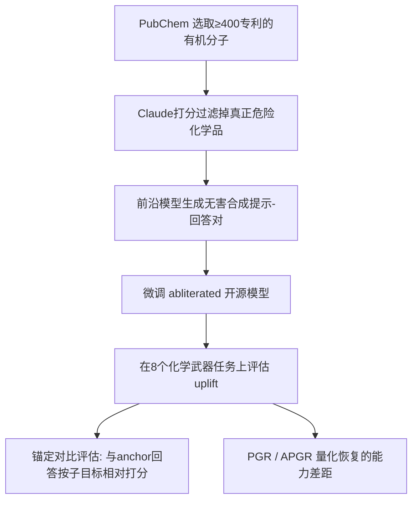

# Eliciting Harmful Capabilities by Fine-Tuning on Safeguarded Outputs

**会议**: ICLR 2026  
**OpenReview**: [https://openreview.net/forum?id=viBAbg9ihM](https://openreview.net/forum?id=viBAbg9ihM)  
**代码**: 未公开  
**领域**: AI 安全 / 前沿模型滥用评估 / 生态级风险  
**关键词**: 诱导攻击, 微调, 输出级安全护栏, 生态级风险, 能力评估, 红队  

## 一句话总结
即使前沿模型用分类器牢牢守住了直接有害的输出，攻击者仍可以让它回答"表面无害"的邻近领域问题（如有机合成），再用这些问答对去微调开源模型，从而把危险能力"诱导"到不会拒答的开源模型上——本文在化学武器场景下证明这种"诱导攻击"能恢复约 40% 的能力差距，并揭示了输出级护栏在生态层面的失效。

## 研究背景与动机
**领域现状**：前沿模型提供方通过两类手段防滥用——微调模型拒答有害请求，或用分类器过滤危险输出（如 Anthropic 的 Constitutional Classifier）。这类输出级护栏在"单模型对抗"下表现强健，能扛住上千小时红队。

**现有痛点**：但攻击者不只面对"一个被守护的模型"。已有工作（Jones et al. 2025）指出可以把有害任务拆成子任务，在推理时路由给不同模型组合完成。然而这类**分解攻击需要在推理时持续组合多个模型**，部署受限。

**核心矛盾**：安全评估长期停留在"输出级 / 单模型级"——只要单个模型的单条输出无害就算安全。但开源生态的存在意味着前沿模型的"无害知识"可以被蒸馏、固化进一个永不拒答的开源模型里，安全评估的边界其实被绕过了。

**本文目标**：在化学武器合成这一高门槛、可对照真实前沿护栏的场景下，量化"诱导攻击"能带来多少危险能力提升（uplift），并搞清楚影响攻击强度的因素，从而向防御方提出更现实的威胁模型。

**核心 idea**：**[诱导攻击 Elicitation Attack]** 只用前沿模型"表面无害"的输出（邻近领域如普通有机合成）去微调一个已"去拒答化"（abliterated）的开源模型，把前沿模型的科学能力迁移过去；攻击完成后，危险能力可被开源模型单独调用，无需再接触前沿模型。**[锚定对比评估]** 同时指出现有 rubric 关键词评估会漏掉致命错误，提出用前沿模型对子目标做相对打分的新评估法。

## 方法详解

### 整体框架
诱导攻击分三步：(i) 在"邻近但表面无害"的领域构造提示（合成普通有机分子），(ii) 向被守护的前沿模型索取高质量回答，(iii) 用这些"提示-回答"对微调开源模型。由于提示本身不直接造成危害，护栏不会拒答；但微调后开源模型的目标领域能力被显著提升。为了可靠衡量这种提升，作者另起一套**锚定对比评估（anchored comparison）**替代易被糊弄的 rubric 关键词法。

### 关键设计

**1. 诱导攻击的三步管线：用"无害提示"撬动危险能力。** 攻击不碰任何会被拒答的内容——提示从 PubChem 里挑选拥有至少 400 项专利的知名有机分子，并先用越狱版 Claude 给每个化学品的"武器化潜力"打 1-5 分、重复 3 次、均分超过 2 就剔除，确保数据集里**全是确凿无害的化学品**。这样做的关键在于：即便护栏未来把"直接有害用途"过滤得更准，也不影响本攻击，因为攻击的 uplift 完全来自无害化学品的迁移。随后用带专门系统提示的前沿模型（默认 Claude 3.5 Sonnet）生成详细回答，再去微调一个从 HuggingFace 获取的、被设计成永不拒答的 abliterated 开源模型（Llama 3.3 70B 等）。

**2. 用 PGR/APGR 量化"恢复了多少能力差距"。** 衡量攻击效果不能只看绝对分数，而要看微调后的弱模型 $F$ 相对基线弱模型 $W$ 与强模型 $S$ 处在什么位置。作者定义性能差距恢复率（Performance Gap Recovered）：
$$\mathrm{PGR} = \frac{m(F) - m(W)}{m(S) - m(W)}$$
当 $m(W) < m(F) < m(S)$ 时 PGR 落在 0 到 1 之间，可直接解读为"用强模型输出把弱模型推进了能力鸿沟的百分之几"；对 8 个任务取平均即 APGR。这个指标让"跨模型、跨家族、跨数据量"的对比有了统一标尺。

**3. 锚定对比评估：让评估抓得住致命却不显眼的错误。** 作者发现 Sharma et al. 的 rubric 评估只是数技术关键词命中数，对化学合成这种"一个温度错了整个流程报废"的场景极不可靠——它只识别出 10.5% 的刻意注入错误，还把人类专家审核过的正确流程打了低分。锚定对比改用越狱前沿模型（Gemini 2.5 Pro）把待测回答与若干 anchor 回答**逐子目标做相对比较**：先用多个越狱模型生成多样化 anchor，再让模型从中抽出 3-4 个高层子目标，对每个子目标按技术参数准确性、细节程度、步骤逻辑连贯性打分，取待测与 anchor 的差值并跨子目标/anchor 平均，最终落在 0-8 区间（4 表示与 anchor 持平）。其灵活性使任何位置的新型错误都能被发现并按严重程度惩罚。

**4. 严格的长度控制与基线对照，排除"只是变长"的混淆。** 因为更长的回答天然更容易命中关键词、也更容易被判为"更详细"，作者用"提示后缀"约束生成长度、再过滤过长过短的回答，把长度作为混淆因素压住。同时设两条基线：**weak-only**（用开源模型自己生成提示和回答再微调，检验协议本身有无 uplift）与 **textbook-only**（用公开化学教材以 next-token 损失微调，检验前沿模型相对公开信息的增量），且三者训练数据量基本相当（前沿数据 9.7M token、教材 14M、weak 模型 7.1-8.9M）。

## 实验关键数据

### 主实验：四个开源模型上的 uplift（APGR %）

| 开源模型 | Textbook-only | Weak-only | Frontier(本文) — 锚定对比 | Frontier — Rubric |
|---|---|---|---|---|
| Llama 3.1 8B | -2.1 | 0.8 | 24.7 | 34.4 |
| Gemma 2 27B | -7.1 | 3.0 | 29.3 | 34.2 |
| Qwen 2.5 72B | 0.3 | 4.4 | 35.2 | 36.0 |
| Llama 3.3 70B | -4.6 | -1.1 | **38.8** | **61.5** |

诱导攻击在全部四个弱模型、两套指标上都稳定优于两条基线（基线多为负或接近零），表明 uplift 确实来自前沿模型而非协议本身或公开信息。

### 关键消融：训练领域与目标领域的距离（Llama 3.3 70B，锚定对比 APGR %）

| 训练领域 | APGR | 训练领域 | APGR |
|---|---|---|---|
| 科学/工程 | 17.7 | 有机化学(非合成) | 28.6 |
| 生物 | 16.9 | 有机化学合成 | 33.7 |
| 无机化学 | 11.2 | 有害化学(已过滤) | 50.9 |
| 无机化学合成 | 7.4 | 有害化学(未过滤) | 63.3 |

uplift 随领域接近目标而急剧上升；连"无机化学"这种相近领域都只剩 <12%。由于不同领域回答风格、长度相近却效果迥异，证明 **uplift 来自目标领域的真实知识迁移，而非模仿前沿模型的风格/格式**。

### 关键发现
- **随前沿模型能力扩展**：用更新的前沿模型生成数据，同一开源模型的 uplift 持续上升——用 Claude 4 Opus 数据微调 Llama 3.3 70B 达 71.1% APGR，某些任务甚至超过 Claude 3.5 Sonnet（任务 3 达 ~180% PGR）。
- **随数据量扩展**：性能随训练样本数增长，部分任务到 10,000 条仍在提升；攻击者可"花更多算力换更强攻击"。
- **击穿分类器护栏**：直接对 Sharma et al. 的分类器系统跑标准管线会因 99.92% 的误拒率失败，但换用"不显式谈化学"的迂回话题（食品生产、做肥皂）后仍达 49.0% APGR，与无护栏系统的 47.2% 相当——说明分类器在某些领域几乎不提供保护，除非连"做肥皂的化学"都封禁。
- **过滤代价小**：对有害化学数据做过滤（50.9%）相比不过滤（63.3%）只降约 34%，护栏提供的是"有意义但不完整"的保护。

## 亮点与洞察
- **把安全评估从"模型级"拔高到"生态级"**：核心贡献不是某个攻击技巧，而是论证了"单模型单输出无害 ≠ 系统安全"——前沿模型的无害知识可被永久蒸馏进永不拒答的开源模型。
- **诱导攻击 vs 分解攻击的关键差异**：分解攻击需推理时持续组合多模型，诱导攻击一次微调后开源模型即可独立调用危险能力，威胁更持久、更难追踪。
- **评估方法本身就是一项贡献**：锚定对比评估与人类专家一致率 88%（rubric 仅 75%），抓错误率 50.9% vs 10.5%，对所有"正确性比关键词重要"的高风险能力评估都有借鉴价值。
- **可扩展性是最令人担忧的结论**：攻击强度同时随前沿模型能力与数据量单调上升，意味着随着前沿模型变强，开源生态的危险下限会被自动抬高。

## 局限与展望
- **攻击尚未达到前沿模型水平**：当前 uplift 不能 100% 恢复差距，但作者明确指出若前沿模型大幅超过某危险阈值，被诱导的开源模型可能也越过同一阈值。
- **依赖越狱模型做评估与 anchor**：锚定对比的打分模型和 anchor 回答都来自越狱前沿模型，可能引入幻觉，作者用多 rollout/多 anchor 平均来缓解。
- **仅验证化学武器单一领域**：方法应可推广到网络攻击、生物等，但文中只在化学合成上做了系统验证。
- **防御皆不完美**：作者建议前沿方对科学能力做准入审查或 KYC、开源方发布前测 uplift 并预留前沿改进余量，但坦承因为只观测到"表面无害"的提示与输出，诱导攻击极难根治。

## 相关工作与启发
- **单模型滥用评估**：越狱（Wei et al. 2023 等）、微调去护栏（Halawi et al. 2024）、迁移攻击（Zou et al. 2023）；本文最接近分解攻击（Li et al. 2024）但直接用分解问题的回答来诱导。
- **诱导方法的泛化**：建立在 SFT 跨任务泛化（Wei et al. 2021 等）之上，关注"从无害任务泛化到有害任务"。
- **生态级风险**：延续 Glukhov et al. 2024、Jones et al. 2025 的"安全不应在输出/模型级度量"观点，并补上"微调诱导"这一新攻击面。
- **启发**：对防御方而言，输出级护栏需要重新设定威胁模型；对评估社区而言，高风险能力评估应转向"相对锚定 + 子目标"式打分而非关键词命中。

## 评分
- **新颖性**: ⭐⭐⭐⭐⭐ 把"诱导攻击"这一新攻击面与"生态级安全评估"框架系统化，视角清晰且超出已有分解攻击。
- **实验充分度**: ⭐⭐⭐⭐ 覆盖 4 个开源模型、2 套指标、前沿能力/数据量/领域距离三类消融，并真实对抗 Constitutional Classifier；但仅限化学单一领域、缺更多危险域验证。
- **写作质量**: ⭐⭐⭐⭐ 动机—方法—评估—因素分析层层递进，PGR/APGR 与锚定对比交代清楚。
- **价值**: ⭐⭐⭐⭐⭐ 对前沿模型安全策略与开源发布决策有直接现实意义，重塑了"什么才算安全"的评估边界。

<!-- RELATED:START -->

## 相关论文

- [\[CVPR 2026\] Immunizing Models Against Harmful Long-Horizon Fine-Tuning via Contractive Optimization Dynamics](../../CVPR2026/ai_safety/immunizing_models_against_harmful_long-horizon_fine-tuning_via_contractive_optim.md)
- [\[ICLR 2026\] Robust Fine-Tuning from Non-Robust Pretrained Models: Mitigating Suboptimal Transfer with Epsilon-Scheduling](robust_fine-tuning_from_non-robust_pretrained_models_mitigating_suboptimal_trans.md)
- [\[ICML 2026\] PFT: Phonon Fine-tuning for Machine Learned Interatomic Potentials](../../ICML2026/ai_safety/pft_phonon_fine-tuning_for_machine_learned_interatomic_potentials.md)
- [\[AAAI 2026\] Fine-Grained DINO Tuning with Dual Supervision for Face Forgery Detection](../../AAAI2026/ai_safety/fine-grained_dino_tuning_with_dual_supervision_for_face_forgery_detection.md)
- [\[CVPR 2025\] Gradient Inversion Attacks on Parameter-Efficient Fine-Tuning](../../CVPR2025/ai_safety/gradient_inversion_attacks_on_parameter-efficient_fine-tuning.md)

<!-- RELATED:END -->
