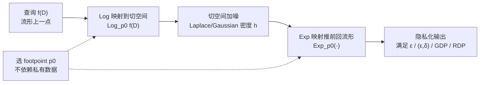

# Exponential-Wrapped Mechanisms: Differential Privacy on Hadamard Manifolds Made Practical

**会议**: ICLR 2026  
**OpenReview**: [https://openreview.net/forum?id=ulCVfMOo30](https://openreview.net/forum?id=ulCVfMOo30)  
**代码**: 待确认  
**领域**: 差分隐私 / 黎曼流形统计  
**关键词**: 差分隐私, Hadamard 流形, 指数包裹分布, Gaussian DP, Rényi DP, Fréchet 均值  

## 一句话总结
把"在切空间采样 + 指数映射推前"这一简单技巧系统化成 Exponential-Wrapped Laplace/Gaussian 机制，**首次在一般 Hadamard 流形上统一实现 ε-DP、(ε,δ)-DP、GDP、RDP，并彻底甩掉 MCMC 采样**，让流形数据的差分隐私真正变得可算、可扩展。

## 研究背景与动机
**领域现状**：现实中越来越多数据天然住在非线性流形上——双曲空间用于层级/树结构嵌入，对称正定矩阵空间（SPDM）是扩散张量成像、形状分析、计算机视觉协方差描述子的标准载体。这些医疗、生物场景对隐私极度敏感，需要尊重几何结构的隐私机制。

**现有痛点**：把流形数据嵌进欧氏空间再加噪（外蕴做法）会扭曲几何、造成巨大效用损失。Reimherr 等人 2021 年首次把 DP 扩展到一般黎曼流形，提出 Riemannian Laplace 机制实现 ε-DP，但后续工作有三道坎绕不过去：

- **隐私概念覆盖不全**：(ε,δ)-DP、Gaussian DP（GDP）、Rényi DP（RDP）这些现代 DP 概念在流形上几乎是空白。Utpala 等人只在配 Log-Euclidean 度量（这会把 SPDM 拉平成欧氏空间）的单一流形上做了 (ε,δ)-DP；Jiang 等人把 GDP 推广到一般流形，但校准算法只适用于常曲率空间。
- **采样依赖 MCMC**：Riemannian Laplace/Gaussian 机制都要靠马尔可夫链蒙特卡洛采样，需要上万次 burn-in 迭代、反复计算黎曼距离，维度一高（如高维 SPDM）就贵到不可用，且 proposal 分布的选择严重影响收敛。
- **度量受限**：现有可算的方案被绑死在让空间"变平"的度量上，无法用更忠实几何的 affine-invariant 度量或更稳定的 Log-Cholesky 度量。

**核心矛盾**：流形 DP 要同时满足"概念完整 + 几何忠实 + 计算可扩展"，但既有机制总要牺牲其中一项——要么概念单一、要么只在常曲率/拉平度量下成立、要么被 MCMC 拖死。

**本文目标**：给一般 Hadamard 流形（完备、单连通、非正曲率的黎曼流形）一套统一、免 MCMC、对任意度量都成立的 DP 机制。

**核心 idea**：**用 Exponential-Wrapped 分布做隐私噪声**——所有随机性都在切空间这个平坦欧氏向量空间里生成，再用指数映射一次性"推前"到流形上。Hadamard 流形的 Cartan-Hadamard 定理保证指数映射是全局微分同胚（Log 处处有定义），于是切空间里成熟的 Laplace/Gaussian DP 理论可以几乎原封不动地搬上流形，采样只剩"切空间抽样 + 一次 Exp 映射"。

## 方法详解

### 整体框架
全部机制建立在一个观察上：把切空间 $T_pM$ 上一个已知密度 $h$ 通过指数映射 $\mathrm{Exp}_p$ 推前到流形，得到的"指数包裹分布" $\Lambda=\mathrm{Exp}_{p*}\mu$ 既容易写出闭式密度（只差一个体积变化的 Jacobian 项），又有极简采样：只要在切空间抽 $u\sim h$，输出 $\mathrm{Exp}_p(u)$ 即为流形上的样本。论文据此构造 Laplace 版本拿 ε-DP，Gaussian 版本拿 (ε,δ)-DP / GDP / RDP，再针对 Fréchet 均值这一最常用的流形统计量给出效用上界。

### 关键设计

**1. Exponential-Wrapped 分布：把隐私噪声搬到切空间生成。** 这是全文的地基。给定 footpoint $p_0$、流形 $M$ 与体积测度 $\nu$，指数包裹分布的密度可显式写成切空间密度除以一个 Jacobian 体积校正项：$g(q)=\dfrac{h(\mathrm{Log}_{p_0} q)}{J_{p_0}(\mathrm{Log}_{p_0} q)}$，其中 $J_{p_0}(u)=|\det(D_u\mathrm{Exp}_{p_0})|$ 刻画指数映射造成的体积畸变。它最迷人的性质是采样：若 $U_i\sim h$ 是切空间 i.i.d. 样本，则 $X_i=\mathrm{Exp}_{p_0}(U_i)$ 就是流形上服从 $g$ 的 i.i.d. 样本——把"在弯曲流形上采样"这件难事彻底还原成"在平坦切空间采样 + 一次确定性 Exp 映射"，这正是后面甩掉 MCMC 的根源。

**2. Exponential-Wrapped Laplace 机制拿 ε-DP，且常数更优。** 令切空间密度取 $h(u)\propto\exp\{-\|u-\mathrm{Log}_{p_0}\eta\|/\sigma\}$，推前得到 EWL 分布。定理证明：对敏感度为 $\Delta$ 的流形值统计量 $f$，输出 $Y\sim\mathrm{EWL}(p_0, f(D), \Delta/\varepsilon)$ 即满足 ε-DP。相比 Reimherr 的 Riemannian Laplace，这里有两层好处：其一，**只需速率 $\Delta/\varepsilon$**，而 Riemannian Laplace 在非齐性流形上要 $2\Delta/\varepsilon$（多一倍噪声）；其二，采样从"上万步 burn-in 的 MCMC"降为"切空间抽 Laplace + 一次 Exp"。footpoint $p_0$ 的选择自由，但**绝不能依赖私有数据 $D$**，否则破坏 DP 定义。

**3. Exponential-Wrapped Gaussian 机制：一套分布通吃三种现代 DP。** 取切空间为高斯密度 $h\propto\exp\{-\|u-\mathrm{Log}_{p_0}\eta\|^2/(2\sigma^2)\}$ 得到 EWG 分布，它的强大在于换一个 $\sigma$ 校准公式就能切换隐私概念：
   - **(ε,δ)-DP**：$\sigma$ 满足 $\Phi\!\left(-\tfrac{\sigma\varepsilon}{\Delta_{p_0}}+\tfrac{\Delta_{p_0}}{2\sigma}\right)-e^{\varepsilon}\Phi\!\left(-\tfrac{\sigma\varepsilon}{\Delta_{p_0}}-\tfrac{\Delta_{p_0}}{2\sigma}\right)\le\delta$，形式上对应 Balle-Wang 的 analytic Gaussian 机制，只是把欧氏敏感度换成 $\Delta_{p_0}=\sup_{D\simeq D'}\|\mathrm{Log}_{p_0}f(D)-\mathrm{Log}_{p_0}f(D')\|$；由于 Hadamard 流形上 $\mathrm{Log}_{p_0}$ 是压缩映射，$\Delta\ge\Delta_{p_0}$，必要时可直接用 $\Delta$ 兜底。
   - **GDP**：直接令 $\sigma=\Delta/\mu$ 即得 μ-GDP，把 Jiang 等人"求解无穷多积分不等式 + 网格搜索 + MCMC"的校准坍缩成一条除法。
   - **RDP**：令 $\sigma=\Delta/\sqrt{2\varepsilon/\alpha}$ 即满足 (α,ε)-RDP，这是**首个能用在欧氏空间之外的 RDP 机制**。
   特别地，当 $M$ 是配 Log-Euclidean 度量的 SPDM、$p_0=I$ 时，EWG 退化为 Utpala 的 tangent Gaussian 机制——说明 EWG 是它的严格推广，也是首个能在非 Log-Euclidean 度量 SPDM 上实现 (ε,δ)-DP 的机制。

**4. Fréchet 均值的效用上界：把曲率、维度、footpoint 对齐显式量化。** 隐私机制最常发布的是流形上的"均值"，即 Fréchet 均值 $\bar x=\arg\min_x\sum_i d(x,x_i)^2$（Hadamard 性质保证存在唯一）。在数据落在半径 $r$ 测地球内的假设下，相邻数据集的 Fréchet 均值敏感度 $d(\bar x,\bar x')\le 2r/n$。论文进而给出期望黎曼距离上界，例如 EWL 满足 $\mathbb{E}\,d(\tilde x_{\mathrm{EWL}},\bar x)\le\sigma d+2d(p_0,\bar x)$，EWG 满足 $\mathbb{E}\,d(\tilde x_{\mathrm{EWG}},\bar x)\le\sigma\sqrt{2}\,\tfrac{\Gamma((d+1)/2)}{\Gamma(d/2)}+2d(p_0,\bar x)$。这些界讲出三件事：footpoint 与真值的距离 $d(p_0,\bar x)$ 直接进界，**故应让 $p_0$ 靠近数据中心**；维度 $d$ 越高、主导项越占优，footpoint 的影响相对越小；引入曲率下界 $\mathrm{Sec}_M>K\le 0$ 后界含因子 $\tfrac{\sinh(\sqrt{K}r)}{\sqrt{K}r}$，曲率越接近平坦（$K\to0$）界越紧，平坦流形时取等且 footpoint 不再影响效用。

## 实验关键数据

### 主实验：SPDM 与双曲空间上发布 GDP Fréchet 均值
对比对象为 Riemannian Laplace（RL）机制；固定样本量 $n=40$、数据半径 $r=1.5$，扫隐私预算 $\mu\in\{0.1,\dots,2\}$、流形维度 $d=m(m+1)/2\in\{3,10,15\}$，每点 100 次独立重复，指标是隐私化输出到真实 Fréchet 均值的平均黎曼距离（越小越好）。

| 空间 / 度量 | 维度 | EWG vs RL 效用结论 |
|---|---|---|
| SPDM · Log-Cholesky | d=3,10,15 | EWG 在所有预算下一致更优 |
| SPDM · Log-Euclidean | d=3,10,15 | EWG 在所有预算下一致更优 |
| SPDM · affine-invariant | d=3 | 高预算 μ∈[0.7,2] 时 EWG 略逊（footpoint 失配 + 曲率影响放大） |
| SPDM · affine-invariant | d=10,15 | EWG 在几乎所有预算下更优（高维由噪声幅度主导，footpoint 影响淡化） |
| 双曲空间 $\mathbb{H}^d$ | d=3,10,15 | EWG 在所有维度、所有预算下一致更优 |

### 运行时间对比
论文 Table 1 报告 EWG 相对 RL 的运行时间，结论是 **EWG 往往快几个数量级，且维度越高优势越大**：RL 依赖带上万步 burn-in 的 MCMC，EWG 只需"切空间抽样 + Exp/Log 计算"，故在高维 SPDM 上可扩展性碾压。

### 真实数据：OCTMNIST（医学 OCT 影像）
从 MedMNIST 的 OCTMNIST（28×28 灰度，四个类别）每张图提取 5×5 协方差描述子，落在配 Log-Euclidean 度量的 $S_5^+$（$d=15$）上，敏感度由像素强度范围解析给出。对四个类别各 100 次蒙特卡洛重复发布 GDP Fréchet 均值，EWG 在不同隐私预算下效用一致优于 RL，验证了在真实流形值数据上的实用性与可扩展性。

### 关键发现
- **几何越"温和"，footpoint 越无关紧要**：Log-Cholesky / Log-Euclidean / 双曲空间这些规则几何里，EWG 全程领先；只有曲率最"刁钻"的 affine-invariant 低维场景才暴露 footpoint 失配。
- **高维反而是 EWG 的主场**：维度升高时效用由噪声幅度而非 footpoint 对齐主导，EWG 既更稳又更快，恰好填补了 MCMC 方法在高维崩溃的空缺。
- **理论与实验对齐**：平坦度量下"footpoint 不影响效用"的理论预测在仿真中被精确复现。

## 亮点与洞察
- **一个分布族统一四种 DP 概念**：ε-DP、(ε,δ)-DP、GDP、RDP 只靠换 $\sigma$ 的校准公式切换，工程上极其干净，还顺手给出了流形上第一个 RDP 机制。
- **"难在流形、易在切空间"的降维打击**：Cartan-Hadamard 定理保证 Exp 全局微分同胚，使得所有随机性都能在平坦切空间生成，把弯曲流形上的采样难题彻底外包给成熟的欧氏 DP 工具。
- **免 MCMC 是实用性的分水岭**：校准从"解无穷积分不等式 + 网格搜索"变成除法，采样从"上万步 burn-in"变成"一次 Exp 映射"，这才让流形 DP 从论文走向可部署。
- **效用界把直觉数学化**：曲率因子 $\sinh(\sqrt{K}r)/(\sqrt{K}r)$ 和 footpoint 距离 $d(p_0,\bar x)$ 显式入界，给出了"何时该花预算私有地估 footpoint"的可操作判据。

## 局限与展望
- **只覆盖非正曲率**：方法严格依赖 Hadamard 性质（Exp 全局可逆），无法直接处理球面等非负曲率流形——这正是作者列出的下一步。
- **footpoint 选择尚未最优**：$p_0$ 不能用私有数据，当前多取固定中心（如 $I_m$）；在非常曲率空间它会成为效用瓶颈，如何私有且自适应地选 $p_0$ 仍开放（附录给了一个初步 DP 选点方案）。
- **任务局限于 Fréchet 均值**：效用保证只针对均值发布，主测地分析（PGA）、流形回归等更复杂统计任务还需另行推导。
- **affine-invariant 低维短板**：在曲率最强的度量与低维下，高预算时 EWG 可能不如 RL，说明几何畸变在该区域仍有代价。

## 相关工作与启发
- **流形 DP 谱系**：Reimherr 等（Riemannian Laplace，ε-DP 开山）→ Jiang 等（流形 GDP，但限常曲率）→ Utpala 等（Log-Euclidean SPDM 的 (ε,δ)-DP）→ 本文（一般 Hadamard 流形 + 四种 DP + 免 MCMC），可视为对这条线的统一与提速。
- **欧氏 DP 工具的几何移植**：(ε,δ)-DP 校准沿用 Balle-Wang 的 analytic Gaussian 机制，GDP/RDP 沿用 Dong-Roth-Su 与 Mironov 的框架，核心贡献是用指数包裹把它们"几乎零成本"搬到流形上。
- **指数包裹分布**：借自 Chevallier 等人在对称空间上的工作，本文把它从概率建模工具重新定位为 DP 噪声机制。
- **启发**：凡是"难在弯曲空间、但底层有全局微分同胚到平坦空间"的随机算法（采样、扩散、隐私），都可考虑"切空间生成 + 推前"这一范式，避开在流形上直接跑 MCMC。

## 评分
- **新颖性**: ⭐⭐⭐⭐ — 首次在一般 Hadamard 流形统一四种 DP 概念并给出首个非欧 RDP 机制，"切空间生成 + Exp 推前"虽借力指数包裹分布，但用于 DP 是干净且有分量的贡献。
- **实验充分度**: ⭐⭐⭐⭐ — 覆盖 SPDM 三种度量 + 双曲空间 + 真实 OCTMNIST，效用与运行时间双维度对比 RL，并诚实暴露 affine-invariant 低维短板。
- **写作质量**: ⭐⭐⭐⭐ — 理论脉络（分布→机制→效用界）清晰，定理与算法配套，几何直觉与数学界紧密对应。
- **价值**: ⭐⭐⭐⭐ — 让流形数据（医学影像、层级嵌入）的差分隐私从 MCMC 受限走向可算可扩展，对隐私敏感的生物医疗场景有直接落地意义。

<!-- RELATED:START -->

## 相关论文

- [\[ICLR 2026\] Beyond Membership: Limitations of Add/Remove Adjacency in Differential Privacy](beyond_membership_limitations_of_addremove_adjacency_in_differential_privacy.md)
- [\[ICLR 2026\] Convergent Differential Privacy Analysis for General Federated Learning](convergent_differential_privacy_analysis_for_general_federated_learning.md)
- [\[ICLR 2026\] Federated Learning of Quantile Inference under Local Differential Privacy](federated_learning_of_quantile_inference_under_local_differential_privacy.md)
- [\[ICLR 2026\] INO-SGD: Addressing Utility Imbalance under Individualized Differential Privacy](ino-sgd_addressing_utility_imbalance_under_individualized_differential_privacy.md)
- [\[NeurIPS 2025\] Sequentially Auditing Differential Privacy](../../NeurIPS2025/ai_safety/sequentially_auditing_differential_privacy.md)

<!-- RELATED:END -->
