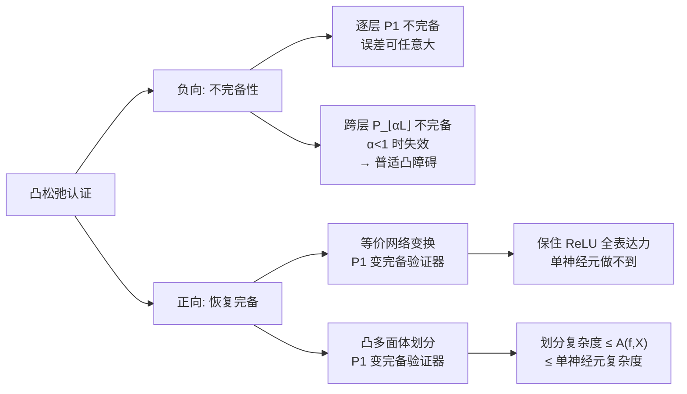

# Expressiveness of Multi-Neuron Convex Relaxations in Neural Network Certification

**会议**: ICLR 2026  
**OpenReview**: [https://openreview.net/forum?id=f07Kf4pD0f](https://openreview.net/forum?id=f07Kf4pD0f)  
**代码**: 待确认  
**领域**: AI 安全 / 神经网络验证 / 认证鲁棒性  
**关键词**: 凸松弛, 多神经元松弛, 完备性, 凸障碍, 认证鲁棒性, 形式化验证  

## 一句话总结
本文首次严格刻画了多神经元凸松弛的表达能力，证明它们和单神经元松弛一样**天然不完备**（把"单神经元凸障碍"推广为"普适凸障碍"），但通过**等价网络变换**或**输入域凸多面体划分**可以恢复完备性，且其划分复杂度严格优于单神经元松弛。

## 研究背景与动机
**领域现状**：神经网络对抗鲁棒性的精确计算是 coNP-hard 的，于是人们用**凸松弛**对网络输出可行集做凸过近似，以此给出可证明的鲁棒性下界。这类方法既能做认证（verification），也能融入训练得到"易认证模型"，是认证鲁棒性领域的基石。

**现有痛点**：凸松弛是有损的。单神经元松弛（逐个 ReLU 处理、忽略神经元间依赖）存在著名的**单神经元凸障碍**——即便用最精确的单神经元松弛 Triangle，也无法对一般 ReLU 网络给出精确界；Baader 等人甚至证明它连 $\mathbb{R}^2$ 上简单的 max 函数都框不准。为突破障碍，人们启发式地提出了**多神经元松弛**（k-ReLU、PRIMA、跨层松弛等），联合考虑一组神经元，经验精度更高。

**核心矛盾**：多神经元松弛的理论性质几乎无人触碰。两个根本问题悬而未决：(i) 给足资源，多神经元松弛能否**绕过凸障碍**实现完备认证？(ii) 若不能，它相比单神经元松弛是否有**本质优势**？这个问题没法靠实验回答——多神经元松弛总能靠堆资源变得更精确，且求解代价高昂，经验探索根本摸不到它的极限。

**本文目标**：形式化"多神经元松弛"这一概念，严格刻画其表达能力与完备性边界。

**核心 idea**：**用网络构造而非实验来回答理论极限**——通过精心构造"凸包严格大于可达集"的子网络，证明任何固定层窗口的凸松弛都存在误差可任意大的失败案例（负向）；同时给出两条恢复完备性的可行路径并量化其复杂度优势（正向）。

## 方法详解

### 整体框架
论文不提算法，而是建立一套关于凸松弛"能做到什么、做不到什么"的理论体系。核心抽象是两类最精确的松弛算子：$P_1$（最精确的**逐层**/cross-1-layer 松弛，对每层输出取凸包）与 $P_r$（最精确的**跨 $r$ 层**松弛，对相邻 $r$ 层的函数图取凸包）。论文先证负向结论（$P_1$ 乃至 $P_{\lfloor\alpha L\rfloor}$ 不完备），把单神经元障碍升级为普适凸障碍；再证正向结论（变换 + 划分两条路恢复完备），并量化多神经元相对单神经元的复杂度优势。

### 关键设计
**1. 逐层多神经元松弛的不完备性：凸包外的"幽灵点"无法剔除。** 论文用一个 $X=[-1,1]^2$ 的小例子点破直觉：经过一个仿射层与 ReLU，输入盒被映成一个**非凸的多面体并集** $U$，而后续子网络 $f'$ 恰好在 $U$ 的凸包里、却不在 $U$ 中的点 $u^*=(1,1)$ 处取得极值。问题的本质由两条引理刻画——引理 3.1 说逐层松弛在深层施加的约束**无法回头收紧浅层的可行集**（$\pi_{v^{(i)}}(C_1)=\pi_{v^{(i)}}(C_2)$），于是引理 3.2 给出 $\ell(f,P_1,X)\le\min(f_2(\mathrm{conv}(f_1(X))))$：$P_1$ 最好也只能把网络从某隐层一刀切成 $f_2\circ f_1$、各自取凸包再串起来。只要 $\mathrm{conv}(f_1(X))\setminus f_1(X)\neq\varnothing$ 且 $f_2$ 在这片"凸包外幽灵区"取极值，松弛就框不准。定理 3.3 进一步把输出层权重放大常数倍，证明对任意 $0<T<\infty$ 都能构造网络使误差 $\ell(f,P_1,X)\le\min f(X)-T$，即**误差可被推到任意大**。

**2. 普适凸障碍：跨层也救不了，$\alpha<1$ 是硬阈值。** 自然的追问是：跨 $r$ 层的 $P_r$ 是否能完备？论文不固定 $r$ 为常数，而是放在最一般的设定下问：是否存在 $\alpha\in(0,1)$ 使 $P_{\max(1,\lfloor\alpha L\rfloor)}$ 对所有 $L$ 层网络都精确？答案是**否**。关键武器是引理 4.1，思路类似**泵引理**：在 $f_1$ 与 $f_2$ 之间塞入若干恒等"哑层"把网络泵深，这些哑层恰好**阻断**了 $f_1$ 与 $f_2$ 之间的跨层信息交换，使跨层松弛退化得和 $P_1$ 一样——尽管它对 $f_1$、$f_2$ 各自仍可精确。由此定理 4.2 证明对任意 $\alpha\in(0,1)$ 误差都能任意大。于是"$P_{\lfloor\alpha L\rfloor}$ 在 $\alpha=1$ 时完备、$\alpha<1$ 时不完备"形成**硬阈值**，所谓"单神经元障碍"实为误称，应正名为**普适凸障碍**（universal convex barrier）。该结论还能借万有逼近定理推广到 tanh、sigmoid 等非多项式激活，并对相对误差同样成立。

**3. 经等价变换让 $P_1$ 完备：把输入信息一路复制到输出层。** 既然纯松弛无望，正向结论转而问：能否对网络做**保持语义的结构变换**来恢复完备？定理 5.1 给出肯定答案——对任意网络 $f$ 与凸多面体 $X$，存在 $g=f$（在 $X$ 上）使 $\ell(g,P_1,X)=\min f(X)$、$u(g,P_1,X)=\max f(X)$。构造思路直击 $P_1$ 的软肋（只看单层约束、信息会在层间丢失）：**加宽每个隐层、让额外神经元逐层复制输入变量**，这样最后一层就携带了输入的完整信息，$P_1$ 对末层取凸包即等价于对 $f[X]$ 取凸包。推论 5.2 由此得到一个强陈述：**任意连续分段线性函数**都存在能被 $P_1$ 精确框住的 ReLU 网络编码——这是单神经元松弛**根本做不到的**（它的精确表达力被困在 1-D）。案例研究还表明实践中往往不需要 $P_1$ 这么强：$[0,1]^d$ 上的 $\max$ 函数（写成 $f=x_2+\rho(x_1-x_2)$ 再按 $\max(\max(x_1,x_2),\dots)$ 嵌套归纳）只用弱得多的 $M_1$（仅对单个输出取凸包）就能精确，而 k-ReLU/Triangle 在此给出 1.5 的松界。

**4. 经凸多面体划分让 $P_1$ 完备，且复杂度严格碾压单神经元。** 第二条路不改网络，而是借鉴 BaB 的分治：把输入集划成若干凸子多面体，使每块**逐层穿过网络后仍保持为凸多面体**，则 $P_1$ 对每块精确、聚合即得全局精确界（命题 5.3，且该条件不仅充分还必要——某块若中途变非凸，其凸包必严格大于真实可行集）。论文用**划分复杂度** $\#\mathrm{Partition}$ 衡量需求解的子问题数，并以**激活模式数** $A(f,X)$（网络在 $X$ 上不同激活 pattern 的个数）为标尺给出干净的分离（命题 5.6）：
$$\#\mathrm{Partition}(\mathrm{BaB}(M),f,X)\le A(f,X)\le \#\mathrm{Partition}(\mathrm{BaB}(S),f,X)$$
即任意多神经元松弛 $M$ 的划分复杂度被 $A(f,X)$ 上界封顶，而任意单神经元松弛 $S$ 必须枚举全部激活模式（$A(f,X)$ 是其下界），二者被 $A(f,X)$ 严格隔开；对强如 $P_1$ 的松弛，这个上界还可能极度宽松（附录给出 $P_1$ 划分比 DeepPoly+BaB 指数级更快的实例）。

## 实验关键数据
本文为纯理论工作，**无实证实验表格**，核心"数据"是一组定理与其量化对比。下表汇总关键结论：

### 主要结论汇总

| 结论 | 设定 | 结果 | 含义 |
|------|------|------|------|
| 定理 3.3 | 逐层 $P_1$ | $\exists f$ 使 $\ell(f,P_1,X)\le\min f(X)-T,\ \forall T<\infty$ | 逐层多神经元松弛**不完备**，误差可任意大 |
| 定理 4.2 | 跨层 $P_{\max(1,\lfloor\alpha L\rfloor)},\ \alpha<1$ | $\exists f$ 使误差 $>T,\ \forall T$ | **普适凸障碍**：任意固定比例跨层松弛仍不完备 |
| 定理 5.1 / 推论 5.2 | $P_1$ + 等价变换 | $\ell(g,P_1,X)=\min f(X)$ | 经变换 $P_1$ 可完备；保住 ReLU 全 CPWL 表达力 |
| 命题 5.6 | BaB + 划分 | $\#\mathrm{Part}(\mathrm{BaB}(M))\le A(f,X)\le\#\mathrm{Part}(\mathrm{BaB}(S))$ | 多神经元划分复杂度**严格优于**单神经元 |

### 单神经元 vs 多神经元（$\max$ 函数案例）

| 松弛方法 | 对 $f=x_2+\rho(x_1-x_2)$ 的上界 | 是否精确 |
|----------|------------------------------|----------|
| Triangle / k-ReLU | 1.5 | ✗（松） |
| $M_1$（多神经元，弱版） | 1 | ✓（精确） |
| IBP + 划分 | 至少 $2-p$（任意细划分仍不精确） | ✗（划分复杂度无穷） |

### 关键发现
- **负向**：凸松弛的不完备不是"单神经元"的局限，而是凸松弛这一范式的**普适天花板**——只要层窗口比例 $\alpha<1$，无论投入多少资源（神经元数、层数）都救不回来。
- **正向**：完备性的钥匙在"**让信息绕过凸包损失**"——要么靠结构变换把输入信息搬到末层，要么靠输入划分把非凸并集拆成凸块。
- **本质优势**：多神经元相对单神经元的价值，精确量化为划分复杂度被激活模式数 $A(f,X)$ 隔开的一条清晰分离线。

## 亮点与洞察
- **把启发式工具拉到理论审判台**：多神经元松弛此前是纯经验产物（"加更多神经元就更准"），本文第一次给出它能力边界的严格刻画，回答了"它到底强在哪、弱在哪"。
- **"普适凸障碍"是个漂亮且略反直觉的负向结论**：人们直觉上认为跨足够多层就能完备，本文用泵引理式构造证明只要 $\alpha<1$ 就有硬墙，把一个长期被叫错名字的概念（单神经元障碍）正本清源。
- **负向与正向对称成对**：不只是"不行"，还给出两条"怎么才行"的可行路径，且每条都附带与单神经元的对比，落点非常工程化。
- **划分复杂度用激活模式数 $A(f,X)$ 作标尺**，给出 $\#\mathrm{Part}(M)\le A(f,X)\le\#\mathrm{Part}(S)$ 这种干净的三明治式分离，理论审美与实践指导兼具。

## 局限与展望
- **结论仅限本文设定的验证框架**：负向结论针对"固定资源的凸松弛 + 线性规划求解"，正向完备性结论进一步限定在**有限 ReLU 网络**，并非对所有验证范式都成立。
- **正向结果尚未落地为实用算法**：定理 5.1 的等价变换会加宽隐层，$P_1$ 对变换后网络的求解可能计算上不可行甚至 intractable；划分路线的复杂度上界对强松弛也可能很宽松。论文明确把"实用算法"留作 future work。
- **缺实证验证**：作为纯理论文章可以理解，但多神经元松弛在真实 BaB 流程中的实际加速、训练增益都还停留在"理论建议"层面。
- **展望**：作者指出两条直接的工程方向——(i) 用高效多神经元松弛作为 BaB 子问题的 bounding 子程序（因划分复杂度更低）；(ii) 面向多神经元松弛设计认证训练方法（因其能对任意 CPWL 函数给精确界）。

## 相关工作与启发
- **单神经元凸障碍**（Salman 2019, Palma 2021, Baader 2024）是本文的直接对话对象：Baader 等证明 Triangle 框不准 $\mathbb{R}^2$ 的 max，本文将这条不可能性升级为对所有凸松弛成立的普适障碍，同时给出多神经元能框准 max 的正面对照。
- **多神经元松弛家族**（k-ReLU/Singh 2019、PRIMA/Müller 2022、跨层松弛/Zhang 2022）提供了被分析的对象；本文用 $M_k$、$P_r$ 等抽象算子统一刻画其精确上限。
- **Branch-and-Bound 完备验证**（DeepPoly、α,β-CROWN 等当前最强完备验证器）几乎都用单神经元松弛做 bounding；本文的划分复杂度分离结果为"在 BaB 中换用多神经元 bounding"提供了理论依据。
- **启发**：对认证鲁棒性社区，这篇工作把"凸松弛是不是终点"这一根本问题钉死——答案是"只能当 BaB 的子程序"，并把研究重心引向**多神经元 bounding 的 BaB** 与**多神经元认证训练**两个具体方向。

## 评分
- **新颖性**: ⭐⭐⭐⭐⭐ 首次严格刻画多神经元凸松弛表达能力，提出"普适凸障碍"并正名单神经元障碍，是该领域的奠基性理论贡献。
- **实验充分度**: ⭐⭐⭐ 纯理论工作无实证实验，定理与案例分析自洽完整，但实用算法与经验验证留作 future work。
- **写作质量**: ⭐⭐⭐⭐ 负向/正向结论对称呈现，引理-定理逻辑链清晰，小例子（max、泵引理构造）点睛，理论文章可读性佳。
- **价值**: ⭐⭐⭐⭐⭐ 厘清了认证鲁棒性领域一个长期悬而未决的根本问题，既封死纯凸松弛的路，又指明 BaB 子程序与认证训练两个落地方向，影响深远。

<!-- RELATED:START -->

## 相关论文

- [\[CVPR 2026\] Verifying Neural Network Robustness with Dual Perturbations](../../CVPR2026/ai_safety/verifying_neural_network_robustness_with_dual_perturbations.md)
- [\[NeurIPS 2025\] Influence Functions for Edge Edits in Non-Convex Graph Neural Networks](../../NeurIPS2025/ai_safety/influence_functions_for_edge_edits_in_non-convex_graph_neural_networks.md)
- [\[CVPR 2026\] RevINN: An End-to-End Invertible Neural Network for Reversible Adversarial Examples Generation](../../CVPR2026/ai_safety/revinn_an_end-to-end_invertible_neural_network_for_reversible_adversarial_exampl.md)
- [\[ICML 2025\] Convex Markov Games: A New Frontier for Multi-Agent Reinforcement Learning](../../ICML2025/ai_safety/convex_markov_games_a_new_frontier_for_multi-agent_reinforcement_learning.md)
- [\[AAAI 2026\] FairGSE: Fairness-Aware Graph Neural Network without High False Positive Rates](../../AAAI2026/ai_safety/fairgse_fairness-aware_graph_neural_network_without_high_false_positive_rates.md)

<!-- RELATED:END -->
