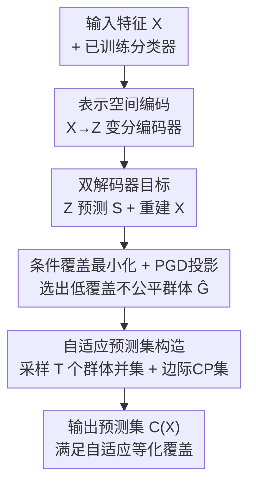

# Fair Conformal Classification via Learning Representation-Based Groups

**会议**: ICLR2026  
**OpenReview**: [https://openreview.net/forum?id=aa91WoBZeg](https://openreview.net/forum?id=aa91WoBZeg)  
**代码**: https://github.com/Xusr1123/FaReG  
**领域**: AI安全 / 公平性 / 共形预测 / 不确定性量化  
**关键词**: 共形预测, 公平性, 等化覆盖, 变分信息瓶颈, 表示学习

## 一句话总结
FAREG 把"找出被算法歧视的子群"这件事从原始特征空间搬到一个由变分信息瓶颈学出来的隐表示空间，因此能捕捉到像异或这种非线性组合定义的不公平子群，再对这些子群单独做共形校准，在保证自适应等化覆盖的同时把预测集做得又小又快（复杂度 $O(N+M)$，远低于 AFCP 的 $O(N\log N+NM)$）。

## 研究背景与动机
**领域现状**：共形预测（Conformal Prediction, CP）是给任意机器学习模型套上"分布无关、模型无关"覆盖保证的主流框架——它输出一个预测集 $C(X)$，并保证真标签落在集合里的概率不低于用户设定的 $1-\alpha$（如 90%）。集合越小信息量越大，所以 CP 同时追求覆盖率和效率（小集合）。

**现有痛点**：CP 默认只给**边际覆盖**（marginal coverage）——对全体人群平均成立。但算法偏见恰恰是"局部"的：错误率会系统性地集中在某些由特征条件定义的子群上（例如 `Race=Black & Gender=Female`）。边际覆盖在这些子群上可能严重失守，平均看起来很好、对弱势群体却很差，这正是公平性要解决的事。

**核心矛盾**：效率和公平存在张力——CP 想要小集合，而要让每个子群都达到目标覆盖（等化覆盖）往往需要更大的集合。更棘手的是，"所有可能的子群"数量随特征数指数爆炸，枚举在统计上和计算上都不可行。前序工作 Romano 等的 Partial 方法只能用**单个特征**当群体条件（如 `Gender=Female`），表达力不足；AFCP 进一步用贪心选 top-k 敏感特征，但它**只能处理离散特征的线性组合**，捕捉不了像"白人女性 或 黑人男性"这种异或式的非线性不公平子群，且基于朴素贝叶斯、计算开销高。

**本文目标**：设计一个群体识别方法，既要有足够表达力去刻画非线性组合定义的子群，又要计算高效，还要能保证这些自适应选出的子群上的等化覆盖。

**切入角度**：作者的关键观察是——既然原始特征 $X$ 上的线性/枚举方式表达力不够，那就**先把 $X$ 编码成一个高层隐表示 $Z=f(X)$，在 $Z$ 上去学"哪些样本属于低覆盖的不公平群体"**。隐空间天然能表达特征的非线性组合，从而把异或这类子群纳入视野；同时通过从 $Z$ 重建 $X$ 来补回可解释性。

**核心 idea**：用"在变分隐表示空间里学习不公平子群"代替"在原始特征空间枚举子群"，从而既扩表达力又控复杂度，再对学到的子群做共形校准取并集来兑现等化覆盖保证。

## 方法详解

### 整体框架
FAREG（Fair conformal prediction for REpresentation-based Groups）要解决的是：给定一个已训练好的分类器和一个校准集，自动找出被它不公平对待（条件覆盖偏低）的子群，并构造一个对这些子群都满足目标覆盖、同时尽量紧凑的预测集。整条流水线分三段：先用一个变分编码器把输入特征 $X$ 压成隐表示 $Z$；再在 $Z$ 上学一个二值成员变量 $S$（标记样本是否属于不公平群体），训练目标既要 $Z$ 能预测 $S$、又要能重建 $X$；最后对学到的群体反复采样、各自做一次共形校准，把所有预测集与标准边际预测集求并，得到带自适应等化覆盖保证的最终集合。

### 关键设计

**1. 表示空间分组：把不公平子群从原始特征搬进隐空间**

直接针对"原始特征上线性方法表达力不足、抓不到异或式子群"这个痛点。FAREG 不再从原始 $X$ 抽群体，而是先学一个映射 $z=f(x)\in\mathcal{Z}$，把 $x$ 编码成隐表示，再在 $z$ 上定义群体成员。具体地，引入二值随机变量 $S$ 表示成员身份，并用条件分布 $P(S\mid Z)$ 刻画——样本 $x$ 属于群体 $\hat{G}$ 的概率就是 $P(S=1\mid Z=f(x))$。因为 $z$ 是特征组合的高层抽象，一个隐维度可以编码原始多个特征的非线性交互，所以"白人女性 或 黑人男性"这种异或子群在 $Z$ 上变成可被一个简单分类器线性切开的区域。这是全文表达力提升的根源：换了空间，难题就线性化了。

**2. 变分信息瓶颈双解码器：让 $Z$ 既懂群体又能复原特征**

光有"搬到隐空间"还不够，得保证 $Z$ 既携带识别不公平群体所需的信息，又不沦为对样本身份的记忆（否则会过拟合校准集），同时还能重建 $X$ 把可解释性补回来。作者用深度变分信息瓶颈（Deep VIB）把这三件事统一进一个目标：

$$\max\ I(Z,S;\theta) + I(Z,X;\theta) - \beta I(Z,i;\theta)$$

三项依次是：$Z$ 与成员 $S$ 的互信息（要大，$Z$ 要能预测群体）、$Z$ 与特征 $X$ 的互信息（要大，$Z$ 要能重建输入）、$Z$ 与样本下标 $i$ 的互信息（要小，$Z$ 不该泄露具体是校准集里哪个个体）。经变分近似后落地成一个编码器-双解码器结构：随机编码器 $p_\theta(z\mid x)=\mathcal{N}(z\mid f_\mu(x),f_\sigma(x))$ 用两个 MLP 输出均值和方差并用重参数化采样；解码器 $\varphi$ 用 MSE 重建 $X$（对应 $I(Z,X)$，也是可解释性来源）；解码器 $\phi$ 是一个 logistic 回归 $q_\phi(s\mid \tilde z)=\sigma(f_m(\tilde z))$ 预测成员 $S$。最终损失为

$$\mathcal{L} = \mathcal{L}_{CC} + \mathcal{L}_{MSE} - \beta \mathcal{L}_{KL},$$

其中 KL 项把 $Z$ 压向标准正态 $r(z)=\mathcal{N}(0,1)$，起到丢弃无用信息（含个体身份）的作用。

**3. 带最小群体约束的条件覆盖最小化：用 PGD 投影确保"够大才可靠"**

成员解码器 $\phi$ 该往哪个方向学？作者把"找不公平群体"形式化为**最小化所选群体上的经验条件覆盖**——因为不公平群体就是覆盖最低的那群人：

$$\min_{\phi}\ \mathbb{E}_{S\sim B}\big[P_n[Y\in C(X)\mid X\in\hat{G}_S]\big]\quad \text{s.t.}\quad \frac{1}{N}\sum_{i=1}^N q_\phi(S_i=1\mid \tilde z)\ge \delta.$$

这里 $B=\prod_i \mathrm{Bernoulli}(q_\phi(S_i=1\mid\tilde z))$ 是群体成员的联合伯努利分布，$\delta$ 是群体规模占整个数据集的下界比例。约束至关重要：作者证明的 Proposition 1 给出经验覆盖 $P_n$ 与真实覆盖 $P$ 的偏差上界 $\propto \sqrt{(R\log N+\tau)/(\delta N)}$，表明要让估计可靠，一方面分类器 $h$ 的 VC 维要小（所以 $\phi$ 只用简单 logistic 回归），另一方面所选群体必须**足够大**（所以要 $\ge\delta$）——不然找到的"最差子群"只是噪声。为求解这个带约束的优化，作者用投影梯度下降（PGD）：每步先做一次梯度下降，若群体规模不满足约束就把 $q_\phi$ 投影回可行域，投影是一个 $\ell_2$ 最小化问题，闭式解为 $q'_\phi(s_i\mid\tilde z)=\min(1,\,q_\phi(s_i\mid\tilde z)+\omega/2)$（$\omega$ 由排序后的截断阈值确定）。

**4. 自适应预测集构造：多次采样取并集兑现等化覆盖保证**

选出不公平群体后，怎么把它变成对该群体有效的预测集？FAREG 先用经典自适应 CP 构造一个标准边际预测集 $C_m(X_{N+1},D)$，再从学好的伯努利分布 $B$ 中采样 $T$ 次得到 $T$ 个群体 $\hat{G}_{s_t}$，把**每个群体当作校准集**各构造一个预测集 $C_m(X_{N+1},\hat{G}_{s_t})$，最终取所有集合的并集：

$$C(X_{N+1}) = C_m(X_{N+1},D)\ \cup\ \bigcup_{t=1}^{T} C_m(X_{N+1},\hat{G}_{s_t}).$$

取并集是为了让任何被某个采样群体覆盖到的样本都得到该群体的校准保护。作者用 Theorem 1 证明：在可交换性假设下，该并集预测集对所选群体集 $\{\hat{G}_{s_t}\}$ 满足自适应等化覆盖（式 1），**且即便群体由非线性特征组合定义、这条保证依然成立**——这正是相比 AFCP 的关键优势。复杂度方面，整条流水线为 $O\big(EN(|\theta|+|\phi|+|\varphi|)+T(N+M)\big)=O(N+M)$，而 AFCP 是 $O(N\log N+NM)$。

### 损失函数 / 训练策略
总损失即式 (5)：$\mathcal{L}=\mathcal{L}_{CC}+\mathcal{L}_{MSE}-\beta\mathcal{L}_{KL}$，分别对应条件覆盖最小化、重建 MSE、与 KL 压缩项，$\beta$ 是信息瓶颈权重。训练中每个 batch 用重参数化采样 $\tilde z\sim f(x,\epsilon)$ 算三项损失并联合更新 $\theta,\phi,\varphi$，若群体规模约束被违反则用式 (4) 投影。实验固定 epoch 数与 batch size，因此编码器-解码器训练时间随样本量线性增长；$\delta$ 默认 0.5（用于 WSC$^+$ 评估）。

## 实验关键数据

### 主实验
在模拟精神疾病诊断的合成数据（6 类标签、4 个敏感特征 + 6 个非敏感特征，不公平子群由 `Color ⊙ Gender`（XNOR）定义）和真实 Nursery 数据（12,960 条、8 个分类特征、5 个优先级）上，对比经典边际 CP（Marginal）、首个等化覆盖方法 Partial、以及 SOTA 的 AFCP（AFCP1 选 1 个敏感特征 / AFCP2 借助"恰好两个特征"的强先验选 2 个）：

| 方法 | 群体条件覆盖 (目标 0.9) | 预测集大小（效率） | 时间复杂度 |
|------|------|------|------|
| Marginal | 不达标，子群欠覆盖 | 小但不公平 | $O(N+M)$ |
| Partial（单特征） | 不达标，表达力不足 | 中 | — |
| AFCP1 | 不达标（线性、抓不到异或） | 中 | $O(N\log N+NM)$ |
| AFCP2（强先验选2特征） | 仅样本量≥500 时勉强>0.9 | **显著偏大、信息量低** | $O(N\log N+NM)$ |
| **FAREG（本文）** | **唯一在各样本量下都≥0.9** | **小（接近基线）** | $O(N+M)$ |

关键结论：在合成数据与 Nursery 数据上，FAREG 都是**唯一**在 Group Coverage 与非线性指标 WSC$^+_n$ 两个口径下始终达到 0.9 有效覆盖的方法，且预测集大小没有像 AFCP2 那样为了覆盖而膨胀。运行时间上，样本量 2,000 的一次试验中，编码器-解码器训练占 161.3 秒、其余仅 0.8 秒，且训练时间随样本量线性增长，整体远快于 AFCP。

### WSC$^+$ 指标对比（消融/分析）
作者把传统条件覆盖度量 WSC（取所有含 $\delta$ 质量的线性 slab 中最差覆盖）扩展为非线性版 WSC$^+$——把线性映射 $v^TX$ 换成二次函数 $\pi(x)=x^TWx+v^Tx$，从而能挖出非线性定义的低覆盖群体。在固定预测集上，越小说明越能找出"最差子群"：

| $\delta$ | 0.1 | 0.2 | 0.3 | 0.4 | 0.5 |
|------|------|------|------|------|------|
| WSC$_n$ | 0.616 | 0.748 | 0.793 | 0.822 | 0.842 |
| WSC$^+_n$（本文） | **0.582** | **0.674** | **0.750** | **0.800** | **0.829** |
| 提升 | -5.52% | **-9.89%** | -5.42% | -2.68% | -1.54% |

WSC$^+_n$ 找到的最差 slab 覆盖比 WSC$_n$ 低最多 9.89%，说明它确实能发现传统线性度量漏掉的不公平群体；随 $\delta$ 增大、条件覆盖趋向边际覆盖（0.9），两者差距如预期收窄。

### 关键发现
- **表达力来自换空间**：随样本量增加，FAREG 选中目标特征 `X[0]`、`X[1]`（尤其是两者同时命中）的频率显著高于基线，且优势随数据量扩大——印证隐表示让非线性子群变得可学。
- **小集合 + 高覆盖可以兼得**：AFCP2 也能在样本足够时达到群体覆盖，但代价是预测集明显变大、信息量下降；FAREG 在不牺牲集合大小的前提下达到等化覆盖，说明效率-公平张力被有效缓解。
- **可解释性靠重建补回**：通过对隐表示 $Z$ 施加微扰（±0.001，借鉴 Beta-VAE）观察重建特征 $\hat X$ 的变化率，可定位最影响 $S$ 的维度并反查出对应的原始敏感特征。

## 亮点与洞察
- **"换空间"这一步是点睛**：把"枚举/线性组合特征找子群"这个组合爆炸难题，转化为"在变分隐空间里学一个简单分类器"，既拿到非线性表达力又把复杂度从 $O(N\log N+NM)$ 降到 $O(N+M)$，是典型的"换表示让难题线性化"。
- **理论与设计闭环**：Proposition 1 把"VC 维要小 + 群体要够大"直接翻译成"$\phi$ 用 logistic 回归 + 加 $\ge\delta$ 约束"两个具体设计选择，动机不是空话而是有界证明撑着。
- **WSC$^+$ 是可复用的评估工具**：把条件覆盖度量从线性 slab 推广到二次函数 slab，任何想评估"非线性子群是否被公平覆盖"的共形方法都能拿来用，独立于 FAREG 本身。
- **可迁移思路**：用 VIB 同时学"任务相关变量预测 + 输入重建 + 个体身份压缩"的三目标结构，可迁移到其他需要"既要可学群体、又要可解释、还要防记忆"的公平性/隐私场景。

## 局限与展望
- **作者承认的局限**：表示空间分组提升表达力的同时会部分牺牲可解释性——隐空间群体不如显式特征定义的群体直观；作者用解码器重建 $X$ 来缓解，但这是补偿而非根除。
- **强先验的对比设置**：AFCP2 依赖"恰好两个目标特征"这种现实中通常未知的强先验，FAREG 的优势部分建立在它不需要该先验上；但论文对"目标特征数完全未知、且不公平群体由更高阶非线性定义"的更极端情形展示有限。
- **覆盖保证的范围**：Theorem 1 保证的是对**所采样群体集** $\{\hat G_{s_t}\}$ 的自适应等化覆盖，依赖可交换性假设；对采样未触及的潜在不公平群体不提供保证，$T$ 的取值与覆盖完整性之间的权衡值得进一步研究。
- **可改进方向**：编码器-解码器训练占据绝大部分时间开销，若能用更轻量或可摊销的群体识别器进一步压低这部分成本，会让方法在大规模在线场景更实用。

## 相关工作与启发
- **vs Partial (Romano et al., 2020a)**：Partial 首次引入等化覆盖，但只用单个原始特征当群体条件，表达力不足且需预先指定受保护群体；FAREG 在隐空间自适应识别群体，无需预定义、且能表达非线性组合。
- **vs AFCP (Zhou & Sesia, 2024)**：AFCP 是当前 SOTA，用贪心选 top-k 敏感特征、基于朴素贝叶斯，只能处理离散特征的线性组合、计算开销 $O(N\log N+NM)$；FAREG 用 VIB 隐表示捕捉异或式非线性子群，复杂度降到 $O(N+M)$，且 Theorem 1 把覆盖保证扩展到非线性群体。
- **vs 连续特征等化覆盖 (Wang et al., 2023; Liu et al., 2022)**：这些工作面向回归任务、在连续特征上保证更细粒度的等化覆盖；FAREG 聚焦分类，且不假设受保护群体已知，而是自适应学习。
- **vs 标签条件覆盖 (Vovk et al., 2003; Ding et al., 2023)**：标签条件方法按真标签 $Y$ 划分受保护群体；FAREG 按特征 $X$ 的隐表示划分群体，关注的是特征侧的算法偏见。

## 评分
- 新颖性: ⭐⭐⭐⭐⭐ 把不公平子群识别迁到 VIB 隐空间、并配套非线性 WSC$^+$ 指标，角度新且有理论支撑。
- 实验充分度: ⭐⭐⭐⭐ 合成 + 真实数据、覆盖/效率/时间/特征选择频率多维度对比，但真实数据集仅 Nursery 一个，规模偏小。
- 写作质量: ⭐⭐⭐⭐ 动机-理论-设计闭环清晰，公式推导完整；部分关键结果以图呈现、缺少数值表略影响复现核对。
- 价值: ⭐⭐⭐⭐ 在可信机器学习/公平共形预测方向给出了表达力与效率兼顾的实用路径，且 WSC$^+$ 可独立复用。

<!-- RELATED:START -->

## 相关论文

- [\[ICLR 2026\] Fair Classification by Direct Intervention on Operating Characteristics](fair_classification_by_direct_intervention_on_operating_characteristics.md)
- [\[AAAI 2026\] Generalizing Fair Clustering to Multiple Groups: Algorithms and Applications](../../AAAI2026/ai_safety/generalizing_fair_clustering_to_multiple_groups_algorithms_and_applications.md)
- [\[ICLR 2026\] Rethinking Pareto Frontier: On the Optimal Trade-offs in Fair Classification](rethinking_pareto_frontier_on_the_optimal_trade-offs_in_fair_classification.md)
- [\[ICLR 2026\] Toward Enhancing Representation Learning in Federated Multi-Task Settings](toward_enhancing_representation_learning_in_federated_multi-task_settings.md)
- [\[ICML 2026\] Demystifying the Optimal Fair Classifier in Multi-Class Classification](../../ICML2026/ai_safety/demystifying_the_optimal_fair_classifier_in_multi-class_classification.md)

<!-- RELATED:END -->
