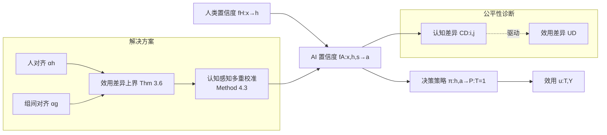

# Fair Decision Utility in Human-AI Collaboration: Interpretable Confidence Adjustment for Humans with Cognitive Disparities

**会议**: ICLR 2026  
**OpenReview**: [https://openreview.net/forum?id=hqq6GyYISN](https://openreview.net/forum?id=hqq6GyYISN)  
**代码**: [AI-Ethics-Safety-PaperCode/Fair_HAI](https://github.com/WEILaboratory/AI-Ethics-Safety-PaperCode/tree/main/Fair%20HAI%20(ICLR2026))  
**领域**: AI 安全 / 人机协作公平性  
**关键词**: 人机协作决策, AI 置信度校准, 效用公平, 多重校准 (multicalibration), 认知异质性  

## 一句话总结
针对"专家和新手共用同一套 AI 辅助决策"场景，本文指出现有的校准（calibration）和人对齐（human-alignment）都无法保证不同认知能力人群获得公平的决策效用，提出新目标 **组间对齐（inter-group-alignment）** 并用 **认知感知多重校准** 同时实现高效用和效用公平。

## 研究背景与动机
**领域现状**：在 AI 辅助决策（医疗诊断、信贷风控、量刑保释）中，AI 给出 0–1 的置信度，人类决策者把自己的置信度 $h$ 与 AI 的置信度 $a$ 结合做出最终决策。早期工作主张 AI 置信度应"完美校准"（与真实标签似然一致），后来 Corvelo Benz & Rodriguez (2023) 证明在单调决策策略下"人对齐"（AI 置信度与人类自身判断对齐）才能保证最优效用。

**现有痛点**：这些工作都把人类决策者当成同质群体。但现实中人受历史与社会背景影响，**认知能力是异质的**——同样报出 $h=0.9$ 的置信度，专家诊断对的概率显著高于新手。这意味着相同的 AI 置信度对不同群体产生的真实效用并不相等。

**核心矛盾**：本文从理论上证明（Theorem 3.2 / 3.4），**即使 AI 置信度完美校准、或完美人对齐，只要群间认知差异 $\text{CD}(i,j)\neq 0$，效用差异（utility disparity）依然非零**。也就是说，主流校准目标在数学上无法消除群体间的效用不公平。

**核心矛盾的后果**：这种不公平会侵蚀弱势群体（如经验少的医生）对 AI 的信任，更会放大"马太效应"——本就处于信息劣势的群体被进一步边缘化。

**本文目标**：缓解由人类决策者异质认知能力引起的 AI 辅助决策效用不公平，同时不牺牲整体效用。

**核心 idea（组间对齐）**：在"人对齐"之外，新增一个对齐目标——给定相同的 $h$ 和 $a$，让不同群体的正标签真实分布 $P(Y=1)$ 统计上相等，并用多重校准把两个目标统一到一个可操作的算法里。

## 方法详解

### 整体框架
本文先把问题形式化为一个由「认知差异 → 效用差异」驱动的公平性问题，再给出一个可证明的效用差异上界，最后用一个"认知感知多重校准"算法把上界压到最小。三步环环相扣：定义度量、推导上界、设计算法逼近上界的零点。

### 关键设计

**1. 认知差异与效用差异：把"不公平"量化出来。** 方法的第一步是定义两个度量，让抽象的"认知能力不同"变成可优化的统计量。认知差异定义为相同人类置信度 $h$ 下、不同群体真实正标签概率之差 $\text{CD}(i,j)=P(Y=1\mid z\in Z_{h,s_i})-P(Y=1\mid z\in Z_{h,s_j})$；只要存在某对群体 $\text{CD}\neq 0$，人群就是认知异质的。在此之上定义效用差异 $\text{UD}$（公式 4 的二分类版本），衡量给定相同 $a,h$、最终决策概率 $P(T=1)$ 相同时，两群体期望效用之差 $\big|\mathbb{E}_\pi[u(T,Y)\mid f_A(z)=a, z\in Z_{h,1}]-\mathbb{E}_\pi[u(T,Y)\mid f_A(z)=a, z\in Z_{h,0}]\big|$。公平的目标就是让 $\text{UD}\to 0$。理论结果（Theorem 3.2/3.4）随即证明：单靠校准或人对齐，只要 $\text{CD}\neq 0$，$\text{UD}$ 注定非零——这是后续引入新目标的根本动机。

**2. 组间对齐（inter-group-alignment）：补上缺失的那一维。** 既然失败的根源是"不同群体在相同 $h$ 下真实标签分布不同"，那就直接对这个分布下手。$\alpha_g$-组间对齐要求：存在子集 $Z'_h$ 覆盖至少 $(1-\alpha_g/2)$ 的样本，使得在给定 AI 置信度 $a$ 时，两群体的正标签概率差被压住 $\big|P(Y=1\mid f_A(z)=a, z\in Z'_{h,1})-P(Y=1\mid f_A(z)=a, z\in Z'_{h,0})\big|\le \alpha_g$。当 $\alpha_g\to 0$，不同群体在相同 $(h,a)$ 下做对决策的统计效用就趋于相等。它和人对齐是正交互补的：人对齐管"整体最优效用"，组间对齐管"群间公平效用"。

**3. 效用差异上界：把公平性变成可解释的旋钮。** 本文的理论核心（Theorem 3.6）给出一个紧致上界，把效用差异同时锚定在两个对齐水平上：
$$\text{UD}\le \big(u(1,1)-u(0,1)-u(1,0)+u(0,0)\big)\cdot\Big[\tfrac{\alpha_h}{2}+\big(1-\tfrac{\alpha_h}{2}\big)\cdot(3\alpha_g-\alpha_g^2)\Big].$$
由于 $3\alpha_g-\alpha_g^2\ge 0$，上界在 $\alpha_g=0$（完美组间对齐）时最小（Corollary 4.1）；进一步地，若 $f_A$ 同时完美人对齐与完美组间对齐，则存在单调策略同时取得最优整体效用和公平效用（Corollary 4.2）。这个上界的价值在于**可解释**——它清楚地告诉从业者：要公平，必须同时拧小 $\alpha_h$ 和 $\alpha_g$ 两个旋钮，而不是只盯校准误差。

**4. 认知感知多重校准：一个算法同时达成双目标。** 把人类决策者按认知相关敏感属性划成 $N$ 组，对每组 $s_i$ 构造子集族 $C_i=\{Z_{h,s_i}\}_{h\in H}$，要求 $f_A$ 对所有这些子集都满足 $\alpha$-校准（Method 4.3，称为 cognition-aware multicalibration），以区别于忽略认知差异的普通多重校准（Method 4.4）。关键定理 4.5 证明：若 $f_A$ 满足 $\alpha/2$-认知感知多重校准，则它**同时**满足 $\alpha$-人对齐和 $\alpha$-组间对齐——一个充分条件把前面两个目标一次性锁死。实现上用 $\lambda$-离散化（Hebert-Johnson et al., 2018）把 $[0,1]$ 切成 $\lfloor 1/\lambda\rfloor$ 个宽 $\lambda$ 的 bin，对每个 bin 内样本迭代修正置信度（Algorithm 1：先按 $Z_{h,s}$ 做组内校准，再对每组做组间均值对齐），并保证 $e_\alpha+\lambda\le\alpha/2$ 即可达到目标对齐水平。

## 实验关键数据

### 设置
- **数据**：Vodrahalli et al. (2022a) 公开人机交互数据集，4 个任务跨视觉/文本/表格——Art（画作年代）、Cities（城市识别）、Sarcasm（Reddit 讽刺判断）、Census（年收入是否 ≥\$50k）。按"教育程度"分两组：$S{=}0$（硕士及以上）、$S{=}1$（硕士以下）。清洗后共 14,999 条决策记录、469 名参与者。
- **基线**：① No Adjust（原始置信度不动）；② Cognition-unaware Multicalibration（Method 4.4，忽略认知差异）。本文方法为 Cognition-aware Multicalibration（Method 4.3）。
- **超参**：$e_\alpha=0.0001$、$\lambda=0.125$；决策策略 $\pi(h,a)$ 用单隐层 20 节点 ReLU MLP 学习。
- **指标**：效用用准确率；公平用准确率差异 $\text{Disp}=\mathbb{E}[\mathbb{1}(T{=}Y)\mid s{=}1]-\mathbb{E}[\mathbb{1}(T{=}Y)\mid s{=}0]$；对齐用 EAE/MAE（人对齐误差）与 EIAE/MIAE（组间对齐误差），越低越好。

### 主实验：对齐量化（Table 1，节选 EIAE/MIAE，越低越好）

| 任务 | No Adjust EIAE | Method 4.4 EIAE | Method 4.3 EIAE | No Adjust MIAE | Method 4.3 MIAE |
|------|----------------|-----------------|-----------------|----------------|-----------------|
| 1 Art | 0.0525 | 0.0345 | **0.0209** | 0.4286 | **0.1360** |
| 2 Cities | 0.1094 | 0.0145 | **0.0031** | 0.4085 | **0.1132** |
| 3 Sarcasm | 0.1180 | 0.0784 | **0.0063** | 0.5702 | **0.0458** |
| 4 Census | 0.0794 | 0.0328 | **0.0072** | 0.3601 | **0.1062** |

认知感知多重校准在全部 4 个任务上 EIAE/MIAE 均最优，组间对齐误差大幅下降；同时人对齐误差（EAE/MAE）保持竞争力（Art/Sarcasm 上略高，但差距仅 $10^{-3}\sim10^{-2}$ 量级）。

### 显著性检验（Table 2，100 次重复实验 T-test）

| 任务 | 效用 t | 效用 p | 效用差异 t | 效用差异 p |
|------|--------|--------|------------|------------|
| 1 | 3.018 | 0.003 | 9.486 | 0.000 |
| 2 | 0.345 | 0.731 | 15.484 | 0.000 |
| 3 | -12.187 | 0.000 | 3.186 | 0.002 |
| 4 | 4.839 | 0.000 | 27.556 | 0.000 |

### 消融与关键发现
- **认知无关多重校准不够、甚至反噬**：在任务 1，Method 4.4 的效用差异反而超过 No Adjust 基线，说明忽略认知差异的校准无法改善公平。
- **效用不被牺牲**：两种校准方法在所有任务上都把决策效用提升到 No Adjust 之上，且彼此 T-test 表现相当（公平的改进没有以损失整体效用为代价）。
- **公平显著改善**：认知感知多重校准在全部任务上取得最低效用差异，群间差距相比两个基线都显著缩小（效用差异 p 值多为 0.000）。
- 附录补充了组生成到多组、计算复杂度、多分类等扩展实验，进一步验证鲁棒性。

## 亮点与洞察
- **问题首发**：首次识别并刻画"人类决策者认知异质性"这一被忽视的人机协作效用不公平来源。
- **不可能性结果有冲击力**：用 Theorem 3.2/3.4 证明校准和人对齐这两个主流目标在认知异质下**注定无法公平**，把动机钉死在数学上而非直觉上。
- **可解释的公平旋钮**：Theorem 3.6 的上界把效用差异显式写成 $\alpha_h$ 与 $\alpha_g$ 的函数，给从业者明确的可操作指引——要公平就同时拧两个旋钮。
- **理论与算法闭环**：Theorem 4.5 证明一个多重校准条件就能同时蕴含两个对齐目标，理论上界和落地算法完全打通。

## 局限与展望
- **二分类为主**：理论与主实验聚焦二元决策与二元敏感属性，多分类与多组虽在附录验证，但仍是延伸而非核心。
- **依赖单调决策策略假设**（Assumption 2.1）：假设人类理性且决策单调，虽在附录讨论了违反情形下的鲁棒性，现实中非理性/非单调行为可能削弱保证。
- **数据规模与生态效度**：基于单一公开数据集（4 任务、469 人），按"教育程度"二分群体；真实高风险场景（临床、司法）中的认知分组更复杂，外推性待验证。
- **敏感属性需可得且可分组**：方法要求能按认知相关属性显式划分人群，当属性缺失、连续或交叉时如何处理仍需探索。

## 相关工作与启发
- **AI 辅助决策的置信度目标**：从校准（Pakdaman Naeini 2015 等）→ 实验发现未校准建议有时效用更高（Vodrahalli 2022b）→ 人对齐保证最优效用（Corvelo Benz & Rodriguez 2023），本文在这条线上补上"群间公平"一维。
- **多重校准**：借用 Hebert-Johnson et al. (2018) 的 $\alpha_y$-校准与 $\lambda$-离散化机制，把"对每个认知子群都校准"改造成同时实现人对齐与组间对齐的工具。
- **启发**：把"公平"从结果层（accuracy disparity）前移到"置信度对齐目标"层，是值得迁移到其他人机协作场景（如内容审核、辅助写作）的思路——只要存在"相同信号在不同用户群上含义不同"的结构，组间对齐这一目标都可能适用。

## 评分
- **新颖性**: ⭐⭐⭐⭐⭐ 首次提出认知异质性导致的人机协作效用不公平问题，并给出全新的"组间对齐"对齐目标和不可能性结果，视角原创。
- **实验充分度**: ⭐⭐⭐⭐ 4 个真实任务 + 100 次重复 + T 检验 + 多组/多分类附录验证，扎实；但数据集单一、群体仅按教育二分，生态效度有限。
- **写作质量**: ⭐⭐⭐⭐ 理论推进逻辑清晰（定义→不可能性→上界→算法→充分条件），定理环环相扣；公式密集，对非理论读者门槛较高。
- **价值**: ⭐⭐⭐⭐⭐ 触及高风险 AI 辅助决策中"马太效应"这一社会性痛点，提供可解释、可落地、保效用的公平校准方案，应用与理论价值兼具。

<!-- RELATED:START -->

## 相关论文

- [\[ICLR 2026\] Fair Reinforcement Learning for Just AI](fair_reinforcement_learning_for_just_ai.md)
- [\[ICLR 2026\] PluriHarms: Benchmarking the Full Spectrum of Human Judgments on AI Harm](pluriharms_benchmarking_the_full_spectrum_of_human_judgments_on_ai_harm.md)
- [\[ICLR 2026\] Generative Adversarial Post-Training Mitigates Reward Hacking in Live Human-AI Music Interaction](generative_adversarial_post-training_mitigates_reward_hacking_in_live_human-ai_m.md)
- [\[ICML 2026\] Position: Embodied AI Requires a Privacy-Utility Trade-off](../../ICML2026/ai_safety/position_embodied_ai_requires_a_privacy-utility_trade-off.md)
- [\[ICLR 2026\] SeRI: Gradient-Free Sensitive Region Identification in Decision-Based Black-Box Attacks](seri_gradient-free_sensitive_region_identification_in_decision-based_black-box_a.md)

<!-- RELATED:END -->
