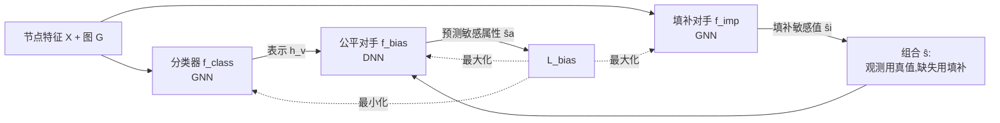

# Fair Graph Machine Learning under Adversarial Missingness Processes

**会议**: ICLR 2026  
**OpenReview**: [https://openreview.net/forum?id=WgZJCnb8lJ](https://openreview.net/forum?id=WgZJCnb8lJ)  
**代码**: [https://github.com/DebolinaHalder/BFtS](https://github.com/DebolinaHalder/BFtS)  
**领域**: 图公平性 / AI 安全 / 缺失数据  
**关键词**: 图神经网络, 群体公平, 敏感属性缺失, 对抗缺失, 三玩家对抗学习, 最坏情况填补

## 一句话总结
本文揭示了一个被忽视的攻击面——**对抗性的敏感属性缺失过程**可以让填补模型"看起来很公平"从而欺骗公平 GNN，并提出 BFtS：一个用三玩家对抗博弈、按"最坏情况公平"来填补缺失敏感值的框架。

## 研究背景与动机
**领域现状**：图神经网络（GNN）被广泛用于信贷、保释等高风险决策，这些决策会不成比例地影响特定群体，因此公平 GNN 成为研究热点。现有公平方法（FairGNN、FairVGNN、FairSIN、NIFTY 等）几乎都假设敏感属性（性别、种族）要么**完全可观测**，要么**完全随机缺失（MCAR）**。

**现有痛点**：现实中敏感属性恰恰最容易缺失——人口普查、健康调查的缺失模式往往与性别、年龄、种族强相关，疾病传播网络也有同样问题。于是公平方法不得不先做缺失填补，而填补误差会污染下游的公平性评估。

**核心矛盾**：本文指出了一个反直觉且危险的现象——**对抗性缺失过程能让填补后的数据集"看起来比真实数据更公平"**。论文用一个信贷例子说明：只看观测值时 ∆DP=0.25，常规填补（把多数邻居的性别赋给缺失节点）会得到 ∆DP=0.09 的"最佳情况"，但真实的最坏情况却是 ∆DP=0.47。如果攻击者能诱导填补模型输出前者、而真实数据是后者，那么在填补数据上训练出的"公平"模型，相对完整数据其实仍然有偏。这意味着现有公平保证可能是**误导性的**。

**本文目标**：设计一个对对抗缺失鲁棒的填补 + 公平分类框架，让公平性是在**最坏情况填补**下被评估和优化的，从而不被"伪装的公平"欺骗。

**核心 idea**：**最坏情况填补优于事后后悔（Better Fair than Sorry, BFtS）**——与其相信某个填补值是真实的，不如让填补逼近"对公平最不利"的情况，再让分类器去最小化这个最大偏差（minimize the maximum bias）。

## 方法详解

### 整体框架
BFtS 把"对抗缺失"建模成一个三玩家对抗博弈：一个公平分类器 $f_{class}$ 对抗两个协作的对手——敏感属性预测器 $f_{bias}$ 和缺失值填补器 $f_{imp}$。分类器在最坏情况填补下最小化最大偏差，两个对手则联手把局面推向"公平最难实现"的方向。整个目标用分布鲁棒优化（DRO）来奠基：因为对抗缺失下敏感值真实分布无法准确估计，于是对一个不确定集 $U$ 内的所有可能分布取最坏，$\theta^*_{class}=\arg\min_{\theta_{class}}\mathcal{L}_{class}+\alpha\max_{u\in U}\mathbb{E}_{s\sim u}[\mathcal{L}_{bias}]$。

### 关键设计

**1. 用威胁模型刻画"对抗缺失"，并证明攻击是 NP-hard：** 论文先把攻击者形式化。理想攻击者要解三层优化（AMAFC）：选一组观测节点 $V_S$ 使得在其上训练出的填补器、再训练出的公平分类器，在完整数据上偏差最大——这显然不可行。于是退一步定义 AMADB：只选 $V_S$ 让"基于填补值和标签算出的偏差"最小，从而误导任何依赖该填补的分类器。论文证明 **AMADB 仍是 NP-hard**（归约自覆盖问题）。这个"负结果"其实是正面信号：连攻击者的简化目标都难优化。更妙的是论文给出一个高效启发式——**度偏差假设（degree bias）**：GNN 对低度节点的填补更不准（$\deg(u)>\deg(v)\Rightarrow p(s_v\neq\hat s_v)>p(s_u\neq\hat s_u)$），且低度节点更易被攻击，所以攻击者只需把**低度节点的敏感值设为缺失**即可有效注入偏差。实验证实这个"度"启发式在 NBA 上能让填补低估真实偏差高达 433%。

**2. 三玩家架构与各自分工：** 三个模型各司其职又互相牵制。$f_{class}$ 是不直接使用敏感属性的 GNN 分类器，但会用到与敏感属性相关的其他特征；它要同时追求准确和公平，公平靠"让对手 $f_{bias}$ 预测不准"来实现。$f_{bias}$ 是从 $f_{class}$ 末层表示 $h_v$ 去预测敏感属性的对抗网络——**若它能准确预测，说明 $f_{class}$ 的表示泄露了敏感信息、即不公平**。$f_{imp}$ 是填补缺失敏感值的 GNN，但它不只追求填补准确，还扮演第二个对手：故意生成能**最大化 $f_{bias}$ 准确率**（即最大化偏差）的敏感值。三者构成"分类器 vs 两个对手"的格局，把公平性逼到最坏情况下检验。

**3. 损失函数与最坏情况填补的极小极大目标：** 分类用交叉熵 $\mathcal{L}_{class}$；填补用 LDAM（Label-Distribution-Aware Margin）损失 $\mathcal{L}_{imp}$ 应对敏感属性类别不均衡（margin $\Delta_j=C/n_j^{1/4}$，少数类拿更大间隔）；偏差损失 $\mathcal{L}_{bias}=\mathbb{E}_{h\sim p(h|\hat s=1)}[\log f_{bias}(h)]+\mathbb{E}_{h\sim p(h|\hat s=0)}[\log(1-f_{bias}(h))]$。三方参数交替更新：$\theta^*_{class}=\arg\min\mathcal{L}_{class}+\alpha\mathcal{L}_{bias}$、$\theta^*_{bias}=\arg\max\mathcal{L}_{bias}$、$\theta^*_{imp}=\arg\min\mathcal{L}_{imp}-\beta\mathcal{L}_{bias}$，合起来即 $\min_{\theta_{class}}\max_{\theta_{imp},\theta_{bias}}\mathcal{L}_{bias}$。$\beta$ 控制填补"准确 vs 最坏"的权衡。

**4. 零敏感信息也能工作 + 收敛鲁棒性保证：** 当几乎没有任何敏感信息时，BFtS 让 $f_{imp}$ 直接从训练标签 $y$ 出发用 LDAM 填补（把 $V_S$ 替成 $V_L$、$s$ 替成 $y$）——因为最坏情况公平模型通常把更优结果给非敏感组、更差结果给敏感组，于是被预测为少数类的节点会落入敏感组，正好契合最坏情况假设。理论上，BFtS 学到的 $f_{imp}$ 给出最坏情况填补（Theorem 2），$f_{class}$ 则在所有估计中取得最小的最大 ∆DP（Theorem 3，极小极大估计）。Corollary 1 进一步说明：独立填补若不准会让 $f_{bias}$ 两类表示的 JS 散度趋近 0、$\mathcal{L}_{bias}$ 退化为常数导致不收敛；而 BFtS 因为优化的是 JS 散度的上界，三玩家互动降低了散度消失的概率，故对抗训练更稳。

## 实验关键数据

### 主实验表格（无任何敏感信息设定，BFtS vs RNF）
百分比形式，AVPR/F1 越高越好，∆DP/∆EQ 越低越好。

| 数据集 | RNF %AVPR | RNF %F1 | RNF %∆DP | RNF %∆EQ | BFtS %AVPR | BFtS %F1 | BFtS %∆DP | BFtS %∆EQ |
|--------|-----------|---------|----------|----------|------------|----------|-----------|-----------|
| BAIL   | 81.0 | 85.3 | 11.65 | 8.51 | **83.1** | **86.2** | **8.01** | **4.12** |
| CREDIT | 80.4 | 75.9 | 8.01 | 7.25 | **82.1** | **76.8** | **5.97** | **4.96** |
| GERMAN | 73.2 | 74.4 | 9.42 | 8.92 | **74.1** | **74.7** | **6.42** | 7.68 |
| NBA    | 70.1 | 70.2 | 6.47 | 5.89 | **72.9** | 69.8 | **5.19** | **3.59** |
| POKEC-Z| 73.1 | 71.2 | 6.18 | 6.29 | **73.4** | **73.2** | **5.10** | **3.20** |
| POKEC-N| 71.6 | 72.2 | 7.58 | 7.09 | **72.6** | 69.6 | **4.29** | **3.01** |

BFtS 在公平指标（∆DP/∆EQ）上全面优于 RNF，准确率（AVPR）也基本持平或更优。

### 消融与分析实验

| 实验 | 设置 | 关键结论 |
|------|------|---------|
| 缺失过程对比 | degree / targeted / random 三种启发式 | degree（度启发式）最能让独立 GCN 填补低估真实偏差，NBA 上仅 20% 观测时低估高达 **433%** |
| 合成图 assortativity 扫描 | 同配系数 0.17→0.77 | 低同配时基线（FairGNN/Debias）因 JS 散度趋 0 难收敛、学不出标签；BFtS 始终保持更好的公平-准确权衡 |
| 真实数据公平-准确权衡 | 6 个真实数据集 vs 5 个基线 | BFtS 在 BAIL/NBA/GERMAN/POKEC-N/POKEC-Z 上以相近 F1 取得更低偏差 |
| 附录消融 | LDAM 损失、$V_S$ 比例、超参敏感度、GNN 骨干、可扩展性 | 验证各组件有效性与对大规模图的可扩展性 |

### 关键发现
- 现成填补会在对抗缺失下系统性**低估数据偏差**，使"公平"模型实际上仍有偏。
- 度启发式攻击只需图拓扑、无需真实标签/敏感值，威胁模型现实可行（选择性丢字段不破坏数字签名完整性）。
- BFtS 极少低估偏差，且在完全无敏感信息时仍能工作，是唯一与 RNF 同台竞争且更优的方法。

## 亮点与洞察
- **问题本身就是贡献**：首次把"对抗性敏感属性缺失"作为攻击公平性的独立威胁面提出，区别于以往的数据投毒/节点注入/边扰动，且论证其在有完整性保护的系统中更现实（丢字段 vs 篡改值）。
- **最坏情况公平的优雅实现**：用 DRO 动机 + 三玩家 minmax，把"不可信的填补"转化为"对最坏填补鲁棒"，并配有 NP-hard 难度证明和 minimax 公平上界保证。
- **收敛性洞察**：指出独立填补不准会让对抗损失退化（JS 散度消失），而三玩家结构优化的是散度上界，反而更稳——把工程上的训练不稳定问题给了理论解释。

## 局限与展望
- 公平指标聚焦群体公平的 ∆DP/∆EQOP，作者也承认想扩展到对预测排序更敏感的度量（如排序公平）。
- 度偏差启发式虽有效，但依赖"低度节点填补更不准"的经验假设，对极端图结构是否成立需更多验证。
- 三玩家对抗训练本身的调参（$\alpha,\beta$）和稳定性在更大规模图上的代价，主文留给附录，实际部署门槛偏高。
- 主要在二元敏感属性上展开，多类/连续敏感属性虽声称可推广，但缺乏正文实证。

## 相关工作与启发
- **图公平**：预处理类（FairOT/FairDrop/FairSIN/EDITS）、目标改造类（Fairwalk/NIFTY/FairVGNN）、对抗类（CFC/FLIP/Debias）——但都假设敏感属性完整可观测，BFtS 填补了"缺失 + 对抗"的空白。
- **缺失敏感属性下的公平**：Hashimoto 最坏组分布、Lahoti 对抗重加权、FairGNN（独立填补）、FairAC（不填补）、RNF（用标签生成代理）——BFtS 与 RNF 一脉相承（都能处理完全缺失），但用三玩家把"最大偏差最小化"做得更彻底。
- **对公平的对抗攻击**：UnfairTrojan/TrojFair 后门、NIFA 节点注入、FATE 双层投毒——本文转向"只靠操纵缺失"这一更隐蔽且合规约束下可行的攻击。
- **启发**：任何依赖"先填补再评估公平"的流水线，都应反思填补是否被对抗性缺失操纵；"对最坏情况建模"而非"相信点估计"是处理缺失敏感数据的更稳妥范式。

## 评分
- **新颖性**: ⭐⭐⭐⭐⭐ 提出全新的对抗缺失威胁面，并给出难度证明 + minimax 解法，问题与方法双新。
- **实验充分度**: ⭐⭐⭐⭐ 覆盖 6 真实 + 合成数据、5 个强基线、多种缺失启发式与消融，但正文表格略简、部分关键结果放在附录。
- **写作质量**: ⭐⭐⭐⭐ 用信贷 toy example 把核心矛盾讲得清晰，理论与直觉衔接好；三玩家公式稍密集。
- **价值**: ⭐⭐⭐⭐⭐ 直指现有公平保证可能被"伪装公平"误导的安全隐患，对高风险图决策的可信部署有现实意义。

<!-- RELATED:START -->

## 相关论文

- [\[ICLR 2026\] Machine Unlearning under Retain–Forget Entanglement](machine_unlearning_under_retainforget_entanglement.md)
- [\[ICLR 2026\] Private Rate-Constrained Optimization with Applications to Fair Learning](private_rate-constrained_optimization_with_applications_to_fair_learning.md)
- [\[ICLR 2026\] Fair Reinforcement Learning for Just AI](fair_reinforcement_learning_for_just_ai.md)
- [\[ICLR 2026\] Fairness via Independence: A General Regularization Framework for Machine Learning](fairness_via_independence_a_general_regularization_framework_for_machine_learnin.md)
- [\[ICLR 2026\] ReTrace: Reinforcement Learning-Guided Reconstruction Attacks on Machine Unlearning](retrace_reinforcement_learning-guided_reconstruction_attacks_on_machine_unlearni.md)

<!-- RELATED:END -->
