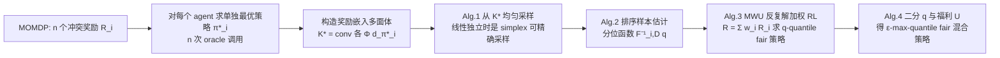

# Fair Reinforcement Learning for Just AI

**会议**: ICLR 2026  
**OpenReview**: [https://openreview.net/forum?id=XNNDODynCl](https://openreview.net/forum?id=XNNDODynCl)  
**代码**: 待确认  
**领域**: AI 安全 / 多目标对齐 / 公平强化学习  
**关键词**: quantile fairness, policy aggregation, oracle-efficient RL, pluralistic alignment, multiplicative weights  

## 一句话总结
把"分位数公平"从需要完整 MDP 转移表的表格算法，改造成只调用标准策略优化 oracle（约 $O(n)$ 次）的 oracle-efficient 算法，让"在多个冲突价值观之间做公平聚合"第一次能跑进深度 RL 规模，速度比前作快几个数量级。

## 研究背景与动机
**领域现状**——当前最强的 AI 系统靠 RLHF 与人类价值对齐，但 RLHF 把人类偏好建模成"围绕单一线性价值排序的噪声采样"，本质上假设存在一个**单一标量奖励**。这与现实中多元、相互冲突的人类价值观相悖，于是社区转向 *pluralistic alignment*（多元对齐）：显式承认存在多个不同的奖励/效用函数。

**现有痛点**——Alamdari et al. (2024) 提出 *policy aggregation*，把计算社会选择理论搬到 RL 上，用"分位数公平（quantile fairness）"刻画：一个策略若让**每个 agent 的回报都落在各自分布的前 $q$ 分位**，就是 $q$-quantile fair。但他们的算法要求**显式访问整张转移概率表**，并求解规模为状态数×动作数的线性规划——在深度 RL 里完全不可行。

**核心矛盾**——理论上漂亮的公平性保证，落地时被两件事卡死：(1) 估计分位数需要从占据多面体 $O$ 上**均匀采样策略**，而本文证明存在 MOMDP，其中非平凡回报策略只占指数级小的体积，均匀采样的样本复杂度随状态数指数爆炸；(2) 即便采样可行，求解 LP 的规模也依赖 $|S|\cdot|A|$。

**本文目标**——回答："是否存在**可证明 oracle-efficient** 的公平 RL 算法？"即只通过多项式次"策略优化 oracle"调用、不直接接触 MDP 结构，就能拿到 max-quantile fair 策略。

**核心 idea**——**换一个采样分布 + 换一个求解器**。不在整个占据多面体上定义公平，而是在"各 agent 单独最优策略张成的凸包" $K^*$ 上定义；并用 *multiplicative weights update*（乘性权重更新）代替 LP，把求公平策略变成"反复解一系列加权单奖励 RL 子问题"。

## 方法详解

### 整体框架
把问题建模为多目标 MDP（MOMDP）$(S,A,P,R_1,\dots,R_n,\rho_0,\gamma)$，每个 agent 有自己的奖励 $R_i$ 与回报 $J_i(\pi)=(1-\gamma)\mathbb{E}_\pi[\sum_t\gamma^tR_i(s_t,a_t)]$（也支持平均回报设定）；目标是输出单个（混合）策略，使每个 agent 的回报同时落在高分位。关键观察是 $J_i(\pi)=\langle d_\pi,R_i\rangle$ 对占据测度 $d_\pi$ 是线性的，而 $d_\pi$ 构成一个凸的占据多面体 $O$，于是"在多策略间公平聚合"被几何化为"在多面体上按各 agent 偏好排序选点"。整条管线分三步：先用单 agent 最优策略构造一个"奖励嵌入多面体"$K^*$ 作为公平性的参照分布 $D$；再设计 oracle-efficient 的采样器从 $D$ 估计分位函数 $F_{i,D}^{-1}$；最后用 MWU 把"满足分位约束 + 最大化总福利"求解出来，并二分搜索最大可行分位 $q^*$。全程只把"在加权奖励下做策略优化"当黑盒 oracle 调用，不接触转移表，因而能直接适配高维深度 RL。

### 关键设计

**1. 用回报嵌入而非占据测度——把公平性搬到 $n$ 维。** 每个策略 $\pi$ 的占据测度 $d_\pi$ 是 $S\times A$ 维的庞然大物，但 agent 真正在意的只有各自回报。作者定义**回报嵌入** $\Phi(d_\pi)=(J_1(\pi),\dots,J_n(\pi))$，把策略压到 $n$ 维空间（$n$ 是 agent 数，通常远小于状态数）。由于每个回报 $J_i(\pi)=\langle d_\pi, R_i\rangle$ 是占据测度的线性函数，分位数只依赖回报的相对排序，对奖励的正仿射变换不变——这正是 policy aggregation 优于"加权求和"类方法的根本：从行为反推奖励只能恢复到正仿射变换的程度，而本文方法天然不受影响。

**2. 把参照分布从 $O$ 换到 $K^*$——绕开指数采样复杂度。** 公平性的定义需要一个分布 $D$ 来回答"比多少比例的替代策略更优"。前作取 $O$（全体占据多面体）上的均匀分布，但 Theorem 5.1 构造了一个 MOMDP：其中 $q$-quantile fairness 只有当 $q$ 指数级接近 1 时才给出非平凡约束，意味着均匀采样要指数样本才有意义。本文改取**单独最优策略张成的凸包** $K^*=\mathrm{conv}\big(\{\Phi(d_{\pi_i^*})\}_{i\in[n]}\big)$ 上的均匀分布（Definition 5.3-5.4）。Proposition 5.5 进一步保证可把每个 $\Phi(d_{\pi_i^*})$ 调成 $K^*$ 的顶点。Theorem 5.6 证明：在 $K^*$ 上一定存在 $\tfrac{1}{e}$-quantile fair 的策略，且每个 agent 至少拿到自己最大回报的 $\tfrac{1}{n}$——既给了公平下界，又保证回报非平凡。

**3. Oracle-efficient 采样器——线性独立时退化为单纯形精采样。** 算出所有 $J_j(\pi_i^*)$ 就得到 $K^*$ 的 $n$ 维显式描述（仅需 $n$ 次策略优化 oracle 调用）。当各嵌入向量 $\Phi(d_{\pi_i^*})$ **线性独立**时，$K^*$ 就是 $n$ 顶点的单纯形，可用经典技巧精确均匀采样：抽 $n$ 个独立 $\mathrm{Exp}(1)$ 变量 $\alpha_j$，归一化 $\beta_j=\alpha_j/\sum_k\alpha_k$，取顶点的凸组合即可（Algorithm 1, Theorem 6.1，$O(n^2)$ 时间）。而在 RLHF 这种奖励本身是噪声估计的实际场景里，这些向量以高概率线性独立——所以快路径几乎总能命中；退化情形则回退到 hit-and-run MCMC（$\tilde O(n^3)$ 次迭代）。Algorithm 2 再把样本排序、取第 $\lfloor q\cdot s\rfloor$ 个作为 $F_{i,D}^{-1}(q)$ 的估计，样本复杂度只需 $O(q(1-q)/\epsilon^2)$。

**4. 用 MWU 代替 LP 求公平策略——只解加权单奖励 RL。** 有了分位估计 $v_i\approx F_{i,D}^{-1}(q)$，Algorithm 3 把"找 $q$-quantile fair 且总福利 $\ge U$ 的策略"写成在线凸优化里的乘性权重更新：维护权重 $w_i$ 和福利乘子 $u$，每轮解 $\pi^t\in\arg\max_\pi\sum_i(w_i^t+u^t)J_i(\pi)$——**这恰好是一个标准的单奖励 RL 问题**，奖励是 $R=\sum_i(w_i^t+u^t)R_i$；再按 $w_i^{t+1}=w_i^t\exp(\eta(v_i-J_i(\pi^t)))$ 更新权重以惩罚未达标 agent。$T=\log(n+1)/\epsilon^2$ 轮后取均匀混合策略，Theorem 6.3 保证输出是 $(q-\epsilon)$-quantile fair 且总福利至少 $U-\epsilon$。外层 Algorithm 4 对 $q$ 和 $U$ 各做一次二分，得到 max-quantile fair 解。整套算法对 oracle 的调用次数只跟 $n$（约 $O(n)$ 调用 + $O(\log n)$ 评估）相关，**完全不依赖 $|S|$、$|A|$**。

## 实验关键数据

环境沿用 Alamdari et al. (2024) 的 factory monitoring MDP（MIT 许可，改自 D'Amour et al. 2020）：监控 $m=5$ 个仓库、每步只能监控一个，$n=10$ 个 agent 对各仓库事故有不同代价，仓库在 normal/risky/incident 间转移。

### 主实验表格

| 指标 | Oracle-Efficient Max-Quantile（本文） | Original Max-Quantile | Egalitarian | Utilitarian |
|---|---|---|---|---|
| Nash Welfare ↑ | **0.701 ± 0.015** | 0.654 ± 0.010 | 0.4655 ± 0.0581 | 0.5736 ± 0.0471 |
| Gini Coefficient ↓ | **0.087 ± 0.007** | 0.066 ± 0.003 | 0.2126 ± 0.0209 | 0.2020 ± 0.0182 |
| $q^*$ | 0.883 ± 0.055 | 0.999 ± 0.001 | N/A | N/A |

### 效率对比

| 方法 | 硬件 / 配置 | wallclock |
|---|---|---|
| 本文 oracle-efficient | 单台笔记本（Intel Core Ultra 7 + 32 GB RAM） | ≈ **10 分钟** |
| Alamdari et al. (2024) | AMD EPYC 7502 32 核 + 258 GiB，20 并行线程 | ≈ 2 小时 |

### 关键发现
- **两种 max-quantile 方法都显著优于 utilitarian / egalitarian 基线**（Nash welfare 更高、Gini 更低），印证分位数公平比"最大化总和"或"最大化最小值"更均衡。
- **Theorem 5.1 的病态在真实环境里确有发生**：即便从 $O$ 上均匀采 $5\times10^5$ 个策略，原方法得到的 $q^*=1-\epsilon\,(\epsilon=0.001)$——几乎所有均匀采样策略回报都极低，分位估计形同虚设。本文在 $K^*$ 上则得到有意义的 $q^*=0.883$（即每个 agent 同时进前 12%），说明从 $K^*$ 采样的样本复杂度可控。
- 排序回报图显示：除回报最低的那个 agent 外，**所有 agent 在本文方法下回报都更高**，与"$K^*$ 偏向高回报策略"的直觉一致。

## 亮点与洞察
- **"换分布"是整篇文章的灵魂**：把参照分布从全体占据多面体换成单独最优策略的凸包 $K^*$，一举同时解决"非平凡回报策略体积指数小"和"无法 oracle-efficient 采样"两个难题，而且保留了正仿射不变性。
- **把社会选择理论的公平性翻译成可插拔的 RL 子程序**：MWU 每轮就是一次加权单奖励策略优化，意味着只要你手里有能跑的 RL 算法（PPO 等），就能直接套上这套公平保证，门槛极低。
- **线性独立 ⇒ 单纯形精采样**这一观察很巧：在 RLHF 噪声奖励下高概率成立，于是绝大多数情况走的是 $O(n^2)$ 的快路径而非昂贵 MCMC。
- 把"民主式 / 多元对齐"从口号落成**可证明、可计算、可在笔记本上跑**的算法，对 RLHF 多奖励模型场景有直接落地价值。

## 局限与展望
- **如何获得多个真实奖励函数仍是开放问题**：典型 RLHF 把多人偏好当作单一 ground-truth 奖励的噪声，本文假设已有 $n$ 个独立奖励 $R_i$，但"如何有代表性地学到多个不同奖励"未解决。
- **实验规模偏小**：只在一个 $5$ 仓库、$10$ agent 的合成 monitoring MDP 上验证，尚未在大规模深度 RL / 真实 RLHF pipeline 上端到端跑通，oracle 调用在真实任务里每次本身就很贵。
- **退化情形成本**：当嵌入向量线性相关时退回 hit-and-run MCMC（$\tilde O(n^3)$ 迭代、每步解 $n\times n$ LP），虽不依赖 $|S||A|$，但 $n$ 很大时仍有负担。
- $\tfrac{1}{e}$-quantile / $\tfrac{1}{n}$ 回报这类下界是最坏情况保证，离"每个 agent 都满意"还有距离；max-quantile 的 $q^*$ 也受环境结构上限约束。

## 相关工作与启发
- **直接前驱**：Alamdari et al. (2024) 的 policy aggregation（表格版、需显式 MDP）和 Babichenko et al. (2024) 的 quantile fairness（社会选择理论），本文是它们的 oracle-efficient 化。
- **RLHF 与社会选择**：已有工作发现基于 Bradley-Terry 的标准 RLHF 隐式用 Borda count 聚合奖励；von Neumann winner / maximal lotteries 路线（Swamy et al. 2024；Wang et al. 2023）是另一条聚合思路。
- **多目标 / 公平 RL**：Zhang & Shah (2014) 的正则化 maximin、Ogryczak et al. (2013) 的 Gini 福利、Nash 福利等"把多奖励数值合并成一个"的方法，本文指出这类方法**对奖励正仿射变换不变性会失效**，而 policy aggregation 不会。
- **另一类公平**：Jabbari et al. (2017) 研究的是单奖励下"学习过程本身"的公平（每步决策有现实后果），与本文关注"最终策略公平"正交。
- **启发**：当一个理论算法被"显式访问环境结构"卡住落地时，"找一个 oracle-efficient 的替代分布 + 用在线学习/MWU 把约束求解器换成反复调用现成优化器"是一条通用的工程化路径。

## 评分
- **新颖性**: ⭐⭐⭐⭐ — 把分位数公平从表格 LP 改造成 oracle-efficient、与 $|S||A|$ 解耦，"换 $K^*$ 参照分布"的洞察干净有力。
- **实验充分度**: ⭐⭐⭐ — 理论为主，实验只在单个小规模合成 MDP 上验证，缺真实 RLHF / 大规模深度 RL 的端到端证据。
- **写作质量**: ⭐⭐⭐⭐ — 问题动机、定理与算法层层递进，technical overview 清晰交代了每个难点如何被绕过。
- **价值**: ⭐⭐⭐⭐ — 为"多元/民主式 AI 对齐"提供了可插进任意策略优化器的可证明公平算法，落地门槛低、效率提升数量级。

<!-- RELATED:START -->

## 相关论文

- [\[ICLR 2026\] Private Rate-Constrained Optimization with Applications to Fair Learning](private_rate-constrained_optimization_with_applications_to_fair_learning.md)
- [\[ICLR 2026\] ReTrace: Reinforcement Learning-Guided Reconstruction Attacks on Machine Unlearning](retrace_reinforcement_learning-guided_reconstruction_attacks_on_machine_unlearni.md)
- [\[ICLR 2026\] Beware Untrusted Simulators -- Reward-Free Backdoor Attacks in Reinforcement Learning](beware_untrusted_simulators_--_reward-free_backdoor_attacks_in_reinforcement_lea.md)
- [\[ICLR 2026\] Fair Decision Utility in Human-AI Collaboration: Interpretable Confidence Adjustment for Humans with Cognitive Disparities](fair_decision_utility_in_human-ai_collaboration_interpretable_confidence_adjustm.md)
- [\[ICLR 2026\] Fair Graph Machine Learning under Adversarial Missingness Processes](fair_graph_machine_learning_under_adversarial_missingness_processes.md)

<!-- RELATED:END -->
