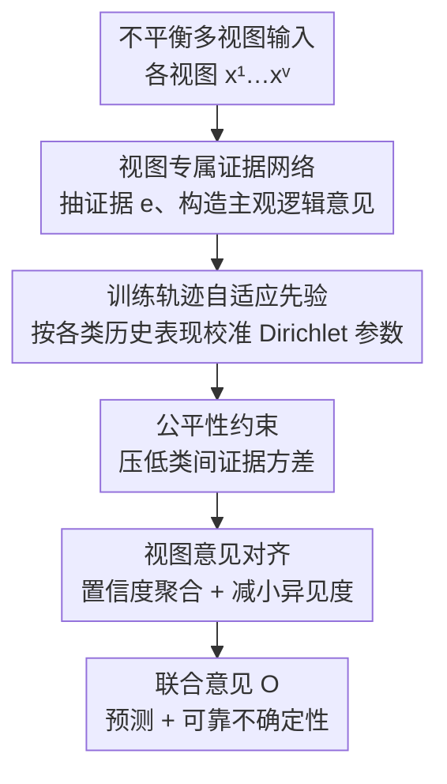

# Fairness-Aware Multi-view Evidential Learning with Adaptive Prior

**会议**: ICLR 2026  
**OpenReview**: [https://openreview.net/forum?id=VaqTJ5srKa](https://openreview.net/forum?id=VaqTJ5srKa)  
**代码**: 已作为补充材料上传（论文未给出公开 GitHub 链接）  
**领域**: 可信学习 / 不确定性估计 / 多视图证据学习  
**关键词**: 证据深度学习, 多视图融合, 类别不平衡, 公平性, 自适应先验

## 一句话总结
针对多视图证据学习中"样本更倾向于把支持证据分给数据多的类、导致不确定性估计不公平"这一被忽视的问题，本文提出 FAML：用**基于训练轨迹的自适应先验**替代证据深度学习里固定的均匀先验、加上**公平性约束**和**视图意见对齐**，在六个真实多视图数据集上同时提升了分类精度（尤其尾部类）和不确定性可靠性。

## 研究背景与动机
**领域现状**：多视图证据学习（MVEL）建立在证据深度学习（EDL）和主观逻辑（Subjective Logic）之上——每个视图各自抽取"证据"（evidence），用它参数化一个 Dirichlet 分布，从而在给出分类预测的同时给出不确定性。近年的工作大多聚焦于"证据级融合策略"如何更鲁棒，比如处理视图间冲突、降低低质量视图的权重。

**现有痛点**：这些方法都**默认每个视图抽出来的证据本身是公平、可靠的**，只在融合阶段做文章。但作者的实证分析（在不平衡的乳腺癌 BRCA 数据集上）发现：这个假设根本不成立。对于数据稀少的类（如 Her2），模型往往把支持证据大量错分给数据多的类（在视图一里给了 Normal、在视图二里给了 Basal），于是 Her2 样本会自信地被误分类；而那些被正确分类的 Her2 样本，又只拿到很少的支持证据，导致模型对正确预测反而给出低置信度。

**核心矛盾**：根源是**类别数量不平衡（quantity-induced bias）**——给某类分配更多证据的概率，对数据多的类显著高于数据少的类。这种偏差还是**视图特定（view-specific）**的：不同视图各自把尾部样本的证据错分到不同的数据多的类。最终结果是证据分配本质上不公平，不确定性估计随之不可靠。作者把这个新问题命名为 **Biased Evidential Multi-view Learning（BEML）**。

**本文目标**：消除学习过程中的证据偏差，使每个视图分给真值类的期望证据**与类别无关**（class-invariant），即 $\mathbb{E}_{(x,y=k)}[e^v_k(x)] = \mathbb{E}_{(x,y=k')}[e^v_{k'}(x)]$ 对任意类 $k,k'$ 成立，从而获得公平的证据分配和可靠的不确定性。

**切入角度**：不再纠结"怎么融合证据"，而是从**公平学习（fair learning）**的视角重写整个证据学习过程。关键观察是：EDL 里那个被视为无关紧要的"非信息均匀先验"（$\alpha_k = e_k + 1$ 里的常数 1）其实会主导后验，尤其对证据本来就少的样本影响更大——所以可以把先验改造成"会根据每个类的表现动态调节"的工具。

**核心 idea**：用**基于训练轨迹的自适应先验**替代固定的均匀先验——某个类表现越差，自适应先验就越大、补偿越多；随训练推进先验逐渐收敛回标准 EDL 的固定值。再配合公平性约束和视图意见对齐，把"修证据偏差"贯穿到学习和融合两个阶段。

## 方法详解

### 整体框架
FAML 要解决的是"输入一批类别不平衡的多视图数据、输出公平且可靠的预测+不确定性"。整体分三步走：先用每个视图各自的证据网络抽证据并构造主观逻辑意见；然后在构造 Dirichlet 参数时注入自适应先验、并用公平性损失约束证据方差，把"修偏差"做在每个视图内部；最后在融合阶段用基于置信度的证据聚合 + 意见对齐，把多个视图的意见整合成一个一致、互相支撑的联合意见。

### 关键设计

**1. 训练轨迹自适应先验：把"无关紧要"的均匀先验改成会补偿弱势类的调节器**

标准 EDL 里 Dirichlet 参数是 $\alpha_k = e_k + 1$，那个常数 1 代表"没有任何证据时各类等概率"的均匀先验。作者指出这个先验对证据稀少的样本会喧宾夺主，正是不公平的来源之一。FAML 把它换成第 $k$ 类在第 $t$ 个 epoch 上的训练轨迹先验：

$$\beta_k = \eta \cdot N_k \Big/ \sum_{n: y_n=k} \kappa(y_n, f_\theta(x_n)), \quad \kappa(y_n, f_\theta(x_n)) = \begin{cases} 1, & y_n = f_\theta(x_n) \\ 0, & y_n \neq f_\theta(x_n) \end{cases}$$

其中 $N_k$ 是第 $k$ 类样本数，$\eta$ 是控制先验强度的上调因子（upweight factor），分母是该类当前被正确分类的样本数。直观看：**某类被正确分类得越少（分母越小），它的 $\beta_k$ 就越大**——这天然形成了"表现越差、补偿越多"的关系。于是 Dirichlet 浓度参数变成 $\hat\alpha_k = e_k + \beta_k$。随着训练推进、各类逐渐学好，$\beta_k$ 会逐步收敛到一个接近标准 EDL 固定值的常数。理论分析（Theorem 4.3）进一步证明：对不平衡比 $\xi_k = N_{-k}/N_k \gg 1$ 的少数类，这个自适应先验能抬高其**证据间隔**（evidence margin $\rho_n = e_{nk} - \max_{j\neq k} e_{nj}$），从而把泛化误差界改善一个 $\tilde{O}(1/\sqrt{\xi_k \Delta\beta_k})$ 的因子——数据越不平衡、模型自反馈越强，泛化收益越大。

**2. 公平性约束：用类间证据方差当显式正则，直接逼证据分配均匀**

光有自适应先验只能隐式纠偏，无法显式保证分给真值类的证据是无偏的。为此作者定义了一个可量化的指标 **Fairness Degree（公平度）**：取每个类样本分给其真值类的平均证据 $\bar{e}_k$，再算这些类级平均证据的方差

$$f(\{\bar{e}_k\}_{k=1}^K) = \mathrm{Var}(\{\bar{e}_k\}) = \frac{1}{K}\sum_{k=1}^K (\bar{e}_k - \bar{e})^2$$

公平度低，说明各类拿到的支持证据量相当、对待公平；公平度高，说明系统性偏差存在。把它直接当公平性损失 $\mathcal{L}_{fc} = \mathrm{Var}(\{\bar{e}_k\})$（mini-batch 内计算），就把"证据要均匀"写进了优化目标。训练时它的权重 $\mu_t = \min(1.0, t/T)$ 随 epoch 退火式上升，让早期先把证据学出来、后期再逐渐强化公平约束，避免一上来就被尚不稳定的偏差证据带偏。消融显示这一项对 ECE（校准误差）的改善尤其明显，正是因为它显式压住了证据方差、让不确定性更可靠。

**3. 视图意见对齐：从二阶不确定性层面消除视图特定偏差，逼各视图"既预测一致、也自信程度一致"**

因为偏差是视图特定的，单靠视图内纠偏不够，融合阶段还要让视图之间互相校准。FAML 先用**基于置信度的证据聚合**（confidence-based aggregation）替代等权融合：把每个视图的置信度定义为 $c = 1 - u$（$u$ 是不确定性质量），聚合证据为 $e_k = \frac{c_A}{c_A + c_B}e^A_k + \frac{c_B}{c_A + c_B}e^B_k$，即更信任不确定性低的视图。再引入**异见度（Dissonance Degree）**衡量任意两视图意见的差异——它不是比一阶概率差（像 KL/JS 散度那样），而是比 Dirichlet 分布的方差 $\mathrm{Var}(\alpha^v_k) = p^v_k(1-p^v_k)\frac{u^v}{K+u^v}$，捕捉的是**二阶不确定性**：$d(w^A,w^B) = \sum_k |\mathrm{Var}(\alpha^A_k) - \mathrm{Var}(\alpha^B_k)|$。把它作为一致性损失 $\mathcal{L}_{con}$ 去最小化，等于要求不同视图不仅在"预测哪个类"上一致，还要在"对这个预测有多自信"上一致，从而把视图特定偏差也压下去。

### 损失函数 / 训练策略
监督项用真值标签与 Dirichlet 均值之间的期望交叉熵 $\mathcal{L}_{ace}(\hat\alpha_n) = \sum_k y_{nk}(\psi(S_n) - \psi(\hat\alpha_{nk}))$（$\psi$ 为 digamma，$S_n$ 为 Dirichlet 强度）。再叠加类平衡策略与公平损失，得到 batch 级 $\mathcal{L}_{acc} = \sum_n \frac{1}{N_{y_n}}\mathcal{L}_{ace}(\hat\alpha_n) + \mu_t \mathcal{L}_{fc}$。总损失把聚合视图与各视图的 $\mathcal{L}_{acc}$ 以及一致性损失相加：$\mathcal{L} = \mathcal{L}_{acc} + \sum_{v=1}^V \mathcal{L}^{(v)}_{acc} + \lambda \mathcal{L}_{con}$。训练前会先 warm-up 视图专属证据网络若干 epoch（实验中 10–20 较优），再引入自适应先验，以保证初期网络稳定。

## 实验关键数据

### 主实验
六个真实多视图数据集（Handwritten、Animal、Scene15、YaleB、Caltech-101、BRCA），对比单视图证据方法（TLC / I-EDL / R-EDL）和多视图证据方法（TMC / ETMC / CCML / ECML），按 Head / Med / Tail 三个类别区域报告 ACC 与 ECE（5 个随机种子）。

| 数据集 | 指标 | FAML | 次优 | 说明 |
|--------|------|------|------|------|
| Handwritten | ACC All / Tail | 94.2 / 92.5 | 90.2 / 83.1 (ETMC) | 尾部精度大幅领先 |
| Animal | ACC All | 76.3 | 68.9 (TLC/R-EDL) | All 提升约 7.4% |
| Caltech-101 | ACC All / Tail | 83.6 / 67.8 | 75.9 / 57.5 | All +7.7%、Tail +10.3% |
| BRCA | ACC All / ECE All | 82.9 / 15.0 | 77.1 / 24.3 | 精度最高、ECE 最低 |

不确定性可靠性（失败预测任务，用不确定性区分对/错预测）：

| 数据集 | AUROC↑ FAML / 次优 | FPR-95↓ FAML / 次优 |
|--------|--------------------|----------------------|
| Handwritten | 85.7 / 81.9 | 64.3 / 66.5 |
| Animal | 82.1 / 79.4 | 75.3 / 74.4 |
| YaleB | 90.3 / 88.7 | 57.1 / 61.0 |
| BRCA | 82.9 / 77.1 | 75.6 / 83.7 |

FAML 在六个数据集上几乎全面取得更高 AUROC、更低 FPR-95，且 ECE 在所有类别区域都显著更低。证据强度可视化（Figure 3）显示：对比方法把证据严重堆给 head 类、饿着 tail 类，而 FAML 让各类证据强度分布相对均匀，打破了"样本数 ↔ 证据量"的依赖。

### 消融实验
逐项叠加三个组件（AP=自适应先验、$\mathcal{L}_{fc}$=公平损失、$\mathcal{L}_{con}$=一致性损失），下表节选 BRCA 与 Handwritten（ACC↑ / ECE↓）：

| AP | $\mathcal{L}_{fc}$ | $\mathcal{L}_{con}$ | BRCA ACC/ECE | Handwritten ACC/ECE |
|----|------|------|--------------|---------------------|
| – | – | – | 74.3 / 28.0 | 85.7 / 32.9 |
| ✓ | – | – | 77.5 / 21.5 | 86.3 / 27.7 |
| ✓ | ✓ | – | 81.1 / 16.2 | 87.3 / 25.2 |
| ✓ | ✓ | ✓ | **82.9 / 15.0** | **94.2 / 20.6** |

### 关键发现
- **自适应先验贡献最基础**：仅加 AP，BRCA 精度 74.3%→77.5%、ECE 28.0%→21.5%，六个数据集全面提升，验证了"按训练轨迹补偿弱势类"的有效性。
- **公平损失主攻校准**：在 AP 基础上加 $\mathcal{L}_{fc}$，对 ECE 改善尤为明显（显式压低证据方差 → 不确定性更可靠）。
- **一致性损失看视图数**：$\mathcal{L}_{con}$ 的收益因数据集而异，视图越多越有用——视图多时视图间冲突/异见更易出现，显式对齐更关键。
- **warm-up 与超参敏感性**：不做 warm-up（0 epoch）普遍更差，10–20 epoch 最佳、超过 20 略降；上调因子 $\eta$ 呈先升后降（太大会诱发过自信），一致性权重 $\lambda$ 的较优区间为 $[1,5]$，整体对超参较鲁棒。

## 亮点与洞察
- **把"被忽略的均匀先验"变成纠偏工具**：以往 EDL 里 $\alpha_k = e_k + 1$ 的那个常数 1 被当作无关紧要，本文敏锐地指出它对证据稀少样本会主导后验，并改造成"表现越差、补偿越大、训练后期自动收敛"的自适应先验——一个很巧的杠杆点。
- **公平度（证据方差）既是诊断指标又是损失**：同一个量既能可视化诊断偏差、又能直接塞进目标函数，诊断与优化闭环，思路干净。
- **用二阶不确定性度量视图一致性**：异见度比较的是 Dirichlet 方差而非一阶概率差，让"两个视图自信程度是否一致"也可优化——这个把不确定性当一等公民的对齐思路可迁移到其他多模态/多专家融合场景。
- **理论与现象对得上**：margin 理论给出 $\tilde{O}(1/\sqrt{\xi_k\Delta\beta_k})$ 的泛化改善因子，解释了为什么尾部类收益最大，和证据强度可视化的现象自洽。

## 局限与展望
- 作者承认方法局限于**有监督多视图分类**，依赖完整标签；未来想探索无显式标签（如聚类驱动）下如何保持证据学习的公平。
- 自适应先验依赖"训练轨迹上的正确分类计数"，在标签噪声大或早期模型很差时，这个统计量可能不稳定（虽然有 warm-up 缓解），论文未深入讨论噪声标签场景。
- 实验用的多视图数据集多为传统特征视图（手写、场景、生物组学），缺少大规模深度特征/真实多模态（图文）场景的验证，方法在更复杂模态上的可扩展性仍待观察。
- 引入了 $\eta$、$\lambda$、warm-up epoch、退火步 $T$ 等多个超参，虽说较鲁棒，但跨数据集仍需一定调参成本。

## 相关工作与启发
- **vs 主流 MVEL（TMC / ECML / CCML）**: 它们都假设每个视图的证据天然公平、只优化融合阶段（处理冲突、加权低质视图）；FAML 指出证据抽取阶段本身就不公平，从公平学习视角重写学习过程，把纠偏前移到视图内部，因此在尾部类和校准上明显更稳。
- **vs 不平衡公平方法（UMIX / GroupDRO）**: 这类方法要么靠重采样/合成数据预处理，要么需要预定义子群信息做最差组优化；FAML 不需要子群标注，仅凭训练轨迹自适应调先验，是一个更内生、更灵活的通用证据学习框架。
- **vs 改进先验/证据的 EDL（R-EDL / I-EDL）**: R-EDL 放松主观逻辑假设、I-EDL 改进证据收集，但多数仍用固定均匀先验；FAML 第一次把"训练轨迹驱动的自适应先验"引入 Dirichlet 构造，专门针对证据偏差。

## 评分
- 新颖性: ⭐⭐⭐⭐⭐ 首次揭示并形式化多视图证据学习中的证据偏差（BEML）问题，自适应先验切入点巧妙且有理论支撑。
- 实验充分度: ⭐⭐⭐⭐ 六数据集、多指标（ACC/ECE/AUROC/FPR-95）、按类别区域细分 + 完整消融与敏感性分析；略缺大规模真实多模态场景。
- 写作质量: ⭐⭐⭐⭐ 问题动机由实证现象引出、逻辑清晰，理论与可视化呼应；个别公式排版有小瑕疵。
- 价值: ⭐⭐⭐⭐⭐ 面向医疗诊断、自动驾驶等高风险场景的可信不确定性估计，公平视角与即插即用的先验设计实用价值高。

<!-- RELATED:START -->

## 相关论文

- [\[ICLR 2026\] Robust Adversarial Quantification via Conflict-Aware Evidential Deep Learning](robust_adversarial_quantification_via_conflict-aware_evidential_deep_learning.md)
- [\[ICLR 2026\] RESFL: An Uncertainty-Aware Framework for Responsible Federated Learning by Balancing Privacy, Fairness and Utility](resfl_an_uncertainty-aware_framework_for_responsible_federated_learning_by_balan.md)
- [\[ICLR 2026\] Bridging Fairness and Explainability: Can Input-Based Explanations Promote Fairness in Hate Speech Detection?](bridging_fairness_and_explainability_can_input-based_explanations_promote_fairne.md)
- [\[CVPR 2026\] When CLIP Sees More, It Fights Back Harder: Multi-View Guided Adaptive Counterattacks for Test-Time Adversarial Robustness](../../CVPR2026/ai_safety/when_clip_sees_more_it_fights_back_harder_multi-view_guided_adaptive_counteratta.md)
- [\[ICLR 2026\] Toward Enhancing Representation Learning in Federated Multi-Task Settings](toward_enhancing_representation_learning_in_federated_multi-task_settings.md)

<!-- RELATED:END -->
