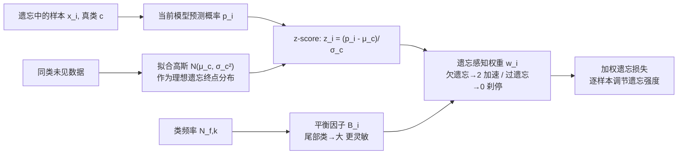

# FaLW: A Forgetting-aware Loss Reweighting for Long-tailed Unlearning

**会议**: ICLR 2026  
**OpenReview**: [https://openreview.net/forum?id=kBnvzwO5pN](https://openreview.net/forum?id=kBnvzwO5pN)  
**代码**: 随论文补充材料提供  
**领域**: 机器遗忘 / 数据隐私 / 长尾学习 / AI 安全  
**关键词**: Machine Unlearning, Long-tailed Distribution, Loss Reweighting, Right to be Forgotten, Unlearning Deviation  

## 一句话总结
首次研究"遗忘集呈长尾分布"这一真实场景，发现现有近似遗忘方法会产生**异质遗忘偏差**与**倾斜遗忘偏差**，并提出即插即用的实例级动态损失重加权方法 FaLW，用"未见数据的预测概率分布"来度量每个样本的遗忘状态、自适应调节遗忘力度。

## 研究背景与动机
**领域现状**：机器遗忘（Machine Unlearning）旨在从训练好的模型中高效抹除特定数据的影响，以兑现 GDPR"被遗忘权"。重训练（retrain from scratch）是金标准但代价高不可行，因此实践中主流是近似遗忘（approximate unlearning），用专门的损失函数引导模型擦除指定数据，并以成员推断攻击（MIA）等经验指标评估效果。

**现有痛点**：以往评测几乎都把遗忘集（forget set）构造成**随机采样**的子集。作者实证发现（图 1a），从 CIFAR-100 反复随机抽 20% 得到的类别分布几乎是均衡的——这与现实严重不符。现实里的遗忘请求天然长尾：一个用户注销账号时，其数据受个人兴趣塑造，往往高度集中在少数几个类别。**没有任何工作研究过遗忘集本身长尾时会发生什么。**

**核心矛盾**：作者引入"遗忘偏差（Unlearning Deviation）"概念——以重训练模型 $\theta^*$ 在真类上的概率为理想目标，把近似模型的输出分为欠遗忘（under-forgetting，置信度仍偏高）、忠实遗忘（faithful）、过遗忘（over-forgetting，置信度被压得过低）。在长尾遗忘集上，他们观测到两个现象：**①异质遗忘偏差**——模型对头部类样本欠遗忘、对尾部类样本过遗忘，不同类别表现迥异；**②倾斜遗忘偏差**——这种偏差的幅度在尾部类上不成比例地更严重。现有方法都是"整体视角（holistic）"设计，盯着聚合遗忘效果，无法处理这种逐样本、逐类别的差异化偏差。

**本文目标**：设计一个能在更细粒度（样本/类别级）上调节遗忘强度的自适应机制，同时缓解异质与倾斜两类偏差。

**核心 idea**：**用"未见数据分布"标定遗忘进度** —— 对要遗忘的样本，其理想遗忘终点应当是"从未见过它的模型"的预测置信度，而后者可用同类未见数据的预测概率分布来近似；据此设计**遗忘感知动态权重**实时调节每个样本的遗忘力度，再用一个**平衡因子**让尾部类的调节更激进。

## 方法详解

### 整体框架
FaLW 是一个即插即用的实例级损失重加权模块，挂在通用的梯度型近似遗忘目标上。它把原本对遗忘集统一施加的遗忘损失，改成给每个样本 $(x_i,y_i)$ 乘一个动态权重 $w_i$：

$$\min_{\theta_u}\ \alpha\sum_{(x_i,y_i)\in D_f} w_i\cdot L((x_i,y_i);\theta_u) + \beta\cdot L(D_r;\theta_u) + \lambda\cdot R(\theta_u,\theta_o)$$

整个流程分三步：先**度量**每个样本当前离"理想遗忘终点"有多远（用同类未见数据的概率分布做参照系），再据此算出一个**遗忘感知权重**自动加速欠遗忘样本、刹停过遗忘样本，最后用**平衡因子**按类别频率放大尾部类的调节灵敏度。

### 关键设计

**1. 用未见数据分布近似遗忘终点：把"是否遗忘干净"变成可测量的量。** 遗忘的本质是把模型对某样本的状态从"见过"还原到"没见过"，理想终点是重训练模型的置信度 $p_{\theta^*}(c\mid x_i)$。命题 2 证明：保留了样本知识的模型，其真类置信度必然高于剔除该样本重训的模型，即 $p_{\theta_o}(c\mid x_i)\ge p_{\theta^*}(c\mid x_i)$——这给出了一条理想遗忘轨迹：置信度应从高单调下降、收敛到目标值就停止。但单样本的 $p_{\theta^*}$ 不可得，作者把"确定性目标"松弛为"目标分布"：一个被遗忘干净的样本，其置信度应当与该类**从未见过的数据**的置信度无法区分。于是用一个留出验证集，对每个类 $c$ 把未见样本的预测概率拟合成高斯 $p_\theta(c\mid x')\sim\mathcal N(\mu_c,\sigma_c^2)$，作为该类的"忠实遗忘"参照系。这一步可以在遗忘过程中动态估计，绕过了"必须知道重训练结果"的死结。

**2. 遗忘感知权重：用 z-score 把样本钉在轨迹上，过遗忘刹停、欠遗忘加速。** 对样本 $(x_i,y_i=c)$，先算它当前概率偏离目标分布多少个标准差，即标准 z 分数 $z_i=(p_i-\mu_c)/\sigma_c$，再构造权重

$$w_i = 1 + \operatorname{sign}(z_i)\cdot\big(\tanh(|z_i|)\big)^{1/\eta},\quad z_i=\frac{p_i-\mu_c}{\sigma_c}$$

其中 $\tanh(\cdot)$ 把偏差幅度压进 $(-1,1)$，$\operatorname{sign}(\cdot)$ 决定方向，温度超参 $\eta>0$ 控制响应灵敏度。直觉很清晰：当样本被**过遗忘**，$p_i$ 远低于均值，$z_i$ 是大负值，$w_i\to 1-1=0$，对它的遗忘压力被切断；当样本**欠遗忘**，$p_i$ 是正离群点，$z_i$ 大正值，$w_i\to 1+1=2$，遗忘力度被加倍。这样无需任何类别先验，就能对**所有**样本同时防止过遗忘与欠遗忘，直接对症"异质遗忘偏差"。

**3. 平衡因子：按类频率把尾部类的调节做得更"敏感"。** 异质权重解决了方向问题，但"倾斜遗忘偏差"说明尾部类偏差幅度更大、需要更激进的纠正。作者引入与类频率成反比的平衡因子

$$B_i=\Big(\frac{N_f}{C\cdot N_{f,k}}\Big)^{\tau}$$

$N_f$ 是遗忘集总样本数、$N_{f,k}$ 是类 $c$ 的样本数、$C$ 是类别数、$\tau\ge 0$ 是超参。尾部类样本少，$B_i$ 大。把它塞进权重的指数上替代 $\eta$：

$$w_i = 1 + \operatorname{sign}(z_i)\cdot\big(\tanh(|z_i|)\big)^{1/B_i}$$

$B_i$ 越大，$w_i$ 对 $z_i$ 的反应越陡峭，意味着尾部类一旦出现偏差就被更快地纠正回来。两者叠加，FaLW 就能同时"感知并缓解"异质与倾斜两类偏差：异质靠权重方向、倾斜靠平衡因子的灵敏度调制。

## 实验关键数据

### 主实验表格
VGG-16 在 CIFAR-10（10% 遗忘率，$\gamma=1$）与 Tiny-ImageNet（40% 遗忘率，$\gamma=1/2$）上，对比 9 个 baseline，指标为 FA / RA / TA / MIA 与各自相对 Retrain 的 **Avg. Gap**（越小越好）：

| 方法 | CIFAR-10 Avg. Gap | CIFAR-10 std | Tiny-ImageNet Avg. Gap | Tiny-IN std |
|---|---|---|---|---|
| FT | 31.95 | 2.85 | 2.18 | 0.39 |
| RL | 3.69 | 0.94 | 4.13 | 0.99 |
| GA | 27.77 | 2.06 | 10.42 | 3.09 |
| IU | 38.18 | 0.18 | 19.61 | 0.50 |
| L1-sparse | 38.07 | 0.77 | 10.54 | 1.71 |
| SFRon | 3.68 | 0.76 | 2.93 | 1.02 |
| SalUn | 2.45 | 0.41 | 2.14 | 0.15 |
| **FaLW** | **0.35** | 0.20 | **0.40** | 0.19 |

> FaLW 的 Avg. Gap 比次优的 SalUn 小一个数量级（0.35 vs 2.45 / 0.40 vs 2.14），且在 FA/RA/TA/MIA 几乎所有单项上都最接近 Retrain。

### 消融实验表格
**不同失衡程度（CIFAR-100，ResNet-18，30% 遗忘率，$\gamma$ 从 0 到 2）下 FaLW vs SalUn 的 Avg. Gap**：

| $\gamma$ | 0 | 1/4 | 1/3 | 1/2 | 1 | 3/2 | 2 |
|---|---|---|---|---|---|---|---|
| SalUn | 1.55 | 1.54 | 1.54 | 1.19 | 2.04 | 1.22 | 2.29 |
| **FaLW** | **0.68** | **0.91** | **0.86** | **0.93** | **0.93** | **0.85** | **1.30** |

**平衡因子消融（CIFAR-100，ResNet-18，30% 遗忘，$\Delta$FA 越接近 0 越好）**：

| $\gamma$ | Balance Factor | $\Delta$Mid FA | $\Delta$Tail FA |
|---|---|---|---|
| 1.5 | ✘ | -9.98 | -12.19 |
| 1.5 | ✔ | **-8.04** | **-9.46** |
| 2 | ✘ | -12.56 | -18.76 |
| 2 | ✔ | **-10.71** | **-13.04** |

### 关键发现
- **SalUn 随失衡加剧会从"过遗忘"翻转到"欠遗忘"**：低失衡时 FA 低于 Retrain（过遗忘），高失衡时 FA 超过 Retrain（欠遗忘）；FaLW 在所有 $\gamma$ 下 FA 都紧贴 Retrain，证实它确实缓解了异质偏差。
- **平衡因子是一个权衡**：加入后头部类 FA 略降，但尾部类 FA 大幅改善（如 $\gamma=2$ 时尾部 $\Delta$FA 从 -18.76 收窄到 -13.04），印证其专门针对倾斜偏差。
- FaLW 即插即用，可叠加到现有梯度型遗忘方法上（附录给出 plug-and-play 分析）。

## 亮点与洞察
- **问题立意新**：第一个指出"随机采样遗忘集其实是均衡的、与现实长尾请求脱节"，并形式化出异质/倾斜两类遗忘偏差，开了一个被忽视的口子。
- **巧妙的可测代理**：用"同类未见数据的预测概率分布"作为遗忘终点参照系，把不可得的重训练目标 $p_{\theta^*}$ 转成可在线估计的高斯——这是整个方法能落地的关键。
- **机制直觉极强**：z-score + tanh 让权重在 0 与 2 之间自然实现"刹停过遗忘 / 加速欠遗忘"，平衡因子用类频率的幂次直接控制灵敏度，两者解耦清晰、各司其职。

## 局限与展望
- **仅在图像分类上验证**：未涉及 LLM、生成模型、检测/分割等更复杂的遗忘场景，长尾遗忘在这些任务上是否同样成立尚未知。
- **依赖留出未见数据估计 $\mu_c,\sigma_c$**：需要一个能反映各类分布的验证集，若某些尾部类在留出集上样本也极少，高斯估计可能不稳；高斯假设本身的合理性放在附录讨论，但非所有分布都近高斯。
- **超参较多**：$\eta$、$\tau$、$\alpha/\beta/\lambda$ 都需调，尾部类高 $B_i$ 带来的头部类 FA 轻微退化也说明存在固有权衡。

## 相关工作与启发
- **机器遗忘**：分精确遗忘（可证明擦除，深度模型需完整重训）与近似遗忘（梯度型，靠损失引导擦除）。FaLW 属近似遗忘的增强，补上了长尾这一空白。与之相关的还有 SalUn、SFRon、L1-sparse 等梯度/稀疏化方法。
- **长尾学习（LTL）**：重采样/重加权、迁移学习/知识蒸馏、多专家模块化等。作者强调长尾遗忘与传统 LTL 目标不同——LTL 求提升尾部性能，长尾遗忘求从失衡集合中**擦除**信息同时兼顾头尾类的遗忘表现变化。
- **启发**：把"理想但不可得的目标"松弛成"可在线估计的分布"，再用偏离该分布的统计量（z-score）做自适应控制，这个思路可迁移到其他需要"知道何时停止优化"的场景（如持续学习的稳定性-可塑性权衡）。

## 评分
- **新颖性**: ⭐⭐⭐⭐⭐ 首次提出并形式化长尾遗忘问题，"未见数据分布作遗忘终点"的代理设计精巧，问题立意与解法都有原创性。
- **实验充分度**: ⭐⭐⭐⭐ 覆盖 3 数据集、2 架构、9 baseline、多失衡因子与遗忘率，消融到位；但缺非分类任务与更大模型的验证。
- **写作质量**: ⭐⭐⭐⭐ 动机—观测—方法逻辑顺畅，命题与图示清晰；个别公式排版/措辞略有瑕疵。
- **价值**: ⭐⭐⭐⭐ 揭示了遗忘评测中"随机采样≈均衡"这一被忽视的假设漏洞，即插即用、可叠加现有方法，对隐私合规落地有实际意义。

<!-- RELATED:START -->

## 相关论文

- [\[ICLR 2026\] Towards Privacy-Guaranteed Label Unlearning in Vertical Federated Learning: Few-Shot Forgetting without Disclosure](towards_privacy-guaranteed_label_unlearning_in_vertical_federated_learning_few-s.md)
- [\[CVPR 2026\] FedCART: Tackling Long-Tailed Distributions in Federated Adversarial Training via Classifier Refinement](../../CVPR2026/ai_safety/fedcart_tackling_long-tailed_distributions_in_federated_adversarial_training_via.md)
- [\[ICML 2025\] Rethinking the Bias of Foundation Model under Long-tailed Distribution](../../ICML2025/ai_safety/rethinking_the_bias_of_foundation_model_under_long-tailed_distribution.md)
- [\[ICLR 2026\] Machine Unlearning under Retain–Forget Entanglement](machine_unlearning_under_retainforget_entanglement.md)
- [\[ICML 2026\] How Hard Can It Be? Hardness-Aware Multi-Objective Unlearning](../../ICML2026/ai_safety/how_hard_can_it_be_hardness-aware_multi-objective_unlearning.md)

<!-- RELATED:END -->
