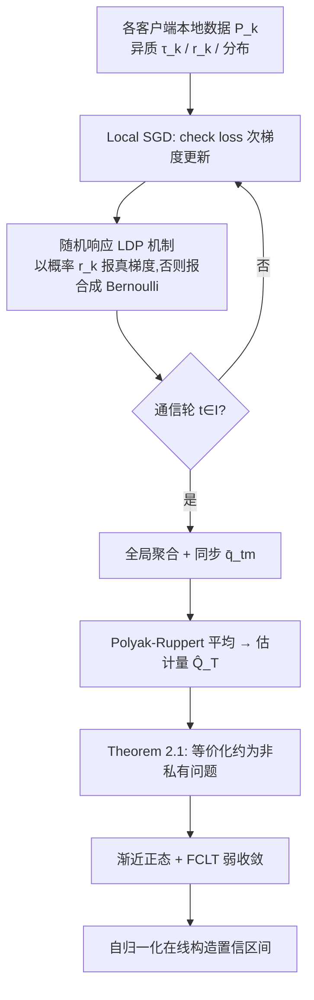

# Federated Learning of Quantile Inference under Local Differential Privacy

**会议**: ICLR 2026  
**OpenReview**: [https://openreview.net/forum?id=a5bFKVtTyF](https://openreview.net/forum?id=a5bFKVtTyF)  
**代码**: 待确认  
**领域**: 联邦学习 / 差分隐私 / 统计推断  
**关键词**: 局部差分隐私, 分位数推断, 联邦学习, Local SGD, 自归一化, 函数中心极限定理  

## 一句话总结
本文提出一种在局部差分隐私（LDP）下做联邦分位数**推断**（不只是点估计）的 Local-SGD 算法，通过一个隐私机制把 LDP 问题等价化约成非私有问题，进而在分位数损失非光滑的条件下首次建立了 Local SGD 的弱收敛理论，并用自归一化技术免去对渐近方差的估计、直接构造有效置信区间。

## 研究背景与动机

**领域现状**：现代数据生态越来越需要"分布层面"的保证而非简单均值——医院网络要监控急诊等待时间的 0.9 分位数、金融机构要用 VaR/ES 评估尾部风险。这些目标都是异质、可能重尾分布的分位数，而且数据天然分散在各机构手里，原始数据集中化往往因通信、存储、隐私和监管壁垒而不可行，于是联邦学习成为自然选择。

**现有痛点**：① 仅在服务器/数据孤岛侧加隐私保护已不够——医疗金融数据泄露表明，一旦托管方被攻破，server 端 DP（CDP）就保护不了个人。LDP 在每条记录离开设备前就随机化，对应"既不信服务器也不信孤岛"的最保守信任假设，但代价是误差率从 CDP 的 $O(n^{-1})$ 恶化到 $O(n^{-1/2})$，会**改变极限分布、抬高渐近方差**，使得仅凭点估计采集的数据难以一致地估计方差。② 现有分位数 LDP 方法要么是忽略客户端异质性的单机过程，要么只给点估计、没有一般的推断保证。

**核心矛盾**：要在 LDP 联邦异质环境下做分位数推断，至少卡三个点——推断不仅需要极限分布、还需要对渐近方差的一致估计，而 SGD 类方法的方差估计通常依赖**光滑损失的 Hessian**，可分位数损失非光滑；LDP 下只能观测被扰动的梯度，朴素方差估计要么再耗隐私预算要么要分数据；联邦算法还得对异质损失和客户端级隐私参数都稳健。

**本文目标**：设计一个 LDP 下的联邦分位数过程，既能给出**有效的置信区间和假设检验**，又能容纳客户端在分位数目标、隐私预算、数据分布上的异质性，且应对非光滑损失。

**核心 idea**：**【化约 + 自归一化】** 先用一个随机响应式 LDP 机制把"带隐私的联邦分位数估计"**等价改写成一个非私有的分位数优化问题**（只是分布和分位数水平被平移），从而把难题转移到分析非私有估计的统计性质；再用自归一化构造 pivotal 统计量，绕过对方差/密度等冗余参数的估计。

## 方法详解

### 整体框架

设有 $K$ 个客户端，各自持有从未知分布 $P_k$ i.i.d. 抽取的本地数据，权重 $p_k$、本地分位数水平 $\tau_k$，全局目标是协同估计满足 $\sum_{k=1}^K p_k F_k(Q^\star)=\tau$ 的全局分位数 $Q^\star$（其中 $\sum_k p_k\tau_k=\tau$，且只需知道全局 $\tau$ 而非各 $\tau_k$）。整体管线分三步：客户端用 check loss 的次梯度跑 Local SGD，梯度经随机响应机制扰动后只在通信轮 $\mathcal{I}$ 上聚合（Polyak–Ruppert 平均得 $\widehat{Q}_T$）；理论上把这个 LDP 过程证明等价于一个非私有问题以建立渐近正态与函数中心极限定理（FCLT）；最后用自归一化在线构造置信区间。

### 关键设计

**1. 随机响应 LDP 机制：把分位数梯度当二元响应来扰动。** 关键观察是 check loss $\ell_{\tau_k}(x,Q)=(x-Q)\{\tau_k-\mathbb{I}(x<Q)\}$ 的梯度结构本质上是一个**二元响应**（取决于 $\mathbb{I}(x_t^k>q_t^k)$），于是隐私化可以借助随机响应+置换来做：每个客户端以真实响应率 $r_k\in(0,1]$ 的概率上报真实梯度，否则上报一个合成的 Bernoulli 随机变量。这给出 $\epsilon_k$-LDP，其中隐私参数 $\epsilon_k=\log(1+r_k)-\log(1-r_k)$，整套算法按组合性满足 $(\max_k \epsilon_k,0)$-LDP。$r_k$ 越小隐私越强但精度越差，把"隐私预算"具体化成了一个可调的响应率，天然支持客户端级别的异质隐私。

**2. 等价化约定理：把带隐私问题改写成非私有问题（Theorem 2.1）。** 这是全文的理论枢纽。记 $\tilde\tau_k=r_k\tau+(1-r_k)/2$，论文证明：在 $\epsilon_k$-LDP 下用 $P_k$ 的数据求解联邦损失 (2.1)，**等价于**求解一个非私有问题
$$Q^\star=\arg\min_Q \sum_{k=1}^K \frac{p_k}{r_k}\,\mathbb{E}_{x_k\sim\widetilde{P}_k}\{\ell_{\tilde\tau_k}(x_k,Q)\},$$
即把 LDP 数据换成从平移后的分布 $\widetilde{P}_k$、平移后的分位数水平 $\tilde\tau_k$ 抽样的非私有数据。这一步的价值在于把"如何分析被扰动梯度"的难题转化为"分析非私有非光滑分位数估计"的已知套路，隐私的影响被完全编码进 $(\widetilde{P}_k,\tilde\tau_k)$ 与 $r_k$ 的缩放里。算法每次迭代把全局信息 $\tau$ 与客户端数据 $x_t^k$、隐私预算 $r_k$ 融合，从而纠正异质 LDP 机制聚合带来的偏差，更新式为 $q_t^k\leftarrow q_{t-1}^k+\frac{1-r_k+2\tau r_k}{2r_k}\eta\,\mathbb{I}(s_t^k=1)-\frac{1+r_k-2\tau r_k}{2r_k}\eta\,\mathbb{I}(s_t^k=0)$。

**3. 非光滑损失下的弱收敛理论（Theorem 3.1–3.2）。** 基于化约后的非私有问题，论文建立渐近正态：$\sqrt{t_T}(\widehat{Q}_T-Q^\star)\xrightarrow{d}\mathcal{N}\big(0,\ \nu\sum_k p_k^2 [r_k^{-2}-(2Q_k-1)^2]/[4(\sum_k p_k f_k(Q^\star))^2]\big)$，收敛率 $(\min_k r_k\,t_T)^{-1/2}$ 由隐私预算最大（$r_k$ 最小）的客户端决定，清晰刻画了隐私-精度权衡（$r_k=1$ 时退化为经典非私有渐近正态，存在 $r_k=0$ 则方差发散）。更进一步建立 FCLT：部分和过程 $Q_T(s)$ 在 $\ell^\infty[0,1]$ 上弱收敛到布朗运动。**亮点是这绕开了现有文献普遍假设的 L-average smoothness 条件**——分位数损失不满足该光滑条件，作者据称给出了 Local SGD 在该条件不成立时的**首个弱收敛结果**。

**4. 自归一化在线推断：免估计方差直接造 CI。** 直接用 Theorem 3.1 构造 CI 需要未知的 $Q_k$ 和密度 $f_k(Q^\star)$，而后者仅凭扰动梯度极难一致估计。作者改用自归一化：定义 $V_T=\sum_m (r_m-r_{m-1})\{Q_T(r_m)-\tfrac{m}{T}Q_T(1)\}^2$，则 $Q_T(1)/\sqrt{V_T}$ 收敛到一个**与分布无关（pivotal）**的极限 $B(1)/[\int_0^1\{B(r)-g(r)B(1)\}^2 dr]^{1/2}$，从而构造 CI 时无需再额外花隐私预算去估计冗余参数。该 L2 范数自归一化器还能**在线计算**（Algorithm 2 维护若干累积量增量更新），适配流式联邦场景。

## 实验关键数据

### 主实验（Hete L 设置，正态分布，95% 名义覆盖）

固定 $K=10$、$p_k=1/K$，对比本文三种通信间隔策略（C1=并行 SGD、C5、Log）与三种 baseline（DP-SGD、分而治之 DC、单机 LDP Single）。表中为 ECP（括号内 MAE）：

| 设置 | τ | r | C1（本文） | DP-SGD | DC | Single |
|---|---|---|---|---|---|---|
| $t_T=10000$ | 0.3 | hetero | 0.949(0.0096) | 0.947(0.0142) | 0.898(0.1302) | 0.954(0.0095) |
| $t_T=10000$ | 0.8 | hetero | 0.962(0.0122) | 0.943(0.0186) | 0.709(0.2684) | 0.958(0.0114) |
| $t_T=10000$ | 0.8 | 0.9 | 0.990(0.0042) | 0.968(0.0065) | **0.049**(0.2098) | 0.966(0.0067) |
| $t_T=50000$ | 0.3 | hetero | 0.911(0.0056) | 0.885(0.0083) | **0.093**(0.1282) | 0.958(0.0038) |

### 消融 / 策略对比

| 维度 | 观察 |
|---|---|
| 通信间隔策略 | C1（通信最频繁）MAE 最小；固定 $t_T$ 下 C1≈Single baseline |
| 固定通信轮数 T | Log 策略整体最优、MAE 最小（兼顾通信与统计效率） |
| 样本量 / 响应率 | $t_T$ 或 $r$ 增大，MAE 单调下降，与理论收敛率一致 |
| 对比 DP-SGD | DP-SGD 覆盖率多数也接近 95%，但 MAE 一致大于本文方法 |

### 关键发现
- 本文方法在所有场景下 ECP 都接近或超过 95% 名义水平，**DC（分而治之）在异质场景下严重失效**：如 Hete L、τ=0.8、r=0.9 时 ECP 仅 0.049，τ=0.3、$t_T$=50000 时 ECP 仅 0.093，验证了简单合并单机 LDP 估计会产生显著偏差和无效推断的论点。
- 实验另含真实数据应用（美国各州收入估计全国中位数），佐证了对数据异质性和隐私异质性的处理能力。

## 亮点与洞察
- **"化约为非私有问题"是优雅的理论杠杆**：通过 Theorem 2.1 把隐私的全部影响吸收进平移后的分布与分位数水平，避免直接硬刚被扰动梯度的分析，是把 LDP 推断变可解的关键一招。
- **真正补上了"推断"而非"估计"的缺口**：LDP 下做有效 CI/检验远难于点估计，自归一化巧妙规避了非光滑损失下密度/方差不可一致估计的障碍，且不额外消耗隐私预算。
- **理论新意扎实**：在不满足 average-smoothness 条件下给出 Local SGD 的弱收敛（FCLT），是对随机优化理论的实质推进，非光滑分位数损失正是其典型应用。
- **异质性建模到位**：客户端可有各自的分位数目标 $\tau_k$、隐私预算 $r_k$、数据分布，贴合真实联邦环境。

## 局限与展望
- 理论与方法聚焦**一维标量分位数**，多维分位数/分位数回归（带协变量）等更一般的推断尚未覆盖。
- 隐私机制基于随机响应，要求梯度具有二元响应结构——这正适配 check loss，但能否推广到更一般的非光滑损失尚不清楚。
- 收敛率由隐私最强（$r_k$ 最小）的客户端决定，单个极端隐私客户端会拖累整体精度，缺乏对此的自适应加权或鲁棒化处理。
- 实验以模拟为主、客户端数固定 $K=10$，大规模客户端、客户端掉线/异步通信等真实联邦系统问题未充分检验。

## 相关工作与启发
- **联邦 Local SGD 推断**：Li et al. (2022)、Xie et al. (2024)、Zhu et al. (2024) 在 average-smoothness 下建立弱收敛，本文把这一线推进到非光滑损失。
- **LDP 机制**：随机响应承接 Liu et al. (2023b) 的单机 LDP 分位数框架，本文将其联邦化并补上一般推断保证；与直接加 Laplace 噪声的 DP-SGD（Song et al. 2013）形成对比，后者 MAE 更大。
- **自归一化推断**：沿用 Shao (2015)、Liu et al. (2023b) 的思路，把"FCLT → pivotal 自归一化统计量"用在 LDP 联邦场景，免估计冗余参数的范式值得迁移到其他非光滑、隐私受限的在线推断问题。

## 评分
- 新颖性: ⭐⭐⭐⭐ — "化约为非私有问题 + 非光滑损失下 Local SGD 弱收敛 + 自归一化 LDP 推断"组合具实质理论新意，填补了 LDP 联邦分位数推断的空白。
- 实验充分度: ⭐⭐⭐ — 模拟覆盖多种异质场景且有真实数据应用，但客户端规模小、缺大规模/异步系统层面验证。
- 写作质量: ⭐⭐⭐⭐ — 问题动机、三大挑战、贡献层次清晰，理论叙述严谨。
- 价值: ⭐⭐⭐⭐ — 为隐私受限、异质联邦环境下的分布层面统计推断提供了可落地且有理论保证的工具，对医疗/金融等敏感场景有实际意义。

<!-- RELATED:START -->

## 相关论文

- [\[ICLR 2026\] Convergent Differential Privacy Analysis for General Federated Learning](convergent_differential_privacy_analysis_for_general_federated_learning.md)
- [\[ICLR 2026\] Protection against Source Inference Attacks in Federated Learning](protection_against_source_inference_attacks_in_federated_learning.md)
- [\[ICLR 2026\] INO-SGD: Addressing Utility Imbalance under Individualized Differential Privacy](ino-sgd_addressing_utility_imbalance_under_individualized_differential_privacy.md)
- [\[CVPR 2026\] LDP-Slicing: Local Differential Privacy for Images via Randomized Bit-Plane Slicing](../../CVPR2026/ai_safety/ldp-slicing_local_differential_privacy_for_images_via_randomized_bit-plane_slici.md)
- [\[ICLR 2026\] RESFL: An Uncertainty-Aware Framework for Responsible Federated Learning by Balancing Privacy, Fairness and Utility](resfl_an_uncertainty-aware_framework_for_responsible_federated_learning_by_balan.md)

<!-- RELATED:END -->
