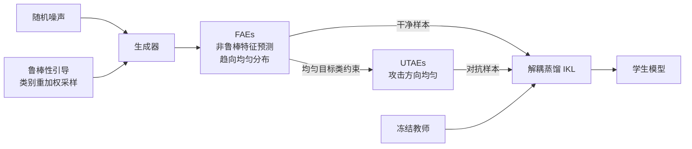

# FERD: Fairness-Enhanced Data-Free Adversarial Robustness Distillation

**会议**: ICLR 2026  
**OpenReview**: [https://openreview.net/forum?id=jGXTx64gal](https://openreview.net/forum?id=jGXTx64gal)  
**代码**: [https://github.com/mayaobuduyao/FERD](https://github.com/mayaobuduyao/FERD)  
**领域**: 对抗鲁棒性 / 数据无关知识蒸馏 / 鲁棒公平性  
**关键词**: data-free robustness distillation, robust fairness, adversarial examples, class reweighting, information bottleneck  

## 一句话总结
FERD 首次把"鲁棒公平性"引入数据无关鲁棒蒸馏，通过对合成样本的**类别比例**重加权和对抗目标的**分布**均匀化，让学生模型在最弱类别上的鲁棒性大幅提升，缓解了类间鲁棒性严重失衡的问题。

## 研究背景与动机
**领域现状**：轻量模型部署到边缘设备时鲁棒性差，对抗鲁棒蒸馏（ARD）把鲁棒教师的防御能力迁移给学生。但真实训练数据常常拿不到，于是数据无关鲁棒蒸馏（Data-Free Robustness Distillation, DFRD）应运而生——用生成器合成替代样本，不依赖原始数据就能传递鲁棒性。

**现有痛点**：现有 DFRD 方法（DFARD、DERD、DFHL 等）只盯着"整体鲁棒性"这一个指标，完全忽略了**鲁棒公平性**——模型可能对某些类别极其鲁棒，对另一些类别却不堪一击，类间差距巨大。这种失衡在实际应用中会带来可靠性和安全隐患。

**核心矛盾**：本文实测发现两个被忽视的现象：（1）即使用**类别等比例**的合成数据蒸馏，学生在不同类别上的鲁棒性依然差异显著，且这种类间差距在蒸馏过程中被进一步**放大**；（2）学生对不同**攻击目标类**的防御能力也参差不齐——比如原标签为 0 类的样本，当攻击目标是 9 类时极易被误分，而攻击其他类时却很稳。说明"等比例采样 + 无约束的攻击方向"正是不公平的两个根源。

**本文目标**：在不访问训练数据的前提下，同时提升学生的整体鲁棒性和类间公平性，尤其是把"最弱类别"的鲁棒性拉起来。

**核心 idea**：**从比例和分布两个维度调节对抗样本**——比例上给弱鲁棒类别多合成样本，分布上让对抗样本的攻击目标均匀覆盖整个类别空间，避免攻击集中在少数脆弱类。

## 方法详解

### 整体框架
FERD 是一个两阶段的"生成 + 蒸馏"框架。**生成阶段**：用基于对抗间隔的类别重加权策略指导生成器多合成弱鲁棒类别的样本，并对非鲁棒特征的预测施加均匀性约束，产出公平感知样本（FAEs）作为干净样本；**蒸馏阶段**：从 FAEs 出发施加均匀目标类约束构造均匀目标对抗样本（UTAEs）作为对抗样本，再用解耦蒸馏损失把教师的鲁棒性传给学生。

### 关键设计

**1. 鲁棒性引导的类别重加权：让弱类别多吃样本**
传统 DFRD 把合成样本的标签从均匀分布 $y_i \sim U(0, C-1)$ 中采样，导致弱鲁棒类别"营养不良"。FERD 先用 PGD-20 对合成样本生成对抗版本 $x_i^{adv}$，再计算教师下的对抗间隔 $m_i = (f^T(x_i^{adv}))_{y_i} - \max_{j \neq y_i}(f^T(x_i^{adv}))_j$，它衡量正确类置信度与最强混淆类的差距，负值说明攻击已成功。按类别聚合负间隔 $D_c = \frac{1}{N_c}\sum_{i:y_i=c}(-m_i)$ 度量该类的脆弱程度，值越大越易被误分。最后对 $D_c$ 做 softmax 得到采样概率 $p_c$，自适应地为弱鲁棒类别合成更多样本——实验里最弱的第 4 类采样权重达到 0.314，远超其他类。

**2. 非鲁棒特征抑制生成 FAEs：让攻击倾向不偏科**
对抗扰动天然偏好"非鲁棒特征"占主导的类别。FERD 借助**信息瓶颈**思路把非鲁棒特征 $Z_{nr}$ 从教师中间层特征 $Z = f^T_l(x)$ 中剥离出来：先给特征注入可学习噪声 $Z_I = f^T_l(x_i) + \text{softplus}(\lambda_r)\cdot\epsilon,\ \epsilon\sim N(0,I)$，通过最小化 $L(\lambda_r) = CE(f^T_{l+}(Z_I), y_i) + \beta\sum_c\left(\frac{v_c}{\lambda_c^2} + \log\frac{\lambda_c^2}{v_c} - 1\right)$ 在"保持可预测"和"对噪声鲁棒"间权衡，再按 $\lambda_r^2$ 是否小于各通道最大方差识别出非鲁棒通道并做通道掩码得到 $Z_{nr}$。由于非鲁棒特征的预测与对抗预测高度相关，FERD 强制其趋向均匀分布 $L_{uni} = KL(U, f^T_{l+}(Z_{nr}))$，从而抑制特定类非鲁棒特征的主导，使生成的 FAEs 在各类别上表示更均衡。生成器总损失再叠加 $L_{adv}$（促多样性）、$L_{bn}$（BatchNorm 统计对齐提升可视质量）、$L_{oh}$（教师可正确预测）四项联合优化。

**3. 均匀目标对抗样本 UTAEs：把攻击方向摊平到所有类**
为解决学生对不同目标类防御不均的问题，FERD 在对抗样本生成时加入均匀目标类约束：$x_U^{t+1} = \Pi_{x_U+S}\left(x_U^t + \alpha\cdot\text{sign}\left(\nabla_{x_U^t}\left[KL(f^T(x_i), f^T(x_U^t)) - \gamma\cdot KL(U, f^T(x_U^t))\right]\right)\right)$。其中 $-\gamma\cdot KL(U, f^T(x_U^t))$ 这一项把对抗样本的目标分布往均匀方向推，避免攻击只朝"易误分类"集中。$\gamma=0$ 时退化成标准 PGD；实验显示中低强度（0.1~0.5）效果最好，过高（0.7/0.9）会过度压制对抗损失导致扰动变弱、攻击强度下降。

**4. 解耦蒸馏损失：用 FAEs 当干净样本、UTAEs 当对抗样本**
合成出 FAEs 和 UTAEs 后分别作为干净样本和对抗样本做鲁棒蒸馏。FERD 不用传统 KL 散度，而是采用解耦知识蒸馏损失 $L_{IKL}$（wMSE + 交叉熵的组合）：第一项最小化师生 logits 的结构差异，第二项对齐预测分布，解耦形式打破了非对称优化性质，在蒸馏和对抗训练中表现更好。最终学生损失 $L_{stu} = \lambda_1 L_{IKL}(f^T(x_F), f^S(x_F)) + \lambda_2 L_{IKL}(f^T(x_F), f^S(x_U))$，其中 $\lambda_1=5/6,\ \lambda_2=1/6$。

## 实验关键数据

### 主实验（CIFAR-10，与 7 个 DFRD 基线对比）
Avg.=平均鲁棒性↑，Worst=最弱类鲁棒性↑，NSD=类间归一化标准差↓。教师为 WideResNet-34-10。

| 学生 | 方法 | Clean Worst | PGD Worst | AA Avg. | AA Worst | AA NSD |
|------|------|------|------|------|------|------|
| RN-18 | DFHL（最优基线） | 58.60 | 19.30 | 36.39 | 18.50 | 0.351 |
| RN-18 | **FERD** | **65.90** | **20.40** | **40.12** | **20.80** | **0.325** |
| MN-V2 | DERD/DFHL | 50.60 | 14.20~15.10 | 32.58 | 13.70 | 0.368 |
| MN-V2 | **FERD** | **64.10** | **20.80** | **38.06** | **20.30** | **0.349** |

在 CIFAR-10 + MobileNet-V2 上，FERD 相对最优基线把最弱类鲁棒性在 FGSM/PGD/CW∞/AA 四种攻击下分别提升 **11.3%、5.7%、6.2%、6.6%**，平均准确率最高提升 13.05%，且大多数情况下 NSD 也更低。CIFAR-100、Tiny-ImageNet 上结论一致（用 worst-10% 替代 worst-class）。

### 消融实验（CIFAR-10，RN-18，AA 攻击）

| 配置 | Clean Avg. | Clean Worst | AA Avg. | AA Worst |
|------|------|------|------|------|
| **FERD（完整）** | 79.26 | **65.90** | 42.24 | 20.80 |
| w/o 重加权 | 79.53 | 63.20 | 42.54 | 17.20 |
| w/o FAEs | 78.42 | 65.30 | 41.01 | 19.90 |
| w/o UTAEs | 77.57 | 65.10 | 41.24 | 20.00 |
| w/o FAEs+UTAEs | 77.48 | 62.50 | 40.92 | 20.30 |

去掉重加权后 AA-Worst 从 20.80 暴跌到 17.20（但 Clean-Avg 略升，印证"公平性与整体精度的权衡"）；FAEs 与 UTAEs 互补，单独去掉任一都全面下降，同时去掉最差。

### 关键发现
- **重加权精准定位弱类**：t-SNE 与逐类鲁棒性图显示重加权后弱类鲁棒性被显著拉起，最弱第 4 类权重升至 0.314。
- **换教师仍有效**：用 WRN-34-20 当教师时 FERD 在 AA 下平均/最弱鲁棒性仍领先，分别 +2.08%/+0.4%，说明对不同教师架构的可迁移性。
- **合成样本质量更高**：可视化中 CMI、Fast 出现模型崩溃，而 FERD 能从鲁棒教师里恢复出可辨识的高质量样本。

## 亮点与洞察
- **问题首创**：第一个在数据无关鲁棒蒸馏中系统研究鲁棒公平性，并把不公平拆解为"原始数据类别等比例"和"攻击目标偏置"两个可操作的根因，定位清晰。
- **比例 + 分布双管齐下**：重加权管"哪些类多生成样本"，FAEs/UTAEs 管"样本和攻击方向怎么分布"，两个维度正交互补，设计逻辑自洽。
- **借信息瓶颈剥离非鲁棒特征**很巧妙——把"对抗扰动偏好哪些类"这一抽象问题转化为"非鲁棒特征预测是否集中"，再用均匀约束直接干预，给了可计算的抓手。

## 局限与展望
- 实验局限在 CIFAR-10/100、Tiny-ImageNet 的小图分类，未验证 ImageNet 级别或检测/分割等更复杂任务上的公平性收益。
- 重加权依赖 PGD-20 在线评估对抗间隔，加上信息瓶颈的逐通道优化，生成阶段开销不小，论文未报告训练成本对比。
- 公平性提升伴随整体 Clean 精度的轻微牺牲（消融中可见），如何把这个权衡进一步压缩仍有空间。
- 超参（$\lambda$ 系列、$\gamma$）靠经验调，对新数据集/新架构的迁移成本未充分讨论。

## 相关工作与启发
- **数据无关鲁棒蒸馏**：DFARD 首次定义 DFRD 并指出知识迁移信息上界偏低；DERD 用同质专家引导 + 随机梯度聚合协调干净/鲁棒蒸馏；DFHL 提出高熵样本（HEEs）刻画更完整的分类边界。FERD 与它们正交——前者优化整体鲁棒性，FERD 专攻公平性。
- **鲁棒公平性**：FRL 首倡"robust fairness"概念并用公平约束调决策间隔；BAT 区分源类/目标类不公平并调每类攻击强度；Fair-ARD 给难类加权；ABSLD 调软标签平滑度。FERD 把这些思路从"有数据"场景迁移并适配到数据无关设定，是该方向在 DFRD 上的首次落地。
- **启发**：FERD 揭示"等比例采样"在数据无关场景下是隐性偏置源，这一视角可推广到其他数据无关任务（如数据无关增量学习、数据无关压缩），凡是依赖合成样本的场景都值得检查"合成分布是否公平"。

## 评分
- 新颖性: ⭐⭐⭐⭐ 首次把鲁棒公平性引入 DFRD，问题定义和"比例 + 分布"双维度解法都有原创性，信息瓶颈剥离非鲁棒特征的用法新颖。
- 实验充分度: ⭐⭐⭐⭐ 三数据集、两学生架构、四种攻击、七个基线 + 完整消融 + 换教师 + 可视化，覆盖全面；扣分在缺大规模数据集和训练成本分析。
- 写作质量: ⭐⭐⭐⭐ 观察—动机—方法逻辑链清晰，公式与框架图配合到位，两个根因的实证铺垫有说服力。
- 价值: ⭐⭐⭐⭐ 鲁棒公平性对边缘部署的安全可靠性很实际，方法可迁移到其他数据无关任务，代码开源便于复现。

<!-- RELATED:START -->

## 相关论文

- [\[ICLR 2026\] On the Interaction of Compressibility and Adversarial Robustness](on_the_interaction_of_compressibility_and_adversarial_robustness.md)
- [\[ICLR 2026\] Remaining-data-free Machine Unlearning by Suppressing Sample Contribution](remaining-data-free_machine_unlearning_by_suppressing_sample_contribution.md)
- [\[ICLR 2026\] Dataset Distillation for Memorized Data: Soft Labels can Leak Held-Out Teacher Knowledge](dataset_distillation_for_memorized_data_soft_labels_can_leak_held-out_teacher_kn.md)
- [\[ICLR 2026\] Nasty Adversarial Training: A Probability Sparsity Perspective for Robustness Enhancement](nasty_adversarial_training_a_probability_sparsity_perspective_for_robustness_enh.md)
- [\[CVPR 2025\] Data-free Universal Adversarial Perturbation with Pseudo-Semantic Prior](../../CVPR2025/ai_safety/data-free_universal_adversarial_perturbation_with_pseudo-semantic_prior.md)

<!-- RELATED:END -->
