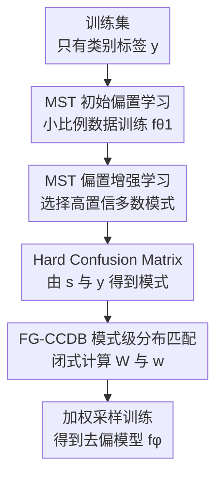

# Fine-Grained Class-Conditional Distribution Balancing for Debiased Learning

**会议**: ICLR 2026  
**OpenReview**: [https://openreview.net/forum?id=NEFldJX4zb](https://openreview.net/forum?id=NEFldJX4zb)  
**代码**: https://github.com/MiaoyunZhao/FG_CCDB  
**领域**: AI安全 / 鲁棒学习 / 去偏学习  
**关键词**: 伪相关, 去偏学习, worst-group robustness, 类条件分布平衡, 样本重加权  

## 一句话总结
本文把无偏置标注的 group-robust learning 拆成“先用模型过拟合找偏置模式、再按混淆矩阵做细粒度类条件分布匹配”，提出 MST 与 FG-CCDB，在真实二分类、多 shortcut 和极端多分类场景中接近甚至超过依赖人工 group 标注的方法。

## 研究背景与动机
**领域现状**：在存在 spurious correlation 的分类任务里，普通 ERM 很容易学习训练集中最省力的捷径特征，而不是任务真正需要的核心特征。典型例子是交通标志分类中“红色”与 stop sign 高度绑定，模型就可能把颜色当成类别依据；在 Waterbirds、CelebA、CivilComments、UrbanCars 这类数据上，类似的背景、属性或文本身份词会形成多数 group，导致整体准确率看起来不错，但最差 group 准确率很低。

**现有痛点**：最直接的稳健做法是拿到 class 和 bias attribute 的组合标注，然后用 GroupDRO、DFR 等方法做 group-balanced 训练或最后一层重训练。问题是，真实数据里的偏置属性往往既贵又难标，而且还可能不是人事先能命名的单一属性。无标注方法通常会利用 ERM 对偏置的过拟合，把误分类样本或低置信样本当成 bias-conflicting 样本来加权，但这些方法容易依赖经验超参，二元划分也不足以描述多类别、多 shortcut 下更复杂的偏置结构。

**核心矛盾**：作者认为真正的矛盾不只是“少数 group 样本太少”，而是目标类别 $y$ 和偏置信息 $z$ 之间存在过强依赖。已有 CCDB 从这个角度出发，把问题写成最小化 $I(z,y)-H(y)$，通过样本重加权让每个类别条件下的偏置分布靠近总体偏置分布。不过 CCDB 用单个 Gaussian 近似每个分布，这在真实数据中太粗：同一类别内部可能由多个偏置模式组成，单峰近似会把模式差异抹掉，留下未消除的伪相关。

**本文目标**：这篇论文要同时解决两个子问题。第一，在没有人工 bias label 的情况下，如何更可靠地估计“样本属于哪种偏置模式”；第二，在估计出这些模式后，如何比 CCDB 更细粒度地做 distribution balancing，并且不要引入大量特征存储或迭代优化开销。

**切入角度**：作者利用 ERM 的“free lunch”：在偏置数据上，过拟合模型的预测往往更接近偏置信号而非核心语义。与其只看是否误分类，本文把 biased model 的预测类别 $s$ 与真实类别 $y$ 组合成 hard confusion matrix。矩阵中的对角项对应 bias-aligning 多数模式，非对角项对应 bias-conflicting 少数模式；当只有一个 shortcut 时，它退化为传统 group 划分，当存在多 shortcut 或缠绕偏置时，它提供更细的离散模式描述。

**核心 idea**：用多阶段选择性重训练 MST 把 ERM 的过拟合放大成偏置预测器，再用 hard confusion matrix 对 CCDB 做 mode-wise 的闭式样本重加权，从而在无人工偏置标注下实现细粒度类条件分布平衡。

## 方法详解
### 整体框架
整套方法先训练一个刻意偏向 shortcut 的辅助模型，用它给每个训练样本预测偏置标签 $s$；再把 $s$ 和真实类别 $y$ 组成 $C \times C$ 的 hard confusion matrix，把每个单元格看成一个偏置模式；最后根据矩阵估计类条件偏置分布和边缘偏置分布，直接求出每个模式的样本权重，用 WeightedRandomSampler 训练最终的 debiased model。MST 负责“看清偏置结构”，FG-CCDB 负责“把每个类别看到的偏置分布拉齐”。

### 关键设计
**1. MST 初始偏置学习：故意让辅助模型更像偏置探测器**

无标注去偏的第一步不是马上训练稳健模型，而是先得到一个偏置预测器。作者从训练集 $D=\{(x_i,y_i)\}_{i=1}^N$ 中随机抽取比例为 $\gamma$ 的子集 $D_1$，只在这个小子集上用普通 ERM 训练 biased model $f_{\theta_1}$。由于训练数据本来含有强伪相关，小数据训练会更容易过拟合多数模式，模型在 bias-aligning 样本上置信度高，在 bias-conflicting 样本上表现差。

这个设计和很多“训练一个弱模型找失败样本”的方法相似，但目标更明确：不是追求辅助模型泛化，而是让它尽量暴露数据里最强的捷径信号。论文实验发现 $\gamma=0.1$ 是较好的 sweet spot；当 $\gamma$ 增大到 0.5，辅助模型不再那么偏，mode prediction 的准确率和最小模式召回会明显下降。换句话说，MST 的第一阶段是在主动制造一个“偏置放大镜”。

**2. MST 偏置增强学习：用高置信样本过滤少数模式**

初始随机子集里仍然会混入 bias-conflicting 样本，它们会削弱辅助模型对偏置的依赖。为此，MST 用 $f_{\theta_1}$ 对全训练集打分，在每个类别内部选出预测置信度最高的 $\beta$ 比例样本，组成更偏的子集 $D'_1$。直觉是：如果 $f_{\theta_1}$ 已经偏向多数模式，那么它最有信心的样本大概率就是 bias-aligning 样本；把这些样本拿来重新训练 $f_{\theta_2}$，模型会进一步对多数模式过拟合，从而在预测上更接近“偏置标签”而非真实核心特征。

最终 biased model 对每个样本给出预测类别 $s$。这里的 $s$ 不一定等于人类可解释的背景、颜色或身份属性，而是“会让其他类别样本被误判成类别 $s$ 的一组捷径信号”。于是 $(s,y)$ 共同定义模式 $M=S\times Y$，也就是 hard confusion matrix 的一个单元格：对角线是偏置与类别一致的多数模式，非对角线是偏置和类别冲突的少数模式。偏置增强阶段还能重复多次；论文显示一次重复已经带来主要收益，更多重复主要继续提高少数模式召回，但边际收益逐渐变小。

**3. Hard confusion matrix：把隐含偏置从单峰分布改写成离散多模态结构**

原始 CCDB 的弱点在于用单个 Gaussian 描述 $p(z\mid y)$ 和 $p(z)$，好像每个类别内部只有一个偏置中心。FG-CCDB 不直接存储全体样本特征，而是用 MST 得到的混淆矩阵 $M\in\mathbb{R}^{C\times C}$ 来近似偏置-类别联合分布。矩阵元素 $M_{i,j}$ 表示偏置预测为 $s=i$、真实类别为 $y=j$ 的样本数，对应联合概率矩阵 $J$：

$$
J_{i,j}=\frac{M_{i,j}}{N}.
$$

在这个离散视角下，第 $j$ 类的类条件偏置分布由 $J$ 的第 $j$ 列归一化得到，边缘偏置分布由所有列求和得到：

$$
p(z\mid y=j)\approx P_{:,j}=\frac{J_{:,j}}{\sum_i J_{i,j}},\quad p(z)\approx q=\sum_j J_{:,j}.
$$

这一步把“偏置分布”从连续特征空间里的粗糙单峰估计，变成由混淆矩阵单元格组成的离散多模态估计。它牺牲了一些连续细节，但换来两个好处：一是每个类别内部的不同偏置模式被显式分开；二是不需要保存全数据的特征表示，也不需要为每个样本单独优化权重。

**4. FG-CCDB 模式级重加权：闭式对齐类条件分布而不是简单 group balancing**

FG-CCDB 沿用 CCDB 的目标，即通过减小 $I(z,y)-H(y)$ 让偏置信息和类别标签尽量独立，同时避免类别不平衡。不同之处是，它在 mode level 上直接求权重矩阵 $W\in\mathbb{R}^{C\times C}$。对模式 $(s,y)=(i,j)$，如果当前第 $j$ 类下偏置模式 $i$ 的比例是 $P_{i,j}$，总体边缘中该偏置模式比例是 $q_i$，那么自然的对齐权重为：

$$
W_{i,j}=\frac{q_i}{P_{i,j}}.
$$

这样每一列都有 $W_{:,j}\odot P_{:,j}=q$，即所有类别条件偏置分布都被拉到同一个边缘偏置分布。再假设同一模式内样本贡献均匀，单个样本权重写成：

$$
w_{i,j}=\frac{W_{i,j}}{M_{i,j}}.
$$

这个权重不是传统意义上把所有 group 数量简单拉平。Group balancing 追求每个单元格尽量相等，而 FG-CCDB 只要求不同类别看到的偏置分布一致，允许同一列内部保留一定结构。作者强调这相当于从因果推断角度做 covariate balance：找到一组 reweighting，让混杂的偏置变量与处理变量式的核心类别信息独立。由于权重是闭式计算、模式内共享，最终训练只需把这些权重交给 PyTorch 的 `WeightedRandomSampler`，计算和存储开销都很小。

### 一个完整示例
以一个三分类的彩色目标识别任务为例，真实类别 $y$ 是“车、鸟、狗”，训练集里颜色或背景形成 shortcut。普通 ERM 可能学到“红色背景多半是车、蓝天多半是鸟、草地多半是狗”。MST 第一阶段用 10% 数据训练 $f_{\theta_1}$，它会在多数模式上非常自信；第二阶段在每个类别内保留 top 50% 高置信样本，例如“红色背景的车”“蓝天里的鸟”“草地上的狗”，再训练 $f_{\theta_2}$。

之后，用 $f_{\theta_2}$ 给所有样本预测偏置类别 $s$。如果一张“蓝天背景里的车”被 biased model 预测成鸟，而真实类别是车，它就落在 $(s=鸟,y=车)$ 的非对角模式，代表一个 bias-conflicting 单元格。把所有样本放进 $3\times3$ 矩阵后，FG-CCDB 会发现“车”这一列里蓝天模式过少，而总体边缘里蓝天模式并不少，于是提高这类样本的采样权重；同时对“红色背景的车”这种巨大多数模式降低权重。最终 debiased model 在训练时更频繁看到偏置和类别冲突的组合，被迫依赖目标形状、纹理或语义核心，而不是继续记住背景捷径。

### 损失函数 / 训练策略
FG-CCDB 的权重优化目标来自 CCDB：

$$
L_\omega=I(z,y)-H(y)=\mathbb{E}_{p_\omega(y)}D_{KL}[p_\omega(z\mid y)\|p(z)]+\mathbb{E}_{p_\omega(y)}\log p_\omega(y).
$$

其中 $z$ 是 biased model 全连接层之前抽取的 latent feature，原始 CCDB 用它近似偏置信息；FG-CCDB 则用 hard confusion matrix 的离散模式替代连续 Gaussian 近似。实际训练分两条线：偏置探索线先按 $\gamma$ 抽样训练 $f_{\theta_1}$，再按 $\beta$ 选择高置信样本训练 $f_{\theta_2}$，默认偏置增强重复三次；去偏训练线用最终模式权重 $w_{i,j}$ 做加权采样，训练目标模型 $f_\phi$。实验中模型选择遵循已有设定，用 validation 上的 worst-class accuracy 选最佳 checkpoint，但方法本身不需要训练集或验证集的人工 bias labels。

## 实验关键数据
### 主实验
论文先在真实二分类 group robustness 数据集上比较 worst-group accuracy，再在多 shortcut 的 UrbanCars 上看罕见 shortcut 组合导致的准确率下降。FG-CCDB 的核心优势不是每个 i.i.d. accuracy 都最高，而是在没有 bias label 的设定下显著提高最差 group 或最困难组合的表现。

| 数据集 | 指标 | FG-CCDB | CCDB | 强监督参考 | 观察 |
|--------|------|---------|------|------------|------|
| Waterbirds | WGA | 90.56±0.24 | 90.48±0.28 | DFR 92.90±0.2 | 与 CCDB 接近，仍显著高于 ERM 72.60 |
| CelebA | WGA | 89.22±0.19 | 85.27±0.28 | GroupDRO 88.90 | 无标注下超过强监督 GroupDRO |
| CivilComments | WGA | 78.52±0.42 | 75.00±0.26 | GroupDRO 73.7 | 对文本毒性数据的最差 group 提升明显 |
| UrbanCars | BG+CoObj gap | -4.9 | 未报告 | GroupDRO -16.4 | 多 shortcut 组合下掉点远小于多数方法 |

在 UrbanCars 中，ERM 的 BG+CoObj gap 为 -69.2，说明背景和共现物体同时罕见时几乎崩掉；FG-CCDB 将该值压到 -4.9，同时保持 92.98 的 I.D. accuracy。DDB 的 gap 更小，但 I.D. accuracy 只有 86.39，因此作者认为 FG-CCDB 在基准精度和 shortcut 鲁棒性之间更平衡。

| 方法 | bias label | cMNIST 0.5% | cMNIST 5% | cCIFAR10 0.5% | cCIFAR10 5% |
|------|------------|-------------|-----------|----------------|--------------|
| ERM | 无 | 35.19±3.49 | 82.17±0.74 | 23.08±1.25 | 39.42±0.64 |
| GroupDRO | 训练+验证有 | 63.12 | 84.20 | 33.44 | 57.32 |
| uLA | 无 | 75.13±0.78 | 92.79±0.85 | 34.39±1.14 | 74.49±0.58 |
| GERNE | 无 | 77.25±0.17 | 90.98±0.13 | 39.90±0.48 | 56.53±0.32 |
| CCDB | 无 | 83.20±2.17 | 96.37±0.25 | 55.07±0.85 | 74.64±0.34 |
| FG-CCDB | 无 | 89.02±0.45 | 98.21±0.02 | 55.28±0.54 | 78.06±0.30 |

极端多分类实验最能体现 fine-grained 的价值。cMNIST 和 cCIFAR10 把 bias-conflicting 比例压到 0.5% 到 5%，此时少数模式极少、类别数更多，传统二元 bias-conflicting 检测很难覆盖所有模式。FG-CCDB 在 cMNIST 上相对 CCDB 继续大幅提升，在 cCIFAR10 的 2% 和 5% 条件下也有明显优势，说明混淆矩阵级别的多模态匹配比单 Gaussian 更适合复杂偏置结构。

### 消融实验
| 配置 | Waterbirds WGA | CelebA WGA | cMNIST | cCIFAR10 | 说明 |
|------|----------------|------------|--------|----------|------|
| GroupDRO | 91.40 | 88.90 | 84.20 | 57.32 | 使用真实 bias annotations 的强监督方法 |
| GroupDRO-MST | 88.47±0.35 | 85.21±0.02 | 84.07±0.22 | 55.73±0.54 | 用 MST 预测替换人工 group label，性能仍接近监督版 |
| DFR | 92.90±0.2 | 88.30±1.1 | - | - | 使用真实 bias annotations 做最后层重训练 |
| DFR-MST | 91.49±0.72 | 85.87±0.29 | - | - | MST 作为近似 bias annotation 也能支撑 DFR |
| FG-CCDB | 90.56±0.24 | 89.22±0.19 | 98.21±0.02 | 78.06±0.30 | 完整无标注方案 |
| FG-CCDB-sup | 91.76±0.13 | 89.09±0.12 | 98.26±0.21 | 78.53±0.37 | 用真实 bias label 替换 MST，和完整方法差距很小 |

这个消融把两件事拆得比较清楚。MST 生成的 pseudo mode label 虽然不完美，但足以替代人工标注喂给 GroupDRO 或 DFR；FG-CCDB 即使拿真实 bias label，提升也有限，说明瓶颈并不主要在 MST，而在于 mode-wise reweighting 本身已经把关键偏置结构利用起来。

### 关键发现
- MST 的偏置增强重复主要改善少数模式召回。论文在 mode prediction 分析中显示，重复次数增加时，普通 mode accuracy 变化有限，但 minority modes 的 recall 提升更明显；最终分类 WGA 在第一次重复后就大幅上升，之后趋于平台。
- $\gamma$ 不能太大。初始偏置学习中，$\gamma\le 0.2$ 时 mode prediction accuracy 和 smallest-mode recall 都较高，$\gamma=0.1$ 同时节省计算并保持强偏置信号；$\gamma=0.5$ 会让辅助模型不够“偏”，反而不利于找 shortcut。
- $\beta=50\%$ 是稳妥默认值。表 5 中 cCIFAR10(5%) 在 $\beta=50\%$ 的 smallest-mode F1 为 0.72，Waterbirds 为 0.64，CelebA 为 0.47；在 bias-align ratio 很高的数据上，$\beta=70\%$ 也可能更好，但无标注场景下 50% 更像不依赖先验的折中。
- FG-CCDB 的 feature correlation 分析支持机制解释：加权前 biased model 的特征维度更强相关于 bias；应用 FG-CCDB 权重后，bias correlation 明显下降，class correlation 上升；最终去偏训练进一步放大这种转移。

## 亮点与洞察
- 把 biased model 的预测类别解释为“偏置标签”很巧。它不要求 bias 一定是颜色、背景、性别这类人能命名的属性，而是允许 $s$ 表示会诱导模型预测到某个类别的复合 shortcut，因此能自然覆盖多 shortcut 和缠绕偏置。
- hard confusion matrix 是一个低成本但很有表达力的中间表示。它比“是否误分类”的二元标签更细，又比保存全量 latent features 做 Gaussian matching 更便宜；对于多类别任务，$C\times C$ 模式天然给了每个类别和每种偏置预测的交叉结构。
- FG-CCDB 与 group balancing 的区别值得迁移。很多鲁棒学习方法默认目标是把所有 group 拉平，但本文只要求 $p(z\mid y)$ 对齐到 $p(z)$，保留一定模式结构；这种“让混杂变量与目标变量独立，而不是机械均匀化所有单元格”的思路也可用于 domain shift、长尾分类或隐变量公平学习。
- 闭式权重降低了方法门槛。原始 CCDB 需要对样本级权重做优化并处理全数据特征，FG-CCDB 用矩阵元素直接算 $W_{i,j}$ 和 $w_{i,j}$，实现上只需给样本分配 mode id 与 sampler weight，更容易接入现有训练管线。

## 局限与展望
- 方法强依赖“过拟合模型确实会捕捉偏置”的前提。作者在结论中承认，当过拟合信号不能稳定对应 bias cues 时，MST 会变弱；例如 CelebA 只有一个少数 group，CivilComments 的多数/少数模式分布跨类别不对称，这些场景都会削弱偏置预测。
- hard confusion matrix 假设 $|S|=|Y|$，也就是 biased model 的预测类别空间与目标类别相同。这对很多 classification benchmark 很自然，但如果偏置属性数量与类别数完全无关，或者一个类别内部有多个互不相同的 shortcut 被映射到同一 $s$，矩阵表示仍可能合并过粗。
- 权重可能非常激进。论文提到 FG-CCDB 中最大和最小 mode weight 的比例可达 1000，而普通 group balancing 示例中约为 100；这有利于极端少数模式，但也可能放大噪声标签、异常样本或错误 pseudo mode label。
- 实验覆盖了视觉和文本分类，但主要仍是分类式 group robustness benchmark。未来可以探索检测、分割、多标签分类、医学诊断或自动驾驶预测任务中，MST 的偏置预测是否仍能形成有意义的模式矩阵。
- 超参虽然少，但仍有默认选择问题。$\gamma=0.1$、$\beta=50\%$ 在实验中可靠，不过不同数据偏置强度、类别数和样本规模下，是否需要自适应选择仍值得研究。

## 相关工作与启发
- **vs CCDB**: CCDB 同样从 mutual information 和 class-conditional distribution balancing 出发，但用单 Gaussian 近似分布，并在样本级别优化权重。FG-CCDB 继承目标函数，把分布描述换成 MST hard confusion matrix 的离散多模态形式，因此在多类别和极端偏置下更强，也更省存储。
- **vs GroupDRO / DFR**: GroupDRO 和 DFR 依赖人工 group annotations，能作为强监督上界。本文的 MST 可替代这些标注喂给 GroupDRO-MST、DFR-MST，性能接近监督版；完整 FG-CCDB 则进一步证明，不只是 label 替代，mode-wise 分布匹配本身也比朴素 group balancing 更合适。
- **vs JTT / LfF / SELF**: 这些无标注方法也利用 ERM 失败或低置信样本来发现 bias-conflicting 样本，但通常更偏向二元划分，并依赖经验性 upweighting。MST 不是只标记“困难样本”，而是用预测类别构造 $C\times C$ 模式矩阵，能表达少数模式属于哪种偏置方向。
- **vs XRM / DebiAN / DDB**: 这些方法也试图发现未知偏置或放大偏置信号。FG-CCDB 的差异在于将偏置发现结果直接转化为分布匹配权重，而不是只把它当作 auxiliary supervision；这让“偏置探索”和“去偏训练”的目标更一致。
- **启发**: 对很多无标注鲁棒学习问题，可以先承认模型会学坏，并把“学坏的方式”转成可用结构。MST 的价值就在于把 ERM 的失败行为变成偏置空间坐标，再让后续 reweighting 有一个明确的统计目标。

## 评分
- 新颖性: ⭐⭐⭐⭐☆ 将 CCDB 的单峰分布匹配升级为基于 hard confusion matrix 的细粒度模式匹配，思路清晰且与已有过拟合偏置观察结合得自然。
- 实验充分度: ⭐⭐⭐⭐⭐ 覆盖真实二分类、多 shortcut、极端多分类、偏置预测质量、模块消融和超参分析，证据链比较完整。
- 写作质量: ⭐⭐⭐⭐☆ 方法动机和公式主线明确，MST 与 FG-CCDB 的关系清楚；个别 related work 与实验段落略密，读者需要来回对照表格和图。
- 价值: ⭐⭐⭐⭐⭐ 对无偏置标注的 worst-group robustness 很实用，尤其适合多类别、多 shortcut 场景，也为“用模型过拟合反向发现偏置”提供了可复用框架。

<!-- RELATED:START -->

## 相关论文

- [\[ICLR 2026\] RESFL: An Uncertainty-Aware Framework for Responsible Federated Learning by Balancing Privacy, Fairness and Utility](resfl_an_uncertainty-aware_framework_for_responsible_federated_learning_by_balan.md)
- [\[ICML 2026\] VPD-100K: Towards Generalizable and Fine-grained Visual Privacy Protection](../../ICML2026/ai_safety/vpd-100k_towards_generalizable_and_fine-grained_visual_privacy_protection.md)
- [\[ECCV 2024\] SkyMask: Attack-Agnostic Robust Federated Learning with Fine-Grained Learnable Masks](../../ECCV2024/ai_safety/skymask_attack-agnostic_robust_federated_learning_with_fine-grained_learnable_ma.md)
- [\[CVPR 2026\] RankOOD: Class Ranking-based Out-of-Distribution Detection](../../CVPR2026/ai_safety/rankood_-_class_ranking-based_out-of-distribution_detection.md)
- [\[AAAI 2026\] Fine-Grained DINO Tuning with Dual Supervision for Face Forgery Detection](../../AAAI2026/ai_safety/fine-grained_dino_tuning_with_dual_supervision_for_face_forgery_detection.md)

<!-- RELATED:END -->
