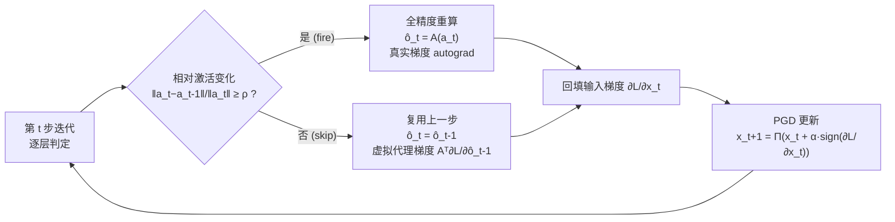

# Fine-Grained Iterative Adversarial Attacks with Limited Computation Budget

**会议**: ICLR 2026  
**OpenReview**: [https://openreview.net/forum?id=GW9sp1g9qh](https://openreview.net/forum?id=GW9sp1g9qh)  
**代码**: 待确认（论文承诺录用后开源）  
**领域**: AI 安全 / 对抗鲁棒性  
**关键词**: 对抗攻击, PGD, 计算预算, 脉冲机制, 激活复用, 代理梯度, 对抗训练  

## 一句话总结
本文把"在固定计算预算下最大化迭代对抗攻击强度"建模成一个逐层-逐步的组合优化问题，提出事件驱动的 **Spiking-PGD**：当某层相邻迭代的激活相对变化小于阈值时就复用上一步输出、跳过重算，并用虚拟代理梯度补回被脉冲门阻断的反传信号，从而在同等算力下显著强于现有攻击，且嵌入对抗训练只需约 30% 预算即可达到相当鲁棒性。

## 研究背景与动机
**领域现状**：以 PGD、I-FGSM、MI-FGSM 为代表的迭代式对抗攻击是评估模型鲁棒性的"金标准 oracle"，也是对抗训练生成困难样本的核心引擎。但它们天生昂贵——每一步都要一次完整的前向+反向传播。鲁棒性评测常用 PGD-20/50/100，开销是普通推理的 40–200 倍；对抗训练用的 PGD-10 也比普通训练贵约 10 倍。

**现有痛点**：模型与数据集越来越大，这种开销直接卡住了攻击与防御在大规模模型上的可扩展性，对工业大厂之外的研究者尤其不友好。先前提速思路（动量更新、输入多样化变换、平移不变梯度、黑盒查询高效化、稀疏扰动）虽各有侧重，但都默认"每层都做全精度计算，只能靠减少迭代步数 T 这一个粗粒度旋钮来省算力"，一旦把 T 调小，攻击强度就大幅崩塌。

**核心矛盾**：从组合优化视角看，把算力分配死死限制成"对所有层统一执行固定 T 次迭代"几乎不可能是最优的。作者在 ResNet-18/CIFAR-10 上的预研究发现两个关键现象——(1) 迭代几步后，相邻步之间的激活相对变化 $\|a_t-a_{t-1}\|/\|a_t\|$ 迅速衰减、变得高度相似（鲁棒模型衰减得更快），说明重复计算存在大量冗余；(2) 不同层的衰减速率并不相同。这意味着算力既应在**迭代维度**也应在**层维度**做更细粒度的分配。

**本文目标**：在给定计算预算 $C_{total}$ 下，最大化最终对抗样本的攻击损失。

**核心 idea**：**[细粒度算力控制]** 把"算哪些层、在哪些迭代算"交给一个二值掩码 $\Delta\in\{0,1\}^{T\times L}$ 决定，并用一个事件驱动的脉冲机制按激活变化幅度自适应触发重算，再用虚拟代理梯度修复复用带来的梯度断流。

## 方法详解

### 整体框架
方法分三块：先把迭代攻击重写成一个**逐层-逐步的组合优化问题**（暴露现有"早停"方案只是其退化子集），再用**脉冲前向计算**以单个阈值 $\rho$ 高效近似这个组合优化的解，最后用**虚拟反向计算**补回被脉冲门切断的梯度，三者合起来即 Spiking-PGD。

### 关键设计

**1. 迭代攻击即组合优化：把"早停"暴露为退化子集。** 总开销可按层分解为 $\sum_{t=1}^{T}\sum_{l=1}^{L} C_{t,l}\,\delta_{t,l}$，于是预算约束下的攻击就是求最优掩码 $\Delta$：$\max_{\Delta}\,\mathcal{L}(x_{T+1}(\Delta),y)\ \text{s.t.}\ \sum_{t,l} C_{t,l}\delta_{t,l}\le C_{total}$。常见的"把迭代数从 $T$ 减到 $S$"的早停策略，等价于强行规定 $t\le S$ 全算、$t>S$ 全跳的块状掩码——作者用 Proposition 4.1 证明它只是上式可行域里的一个子集，故其最优值 $V_{coarse}\le V_{fine}$。换句话说，细粒度逐层掩码在同等预算下理论上只会更强。代价是搜索空间膨胀到 $O(2^{T\times L})$、每次评估目标都要跑一遍完整的掩码前向反向、且复用会破坏计算图，三重困难让暴力搜索、贪心、动态规划、连续松弛、各类元启发式都不实用，必须另寻高效近似。

**2. 脉冲前向计算：用单阈值 $\rho$ 把"迭代驱动"变成"事件驱动"。** 利用线性层 $A^{(l)}$ 的线性性，可把输出改写成"上一步输出 + 激活残差的映射"：$o_t^{(l)}=A^{(l)}(a_t^{(l)}-a_{t-1}^{(l)})+o_{t-1}^{(l)}$。残差小的时候这一项几乎可忽略，于是引入脉冲门 $S_\rho(a_t,a_{t-1})$：当相对变化 $\|a_t-a_{t-1}\|/\|a_t\|\ge\rho$ 时门"放电"、正常算 $\hat o_t^{(l)}=A^{(l)}(a_t^{(l)})$；否则门关闭、残差被乘 0，更新退化为 $\hat o_t^{(l)}=A^{(l)}(0)+o_{t-1}^{(l)}=o_{t-1}^{(l)}$，直接复用上一步输出、整层跳过。这样前向变成由激活变化幅度触发的事件驱动过程，单一阈值 $\rho\in[0,1]$ 就能连续滑动效率-效果权衡，灵活适配任意预算，无需重训也无需搜索掩码。

**3. 虚拟代理梯度：修复复用导致的梯度消失。** 复用层在 PyTorch autograd 里会沿脉冲门按链式法则反传，而门的导数 $S'_\rho$ 在关闭分支恒为 0，于是 $\partial\mathcal{L}/\partial a_t^{(l)}=0$——输入扰动收不到这一层的有用梯度，攻击失效。作者的关键观察是：虽然前向复用了 $\hat o_{t-1}^{(l)}$，但反向时仍可以"假装"这条路径存在，手动把上游梯度乘回 $A^{(l)\top}$。具体两步实现：先把缓存输出 $\hat o_{t-1}^{(l)}$ 标记 `requires_grad_()` 以在反传时捕获并存下 $\partial\mathcal{L}/\partial\hat o_{t-1}^{(l)}$；当该层被复用时，通过 `register_hook` 把代理梯度 $A^{(l)\top}(\partial\mathcal{L}/\partial\hat o_{t-1}^{(l)})$ 注入计算图（卷积层用 `torch.nn.grad.conv2d_input`、全连接层用矩阵乘等底层原语高效实现）。最终反向规则是分段的：层被全算则用 autograd 真实梯度，层被复用则替换为虚拟代理梯度，既恢复了对输入的有效梯度流，又保住了前向跳算节省的算力。

## 实验关键数据

### 主实验（攻击强度 vs 计算成本）
视觉任务参考迭代数 $T_0=20$、图任务 $T_0=200$；基线按 $T/T_0\times100\%$ 衡量相对成本，Spiking-PGD 按实际执行的全精度操作占比衡量。

| 任务 / 数据集 | 基线 | 关键结论 |
|---|---|---|
| 视觉：CIFAR-10 / CIFAR-100 / Tiny-ImageNet | I-FGSM, MI-FGSM, PGD, AutoAttack | 任意给定算力下 Spiking-PGD 攻击强度（受攻击后准确率更低）均优于基线，**低预算区间差距最显著** |
| 图：Cora / Citeseer | PGD topology attack | PGD 在低算力下强度骤降，Spiking-PGD 在大多数预算尤其中低预算下明显更强 |

基线侧观察：MI-FGSM 因动量稳定优化整体强于 I-FGSM/PGD，但一旦减少迭代降本就大幅掉强度；AutoAttack 绝对强度高但开销巨大，等算力对比下反而不如其他攻击——印证"单靠减迭代无法保效果"。

### 对抗训练（CIFAR-10）
将 Spiking-PGD 嵌入对抗训练，比较常数阈值与指数衰减阈值 $\rho(t)=\rho_0\cdot\frac{e^{-\lambda t/N}-e^{-\lambda}}{1-e^{-\lambda}}$（$\rho_0=0.1$, $N=200$）：

| 设置 | 现象 |
|---|---|
| epoch 25–50 | 低阈值导致频繁复用，鲁棒准确率短暂骤降；随 $\rho$ 衰减、全计算增多后恢复并对齐 PGD-AT |
| $\lambda=1.0$（小） | 省算力时间更长但鲁棒性恢复更慢 |
| $\lambda=3.0$（大） | 加速精化，曲线更平滑、更接近 PGD-AT |
| $\lambda=2.0$ | **几乎匹配 PGD-AT 的最佳干净/鲁棒准确率，却只用不到 30% 算力** |

### 消融实验

| 消融对象 | 结论 |
|---|---|
| 阈值 $\rho$ | $\rho$ 增大则跳算更多、成本大幅下降，而攻击强度仅温和下降——效率换效果的良性权衡 |
| 虚拟代理梯度 | 加上后攻击强度显著提升，尤其在低算力区间，证明它提供了忠实的反传信号 |
| 攻击半径 $\epsilon$ | $\epsilon\in\{2,4,8\}/255$，半径越小、降本时强度衰减越缓（小半径下激活变化更弱，可跳算空间更大） |

### 关键发现
- Spiking-PGD 把效率-效果 Pareto 前沿整体外推：同等成本更强、同等强度更省。
- 优势在**低预算区间最突出**，正对应"算力受限研究者"的核心诉求。
- 方法同时在视觉（像素扰动）与图（结构攻击）两类任务上成立，泛化性好。

## 亮点与洞察
- **视角新**：把攻击提速从"减步数 / 减查询 / 限扰动"扩展到一个正交方向——细粒度激活计算控制，并用 Proposition 4.1 干净地证明早停只是其退化子集，理论站得住。
- **借脉冲神经网络之刀**：把 SNN 的事件驱动思想迁到对抗攻击的迭代维度，"激活变化触发重算"这一类比既自然又给出可调旋钮 $\rho$。
- **直面工程死角**：复用必然引发梯度消失，作者没回避，而是用 `register_hook` + 底层梯度原语把虚拟代理梯度真正落地，消融证明它是低预算下不掉强度的关键。
- **一石二鸟**：同一机制既加速攻击评测，又加速对抗训练（30% 预算达标），实用价值直接。

## 局限与展望
- **依赖线性层假设**：脉冲前向的残差分解显式依赖 $A^{(l)}$ 的线性性，对含强非线性/归一化耦合的模块，复用近似误差与代理梯度忠实度仍需更细评估。
- **代理梯度是近似**：虚拟梯度用 $A^{(l)\top}(\partial\mathcal{L}/\partial\hat o_{t-1})$ 近似真实路径，复用步过多时累积偏差对最终攻击方向的影响缺乏理论界。
- **阈值/调度需调**：$\rho$ 与衰减 $\lambda$ 对结果敏感（对抗训练早期鲁棒性骤降即一例），自动化预算到阈值的映射尚未给出。
- **黑盒仅为展望**：作者指出方法可延伸到依赖迭代梯度估计的黑盒攻击（查询时间相关、同样可复用），但论文未做黑盒实验验证。
- 模型与数据集规模有限（ResNet-18 / GCN，CIFAR/Tiny-ImageNet/Cora/Citeseer），大模型与 Transformer 上的收益有待补充。

## 相关工作与启发
- **迭代攻击谱系**：FGSM → I-FGSM → PGD（加随机起点）→ MI-FGSM（动量）/ DI-FGSM（输入多样化）/ TI-FGSM（平移不变）/ NI-FGSM（Nesterov），本文与这些"增强强度/迁移性"的方向正交，可叠加。
- **黑盒高效攻击**：Bandit 先验、Boundary Attack、HopSkipJumpAttack、Square Attack 从"减查询"角度提速，One-Pixel/SparseFool 从"限扰动"角度，本文则从"激活计算冗余"角度，三者互补。
- **启发**：迭代优化过程中"中间状态高度时序相关"这一现象普遍存在（扩散采样、自回归解码、迭代求解器），"按变化幅度事件驱动地跳算 + 代理梯度补反传"这套范式有望迁移到这些场景做加速。

## 评分
- **新颖性**: ⭐⭐⭐⭐ — 把攻击提速重构为逐层组合优化、并用脉冲事件驱动机制求近似解，是一个站得住的正交新视角；扣分在脉冲+代理梯度的组件思想各有渊源（SNN、直通估计），属巧妙组合而非全新原理。
- **实验充分度**: ⭐⭐⭐⭐ — 覆盖视觉+图两类任务、多基线、攻击与对抗训练双场景、三组消融，论证扎实；但模型/数据规模偏小、黑盒延伸只停留在 claim。
- **写作质量**: ⭐⭐⭐⭐ — 动机—预研究—组合优化—脉冲前向—虚拟反传逻辑链清晰，图 2/3/4 把三种执行模式与梯度机制讲得直观。
- **价值**: ⭐⭐⭐⭐ — 直击"算力受限下做鲁棒性研究"的真实痛点，外推 Pareto 前沿且对抗训练省 70% 算力，落地性强。
