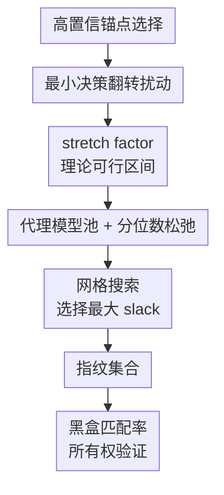

# Fingerprinting Deep Neural Networks for Ownership Protection: An Analytical Approach

**会议**: ICLR2026  
**OpenReview**: [https://openreview.net/forum?id=sg3UNWKVFt](https://openreview.net/forum?id=sg3UNWKVFt)  
**论文**: OpenReview  
**代码**: 未公开  
**领域**: AI安全 / 模型知识产权保护 / 模型指纹  
**关键词**: 模型指纹, 所有权验证, 对抗样本, 决策边界, 模型修改攻击  

## 一句话总结
AnaFP 把深度网络所有权保护中的“指纹应该离决策边界多远”从经验调参问题改写成 stretch factor 的可行区间求解问题，用鲁棒性下界和唯一性上界共同约束对抗样本指纹，在 CNN、MLP 和 GNN 上都比现有指纹方法更稳定地区分盗版模型与独立训练模型。

## 研究背景与动机
**领域现状**：深度网络被部署成在线服务后，攻击者可以窃取模型、再通过微调、剪枝、知识蒸馏或对抗训练等方式改变模型外观，最后以黑盒 API 形式重新分发。模型所有者通常用水印或指纹来证明归属：水印需要向模型中嵌入额外行为，可能改变模型或引入新的安全风险；指纹则更像一组外部查询样本，利用模型本身的决策特征来做所有权验证，因此更适合不想改动原模型的场景。

**现有痛点**：对抗样本式指纹是一条很自然的路线。它从干净样本出发，找到能让受保护模型跨过决策边界的最小扰动，再把这个扰动样本作为指纹查询可疑模型。问题在于，指纹如果太贴近受保护模型的边界，微调或剪枝后边界轻微移动就可能让指纹失效；但如果指纹被推得太远，它又可能也穿过独立训练模型的边界，导致误把无关模型判成盗版。

**核心矛盾**：鲁棒性和唯一性对指纹位置提出了相反要求。鲁棒性希望指纹远离受保护模型的原始边界，这样被盗模型经过性能保持型修改后仍会输出目标标签；唯一性希望指纹不要远到影响独立训练模型，否则独立模型也可能输出同一目标标签。过去方法常靠经验 margin、生成器或启发式距离控制这个位置，但没有回答“距离的理论可行范围在哪里”。

**本文目标**：作者要解决的不是“再造一类对抗指纹”，而是给对抗指纹的放置距离一个可计算的约束。具体来说，论文希望为每个锚点样本推导一个 stretch factor $\tau$ 的下界和上界：下界来自对盗版模型修改的鲁棒性，上界来自对独立模型的唯一性；只有落在二者之间的指纹才被保留。

**切入角度**：作者抓住了决策边界附近的局部几何。先用最小扰动找到受保护模型刚刚改变预测的位置，再沿着同一扰动方向继续拉伸。这样一来，指纹到边界的距离不再是模糊的“靠近/远离”，而可以由 $\tau$ 控制，并被 logit margin、局部 Lipschitz 常数和模型修改导致的 logit shift 共同约束。

**核心 idea**：用理论推导出的 stretch factor 可行区间代替经验式边界距离调参，让每个对抗样本指纹同时尽量满足“盗版模型仍命中”和“独立模型不命中”。

## 方法详解
### 整体框架
AnaFP 的流程分成指纹生成和所有权验证两段。生成阶段先从训练数据中挑选高置信锚点，再为每个锚点求一个使受保护模型改变预测的最小扰动，把该点视作边界点；随后根据鲁棒性和唯一性约束估计 $\tau$ 的可行区间，并用网格搜索选择 slack 最大的 stretch factor；最终用拉伸后的扰动生成指纹集合。验证阶段只需要黑盒查询可疑模型，统计它在这些指纹上返回目标标签的比例。

这篇论文的方法很适合用一条从“边界点”到“可验证指纹”的链来理解：

设受保护模型为 $P$，盗版模型集合为 $V_P$，独立训练模型集合为 $I_P$。每个指纹写成 $(x_i^\star, y_i^\star)$，验证时可疑模型 $S$ 如果在足够多指纹上满足 $S(x_i^\star)=y_i^\star$，就被判为盗版模型；否则被视为独立模型。这里的关键不是匹配率阈值本身，而是指纹集合是否能让盗版模型和独立模型的匹配率分布分开。

### 关键设计
**1. 高置信锚点：让独立模型更可能保持原标签**

AnaFP 不从任意训练样本开始造指纹，而是先挑选受保护模型非常确信的样本作为 anchor。对样本 $(x,y)$，作者定义 logit margin $g_P(x)=s_{P,y}(x)-\max_{k\ne y}s_{P,k}(x)$，也就是正确类别 logit 与最强竞争类别 logit 的差。只有满足 $g_P(x_a)\ge m_{anchor}$ 的样本才进入锚点集合。

这个选择直接服务于唯一性。高 margin 样本通常包含更稳定的类别特征，即便换成从头训练的独立模型，也更可能继续把它判为原类别 $y$。后续指纹从这样的 anchor 出发，只要拉伸扰动不超过独立模型能承受的 margin，就能让独立模型仍预测原标签，而不是跟着受保护模型一起输出指纹目标标签。

**2. 最小决策翻转扰动：把经验指纹定位到受保护模型的边界上**

对每个锚点 $(x_a,y)$，论文求解最小 $\ell_2$ 扰动 $\delta^\star$，使得 $P(x_a+\delta^\star)\ne y$。实现上用 C&W-$\ell_2$ attack 来近似求解，得到的 $q=x_a+\delta^\star$ 被称为 boundary point，因为它是沿着最小扰动方向刚刚让受保护模型改变预测的位置。

这一步的作用是给后面的理论距离控制一个明确原点。直接把 $q$ 当指纹会很脆弱，因为模型经过微调、剪枝或蒸馏后，决策边界轻微移动就可能让 $q$ 回到原标签一侧；但 $q$ 又提供了一个局部边界几何坐标，使作者可以沿 $\delta^\star$ 方向继续把样本推远，并用一个标量 $\tau$ 表示推远程度：$x^\star=x_a+\tau\delta^\star$，其中 $\tau>1$。

**3. 鲁棒性下界与唯一性上界：用一个区间夹住指纹距离**

AnaFP 的核心推导是给 $\tau$ 找到上下界。鲁棒性要求盗版模型 $P'\in V_P$ 即使被修改，也仍在指纹上输出目标标签 $y^\star=P(x^\star)$。如果模型修改导致任一类别 logit 的偏移被 $\epsilon_{logit}$ 上界住，而受保护模型在边界点附近的 logit margin 梯度范数为 $c_g=\|\nabla g_P(q)\|_2$，那么一阶近似给出鲁棒性所需的下界：

$$
\tau > \tau_{lower}=1+\frac{2\epsilon_{logit}}{c_g\|\delta^\star\|_2}.
$$

直觉上，模型修改越剧烈，$\epsilon_{logit}$ 越大，指纹就必须从边界继续向目标标签区域里推得更远；边界附近 margin 增长越快，也就是 $c_g\|\delta^\star\|_2$ 越大，需要额外拉伸的幅度就越小。

唯一性则给出相反方向的上界。对任意独立模型 $I\in I_P$，希望它在 $x^\star$ 上仍保留锚点的原标签 $y$，不要输出受保护模型的指纹目标标签。若独立模型在锚点处的 logit margin 下界为 $m_{min}$，并且从 $x_a$ 到 $x^\star$ 的局部 Lipschitz 常数被 $L_{uniq}$ 上界住，则只要

$$
\tau < \tau_{upper}=\frac{m_{min}}{2L_{uniq}\|\delta^\star\|_2},
$$

独立模型的原标签 margin 仍保持为正。于是，指纹生成被压缩为一个清晰判定：只有存在 $\tau_{lower}<\tau<\tau_{upper}$ 的锚点，才可能同时满足鲁棒性和唯一性。

**4. 代理模型池、分位数松弛与网格搜索：把无限集合约束落到可运行算法**

理论上的 $V_P$ 和 $I_P$ 都是无限集合，无法真的遍历所有盗版模型和独立模型。AnaFP 用两个有限代理池近似它们：盗版代理池包含受保护模型及其微调、知识蒸馏等变体；独立代理池包含不同架构和不同随机种子从头训练的模型。然后在代理池上估计 $m_{min}$、$L_{uniq}$ 和 $\epsilon_{logit}$。

如果直接取最坏情况，$m_{min}$ 会被压得过小，$L_{uniq}$ 和 $\epsilon_{logit}$ 会被抬得过大，常常导致没有任何可行指纹。作者因此使用分位数松弛：用 $q_{margin}$ 分位数估计 margin，用 $q_{lip}$ 分位数估计 Lipschitz 常数，用 $q_{eps}$ 分位数估计 logit shift。这样做牺牲了一点最坏情况保证，却换来了足够数量的可用指纹。

最后还有一个实现细节很关键：$\tau_{lower}$ 依赖 $x^\star=x_a+\tau\delta^\star$ 处的 logit shift，因此它本身又依赖 $\tau$。AnaFP 不强行闭式求解，而是在 $(1,\tau_{upper}]$ 上均匀采样候选 $\tau$，保留满足 $\tau\ge\tau_{lower}(\tau)$ 的候选集合 $T_{feas}$。如果集合为空，丢弃该锚点；如果不为空，选择

$$
\tau^\star=\arg\max_{\tau\in T_{feas}}\min\{\tau-\tau_{lower}(\tau),\tau_{upper}-\tau\}.
$$

也就是说，它不贴着任一边界取值，而是选离两侧约束都尽量远的点，从而给代理估计误差留下余量。

### 损失函数 / 训练策略
AnaFP 本身不是重新训练受保护模型的方案，而是一个后处理式指纹生成流程。训练相关的部分主要出现在代理模型池和攻击模拟中：受保护模型按常规分类任务训练，盗版代理通过微调和知识蒸馏构造，独立代理从头训练；指纹生成时用 C&W-$\ell_2$ 优化最小决策翻转扰动，默认优化 3000 步、学习率 0.01，并按任务调整正则常数 $c$。

论文还给出若干实现建议。anchor threshold 在 PROTEINS/GNN 上设为 $m_{anchor}=1.0$，其他任务设为 $8.0$；网格搜索默认采样 $N_{grid}=500$ 个候选 stretch factor；分位数阈值不需要精细调参，实践中从保守端逐步放松，直到得到约 20 到 100 个有效指纹即可。

## 实验关键数据
### 主实验
论文在 CNN/CIFAR-10、CNN/CIFAR-100、MLP/MNIST 和 GNN/PROTEINS 上测试 AnaFP，并与 UAP、IPGuard、MarginFinger、AKH、ADV-TRA、GMFIP 等六类模型指纹方法比较。主指标是 AUC，表示随机抽取一个盗版模型和一个独立模型时，盗版模型具有更高指纹匹配率的概率。

| 模型 / 数据集 | AnaFP AUC | 最强基线 AUC | 主要差距 |
|--------|------|----------|------|
| CNN / CIFAR-10 | $0.957\pm0.002$ | ADV-TRA $0.878\pm0.012$ | AnaFP 明显拉开匹配率分布 |
| CNN / CIFAR-100 | $0.893\pm0.005$ | ADV-TRA $0.850\pm0.024$ | 类别更多时仍保持领先 |
| MLP / MNIST | $0.963\pm0.002$ | UAP $0.906\pm0.004$ | 简单数据集上接近完美区分 |
| GNN / PROTEINS | $0.926\pm0.005$ | AKH $0.854\pm0.021$ | 说明方法不依赖固定欧氏图像结构 |

在模型修改攻击下，AnaFP 的优势更能体现。CNN/CIFAR-10 上，剪枝对几乎所有方法都不难，但微调、知识蒸馏、对抗训练和组合攻击会明显压低多数基线表现。

| 攻击类型 | AnaFP AUC | 最强基线 AUC | 说明 |
|------|---------|------|------|
| Pruning | $1.000\pm0.000$ | 多数方法接近 $1.000$ | 单纯剪枝较容易识别 |
| Fine-tuning | $0.979\pm0.008$ | ADV-TRA $0.923\pm0.010$ | 拉伸距离提升边界移动后的鲁棒性 |
| KD | $0.756\pm0.023$ | UAP $0.679\pm0.013$ | 蒸馏最困难，但 AnaFP 仍领先 |
| AT | $0.983\pm0.015$ | UAP $0.783\pm0.041$ | 对抗训练并未完全破坏指纹 |
| N-finetune | $0.978\pm0.010$ | ADV-TRA $0.895\pm0.032$ | 加噪再微调仍可检测 |
| P-finetune | $0.989\pm0.007$ | UAP $0.876\pm0.022$ | 剪枝后微调下优势明显 |
| Prune-KD | $0.689\pm0.031$ | AKH $0.636\pm0.047$ | 组合蒸馏仍是主要弱点 |

### 消融实验
作者重点分析了代理模型池、分位数阈值和 stretch factor 选择策略。代理池大小超过 6 个模型后 AUC 很快稳定，低多样性代理池也能达到约 $0.912$ AUC，说明方法并不要求极大规模的代理模型集合。

| 设计选择 | 观测结果 | 解释 |
|------|---------|------|
| 代理池大小从 2 增至 10 | 超过 6 后 AUC 快速稳定 | 有限代理池已能提供足够边界估计 |
| 低 / 中 / 高多样性代理池 | 低多样性仍有 $0.912$ AUC，中高多样性收益递减 | 关键是包含有代表性的盗版和独立模型 |
| 分位数 $q_{margin}/q_{lip}=0.1/0.9$ 或 $0.2/0.8$ | 有效指纹数为 0 | 约束过保守导致无可行区间 |
| $0.5/0.5$ | 56 个有效指纹，AUC $0.957$ | 数量和质量达到较好平衡 |
| $0.9/0.1$ | 1158 个有效指纹，AUC 降至 $0.896$ | 过度放松引入低质量指纹 |

stretch factor 的消融最能证明本文理论区间的价值。AnaFP 选择可行集合中到上下界 slack 最大的 $\tau$，优于贴近下界的 A-lower、贴近上界的 A-upper，也优于固定 margin 或只取单侧约束的 C-fix、C-lower、C-upper。这个结果说明，真正有效的不是“把指纹推远”或“让指纹贴边”中的某一个极端，而是在鲁棒性和唯一性两侧都留出余量。

### 关键发现
- AnaFP 的主要收益来自把指纹位置变成每个样本自适应的可行区间，而不是对所有指纹使用同一个经验距离。
- 高置信 anchor 很重要：附录显示低置信 anchor 在 CNN 和 MLP 上都产生 0 个有效指纹，中置信 anchor 只得到 2 到 3 个有效指纹且 AUC 约 $0.75$ 到 $0.79$，高置信 anchor 则得到几十个有效指纹并把 AUC 推到约 $0.96$。
- 知识蒸馏和 Prune-KD 是最难的攻击，因为它们不只是轻微移动边界，还可能让学生模型以不同结构重构教师行为；AnaFP 在这些设置下仍领先，但绝对 AUC 下降明显。
- 方法有实际成本：在 ResNet-18 上生成指纹约 33 分钟、峰值显存 13GB；在 ViT-S/16 上约 1 小时 26 分钟、峰值显存 40GB。最耗时和最耗显存的是最小扰动生成阶段。

## 亮点与洞察
- 这篇论文最清楚的贡献是把一个长期靠经验调的安全工程问题变成了可解释的几何约束。$\tau_{lower}$ 对应“别被模型修改攻击打掉”，$\tau_{upper}$ 对应“别误伤独立模型”，这个解释非常直观。
- 分位数松弛是一个务实设计。纯 worst-case 推导虽然漂亮，但在有限代理模型上经常没有可行解；用分位数把保守理论调成可运行算法，正好符合模型安全里常见的“形式化目标 + 经验近似”路线。
- slack 最大化比取边界点更稳。它承认代理池估计一定有误差，所以不把 $\tau$ 放在刚好满足约束的位置，而是留出双侧缓冲，这一点可以迁移到其他基于代理模型估计安全边界的任务。
- 方法对 GNN 也有效这一点值得注意。很多对抗扰动指纹方法默认输入是图像或向量，而 AnaFP 的理论写在 logit margin 和局部 Lipschitz 常数上，因此更容易迁移到非欧氏输入，只要能定义扰动和边界点。

## 局限与展望
- 适用范围主要是分类模型。AnaFP 依赖类别决策边界和 logit margin，对回归、自监督表示学习、生成模型或没有明确分类头的模型并不能直接使用。
- 理论保证依赖若干近似。边界附近的一阶 Taylor 展开、有限代理池对无限模型集合的近似、分位数松弛都会削弱严格保证，因此实际效果仍要靠代理池质量和测试攻击覆盖度支撑。
- 知识蒸馏仍是短板。KD 和 Prune-KD 下 AUC 虽然领先基线，但远低于微调、剪枝和对抗训练设置，说明当盗版模型换结构并重新学习输出行为时，原决策边界指纹的可迁移性会明显变差。
- 计算成本不低。C&W-$\ell_2$ 生成最小扰动需要大量优化步，ViT-S/16 场景甚至用到 40GB A100 显存；如果要部署到资源有限的模型所有者侧，可能需要用 PGD、DeepFool 或 coarse-to-fine search 降低开销。
- 黑盒验证只比较最终标签。如果可疑服务返回概率、top-k 或嵌入，理论上还可以设计更细粒度的匹配统计；反过来，如果服务加入随机化、防查询检测或输出裁剪，也可能影响匹配率稳定性。

## 相关工作与启发
- **vs IPGuard**: IPGuard 也围绕分类边界构造指纹，但更依赖近边界样本的经验选择。AnaFP 的区别是显式推导了离边界的可行区间，因此能解释为什么某个距离同时服务于鲁棒性和唯一性。
- **vs MarginFinger**: MarginFinger 试图控制指纹到分类边界的距离，但控制逻辑更偏经验和生成式。AnaFP 直接把距离写成 stretch factor，并用上下界排除不可行指纹，稳定性更好。
- **vs UAP / ADV-TRA**: UAP 使用通用对抗扰动，ADV-TRA 用跨越多条边界的对抗轨迹，二者都强调更强的对抗查询形态。AnaFP 的启发在于，查询形态不一定越复杂越好，关键是要知道它在边界几何中的位置。
- **vs 水印方法**: 水印通常需要在训练或微调阶段嵌入额外行为，可能影响模型或引入安全风险。AnaFP 是非侵入式后处理方案，适合已经训练好、不能重新嵌入水印的模型。
- **对后续工作的启发**: 类似的“下界保鲁棒、上界保唯一”框架可以用于模型溯源、数据所有权验证或 embedding 指纹，只是需要把分类 margin 换成对应任务的相似度 margin 或行为差异度量。

## 评分
- 新颖性: ⭐⭐⭐⭐☆ 把指纹距离控制形式化为 stretch factor 可行区间，问题切得很准，理论与工程连接清楚。
- 实验充分度: ⭐⭐⭐⭐☆ 覆盖 CNN、MLP、GNN 和多种模型修改攻击，消融也扎实；但生成模型、LLM 或非分类任务没有覆盖。
- 写作质量: ⭐⭐⭐⭐☆ 主线清晰，公式推导与算法步骤能对上；部分参数估计和松弛策略仍依赖附录细节，读者需要来回查。
- 价值: ⭐⭐⭐⭐☆ 对模型 IP 保护和黑盒所有权验证有直接参考价值，尤其适合想做非侵入式模型指纹的场景。

<!-- RELATED:START -->

## 相关论文

- [\[ICLR 2026\] Benchmarking Stochastic Approximation Algorithms for Fairness-Constrained Training of Deep Neural Networks](benchmarking_stochastic_approximation_algorithms_for_fairness-constrained_traini.md)
- [\[ICLR 2026\] Fisher-Rao Sensitivity for Out-of-Distribution Detection in Deep Neural Networks](fisher-rao_sensitivity_for_out-of-distribution_detection_in_deep_neural_networks.md)
- [\[ICLR 2026\] Robust Spiking Neural Networks Against Adversarial Attacks](robust_spiking_neural_networks_against_adversarial_attacks.md)
- [\[ICML 2026\] Singular Bayesian Neural Networks](../../ICML2026/ai_safety/singular_bayesian_neural_networks.md)
- [\[ICML 2026\] Antidistillation Fingerprinting](../../ICML2026/ai_safety/antidistillation_fingerprinting.md)

<!-- RELATED:END -->
