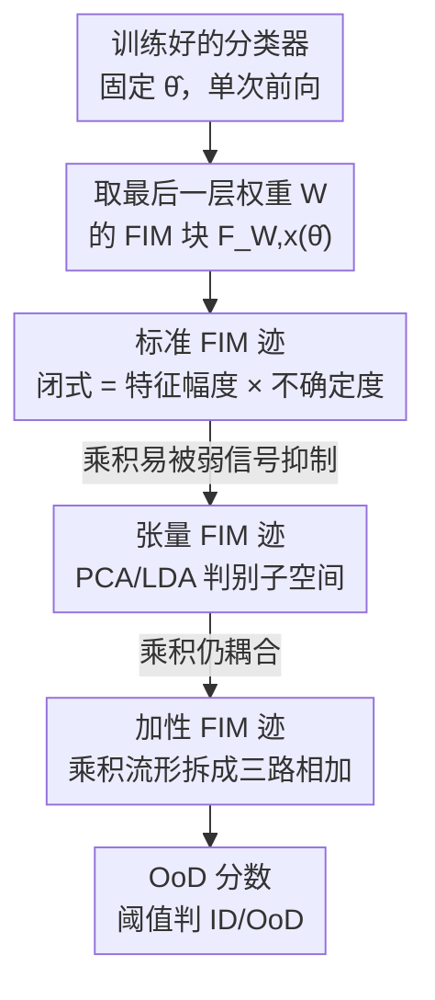

# Fisher-Rao Sensitivity for Out-of-Distribution Detection in Deep Neural Networks

**会议**: ICLR 2026  
**OpenReview**: [https://openreview.net/forum?id=GEtOzC4MIi](https://openreview.net/forum?id=GEtOzC4MIi)  
**领域**: AI 安全 / OOD 检测  
**关键词**: 分布外检测, 信息几何, Fisher-Rao 度量, Fisher 信息矩阵, 后处理检测器

## 一句话总结
本文用黎曼信息几何重新审视分布外（OoD）检测，把网络对输入的预测看成统计流形，发现 OoD 输入在训练好的参数处具有**更高的局部 Fisher-Rao 敏感度**；用 Fisher 信息矩阵（FIM）的迹来量化这种敏感度，作者从理论上推出"特征幅度 × 输出不确定度"这一乘积形式统一了已有 OoD 信号，并进一步用乘积流形构造把它升级成更鲁棒的**加性分数**，无需重训、无需 OoD 数据、单次前向就能取得有竞争力的检测效果。

## 研究背景与动机

**领域现状**：深度网络对训练分布外的输入常常**过度自信**——既预测错又给出很高的置信度，这是部署安全 AI 的核心障碍。OoD 检测的主流做法分两类：一类改训练流程（outlier exposure、激活整形、约束 Lipschitz 常数等），另一类是**后处理（post-hoc）**——不动模型，只在推理后基于特征/输出算一个分数。后处理里又分"推理时改前向"（ReAct/DICE/ASH 之类裁剪激活）和"纯解析"（Mahalanobis、Deep k-NN、ViM、IGEOOD、GradNorm、ODIN 等只读取已有量、不改计算）。

**现有痛点**：这些纯解析方法大多是**启发式**拼装信号——GradNorm 用梯度范数、Energy 用 logit 能量、ViM 把特征残差和 logit 拼起来。它们经验上有效，但缺一个统一的理论解释：为什么"特征幅度"和"输出不确定度"这两个看似无关的信号都能指示 OoD？为什么 SOTA 检测器偏偏要把信号**加**起来而不是**乘**起来？Igoe 等人甚至质疑 GradNorm 的成功只是这两个信号的简单组合，并非梯度本身的功劳。

**核心矛盾**：缺乏一个能从第一性原理推导出这些信号、并解释它们组合方式的几何框架，导致方法设计停留在试错调参。

**本文目标**：(1) 用信息几何给"特征幅度 × 不确定度"这类信号一个严格出处；(2) 解释 SOTA 为何用加性组合；(3) 据此造一个既有理论根基又有竞争力的后处理检测器。

**切入角度**：一族参数化分布 $p(y|x,\theta)$ 构成一个赋予 Fisher-Rao 度量的统计流形。对固定输入 $x$，让参数 $\theta$ 变动会描出流形 $S_x$；在训练好的参数 $\hat\theta$ 处，**局部敏感度**度量了"微小扰动 $\hat\theta$ 会多大程度改变预测"。作者的假设是：训练只在 ID 数据上把 $\hat\theta$ 优化到稳定点，所以 ID 输入处局部敏感度低；这种稳定性是从 ID 学来的，**对 OoD 不一定成立**，于是 OoD 输入处敏感度更高。

**核心 idea**：用**每输入 FIM 的迹** $\mathrm{Tr}(F_x(\hat\theta))$ 作为 OoD 分数——迹大说明小扰动强烈影响输出（OoD），迹小说明局部稳定（ID）；并沿着这条几何主线逐步精化成可用的加性检测器。

## 方法详解

### 整体框架

整篇方法是一条**层层加码的理论推导链**：从"用 FIM 迹量化敏感度"这个总思路出发，先把迹限制到最后一层权重，得到一个**闭式解**（Standard FIM Trace），这个闭式解恰好等于"特征幅度 × 不确定度"，于是把几何和已有启发式信号对接上；但乘积形式会因单一弱信号被抑制而不够区分，作者先用张量分解把迹限制到更具判别力的子空间（Tensor FIM Trace），再用**乘积流形**把乘积彻底拆成三路独立信号相加（Additive FIM Trace），最后用方差平衡解析地定超参。三个分数构成"标准 → 张量 → 加性"的递进，最终的加性分数是落地方法。

记最后一层为线性头 $h_{\hat\theta}(x)=W^\top f_{\hat\theta}(x)+b$，$f_{\hat\theta}(x)\in\mathbb{R}^D$ 是倒数第二层特征，$p_{\hat\theta}(x)=\mathrm{softmax}(h_{\hat\theta}(x))$ 是 $K$ 类预测分布。全参数 FIM 的迹对深网不可算，所以全程**只看最后一层权重 $W$ 对应的 FIM 块** $F_{W,x}(\hat\theta)$——因为它直接控制"高层特征如何翻译成最终预测"。

### 关键设计

**1. 标准 FIM 迹：把几何敏感度落成一个闭式解，对接已有 OoD 信号**

这是全文的地基（Theorem 5.1）。痛点是"特征幅度""输出不确定度"这些信号一直没有统一出处。作者把 FIM 的迹限制到最后一层权重 $W$ 张成的坐标子空间，利用线性输出层梯度可分解为 $\nabla_W\log p=(e_y-p_{\hat\theta})f_{\hat\theta}^\top$（类相关项 ⊗ 特征相关项），代入迹后特征范数平方 $\|f_{\hat\theta}\|_2^2$ 直接提出，剩下的 $\mathbb{E}_y[\|e_y-p_{\hat\theta}\|_2^2]$ 正是多项分布方差 $1-\|p_{\hat\theta}\|_2^2$，于是得到漂亮的闭式：

$$\mathrm{Tr}\big(F_{W,x}(\hat\theta)\big)=\|f_{\hat\theta}(x)\|_2^2\,\big(1-\|p_{\hat\theta}(x)\|_2^2\big).$$

这个式子的意义是：神经网络最后一层的 Fisher-Rao 敏感度**恰好等于"特征幅度 × 输出不确定度"的乘积**。它一举把信息几何和 GradNorm、Energy 这类启发式分数桥接起来——后者拼的正是这两个信号，本文给了它们一个几何出处。在 ImageNet/Places365 上，OoD 的该分数分布确实整体右移（敏感度更高），经验证实了核心假设；但两个分布有明显重叠，说明纯乘积形式不够，引出后续设计。

**2. 张量 FIM 迹：用 PCA/LDA 判别子空间放大可分性**

标准迹把最后一层的**所有扰动方向同等对待**，但并非所有方向都对区分 ID/OoD 有用——当嵌入范数和 softmax 平坦度都分不开 ID/OoD 时，整个分数就失效。作者的关键洞察是：只在**更具判别力的低维子空间**上算迹。

由于梯度天然分解成"类部分 ⊗ 特征部分"$\mathrm{vec}(\nabla_W\log p)=(e_y-p_{\hat\theta})\otimes f_{\hat\theta}(x)$，参数空间也能随之分解。于是用张量积基 $P=Q\otimes R$ 定义子空间：$Q\in\mathbb{R}^{K\times r_c}$ 张成**概率空间**子空间，$R\in\mathbb{R}^{D\times r_f}$ 张成**特征空间**子空间。限制到该子空间的迹（Prop 5.2）变成不确定度项 $U_{\hat\theta}(x)=\mathrm{Tr}(Q^\top S_{p_{\hat\theta}(x)}Q)$ 与投影幅度 $M_{\hat\theta}(x)=\|R^\top f_{\hat\theta}(x)\|_2^2$ 的乘积。两个投影矩阵刻意按各自空间的几何性质构造：$Q$ 用 **PCA** 在 ID softmax 分布上提取不确定度/类间混淆的主方向（FIM 最敏感方向）；$R$ 用 **LDA**（再正交化）在特征上最大化类间方差、最小化类内方差，使 ID 特征在该子空间投影范数大、而 OoD 特征因不符合学到的类结构留下显著正交分量。

**3. 加性 FIM 迹：用乘积流形把乘积拆成三路相加，并方差平衡定超参**

张量迹仍是乘积 $U_{\hat\theta}(x)\cdot M_{\hat\theta}(x)$，**乘积耦合会让一个弱信号压制另一个**——这正是 SOTA 偏好加性组合的原因。作者要把两路信号当成结构独立的几何敏感度来源，于是用**乘积流形** $\mathcal{M}=U\times U\times U$ 建模。先用勾股定理把特征总能量拆成"投影幅度 + 残差能量"$\|f_{\hat\theta}\|_2^2=\|R^\top f_{\hat\theta}\|_2^2+\|f_{\hat\theta}-RR^\top f_{\hat\theta}\|_2^2$，残差能量 $y_{\hat\theta}(x)$ 表示学到子空间无法解释的特征分量，与投影幅度正交、可当独立信号。在乘积流形上通过（伪）共形变换定义三个度量，使其迹恰为三路信号，总敏感度即三者相加：

$$\mathrm{Tr}(F^\oplus_{W,x}(\hat\theta))=\underbrace{U_{\hat\theta}(x)}_{\text{不确定度}}+\lambda_M\underbrace{M_{\hat\theta}(x)}_{\text{投影幅度}}+\lambda_y\underbrace{\|f_{\hat\theta}(x)-RR^\top f_{\hat\theta}(x)\|_2^2}_{\text{残差}\;y_{\hat\theta}(x)}.$$

这给 ViM 等 SOTA 的加性构造提供了几何依据。超参 $(\lambda_M,\lambda_y)$ 平衡三路尺度，但调参时拿不到 OoD 标签，作者采用**无差别原则**：假设各分量独立，令三者对总方差贡献相等，最小化 $L=(\mathrm{Var}[\lambda_y y]-\mathrm{Var}[U])^2+(\mathrm{Var}[\lambda_M M]-\mathrm{Var}[U])^2$，这是关于 $\lambda$ 的四次多项式，直接有解析解 $|\lambda_y|=\sqrt{\mathrm{Var}(U)/\mathrm{Var}(y)}$、$|\lambda_M|=\sqrt{\mathrm{Var}(U)/\mathrm{Var}(M)}$（符号由信号贡献分析定）。该加性分数还满足**重参数化不变性**（正交变换、分类器平移、均匀缩放下不变，Prop 5.4），符合"严格几何度量应独立于参数化"的要求；当 $\lambda$ 为负时流形退化为伪黎曼结构，但局部敏感度仍良定义。

### 损失函数 / 训练策略
方法是纯后处理，**不重训、不改推理**，base model 原样使用。唯一的"拟合"是从 ID 训练数据随机采样校准集 $D_{val}$（ImageNet 5 万张、CIFAR 5 千张）来构造投影矩阵 $Q$（PCA）、$R$（LDA），并据上面的解析式定 $\lambda_M,\lambda_y$。整个流程单次前向、无需任何 OoD 数据曝光。

## 实验关键数据

### 主实验
在 ImageNet-1K 上以 ResNet-50 / ViT-B/16 为 base，OoD 集为 Places365 / ImageNet-O / iNaturalist / SUN；主指标 AUROC（越高越好）与 TNR@TPR95。下表为 ViT-B/16 上 AUROC（%）对比：

| 方法 | ImageNet-O | iNaturalist | Places365 | SUN |
|------|-----------|-------------|-----------|-----|
| Energy Score | 91.72 | 97.85 | 89.05 | 90.57 |
| GradOrth | 93.22 | 98.98 | 89.78 | 93.15 |
| ViM (SOTA 加性) | 92.26 | 98.87 | 90.83 | 93.32 |
| IGEOOD (信息几何) | 91.66 | 97.89 | 87.31 | 90.32 |
| Standard FIM Trace (本文) | 89.03 | 96.92 | 86.28 | 88.56 |
| Tensor FIM Trace (本文) | 90.12 | 97.27 | 86.92 | 90.23 |
| **Additive FIM Trace (本文)** | **92.61** | **98.82** | **89.51** | **93.38** |

加性分数与 ViM、GradOrth 等强后处理方法持平甚至在 SUN 上略胜，且明显优于自家的标准/张量分数，验证了"从乘积转向加性"的理论动机。CIFAR-10/100（含近 OoD 的 C-10 vs C-100）上同样如此，加性分数在 CIFAR-10 vs SVHN 达 AUROC 91.28，全面超过标准/张量版本且稳定性媲美 ViM。

### 消融实验
作者在 ResNet-50/ImageNet 上做了消融，并通过三个分数的递进本身构成核心消融：

| 配置 | iNaturalist AUROC | Places365 AUROC | 说明 |
|------|-------------------|------------------|------|
| Standard FIM Trace | 89.74 | 78.92 | 纯乘积，全参数方向 |
| Tensor FIM Trace | 89.89 | 81.46 | + PCA/LDA 判别子空间 |
| Additive FIM Trace | **90.61** | **82.93** | + 乘积流形加性分解 |

### 关键发现
- **加性 > 张量 > 标准**贯穿所有数据集和两种架构，最有力地说明：判别子空间和乘积→加性的解耦各自带来稳定增益，乘积耦合确实会被弱信号拖累。
- 特征子空间用 **LDA 优于 PCA**（消融证实），因为 LDA 显式最大化类间可分性，更契合"ID 特征投影范数大、OoD 留正交残差"的假设。
- 方法对校准集**大小与采样鲁棒**，说明子空间估计不需要精心挑选样本。
- 在 ResNet-50 上一些 baseline 跨数据集波动很大（如 Mahalanobis 在 iNaturalist 仅 52.01），而加性分数始终稳定，体现了几何框架带来的可靠性。

## 亮点与洞察
- **一个闭式解打通几何与启发式**：$\mathrm{Tr}(F_{W,x})=\|f\|^2(1-\|p\|^2)$ 把"特征幅度""不确定度"这两个一直被分别拼凑的信号，证明成 Fisher-Rao 敏感度的自然分解，等于给一大批启发式方法补了理论。
- **"乘积 vs 加性"被几何地解释**：以往只知道 SOTA 喜欢加性组合，本文用乘积流形 + 勾股分解第一次给出"为什么该加不该乘"的几何答案——独立信号在乘积流形上敏感度相加。
- **超参解析可解**：方差平衡把调参变成四次多项式的闭式解，且不碰 OoD 标签，这种"用 ID 统计量自定权重"的思路可迁移到其他需无监督定权的信号融合任务。
- **零成本部署**：单次前向、不动模型、不需 OoD 数据，几何理论却换来与 ViM 同级的性能，性价比高。

## 局限与展望
- 作者承认：分析只锁定在**最后一层权重**的参数几何。最后一层直接、解析，但 OoD 现象很可能也体现在更深层特征的几何中，把敏感度分析推广到中间表示是自然的下一步。
- 自己观察：方法定位是"competitive / 持平 SOTA"而非全面超越——多数指标上与 ViM、GradOrth 互有胜负，几何框架的主要价值在**解释力和稳定性**而非刷点。
- 加性分数依赖 PCA/LDA 子空间和方差平衡的"独立性假设"，当不确定度与特征信号实际强相关时，方差平衡的最优性可能打折；负 $\lambda$ 下退化为伪黎曼结构，几何"度量"的严格性也随之弱化。
- 需要 ID 校准集构造子空间（ImageNet 5 万张），虽是 ID 数据但仍是额外的一次性开销。

## 相关工作与启发
- **vs IGEOOD**：同属信息几何路线，但 IGEOOD 用统计流形上的 Fisher-Rao **测地线距离**度量样本到分布的距离；本文用**局部 FIM 迹（敏感度/曲率）**，关注的是训练点处对参数扰动的局部稳定性，并据此推出可解释的加性分数，实验上也优于 IGEOOD。
- **vs GradNorm / GradOrth**：GradNorm 用对均匀分布的梯度范数当分数，GradOrth 进一步把梯度投到学到的子空间；本文从理论上指出梯度信号本质就是"特征幅度 × 不确定度"，并解释了 Igoe 等人对 GradNorm 的质疑，把启发式升级为有几何根基的加性分数。
- **vs ViM**：ViM 通过虚拟类构造把特征残差和 logit 加性融合，是 SOTA 加性 baseline；本文的乘积流形构造为这种加性组合提供了几何依据，性能与之持平，但多了一套可解释的推导。
- **vs 全局不确定度方法（Deep Ensembles / Bayesian）**：那些方法靠全局探索后验多样性来量化不确定度；本文主张不确定度信息**也局部地编码**在统计流形的几何里，用信息几何就能高效利用这种局部信息，代表从"全局"到"局部几何分析"的范式转变。

## 评分
- 新颖性: ⭐⭐⭐⭐⭐ 用信息几何把"特征幅度 × 不确定度"推成闭式、并以乘积流形解释加性组合，视角新且自洽
- 实验充分度: ⭐⭐⭐⭐ 覆盖 CIFAR/ImageNet × ResNet/ViT × 多 OoD 集，三分数递进消融清晰，但多为"持平 SOTA"而非显著超越
- 写作质量: ⭐⭐⭐⭐ 理论推导严谨、动机层层递进，但数学密度高、对非几何背景读者门槛偏大
- 价值: ⭐⭐⭐⭐ 给一大批启发式 OoD 信号补了统一理论，零成本后处理，安全/可信 AI 场景实用

<!-- RELATED:START -->

## 相关论文

- [\[ICLR 2026\] AP-OOD: Attention Pooling for Out-of-Distribution Detection](ap-ood_attention_pooling_for_out-of-distribution_detection.md)
- [\[ICLR 2026\] Fingerprinting Deep Neural Networks for Ownership Protection: An Analytical Approach](fingerprinting_deep_neural_networks_for_ownership_protection_an_analytical_appro.md)
- [\[ICLR 2026\] GradPCA: Leveraging NTK Alignment for Reliable Out-of-Distribution Detection](gradpca_leveraging_ntk_alignment_for_reliable_out-of-distribution_detection.md)
- [\[ICLR 2026\] Benchmarking Stochastic Approximation Algorithms for Fairness-Constrained Training of Deep Neural Networks](benchmarking_stochastic_approximation_algorithms_for_fairness-constrained_traini.md)
- [\[ICLR 2026\] SCOPED: Score–Curvature Out-of-Distribution Proximity Evaluator for Diffusion](scoped_scorecurvature_out-of-distribution_proximity_evaluator_for_diffusion.md)

<!-- RELATED:END -->
