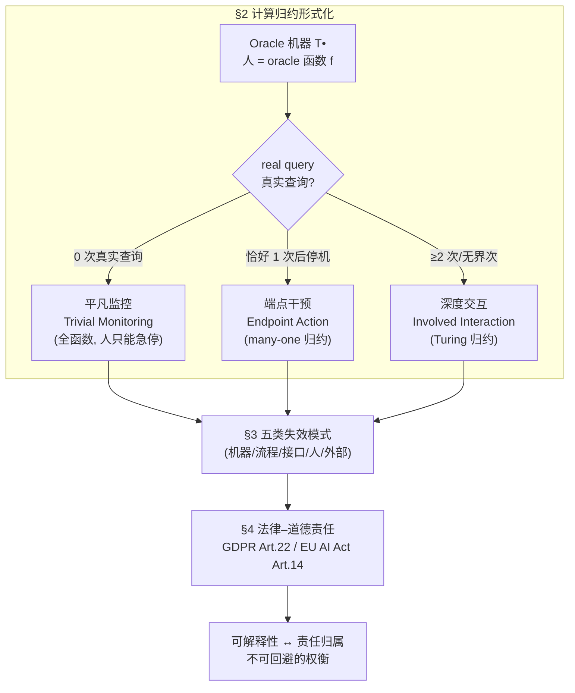

# Formalising Human-in-the-Loop: Computational Reductions, Failure Modes, and Legal–Moral Responsibility

**会议**: ICLR 2026  
**OpenReview**: [https://openreview.net/forum?id=KR8viVTrX4](https://openreview.net/forum?id=KR8viVTrX4)  
**代码**: 无（纯理论/法律分析）  
**领域**: AI 安全 / 人机协同 / AI 治理与责任  
**关键词**: Human-in-the-Loop, 可计算性理论, Oracle 机器, 计算归约, 失效模式分类, 法律责任, GDPR, EU AI Act  

## 一句话总结
本文用可计算性理论中的 oracle 机器与「归约」概念，把五花八门的 Human-in-the-Loop（HITL）人类监督方案严格形式化为三类——平凡监控、端点干预、深度交互，再据此建立失效模式分类法并剖析 UK/EU 法律的盲点，最终揭示出一个无法回避的「责任归属 ↔ 技术可解释性」权衡。

## 研究背景与动机

**领域现状**：在 AI 安全与监管话语中，「让人留在回路里（HITL）」几乎被当成万能护身符——GDPR 第 22 条、EU AI Act 第 14 条都把「人类监督」写进法条，作为防止自动决策系统（ADMS）造成伤害的核心保障。学界也涌现了大量术语：HOTL（人在回路之上）、HOOTL（人在回路之外）、HIC（人类指挥）、MHC（有意义的人类控制）等。

**现有痛点**：这些概念彼此重叠又互相割裂，缺乏一个统一、精确的形式定义。结果是「HITL」成了一个含糊的标签——一家公司可以摆个橡皮图章式的人类审核（tokenistic HITL）就声称满足了监管要求，而监管者既无法验证这个「人」是否真的起作用，也无法区分不同方案在安全性上的天壤之别。更糟的是，当系统出事时，回路里的人常常变成 Elish 所说的「道德皱缩区（moral crumple zone）」，替有缺陷的机器背锅（如 Uber 自动驾驶撞死行人案，责任全压在安全员身上）。

**核心矛盾**：法律假设「有人监督 = 安全」，但 HITL 的有效性其实**严重依赖系统的具体技术设计**——同样叫「HITL」，人能做的事可能从「只能按急停」到「与机器深度协作」相差极大，而现有法律只盯着最末端、最弱的那种监督形态。

**本文目标**：回答「何时、是否、以及如何使用 HITL 才能真正降低伤害与风险」，把 HITL 从模糊口号变成可分析、可验证、可立法对接的形式对象。

**核心 idea**：**用 oracle 机器把「人」建模为机器调用的「神谕（oracle）」**——机器是确定性自动机 $T^\bullet$，人提供的判断是 oracle 函数 $f$；机器调用人的次数和方式，恰好对应可计算性理论里两种经典归约（many-one 归约与 Turing 归约），从而把 HITL 的「人类参与程度」变成一个有严格数学定义的谱系。

## 方法详解

### 整体框架

本文不是算法论文，而是一套**形式化分析框架**，由三个环环相扣的部分组成：先用 oracle 机器把 HITL 形式化为三种计算归约类型（§2），再在这三类之上建立二维失效模式分类法（§3），最后把这两个维度对接到 UK/EU 法律并揭示责任权衡（§4）。三者的逻辑链条是：**计算结构决定了人能做什么 → 人能做什么决定了会怎么失败 → 失败方式决定了法律该如何分配责任**。

### 关键设计

**1. 用 oracle 机器把「人」形式化为神谕，并以 real query 区分参与的真假**：框架的地基是把决策系统的算法骨架建模为 oracle 机器 $T^\bullet$——一个带工作带、额外「oracle 带」和若干「oracle 状态」的确定性自动机。当机器进入 oracle 状态时，oracle 带上的内容 $w$ 被瞬间替换为 $f(w)$，这个 $f$ 正是人提供的判断（一次「human query」）。关键不在于机器是否调用了人，而在于这次调用是否「真的有用」：本文定义 **real query（真实查询）**——当且仅当计算树在该 oracle 调用点出现分叉，且并非所有分支都导向相同的输出集合时，这次查询才算 real。这一定义精妙地排除了两种「假参与」：一是机器干脆无视人给的答案，二是「条条大路通罗马」——无论人怎么答机器都吐出同样结果。此外本文允许人随时写入急停符号 $!$，机器读到即无输出停机，但这个「停机」不计入判定 real query 的输出集合，从而把「能叫停」和「能影响计算」严格分开。

**2. 三类归约谱系：平凡监控 / 端点干预 / 深度交互**：在 real query 的基础上，本文按「机器问人多少次真实查询」把所有 HITL 一刀切成三类。若机器从不发出 real query（人最多只能急停），就是**平凡监控**——此时 $T^\bullet$ 定义了一个**独立于人的全函数（total function）**，人处于「不知者无畏」的位置，只能在机器算完前终止它。若机器恰好问**一次** real query 然后立即停机、把人的答案作为输出，就是**端点干预**——这对应 $g$ 到 $f$ 的 **many-one 归约**（机器把问题归约给人，但自己不构成全函数）。若机器问**潜在无界次（至少两次）** real query、与人来回「计算乒乓」，就是**深度交互**——这对应 **Turing 归约**（机器把计算 Turing-归约给人，但不是 many-one 归约）。本文特别强调：setup 类型由计算树中**最短**的潜在人机交互路径决定（看人的「能动性下界」），而非最长路径。用一个路径规划的例子贯穿三类：机器给一条路线让人接受/拒绝（平凡监控）、给几条路线让人选（端点干预）、从何时出发到路线优化全程协作（深度交互）。

**3. 反直觉的「弱归约更优」主张与可解释性递增**：在纯可计算性理论里，Turing 归约被视为比 many-one 归约「更弱」。但本文指出 HITL 场景的诉求恰好相反：我们**固定 oracle（人）**，问「用这个人能解决哪些问题」——于是**深度交互（Turing 归约）反而能用同一个人解决最多的问题**，给予人最大的能动性、对齐性与安全潜力。更进一步，real query 越多，机器的「黑箱」被「揭面」得越彻底：每次 real query 都对应一个人类可理解的问题，泄露机器此刻「在做什么」的信息。平凡监控是一个大黑箱；端点干预在末尾揭开一步；深度交互则把过程变成「许多由人类输入串联起来的小黑箱链」，每个小黑箱都更可解释。这条「计算链」直接为后文 §4.3 的责任分析埋下伏笔。

**4. 二维失效模式分类法，并与归约类型挂钩**：本文综合 2020–2022 年对多家初创公司的伦理咨询经验与文献，提出按「人性含量（amount of human-ness）」从纯数字到纯社会排序的**五大失效类别**：① 机器组件失效（异常输入输出、有偏/错误输出、问题性自适应）；② 流程与工作流失效（人的权力/自控/反应时间不足、不切实际的期望、延迟通知）；③ 人机接口失效（输出不可理解、界面糟糕、培训不足）；④ 人类组件失效（认知偏差、自动化偏差、疲劳、缺乏勇气、压力过载）；⑤ 外生环境失效（不合理的法律、社会期望、工作场所要求）。关键洞察是：**不同归约类型易发不同失效类别**——平凡监控因人角色被动，最易触发自动化偏差、疲劳、「不敢叫停」等人类组件失效；端点干预把风险集中在那唯一的交互点，人机接口失效与单点认知偏差最致命；深度交互虽给人最大干预力，但来回纠缠使失效机制最复杂，还会出现「量变冒充质变」（许多次浅层交互并未真正改变机器输出）。本文用 Uber 致命车祸做案例，逐条标注其失效如何横跨全部五类（机器误分类行人 + 流程缺安全文化 + 接口允许看手机 + 人分心 + 事后法律未追责公司）。

**5. 法律盲点与「可解释性 ↔ 责任」权衡**：把上述形式化对接到法律后，本文发现 GDPR 第 22 条（治理「完全自动化决策」）与 EU AI Act 第 14 条要求的「有意义/有效的监督」，本质上只认可到端点干预这一层，且只盯着流程最末端的人，正如 Sarra 所言「先前阶段的实质人类介入似乎无关紧要」。本文主张法律应要求更强的归约（深度交互）才算「有意义」，因为只有这样人才能真正履行其保障义务（safeguarding duties）。但随之而来的是一个**无法回避的权衡**：深度交互虽然记录了机器问的每个问题和人的每个回答、提升了透明度与可解释性，但人机深度纠缠使得「哪个决策点导致了失败」变得几乎无法追溯，反而**制造了责任鸿沟**；相反，平凡监控/端点干预里人的影响清晰可归责，却是更彻底的黑箱。一句话：**越可解释的 HITL 越难归责，越易归责的 HITL 越黑箱**。本文借英国石棉/间皮瘤案（按暴露比例分摊责任）为「责任鸿沟」案件提供裁判灵感，反对像 Uber 案那样把人当替罪羊来庇护公司。

## 实验关键数据

本文为**纯理论与法律分析**论文，无定量实验。其论证由形式化定义、真实案例研究与法律条文剖析支撑。下面以表格归纳核心结论。

### 三类 HITL 归约对比

| 维度 | 平凡监控 (Trivial Monitoring) | 端点干预 (Endpoint Action) | 深度交互 (Involved Interaction) |
|------|------|------|------|
| 计算归约类型 | 全函数（独立于人） | many-one 归约 | Turing 归约 |
| real query 次数 | 0（仅可急停） | 恰好 1 | 潜在无界（≥2） |
| 人的能动性 | 最低 | 中等 | 最高 |
| 可解释性 | 一个大黑箱 | 末尾揭开一步 | 多个小黑箱链，最高 |
| 责任归属清晰度 | 清晰 | 清晰 | 模糊（责任鸿沟） |
| GDPR/AI Act 合规 | 一般不满足「有意义」 | 勉强达「有意义」 | 本文主张应为目标 |
| 典型对应模式 | HOTL、Thumbs up/down | Recommendation System | 人机协作、与 LLM 创作 |

### 关键发现

- **统一性**：三类归约统一了 HOTL/HOOTL/HIC/MHC 等散落术语，给监管者一致的检验框架，并能识别「橡皮图章式」的虚假 HITL。
- **反直觉结论**：可计算性理论中「更弱」的 Turing 归约（深度交互），在固定人这个 oracle 的前提下反而最优——能解决最多问题、给人最大能动性、最可解释。
- **两维联用**：归约类型与五类失效模式必须**同时考虑**——忽略整个失效类别几乎必然导致失败，忽略单个失效模式也会在特定情境出问题。
- **法律盲点**：GDPR/AI Act 只承认到端点干预，对「先前阶段的实质人类介入」视而不见；SCHUFA 信用评分案中一个弱端点干预被法院判定为实质上的平凡监控，从而违反第 22 条。
- **核心权衡**：可解释性与责任归属在 HITL 中天然对立，立法以「鼓励更好 HITL」为目标时必须正视这一点。
- **六条建议**：① 明确 HITL 计算类型并尽量超越平凡监控；② 避免把 HITL「外挂」到既有流程，须深度集成；③ 为不同 HITL 类型制定有意义监督的指南；④ 让对人的期望匹配其能力；⑤ 防止人沦为「道德皱缩区」；⑥ 理解因果与可解释性的权衡以更细致地分配法律责任。

## 亮点与洞察

- **跨学科的精准嫁接**：把可计算性理论里冷门的 oracle 机器与归约概念，干净利落地映射到 AI 治理这一完全不同的领域，且 real query 的定义恰到好处地刻画了「真假参与」，这种形式化既严谨又有实际可操作性。
- **「弱归约更优」的视角翻转**：理论上更弱的 Turing 归约在 HITL 语境下反而是最理想形态，这个反直觉结论来自「固定 oracle 求可解问题」的视角切换，非常漂亮。
- **形式化 → 失效 → 法律的完整闭环**：很少有论文能把抽象数学定义一路推到具体法条建议，并用 Uber、Notre-Dame、SCHUFA 等真实案例锚定每一环，可读性与说服力兼具。
- **揭示一个真正的权衡而非提供银弹**：本文诚实地指出深度交互并非完美——它仍受所有失效模式困扰，且引入了新的责任鸿沟，这种不回避矛盾的态度让结论更可信。

## 局限与展望

- **实践中难以判定归约类型**：作者自己承认，证明「不存在更简单的归约」在技术上很难（不能靠举例，需对计算过程做深入分析），在法律和道德上判定「是否只是门面」也很难；本文的应对是建议把举证责任部分转移给开发者，但这本身的可操作性仍待验证。
- **经验基础较薄**：失效模式分类法源自 2020–2022 年对若干初创公司的伦理咨询 + 文献比对，缺乏大规模实证检验，分类的「完备性」更多是论断而非证明。
- **只覆盖三个极端，回避中间形态**：本文聚焦平凡监控/端点干预/深度交互三类，对大量中间归约类型（如 bounded truth-table 归约）只在附录略加讨论，实际系统可能落在灰色地带。
- **法律分析限于 UK/EU**：作为「概念验证」只选了 GDPR 与 EU AI Act，对美国（倾向追究人责）等其他法域的适配性仍是开放问题。
- **展望**：可进一步把学习机制（learning to defer、conformal prediction）与归约框架结合，自动触发并辅助 real query；以及把「按暴露比例分摊」的石棉案裁判原则真正操作化到 HITL 责任分配。

## 相关工作与启发

- **可计算性理论**：oracle 机器与 Turing/many-one 归约（Soare 1987；van Melkebeek 2000）是本文形式化的直接来源，本文创新在于把它从纯理论搬进社会技术系统分析。
- **HITL 概念谱系**：Meaningful Human Control、moral crumple zone（Elish 2019）、人本计算（Yuen et al. 2009）、HITL 设计模式（Andersen & Maalej 2024 的 10 种模式）等，本文用统一框架把它们「收编」并指出 Andersen & Maalej 的模式全是端点干预或平凡监控、缺少「中止而非纠正」的形态。
- **AI 监督理论**：Sterz et al. (2024) 提出有效监督的四个必要充分条件（理解系统、自控、有效干预力、对齐意图），本文将其落到具体归约类型上变得可操作。
- **法律与责任鸿沟**：Matthias (2004) 的责任鸿沟、英国石棉/间皮瘤判例（House of Lords 2006）、SCHUFA 案、Uber 案，构成本文法律论证的支柱。
- **启发**：对做 AI 安全与对齐的研究者，本文提示「人类监督」不是布尔开关而是一个有数学结构的谱系，评估任何含人系统时都应先问「这是哪类归约、易发哪类失效、责任如何归属」；对做可解释性的研究者，则需正视可解释性与可归责性之间的张力。

## 评分
- **新颖性**: ⭐⭐⭐⭐⭐ 用可计算性理论形式化 HITL 是真正原创的跨学科视角，real query 定义与「弱归约更优」的翻转都很有洞见。
- **实验充分度**: ⭐⭐⭐ 纯理论/法律论文，无定量实验；案例研究（Uber/SCHUFA）扎实但失效分类法的经验基础偏薄，完备性靠论断支撑。
- **写作质量**: ⭐⭐⭐⭐⭐ 逻辑链条「计算→失效→法律」环环相扣，案例锚定清晰，对自身局限诚实，跨学科表达流畅。
- **价值**: ⭐⭐⭐⭐⭐ 为 AI 治理、监管立法与安全工程提供了可统一、可检验的分析语言，对 EU AI Act 时代的合规设计有直接现实意义。

<!-- RELATED:START -->

## 相关论文

- [\[ICLR 2026\] MoReBench: Evaluating Procedural and Pluralistic Moral Reasoning in Language Models, More than Outcomes](morebench_evaluating_procedural_and_pluralistic_moral_reasoning_in_language_mode.md)
- [\[ICLR 2026\] PluriHarms: Benchmarking the Full Spectrum of Human Judgments on AI Harm](pluriharms_benchmarking_the_full_spectrum_of_human_judgments_on_ai_harm.md)
- [\[ACL 2025\] PrivaCI-Bench: Evaluating Privacy with Contextual Integrity and Legal Compliance](../../ACL2025/ai_safety/privacibench_evaluating_privacy_with_contextual_integrity.md)
- [\[ICLR 2026\] Fair Decision Utility in Human-AI Collaboration: Interpretable Confidence Adjustment for Humans with Cognitive Disparities](fair_decision_utility_in_human-ai_collaboration_interpretable_confidence_adjustm.md)
- [\[ICLR 2026\] Generative Adversarial Post-Training Mitigates Reward Hacking in Live Human-AI Music Interaction](generative_adversarial_post-training_mitigates_reward_hacking_in_live_human-ai_m.md)

<!-- RELATED:END -->
