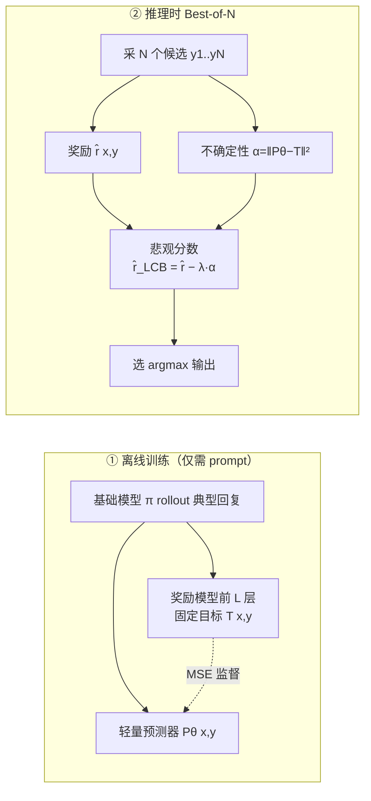

# From Curiosity to Caution: Mitigating Reward Hacking for Best-of-$N$ with Pessimism

**会议**: ICLR 2026  
**OpenReview**: [https://openreview.net/forum?id=EZn2TmBBfF](https://openreview.net/forum?id=EZn2TmBBfF)  
**代码**: 待确认  
**领域**: AI 安全 / 对齐（推理时奖励攻击缓解）  
**关键词**: Best-of-N, 奖励攻击, 悲观主义, 不确定性估计, RND, OOD 检测  

## 一句话总结
把强化学习里"好奇心（curiosity）"奖励预测误差当作探索信号的思路反过来用——训练一个预测器去拟合奖励模型在典型回复上的内部特征，用预测误差作为"分布外不确定性"惩罚奖励分数，从而让 Best-of-$N$ 采样在 $N$ 增大时不再被奖励攻击拖垮，反而单调变好。

## 研究背景与动机
- **领域现状**：推理时算力扩展（inference-time scaling）是提升大模型表现的主流范式，Best-of-$N$（BoN）采样是其中最简单有效的手段——对一个 prompt 采 $N$ 个候选回复，用奖励模型 $\hat r$ 打分，选最高分的那个输出。直觉上 $N$ 越大越可能采到好答案。
- **现有痛点**：BoN 的上限被奖励模型 $\hat r$ 的质量死死卡住。实践中普遍观察到"先升后降"的曲线——$N$ 增大到某个拐点后性能反而恶化，这就是**奖励攻击（reward hacking）**：BoN 越来越倾向于选那些钻 $\hat r$ 空子（格式偏好、表面模式）却并非真正优质的"非典型"回复，本质是 Goodhart 定律的体现（指标一旦成为优化目标就不再是好的度量）。
- **核心矛盾**：已有缓解手段两头不讨好。一类是**做更强的奖励模型**，但"穷举所有攻击策略"在难度上天然不对称、不可行；另一类是 Huang et al. (2025b) 的**分布级正则化**，把采样分布约束得贴近基础策略 $\pi$，理论保证漂亮但**过度保守**——它对所有 OOD 回复一视同仁地惩罚，把那些"略微越界但确实更好"的回复也一起拒了，浪费了推理算力的红利。
- **本文目标**：设计一个既能抗奖励攻击、又能充分吃到推理时扩展红利的 BoN 方案。
- **核心 idea**：**【悲观主义的推理时实例化】** 借用 RL 中的悲观（pessimism）原则——用价值估计的置信下界来回避奖励不确定的 OOD 动作。关键创新是把悲观从"分布级"下放到"逐回复的奖励级"：给每个回复估一个不确定性 $\alpha(x,y)$，从 $\hat r$ 里减掉它，再选悲观分数最高的。而 $\alpha$ 的来源正是好奇心的"对偶"——**好奇心奖励预测误差（鼓励探索新奇），caution 则惩罚预测误差（视其为分布不确定性信号）**。

## 方法详解

### 整体框架
方法叫 **caution（谨慎）**，是 curiosity 的对偶。离线训练阶段：取奖励模型前 $L$ 层的隐状态作为固定目标网络 $T(x,y)$，训练一个轻量预测器 $P_\theta(x,y)$ 去拟合它，监督数据是基础模型 $\pi$ 自己在训练集 prompt 上 rollout 的回复（无需标注）。推理阶段：对 $N$ 个候选，用预测误差 $\alpha(x,y)=\|P_\theta-T\|^2$ 作为不确定性惩罚，按悲观奖励 $\hat r_{\text{LCB}}=\hat r-\lambda\alpha$ 重排序后选最高分。整套只需在原 $\hat r$ 前向之外多两次可并行的轻量前向，开销与算 $\hat r$ 同量级。

### 关键设计

**1. 把"分布级悲观"下放到"逐回复奖励级悲观"，点破过度保守的根因。** Huang et al. (2025b) 在分布层面约束采样策略 $\hat\pi$ 贴近 $\pi$，问题在于它对所有可能的 OOD 回复**等价惩罚**，不管这个回复是否真的源于 $\hat r$ 的瑕疵。本文转而直接对奖励估计本身做正则：设计一个不确定性函数 $\alpha:\mathcal X\times\mathcal Y\to\mathbb R_{\ge 0}$ 度量对 $\hat r(x,y)$ 的把握程度，得到悲观奖励 $\hat r_{\text{LCB}}(x,y)=\hat r(x,y)-\lambda\alpha(x,y)$，最终选 $\hat i=\arg\max_{i\in[N]}\hat r_{\text{LCB}}(x,y_i)$。只要 $\alpha$ 在典型样本上小、在非典型样本上大，就能保证 $\hat r_{\text{LCB}}\le r^\star$ 且在真正优质回复上近似取等——惩罚精准打在"可疑回复"上，而不误伤"略越界但更好"的回复。

**2. caution——curiosity 的离线对偶，用预测误差当 OOD 探测器。** 好奇心（RND, Pathak et al. 2017; Burda et al. 2018）的核心是持续训练一个预测器去拟合固定目标，把监督误差当新奇度信号鼓励探索；在线 RL 里 OOD 状态是好事。本文的离线场景恰恰相反——OOD 回复是要回避的，因为 $\hat r\approx r^\star$ 只在 $\pi$ 的典型回复上成立。于是沿用"预测误差即 OOD 信号"的内核，但**完全离线**：固定目标 $T(x,y)=h^R_L(x,y)$ 取奖励模型第 $L$ 层隐状态，可训练预测器 $P_\theta$ 用 MSE 拟合 $L(\theta)=\mathbb E_{(x,y)\sim D_{\text{train}}}\big[\|P_\theta(x,y)-T(x,y)\|^2\big]$。由于无需像在线 RL 那样持续训练学生网络，省掉了显存与时间开销，实现极其简单。$P_\theta$ 可灵活选轻量结构（共享 embedding / 简化编码器 / 投影层）。

**3. 蒸馏奖励模型特征而非随机网络特征，这是 caution 优于传统 RND 的胜负手。** 传统 RND 让预测器拟合一个**随机初始化**网络的输出，OOD 信号与"奖励是否可靠"无关。本文刻意把目标设成**奖励模型自己的内部表示**，使 $\alpha$ 成为"奖励感知（reward-aware）"的不确定性——预测误差大恰好对应 $\hat r$ 不可靠的区域。消融（表 2）显示同样的 $\lambda$ 下蒸馏 RM 特征全面碾压蒸馏随机特征：$\lambda=0.8$ 时 caution 峰值 82.1%、终值 81.0%，而传统 RND 只有 78.1% / 74.9%。训练数据只需 prompt（远比训练奖励模型的高质量标注便宜），且作者发现 OOD 探测对 prompt 分布相当鲁棒。

**4. 简化线性设定下的理论保证。** 在 $y_i\in\mathbb R^d$ 独立采样、$r^\star$ 线性的简化设定中（定理 1 / 附录定理 3），令 $i^\star$ 为最优回复、$\hat i$ 为标准 BoN 选择、$i_{\text{pess}}$ 为 caution 选择，在对目标网络、$r^\star$、$\hat r$、$\pi$、预测器的适当条件下有 $\mathbb E[r^\star(y_{i_{\text{pess}}})-r^\star(y_{\hat i})]\gtrsim\sqrt{\log N}$（相对 BoN 的优势随 $N$ 增长），且 $\lim_{N\to\infty}\mathbb E[r^\star(y_{i^\star})-r^\star(y_{i_{\text{pess}}})]/\mathbb E[r^\star(y_{i^\star})]=0$（渐近最优）。作者称这是 curiosity/RND 类方法用于 OOD 检测的首个理论保证。$\lambda$ 控制悲观强度，$\lambda=0$ 退化为标准 BoN。

## 实验关键数据

实验用 Llama-3.2-3B-Instruct 作基础模型 $\pi$，奖励模型主用 OASST，$r^\star$ 为二值（答案对否），用 vLLM 采样并 bootstrap 3 次给置信区间。预测器只在 GSM8K 训练集 rollout 上训练。

### 主实验表格
$N$ 从 1 扫到 512，对比 RM、Pessimism-only、RM+Pessimism（Peak=最高准确率，Final=$N{=}512$ 处准确率，Degr.=峰值到终值的下降，越低越好）：

| 方法 | GSM8K Peak | GSM8K Final | Degr. | MATH-500 Peak | MATH-500 Final | Degr. | BBH-Hard Peak | BBH-Hard Final | Degr. |
|---|---|---|---|---|---|---|---|---|---|
| Reward Model | 79.3 | 71.5 | 7.7 | 11.5 | 8.5 | 3.0 | 17.3 | 1.7 | 15.6 |
| Pessimism Only | 81.3 | 80.3 | **1.0** | **13.6** | **11.9** | 1.7 | **22.9** | **22.1** | **0.9** |
| RM + Pessimism | **82.6** | **81.1** | 1.5 | 12.3 | 10.1 | 2.3 | 18.5 | 11.0 | 7.5 |

预测器只在 GSM8K 训练，故 MATH-500 是分布外（OOD）、BBH-Hard 是完全跨域（out-of-domain）。GSM8K 上 caution 比纯 RM 峰值高 4.2%、终值高 15.5%，且随 $N$ 单调上升。

### 消融实验表格
GSM8K 上扫描悲观强度 $\lambda$，对比蒸馏 RM 特征（本文）vs 蒸馏随机网络（传统 RND）：

| $\lambda$ | Caution Peak | Caution Final | RND Peak | RND Final |
|---|---|---|---|---|
| 0.0 (RM Only) | 78.9 | 71.2 | 78.9 | 71.2 |
| 0.4 | 80.3 | 76.0 | 78.5 | 72.1 |
| 0.6 | 81.5 | 80.2 | 78.4 | 73.1 |
| 0.8 | **82.1** | **81.0** | 78.1 | 74.9 |
| 1.0 (Caution Only) | 81.3 | 79.8 | 77.0 | 72.9 |

预测器架构消融（表 3）：轻量架构反而比"全架构"更好——Lightweight+Separate Emb. 拿到 82.7% 峰值，而 Full 架构尽管重构损失更低（0.127 vs 0.24），泛化却更差（峰值仅 80.3%）。

### 关键发现
- **任务越难、奖励模型越不可靠，纯悲观越香**：MATH-500 和 BBH-Hard 上 Pessimism-only 反超 RM+Pessimism。BBH-Hard 上 RM 几乎崩溃（终值 1.7%），因为远超训练分布时奖励模型的虚假相关性主导了判断；caution 靠"贴近熟悉分布"维持了 22.1% 的稳定终值。
- caution 全程单调上升，彻底消除了"先升后降"的奖励攻击曲线，且优于 Huang et al. (2025b)——后者虽单调但难以超过最优 $N$ 下的标准 BoN。
- 重构损失低 ≠ 下游好：过拟合奖励模型特征反而削弱 OOD 区分度，轻量预测器泛化更优。

## 亮点与洞察
- **概念对偶非常优雅**：curiosity 奖励预测误差去探索，caution 惩罚预测误差去回避——同一套 RND 机制，符号一翻就从"在线探索"变成"离线 OOD 检测"，且离线设定省掉了持续训练的工程负担。
- **"奖励感知不确定性"是真正的胜负手**：蒸馏奖励模型自己的特征（而非随机网络），让不确定性信号恰好对齐"奖励何处不可靠"，这是它碾压传统 RND 的根本原因。
- **极低成本**：只多两次可并行前向，复用 $\hat r$ 的特征，几乎零额外开销；训练只需 prompt，不需要昂贵标注。
- 给出了 curiosity/RND 类方法做 OOD 检测的首个理论保证，把一个经验技巧上升到可证明改进 BoN 的高度。

## 局限与展望
- **理论设定偏理想**：定理 1 依赖线性奖励、i.i.d. 采样及对目标/预测器网络的较强假设，与真实自回归大模型差距较大，只能算 proof-of-concept。
- **超参 $\lambda$ 需调**：最优 $\lambda$ 随任务难度漂移（GSM8K 约 0.8，难任务偏向纯悲观即 $\lambda$ 更大），缺乏自适应选取机制。
- **跨域时 RM 可能成累赘**：BBH-Hard 上加入 $\hat r$ 反而拖累，说明该方法尚不能自动判断"何时该信奖励、何时该纯靠分布相似度"。
- **评测规模有限**：主要在 3B 模型 + 数学/推理类任务上验证，更大模型、开放式生成、安全对齐等场景的有效性待验证。
- **层选择 $L$、预测器结构**等设计仍偏经验，缺乏系统性指导。

## 相关工作与启发
- **奖励攻击与缓解**：Gao et al. (2023)、Huang et al. (2025b) 刻画了 BoN 的过优化现象；本文相对 Huang et al. (2025b) 的分布级正则化，提出更精准的逐回复奖励级悲观。
- **悲观主义 RL**：Jin et al. (2021)、Guo et al. (2022) 的 LCB 悲观原则被首次实例化到推理时 BoN 选择上。
- **好奇心 / RND**：Pathak et al. (2017)、Burda et al. (2018) 的内在奖励机制被"反向"借用为 OOD 惩罚，给出了把在线探索工具迁移到离线选择的范式。
- **启发**：预测误差作为分布不确定性是一个轻量、通用的 OOD 信号，"蒸馏被监督模型自身特征以获得任务感知不确定性"的思路，可推广到 RAG 检索过滤、安全拒答、agent 动作筛选等更广的 LLM 选择场景。

## 评分
- 新颖性: ⭐⭐⭐⭐ —— curiosity↔caution 的对偶视角清新，把分布级悲观下放到奖励级、并蒸馏 RM 特征获得奖励感知不确定性，是有洞察的组合创新。
- 实验充分度: ⭐⭐⭐ —— 三数据集覆盖 ID/OOD/跨域、$\lambda$ 与架构消融到位，但仅单一 3B 模型、任务集中在推理类，规模偏小。
- 写作质量: ⭐⭐⭐⭐ —— 动机推导清晰，对偶比喻贴切，图 1/图 2 直观，理论与实证衔接自然。
- 价值: ⭐⭐⭐⭐ —— 极低成本即可消除 BoN 奖励攻击，实用性强，且为 curiosity 类方法 OOD 检测提供了首个理论支撑，对推理时扩展与对齐都有参考意义。

<!-- RELATED:START -->

## 相关论文

- [\[ICLR 2026\] Generative Adversarial Post-Training Mitigates Reward Hacking in Live Human-AI Music Interaction](generative_adversarial_post-training_mitigates_reward_hacking_in_live_human-ai_m.md)
- [\[ICLR 2026\] Beware Untrusted Simulators -- Reward-Free Backdoor Attacks in Reinforcement Learning](beware_untrusted_simulators_--_reward-free_backdoor_attacks_in_reinforcement_lea.md)
- [\[ICLR 2026\] Robust Fine-Tuning from Non-Robust Pretrained Models: Mitigating Suboptimal Transfer with Epsilon-Scheduling](robust_fine-tuning_from_non-robust_pretrained_models_mitigating_suboptimal_trans.md)
- [\[AAAI 2026\] ProbLog4Fairness: A Neurosymbolic Approach to Modeling and Mitigating Bias](../../AAAI2026/ai_safety/problog4fairness_a_neurosymbolic_approach_to_modeling_and_mitigating_bias.md)
- [\[ICML 2026\] Robust In-Context Reinforcement Learning Under Reward Poisoning Attacks](../../ICML2026/ai_safety/robust_in-context_reinforcement_learning_under_reward_poisoning_attacks.md)

<!-- RELATED:END -->
