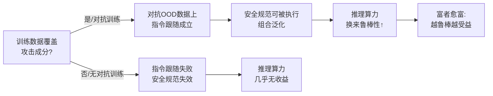

# Get RICH or Die Scaling: Profitably Trading Inference Compute for Robustness

**会议**: ICLR 2026  
**OpenReview**: [https://openreview.net/forum?id=PLZx2hpauY](https://openreview.net/forum?id=PLZx2hpauY)  
**代码**: 待确认  
**领域**: AI 安全 / 对抗鲁棒性  
**关键词**: 对抗鲁棒性, 推理时计算, 视觉语言模型, 安全规范, 组合泛化, 对抗训练  

## 一句话总结
本文提出 **RICH 假设**（Robustness from Inference Compute Hypothesis）——推理时计算只有在"被攻击数据的成分已被训练数据覆盖"时才能换来鲁棒性，并据此证明：先对 VLM 视觉编码器做轻量对抗微调，就能让扩展推理（CoT / budget forcing）从"几乎无效"变成"显著加固"，呈现"富者愈富"的动态。

## 研究背景与动机
- **领域现状**: 神经网络对对抗攻击天然脆弱，而扩展推理时计算（test-time reasoning）近来被发现能抵御不少文本 jailbreak——Zaremba et al. (2025) 观察到推理长度与抗越狱鲁棒性强相关，给"用算力换安全"带来希望。
- **现有痛点**: 这一红利在更强的攻击（基于梯度的白盒攻击、多模态视觉攻击）面前迅速失效。例如 o1-v 在 Attack-Bard 黑盒攻击下推理拉满仍有 39% 攻击成功率，远未触底到 0%。为什么推理在这里失灵，机制不明。
- **核心矛盾**: 推理时防御依赖模型去满足一条"挫败攻击者"的**安全规范**（security specification，如"忽略 IGNORE 标签内的文本"）。但在对抗 OOD 数据上，模型连基本的指令跟随都做不到——既然读不懂被攻击的输入，再多推理也无从执行安全规范。
- **本文目标**: 给出一个能跨越各种攻击/模型/算力设定都成立的预测性假设，解释"推理何时能换来鲁棒性"，并指出如何更划算地做这笔交易。
- **核心 idea**: **【RICH 假设】** 推理时计算防御的收益，随着"被攻击数据的成分被模型训练数据覆盖的程度"而上升。换言之，只要训练（哪怕轻量对抗微调）让攻击成分更"在分布内"（ID），模型就能借**组合泛化**——通过已知 ID 成分去理解 OOD 数据——在对抗数据上跟随安全规范，从而把推理算力兑换成鲁棒性。

## 方法详解

### 整体框架
本文不是提出新模型，而是提出并系统验证一个**假设 + 验证协议**。核心逻辑链是：初始鲁棒性 → 在对抗 OOD 数据上的指令跟随能力 → 安全规范的可执行性 → 推理时计算的鲁棒性收益。为此作者取一组初始鲁棒性梯度不同的 LLaVA 系 VLM（低/中/高），在三类逐渐增强的攻击协议（隐式规范黑盒、显式规范白盒、预填充消融）下，分别检验"加规范""扩算力""缩攻击预算""先加固编码器"四种干预对鲁棒性的影响。

### 关键设计

**1. RICH 假设与"富者愈富"动态：把推理收益归因到训练分布**。本文最核心的贡献是一个可证伪的命题——推理时计算只在攻击数据成分接近训练数据时才有效。它直接预测一个 rich-get-richer 效应：初始鲁棒性越高的模型，从扩展推理中获得的**额外**鲁棒性越多，而非简单地保持原有差距。验证用的三档模型构成清晰的对照梯度：LLaVA-v1.5（零对抗训练，几乎无鲁棒）、FARE-LLaVA-v1.5（仅对 CLIP 视觉编码器做 $\epsilon=2/255$ 的无监督对抗微调，中等）、Delta2-LLaVA-v1.5（web 级对抗对比预训练 + 对抗视觉指令微调，$\epsilon=8/255$，高鲁棒）。在 $\ell_\infty=4/255$ 下三者平均干净精度分别为 1.0 / 20.1 / 61.5，鲁棒性梯度天然成立。

**2. 安全规范的"必要非充分"检验（含预填充消融）**：证明规范本身不创造鲁棒性。作者用 $\epsilon=16/255$ 的 PGD 视觉提示注入攻击，对比"加/不加显式安全规范"的攻击者损失（损失越高越鲁棒）。关键巧思是**预填充模型回复**——只要模型在攻击者目标串之前停止生成，安全规范就算被满足；因此规范能否生效完全取决于模型是否真的把低概率赋给目标串，而非表面上摆出符合规范的 token。结果（Table 2）极具说服力：非鲁棒 LLaVA 加规范后鲁棒性反而下降（attacker loss 6.4→2.9），高鲁棒 Delta2 加规范后 attacker loss 从 13.5 飙到 21.2。这说明"提供规范 + 摆出符合规范的 token"本身不影响攻击成功率，必须指令跟随能泛化到 OOD 数据，规范才有意义。

**3. 朴素扩算力（K 重复）验证 rich-get-richer**：在不依赖 RL 推理模型的前提下放大推理。为在非推理模型族上"扩展推理算力"，作者把与攻击目标冲突的安全规范片段在 prompt 中重复 $K$ 次（$K=0,1,3,5$），用 PGD（$\epsilon=64/255$，step 0.1，100 步）攻击，记录攻击成功所需步数。RICH 预测：base 越鲁棒，PGD-steps-vs-$K$ 曲线斜率越大。结果正是如此——只有 Delta2 在大预算下随 $K$ 显著变难攻，FARE/LLaVA 几乎不动；增大算力对攻击者损失的影响只在初始鲁棒模型上才显现。

**4. 缩小攻击预算 $\epsilon$ 解锁弱鲁棒模型**：直接操纵"攻击成分到训练分布的距离"。RICH 的推论是——把 $\epsilon$ 从 $64/255$ 降到 $16/255$，让被攻击数据更靠近干净训练分布，弱鲁棒模型也能享受扩算力的红利。Table 3 验证：FARE 在 $\epsilon=16/255$ 下攻击所需步数随 $K$ 从 18.8→27.2 显著上升，但在 $\epsilon=64/255$ 下几乎不变（6.7→9.2）。这把"是否受益"的开关明确归因于数据分布距离，而非某个特定强鲁棒模型。

**5. 先加固再扩推理：造出首个对抗鲁棒的 RL 推理 VLM**。回到出发点的 Attack-Bard 黑盒设定，作者对 InternVL 3.5 gpt-oss 20B 的 ViT 做轻量无监督对抗微调（Schlarmann et al. 2024），再用 budget forcing 把推理扩到数千 token。结果（Figure 1）：原模型扩推理几乎不涨鲁棒性，加固 ViT 后扩到 2048 token 带来 +4.5% 对抗精度——而且加固模型的长推理会反复 28 次提到象鼻甲的标志性"长喙"，原模型只提 4 次、还自我否定后答错。这同时印证了"先少量训练投资、再用推理收高额回报"的盈利交易，并产出首个对抗鲁棒的 RL 调优推理 VLM。

## 实验关键数据

### 主实验：安全规范的鲁棒性收益（PGD 攻击者损失，越高越鲁棒，$\epsilon=16/255$）

| 模型 | 基础鲁棒性 | 加安全规范 | Step 100 损失↑ | Step 300 损失↑ | 规范带来的收益 |
|------|-----------|-----------|----------------|----------------|----------------|
| LLaVA | 低 | 否 | 6.4 | 2.0 | — |
| LLaVA | 低 | 是 | 2.9 | 攻击成功 | 负向 |
| FARE | 中 | 否 | 7.5 | 7.0 | — |
| FARE | 中 | 是 | 9.3 | 7.2 | 中性 |
| Delta2 | 高 | 否 | 13.5 | 12.4 | — |
| Delta2 | 高 | 是 | 21.2 | 21.1 | 正向 |

### 消融：攻击成功所需 PGD 步数（越多越鲁棒，"–"=100 步内未攻破）

| 模型 | $\epsilon{=}16/255$ K=0 | K=3 | K=5 | $\epsilon{=}64/255$ K=0 | K=3 | K=5 |
|------|-----|-----|-----|-----|-----|-----|
| LLaVA-v1.5 | 5.7 | 7.6 | 7.0 | 6.2 | 7.6 | 7.4 |
| FARE-LLaVA-v1.5 | 18.8 | 26.5 | 27.2 | 6.7 | 9.3 | 9.2 |
| Delta2-LLaVA-v1.5 | – | – | – | 25.4 | 57.5 | 63.2 |

### Attack-Bard CoT 分类精度（黑盒迁移攻击，30 选 1）

| 模型 | 干净 No CoT | 干净 CoT | 对抗 No CoT | 对抗 CoT | 对抗显著收益 |
|------|-----------|---------|------------|---------|-------------|
| LLaVA-v1.5 | 69.5 | 82.0 | 38.0 | 44.5 | 否 (p=4.2e-2) |
| FARE-LLaVA-v1.5 | 61.5 | 71.0 | 56.0 | 65.5 | 是 (p=4.6e-3) |
| Delta2-LLaVA-v1.5 | 62.0 | 72.5 | 62.0 | 73.0 | 是 (p=4.5e-3) |

### 关键发现
- **规范不创造鲁棒性**：非鲁棒模型即便预填充满足规范的 token，攻击成功率与无规范无异；规范的红利完全取决于对抗训练量。
- **富者愈富**：扩推理算力只对初始已鲁棒的模型显著加固，且越鲁棒收益越大（Delta2 在 $\epsilon=64/255$ 下攻击步数从 25.4 翻到 63.2）。
- **预算可解锁弱模型**：缩小 $\epsilon$ 让攻击成分靠近训练分布，连零对抗训练的 LLaVA 也能从扩算力获益。
- **大模型规模不是关键**：Llama-3.2-Vision-90B、Qwen-2.5-VL-72B 在对抗数据上的 CoT 收益均不显著，排除"规模解释一切"，凸显鲁棒训练才是开关。
- **干净数据 CoT 收益 ~10%**，每少一档鲁棒化，对抗数据上的 CoT 收益约掉 5%；鲁棒模型则能完整保留这 10%。

## 亮点与洞察
- **一个假设串起一堆零散现象**：RICH 把"推理为何对文本 jailbreak 有效却对视觉攻击失效""为何强鲁棒模型受益更多""为何缩 $\epsilon$ 能救弱模型"统一在一句话里，并给出可证伪预测，理论简洁度很高。
- **预填充消融堪称神来之笔**：通过预填充让"表面满足规范"与"真正满足规范"分离，干净地证伪了"规范=鲁棒性"的朴素直觉，把因果定位到指令跟随的 OOD 泛化。
- **"训练投资 → 推理回报"的经济学叙事**：把对抗微调当成一次小额前期投资，把扩推理当成高回报的运营支出，Figure 1 的 $/$$$ 隐喻让"先加固再扩算力"的实践建议非常直观。
- **顺手造出首个对抗鲁棒 RL 推理 VLM**：副产品本身具有独立价值，弥补了"鲁棒"与"会推理"难以兼得的空白。

## 局限与展望
- **主要在小 VLM 上验证**：LLaVA 系为主，前沿大模型上的对抗训练/微调成本与收益尚未验证，作者建议未来对 frontier 模型做对抗微调以放大红利。
- **鲁棒性有代价**：对抗训练会损害非对抗 OOD 数据上的常规性能，因此作者明确不主张所有模型都对抗训练，更适合面向安全应用的模型。
- **逆向 scaling 风险**：并行工作指出推理链暴露或模型自主行动时，扩推理反而增加对抗风险（Wu et al. 2025）；本文用"扩 prompt 而非扩生成"以及"少量加固即可大幅提升"来缓解，但未根除。
- **攻击/数据覆盖有限**：主要围绕 PGD 与 Attack-Bard，更广的攻击族（如语义/自适应攻击）与更多任务下 RICH 的普适性仍待补强。

## 相关工作与启发
- **直接对话对象**：Zaremba et al. (2025) 提出"扩推理换鲁棒性"并发现其在视觉攻击上失效——本文正是补上这个"为什么失效/何时有效"的机制解释。
- **对抗训练谱系**：Goodfellow/Madry 的对抗训练、Schlarmann et al. (2024) 的 FARE 无监督嵌入对抗微调、Wang et al. (2025c) 的 Delta2 全栈对抗训练，构成本文三档鲁棒性梯度的来源。
- **组合泛化**：借 Keysers et al. (2019) 的组合泛化解释"用 ID 成分理解 OOD 数据"，是 RICH 的理论支柱。
- **启发**：安全防御应当是 **train-time 与 test-time 的协同**而非二选一——推理时防御"既建立在也依赖于"训练时的数据与防御；轻量对抗微调是性价比极高的"解锁器"。

## 评分
- **新颖性**: ⭐⭐⭐⭐ 提出可证伪、预测性强的 RICH 假设，统一解释推理-鲁棒性关系并指明协同方向，视角新颖。
- **实验充分度**: ⭐⭐⭐⭐ 跨三档鲁棒性、四种干预、黑盒/白盒/大模型多设定交叉验证，预填充与缩预算消融到位；但攻击族与大模型覆盖仍偏窄。
- **写作质量**: ⭐⭐⭐⭐ 逻辑链清晰、每节配"问答式"小结、经济学隐喻生动，可读性强。
- **价值**: ⭐⭐⭐⭐ 给"用算力换安全"划出适用边界，提供"先轻量加固再扩推理"的可操作配方，并产出首个对抗鲁棒 RL 推理 VLM，实践意义明确。

<!-- RELATED:START -->

## 相关论文

- [\[AAAI 2026\] SecMoE: Communication-Efficient Secure MoE Inference via Select-Then-Compute](../../AAAI2026/ai_safety/secmoe_communication-efficient_secure_moe_inference_via_select-then-compute.md)
- [\[ICLR 2026\] Robust Federated Inference](robust_federated_inference.md)
- [\[ICLR 2026\] On the Interaction of Compressibility and Adversarial Robustness](on_the_interaction_of_compressibility_and_adversarial_robustness.md)
- [\[ICLR 2026\] Nasty Adversarial Training: A Probability Sparsity Perspective for Robustness Enhancement](nasty_adversarial_training_a_probability_sparsity_perspective_for_robustness_enh.md)
- [\[ICLR 2026\] Tug-of-War No More: Harmonizing Accuracy and Robustness in Vision-Language Models via Stability-Aware Task Vector Merging](tug-of-war_no_more_harmonizing_accuracy_and_robustness_in_vision-language_models.md)

<!-- RELATED:END -->
