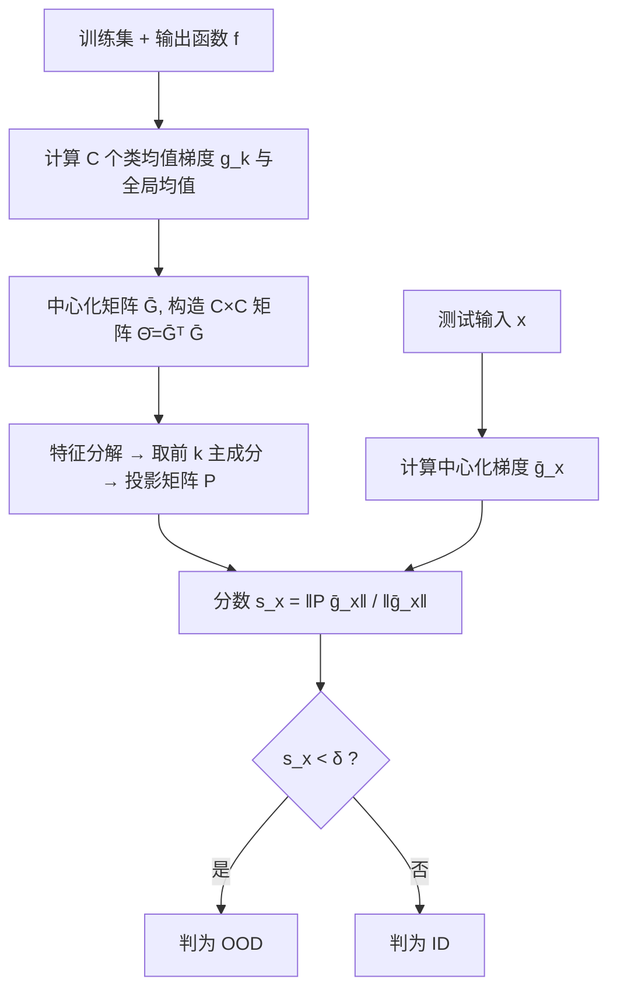

# GradPCA: Leveraging NTK Alignment for Reliable Out-of-Distribution Detection

**会议**: ICLR 2026  
**OpenReview**: [https://openreview.net/forum?id=7rvMexIZA1](https://openreview.net/forum?id=7rvMexIZA1)  
**代码**: 已开源（论文 GitHub 仓库，JAX 实现）  
**领域**: AI 安全 / OOD 检测  
**关键词**: Out-of-Distribution Detection, Neural Tangent Kernel, NTK Alignment, Spectral Methods, PCA, Gradient-based Detection  

## 一句话总结
GradPCA 利用 NTK alignment 导致的网络梯度低秩结构，对「类均值梯度」做 PCA 来刻画 ID 子空间，把梯度落在子空间外的输入判为 OOD，在多个图像分类基准上取得了比现有方法更**一致**（而非偶尔最优）的检测性能，并配上一套谱方法 OOD 检测的理论框架。

## 研究背景与动机

**领域现状**：OOD 检测让模型「知道自己不知道」，是部署到安全攸关场景的前提。现有方法五花八门——基于置信度的 MSP/ODIN/Energy、基于特征几何的 Mahalanobis/KNN、以及近年的梯度类方法。

**现有痛点**：这些方法本身却**不可靠**。同一架构、同一 ID 数据集下，仅仅换个随机种子或数据划分，检测性能就可能剧烈波动；而何时某个方法有效，往往依赖一堆隐含假设，缺乏理论指导，只能靠经验调参。换句话说，「为提高可靠性而设计的 OOD 检测，自己却不可靠」。

**核心矛盾**：纯经验驱动的检测器无法预测在新设置下是否还管用；而想要有原则的设计，又缺少一个能解释「为什么这个特征空间适合谱分析」的理论支撑。

**本文目标**：设计一个**原则性、可解释、跨场景一致**的 OOD 检测器，并给出谱方法 OOD 检测的理论刻画，回答「什么样的特征空间能做有效的谱检测」。

**核心 idea**（**梯度低秩 + NTK alignment**）：well-trained 网络的经验 NTK 会逐渐与任务结构对齐（NTK alignment），表现为近似块对角结构——同类样本梯度高度相关、跨类弱相关。其后果是 ID 样本的梯度集中在由类方向张成的**低维子空间**（秩约等于类数 C）。把 PCA 搬到梯度空间，让落在该子空间之外的输入暴露为 OOD，就得到 GradPCA。

## 方法详解

### 整体框架
GradPCA 把「梯度协方差 PCA」这件原理简单但计算上不可行的事变得可行：网络参数量 P 和数据量 N 都太大，直接做 $\hat{S}=FF^\top\in\mathbb{R}^{P\times P}$ 或对偶矩阵 $F^\top F\in\mathbb{R}^{N\times N}$ 的特征分解都无法承受。关键观察是对偶矩阵恰好就是经验 NTK $\hat\Theta=F^\top F$，而 NTK alignment 使它近似分解为一个秩-C 的块结构项加小扰动，于是整个谱只由 C 个**类均值梯度** $g_1,\dots,g_C$ 决定。GradPCA 因此离线阶段只需对一个 $C\times C$ 的小矩阵做特征分解构造投影子空间，在线阶段把测试样本梯度投影进去、用「保留比例」当分数判别。

### 关键设计

**1. 把 PCA 搬到梯度空间，并用 NTK alignment 把它压成 C 维问题**：对偶矩阵 $\hat\Theta=F^\top F$ 正是经验 NTK，在 alignment 下它写成 $\hat\Theta = G^\top G \otimes \mathbf{1}_m\mathbf{1}_m^\top + \xi$，主项秩为 C（远小于 N、P），残差 $\|\xi\|\le\epsilon$。这意味着 $P\times P$ 协方差 $\bar S=\bar G\bar G^\top$ 与小矩阵 $\bar\Theta=\bar G^\top\bar G\in\mathbb{R}^{C\times C}$ 共享非零特征值，于是可以在 C 维空间里做特征分解 $\bar\Theta=V\Sigma V^\top$，再把主成分提升回参数空间 $U_k=\bar G V_k\Sigma_k^{-1/2}$，投影矩阵 $P=U_kU_k^\top$。整个方法不必存储或遍历完整数据集，只需 C 个类均值梯度向量即可逼近梯度协方差的主子空间，计算量大幅下降。

**2. 角度型分数而非重构误差**：在线阶段用主子空间保留的中心化梯度范数比例作为分数 $s(x)=\|P\bar g(x)\|/\|\bar g(x)\|$，ID 样本通常取较大值，落在子空间内。注意这等价于梯度与其投影夹角的余弦 $s(x)=\cos\angle(\bar g(x),P\bar g(x))$——这是有意为之：经典 PCA 检测器用重构误差 $\|\bar g(x)-P\bar g(x)\|$，但已有工作发现「向量与其投影的夹角」比残差的大小对 OOD 更有判别力，因此 GradPCA 直接采用角度度量。判别规则 $D(x)=\mathbb{1}_{[0,\delta)}(s(x))$，分数低于阈值即判 OOD。

**3. 标量化聚合与参数子集的可扩展技巧**：方法形式上针对标量输出函数 $f$，而分类器输出是 $\mathbb{R}^C$ 向量，因此需要聚合——默认取 logits 的最大值 $f(x)=\max_c f^c(x)$ 作为标量输出（另有 GradPCA-Vec 对每个输出头单独计算后再后聚合）。为进一步省算力，梯度只对**参数子集**求（默认取最后隐藏层参数），且不绑定任何特定层；消融显示不同模型的最优参数子集不同，反映了哪些层携带最多 OOD 信息。配合阈值 $\epsilon$（默认 0.99，保留迹的比例）截断谱，以及顺序计算类均值，使其可扩展到 ImageNet。

**4. 谱 OOD 检测的理论框架与逐样本证书**：论文为「为什么谱方法有效」给出理论。充分条件（Thm 4.1）：对任意 $h\in L^2(\mu_{id})$ 与协方差 $S(h)=\mathbb{E}[h(X)h(X)^\top]$，若 $\|Ph(x)\|^2<\|h(x)\|^2$ 则 $x$ 必为 OOD——这是罕见的逐样本、单边 OOD 证书。鲁棒版（Thm 4.2）借 Davis–Kahan 定理刻画当经验协方差以 $\epsilon$ 逼近秩-C 总体协方差时的容错门限 $s_{PCA}(x)<1-\frac{2\epsilon}{\lambda_C-\epsilon}$，正好对应 GradPCA 用类均值低秩代理逼近梯度协方差的情形。必要条件（Thm 4.5）：要让检测器有效，必须 $\mathrm{rank}(S(h))<\dim\{h(x):x\in X\}$，即 OOD 数据的像不能完全落在 ID 像之内。据此对比 logits / 隐藏激活 / 梯度三种特征空间——logits 张成整个 $\mathbb{R}^C$ 无低秩结构；隐藏激活靠 Neural Collapse 才在末层低秩、但对抗样本可在隐层伪装；唯有梯度因 NTK alignment 既低秩又高维，使对齐子空间难以被模仿，谱分离最强。

## 实验关键数据

评测三个 ID 数据集（CIFAR-10、CIFAR-100、ImageNet-1k），每个数据集至少用两个**ID 精度相当但特征质量不同**的模型（一个大规模预训练后微调、一个从头训练），以及 6 个 OOD 基准（SVHN/Places/LSUN-c/LSUN-r/iSUN/Textures 等）。指标为 AUROC↑ 与 FPR95↓。

### 主实验（CIFAR-10，ResNetV2-50 BiT-M 预训练，平均）

| 方法 | 类型 | Avg FPR95 ↓ | Avg AUROC ↑ |
|------|------|-------------|-------------|
| Max logits | 异常型 | 63.96 | 84.21 |
| MSP | 异常型 | 68.98 | 82.13 |
| ODIN | 异常型 | 63.98 | 84.21 |
| Energy | 异常型 | 58.41 | 85.51 |
| DICE | 异常型(稀疏) | 28.30 | 93.20 |
| Mahalanobis | 规律型 | 42.71 | 90.71 |
| **GradPCA** | 规律型(本文) | — | **near-SOTA、6 基准平均最高** |

> 注：CIFAR-10 单表数值为各 OOD 子集平均；GradPCA 的核心卖点在 6 基准聚合（Figure 2）。

### 跨 6 基准聚合（平均 AUROC，方法按平均分排序）

| 方法 | 平均 AUROC ↑ |
|------|--------------|
| **GradPCA** | **95.96**（最高，几乎所有设置都进前三） |
| KNN | 92.85 |
| GAIA-A | 94.01 |
| Energy | 86.04 |
| Max logits | 82.10 |
| ODIN | 90.22 |
| Mahalanobis | 98.95（个别强但波动大） |

### 关键发现
- **一致性是主卖点**：GradPCA 平均 AUROC 最高（95.96），在几乎每个设置都排进前三，波动小；而许多基线（如 Mahalanobis 在 LSUN-r 反而很差）在不同基准上大起大落。论文归因于 NTK alignment 在 well-trained 网络中普遍存在且与强泛化绑定，故可期望跨场景泛化；附录还验证了对随机种子的稳定性。
- **特征质量决定胜负**：规律型方法（GradPCA、KNN、Mahalanobis）在**预训练**通用特征上表现最好；异常型方法（GAIA、ODIN、Energy）在**从头训练**模型上更接近 SOTA——因为通用特征会抹平异常型方法想抓的不规律性。这一被忽视的因素能调和过往工作的矛盾，并给出实用指引：有强预训练特征时选规律型，低质量/从头训练时选异常型。
- **计算成本可接受**：并行化 + 批量评估让 GradPCA 在 CIFAR 上与 MSP/ODIN 等快速 logits 方法相当；代价是 O(C) 向量的内存与一次离线训练阶段。ImageNet 上每秒可处理 100+ 样本。

## 亮点与洞察
- **第一个利用 NTK alignment 做 OOD 检测的方法**：把深度学习理论里「梯度低秩」这个现象，转化成一个落地的检测器，理论动机清晰而非事后凑解释。
- **用「类均值」绕开计算墙**：从 $P\times P$ / $N\times N$ 直接坍缩到 $C\times C$，让梯度空间 PCA 真正可扩展到 ImageNet，是工程上漂亮的一步。
- **逐样本 OOD 证书**：在以经验为主的 OOD 文献里，给出单边、逐样本的理论保证（Thm 4.1/4.2）较为罕见。
- **「特征质量」作为一等公民**：明确把预训练 vs 从头训练区分出来，并据此预测哪类检测器会赢，提供了选型的可操作准则。
- **梯度空间天然抗对抗伪装**：相比隐层激活，梯度维度高、对齐子空间难模仿，从而谱分离更鲁棒——这是一个有说服力的「为什么用梯度」的论证。

## 局限与展望
- **依赖 NTK alignment 成立**：方法的有效性建立在网络 well-trained、alignment 足够强（残差 $\xi$ 小）之上；欠训练或 alignment 弱的模型下保障会退化。
- **标量化聚合的损失**：把向量输出压成标量（取 max logit）是工程妥协，可能丢信息；GradPCA-Vec 等变体试图缓解但带来后聚合的选择问题。
- **需要离线训练阶段 + O(C) 存储**：相比纯前向的 logits 方法，多了一次离线构造与类均值存储成本，类数 C 很大时压力上升。
- **评测局限在图像分类**：实验集中于 CIFAR/ImageNet 视觉分类，是否迁移到 NLP、检测/分割等结构化输出任务尚待验证。

## 相关工作与启发
- **谱 / PCA 类 OOD**：经典 kernel PCA、Revisited PCA（Guan et al. 2023）、Kernel PCA CoRP（Fang et al. 2024）。GradPCA 的贡献是用任务/模型相关的 NTK 作为核，并给出梯度空间高效 PCA 流程。
- **梯度类 OOD**：GAIA、GradOrth、Projected Gradients（Wu et al. 2024）。GradPCA 把梯度的低秩结构与 NTK 理论显式挂钩。
- **理论基础**：NTK alignment（Atanasov et al. 2022; Seleznova et al. 2023）、local elasticity（He & Su 2020）、Neural Collapse（Papyan et al. 2020）、Davis–Kahan 定理。
- **启发**：把「训练动力学的结构性现象（NTK alignment / Neural Collapse）」当作检测器的设计先验，而不是事后解释，是值得推广的范式——既给方法以可解释性，又给「何时该用它」以理论判据。

## 评分
- **新颖性**: ⭐⭐⭐⭐⭐ 首个将 NTK alignment 用于 OOD 检测，把理论现象转成可扩展算法，并配套谱检测理论框架，角度新颖。
- **实验充分度**: ⭐⭐⭐⭐ 覆盖 3 个 ID 数据集、6 个 OOD 基准、预训练/从头训练对照与多种强基线（含梯度类与 PCA 类 SOTA），但局限在图像分类。
- **写作质量**: ⭐⭐⭐⭐ 动机—方法—理论—实验脉络清晰，理论与算法对应紧密；符号偏多、部分理论细节需翻附录。
- **价值**: ⭐⭐⭐⭐⭐ 「一致性」与「特征质量决定选型」两个洞察对实际部署很有指导意义，理论证书也推动了 OOD 检测从经验走向原则。

<!-- RELATED:START -->

## 相关论文

- [\[ICLR 2026\] AP-OOD: Attention Pooling for Out-of-Distribution Detection](ap-ood_attention_pooling_for_out-of-distribution_detection.md)
- [\[CVPR 2025\] Leveraging Perturbation Robustness to Enhance Out-of-Distribution Detection](../../CVPR2025/ai_safety/leveraging_perturbation_robustness_to_enhance_out-of-distribution_detection.md)
- [\[NeurIPS 2025\] Revisiting Logit Distributions for Reliable Out-of-Distribution Detection](../../NeurIPS2025/ai_safety/revisiting_logit_distributions_for_reliable_out-of-distribution_detection.md)
- [\[NeurIPS 2025\] SPROD: Spurious-Aware Prototype Refinement for Reliable Out-of-Distribution Detection](../../NeurIPS2025/ai_safety/spurious-aware_prototype_refinement_for_reliable_out-of-distribution_detection.md)
- [\[ICLR 2026\] Optimal Transport-Induced Samples against Out-of-Distribution Overconfidence](optimal_transport-induced_samples_against_out-of-distribution_overconfidence.md)

<!-- RELATED:END -->
