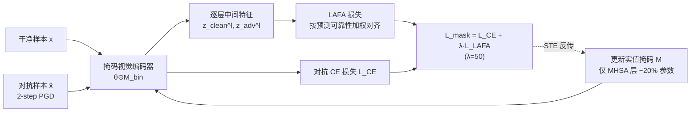

# Identifying Robust Neural Pathways: Few-Shot Adversarial Mask Tuning for Vision-Language Models

**会议**: ICLR 2026  
**OpenReview**: [https://openreview.net/forum?id=kzGkXpW4FT](https://openreview.net/forum?id=kzGkXpW4FT)  
**代码**: [https://github.com/wonjeongchoi/AdvMask](https://github.com/wonjeongchoi/AdvMask)  
**领域**: AI 安全 / 视觉-语言模型对抗鲁棒性  
**关键词**: CLIP, 对抗鲁棒性, 二值掩码, 少样本, 鲁棒神经通路, 特征对齐  

## 一句话总结
本文提出 AdvMask：不改动 CLIP 预训练权重，只在视觉编码器上学一组二值掩码、关掉对对抗扰动敏感的参数，从而"挖出"一条天然抗攻击的鲁棒神经通路，并配合逐层自适应特征对齐损失（LAFA）专攻少样本场景下的对抗鲁棒微调。

## 研究背景与动机
**领域现状**：CLIP 这类视觉-语言模型（VLM）凭借图文联合嵌入空间，在少量样本下就能迁移到各种下游任务，但它们对对抗攻击极其脆弱——zero-shot CLIP 的干净准确率约 61.9%，加上对抗扰动后骤降到约 2.5%，在自动驾驶、医学分析等安全敏感场景里这是致命短板。

**现有痛点**：现有的对抗鲁棒微调主要走两条路，都各有死穴。一是**对抗提示微调**（AdvVP / AdvVLP / FAP 等），只更新少量提示参数，但完全没碰预训练结构里的神经元本身，能学到的鲁棒表征上限有限；二是**直接对抗微调全部权重**，在少样本下极易过拟合，还会破坏预训练 VLM 原本的泛化能力。此外一类面向 zero-shot 鲁棒的方法（如 TGA-ZSR）依赖一个 held-out 数据集做对抗微调，效果高度依赖该数据集质量，且在真实下游任务上常常不够。

**核心矛盾**：少样本（每类只有 1~16 个样本）下，既要学到对抗鲁棒性、又不能过拟合、还得保住预训练泛化能力——监督信号稀缺与鲁棒性需求之间存在根本张力。

**本文目标**：回答"在少样本下游场景里，对预训练 VLM 实现对抗鲁棒最有效的方式是什么"。

**核心 idea**：**鲁棒神经通路（robust neural pathway）**——不修改任何预训练权重，而是在视觉编码器内部搜索一个抗扰动的子网络结构。给定下游任务的少量样本，学一个二值掩码，选择性地"关掉"那些对对抗扰动敏感的参数，让前向传播时自然地强调鲁棒特征。作者论证这样的鲁棒通路确实存在。

## 方法详解

### 整体框架
AdvMask 在冻结的 CLIP 视觉编码器上叠一层可学习二值掩码：给定干净样本和其对抗版本，掩码通过 min-max 对抗训练被优化，使被掩码后的网络对两种输入都产生一致、稳定的中间表征。训练目标由对抗交叉熵损失 $L_{CE}$ 和逐层自适应特征对齐损失 $L_{LAFA}$ 组成，前者保证预测级鲁棒、后者保证表征级鲁棒。

### 关键设计

**1. 鲁棒掩码微调（AdvMask）：用二值掩码挖子网络而非改权重。** 给定图像编码器预训练权重 $\theta$，先定义同尺寸的实值掩码 $M$，再用阈值 $\alpha$ 二值化得到 $M_{bin}=\mathbb{I}[M>\alpha]$，掩码后权重为 Hadamard 积 $\theta'=\theta\odot M_{bin}$。由于二值化不可微，借助直通估计器（STE）让梯度绕过指示函数、直接更新实值掩码 $M\leftarrow M-\gamma\cdot\partial L/\partial M_{bin}$。鲁棒性来自把它写成 min-max 问题：内层用 PGD 生成对抗样本 $\tilde{x}=\arg\max_{|\tilde{x}-x|\le\epsilon}L(f_{\theta\odot M_{bin}}(\tilde{x},t),y)$，外层最小化对抗损失更新掩码 $\min_{M_{bin}}\mathbb{E}_{(x,y)\sim S}[L_{mask}]$。整个过程预训练权重纹丝不动，既保住泛化知识又能在少样本下高效搜出任务相关的鲁棒通路；由于只存二值掩码，参数与显存开销都很低。

**2. 只掩 MHSA 层：把鲁棒性瓶颈定位到自注意力。** 作者没有对所有参数都加掩码，而是只在多头自注意力（MHSA）层上学掩码，这部分约占视觉编码器 20% 的参数。动机是自注意力层通过捕捉图像 patch 间的长程依赖生成上下文表征，恰恰最容易被输入空间的对抗扰动放大；选择性关掉这些层里对噪声敏感的参数因此最有效。消融显示 MHSA-only 在干净（67.34%）和对抗（47.13%）准确率上都优于 MLP-only，且远比掩全部参数省算力。

**3. 逐层自适应特征对齐损失（LAFA）：在中间层灌入稳定监督信号。** 以往的鲁棒目标（如 TeCoA）只在最终输出空间（图文联合嵌入）监督，无法约束中间表征、在数据稀缺时信号也不足；而 AdvMask 改的是编码器内部参数，中间层的鲁棒特征至关重要。LAFA 把每个 transformer 层的对抗特征向对应干净特征对齐，基础形式是 $L=\frac{1}{|\mathcal{L}||B|}\sum_{l}\sum_{x}\|z_{clean}^{(l)}-z_{adv}^{(l)}\|_2^2$，直觉是对抗扰动会逐层放大，关掉脆弱参数能抑制这种传播。进一步加入**基于预测可靠性的自适应加权**：如果模型连干净样本都预测错，其特征就是噪声对齐目标，在少样本下尤其有害，故按真值类置信度加权 $L_{LAFA}=\frac{1}{|\mathcal{L}||B|}\sum_{l}\sum_{x}\frac{p(y|x)}{\mathbb{E}_B[p(y'|x')]+\epsilon}\|z_{clean}^{(l)}-z_{adv}^{(l)}\|_2^2$，让可靠样本主导对齐、不可靠样本少出力。最终目标 $L_{mask}=L_{CE}(\tilde{x},y)+\lambda\cdot L_{LAFA}(x,\tilde{x},y)$（$\lambda=50$）把预测级与表征级鲁棒互补地结合起来。

## 实验关键数据

**设置**：CLIP ViT-B/32，仅微调约 20% 的 MHSA 掩码参数；训练用 2-step PGD（$\epsilon=\alpha=1/255$，$l_\infty$），测试用 100-step PGD；11 个分类数据集，1/2/4/8/16-shot，3 个随机种子平均。

### 主实验（base-to-new 泛化，16-shot，11 数据集均值）

| 方法 | Base Clean | Base Adv | New Clean | New Adv | H |
|------|-----------|----------|-----------|---------|---|
| CLIP | 66.9 | 3.4 | 71.5 | 3.8 | 6.9 |
| AdvVP | 31.7 | 14.4 | 30.4 | 13.4 | 19.2 |
| AdvVLP | 59.0 | 32.4 | 46.9 | 21.6 | 34.6 |
| AdvMaPLe | 60.4 | 30.7 | 46.2 | 20.3 | 33.3 |
| FAP | 70.5 | 38.0 | 49.6 | 21.9 | 37.6 |
| **AdvMask** | 69.5 | **43.6** | **50.2** | **26.1** | **41.9** |

AdvMask 在 base 与 new 类的对抗准确率全面领先（base 43.6 vs FAP 38.0，new 26.1 vs FAP 21.9），调和均值 H 最高。

### zero-shot 鲁棒泛化（TinyImageNet 微调 → 未见下游）

| 方法 | 数据量 | Clean Acc | Adv Acc |
|------|--------|-----------|---------|
| CLIP | – | 61.9 | 2.7 |
| TGA-ZSR | 全量 100% | 38.6 | 22.9 |
| FAP | 16-shot (3.2%) | 36.0 | 16.8 |
| TGA-ZSR | 16-shot (3.2%) | 41.3 | 13.0 |
| **AdvMask** | 16-shot (3.2%) | **42.0** | **19.4** |

仅用 3.2% 源数据，AdvMask 在 16-shot 下逼近需要全量数据的 TGA-ZSR，说明它关掉的是"跨任务普遍脆弱"的参数而非过拟合数据集模式。

### 消融实验

**掩码层选择（16-shot，5 数据集均值）**

| 模块 | Clean Acc | Adv Acc |
|------|-----------|---------|
| MLP only | 65.73 | 45.95 |
| MHSA only | 67.34 | 47.13 |
| MHSA + MLP | 66.01 | 47.20 |

**损失消融（不同 shot）**

| 损失 | 1-shot Clean/Adv | 16-shot Clean/Adv |
|------|------------------|-------------------|
| $L_{CE\text{-}adv}$ | 40.3 / 15.6 | 65.8 / 46.4 |
| + $L_{JS}$ | 42.9 / 17.3 | 65.9 / 46.5 |
| + $L_{KL}$ | 31.8 / 13.8 | 60.7 / 43.6 |
| + $L_{LAFA}$（无自适应） | 44.5 / 17.8 | 66.9 / 46.8 |
| **+ $L_{LAFA}$** | **46.6 / 18.4** | **67.3 / 47.1** |

### 关键发现
- LAFA 的特征级对齐比输出空间的分布散度（JS/KL）信号更稳，且优势在 1-shot 等极低样本时最明显。
- 自适应加权进一步提升性能，在噪声/误分类样本多时尤其有效。
- 干净准确率虽在 1/2/4-shot 时不可避免下降，但在 8/16-shot 时回升，甚至在 Caltech101 上超过原始 CLIP——掩码起到了正则化效果。

## 亮点与洞察
- **换了个视角**：把对抗鲁棒微调从"调提示/调权重"转成"找子网络"，鲁棒性被解释为预训练网络里本就存在的一条"鲁棒神经通路"，这个角度新颖且有可解释性。
- **参数与数据双高效**：只存二值掩码、只动 20% 的 MHSA 参数，少样本下既省算力又省数据，契合医学等真实稀缺场景。
- **掩码可迁移**：仅 16-shot 训出的掩码能 zero-shot 迁到未见数据集，暗示存在一批"跨任务普遍放大对抗噪声"的参数，关掉它们具有普适价值。

## 局限与展望
- 主实验骨干集中在 CLIP ViT-B/32，虽附录给了 ViT-B/16、ViT-L/14 与 VisualBERT，但对更大规模 VLM、生成式 VLM 的适用性仍待验证。
- 对抗评测以 $l_\infty$ PGD 为主，对更强或语义级攻击、跨范数攻击的鲁棒性覆盖有限。
- 极少样本（1~4 shot）下干净准确率仍有明显下降，鲁棒-泛化权衡尚未完全解决。
- 二值掩码"关参数"的机制为何天然抗扰动，文中给的是直觉解释，缺乏更严格的理论刻画。

## 相关工作与启发
本文承接两条线：一是 VLM 对抗鲁棒微调（TeCoA、FAP、AdvVLP、TGA-ZSR 等提示/权重微调路线），二是大模型适配中的"神经通路/子网络"发现（Zheng et al. 2023、彩票假设式的掩码学习）。AdvMask 把后者的子网络思想首次引入对抗鲁棒，启发在于：当数据稀缺时，与其新增参数去"学鲁棒"，不如把预训练模型里已有的鲁棒结构"挑出来"——这一思路对参数高效微调、模型剪枝与安全部署都有借鉴价值。

## 评分
- **新颖性**: ⭐⭐⭐⭐ 首次提出"鲁棒神经通路"并用二值掩码做对抗鲁棒微调，视角清晰、与提示/权重微调形成鲜明对照。
- **实验充分度**: ⭐⭐⭐⭐ 11 数据集、5 种 shot、base-to-new 与 zero-shot 迁移、多骨干多 VLM、掩码层与损失消融都齐备。
- **写作质量**: ⭐⭐⭐⭐ 动机—方法—实验逻辑顺畅，公式与图表清楚，关键设计动机交代到位。
- **价值**: ⭐⭐⭐⭐ 面向安全敏感的少样本部署，参数/数据双高效且掩码可迁移，实用性强。

<!-- RELATED:START -->

## 相关论文

- [\[CVPR 2026\] Hierarchically Robust Zero-shot Vision-language Models](../../CVPR2026/ai_safety/hierarchically_robust_zero-shot_vision-language_models.md)
- [\[ICLR 2026\] Tug-of-War No More: Harmonizing Accuracy and Robustness in Vision-Language Models via Stability-Aware Task Vector Merging](tug-of-war_no_more_harmonizing_accuracy_and_robustness_in_vision-language_models.md)
- [\[CVPR 2026\] TTP: Test-Time Padding for Adversarial Detection and Robust Adaptation on Vision-Language Models](../../CVPR2026/ai_safety/ttp_test-time_padding_for_adversarial_detection_and_robust_adaptation_on_vision-.md)
- [\[ICLR 2026\] Robust Spiking Neural Networks Against Adversarial Attacks](robust_spiking_neural_networks_against_adversarial_attacks.md)
- [\[ICLR 2026\] Robust Fine-Tuning from Non-Robust Pretrained Models: Mitigating Suboptimal Transfer with Epsilon-Scheduling](robust_fine-tuning_from_non-robust_pretrained_models_mitigating_suboptimal_trans.md)

<!-- RELATED:END -->
