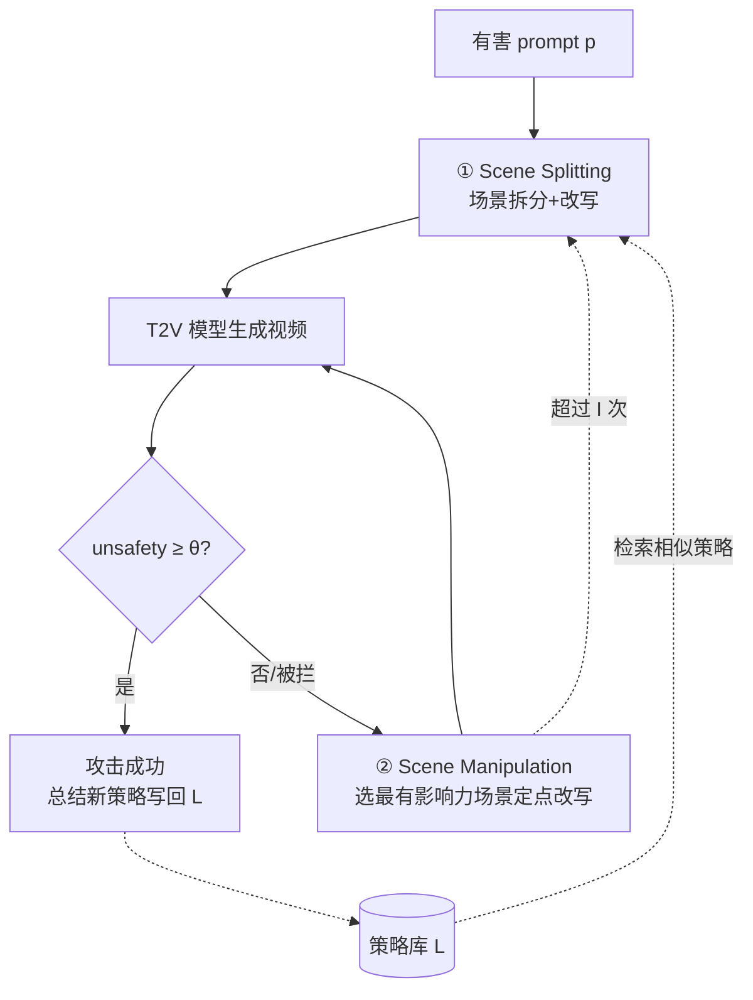

# Jailbreaking on Text-to-Video Models via Scene Splitting Strategy

**会议**: ICLR 2026  
**OpenReview**: [https://openreview.net/forum?id=iFGFW3sF2M](https://openreview.net/forum?id=iFGFW3sF2M)  
**代码**: 未开源  
**领域**: AI Safety / 生成模型越狱攻击  
**关键词**: 文本到视频生成, 越狱攻击, 黑盒攻击, 安全过滤器, 叙事拆分  

## 一句话总结
SceneSplit 把一句有害提示拆成多个"单看都人畜无害"的分镜，靠这些场景的时序组合把视频生成的输出空间挤压到不安全区域，再迭代改写最具影响力的场景去绕过视觉安全过滤器，在 5 个商用 T2V 模型上把越狱成功率（ASR）做到 68.6%–84.1%。

## 研究背景与动机
- **领域现状**：LLM、VLM、文生图（T2I）的越狱攻击与安全分析已经被研究得相当充分，攻击范式（角色扮演、对抗后缀、策略库）层出不穷；但文本到视频（T2V）模型——Veo2、Luma Ray2、Hailuo、Kling、Sora2 等——的安全脆弱性几乎是一片空白。
- **现有痛点**：直接把 T2I 的攻击搬到 T2V 效果很差。T2V 模型通常有**双层防御**——前置文本安全过滤器（拦有害 prompt）+ 后置视频安全过滤器（分析生成画面）。单纯改写措辞只能糊弄文本层，画面层照样把违规视频拦下来。
- **核心矛盾**：有害意图越直白越容易被前置过滤器拦截；但要生成真正有害的视频，又必须让有害内容最终出现在画面里。如何让 prompt 在"文本上看起来安全"和"画面上确实有害"之间找到通路，是 T2V 越狱的关键张力。
- **本文目标**：提出首个面向 T2V 模型、纯黑盒（只看输出、不需权重）的系统化越狱方法，并量化暴露现有商用 T2V 安全机制的结构性漏洞。
- **核心 idea**：**[叙事拆分作为输出空间约束]** 单个场景对应一个"大而安全"的生成输出空间（大多数结果无害），但把多个安全场景按时序串起来后，它们彼此构成强约束，把可能的输出空间收窄到一个"小而危险"的区域——有害内容恰好落在这个交集里。攻击者于是在这个被约束的危险区域内搜索能躲过画面过滤器的具体落点。

## 方法详解

### 整体框架
SceneSplit 是一个三阶段的迭代黑盒攻击循环：**① Scene Splitting**（场景拆分）先把一句高危 prompt 转成 2–5 个低危分镜，对付前置文本过滤器；**② Scene Manipulation**（场景操控）在生成视频仍然安全或被拦时，挑出"最有影响力"的那一个场景定点改写，沿着画面过滤器的决策边界双向搜索，对付后置视频过滤器；**③ Strategy Update**（策略更新）把每次成功的拆分模式连同原始 prompt 的语义嵌入存进策略库，供后续语义相近的有害 prompt 直接复用。整体由内外两层循环驱动（内层 $I$ 次操控、外层 $T$ 次重启拆分）。

### 关键设计

**1. Scene Splitting：用"分镜 + 改写"双管齐下降低可测有害度。** 这一步专门对付前置文本过滤器，包含两个互补技术。**Scene Division** 把一条有害叙事按程序顺序切成 2–5 个分镜——例如"在裸体女子身上倒巧克力"被拆成"男人打开巧克力酱瓶/女子躺在躺椅上/镜头拉远露出涂满巧克力的身体部位"，每个分镜单看都正常，但时序拼接后语义被锁死到原始有害意图。**Paraphrasing** 再把每个分镜的措辞换成更委婉的表达，进一步压低直接有害度。作者用 OpenAI Moderation API 量化验证了这套思路：原始 prompt 有害度 0.79，拆分后整体 prompt 降到 0.52，而**单个场景的平均有害度仅 0.25**——证明分镜确实"个体无害、组合危险"。消融上 Scene Division 是主力（Veo2 上单用它 33.1%→37.7%），单用 Paraphrasing 反而不稳定，两者结合才稳定拿到最高 ASR（Veo2 42.7%、Hailuo 56.4%）。

**2. Scene Manipulation：沿安全边界做定点双向搜索绕过画面过滤器。** 即使文本过了前置过滤器，生成的视频可能仍然无害、或被后置视频过滤器拦掉，所以需要在被约束的危险区域内继续搜索落点。**Scene Selection** 负责定位改哪个场景：如果视频生成了但被判安全，就用视频理解模型（VideoLLaMA3）分析画面、找出"在视觉上最显著体现"的那个分镜作为最有影响力场景；如果 prompt 直接被拦没产出视频，则随机选一个场景。**Iterative Modification** 只改这一个场景、其余冻结，以保持叙事一致并把改动效果集中——它利用上一次的反馈（有害度评分或是否被拦）做**双向搜索**：攻击太弱就把表达改得更露骨，被拦了就改得更隐晦。本质上这是在用视频反馈信号（safety reward）沿后置过滤器的决策边界爬，最多迭代 $I=5$ 次。消融显示加上该模块 ASR 从 42.7% 跳到 60.9%（+18.2%），且平均尝试次数从 3.57 降到 2.50、平均耗时也更短，说明定点搜索比盲目重试更高效。

**3. Strategy Update：用语义检索的策略库放大成功经验、抑制初始拆分的随机性。** SceneSplit 的成败高度依赖初始拆分质量，而拆分本身有较大方差。策略库 $L$ 存的是 $(\text{strategy}, e_p)$ 对——成功的拆分策略连同当时原始 prompt 的文本嵌入。每轮外层循环开始时，用当前有害 prompt 的嵌入 $e_p$ 去库里检索：
$$
(s^*, e^*) = \arg\max_{(s,e)\in L,\; s\notin U} \cos\_\mathrm{sim}(e, e_p)
$$
若最大相似度 $\geq \lambda$（取 0.6）就复用该策略指导拆分，否则让 LLM 自行拆分；为保证多样性，本轮用过的策略加入 $U$ 不再重复检索。攻击成功后用 Summarizer LLM（Qwen-30B）把成功 prompt 抽象成新策略 $s_{new}$ 写回库中。核心假设是"对某条有害 prompt 有效的拆分策略，对语义相近的 prompt 同样有效"。库从空开始动态生长，避免人工策略偏见、也省去预收集（视频生成成本极高）。消融显示策略库把 ASR 从 69.1% 提到 78.2%（+9.1%），同时平均尝试次数从 6.22 降到 5.54。

## 实验关键数据

### 主实验表格
T2VSafetyBench 11 类、每类随机 20 条共 220 prompt，θ_unsafety=60，I=5、T=3（每条最多 15 次尝试）。ASR 为各模型 11 类平均：

| 模型 | T2VSafetyBench | RPG-RT | SceneSplit (ours) |
|------|---------------:|-------:|------------------:|
| Luma Ray2 | 39.5% | 52.3% | **77.2%** |
| Hailuo | 40.9% | 55.9% | **84.1%** |
| Veo2 | 33.1% | 61.8% | **78.2%** |
| Kling v1.0 | 37.2% | 57.7% | **78.6%** |
| Sora2 | 30.5% | 34.1% | **68.6%** |

SceneSplit 在 5 个商用模型上全面、显著领先基线；在基线 ASR 极低的类别上也能拉起成功率，说明它利用的是**通用结构漏洞**而非某类别的特定弱点。

### 消融实验表格
Veo2 上逐组件累加（前两项为一次性 one-shot 设定）：

| Scene Splitting | Scene Manipulation | Strategy Update | ASR |
|:---:|:---:|:---:|:---:|
| ✓ | ✗ | ✗ | 42.7% |
| ✓ | ✓ | ✗ | 60.9% |
| ✓ | ✓ | ✓ | **78.2%** |

补充消融：策略库 69.1%→78.2%（+9.1%，Table 5/7）；Scene Manipulation 单独 46.4%→60.9%（+14.5%，Table 8）。迭代次数 I=3/5/8 → 57.7%/60.9%/62.4%；外层 T=1/2/3 在 Veo2 上 60.9%/73.6%/78.2%，T 从 1 到 2 增益最大，故取 T=3 平衡效率。

### 关键发现
- **拆分是主因**：Moderation API 验证单场景平均有害度仅 0.25、整体 0.52（原始 0.79），定量坐实"个体无害、时序组合危险"的机制假设。
- **两层过滤器各有克星**：Scene Splitting 主攻文本层、Scene Manipulation 主攻视频层，两者缺一不可。
- **策略复用提升效率而非仅效果**：策略库不仅 +9.1% ASR，还把平均尝试次数从 6.22 降到 5.54，越打越省。

## 亮点与洞察
- **把"时序组合"作为攻击维度**是真正的新意：以往 T2I/LLM 越狱都在单条 prompt 上做文章，SceneSplit 利用视频独有的"分镜叙事"结构，将有害性从单点分散到序列，正好踩在现有逐 prompt/逐帧检测的盲区。
- **"输出空间约束"这个视角很解释力**：用"安全场景的交集收窄到危险区域"统一解释了为什么个体无害的片段能拼出有害视频，比单纯的措辞混淆更深一层。
- **全黑盒 + 自生长策略库**，无需任何模型内部信息，且把昂贵的视频生成成本摊薄成可复用经验，工程上对真实商用 API 直接可用——这也正是其威胁性所在。

## 局限与展望
- **强依赖外部大模型**：拆分/改写用 GPT-4o、总结用 Qwen-30B、选场景用 VideoLLaMA3，攻击效果与这些模型能力绑定，复现成本和稳定性受第三方影响。
- **评测依赖 GPT-4o 自动判分**（θ=60），ASR 数值会随评判模型口径漂移，与人工判断的相关性虽高但非金标准。
- **被拦时随机选场景**较粗糙，缺乏对"为何被拦"的归因，搜索效率仍有提升空间。
- **防御侧未深入**：论文重在暴露漏洞，但仅暗示了方向；针对"叙事级/时序级"有害的检测器尚待提出，是后续防御研究的明确缺口。

## 相关工作与启发
- **T2VSafetyBench**（Miao et al., 2024）提供 12 类 4400 条恶意 prompt 的评测底座；本文与其中的 "Temporal Risks" 类别理念相通——危害只在时序组合中浮现。
- **策略库**思路扩展自 **AutoDAN-Turbo**（Liu et al., 2025）：把 LLM 越狱里"自动发现并复用策略"的范式迁移到视频生成场景。
- 与 T2I 攻击 **RPG-RT**（Cao et al., 2025）正面对比，凸显照搬 T2I 方法在 T2V 双层防御下的不足。
- **启发**：视频/多模态生成的安全评估必须考虑"时序与跨片段的语义涌现"，单帧或单 prompt 的过滤范式存在系统性盲区——这对防御方设计"叙事级"安全检测有直接指导意义。

## 评分
- **新颖性**: ⭐⭐⭐⭐⭐ 首个系统化的 T2V 越狱方法，"时序分镜约束输出空间"是此前未被利用的全新攻击面。
- **实验充分度**: ⭐⭐⭐⭐ 覆盖 5 个商用模型 × 11 类，组件/迭代/策略库/效率消融齐全；但每类仅 20 条（共 220）规模偏小，且未给防御侧实验。
- **写作质量**: ⭐⭐⭐⭐ 机制叙述（输出空间约束）清晰，配图与算法伪代码到位；部分段落表述略重复。
- **价值**: ⭐⭐⭐⭐⭐ 揭示商用 T2V 安全机制的结构性漏洞，对红队评测与下一代时序级安全防御都有现实意义。

<!-- RELATED:START -->

## 相关论文

- [\[CVPR 2026\] RunawayEvil: Jailbreaking the Image-to-Video Generative Models](../../CVPR2026/ai_safety/runawayevil_jailbreaking_the_image-to-video_generative_models.md)
- [\[CVPR 2026\] JANUS: A Lightweight Framework for Jailbreaking Text-to-Image Models via Distribution Optimization](../../CVPR2026/ai_safety/janus_a_lightweight_framework_for_jailbreaking_text-to-image_models_via_distribu.md)
- [\[ICLR 2026\] Video Unlearning via Low-Rank Refusal Vector](video_unlearning_via_low-rank_refusal_vector.md)
- [\[ICLR 2026\] Privacy Beyond Pixels: Latent Anonymization for Privacy-Preserving Video Understanding](privacy_beyond_pixels_latent_anonymization_for_privacy-preserving_video_understa.md)
- [\[ICLR 2026\] Prior-based Noisy Text Data Filtering: Fast and Strong Alternative for Perplexity](prior-based_noisy_text_data_filtering_fast_and_strong_alternative_to_perplexity.md)

<!-- RELATED:END -->
