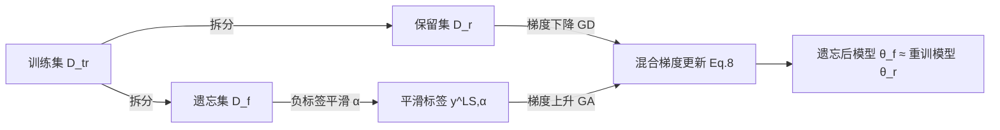

# Label Smoothing Improves Machine Unlearning

**会议**: ICLR 2026  
**OpenReview**: [https://openreview.net/forum?id=X74KnsoYEM](https://openreview.net/forum?id=X74KnsoYEM)  
**代码**: [https://github.com/UCSC-REAL/Label-Smoothing-Unlearn](https://github.com/UCSC-REAL/Label-Smoothing-Unlearn)  
**领域**: AI Safety / 隐私 / 机器遗忘  
**关键词**: 机器遗忘, 标签平滑, 梯度上升, 负标签平滑, 局部差分隐私  

## 一句话总结
本文把"负标签平滑"嫁接到梯度上升的机器遗忘里，提出即插即用的 UGradSL：在被遗忘数据上做带负平滑标签的梯度上升、在保留数据上做梯度下降，几乎不增加计算量就显著缩小了与"重训模型"的性能差距，并附带理论证明它能改善标签级局部差分隐私。

## 研究背景与动机
- **领域现状**：机器遗忘（Machine Unlearning, MU）要求把已训练好的模型中某批数据的"记忆"抹掉，以满足隐私法规（如 GDPR 的被遗忘权）。最干净的做法是去掉这批数据后从头重训（Retrain），但对大模型计算代价高得无法接受，所以主流转向近似遗忘，在遗忘效果和计算成本之间折中。
- **现有痛点**：梯度上升（Gradient Ascent, GA）是把"训练的反过程"直接拿来用的最自然思路——既然学习是梯度下降，那遗忘就反向爬升。但模型训练收敛后，被良好记忆的数据损失已接近 0、梯度趋近于 0，GA 几乎推不动参数，遗忘力度有限；而其它近似方法（影响函数、稀疏化、随机标签等）要么计算重、要么遗忘不彻底、要么伤到保留集精度。
- **核心矛盾**："想又快又好地遗忘"和"GA 在收敛点动力枯竭"之间的矛盾：缺一个低成本、能持续给遗忘提供有效梯度方向的插件。
- **本文目标**：设计一个即插即用、几乎不增加计算的模块，让基于梯度的遗忘（GA/FT）既显著逼近重训模型，又不掉保留集与测试集精度。
- **核心 idea**：**【逆向标签平滑】** 标签平滑（LS）在正向训练里能提升泛化、降低模型置信度；本文反其道而行——在 GA 里用"负标签平滑"（NLS），等价于让模型在遗忘集上以同样低的置信度给出错误预测，从而快速把模型推向"对遗忘数据失忆"的状态，逼近重训模型。

## 方法详解

### 整体框架
当收到遗忘请求时，把训练集 $D_{tr}$ 拆成待遗忘集 $D_f$ 与保留集 $D_r$。对 $D_f$ 中每个样本 $z_f=\{x,y\}$ 先做（负）标签平滑得到平滑标签 $y^{LS,\alpha}$，再用"梯度混合"的方式更新模型：在 $D_r$ 上做梯度下降（保住已学知识），在带平滑标签的 $D_f$ 上做梯度上升（抹掉记忆）。平滑率 $\alpha$ 既可预先固定，也可按样本自适应。整套流程不需要计算 Hessian（Hessian 仅出现在理论证明里），因此额外开销极小。

### 关键设计

**1. 负标签平滑作为遗忘正则：把"反训练"的失效补回来** 作者先把 GA 用影响函数和泰勒展开写成 $\theta_r^* - \theta_f^* = \Delta\theta_r - \Delta\theta_f$，并证明（Theorem 1）只有当学习方向 $\Delta\theta_r$ 与反学习方向 $\Delta\theta_f$ 恰好相等时 GA 才能精确遗忘——这在实践里几乎不可能成立，所以 GA 不总是有效。负标签平滑正是补这块缺口：在广义标签平滑（GLS）框架下，平滑标签 $y^{GLS,\alpha} = (1-\alpha)\,y + \frac{\alpha}{K}\mathbf{1}$，当 $\alpha<0$ 即 NLS。代入交叉熵后损失多出一项 $\frac{\alpha}{K}\sum_{y'\neq y}\ell(h_\theta,(x,y'))$，它驱使模型对遗忘样本以同样低的置信度做出错误预测。展开后遗忘误差变为 $\theta_r^*-\theta_{f,LS}^* \approx \Delta\theta_r-\Delta\theta_f + \frac{1-K}{K}\alpha\,(\Delta\theta_n-\Delta\theta_f)$，其中 $\Delta\theta_n$ 捕捉平滑后非目标标签的梯度影响。Theorem 2 进一步证明：只要 $\langle\Delta\theta_r-\Delta\theta_f,\ \Delta\theta_n-\Delta\theta_f\rangle\le 0$，就存在某个 $\alpha<0$ 让 NLS 把遗忘后参数推得更靠近重训模型，即 $\|\theta_r^*-\theta_{f,NLS}^*\| < \|\theta_r^*-\theta_f^*\|$。一个漂亮的等价关系是：GA 配 NLS 中那个平滑项的梯度，恰好等同于在标准（正）LS 下做梯度下降——所以"逆向平滑"本质上把正向 LS 的泛化收益翻译成了遗忘收益。

**2. 梯度混合更新：一边遗忘一边守住保留集** 直接对 $D_f$ 狂做 GA 会连带破坏 $D_r$ 上的知识。本文用一个加权混合损失把两股力量拧在一起：

$$L(h_\theta, B_f^{NLS,\alpha}, B_r, p) = p\cdot\sum_{z_r\in B_r}\ell(h_\theta,z_r) - (1-p)\cdot\sum_{z_i^{f,NLS,\alpha_i}\in B_f^{NLS,\alpha}}\ell(h_\theta, z_i^{f,NLS,\alpha_i})$$

其中 $p\in[0,1]$ 平衡梯度下降与上升，减号即代表对遗忘批做 GA。由于通常 $|D_r|>|D_f|$，$D_r$ 跑一轮时 $D_f$ 会被多次迭代。基于这个混合损失派生出两个变体：UGradSL 以 GA 为骨架、以 $D_f$ 的收敛为停止准则；UGradSL+ 以 Fine-Tune 为骨架、以 $D_r$ 的收敛为准则——后者结果更全面但开销更大。

**3. 自适应平滑率：按样本"该忘多少"分配 α** 不同遗忘样本的"内在可否认性"不同：若某个 $z_f$ 落在 $D_r$ 的稠密邻域里，它本就容易被混淆、需要的遗忘力度更小，对应的 $\alpha$ 应更小。实现上对每个 $(z_i^r, z_j^f)$ 对计算特征距离 $d(h_\theta(z_i^r), h_\theta(z_j^f))\in[0,1]$，对每个 $z_j^f$ 统计落在阈值 $\beta$ 内的保留样本个数 $c_j^f$，令 $\alpha_j = c_j^f/|B_f|$。当不显式给定 $\alpha$ 时算法自动切到这套自适应版本，省去逐数据集调参。

**4. 与局部差分隐私挂钩：遗忘顺带换来隐私保证** 作者从隐私视角重新解读 NLS：标签平滑降低了某个特定标签的似然，使其更容易"混入"其它候选标签。定义标签级 LDP（Label-LDP）：机制 $M$ 满足 $\epsilon$-Label-LDP 当对任意 $y,y',y_{pred}$ 有 $\frac{P(M(y)=y_{pred})}{P(M(y')=y_{pred})}\le e^\epsilon$。Theorem 3 证明 GA+NLS 在遗忘集上诱导出 $\epsilon=\big|\log(\frac{K}{\alpha}(1-\frac{\gamma_1}{\gamma_2})+1-K)\big|,\ \alpha<0$ 的 Label-LDP：$\alpha$ 越负、隐私越强，当 $\alpha\to(1-\gamma_1/\gamma_2)$ 时 $\epsilon\to0$ 达到最佳——但定理也警示 $\alpha$ 不能无限负，给出了平滑率的安全边界。

## 实验关键数据

### 主实验表格（类遗忘，Avg. Gap 越低越好）

| 方法 | CIFAR-100 Avg.Gap ↓ | CIFAR-100 RTE | ImageNet Avg.Gap ↓ | ImageNet RTE |
|------|------|------|------|------|
| Retrain | — | 26.95 min | — | 26.18 hr |
| GA | 10.36 | 0.06 | 11.43 | 0.01 |
| FT | 43.12 | 1.74 | 23.25 | 2.87 |
| SalUN | 1.02 | 2.15 | 3.87 | 1.95 |
| PABI | 0.83 | 20.09 | — | — |
| **UGradSL** | 11.93 | **0.07** | **2.23** | **0.01** |
| **UGradSL+** | **0.64** | 3.37 | 2.32 | 4.19 |

ImageNet 上 UGradSL 以仅 0.01 小时的运行时间拿到 2.23% 的最优 Avg. Gap，相当于"重训级"质量却几乎零额外成本。

### 消融实验表格（随机遗忘，CIFAR-100 / Tiny-ImageNet）

| 方法 | CIFAR-100 Avg.Gap ↓ | Tiny-ImageNet Avg.Gap ↓ |
|------|------|------|
| GA | 20.64 | 16.39 |
| FT | 18.83 | 11.03 |
| RL | 7.41 | 4.04 |
| SalUN | 12.10 | 5.48 |
| **UGradSL** | 6.95 | 13.82 |
| **UGradSL+** | **3.75** | **3.57** |

把基线从 GA（20.64）换成 UGradSL（6.95）、从 FT 换成 UGradSL+（3.75），插件带来的提升直观可见，验证了"标签平滑作为即插即用增益"的核心主张。

### 关键发现
- **几乎零成本提升 GA**：UGradSL 相对 GA 的 RTE 增量可忽略（如 CIFAR-100 类遗忘 0.06→0.07 min），却把 Avg. Gap 大幅压低，遗忘效率不受损。
- **随机遗忘更难但仍占优**：随机遗忘要同时压低遗忘集精度又守住 RA/TA，得益于梯度混合设计，UGradSL+ 在两个数据集上都拿到最低 Avg. Gap（3.75 / 3.57）。
- **跨模态跨规模鲁棒**：在 CIFAR-10/100、SVHN、CelebA、Tiny-ImageNet、ImageNet、20 Newsgroups 六个数据集、ResNet-18 与 BERT 两类骨干、类遗忘/随机遗忘/组遗忘三种范式下均稳定有效。

## 亮点与洞察
- **把"正向技巧反过来用"的优雅迁移**：标签平滑原本是提升泛化的训练技巧，作者发现它的"逆用"（负平滑）恰好为枯竭的 GA 梯度注入有效的遗忘方向，并用一个等价关系（NLS 平滑项 ≡ 正 LS 下的 GD）把直觉坐实。
- **理论—方法—隐私三线闭环**：从影响函数推 GA 的失效条件（Th.1）、证 NLS 改善遗忘（Th.2）、再连到 Label-LDP（Th.3），不是堆公式而是把"为什么有效"和"附带隐私收益"讲透。
- **真·即插即用**：不需算 Hessian、不改骨干训练流程，对 GA 和 FT 都能挂载，工程落地门槛低。

## 局限与展望
- 理论分析依赖影响函数的一阶泰勒近似与若干内积条件（如 $\langle\cdot,\cdot\rangle\le0$），在深度非凸模型上这些假设何时成立缺乏经验刻画。
- 实验集中在图像分类与文本分类的中小规模任务，对大语言模型这类大规模生成式遗忘场景的可扩展性未验证。
- 平滑率 $\alpha$ 虽给了自适应版本，但 $\alpha$、$p$、距离阈值 $\beta$ 的联合调参与"不能无限负"的安全边界在实践中仍需经验把握。

## 相关工作与启发
- **机器遗忘谱系**：从精确遗忘（Retrain、SISA）到近似遗忘（影响函数 IU、稀疏化 ℓ1-sparse、随机标签 RL、SCRUB、SalUN、边界遗忘 BU 等），本文站在"基于梯度的近似遗忘"分支，用最轻量的标签级改造去补 GA 的短板。
- **标签平滑与噪声标签**：延续 Wei et al. 的广义/负标签平滑视角，把降低置信度的正则化效应从"抗噪/泛化"迁移到"遗忘"。
- **差分隐私**：把遗忘与 Label-LDP 显式挂钩，启发后续工作在设计遗忘算法时同时给出可证明的隐私预算，而非事后用成员推断攻击检验。

## 评分
- **新颖性**: ⭐⭐⭐⭐ —— "负标签平滑逆用于遗忘"的视角新颖且自洽，等价关系与 Label-LDP 的连接是漂亮的洞察。
- **实验充分度**: ⭐⭐⭐⭐ —— 六数据集、两骨干、三遗忘范式、十余个强基线对比充分，但缺大模型/生成式场景。
- **写作质量**: ⭐⭐⭐⭐ —— 理论铺陈清晰、方法与定理对应工整，符号略密但逻辑连贯。
- **价值**: ⭐⭐⭐⭐ —— 即插即用、几乎零成本提升梯度遗忘并附隐私保证，对落地友好，实用价值高。

<!-- RELATED:START -->

## 相关论文

- [\[ICLR 2026\] Decoupling the Class Label and the Target Concept in Machine Unlearning](decoupling_the_class_label_and_the_target_concept_in_machine_unlearning.md)
- [\[ICLR 2026\] ReTrace: Reinforcement Learning-Guided Reconstruction Attacks on Machine Unlearning](retrace_reinforcement_learning-guided_reconstruction_attacks_on_machine_unlearni.md)
- [\[ICLR 2026\] Towards Privacy-Guaranteed Label Unlearning in Vertical Federated Learning: Few-Shot Forgetting without Disclosure](towards_privacy-guaranteed_label_unlearning_in_vertical_federated_learning_few-s.md)
- [\[ICLR 2026\] Machine Unlearning under Retain–Forget Entanglement](machine_unlearning_under_retainforget_entanglement.md)
- [\[ICLR 2026\] Distributional Machine Unlearning via Selective Data Removal](distributional_machine_unlearning_via_selective_data_removal.md)

<!-- RELATED:END -->
