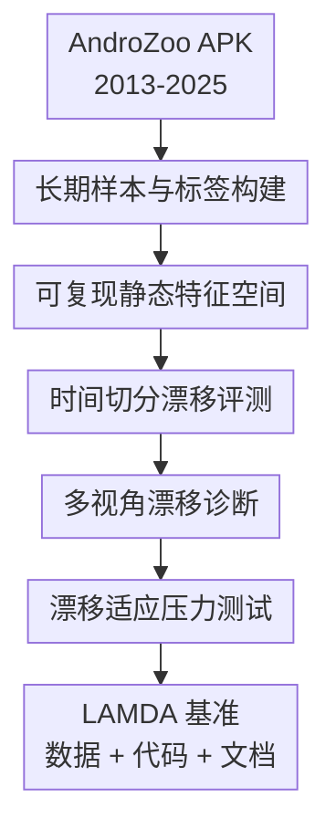

# LAMDA: A Longitudinal Android Malware Benchmark for Concept Drift Analysis

**会议**: ICLR2026  
**OpenReview**: [https://openreview.net/forum?id=1FnCrZtBNQ](https://openreview.net/forum?id=1FnCrZtBNQ)  
**代码**: https://github.com/IQSeC-Lab/LAMDA  
**领域**: AI安全 / Android恶意软件检测  
**关键词**: Android恶意软件, 概念漂移, 安全基准, 静态特征, 长期泛化

## 一句话总结
LAMDA 构建了一个覆盖 2013-2025 年、超过 100 万个 Android APK 的长期恶意软件基准，用 Drebin 静态特征、家族标签和多种时间切分系统揭示现有恶意软件检测器在真实概念漂移下会快速退化。

## 研究背景与动机
**领域现状**：Android 恶意软件检测里，很多机器学习系统仍然沿用静态分析路线：先从 APK 的 manifest 与 smali 代码中抽取权限、组件、API 调用、URL/IP 等特征，再训练 SVM、树模型、神经网络或 Transformer 类分类器区分 benign 与 malware。这个范式的优势是可解释、成本低、易大规模部署，因此 Drebin、TESSERACT、APIGraph 等数据集长期支撑了安全检测研究。

**现有痛点**：真实 Android 生态不是静态的。API 版本会变，开发者习惯会变，恶意软件作者也会主动改写 manifest、替换 API 调用、加入混淆或迁移到新服务来绕过检测。这样一来，训练集里学到的“恶意样本长什么样”会逐年失效。更麻烦的是，许多经典数据集要么时间跨度短，要么样本量小，要么缺少家族层面的长期覆盖，研究者很难判断一个方法是真的抗漂移，还是只是在一个较温和、较旧的数据集上看起来稳定。

**核心矛盾**：恶意软件检测需要评估长期泛化，但长期泛化本身要求数据集同时满足时间连续、样本足够大、恶意家族足够多、标签和特征足够可复现。过去的数据集通常只满足其中一部分：例如 Drebin 可解释但年份早且跨度短，APIGraph 有 API 语义和时间结构但规模与年份有限，Windows 侧的 EMBER、SOREL-20M、BODMAS 又不能直接回答 Android 生态里的家族演化问题。

**本文目标**：LAMDA 的目标不是提出一个新的检测模型，而是补齐“能严肃研究 Android 恶意软件概念漂移”的基准。它需要回答几个具体问题：怎样构建一个跨 12 年的 Android 样本集合；怎样给样本打二分类标签和家族标签；怎样把上百万 APK 转成统一可训练的静态特征；怎样设计时间切分来暴露概念漂移；以及现有监督学习、解释性分析和漂移适应方法在这个更真实的基准上到底会退化到什么程度。

**切入角度**：作者从 AndroZoo 这个长期 APK 仓库出发，重新采样、下载、反编译并抽取 Drebin 风格特征，再用 VirusTotal 和 AVClass2 提供二分类与家族层面的标注。这个角度的价值在于，它把“时间”放在数据集结构的中心：每一年都保留独立训练/测试划分，样本按真实提交时间组织，后续实验就可以直接比较 IID、近未来和远未来上的性能落差。

**核心 idea**：与其再提出一个只在旧基准上调参的检测器，不如先构建一个大规模、长时间、家族丰富且可解释的 Android 恶意软件基准，让概念漂移、解释漂移、标签漂移和漂移适应失败都能被系统地测出来。

## 方法详解

### 整体框架
LAMDA 的“方法”本质上是一条 benchmark 构建与验证流水线：先从 AndroZoo 获取跨年份 APK 和元数据，再用 VirusTotal 与 AVClass2 确定二分类标签和家族标签，随后反编译 APK 抽取 Drebin 静态特征并做统一向量化，最后用时间切分、分布距离、SHAP 解释和漂移适应实验验证这个基准确实比既有数据集更能暴露长期退化。它的输出不只是一个数据文件，而是一套可以复现实验的长期安全评测环境。

### 关键设计
**1. 长期样本与标签构建：让漂移来自真实时间轴而不是人为扰动**

LAMDA 首先把样本采集范围扩展到 2013-2025 年，除 2015 年因为 AndroZoo 中缺少有效 hash 外，其余年份都被纳入。作者每年目标采集 50,000 个 malware 和 50,000 个 benign，并尽量保持月度分布，最终得到 1,008,381 个 APK，其中 638,475 个 benign、369,906 个 malware。这个规模上的关键不是“更大”本身，而是跨年覆盖足够长，使模型可以在 2013-2014 年学到旧生态，再被放到 2016-2025 年的新生态中检验。

二分类标签来自 AndroZoo 中的 VirusTotal 检测计数：`vt_detection = 0` 视作 benign，`vt_detection >= 4` 视作 malware，`vt_detection` 在 1 到 3 之间的样本被丢弃。这个阈值选择延续 Drebin、TESSERACT 等工作的启发式，目的是降低单个杀软误报带来的标签噪声。对 malware，作者还重新拉取 VirusTotal 报告，并用 AVClass2 把杀软厂商的噪声命名规范化成家族标签；因此 LAMDA 不只支持二分类，还能分析 1,380 个 malware family 和 150,604 个 singleton 样本如何随时间演化。

**2. 可复现静态特征空间：用 Drebin 风格特征连接检测、解释与漂移分析**

数据集构建没有停留在 APK 原文件层面，而是把每个 APK 用 apktool 反编译为 manifest 与 smali 表示，再抽取 Drebin 风格静态特征。manifest 侧包括 requested permissions、activities、services、broadcast receivers、hardware components 和 intent filters；smali 侧包括 restricted API calls、suspicious API calls，以及硬编码 URL/IP 等网络指标。这些特征虽然不覆盖运行时行为，但语义较清晰，便于后续用 SHAP 或家族稳定性分数解释模型为什么漂移。

所有样本被转成 bag-of-tokens 二值向量：某个 token 出现则对应特征为 1，否则为 0。原始全局词表接近 969 万维，直接训练和分析都不现实，因此作者只在训练集上构建全局词表并应用 `VarianceThreshold` 降维。主实验使用阈值 0.001，得到 4,561 个最终二值特征；附录还给出 0.01 与 0.0001 两种变体。这样做让不同年份共享同一个特征空间，避免“年份越新特征越多”造成不可比，同时也让研究者能复用同一个阈值对象把未来样本映射到 LAMDA 空间。

**3. 时间切分漂移评测：把 IID、NEAR、FAR 明确分开**

LAMDA 的核心评测不是随机划分，而是 AnoShift 风格的时间切分。作者用 2013-2014 年构成 TRAIN+IID：每年最后一个月作为 IID 测试，其余月份用于训练；2016-2017 年作为 NEAR，2018-2025 年作为 FAR。这个设计使得模型必须面对越来越远的时间间隔，性能下降才可以被解释为时间分布变化，而不是普通随机测试误差。

这种切分非常适合安全场景。现实中检测器往往在旧样本上训练，然后部署到未来样本上；如果一个模型在 IID 上 F1 接近 97%，但在 FAR 上跌到 40%-50%，这说明它学到的是过去年份里的静态相关性，而不是能跨生态变化稳定存在的恶意行为。LAMDA 还用同类切分对比 APIGraph，使结论不是“所有数据集都会漂移”，而是“LAMDA 捕捉到的漂移更强、更不稳定、也更接近长期部署压力”。

**4. 多视角漂移诊断：不只看 F1 下降，还追问下降从哪里来**

作者没有把概念漂移简化成一个最终分数，而是从多个角度诊断漂移。首先，Jeffreys divergence heatmap 衡量不同年份静态特征分布的差异，显示 LAMDA 随时间间隔增大而明显扩散，尤其 2022-2025 与早期年份差异更大。其次，t-SNE 可视化展示样本在低维空间中的结构变化，LAMDA 在 2016-2017 年出现更分散的簇，而 APIGraph 相对紧凑。

家族层面，作者对 top malware families 计算 Jaccard similarity 稳定性分数，并用 OTDD 辅助看同一家族随时间的分布距离。解释层面，作者用 SHAP 的 top features 计算 Jaccard distance 与 Kendall distance，观察模型依赖的特征集合和排序是否随月份变化。标签层面，作者比较 AndroZoo 历史标签与新拉取的 VirusTotal 报告，统计 detection count 增强、削弱、转 benign 和大幅变化的样本。这个组合让 LAMDA 的价值更具体：它不是只告诉你“模型坏了”，还提供线索说明可能是特征分布、家族行为、解释逻辑和标签共识一起在变。

### 损失函数 / 训练策略
LAMDA 本身不是一个新模型，因此没有专属损失函数；训练策略主要体现在标准化评测协议。主监督实验使用 Linear SVM、LightGBM、MLP、XGBoost、detectBERT 和 ViT，均在 LAMDA-baseline 特征上重复 5 个随机种子，并报告 IID、NEAR、FAR 的均值与标准差。LightGBM 使用最多 5000 棵树、学习率 0.02、early stopping；MLP 采用多层全连接网络和 Adam；SVM 使用 LinearSVC 并通过校准器输出概率；XGBoost、detectBERT、ViT 则作为更高容量模型对照。

漂移适应实验采用 Chen et al. 的月度 active learning 框架，并以 50、100、200、400 个标注预算比较 Chen et al.、CADE 和 TRANSCENDENT。这里的训练逻辑是：每个月选择一批样本请求标签，再重训或更新模型以缓解漂移。这个设定很贴近安全运营，但 LAMDA 的结果表明，现有适应方法即使增加标注预算，也无法像在 APIGraph 上那样恢复高 F1。

## 实验关键数据

### 主实验
监督检测结果最直接地说明 LAMDA 的难度：在 IID 上，大多数模型都能达到很高的 F1；到了 NEAR 和 FAR，F1 大幅下降，FNR 急剧上升，而 FPR 相对保持较低。这意味着模型越来越多地把未来恶意样本漏判为 benign，正是安全检测中最危险的退化方式。

| 数据集 | 模型 | IID F1 | NEAR F1 | FAR F1 | 关键现象 |
|--------|------|--------|---------|--------|----------|
| LAMDA | LightGBM | 97.49±0.17 | 59.48±28.20 | 47.24±27.33 | FNR 从 1.74% 升到 64.10%，远期漏报严重 |
| LAMDA | MLP | 97.21±0.12 | 56.57±28.41 | 47.59±25.30 | 神经网络同样随时间退化 |
| LAMDA | SVM | 94.98±1.07 | 52.91±28.40 | 41.86±22.55 | 线性检测器远期泛化最弱之一 |
| LAMDA | XGBoost | 97.05±0.14 | 55.84±29.73 | 42.75±25.86 | 树模型也无法抵消长期漂移 |
| APIGraph | LightGBM | 85.95±0.00 | 66.77±0.00 | 68.20±4.63 | 远期 F1 没有继续显著下滑 |
| APIGraph | ViT | 86.64±0.00 | 72.15±0.00 | 68.47±3.94 | 漂移压力明显弱于 LAMDA |

另一个重要观察是 2017-2018 年的断崖式下降。论文把这个现象与多条证据对上：Jeffreys divergence 在 2016 到 2018 附近升高，家族 feature stability 在同一区间波动更大，SHAP 解释漂移也显示模型决策逻辑变化。也就是说，性能下降不是单一模型偶然失败，而是数据分布、家族行为和解释特征同时变化。

### 消融实验
论文没有传统意义上的“去掉模块 A/B”的模型消融，因为贡献主体是基准；更接近消融的是特征选择阈值与漂移适应预算分析。特征阈值实验展示了更小或更大的特征空间会改变误报/漏报平衡，而漂移适应实验展示了现有 CDA 方法在 LAMDA 上无法通过少量标注预算恢复到 APIGraph 水平。

| 配置 | 关键指标 | 说明 |
|------|----------|------|
| LAMDA baseline, `VarianceThreshold=0.001` | LightGBM FAR F1 47.24±27.33 | 主设置保留 4,561 个静态特征，是论文核心对比基准 |
| LAMDA, `VarianceThreshold=0.01` | SVM NEAR FPR 17.09±2.87 | 激进降维后漏报略有改善，但 benign 被误判为 malware 明显增加 |
| LAMDA, `VarianceThreshold=0.0001` | SVM NEAR F1 51.19±29.64 | 更大特征空间没有根本解决漂移，远期仍不稳定 |
| Chen et al. on LAMDA, budget 400 | F1 43.00±1.60, FPR 89.80±2.10 | 主动学习方法在 APIGraph 上强，但在 LAMDA 上误报极高 |
| CADE on LAMDA, budget 400 | F1 45.40±1.10, FNR 59.20±1.50 | 漂移样本解释/检测方法仍漏掉大量 malware |
| TRANSCENDENT on LAMDA, budget 400 | F1 40.60±1.10, FPR 82.80±1.20 | 选择性预测策略难以适应长期复杂漂移 |

### 关键发现
- LAMDA 的漂移比 APIGraph 更强。APIGraph 上 LightGBM 从 IID 到 FAR 的 F1 约为 85.95% 到 68.20%，而 LAMDA 上从 97.49% 跌到 47.24%，并且标准差显著更大，说明不同远期年份的难度差异也更剧烈。
- 漏报是主要安全风险。LAMDA 上 FAR split 的 FNR 经常达到 60% 左右，意味着旧模型面对新年份恶意软件时会大量放过攻击样本；FPR 相对低，说明模型更倾向于把未来恶意样本看成正常样本。
- 2017-2018 是一个重要漂移区间。性能曲线、Jeffreys divergence、家族稳定性和 SHAP 解释漂移都在这段时间附近给出异常信号，提示 Android 生态或恶意家族行为在该阶段发生明显变化。
- 现有漂移适应方法在 LAMDA 上不够用。即使每月给 400 个标注预算，Chen et al.、CADE、TRANSCENDENT 在 LAMDA 上的 F1 仍只有约 40%-45%，远低于 APIGraph 上约 90% 的水平。

## 亮点与洞察
- LAMDA 最有价值的地方是把“长期时间轴”变成基准的一等公民。很多恶意软件检测论文会声称处理了概念漂移，但如果数据集只有短短几年或家族覆盖不足，这个结论很容易偏乐观；LAMDA 用 12 年和百万级样本把这个问题拉回现实部署。
- 论文把 benchmark 做成了可解释分析平台，而不是只发布一堆样本。Drebin 静态特征、AVClass2 家族标签、SHAP attribution、feature stability、label drift 这些组件拼在一起后，研究者可以追踪模型为什么在某些年份突然失灵。
- “FPR 低但 FNR 高”的现象很值得安全系统借鉴。它说明旧模型在 drift 下不一定表现为乱报，而可能表现为过度相信未来样本是 benign；这比高误报更隐蔽，也更符合攻击者持续演化带来的风险。
- 这篇论文对 AI safety 的启发不局限于 Android。任何部署在对抗环境里的 ML 系统，都会遇到训练分布和攻击分布共同演化的问题；LAMDA 的时间切分、标签漂移分析和解释漂移分析可以迁移到钓鱼检测、垃圾邮件检测、欺诈检测和模型滥用检测等场景。
- 论文也提醒我们，benchmark 的“难”不应该只来自更复杂模型或更大输入，而应来自更真实的评测协议。LAMDA 没有把任务包装成花哨的新架构问题，却能让许多成熟检测器暴露出长期泛化短板。

## 局限与展望
- LAMDA 只使用 Drebin 风格静态特征，没有覆盖动态 sandbox 行为、控制流图、运行时网络行为或更丰富的 threat intelligence。对于高度依赖运行时触发条件的 Android 恶意软件，这会限制基准能捕捉的行为维度。
- 数据集尝试接近 50:50 的 malware/benign 比例，这有利于学习和家族覆盖，但与真实应用生态中的类别比例不完全一致。实际部署中 benign 远多于 malware，阈值选择、校准和误报成本可能需要额外评估。
- 2023-2025 年 malware 样本数明显偏少，尤其 2025 年只有 23 个 malware。虽然这反映了采样和标签可用性的现实限制，但也意味着最晚年份的统计稳定性要谨慎解读。
- 标签仍然依赖 VirusTotal 共识和 AVClass2 规范化。作者已经分析了 label drift，但 VT 引擎的更新、厂商策略变化、家族命名不一致仍可能影响 ground truth；未来可以结合人工分析或多源威胁情报减少标签偏差。
- 后续最自然的扩展是把 LAMDA 做成多模态安全基准：在现有静态 token 之外加入动态行为、控制流执行特征、网络通信和情报 feed，让模型同时面对特征漂移、标签漂移和模态间漂移。

## 相关工作与启发
- **vs Drebin**: Drebin 提供了 Android 静态特征和可解释检测的经典起点，但时间跨度是 2010-2012 年、样本和家族规模有限。LAMDA 继承 Drebin 风格特征，却把样本扩展到 2013-2025 年和百万级规模，使它更适合研究长期漂移。
- **vs TESSERACT**: TESSERACT 强调避免 malware classification 中的时间和空间偏差，指出随机划分会高估性能。LAMDA 延续这个思想，但覆盖年份更长、样本更多，并加入家族演化、解释漂移和标签漂移等更细的诊断。
- **vs APIGraph**: APIGraph 关注 API 语义增强和 evolved Android malware 检测，已有一定时间结构。LAMDA 的优势在于年份覆盖到 2025、样本数超过 100 万、家族和 singleton 更丰富，并且实验显示它比 APIGraph 呈现更强的分布漂移。
- **vs CADE / TRANSCENDENT / Chen et al.**: 这些方法尝试检测或适应概念漂移，过去在较温和基准上表现较好。LAMDA 显示它们面对长期复杂 Android 漂移时仍远远不够，给后续动态学习、半监督更新、continual learning 和 drift-aware calibration 留出了明确研究空间。
- **对安全 ML benchmark 的启发**: 一个好基准不应只问“模型平均准确率是多少”，还应问“训练数据离部署数据隔了几年”“模型错过的是哪些新家族”“重要特征为什么变了”“标签共识是否也在变”。LAMDA 把这些问题系统化，是它比普通数据集更有用的地方。

## 评分
- 新颖性: ⭐⭐⭐⭐☆ 不是新模型创新，但把 Android 恶意软件长期漂移基准做到百万级、家族级和解释级，数据集贡献很扎实。
- 实验充分度: ⭐⭐⭐⭐⭐ 覆盖监督检测、分布距离、t-SNE、家族稳定性、SHAP 解释、标签漂移、漂移适应和 continual learning，验证维度非常完整。
- 写作质量: ⭐⭐⭐⭐☆ 主线清楚、数据表充分，但部分段落和表述略有重复，个别英文排版与语法问题会影响阅读流畅度。
- 价值: ⭐⭐⭐⭐⭐ 对 Android 安全、概念漂移、对抗环境下的 ML 泛化评估都很有用，尤其适合作为未来 drift adaptation 方法的压力测试基准。

<!-- RELATED:START -->

## 相关论文

- [\[ICLR 2026\] DRIFT: Divergent Response in Filtered Transformations for Robust Adversarial Defense](drift_divergent_response_in_filtered_transformations_for_robust_adversarial_defe.md)
- [\[ICLR 2026\] Concept-based Adversarial Attack: a Probabilistic Perspective](concept-based_adversarial_attack_a_probabilistic_perspective.md)
- [\[ICLR 2026\] Convergent Differential Privacy Analysis for General Federated Learning](convergent_differential_privacy_analysis_for_general_federated_learning.md)
- [\[ICLR 2026\] Decoupling the Class Label and the Target Concept in Machine Unlearning](decoupling_the_class_label_and_the_target_concept_in_machine_unlearning.md)
- [\[ICLR 2026\] Concept-Aware Privacy Mechanisms for Defending Embedding Inversion Attacks](concept-aware_privacy_mechanisms_for_defending_embedding_inversion_attacks.md)

<!-- RELATED:END -->
