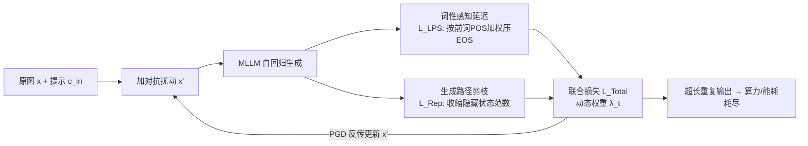

# LingoLoop Attack: Trapping MLLMs via Linguistic Context and State Entrapment into Endless Loops

**会议**: ICLR 2026  
**OpenReview**: [https://openreview.net/forum?id=kxEM2vc7ne](https://openreview.net/forum?id=kxEM2vc7ne)  
**代码**: 待确认  
**领域**: AI 安全 / 能耗-延迟攻击 / 多模态大模型对抗  
**关键词**: energy-latency attack, sponge attack, MLLM, EOS suppression, repetitive generation, DoS  

## 一句话总结
LingoLoop 通过给输入图像加微小对抗扰动，利用「词性先验压制 EOS」和「收缩隐藏状态诱导循环」两步，把多模态大模型逼进无穷重复输出，在放开生成上限时可产生比正常多 367× 的 token，造成算力/能耗耗尽式的拒绝服务。

## 研究背景与动机
**领域现状**：MLLM（如 GPT-4o、Qwen2.5-VL）因算力昂贵普遍以云服务形式按 token 计费部署。这暴露出一类「能耗-延迟攻击」（又称海绵攻击 sponge attack）的风险：攻击者构造对抗输入，诱导模型产生超长输出，从而消耗远超正常的算力与能源，拖慢甚至瘫痪服务（DoS）。

**现有痛点**：此前针对 MLLM 的 SOTA 方法 Verbose Images 通过给图像加扰动来**均匀地**压制所有输出位置的 EOS（结束符）概率，但效果只是「勉强有效」。论文将其低效归因于两点：(1) 不同**词性（POS）**的 token 触发 EOS 的倾向差异巨大——例如标点后接 EOS 的概率远高于形容词、进行时动词，均匀施压把力气浪费在了本来就不会终止的位置上；(2) 忽略了**句子级结构模式**对输出长度的影响，尤其没有显式利用「重复循环」这一能极大膨胀输出的手段。

**核心矛盾**：要让输出尽可能长，既要对抗模型「自然终止」的倾向，又要对抗模型「追求多样、连贯生成」的内在偏好，而均匀施压两头都没抓住。

**本文目标**：在白盒、$\ell_\infty$ 扰动预算 $\|x'-x\|_p \le \epsilon$ 约束下，最大化输出 token 数 $\max_{x'} N_{out}(x')$。

**核心 idea**：**(1) 把语言学先验注入攻击**——按前一个 token 的词性自适应地、有重点地压制 EOS；**(2) 把模型推进表征坍缩态**——主动收缩隐藏状态范数，剥夺生成多样性，逼出稳定的重复循环。

## 方法详解

### 整体框架
LingoLoop 是一个两阶段协同攻击：先用 **POS-Aware Delay Mechanism**（词性感知延迟机制）压住「该结束的地方别结束」，延长生成；再用 **Generative Path Pruning Mechanism**（生成路径剪枝机制）收缩隐藏状态、把模型挤进低方差子空间，诱发「停不下来」的重复循环。两者写成一个带动态权重的联合损失，对图像做 PGD 优化求解对抗扰动。

### 关键设计

**1. POS-Aware Delay Mechanism：让压制力气只花在「真会终止」的位置**
论文先做了一个统计观察：EOS 是否出现与**前一个 token 的词性**强相关（图 3，标点后 EOS 概率远高于形容词/进行时动词）。基于此，先离线在大批 ImageNet/MSCOCO 图像上跑模型，按当前 token 的词性 $t$ 分桶统计「下一步预测 EOS 的平均概率」，构成一个 **Statistical Weight Pool**，存下每个词性的经验先验 $\bar{P}_{EOS}(t)$。攻击时，对第 $i$ 步先取前一 token 的词性 $t_{i-1}=\mathrm{POS}(y_{i-1})$，查表得到先验并经加权函数映射为权重 $w_i = \phi_w(\bar{P}_{EOS}(t_{i-1}); \theta_w)$——先验越高（越容易接 EOS）权重越大。最后定义**语言先验压制损失**，只在这些高风险位置重点压低 EOS 概率：

$$\mathcal{L}_{LPS}(x') = \frac{1}{N_{out}} \sum_{i=1}^{N_{out}} \left( w_i \cdot f^{EOS}_i(x') \right).$$

相比均匀压制，梯度信号被 $w_i$ 自适应缩放，把抑制集中在「语言学上即将结束」的语境，更高效地延后终止。

**2. Generative Path Pruning Mechanism：收缩隐藏状态，把模型挤进重复循环**
仅压 EOS 还不够极端——真正的超长输出靠把模型逼进**重复/循环态**：一旦进入循环，模型会一直吐 token 直到触及外部上限。论文通过批内混合实验验证了机制：一个 batch 里逐步增加诱导循环的对抗样本比例 $M_{adv}$，隐藏状态 L2 范数的**均值和方差同步下降**，而输出长度与重复度同步上升——即「内部多样性被压缩 ↔ 输出更冗长」存在反相关。据此提出 **Repetition Promotion Loss**，直接惩罚各输出 token 在所有 $L$ 层上的平均隐藏状态范数。先定义第 $k$ 个 token 的层平均范数 $\bar{r}_k = \frac{1}{L}\sum_{l=1}^{L}\|h^{(l)}_k(x')\|_2$，再取所有输出 token 的均值并乘正则系数 $\lambda_{rep}$：

$$\mathcal{L}_{Rep}(x') = \frac{\lambda_{rep}}{N_{out}} \sum_{k=1}^{N_{out}} \bar{r}_k.$$

最小化它会压低输出时刻隐藏状态的幅度，把模型轨迹挤进受限子空间，多样性逐步退化，最终形成稳定循环。

**3. 动态加权联合优化：让两个目标随迭代自动调焦**
两个损失合成总目标 $\mathcal{L}_{Total}(x',t) = \alpha \cdot \mathcal{L}_{LPS}(x') + \lambda(t) \cdot \mathcal{L}_{Rep}(x')$，其中 $\alpha$ 为数值稳定缩放。沿用 Verbose Images 的动态加权思路，$\lambda(t)$ 按上一轮两个损失的 $\ell_1$ 量级比并乘时间衰减函数 $T(t)=a\ln(t)+b$：

$$\lambda(t) = \frac{\|\mathcal{L}_{LPS}(x'_{t-1})\|_1}{\|\mathcal{L}_{Rep}(x'_{t-1})\|_1} \cdot T(t).$$

更新时可加动量平滑。这样早期更偏 EOS 压制、后期逐渐转向诱导重复，整个过程用 PGD 迭代 $T$ 步并投影回 $\ell_p$ 球，兼顾收敛速度与攻击强度。

## 实验关键数据

### 主实验（MS-COCO / ImageNet 各 200 图，$\epsilon=8$，max 1024 tokens）

| 模型 | 方法 | Tokens (COCO) | Energy/J | Latency/s |
|------|------|--------------:|---------:|----------:|
| InstructBLIP | None | 86.11 | 428.72 | 4.91 |
| InstructBLIP | Verbose Images | 332.29 | 1241.89 | 17.79 |
| InstructBLIP | **Ours** | **1002.08** | **3152.26** | **57.30** |
| Qwen2.5-VL-3B | None | 66.64 | 430.01 | 2.24 |
| Qwen2.5-VL-3B | Verbose Images | 394.74 | 2682.38 | 13.12 |
| Qwen2.5-VL-3B | **Ours** | **1020.38** | **7090.58** | **32.94** |
| Qwen2.5-VL-7B | **Ours** | **797.55** | **3839.70** | **15.24** |
| InternVL3-8B | **Ours** | **554.41** | **2771.76** | **9.70** |

LingoLoop 在四个模型上均把输出推到接近上限：对 Qwen2.5-VL-3B 达 15.3× 干净输入、2.6× Verbose Images，能耗 14.7×/2.5×。随机噪声基本等同干净输入，确认朴素扰动无效。

### 放开上限实验（Qwen2.5-VL-3B，不同 max_new_tokens）

| max tokens | 方法 | Tokens (COCO) | Energy/J |
|-----------:|------|--------------:|---------:|
| 256 | Verbose Images | 178.97 | 1263.87 |
| 256 | **Ours** | **256.00** | **2069.87** |
| 1024 | Verbose Images | 328.13 | 2353.23 |
| 1024 | **Ours** | **1024.00** | **6926.44** |
| 2048 | Verbose Images | 634.58 | 5088.90 |
| 2048 | **Ours** | **2048.00** | **14386.41** |

无论上限设多高，LingoLoop **总能顶满**生成天花板，而 Verbose Images 始终够不到上限——这正是「循环态」的威力，附录中放开外部限制时可达 367× 干净输入。

### 消融（模块贡献，Qwen2.5-VL-3B，MS-COCO）

| $\mathcal{L}_{LPS}$ | $\mathcal{L}_{Rep}$ | Mom. | Tokens | Energy |
|:---:|:---:|:---:|------:|-------:|
| Uniform | ✗ | ✗ | 843.86 | 5329.82 |
| ✓ | ✗ | ✗ | 926.94 | 6265.61 |
| ✗ | ✓ | ✗ | 561.90 | 3863.13 |
| ✓ | ✓ | ✗ | 963.51 | 6408.13 |
| ✓ | ✓ | ✓ | **1024.00** | **6926.44** |

### 关键发现
- 词性感知压制（POS 加权）明显优于均匀 EOS 压制（926.94 vs 843.86）；$\mathcal{L}_{LPS}$ 与 $\mathcal{L}_{Rep}$ 协同 + 动量才顶满 1024。
- $\lambda_{rep}$ 存在最优值（约 0.5）：太小压制不足、太大过度约束状态空间反而退化为无效短循环。
- 收敛分析显示完整方法约 300 步即逼近上限，去掉任一组件都收敛更慢或更早停滞。

## 亮点与洞察
- **把「语言学结构」引入能耗攻击**：第一次显式利用词性先验来定位「该压哪里的 EOS」，从「均匀施压」升级为「按语境精准施压」，思路新颖且可解释。
- **找到了循环的物理量纲**：揭示「隐藏状态范数收缩 → 表征坍缩 → 重复循环」这一可操作的因果链，并用批内混合实验把它做成可监督的损失，而非靠玄学诱导重复。
- **威胁等级实打实**：能稳定顶满任意 token 上限、放开后 367× 膨胀，直接对应云端按 token 计费的真实经济/可用性损害，安全意义清晰。

## 局限与展望
- **白盒假设**：方法需要完整梯度/架构知识，真实闭源云服务（GPT-4o/Gemini）是黑盒；论文虽在附录给了迁移性实验，但黑盒可用性仍是主要门槛。
- **任务范围窄**：实验集中在图像描述（image captioning）任务与少数 MLLM，是否泛化到 VQA、长文档理解、视频等仍待验证。
- **防御对抗未深究主文**：虽提到对一系列防御有韧性，但面对输出长度截断、重复惩罚解码（repetition penalty）、困惑度过滤等针对性防御的鲁棒性边界仍需更系统评估。
- **可检测性**：极端重复输出本身具有强统计特征，工程上较易用启发式规则拦截，实际危害可能被部署侧缓解。

## 相关工作与启发
- **海绵/能耗-延迟攻击谱系**：从 CNN 的激活稀疏性攻击、Transformer 的 NMTSloth、图像描述的 NICGSlowDown，到 LLM 的 prompt 级 P-DOS，本文是把这条线推进到 MLLM 视觉输入端的代表作，直接 SOTA 对标 Verbose Images。
- **启发**：(1) 用「token 级语言学先验」做攻击/防御的加权信号是一个可复用范式——防御侧同样可以反过来「在高风险词性处加固 EOS」；(2) 隐藏状态范数作为重复/坍缩的可观测指标，对推理时检测异常生成（防御）有借鉴价值；(3) 把「资源耗尽」作为攻击目标，提醒按量计费的 MLLM 服务需要在输出长度、重复度、能耗上加运行时熔断。

## 评分
- 新颖性: ⭐⭐⭐⭐ 首次将词性语言学先验与隐藏状态坍缩两条洞察结合做能耗攻击，机制有新意且可解释。
- 实验充分度: ⭐⭐⭐⭐ 覆盖四个 MLLM、两数据集、多 token 上限、模块/超参/收敛消融齐全，迁移与防御在附录；主文主要限于 captioning。
- 写作质量: ⭐⭐⭐⭐ 动机—观察—机制—损失推导链条清晰，图表支撑充分。
- 价值: ⭐⭐⭐⭐ 暴露了云端 MLLM 真实的可用性/经济性风险，对安全部署与防御研究有直接意义。

<!-- RELATED:START -->

## 相关论文

- [\[ICLR 2026\] Action-Free Offline-to-Online RL via Discretised State Policies](action-free_offline-to-online_rl_via_discretised_state_policies.md)
- [\[ICML 2026\] MLUBench: A Benchmark for Lifelong Unlearning Evaluation in MLLMs](../../ICML2026/ai_safety/mlubench_a_benchmark_for_lifelong_unlearning_evaluation_in_mllms.md)
- [\[CVPR 2025\] Towards General Visual-Linguistic Face Forgery Detection](../../CVPR2025/ai_safety/towards_general_visual-linguistic_face_forgery_detection.md)
- [\[ICML 2026\] Semantic Router: On the Feasibility of Hijacking MLLMs via a Single Adversarial Perturbation](../../ICML2026/ai_safety/semantic_router_on_the_feasibility_of_hijacking_mllms_via_a_single_adversarial_p.md)
- [\[ICML 2026\] Robust In-Context Reinforcement Learning Under Reward Poisoning Attacks](../../ICML2026/ai_safety/robust_in-context_reinforcement_learning_under_reward_poisoning_attacks.md)

<!-- RELATED:END -->
