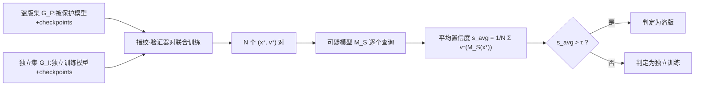

# LiteGuard: Efficient Task-Agnostic Model Fingerprinting with Enhanced Generalization

**会议**: ICLR 2026  
**OpenReview**: [https://openreview.net/forum?id=TFC25ZT9nI](https://openreview.net/forum?id=TFC25ZT9nI)  
**代码**: 待确认  
**领域**: AI 安全 / 模型版权保护 / 任务无关指纹  
**关键词**: 模型指纹, 知识产权保护, 任务无关, 泛化性, 计算效率, 过拟合  

## 一句话总结
LiteGuard 用"训练 checkpoint 扩增模型集 + 每个指纹配一个轻量局部验证器"两招，把任务无关模型指纹的训练模型需求压到极致（每个集合只需 1 个真实训练模型），在五类任务上 AUC 全面超越 SOTA 的 MetaV，同时把训练成本降低 5~10 倍。

## 研究背景与动机
- **领域现状**：模型指纹（model fingerprinting）通过构造能让模型产生独特输出的输入样本，把"输入-输出对"作为指纹来验证 DNN 的所有权，是对抗模型窃取与盗版部署的重要 IP 保护手段。多数方法是**任务相关**的（专攻分类、GNN、GAN），只有 MetaV 是真正**任务无关**的——它端到端联合训练一组指纹和一个基于神经网络的全局验证器（global verifier）。
- **现有痛点**：MetaV 要保证泛化，必须依赖**大而多样的模型集**——一个盗版集（被保护模型及其变体）+ 一个独立训练集。但现实中很多领域公开模型稀缺，从头训练大量模型代价高昂，成为落地的主要障碍。
- **核心矛盾**：缩减模型集数量能省算力，却会**急剧加重过拟合**。MetaV 的"全部指纹 + 全局验证器纠缠联合训练"设计进一步放大了这一问题：指纹数 $N$ 通常很大，全局验证器输入维度随 $N\cdot O$ 线性增长，联合训练的参数量随 $N$ 膨胀，对有限训练模型严重过拟合，导致验证未见模型时泛化崩坏。
- **本文目标**：在**极低算力**（极端情况下每个集合仅 1 个真实训练模型）下，仍获得**增强的泛化能力**。
- **核心 idea**：**【解耦 + 廉价扩增】** 一方面用训练中天然产生的 checkpoint 免费扩增模型多样性，另一方面把"一个全局验证器"拆成"每个指纹各自配一个独立的轻量局部验证器"，从根上削减纠缠参数量、抑制过拟合。

## 方法详解

### 整体框架
LiteGuard 端到端联合学习一组 **指纹-验证器对**（fingerprint-verifier pair），整个流程分三步：**模型集构造**（用 checkpoint 扩增盗版集与独立集）→ **指纹-验证器对联合训练**（每对独立优化）→ **所有权验证**（各对独立打分后求平均，与阈值比较）。

### 关键设计

**1. Checkpoint 模型集扩增：把"训练废料"变成免费的多样性来源。** MetaV 的泛化高度依赖模型集的规模与多样性，而 LiteGuard 注意到训练任何一个模型的过程中都会保存大量中间快照（checkpoint），这些快照反映了从随机到收敛的**多样决策行为**，却几乎不花额外算力。于是它把盗版集 $G_P$（被保护模型及其变体）和独立集 $G_I$（不同种子/架构独立训练的模型）各自用 checkpoint 扩增。关键在于**怎么选 checkpoint**：从起始 epoch $e_s$ 开始，每隔 $l$ 个 epoch 均匀采样一个直到训练结束。$e_s$ 的取值很讲究——太早（如 $e_s=10$）的快照接近随机预测、缺乏有意义的决策行为；太晚（接近收敛）的快照又与最终模型雷同、贡献不了新多样性；只有中段（实验中 35~85% 训练进度）能在"避开噪声早期"和"保留足够差异"之间取得平衡。消融显示 $l$ 从 6 增到 30 时 AUC 明显下降（可用快照变少），从 6 减到 2 则性能饱和（相邻快照差异有限）。

**2. 局部验证器架构：用解耦换来与 $N$ 无关的恒定复杂度。** 这是 LiteGuard 抑制过拟合的核心。MetaV 把所有指纹的输出拼接起来喂给一个 $L$ 层 MLP 全局验证器，输入维度 $N\cdot O$，导致联合训练参数复杂度 $P_{\text{MetaV}}=O(N(F+O\cdot H)+H^2 L)$ 随指纹数 $N$ 线性增长。LiteGuard 反其道而行：**每个指纹 $x$ 只配一个轻量局部验证器 $v$**，$v$ 就是一层线性 + sigmoid，$v(y)=\sigma(\langle w, y\rangle_F)$（$w$ 是与模型输出 $y$ 同维的可训练张量，$\langle\cdot,\cdot\rangle_F$ 为 Frobenius 内积）。每对 $(x,v)$ 单独联合训练、对之间互不纠缠，单对参数仅 $F+O$，整体复杂度 $P_{\text{LiteGuard}}=O(F+O)$——**与 $N$ 完全无关**。这意味着即便用很多指纹提升验证可靠性，也不会因参数膨胀而过拟合。消融里的交叉实验最有说服力：把 MetaV 换上 LiteGuard 的验证器（MetaV-LV），时序任务 AUC 从 0.854 飙到 0.959；反过来 LiteGuard 用 MetaV 验证器（LiteGuard-MV）则从 0.977 跌到 0.908，直接坐实了验证器设计是性能关键。

**3. 批级采样 + 平衡加权的联合训练目标。** 每次迭代从 $G_P$、$G_I$ 各随机采一个 mini-batch（$K$ 个模型，实验用 $K=1$），最小化平均二元交叉熵：

$$L(x,v)=\alpha_{\text{prot}}L_{bce}(v(M_P(x)),1)+\frac{\alpha_P}{K}\sum_{g_P\in B_P}L_{bce}(v(g_P(x)),1)+\frac{\alpha_I}{K}\sum_{g_I\in B_I}L_{bce}(v(g_I(x)),0)$$

其中盗版模型标签 $s=1$、独立模型 $s=0$。权重满足 $\alpha_{\text{prot}}+\alpha_P\approx\alpha_I$（实验取 0.5/1.0/1.5），保证正负样本贡献平衡、避免优化偏置。被保护模型 $M_P$ 单独给一项权重，强调对核心保护对象的拟合。

**4. 平均聚合的所有权验证。** 验证时，对可疑模型 $M_S$，每个指纹 $x_m^*$ 喂进去得输出 $y_m=M_S(x_m^*)$，由配对验证器 $v_m^*$ 打出置信度 $v_m^*(y_m)\in(0,1)$，最终对 $N$ 个分数取平均 $s_{avg}=\frac{1}{N}\sum_{m=1}^N v_m^*(M_S(x_m^*))$，再与阈值 $\tau$ 比较：$\text{Decision}(M_S)=\mathbb{1}[s_{avg}>\tau]$。平均聚合天然契合解耦架构——每个验证器独立投票，没有任何跨指纹的联合参数。

## 实验关键数据
**设置**：五类代表任务覆盖五种网络结构——CNN/CIFAR-100（图像分类）、MLP/CASP（蛋白质属性回归）、AE/CH（表格数据生成）、GNN/QM9（分子属性预测）、RNN/Weather（时序生成）。训练阶段采用**极端设置**：每个集合仅 1 个真实训练模型，再用 checkpoint 扩增。测试集完全不相交（盗版集 91 个模型含 6 种混淆技术变体，独立集 100 个）。指纹数 $N=100$，Adam，lr=0.001，1000 次迭代。指标为 AUC（5 次独立运行）。

### 主实验：五任务泛化能力（AUC）

| Method | CNN/CIFAR-100 | MLP/CASP | AE/CH | GNN/QM9 | RNN/Weather |
|---|---|---|---|---|---|
| UAP | 0.752 | – | – | – | – |
| IPGuard | 0.708 | – | – | – | – |
| ADV-TRA | 0.845 | – | – | – | – |
| GNNFingers | – | – | – | 0.608 | – |
| MetaV | 0.676 | 0.824 | 0.783 | 0.598 | 0.854 |
| **LiteGuard** | **0.936** | **0.902** | **0.977** | **0.803** | **0.971** |

相对 MetaV 提升：分类 +34.5%、蛋白回归 +9.5%、表格生成 +24.9%、分子预测 +34.3%、时序生成 +13.7%。作为任务无关方法，竟全面超过各任务专用基线。

### 消融实验

| 消融维度 | 关键结果 |
|---|---|
| 验证器设计（CNN/CIFAR-100） | LiteGuard 0.936 > LiteGuard-MV 0.809 > MetaV-LV 0.793 > MetaV 0.676 |
| 验证器设计（RNN/Weather） | LiteGuard 0.977；MetaV 0.854 → 换 LiteGuard 验证器后 0.959 |
| checkpoint 扩增 | 有扩增（实线）始终高于无扩增（虚线），MetaV 也受益 |
| 选择间隔 $l$ | $l$ 从 6→30 AUC 下降；6→2 性能饱和 |
| 起始 epoch $e_s$ | 中段（35~85%）最优；过早/过晚都退化，早起始优于晚起始 |
| 指纹数 $N$ | LiteGuard 随 $N$ 单调上升、方差递减；MetaV 非单调、超过某点反而恶化 |

### 关键发现
- **算力效率**：GNN/QM9 上 LiteGuard 用 2 个训练模型（AUC 0.858）即超过 MetaV 用 10 个模型（0.849），约 5× 成本降低；用 5 个模型（0.944）接近 MetaV 用 30 个，约 6× 降低。MLP/CASP 上 LiteGuard 1 个模型即超 MetaV 10 个（10× 降低）。
- **抗混淆鲁棒性**：在 6 种所有权混淆技术（剪枝、微调、KD、N-finetune、P-finetune、A-finetune）下大多领先；CNN 上对 A-finetune 较 MetaV 提升高达 91.8%，唯 KD 仍相对偏难（0.786）。
- **过拟合证据**：MetaV 随指纹数增多性能反降，验证了其纠缠架构对 $N$ 的过拟合敏感性；LiteGuard 恒定复杂度则越多越稳。

## 亮点与洞察
- **"训练废料即资源"**：把训练过程中本就存在、几乎零成本的 checkpoint 当作多样性来源，是一个非常实用且可迁移的思路——任何依赖"模型集多样性"的任务都能借鉴。
- **解耦带来复杂度本质改变**：从 $O(N\cdot\text{...})$ 降到 $O(F+O)$ 不是工程优化，而是把过拟合的根因（参数随 $N$ 膨胀）直接移除，理论分析与交叉消融双重佐证。
- **任务无关却赢过任务专用**：在各自主场击败 UAP/IPGuard/ADV-TRA/GNNFingers，说明"减少过拟合"对泛化的贡献可能比"任务定制"更关键。

## 局限与展望
- **KD 仍是软肋**：知识蒸馏会显著改变模型行为，多个任务上 KD 下 AUC 偏低（如 CNN 0.786、MLP 0.534），说明针对行为级混淆的指纹仍需加强。
- **checkpoint 可得性假设**：方法假设能拿到被保护模型/独立模型的训练中间快照，对于只有最终权重的第三方模型，扩增策略可能受限。
- **$e_s$、$l$ 需按模型调**：最优 checkpoint 区间随网络类型变化（论文给了 CNN/MLP/AE/GNN/RNN 各自配置），缺乏自适应选择机制。
- **阈值 $\tau$ 标定**：平均置信度与阈值的判定依赖经验设定，未讨论在分布漂移下的稳健标定。

## 相关工作与启发
- **任务无关指纹**：TAFA（假设 ReLU + 连续输出，不够通用）与 MetaV（唯一真正任务无关，但纠缠全局验证器易过拟合）是直接对标对象，LiteGuard 正是 MetaV 的高效化继任者。
- **任务专用指纹**：IPGuard（近边界样本）、UAP（通用对抗扰动）、ADV-TRA（对抗轨迹）、GNNFingers（GNN 专用）代表了"靠任务特性造指纹"的主流路线，本文的对比恰好凸显任务无关方法的潜力。
- **启发**：解耦验证器 + 廉价数据扩增的组合，可推广到水印、成员推断、模型审计等同样受限于"标注模型样本稀缺"的 IP 保护任务；checkpoint-as-augmentation 也可能用于元学习、模型相似度度量等场景。

## 评分
- **新颖性**: ⭐⭐⭐⭐ — checkpoint 扩增 + 局部验证器解耦的组合切中 MetaV 的过拟合根因，参数复杂度分析给出清晰的理论动机，思路简洁但有效。
- **实验充分度**: ⭐⭐⭐⭐ — 覆盖五类异构任务/网络、6 种混淆技术、4 项消融（验证器/checkpoint/指纹数/算力），交叉消融特别有说服力；略欠大模型与真实盗版场景验证。
- **写作质量**: ⭐⭐⭐⭐ — 动机—矛盾—方法—复杂度分析逻辑顺畅，图表（ROC、置信度分布、效率曲线）清晰支撑结论。
- **价值**: ⭐⭐⭐⭐ — 把任务无关指纹的落地门槛（训练模型数量）降低 5~10 倍，对模型 IP 保护的实用部署意义明确。

<!-- RELATED:START -->

## 相关论文

- [\[ICLR 2026\] MUSE: Model-Agnostic Tabular Watermarking via Multi-Sample Selection](muse_model-agnostic_tabular_watermarking_via_multi-sample_selection.md)
- [\[ICML 2026\] Antidistillation Fingerprinting](../../ICML2026/ai_safety/antidistillation_fingerprinting.md)
- [\[ICLR 2026\] DPQuant: Efficient and Private Model Training via Dynamic Quantization Scheduling](dpquant_efficient_and_private_model_training_via_dynamic_quantization_scheduling.md)
- [\[ICLR 2026\] Dataless Weight Disentanglement in Task Arithmetic via Kronecker-Factored Approximate Curvature](dataless_weight_disentanglement_in_task_arithmetic_via_kronecker-factored_approx.md)
- [\[ICLR 2026\] FERD: Fairness-Enhanced Data-Free Adversarial Robustness Distillation](ferd_fairness-enhanced_data-free_adversarial_robustness_distillation.md)

<!-- RELATED:END -->
