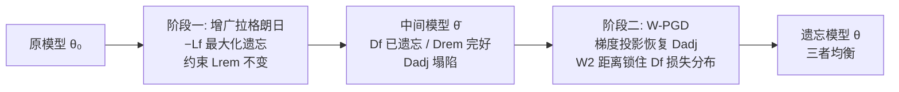

# Machine Unlearning under Retain–Forget Entanglement

**会议**: ICLR 2026  
**OpenReview**: [https://openreview.net/forum?id=4WMBSHHJEr](https://openreview.net/forum?id=4WMBSHHJEr)  
**代码**: 已开源（论文中提供链接）  
**领域**: 机器遗忘 / AI 安全  
**关键词**: machine unlearning, retain-forget entanglement, augmented Lagrangian, gradient projection, Wasserstein-2 distance  

## 一句话总结
针对"遗忘集和保留集语义纠缠"导致的相关样本误伤问题，提出两阶段优化框架：第一阶段用增广拉格朗日法激进遗忘并锁住无关保留样本，第二阶段用 Wasserstein-2 距离正则化的梯度投影修复语义相邻保留样本的精度，同时保住遗忘效果。

## 研究背景与动机
**领域现状**：机器遗忘（machine unlearning）要求从已训练模型中精准抹除指定数据 $D_f$ 的影响，同时保留其余数据 $D_r$ 的性能，应用于隐私合规（GDPR 被遗忘权）、去偏、修复中毒数据等场景。现有工作覆盖随机样本遗忘、类级遗忘、概念级遗忘，并发展出基于梯度、稀疏剪枝、Fisher/影响函数等高效后处理方法。

**现有痛点**：现有方法几乎都把保留集性能用"整体平均精度"来衡量，掩盖了一个关键事实——遗忘从来不是孤立的。删除某组数据往往会**连带损伤与之强相关的另一组数据**。例如遗忘某少数群体的有毒言论，会无意中改变模型对该群体非有毒言论的行为；遗忘某个子类，会扰乱同超类下其他相邻子类的预测。这些敏感、相关的子集恰恰是性能最脆弱、后果最严重的部分，却被平均指标淹没。

**核心矛盾**：遗忘集 $D_f$ 与"相邻保留集" $D_r^{adj}$ 共享高度重叠的特征分布——压低 $D_f$ 的损失会株连 $D_r^{adj}$，而恢复 $D_r^{adj}$ 的精度又会反过来削弱遗忘效果（梯度方向冲突）。直接对二者联合优化只会陷入此消彼长的拉锯。

**本文目标**：在"遗忘集-保留集纠缠"（retain–forget entanglement）这一更贴近真实需求的设定下，把保留集显式拆成相邻子集 $D_r^{adj}$（与 $D_f$ 强相关、易受损）和远端子集 $D_r^{rem}$（弱相关），既要彻底遗忘 $D_f$，又要专门守住敏感的 $D_r^{adj}$。

**核心 idea**：**解耦 + 两阶段（divide-and-conquer）**——先处理"容易的部分"（遗忘 + 锁远端），再单独修复"难的部分"（相邻子集），并用 **Wasserstein-2 分布约束**取代传统的均值损失约束，从根上堵住"均值不变但精度反弹"的漏洞。

## 方法详解

### 整体框架
方法把纠缠场景下的遗忘拆成两个串行阶段。第一阶段（增广拉格朗日）只关心"激进遗忘 $D_f$"和"锁住远端保留集 $D_r^{rem}$"，**故意回避** $D_r^{adj}$ 以躲开梯度冲突；这一阶段结束后 $D_f$ 被遗忘、$D_r^{rem}$ 完好，但 $D_r^{adj}$ 因纠缠而塌陷。第二阶段（W-PGD）用梯度投影把 $D_r^{adj}$ 的精度抬回来，同时用 Wasserstein-2 距离锁住 $D_f$ 的损失**分布**（而非仅锁均值），保证修复相邻集时遗忘效果不反弹。

### 关键设计

**1. 增广拉格朗日激进遗忘：自适应平衡遗忘与远端保留。** 第一阶段被形式化为约束优化 $\min_\theta -L_f(\theta)$ s.t. $L_r^{rem}(\theta)=L_r^{rem}(\theta_0)$——即最大化遗忘集损失，同时强制远端保留集损失钉死在原始水平。直接用固定权重惩罚项需要反复手调系数，作者改用增广拉格朗日 $L_{aug}(\theta;\lambda,\mu)=-L_f(\theta)+\lambda(L_r^{rem}(\theta)-L_r^{rem}(\theta_0))+\frac{\mu}{2}(L_r^{rem}(\theta)-L_r^{rem}(\theta_0))^2$。乘子 $\lambda$ 从 0 起步，每步先按 $\theta\leftarrow\theta-\eta\nabla_\theta L_{aug}$ 更新参数，再按约束违反量 $\lambda\leftarrow\lambda+\mu(L_r^{rem}(\theta)-L_r^{rem}(\theta_0))$ 更新乘子。这样惩罚强度随约束违反程度自动收紧或放松，避免人工 trade-off 调参，训练更稳定。这里**刻意不优化** $D_r^{adj}$ 正是为了规避与遗忘目标的梯度冲突。

**2. 揭示经典 PGD 的失效：均值约束的致命漏洞。** 阶段二最自然的想法是用多任务学习里常用的线性化投影梯度下降（PGD），把 $\nabla_\theta L_r^{adj}$ 中与 $\{\nabla_\theta L_f,\nabla_\theta L_r^{rem}\}$ 张成空间对齐的分量投影掉：$\theta\leftarrow\theta-\eta(\nabla_\theta L_r^{adj}-\text{Proj}_V\nabla_\theta L_r^{adj})$。但作者用实验暴露了一个反直觉的失败——$D_f$ 上的**平均损失看似稳定，准确率却一路回升**。根因在于 $D_f$ 与 $D_r^{adj}$ 的强纠缠：恢复 $D_r^{adj}$ 会顺带压低 $D_f$ 中相似样本的损失；为维持均值不变，模型把损失"补"到了不相似样本上，造成两极分化的损失分布——一部分样本损失逼近零（被重新记住）。这说明仅约束均值损失对"低损失样本占比"毫无保证，遗忘形同虚设。

**3. Wasserstein-2 距离正则化的 W-PGD：锁住整条损失分布。** 为细粒度控制遗忘行为，作者用 W2 距离约束 $D_f$ 损失分布相对阶段一末模型 $\bar\theta$ 的整体漂移。一维经验分布的 W2 有排序闭式解：$W_2(P,Q)=(\frac1N\sum_i(\bar a_i-\bar b_i)^2)^{1/2}$，无需密度估计，远比 KL 散度（需高斯先验或核估计）便宜。定义修正遗忘损失 $\tilde L_f(\theta)=(1-\alpha)L_f(\theta)+\alpha W_2^2(P_{\bar\theta}^{forget},P_\theta^{forget})$，再把投影空间换成 $V=\text{span}\{\nabla_\theta\tilde L_f,\nabla_\theta L_r^{rem}\}$。理论上 Proposition 4.1 保证更新让 $\tilde L_f$ 和 $L_r^{rem}$ 的变化是 $O(\eta^2)$ 二阶小量、而 $L_r^{adj}$ 严格一阶下降 $-c\eta$；Proposition 4.2 进一步给出遗忘集准确率上界 $\text{Acc}_f(\theta)\le\frac{1}{(m-\log n)^2}(\frac{1-\alpha}{\alpha}+\sqrt{\frac{\varepsilon}{\alpha}})^2$，即只要 $\alpha>0$ 且原最小损失足够大，遗忘集准确率被压在小常数内。实践中取 $\alpha=0.5$，使 $D_f$ 损失分布保持均匀、准确率维持在零。

## 实验关键数据

### 主实验表格（CIFAR-100 / ResNet-18，遗忘"aquarium fish"子类，测试精度）

| 方法 | $D_f$↓ | $D_r^{adj}$↑ | $D_r^{rem}$↑ |
|------|--------|--------------|--------------|
| Original | 90.00 | 80.00 | 85.33 |
| FT | 62.33 | 77.83 | 83.89 |
| Munba | 31.67 | 69.75 | 75.32 |
| SCRUB | 7.00 | 54.75 | 75.42 |
| SalUn | 3.00 | 34.90 | 71.78 |
| DELETE | 0.67 | **2.83** | 82.09 |
| GDR | 8.67 | 22.33 | 79.93 |
| **本文** | **2.33** | **78.17** | 81.10 |

关键对比：DELETE/GDR/SalUn 虽把遗忘集压得很低，但相邻保留集 $D_r^{adj}$ 精度崩到 2~35%；本文在遗忘到 2.33% 的同时把 $D_r^{adj}$ 守在 78.17%（接近原始 80%），唯一兼顾遗忘与相邻保留。

### 其他数据集（测试精度，节选）

| 设定 | 方法 | $D_f$↓ | $D_r^{adj}$↑ | $D_r^{rem}$↑ |
|------|------|--------|--------------|--------------|
| ToxiGen / RoBERTa（去偏纠错） | GDR | 19.83 | 83.92 | 85.52 |
| ToxiGen / RoBERTa | **本文** | **14.29** | **85.86** | 85.23 |
| CelebA / ViT-B | GA/DELETE | 0.00 | 0.00（崩） | ~92 |
| CelebA / ViT-B | **本文** | 25.48 | **75.05** | 92.38 |
| TinyImageNet / ViT（遗忘"dog"） | **本文** | 3.11 | **91.27** | 88.88 |

### 消融实验表格（W2 正则化，CIFAR-100/ResNet18，测试精度）

| 配置 | $D_f$↓ | $D_r^{adj}$↑ | $D_r^{rem}$↑ |
|------|--------|--------------|--------------|
| w/o W2 正则 | 14.33 | 87.00 | 80.55 |
| w/ W2 正则 | **2.33** | 78.17 | 81.10 |

### 关键发现
- **W2 正则是遗忘"防反弹"的命门**：去掉后遗忘集准确率从 2.33% 反弹到 14.33%（训练集 0%→18.87%），印证了"仅锁均值会被绕过"的分析。代价是 $D_r^{adj}$ 略降（87→78），属可接受权衡。
- **纠缠越强、基线越崩**：CelebA 上相邻集与遗忘集属性高度相似，GA/DELETE 直接把 $D_r^{adj}$ 打到 0%，而本文守住 75%，纠缠越极端越凸显优势。
- **跨架构/任务一致性**：从 ResNet 到 ViT、从视觉分类到 ToxiGen 语言去偏，两阶段框架表现稳定。

## 亮点与洞察
- **问题立意精准**：把"平均保留精度掩盖相邻子集塌陷"这一被长期忽视的盲区显式化，将保留集拆成 adjacent/remote 并分别上报，比 LLM 遗忘里常用的 neighbor set 更系统。
- **失败分析有诊断价值**：Figure 1 用损失分布两极化清晰解释了"均值不变、准确率反弹"的机制，这是从均值约束转向分布约束的强动机，而非拍脑袋换正则。
- **理论-实践闭环**：两个 Proposition 分别保证"相邻集严格下降"和"遗忘集准确率有界"，W2 的一维闭式解又让分布约束几乎零额外成本，理论优雅且落地便宜。

## 局限与展望
- **依赖相邻/远端子集的先验划分**：方法假设能事先把 $D_r$ 切成 $D_r^{adj}$ 和 $D_r^{rem}$（靠超类结构或语义分组），但真实场景中"哪些样本与遗忘集纠缠"往往不易界定，划分质量直接影响效果。
- **两阶段串行成本**：相比一步式后处理（如 SSD），两阶段优化 + 每步 W2 排序在大规模数据上的计算开销值得进一步评估。
- **遗忘语义偏"压制"而非"重训等价"**：本文采纳"最大化降低遗忘集性能"视角，更适合去偏/有害内容场景；对隐私场景下"等价于从头重训"的严格定义未直接覆盖。
- **CelebA 上遗忘集仍有 25% 残留**：纠缠极端时遗忘与相邻保留仍存在张力，未完全消除 trade-off。

## 相关工作与启发
- **约束优化谱系**：方法把公平/安全学习里成熟的增广拉格朗日、primal-dual 思想迁移到遗忘场景，提示"遗忘本质是带约束的多目标优化"。
- **与梯度冲突方法对比**：GDR、Munba（Nash bargaining）、PGD 都试图调和遗忘-保留的梯度冲突，本文的差异在于**分阶段回避冲突 + 分布级约束**，而非在单步里硬调和。
- **对分布约束的启发**：用 W2 替代 KL 来约束损失分布，因一维闭式解而极轻量，这一技巧可推广到任何"需要锁住某子集输出分布"的持续学习/去偏任务。

## 评分
- **新颖性**: ⭐⭐⭐⭐ 把"retain-forget 纠缠"显式建模并用 W2 分布约束破解均值约束漏洞，问题定义和解法都有新意。
- **实验充分度**: ⭐⭐⭐⭐ 覆盖 CIFAR-100/TinyImageNet/CelebA/ToxiGen 四数据集、ResNet/ViT/RoBERTa 三架构、9 个基线，并有 W2 消融，较充分；但缺隐私场景（MIA）下的遗忘度量。
- **写作质量**: ⭐⭐⭐⭐ 失败案例分析（Figure 1）和理论命题衔接清晰，方法动机层层递进，可读性强。
- **价值**: ⭐⭐⭐⭐ 直指现有遗忘评测的盲区（相邻子集塌陷），对去偏、有害内容纠错等真实安全场景有直接落地价值。

<!-- RELATED:START -->

## 相关论文

- [\[AAAI 2026\] Easy to Learn, Yet Hard to Forget: Towards Robust Unlearning Under Bias](../../AAAI2026/ai_safety/easy_to_learn_yet_hard_to_forget_towards_robust_unlearning_under_bias.md)
- [\[ICLR 2026\] Label Smoothing Improves Machine Unlearning](label_smoothing_improves_machine_unlearning.md)
- [\[ICLR 2026\] Distributional Machine Unlearning via Selective Data Removal](distributional_machine_unlearning_via_selective_data_removal.md)
- [\[ICLR 2026\] ReTrace: Reinforcement Learning-Guided Reconstruction Attacks on Machine Unlearning](retrace_reinforcement_learning-guided_reconstruction_attacks_on_machine_unlearni.md)
- [\[ICLR 2026\] Remaining-data-free Machine Unlearning by Suppressing Sample Contribution](remaining-data-free_machine_unlearning_by_suppressing_sample_contribution.md)

<!-- RELATED:END -->
