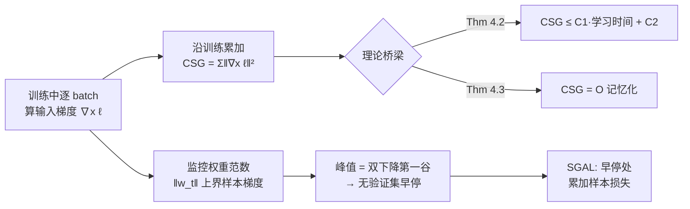

# Memorization Through the Lens of Sample Gradients

**会议**: ICLR 2026  
**OpenReview**: [https://openreview.net/forum?id=jeTiBeW3iZ](https://openreview.net/forum?id=jeTiBeW3iZ)  
**代码**: [https://github.com/DeepakTatachar/Sample-Gradient-Memorization](https://github.com/DeepakTatachar/Sample-Gradient-Memorization)  
**领域**: AI 安全 / 记忆化与隐私 / 训练动态  
**关键词**: memorization, sample gradient, generalization, privacy, double descent, early stopping  

## 一句话总结
本文提出**累积样本梯度（CSG）**——把"损失对输入的梯度"沿训练过程累加——作为 Feldman 记忆化分数的高效代理，理论上证明 CSG 同时被记忆化程度和学习时间线性界定，并由此发现"在权重范数峰值处早停"这一无需验证集的判据，把记忆化估计加速最多 5 个数量级。

## 研究背景与动机
- **领域现状**：理解深度网络对训练样本的"记忆化"对泛化、隐私、去学习、错标检测都至关重要。Feldman & Zhang (2020) 给出了最有原则性的定义——记忆化分数 $\mathrm{mem}(S,\vec{z}_i)=\Pr[g^p_S(\vec{x}_i)=y_i]-\Pr[g^p_{S\setminus i}(\vec{x}_i)=y_i]$，即"去掉某样本后模型对它预测正确概率的下降量"。
- **现有痛点**：这个定义要训练 $O(\text{数据集大小})$ 个 leave-one-out 模型，计算成本高到无法规模化。后续代理（学习时间、遗忘频率、C-score、输入曲率 Curvature、累积损失 CSL 等）虽更便宜，但要么是**缺乏理论支撑的 ad-hoc 指标**（如基于梯度方差的 VoG 会误判"一直难学"的样本），要么仍然昂贵（影响函数、k-fold），要么捕捉不到记忆化的关键性质（如双峰性）。
- **核心矛盾**：既要**计算高效**（最好训练时顺带就能算出），又要与记忆化分数**有形式化的理论联系**，现有代理两者难以兼得。
- **本文目标**：找一个训练过程中几乎零额外开销、且能被严格证明与记忆化挂钩的代理指标。
- **核心 idea**：作者的关键观察是——**越少被记忆的样本越早被学会，高度记忆化的样本则学得很晚**（图 2）。**【核心假设】** 既然"学习速度"编码了记忆化信息，那么**对输入的损失梯度**正好刻画"模型对该样本拟合得有多好"：易样本梯度迅速降到很低，难样本梯度长时间居高。把它沿训练累加（**【核心机制】CSG**）既能平滑单 epoch 噪声，又能建立到记忆化的形式化桥梁。

## 方法详解

### 整体框架
方法分三层递进：先用"对输入的损失梯度沿训练累加"定义 CSG（一个训练时几乎免费的标量）；再通过 SGD 收敛理论 + 均匀稳定性，证明 CSG 被学习时间和记忆化分数双向线性界定；最后利用"样本梯度峰值 = 权重范数峰值 = 双下降第一个验证损失谷底"这一三者同步现象，导出无需验证集的早停判据，并据此设计计算更省的变体 SGAL。

### 关键设计

**1. 累积样本梯度 CSG：把"学习速度"变成训练时免费的标量。** 不同于在参数空间求梯度（影响函数式，单样本就要遍历全部参数），CSG 取**对输入** $\vec{x}_i$ 的损失梯度并在整个训练过程上累加：$\mathrm{CSG}(\vec{z}_i)=T_{\max}\cdot\mathbb{E}_R[\|\nabla_{x_i}\ell(\vec{w}_R)\|_2^2]\approx\sum_{t=0}^{T_{\max}}\|\nabla_{x_i}\ell(\vec{w}_t)\|_2^2$。这一选择有两层好处：per-sample 的输入梯度可以在反向传播中顺带得到、几乎零开销；而"累加"相比"学习时间/遗忘时间"这类靠阈值的指标更鲁棒——一个样本可能"学会→遗忘→再学会"，单点阈值会抖动，累加则把这些波动平滑掉。作者据此把样本是否"学会"形式化为"期望输入梯度低于阈值 $\tau$"的学习时间 $T_{z_i}=\min_T\{T:\mathbb{E}_R[\|\nabla_{x_i}\ell(\vec{w}_R)\|_2^2]\le\tau\}$。

**2. 双向理论界定：把启发式代理升级成有证明的代理。** 这是全文的理论核心。先有引理 4.1：无首层残差连接时，输入梯度的 Frobenius 范数被**权重范数**界定 $\|\nabla_{x_i}\ell\|_F\le\|\vec{w}_t\|_F\,\|\nabla_{w_t}\ell\|_F/\|\vec{x}_i\|_F$——由于权重梯度范数在训练中收敛、输入范数固定，于是权重范数就成了样本梯度的"封顶器"。在此基础上，定理 4.2 证明 $\mathbb{E}[\mathrm{CSG}(\vec{z}_i)]\le C_1\,\mathbb{E}[T_{z_i}]+C_2$（CSG 被学习时间线性界定），定理 4.3 进一步给出 $\mathbb{E}[\mathrm{CSG}(\vec{z}_i)]=O(\mathbb{E}[\mathrm{mem}(\vec{z}_i)])$（CSG 被记忆化分数线性界定）。证明路线是借用 Ghadimi & Lan (2013) 的随机 SGD 收敛结论但搬到输入空间，再用 leave-one-out 分析配合 SGD 的 $\beta$-均匀稳定性把记忆化项分离出来。结论对"样本子集"成立，因此可在实验中用分箱散点验证 CSG 与学习时间/记忆化的线性关系。理论还预言：CSG 异常大的样本要么学习时间极长、要么**永远学不会（错标样本）**，这正是后面错标检测 SOTA 的依据。

**3. 权重范数峰值 = 双下降谷底：无验证集早停判据。** 作者观察到平均样本梯度呈"上升—峰值—下降"轨迹，权重范数同步（因引理 4.1 它上界样本梯度）。这条轨迹来自两股对抗力量：性能损失把权重范数往上推以拟合数据，而 $\ell_2$ 权重衰减 + SGD 偏向最小范数解把它往下拉。关键发现是——**这个峰值恰好落在双下降曲线的第一个验证损失最小值上**（插值/泛化区的分界），且在峰值处样本梯度与记忆化分数对齐度最高。于是得到一条极简且无需验证集的判据：**在权重范数峰值处早停**。该现象对 Adam/AdamW/Adagrad/RMSProp 以及 ViT/ResNet50 都稳健。

**4. SGAL：用早停把代理算得更省。** 既然 CSG 与记忆化的相似度在第一个下降点附近就已"饱和"（图 3c 累积相似度提前平台化），就没必要训完全程。SGAL（Sample Gradient-Assisted early stopping with accumulated Loss）在样本梯度给出的最优停止点之前**累加样本损失**，平均只需 10–30% 的 epoch、带来 3–10× 加速，同时进一步提升与记忆化的对齐度。此外，分析"最易样本（低 CSG）"的梯度还能在不看验证集的情况下识别双下降的第二次下降。

## 实验关键数据

### 主实验：与记忆化分数的相似度 + 算力成本
Inception/CIFAR-100 与 ResNet50/ImageNet，对比 Feldman & Zhang (2020) 预计算的记忆化分数（余弦相似 CS / Pearson 相关 Corr.），归一化算力成本越低越好：

| 方法 | 算力 | CIFAR-100 CS | CIFAR-100 Corr. | ImageNet CS | ImageNet Corr. |
|---|---|---|---|---|---|
| CSL (Ravikumar 2025a) | 1× | 0.87 | 0.79 | 0.79 | 0.64 |
| Curvature (Garg 2024) | 14× | 0.69 | 0.49 | 0.62 | 0.33 |
| TracIn (Pruthi 2020) | 26× | 0.83 | 0.71 | † | † |
| **SGAL (本文)** | **0.1–0.3×** | 0.86 | 0.77 | 0.78 | 0.62 |
| **CSG (本文)** | **0.1–0.3×** | 0.84 | 0.72 | 0.71 | 0.52 |

> †：无法规模化到 ImageNet。SGAL 用 CSL 约 10–30% 的算力达到其 97–99% 的相关度；相比曲率快约 140×、比 CSL 快最多 10×、比记忆化分数快约 5 个数量级。

### 错标样本检测（AUROC，CIFAR-100，多噪声水平）

| 方法 | 5% | 10% | 20% | 25% | 30% |
|---|---|---|---|---|---|
| Curvature | 0.9876 | 0.9892 | 0.9931 | 0.9931 | 0.9932 |
| CSL | 0.9891 | 0.9895 | 0.9902 | 0.9904 | 0.9903 |
| **CSG (本文)** | **0.9896** | **0.9904** | **0.9934** | **0.9936** | **0.9936** |

CSG 在所有噪声档位取得最优或并列最优，验证了"高 CSG ⇒ 错标"的理论预言。

### 早停对校准与隐私的影响（ResNet18/CIFAR-100）
- **隐私（MIA AUROC，越低越好）**：以 LiRA 为例，本文早停点 55.98 vs 末轮 85.48；曲率攻击 59.42 vs 85.52——早停大幅降低成员推断泄露风险。
- **校准**：早停点在 MCE/UCE 等"对长尾更公平"的指标上优于末轮 checkpoint（MCE 0.272 vs 0.279，UCE 2.08 vs 2.18），代价是整体精度从 0.749 降到 0.631。

### 关键发现
- 分箱散点（图 4）经验证实了定理 4.2/4.3 预测的 CSG–学习时间、CSG–记忆化线性关系，仅在极高记忆化处因交叉熵非有界而略有偏离。
- "样本梯度峰值 = 权重范数峰值 = 验证损失第一谷"三者同步，在多种优化器与架构上复现。

## 亮点与洞察
- **用输入梯度而非参数梯度**是效率的关键——per-sample 输入梯度反传顺带可得，把"单样本要遍历全参数"的影响函数式开销彻底绕开。
- **把启发式代理升级为有证明的代理**：CSG 不只是又一个相关性高的指标，而是被双定理夹在记忆化与学习时间之间，这让"为什么有效"有了交代。
- **无验证集早停**是个意外但实用的副产品：权重范数峰值这个训练时就能监控的量，直接对应双下降第一谷，省掉了划验证集的麻烦，还顺带改善隐私和校准。
- 把记忆化、双下降、权重范数动态、隐私（MIA）这几条原本分散的线索串到了同一个"样本梯度轨迹"框架下。

## 局限与展望
- 理论依赖一组较强假设：**L-有界损失**（交叉熵实际无界，作者承认这是高记忆化区偏离线性的原因）、$\rho$-Lipschitz、SGD $\beta$-稳定、**首层无残差连接**（ViT/ResNet/VGG 满足，但限制了适用架构）。
- 早停带来明显的**精度—隐私权衡**（精度从 0.749 掉到 0.631），是否值得取决于应用对隐私/校准的需求。
- SGAL 在高噪声错标检测上明显弱于 CSG（30% 噪声 0.847 vs 0.994），说明效率提升并非全场景免费。
- 实验集中在图像分类（CIFAR/ImageNet），到语言模型等其他模态的记忆化是否成立尚待验证。

## 相关工作与启发
- **记忆化定义**：建立在 Feldman (2020)、Feldman & Zhang (2020) 的反事实/稳定性记忆化之上，把昂贵的 leave-one-out 估计替换为可证明的廉价代理。
- **代理谱系**：与 CSL（累积损失，Ravikumar 2025a）、输入曲率（Garg 2024）、C-score/学习时间（Jiang 2021）、遗忘频率（Toneva 2019）、VoG（Agarwal 2022）同属"训练动态代理"，本文的差异点是首次给输入梯度动态与形式化记忆化之间建立理论桥。
- **理论工具**：SGD 均匀稳定性（Hardt 2016）、随机 SGD 收敛（Ghadimi & Lan 2013）是证明的支柱。
- **启发**：这条"用训练时几乎免费的信号 + 收敛/稳定性理论去逼近昂贵的隐私/记忆化量"的思路，可能迁移到数据去学习、数据筛选、子群体偏差发现等需要规模化打分的场景。

## 评分
- **新颖性**: ⭐⭐⭐⭐ — 输入梯度累加这一具体形式 + 双向理论界定 + 权重范数峰值早停判据，三者组合是新的；虽建立在 CSL/曲率等既有代理脉络上，但理论桥与无验证集早停是实打实的增量。
- **实验充分度**: ⭐⭐⭐⭐ — 覆盖 CIFAR/ImageNet、多优化器多架构、相似度/错标检测/校准/隐私四类任务，理论预测有分箱实证支撑；略欠图像分类以外的模态验证。
- **写作质量**: ⭐⭐⭐⭐ — 观察→定义→理论→现象→应用的脉络清晰，定理给了可解释的常数与直觉；但理论密度较高，部分依赖附录。
- **价值**: ⭐⭐⭐⭐ — 把记忆化估计加速 5 个数量级且保持高相关，对隐私审计、数据诊断、错标清洗等实际流程有直接可用的工具价值。

<!-- RELATED:START -->

## 相关论文

- [\[CVPR 2025\] Detecting Out-of-Distribution through the Lens of Neural Collapse](../../CVPR2025/ai_safety/detecting_out-of-distribution_through_the_lens_of_neural_collapse.md)
- [\[ICLR 2026\] Remaining-data-free Machine Unlearning by Suppressing Sample Contribution](remaining-data-free_machine_unlearning_by_suppressing_sample_contribution.md)
- [\[ICLR 2026\] MUSE: Model-Agnostic Tabular Watermarking via Multi-Sample Selection](muse_model-agnostic_tabular_watermarking_via_multi-sample_selection.md)
- [\[ICLR 2026\] Robust Adversarial Attacks Against Unknown Disturbances via Inverse Gradient Sample](robust_adversarial_attacks_against_unknown_disturbance_via_inverse_gradient_samp.md)
- [\[ICLR 2026\] Sample-Efficient Distributionally Robust Multi-Agent Reinforcement Learning via Online Interaction](sample-efficient_distributionally_robust_multi-agent_reinforcement_learning_via_.md)

<!-- RELATED:END -->
