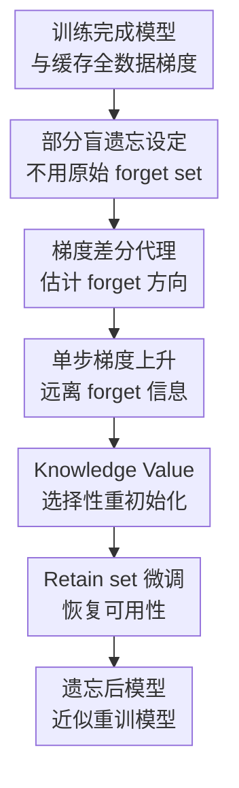

# Mitigating Privacy Risk via Forget Set-Free Unlearning

**会议**: ICLR 2026  
**OpenReview**: [https://openreview.net/forum?id=d3R0TF7w5f](https://openreview.net/forum?id=d3R0TF7w5f)  
**代码**: 有（论文称项目页提供实现，缓存中未给出具体 URL）  
**领域**: AI安全 / 机器遗忘 / 隐私保护  
**关键词**: 机器遗忘, 部分盲遗忘, forget set-free unlearning, 隐私风险, RELOAD

## 一句话总结
本文提出部分盲机器遗忘（partially-blind unlearning）设定和 RELOAD 方法，用训练末尾缓存的全数据梯度代替原始 forget set，通过一次反向遗忘梯度、选择性权重重初始化和 retain set 微调，在不保留待删除样本的情况下逼近从头重训模型，并在普通样本遗忘、LLM 实体遗忘和纠错遗忘上取得强结果。

## 研究背景与动机
**领域现状**：机器遗忘要解决的是“模型已经用某些用户数据训练过，现在用户要求删除数据，模型也要像没见过这些数据一样”的问题。最理想的做法是直接在保留集 $D_{retain}$ 上从头训练一个模型 $M_{\theta^\sim}$，但这在大模型和频繁删除请求场景下太昂贵，所以近似遗忘方法通常试图把原模型 $M_{\theta^*}$ 快速改造成接近重训模型的 $M_{\tilde{\theta}}$。

**现有痛点**：很多遗忘算法在技术上能删除模型里的信息，却在流程上制造了一个隐私悖论：它们需要直接访问 forget set $D_{forget}$。机构收到删除请求后，如果还要等到批量遗忘时才真正删除用户数据，那么用户在这段等待期里仍然暴露于数据库泄露、内部越权访问等“数据集风险”。也就是说，传统遗忘方法为了降低模型风险，反而要求继续保留最该被删除的原始数据。

**核心矛盾**：完全没有 forget set 信息是不可能遗忘的，因为算法不知道该删什么；但保留原始 forget set 又会持续增加隐私风险。本文把矛盾拆成一个更现实的问题：能不能不保存原始样本，只保存训练过程中已经产生、相对更难反推出个人样本的辅助信息，用它作为 forget set 的代理信号来完成遗忘？

**本文目标**：作者希望定义一种比“完全盲遗忘”更可行、比“持有 forget set 遗忘”更保护隐私的新设定：算法可以访问原模型、retain set 和训练时辅助信息 $I_D$，但不能访问原始 forget set。目标仍然是输出接近 $M_{\theta^\sim}$ 的模型，同时让机构可以在删除请求到达时立即删掉用户原始数据。

**切入角度**：关键观察来自损失函数的可加性。若缓存了训练最后一步在全训练集 $D$ 上的梯度 $\nabla_\theta L(D)$，并且当前仍能在 $D_{retain}$ 上计算 $\nabla_\theta L(D_{retain})$，那么两者之差可以作为 $D_{forget}$ 梯度的代理：$\nabla_\theta L(D_{forget})=\nabla_\theta L(D)-\nabla_\theta L(D_{retain})$。这给了算法一个不看原始 forget set 也能估计“要从哪个方向远离”的入口。

**核心 idea**：用训练末尾缓存的全数据梯度减去 retain set 梯度，构造 forget set 梯度代理，再把“全局梯度上升 + forget-sensitive 权重重初始化 + retain set 微调”串成一个不依赖原始 forget set 的近似遗忘流程。

## 方法详解
### 整体框架
本文先定义部分盲遗忘（PBU）设定：算法输入为原训练模型 $M_{\theta^*}$、保留集 $D_{retain}$ 和辅助训练信息 $I_D$，不能输入原始 forget set $D_{forget}$。RELOAD 选择的 $I_D$ 是训练结束时缓存的全数据梯度 $\nabla_\theta L(D)$，随后用 retain set 梯度差分得到 forget set 的代理方向，再对模型做三步更新：一次梯度上升把模型推离 forget set，基于 knowledge value 找到最像在记忆 forget set 的权重并重初始化，最后在 retain set 上微调恢复保留数据性能。

RELOAD 的普通机器遗忘版本只需要在训练时额外缓存一份 summed gradient；它不需要保留 $D_{forget}$，也不需要在删除请求后重新访问用户原始样本。对 LLM 实体遗忘，作者又给出一个改造版本：用目标实体 prompts、模型输出、contextual fine-tuning prompt 和小规模 repair set 来构造更实用的遗忘梯度，并只在选定层上更新，从而把方法推进到 Llama-2-7B 这类模型规模。

### 关键设计
**1. 部分盲遗忘设定：把“不能留原始样本”和“不能凭空遗忘”同时写进问题定义**

传统 unlearning 的输入通常是 $AMU(M_{\theta^*}, D_{retain}, D_{forget})$，这在算法评测里很方便，却不符合强隐私删除的业务流程。本文提出的 partially-blind unlearning 把输入改成 $APBU(M_{\theta^*}, D_{retain}, I_D)$：$I_D$ 可以是训练时产生的聚合梯度、特征统计等辅助对象，但不应该是原始个人样本，也应该尽量难以反推出单个用户数据。这样定义以后，隐私目标不再只是“模型别记住用户”，还包括“机构不要为了遗忘而继续存着用户数据”。

这个设定的价值在于它承认信息论上的底线：没有任何关于待删数据的信息，算法当然无法知道该删什么。因此作者没有承诺“零信息遗忘”，而是把问题落到一个更可落地的位置：保留低泄露风险的训练副产物，让数据删除请求到来时可以先删原始数据，再用副产物完成后续模型更新。论文中还用 dataset risk 和 model risk 的累积风险图解释了这一点：RELOAD 不能立刻消除模型风险，但可以消除删除请求后继续保留原始 forget set 带来的那块数据库风险。

**2. 梯度差分代理：用 $\nabla_\theta L(D)-\nabla_\theta L(D_{retain})$ 还原遗忘方向**

RELOAD 的第一步非常朴素但关键。因为经验风险是按样本可加的，且 $D_{retain}=D\setminus D_{forget}$，所以有：

$$
\nabla_\theta L(D_{forget})=\nabla_\theta L(D)-\nabla_\theta L(D_{retain}).
$$

如果模型训练结束时缓存了 $\nabla_\theta L(D)$，删除请求到来后又能在剩余数据 $D_{retain}$ 上计算梯度，那么算法不需要查看 $D_{forget}$ 本身，也能得到一个指向 forget set 损失下降方向的代理梯度。由于遗忘的目标不是继续拟合 $D_{forget}$，而是让模型远离它，RELOAD 对这个方向做一次梯度上升：$\theta'\leftarrow \theta^*+\eta_p(\nabla_\theta L(D)-\nabla_\theta L(D_{retain}))$。

这里“一次”很重要。没有原始 forget set，算法不能像普通梯度上升遗忘那样反复对 $D_{forget}$ 取梯度；缓存梯度只给了训练末尾位置附近的一次可用信号。作者因此把这一步定位成 priming step：它先对全模型做一次粗粒度去记忆，把权重从过度拟合 forget set 的方向推开，但不指望单靠它完全清除所有局部记忆。

**3. Knowledge Value 选择性重初始化：专门处理单步梯度删不干净的权重子集**

一次梯度上升会影响所有参数，但神经网络的记忆并不均匀分布。作者借鉴权重显著性和网络模块化的观点，认为少数参数可能对 forget set 有特别强的表征责任。如果这些参数已经很好地编码了待删样本，单步上升很可能只是轻微扰动，无法真正抹掉信息。因此 RELOAD 为每个权重定义 knowledge value：

$$
KV_{\theta_k}=\frac{|\nabla_{\theta_k}L(D)-\nabla_{\theta_k}L(D_{retain})|+\epsilon}{|\nabla_{\theta_k}L(D)|+\epsilon}.
$$

分子是该权重对应的 forget 代理梯度大小，分母是全数据梯度大小，$\epsilon$ 用于平滑。论文采用的解释是：较低的 $KV$ 表示该权重相对更强地刻画了 $D_{forget}$，因此更值得被重置。RELOAD 根据分位数超参 $\alpha$ 选择 $KV_{\theta_k}\le Quantile_\alpha(KV)$ 的权重并重新初始化，得到 $\theta^\dagger$。这一步和前面的全局上升形成互补：上升步给所有权重一个小到中等的遗忘方向，重初始化则对 forget-sensitive 的局部权重做更激进的清除。

这也是 RELOAD 相比单独 GA 或 FT 的核心区别。GA 只做“推远”，容易损伤整体行为或删不干净；FT 只在 retain set 上继续训练，很多时候只是把保留性能修回来，不一定真的接近重训模型在 forget set 上的行为。RELOAD 把代理梯度和权重显著性绑在一起，让“该推哪里”和“该重置哪里”都来自同一个部分盲信号。

**4. Retain set 微调与 LLM 版本：把遗忘后的模型拉回可用区域**

重初始化会破坏一部分参数，单步梯度上升也可能扰乱原模型，因此最后必须在 $D_{retain}$ 上微调到收敛，得到 $\tilde{\theta}$。这一步不是普通意义上的继续训练，而是在前两步已经删除 forget 影响后，把模型行为重新对齐到保留数据分布。论文的实验也支持三步缺一不可：方法分析中，单步上升后 ResNet 对 SVHN digit “8”的表示仍未完全消失，重初始化后才明显改变早期层表征，最后微调再恢复类别聚类结构。

对于语言模型，直接缓存和处理全模型梯度不现实，作者把 RELOAD 改造成实体遗忘版本。它不再要求 $D_{forget}$，而是要求询问目标实体的 prompts $D_{prompts}$ 和很小的 repair set $D_{repair}\subseteq D_{retain}$。流程是：先让模型回答这些 prompts，借助 contextual fine-tuning prompt 把模型对目标实体的知识进一步“抽出来”，再在选定层上用这些输出做一次上升、按 $D_{embedded\_outputs}$ 与 $D_{repair}$ 的梯度比值计算 $KV$、重初始化选中参数，并在 $D_{repair}$ 上微调。这个版本隐私承诺更弱，因为它需要知道要忘记哪个实体或概念，但换来了对 Llama-2-7B 这类模型的可操作性。

### 一个完整示例
设一个医院用患者数据训练诊断模型，某批患者要求删除记录。传统遗忘方法可能需要把这些患者样本暂存到季度批处理时再运行 GA、SCRUB 或 SalUn；在这几个月里，数据库仍然保存着这些最敏感的样本。RELOAD 的操作方式不同：训练完成时医院已经缓存了全训练集最后一步梯度 $\nabla_\theta L(D)$；删除请求到达后，原始患者数据先从数据库中删除，系统只保留剩余患者数据 $D_{retain}$ 和缓存梯度。

随后，系统在 $D_{retain}$ 上计算当前梯度 $\nabla_\theta L(D_{retain})$，两者相减得到待删患者数据的代理梯度。模型先沿这个代理方向做一次上升，远离对这些患者样本的拟合；再计算每个参数的 $KV$，把最低一小部分分位数的权重重新初始化；最后只用剩余患者数据微调。最终部署的不是精确重训模型，但目标是在 forget accuracy、membership inference attack success rate、forget KL 等指标上尽量接近从头在 $D_{retain}$ 上训练出来的模型。

### 损失函数 / 训练策略
普通 RELOAD 的训练策略可以概括为三类超参：梯度上升学习率 $\eta_p$、knowledge value 平滑项 $\epsilon$、重初始化比例 $\alpha$。算法输入为 $M_{\theta^*}$、缓存梯度 $\nabla_\theta L(D)$ 和 $D_{retain}$；输出为微调后的 $M_{\tilde{\theta}}$。其核心更新为：

$$
\theta'\leftarrow \theta^*+\eta_p(\nabla_\theta L(D)-\nabla_\theta L(D_{retain})),
$$

然后按 $KV$ 选择权重重初始化，再在 $D_{retain}$ 上最小化 $L(D_{retain})$ 直到收敛。评价时作者把遗忘后模型与从头重训模型比较，重点看 retain accuracy（RA）、forget accuracy difference（$\Delta FA$）、forget error difference（$\Delta FE$）、membership inference attack 差异（$\Delta FMIA$）、retain/forget symmetric KL（RSKL/FSKL）和相对重训成本。

LLM 版本则使用 $D_{prompts}$、$D_{repair}$ 和选定层 $\theta_{selected}$。它在目标实体 prompt 生成的上下文输出上做上升，在 repair set 上计算保留梯度，按两者的梯度比值选参数重置，最后只微调被选层或相关参数。论文强调 Llama-2-7B-Chat 实验只用不到 $0.025\%$ 的 retain 数据、不到 $7\%$ 的模型权重，在单张 RTX6000 上约 8 分钟完成。

## 实验关键数据

### 主实验
论文的主实验覆盖三类问题：普通机器遗忘、LLM 实体遗忘和纠错遗忘。普通遗忘中，作者在 CIFAR-10、CIFAR-100、SVHN 上用 ResNet-18/VGG16-BN 测试随机样本遗忘和同类相关样本遗忘；LLM 实体遗忘使用 TOFU 合成作者传记数据集；纠错遗忘则测试 poisoning 与 interclass confusion，当只有一部分坏样本被识别时，模型能否修正受污染行为。

| 场景 | 指标 | RELOAD | 代表性对比 | 结论 |
|------|------|--------|------------|------|
| CIFAR-100 ResNet-18，随机 10% 遗忘 | RA / $\Delta FA$ / $\Delta FMIA$ | 99.56 / 0.30 / 0.01 | SalUn: 99.06 / 13.14 / 7.39；FT: 96.00 / 16.46 / 0.19 | RELOAD 在保留准确率和 forget 行为接近重训方面明显更好 |
| CIFAR-100 ResNet-18，100 个同类样本遗忘 | RA / $\Delta FA$ / $\Delta FMIA$ | 99.47 / 3.44 / 0.02 | Fisher: 97.50 / 10.72 / 0.03；SalUn: 99.57 / 12.08 / 0.02 | 相关样本遗忘中 RELOAD 的 $\Delta FA$ 更低，且比 Fisher 便宜 |
| TOFU Llama-2-7B，1% 实体遗忘 | Forget Quality / Model Utility 变化 | 0.4046 / +0.0748 | NPO-RT: 0.5786 / -0.1361；ECO Zero-Out: 0.9900 / +0.0000 | RELOAD 能忘小规模实体且提升 utility，但 forget quality 不是最高 |
| Llama-2-7B 实体遗忘效率 | 数据 / 权重 / 时间 | $<0.025\%$ retain set / $<7\%$ 权重 / $<8$ 分钟 | 需要大 retain 数据或全模型更新的方法 | 小规模实体遗忘的计算开销很低 |

普通 unlearning 的强结果最能支撑本文主张：RELOAD 在不访问 $D_{forget}$ 的前提下，经常超过需要 forget set 的 GA、SCRUB、SalUn、SSD 等方法。尤其在 CIFAR-100 随机 10% 遗忘中，它的 $\Delta FA=0.30$、$\Delta FMIA=0.01$，说明遗忘后模型在 forget set 上非常接近重训模型。

### 消融实验
论文主文的组件分析和附录消融强调三点：一是单步上升、重初始化和微调不是简单堆叠，三者承担不同角色；二是 RELOAD 对不同架构、随机/相关遗忘、纠错场景都有实验覆盖；三是方法也有明确代价，尤其是梯度缓存空间和某些纠错场景下 retain accuracy 下降。

| 消融 / 分析点 | 观察 | 说明 |
|---------------|------|------|
| SVHN digit “8” 方法内省 | 单步上升后 logits 更均匀但 feature map 仍保留；重初始化后预测不再集中在 “8”；微调后类别聚类恢复 | 上升负责全局推离，重初始化负责清除关键权重，微调负责恢复保留任务结构 |
| 10% 随机遗忘，SVHN ResNet-18 | RELOAD: RA 99.76、$\Delta FA=0.08$、$\Delta FMIA=0.00$、Cost 0.12 | 在该设置下几乎所有关键遗忘指标都接近重训，且成本低于 FT/CF-k/EU-k |
| 30% 随机遗忘，CIFAR-100 VGG16-BN | RELOAD: RA 88.95、$\Delta FA=8.94$、$\Delta FMIA=0.00$ | 遗忘指标仍强，但保留准确率有明显波动，说明大比例遗忘更难维持 utility |
| 纠错遗忘 cost | CIFAR-10 poisoning 下 RELOAD cost 约 0.29-0.37；CIFAR-100 poisoning 下约 0.24-0.25 | 比从头训练便宜，通常也低于 BadT，但不如 SSD 这类简单方法便宜 |
| 纠错遗忘 retain accuracy | CIFAR-10 poisoning 中 RELOAD 的 Accretain 可下降约 7.55-8.14；CIFAR-100 poisoning 中下降约 13.20-13.63 | RELOAD 能提高 corrupted data 上的 corrected accuracy，但可能牺牲 retain 分布表现 |

### 关键发现
- RELOAD 最强的证据来自普通样本遗忘：它不访问 forget set，却在 $\Delta FA$、$\Delta FE$、$\Delta FMIA$ 和 FSKL 上经常优于访问 forget set 的方法，说明梯度差分代理确实提供了有效的遗忘方向。
- LLM 实体遗忘的结果更像一个可行性证明。1% TOFU 实体遗忘中 RELOAD 的 model utility 反而提升 $+0.0748$，但 forget quality 低于 ECO Zero-Out；5% 和 10% 情况下能够忘掉部分实体，却难以同时维持 utility，作者将其归因于 $|D_{prompts}|>|D_{repair}|$ 时 repair set 太小。
- 纠错遗忘显示 RELOAD 在低识别比例 $\gamma$ 下更有优势，尤其当只有 $10\%$ corrupted data 被识别时仍能工作；但它不是免费午餐，Accretain 的下降说明“修正坏样本行为”和“保留整体分布性能”之间仍有张力。
- BatchNorm 模型上存在近似误差，因为删除 forget set 会改变 batch statistics；作者认为实测影响较小，但这仍然是把梯度线性分解用于真实网络时需要注意的技术细节。

## 亮点与洞察
- 最重要的亮点是问题设定本身。论文没有只追求“遗忘算法更准”，而是把数据库侧隐私风险纳入机器遗忘流程，指出很多方法在法务语义上满足删除、在工程流程上却延迟删除原始数据。
- RELOAD 的梯度差分思路很干净：如果训练损失可加，那么缓存全数据梯度就像给未来删除请求留下一个非原始样本形式的“遗忘凭据”。这个想法对医疗、政务、金融这类不能长期保留原始个人数据的场景很有启发。
- Knowledge value 的设计把梯度方向和权重选择统一起来，不是单独做 pruning 或单独做 GA。它提供了一种可以迁移的范式：先用合规可保留的训练副产物估计目标数据的影响，再对影响最大的局部参数做结构化处理。
- LLM 版本虽然隐私保证更弱，但很现实。很多部署场景本来就知道要删的是某个实体、人物或概念，而不是一组可枚举的原始文本；用 prompts 和小 repair set 做近似遗忘，比要求完整 forget corpus 更接近真实操作。

## 局限与展望
- RELOAD 依赖训练末尾缓存全数据梯度，这会带来非平凡存储开销。对于超大模型，普通版本的全梯度缓存可能很重；LLM 版本绕开了一部分问题，但也改变了设定和隐私强度。
- 缓存梯度不是完全无隐私风险。论文讨论了梯度反演通常需要额外条件、重建质量有限，但这不是形式化隐私保证；在强监管场景下，仍需要结合差分隐私、量化、聚合或安全存储策略。
- 该方法是近似遗忘，没有给出严格删除证明。评测主要靠接近重训模型的行为指标、MIA 差异和 KL 差异，不能证明模型内部完全不含 forget set 信息。
- LLM 实体遗忘在 5% 和 10% TOFU 设置中 utility 下降明显，作者也指出当 prompt 数量超过 repair set 规模时效果受限。这说明方法更适合小规模实体删除，而不是大批概念或大量文本的遗忘。
- 纠错遗忘实验中 retain accuracy 代价值得警惕。RELOAD 可以在 corrupted data 上获得更高 corrected accuracy，但某些 CIFAR-100 poisoning 设置下保留分布准确率下降很大，实际部署需要用多目标验证而不是只看 Acccorr。
- 未来可以继续探索 contrastive / self-supervised 模型上的部分盲遗忘，因为这些模型的训练目标不一定像交叉熵那样容易分解为清晰的样本损失；也可以研究 representation-level 指标，如 CKA，来衡量遗忘后表示空间是否真的接近重训模型。

## 相关工作与启发
- **vs Gradient Ascent / SCRUB / SalUn**: 这些方法通常直接使用 $D_{forget}$ 来最大化 forget loss、做教师学生蒸馏或识别 forget-sensitive 权重；RELOAD 的不同之处是用缓存梯度和 retain set 梯度差分替代原始 forget set，因此更符合立即删除数据的隐私流程。
- **vs FT / CF-k / EU-k / Fisher**: 这些方法中部分属于 partially-blind，但 FT 和 CF-k 缺少明确的遗忘方向，更多依赖灾难性遗忘；Fisher 有时效果强但成本高。RELOAD 用代理 forget 梯度显式给出“往哪里忘”，并用重初始化处理局部记忆。
- **vs Zero-Shot Unlearning**: Zero-shot unlearning 更强调没有目标数据也能遗忘，常被限制在类别遗忘等设定；本文的 partially-blind 更务实，承认需要辅助信息，并讨论这种辅助信息的隐私风险和可操作性。
- **对隐私工程的启发**: 训练系统可以把“未来删除请求”作为一等公民来设计，在训练结束时保存可审计、低泄露的聚合统计，而不是等删除请求到来后才发现必须保留原始样本才能运行遗忘算法。

## 评分
- 新颖性: ⭐⭐⭐⭐⭐ 提出 forget set-free 的部分盲遗忘设定，并把隐私风险从模型侧扩展到数据保留流程侧，问题抓得很准。
- 实验充分度: ⭐⭐⭐⭐ 覆盖普通遗忘、LLM 实体遗忘、纠错遗忘和大量附录消融，但 LLM 部分复用 prior work 结果较多，且大规模实体遗忘仍不充分。
- 写作质量: ⭐⭐⭐⭐ 方法动机和风险叙事很清晰，RELOAD 三步也好理解；不过附录表格很多，部分 LLM 表标题和主文引用略显粗糙。
- 价值: ⭐⭐⭐⭐⭐ 对隐私合规场景很有现实意义，尤其是“删除请求到达后立刻删原始数据，再异步遗忘模型”的工程范式值得后续工作沿用。

<!-- RELATED:START -->

## 相关论文

- [\[ICLR 2026\] Machine Unlearning under Retain–Forget Entanglement](machine_unlearning_under_retainforget_entanglement.md)
- [\[ICLR 2026\] Remaining-data-free Machine Unlearning by Suppressing Sample Contribution](remaining-data-free_machine_unlearning_by_suppressing_sample_contribution.md)
- [\[CVPR 2025\] Towards Source-Free Machine Unlearning](../../CVPR2025/ai_safety/towards_source-free_machine_unlearning.md)
- [\[ICLR 2026\] Risk-Sensitive Agent Compositions](risk-sensitive_agent_compositions.md)
- [\[ICLR 2026\] Label Smoothing Improves Machine Unlearning](label_smoothing_improves_machine_unlearning.md)

<!-- RELATED:END -->
