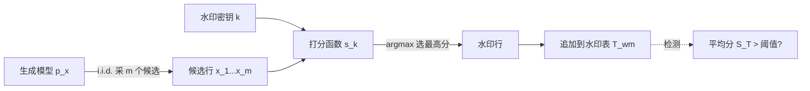

# MUSE: Model-Agnostic Tabular Watermarking via Multi-Sample Selection

**会议**: ICLR 2026  
**OpenReview**: [https://openreview.net/forum?id=R1QuNKyVOw](https://openreview.net/forum?id=R1QuNKyVOw)  
**代码**: 已开源（论文中提供链接）  
**领域**: AI 安全 / 合成数据水印 / 表格生成模型  
**关键词**: 表格数据水印, 生成式水印, 多采样选择, 分布保持, 模型无关  

## 一句话总结
MUSE 提出一种"多采样选择"的表格数据水印范式：对每行生成多个候选样本，用一个带密钥的打分函数挑出得分最高的那个，从而绕开扩散模型 DDIM 反演不可靠的难题，做到模型无关、可校准、低失真。

## 研究背景与动机
**领域现状**：表格生成模型（如 TabSyn、TabDDPM）已能合成高质量结构化数据，用于隐私保护、数据增广和缺失值填补；但合成数据被滥用（数据投毒、金融欺诈）的风险也随之上升，因此需要水印来实现溯源、归属验证与滥用检测。

**现有痛点**：早期表格水印走"编辑式"路线，直接改表格里的数值——但对离散/类别列改值极易制造出不存在的类别或把数值推过决策边界，破坏数据合法性。近期主流转向"生成式水印"，借鉴图像/视频扩散里的 DDIM 可逆性：用带图案的高斯噪声初始化生成，检测时反演回噪声看相关性（代表作 TabWak）。

**核心矛盾**：表格扩散模型的 DDIM 反演精度远低于图像/视频（论文 Figure 1 左）。原因是表格管线里塞了大量难以反演的组件——分位数归一化（非单射、不可逆）、VAE 解码器（反演只能靠优化、无完美保证）。检测时必须把整条管线逐步反演，误差层层累积，导致水印能否检出高度依赖具体模型实现，适用范围被严重限制。

**本文目标**：设计一个**不依赖任何反演**的表格水印范式，既要可检测、鲁棒，又要尽量不扰动原始数据分布。

**核心 idea**：作者注意到一个被忽视的事实——表格生成的算力远小于图像/视频（Figure 1 右），所以"为每行多采几个样再挑一个"在表格场景里非常廉价可行。**于是把水印从"改值/反演"转成"选择"**：生成 $m$ 个候选行，用带密钥的打分函数选出最高分的那个作为水印行。检测时只要统计整张表的平均得分是否显著偏高即可，全程无需反演。

## 方法详解

### 整体框架
MUSE 把每行水印拆成两步：先从模型分布 $p(x)$ 独立采 $m$ 个候选，再用密钥打分函数 $s_k(\cdot)$ 选最高分者（同分随机打破）作为水印行；重复 $N$ 次得到整张表，且 $N$ 组之间完全可并行。检测端只对整表算平均分 $S(T)=\frac{1}{N}\sum_i s_k(x_i)$，超过阈值即判为含水印。打分函数本身由两件事拼成——"怎么把选中列的值算成分数"（打分设计）和"选哪些列来打分"（列选择策略），两者的不同组合让 MUSE 在保真度、可检测性、鲁棒性之间灵活权衡。

### 关键设计

**1. 多采样选择范式：用"挑"代替"改"，彻底甩开反演。** MUSE 的根本转变是把水印从篡改数据值改成从多个合法候选中做选择。因为每个候选都是模型自己采出来的真实样本，所以无论选哪个都不会引入非法类别或越界数值，从源头规避了编辑式水印的合法性问题；又因为检测只看打分的统计偏移而非反演噪声，所以对底层模型的内部结构（VAE、分位数归一化等）完全无知，做到真正的"模型无关"——任何支持重复采样的表格生成器都能直接套用。

**2. 两种打分设计：在失真与鲁棒之间二选一。** 给定列选择函数 $\pi(x)$ 选出的列子集 $J$，作者给出两种把值映射成分数的方式。Joint-Vector（JV）把所有选中列拼成一个向量整体哈希：$h=H(\pi(x),k)$，$s^{JV}_k(x)=f(h)$；它工作在巨大的联合输入空间里，哈希碰撞极罕见，因此几乎不改变数据统计性质、失真最低，但"全有或全无"——任意一列被改动整个哈希就变，水印信号脆弱。Per-Column（PC）则对每列独立哈希再平均：$h_i=H(x_i,k)$，$s^{PC}_k(x)=\frac{1}{|J|}\sum_{i\in J}f(h_i)$；信号分散在多列上，删改部分列也能存活、鲁棒性强，代价是单列输入空间小、碰撞更频繁、统计偏差更集中即失真更高。其中 $f$ 是输出服从 Bernoulli(0.5) 的伪随机函数——把概率质量压在 0/1 两个极值上，能让"含水印 vs 不含水印"的二元信号分离度最大（Theorem 4.1 证明这是最优分布）。

**3. 列选择策略：JV 走自适应稀疏，PC 走全列。** JV 因为脆弱必须选稀疏的列以缩小攻击面，但固定一组稀疏列又会被对手猜中并定点抹除。作者用"分位数秩"来选列化解这个两难：对行内每列算其相对训练分布的归一化秩 $r_j=\frac{v_j-v_{\min,j}}{v_{\max,j}-v_{\min,j}}$（类别列用序号），把行内各列按秩排序后选落在固定分位集合 $Q$ 上的列——这样选中的物理列随行内容动态变化，难以预测。PC 则反其道而行，因为信号越多列越强、越鲁棒，直接 $\pi(x):=x$ 用上全部 $M$ 列。论文还补充：若 JV 的分位集合泄露会被定点擦除，可用带密钥的伪随机置换 $\pi_k$ 先打乱列序，让定位水印列等价于破解 PRP。

**4. 可校准性 + 分布保持的理论保证。** 检测的假阳率有上界 $\Pr(S(T_{\text{no-wm}})>S(T_{\text{wm}}))\le\exp\!\big(-\frac{N(\mu^m_{\text{wm}}-\mu_{\text{no-wm}})^2}{2}\big)$，并由此反解出：要把 FPR 压到目标 $\alpha$，所需重复采样数 $m\approx\max\big(2,\lceil\log_{0.5}(0.5-\sqrt{\frac{\log(1/\alpha)}{2N}})\rceil\big)$。这意味着 $m$ 随表行数 $N$ 增大而快速饱和——例如 0.01% FPR 下 $N\ge300$ 时 $m=2$ 就够，从而"只嵌入刚好够检测的信号"，把对生成质量的扰动降到最低。为进一步做到严格分布保持，作者引入**重复列掩码（Repeated Column Masking）**：缓存历史上已被用于嵌水印的列值，新样本若候选列值已出现过就跳过嵌入，避免列值复用带来的系统性偏差；Theorem 4.3 证明 $m=2$ 配合该机制可满足多样本分布保持（代价是可检测性略降，论文消融验证了这一权衡）。

## 实验关键数据

### 主实验表格（生成质量 + 可检测性，节选 Adult / Default / Shoppers）

| 数据集 | 方法 | Marg.↑ | Corr.↑ | C2ST↑ | MLE Gap↓ | AUC | T@0.1%F |
|--------|------|--------|--------|--------|----------|-----|---------|
| Adult | TabWak* | 0.933 | 0.879 | 0.713 | 0.085 | 0.999 | 0.942 |
| Adult | GS | 0.751 | 0.619 | 0.058 | 0.084 | 1.000 | 1.000 |
| Adult | **MUSE-JV** | **0.979** | **0.963** | **0.883** | **0.017** | 1.000 | 1.000 |
| Adult | MUSE-PC | 0.953 | 0.925 | 0.790 | 0.018 | 1.000 | 1.000 |
| Default | **MUSE-JV** | **0.983** | 0.925 | **0.963** | **0.002** | 1.000 | 1.000 |
| Default | TabWak* | 0.906 | 0.894 | 0.550 | 0.176 | 0.965 | 0.218 |
| Shoppers | **MUSE-JV** | **0.982** | **0.974** | **0.950** | 0.015 | 1.000 | 1.000 |

（"w/o WM"为不加水印的上界；性能增益以最强 baseline 为基准计算。）

### 关键发现
- **保真度大幅领先**：相比最强 baseline，MUSE 把保真度指标的失真率降低 **84–88%**，同时维持 **1.0 TPR@0.1%FPR** 的检测率——即几乎不损质量却能近乎完美检出。
- **JV vs PC 的权衡被实证**：MUSE-JV 在生成质量上全面最优（失真最低），MUSE-PC 质量略逊但换来对删行/删列/扰动攻击的更强鲁棒性，印证了"联合哈希低失真、逐列哈希高鲁棒"的设计动机。
- **GS（Gaussian Shading）的对照意义**：GS 检测率满分但生成质量崩塌（Adult 上 C2ST 仅 0.058），说明强检测信号若靠粗暴噪声注入会严重牺牲数据可用性，而 MUSE 用"选择"避开了这一困境。
- **$m$ 快速饱和**：理论与 Figure 3 显示，目标 FPR 越松、表越大，所需候选数越少，多数场景 $m=2\sim4$ 即可，开销极低。

## 亮点与洞察
- **把"算力便宜"转化为方法优势**：图像/视频水印离不开反演是因为重采样太贵；表格生成廉价这一点反而让"多采多选"成为可能，是一个反直觉但精准的切入点。
- **范式而非单点方法**：MUSE 把"打分设计 × 列选择"解耦成可插拔的两层，JV/PC 只是两个实例，留出了在质量-鲁棒谱系上自由滑动的空间。
- **理论闭环**：从 FPR 上界到 $m$ 的解析校准，再到重复列掩码的分布保持证明，方法不是经验调参而是有保证可控的。

## 局限与展望
- **依赖重复采样能力**：模型必须支持廉价的重复采样，对采样昂贵或一次性生成的模型不适用。
- **分布保持与检测力相互掣肘**：重复列掩码虽保证分布无偏，却会跳过部分嵌入从而削弱可检测性，二者无法兼得。
- **JV 的安全性依赖密钥保护**：分位集合一旦泄露即可定点擦除，需额外 PRP 置换来兜底；纯数值数据下全列微扰攻击仍需量化预处理缓解。
- **评测范围**：实验集中在 4–6 个经典表格数据集，面对超高维、强相关列或极端类别不平衡的真实场景，鲁棒性与失真表现仍待进一步验证。

## 相关工作与启发
- **生成式水印（图像/视频）**：Tree-Ring、Gaussian Shading 等依赖 DDIM 反演，MUSE 正是指出该思路移植到表格上的失效点并另辟蹊径。
- **TabWak**：把 DDIM 反演水印首次用到表格扩散，是本文的直接对照与改进对象。
- **LLM 水印的重复键掩码**（Hu et al. 2023、Dathathri et al. 2024）：MUSE 的"重复列掩码"分布保持机制正是从中借鉴而来，体现了序列级无偏水印思想的跨模态迁移。
- **启发**：当某条主流技术路线（反演）在新模态上水土不服时，回到任务本身的算力/统计特性找"另一种可利用的不变量"（这里是选择产生的统计偏移），往往比硬修旧路线更有效。

## 评分
- **新颖性**: ⭐⭐⭐⭐⭐ — "多采样选择"把表格水印从反演范式彻底切换到选择范式，思路新颖且切口精准。
- **实验充分度**: ⭐⭐⭐⭐ — 覆盖多数据集、质量/检测/鲁棒三维度对比，并有消融；但数据集规模和极端场景覆盖仍有限。
- **写作质量**: ⭐⭐⭐⭐ — 动机递进清晰、理论与方法衔接顺畅，图表支撑到位。
- **价值**: ⭐⭐⭐⭐ — 模型无关 + 低失真 + 可校准，对合成表格数据的溯源与版权保护有较强实用价值。

<!-- RELATED:START -->

## 相关论文

- [\[ICLR 2026\] LiteGuard: Efficient Task-Agnostic Model Fingerprinting with Enhanced Generalization](liteguard_efficient_task-agnostic_model_fingerprinting_with_enhanced_generalizat.md)
- [\[ICLR 2026\] Sample-Efficient Distributionally Robust Multi-Agent Reinforcement Learning via Online Interaction](sample-efficient_distributionally_robust_multi-agent_reinforcement_learning_via_.md)
- [\[ICLR 2026\] A Bayesian Nonparametric Framework for Private, Fair, and Balanced Tabular Data Synthesis](a_bayesian_nonparametric_framework_for_private_fair_and_balanced_tabular_data_sy.md)
- [\[ICLR 2026\] Co-LoRA: Collaborative Model Personalization on Heterogeneous Multi-Modal Clients](co-lora_collaborative_model_personalization_on_heterogeneous_multi-modal_clients.md)
- [\[ICLR 2026\] Memorization Through the Lens of Sample Gradients](memorization_through_the_lens_of_sample_gradients.md)

<!-- RELATED:END -->
