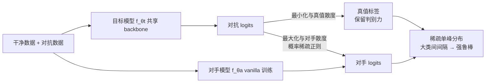

# Nasty Adversarial Training: A Probability Sparsity Perspective for Robustness Enhancement

**会议**: ICLR 2026  
**OpenReview**: [https://openreview.net/forum?id=eCXpA14KHd](https://openreview.net/forum?id=eCXpA14KHd)  
**代码**: 待确认  
**领域**: 对抗鲁棒性 / AI 安全  
**关键词**: 对抗训练, 鲁棒性, 概率稀疏, Nasty Training, 知识产权保护, 类间间隔  

## 一句话总结
本文把原本用于"防模型被蒸馏"的 Nasty Training 借来增强对抗鲁棒性：通过一个 vanilla 训练的"对手模型"做散度正则，逼迫目标模型输出**稀疏的概率分布**，从而拉大类间间隔、增大决策边界余量，以极低开销在 CIFAR / ImageNet 上取得 SOTA 鲁棒性，并给出了可解释的空间度量视角。

## 研究背景与动机
- **领域现状**：DNN 对抗样本脆弱性威胁安全部署，早期防御多依赖"梯度混淆"被自适应攻击攻破，目前最可靠的经验防御是对抗训练（AT）和鲁棒蒸馏（RD）。AT 变体众多（PGD-AT、TRADES、AWP、LAS-AT 等），但很少有人从**输出概率分布**的角度去归因鲁棒性。
- **现有痛点**：主流 AT 把注意力放在如何生成更强的内层对抗样本或加权重扰动，对"模型输出概率的形状如何影响鲁棒性"几乎没有解释；缺乏一个能把鲁棒性增益落到**几何/空间度量**上的可解释机制。
- **核心矛盾**：另一支看似无关的工作——Nasty Training（NT，原本为防止 teacher 被 student 蒸馏而生）会诱导**概率稀疏**，后续理论证明稀疏分布能阻碍蒸馏；但 NT 从未把这种稀疏性与对抗鲁棒性联系起来，这块潜力被完全忽视。
- **本文目标**：把"概率稀疏"从知识产权保护场景迁移到对抗防御，论证并实现"稀疏 ⇒ 更大类间间隔 ⇒ 更强鲁棒性"，并保持简单、低开销。
- **核心 idea**（**借力打力**）：在标准 AT 之上引入一个 vanilla 训练的**对手模型**做 nasty 正则——目标模型通过**最大化与对手输出分布的散度**获得概率稀疏，同时**最小化与真值标签的散度**保留判别力，把稀疏作为正则项嵌进对抗训练。

## 方法详解

### 整体框架
NAT = 标准对抗训练 + nasty 正则。除了主分类损失（交叉熵）外，额外引入一个与目标模型同架构、普通训练（vanilla）的**对手模型** $f_{\theta_a}$。在 min-max 对抗训练里，目标模型一边对干净/对抗数据做交叉熵拟合真值，一边**拉大自己与对手输出分布的 KL 散度**，从而把概率质量从"均匀铺在所有非目标类"压缩到少数语义相近类上，得到稀疏分布。总目标为

$$\min_{\theta_t}\sum_{(x_i,y_i)\in X\cup X'} \mathrm{XE}\big(\sigma(f_{\theta_t}(x_i)),y_i\big) - \omega_a \mathrm{KL}\big(\sigma_{\tau_a}(f_{\theta_t}(x_i)),\sigma_{\tau_a}(f_{\theta_a}(x_i))\big),$$

其中 $X'$ 是由内层最大化交叉熵生成的对抗样本集，$\omega_a$ 平衡分类与 nasty 正则。

### 关键设计

**1. Nasty 正则做对抗训练的稀疏化器：用"差异化"逼出单峰分布**。NAT 的核心是把 NT 的对手散度项搬进 AT。对手模型用 one-hot 标签普通训练，天然呈"单峰 + 均匀"的预测形态；目标模型被要求最大化与它的 KL 散度，于是不能照抄对手在非目标类上的均匀分布，只能把原本均匀铺开的概率质量重新分配到**少数与目标类相近、更"可压缩"的类**上，最终输出变得稀疏。交叉熵把质量推向目标类、nasty 项阻止它复制对手的均匀尾巴，两者合力得到稀疏单峰输出。作者还观察到稀疏后的次峰会落在语义相关类（如 cat 与 dog），说明模型抓的是更可泛化的语义而非过拟合。

**2. 高阶幂展开解释稀疏的来源：二阶项放大非目标类惩罚**。为回答"NT 为何会诱导稀疏"，作者对 nasty 项做 Taylor 展开。把 $\log(q^a_{i,c})$ 在 $q^t_{i,c}$ 处展开后，nasty 损失近似为一串高阶项：

$$L_{\text{Nasty}} \approx \frac{1}{N}\sum_{i,c}(q^a_{i,c}-q^t_{i,c}) - \frac{1}{2N}\sum_{i,c}\frac{(q^a_{i,c}-q^t_{i,c})^2}{q^t_{i,c}} + \frac{1}{3N}\sum_{i,c}\frac{(q^a_{i,c}-q^t_{i,c})^3}{(q^t_{i,c})^2}-\cdots$$

一阶项因概率和恒为 1 可忽略；**关键是二阶项**：分母 $q^t_{i,c}$ 越小（非目标类概率越低）正则权重越大，于是对非目标类的差异化惩罚被显著放大，把它们进一步压到 0，形成稀疏。高阶奇数项虽可能带反向效应，但被系数更大的偶数项压制。这一展开把"经验上看到的稀疏"落到了"高阶幂优化"的机制上。

**3. 空间度量解释鲁棒性增益：稀疏 ⇒ 大边界余量 + 大类间间隔**。作者进一步把稀疏与几何联系起来。概率稀疏意味着目标类 logit 远大于非目标类 $w_i x + b_i \gg w_j x + b_j$（用 $\gg$ 强调 Softmax/Sigmoid 饱和区带来的充分大间隔）。这直接对应两个空间度量：其一是**数据点到决策边界的距离** $D = \frac{|w_c\cdot x_i + b_c|}{\|w_c\|_2}$——由于权重范数被 L2 正则约束在有限范围，logit 的大幅变化主导了距离，故稀疏带来更大的点-边界距离；其二是**分类边界间最短距离**，用投影几何近似 $D^{i,j}_{\text{shortest}}=\|\gamma-(\gamma\cdot d_i)d_i\|_2$（$\gamma=w_j-w_i$，$d_i$ 为单位方向）。两者都说明：稀疏让样本离边界更远、让不同类超平面隔得更开，攻击者必须施加更大扰动才能跨类，从而鲁棒性更强——这是 NAT 给出的可解释链条，并在实验中用逐样本到边界距离做了定量验证。

## 实验关键数据

### 主实验（WRN-34-10，CIFAR，Avg. 为各攻击平均鲁棒性）

| 方法 | CIFAR10 Clean | CIFAR10 AA | CIFAR10 Avg. | CIFAR100 Clean | CIFAR100 AA | CIFAR100 Avg. |
|---|---|---|---|---|---|---|
| PGD-AT | 85.17 | 51.67 | 59.46 | 60.89 | 27.86 | 35.69 |
| TRADES | 85.72 | 53.40 | 60.28 | 58.61 | 25.94 | 33.00 |
| AWP | 85.57 | 53.90 | 61.74 | 60.38 | 28.86 | 37.00 |
| LAS-AWP | 87.74 | 55.52 | 58.80 | 64.89 | 30.77 | 39.86 |
| **NAT (best)** | **89.15** | 52.95 | **65.88** | **62.87** | **30.85** | 39.22 |
| **NAT (last)** | 87.33 | 50.23 | 65.44 | 61.18 | 29.14 | 37.88 |

- ResNet-18 上 NAT(best) CIFAR10 达 Clean **90.86** / Avg. **63.85**，CIFAR100 Avg. **39.26**，均超过 AGAIN-AWP、LAS-AT 等 SOTA。
- 在 ViT-Small + ImageNet100（附录）及黑盒攻击下结论一致：无论 CNN/ViT、低/高分辨率，NAT 鲁棒性均领先；且与 EDM 扩散数据增强兼容，可进一步提升。

### 消融实验（CIFAR-10）

| 消融维度 | 设置 | 结论 |
|---|---|---|
| nasty 系数 $\lambda$ | 0 → 0.12，步长 0.02 | 先升后降，**峰值在 $\lambda=0.06$**；$\lambda=0$（无 nasty）明显最差，证明稀疏正则确实有效 |
| 对手模型架构 | 不同结构对手 | 各种架构都能带来鲁棒性提升，提供灵活选择（附录 F） |
| 对手模型状态 | 随机初始化 / vanilla / AT / SAM | 各状态都有增益，但部分不呈"单峰+均匀"模式（附录 G） |

### 关键发现
- 引入 nasty 正则在**所有** $\lambda>0$ 取值下都优于 $\lambda=0$，说明增益来自稀疏机制本身而非调参侥幸。
- 鲁棒模型对语义相近类（dog/cat）给正 logit、对不相关类（automobile/ship）给负 logit，定量验证了"稀疏 ⇒ 更大边界距离 + 捕获不变语义"的空间度量假设。
- 开销极低：仅多一个固定的 vanilla 对手模型做前向，主体仍是标准 AT 流程。

## 亮点与洞察
- **跨场景迁移的巧思**：把"防蒸馏"的 Nasty Training 创造性地复用为对抗防御正则，是一次漂亮的概念迁移。
- **可解释性闭环**：从 Taylor 展开（稀疏从哪来）到空间度量（稀疏如何提升鲁棒）再到实验定量验证，给出了少见的"机制—几何—证据"完整链条。
- **简单且即插即用**：不改攻击生成、不引入复杂损失，只加一个对手散度项，易于和现有 AT / 数据增强叠加。

## 局限与展望
- 对手模型选 vanilla 同架构是经验最优，但"为什么单峰+均匀的对手最好"缺乏更深的理论刻画；不同对手状态的增益机制尚未统一解释。
- 空间度量分析建立在线性分类层 + 权重范数受限等近似假设上，对更复杂 head / 非线性边界的适用性需进一步验证。
- 主结果集中在 CIFAR 与 ImageNet100，更大规模数据集、更强自适应/集成攻击下的稳定性仍待扩展。
- 多一个对手模型虽开销小，但在超大模型上的额外前向成本与显存占用仍需权衡。

## 相关工作与启发
- **对抗训练谱系**：PGD-AT、TRADES、MART、AWP、LAS-AT、AGAIN 等，NAT 与它们正交——它不改内层攻击，而是从输出分布形状切入，可与这些方法及 EDM/扩散增强组合。
- **Nasty Training / 鲁棒蒸馏**：源自模型 IP 保护（Ma et al. 2021/2022），本文揭示其概率稀疏的副产物对鲁棒性有价值，启发"把防御以外场景的副作用反向利用"的研究范式。
- **启发**：输出概率的"形状"（稀疏度、峰结构）可能是鲁棒性的一个被低估的可控旋钮；用 Taylor 展开把正则项拆成高阶幂来理解其偏好，是分析散度类损失的通用工具。

## 评分
- 新颖性: ⭐⭐⭐⭐ 把防蒸馏的概率稀疏迁移到对抗鲁棒，并给出空间度量解释，视角新颖
- 实验充分度: ⭐⭐⭐⭐ 覆盖 CIFAR10/100、ImageNet100、CNN/ViT、白盒/黑盒、多消融，主结果 SOTA，部分依赖附录
- 写作质量: ⭐⭐⭐⭐ 机制—几何—验证链条清晰，公式推导完整，图表规范
- 价值: ⭐⭐⭐⭐ 低开销即插即用且可解释，对 AT 社区有实用与启发双重价值

<!-- RELATED:START -->

## 相关论文

- [\[ICLR 2026\] Concept-based Adversarial Attack: a Probabilistic Perspective](concept-based_adversarial_attack_a_probabilistic_perspective.md)
- [\[ICLR 2026\] On the Interaction of Compressibility and Adversarial Robustness](on_the_interaction_of_compressibility_and_adversarial_robustness.md)
- [\[CVPR 2026\] Robustness Under Data Scarcity: Few-Shot Continual Adversarial Training for Evolving Threats](../../CVPR2026/ai_safety/robustness_under_data_scarcity_few-shot_continual_adversarial_training_for_evolv.md)
- [\[ICLR 2026\] FERD: Fairness-Enhanced Data-Free Adversarial Robustness Distillation](ferd_fairness-enhanced_data-free_adversarial_robustness_distillation.md)
- [\[CVPR 2026\] Taming the Long Tail: Rebalancing Adversarial Training via Adaptive Perturbation](../../CVPR2026/ai_safety/taming_the_long_tail_rebalancing_adversarial_training_via_adaptive_perturbation.md)

<!-- RELATED:END -->
