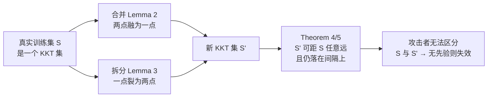

# No Prior, No Leakage: Revisiting Reconstruction Attacks in Trained Neural Networks

**会议**: ICLR 2026  
**OpenReview**: [https://openreview.net/forum?id=7wjFjOzCtB](https://openreview.net/forum?id=7wjFjOzCtB)  
**代码**: 待确认  
**领域**: AI 安全 / 隐私（训练数据重构攻击的理论分析）  
**关键词**: 重构攻击, 隐私泄露, 隐式偏置, 最大间隔, KKT 条件, 同质 ReLU 网络  

## 一句话总结
本文从"防守"视角重新审视基于隐式偏置的训练数据重构攻击，**严格证明在没有数据先验知识的情况下，攻击目标函数存在无穷多个彼此无法区分、且可任意远离真实训练集的全局最优解**，进而说明此类攻击的"成功"本质上依赖外部先验而非隐式偏置本身泄露的信息。

## 研究背景与动机
- **领域现状**：神经网络会记忆训练数据，近期 Haim et al. (2022)、Buzaglo et al. (2023) 等工作展示了一类令人警觉的攻击——仅凭模型参数（无需梯度或查询）就能从同质 ReLU 网络中重构出大量真实训练样本。其原理是利用 logistic/exponential 损失下梯度流的**隐式偏置**：网络会收敛到最大间隔问题的 KKT 点，攻击者据此构造目标函数并优化还原数据。
- **现有痛点**：尽管经验上效果惊人，这类攻击**缺乏严格的理论基础**。Haim et al. 自己也坦言"不清楚为什么优化问题会收敛到真实训练样本，因为解并不唯一，尤其在不使用先验时"。Smorodinsky et al. (2025) 给出的保证又依赖单变量分布等过强假设。
- **核心矛盾**：人们普遍认为"训练越充分、隐式偏置满足得越好 → 隐私越危险"。但隐式偏置施加的 KKT 约束究竟在多大程度上泄露了训练数据，从未被严格刻画。
- **本文目标**：不去设计更强的攻击，而是反向分析现有重构方法的**内在缺陷与失效条件**，厘清"何时训练集泄露才真正可能发生"。
- **核心 idea**：**【去先验后解不唯一】** 一旦从攻击目标 (Eq.5) 中剥离先验项 $L_{\text{prior}}$，剩下的 KKT 损失存在**无穷多个全局最优解**，可通过"合并/拆分"操作显式构造出与真实训练集任意远的候选集，攻击者无法区分真伪——**先验知识才是攻击成功的关键，隐式偏置本身并不泄露训练数据**。

## 方法详解

### 整体框架
本文不提出新攻击，而是对 Haim et al. (2022) 攻击目标函数（去掉先验项后的 KKT 损失 $L_{\text{KKT}} = \gamma_1 L_{\text{stationary}} + \gamma_2 L_\lambda$）的**解空间几何**做严格刻画。论证分两层递进：先在"网络精确收敛到 KKT 点"的理想设定下证明全局最优解无处不在且可任意远离真实集（§3.1），再放宽到"近似 KKT 点"的现实设定证明同样结论（§3.2），最后用合成数据与 CIFAR 实验验证"先验越弱、重构越差"（§4）。

### 关键设计
**1. 合并与拆分：构造性地枚举等价全局解。** 论文的技术核心是两条引理，它们说明 KKT 集（即令 $L_{\text{KKT}}=0$ 的样本集）可以被"原地改写"而不破坏最优性。**合并**（Lemma 2）指出：若两点 $x_1, x_2$ 标签相同、激活模式相同且对应乘子 $\lambda_1,\lambda_2>0$，则存在 $\alpha\in(0,1)$ 使凸组合 $x_{1.5}=\alpha x_1+(1-\alpha)x_2$ 单独构成的新集合仍是 KKT 集；**拆分**（Lemma 3）则反向：一个点 $x_1$ 可沿任意方向 $\nu$ 裂成 $z_1=x_1+\alpha\nu$、$z_2=x_1-\beta\nu$，只要二者保持与 $x_1$ 相同的激活模式与分类。这正面回答了 Haim et al. 留下的疑问——**解不是唯一的，而是无处不在的**；攻击优化收敛到的"训练样本"完全可能是多个真实样本的插值。

**2. 无界距离定理：解可任意远离真实训练集。** 仅有合并/拆分还不够量化危害程度。**Theorem 4** 在"训练样本不张成整个数据域"（$\mathrm{span}\{x_1,\dots,x_n\}\subsetneq\mathbb{R}^d$，这对 MNIST 等大量黑像素数据天然成立）的假设下证明：对任意 $r>0$，都存在 KKT 集 $S_r$ 使 $d(S,S_r)>r$，且 $S_r$ 中所有点都恰好落在间隔上（$|\Phi(\theta;x_r)|=p$）。这构成"双重防御"：即便间隔值 $p$ 泄露，攻击者也无法借此把真集从无穷多候选集里挑出来。**Theorem 5** 进一步放宽到"数据近似位于线性子空间"的情形，给出单点可拆分的最小距离下界 $\min_{j\in[k]}\frac{|D_j(x_i)|\cdot\|w_j\|}{\sum_i\lambda_i}\cdot\frac{1}{\gamma}$，并证明该自由度由数据矩阵最小奇异值 $\sigma_d$ 控制——数据云越"扁"，可改写的空间越大。

**3. 近似 KKT 推广：现实网络只是逼近 KKT 点也照样失效。** 真实网络通常只逼近而非精确达到 KKT 点，作者引入 $(\varepsilon,\delta)$-KKT 松弛（stationary 残差 $\le\varepsilon$、互补松弛残差 $\le\delta$），并把合并/拆分推广为 Lemma 6/7。在攻击者**对 $\delta$ 一无所知**时，Theorem 8 给出拆分预算 $\min_{j\in[k]}\frac{|D_j(x_l)|\|w_j\|}{\varepsilon+\gamma|v_j|\sum_i\lambda_i}$；在攻击者**已知 $\delta$ 上界**时，Theorem 9 量化拆分会使 $\delta$ 退化 $\Delta\delta=\lambda_l(\alpha_l+\beta_l)\sum_{j}|v_j|(\varepsilon+\gamma|v_j|\sum_i\lambda_i)$。关键结论是：当 $\gamma\to 0$ 且网络越接近 KKT 点（训练越充分），可拆分自由度越大、攻击越不可靠——**与"训练越好越危险"的直觉相反，结构化数据上的良好训练网络反而更安全**。

**4. 把"先验"操作化为初始化分布。** 实验上作者把抽象的"先验知识"具体建模为"知道数据域边界"，并通过攻击候选点的**初始化分布**注入：例如自然图像先验 = 知道像素落在 $[0,1]^d$，攻击者就只在该范围内初始化。通过让初始化球面半径偏离真实数据域、或给 CIFAR 训练集加一个秘密偏移量，即可连续调节"先验强弱"，从而干净地解耦"数学约束的贡献"与"外部先验的贡献"。

## 实验关键数据

### 主实验（合成数据：先验越弱重构越差）

| 设定 | 配置 | 现象 |
|------|------|------|
| 数据 | 500 个样本（每类 250）均匀分布于 $S^{783}\subset\mathbb{R}^{784}$，按首坐标符号标注 | — |
| 网络 | 2 层、宽 1000 ReLU，训练 500K epoch，最终训练损失 $10^{-7}$ | 强满足隐式偏置 |
| 攻击 | 候选点初始化于不同半径球面（半径 = 先验强弱） | KKT 目标值都在 330–332，**几乎相同** |
| 结果 | 记录 5 个最优重构与真实集的平均距离 | **半径越偏离真实域，重构误差越大** |

### CIFAR 实验（超出理论框架的现实架构）

| 设定 | 现象 |
|------|------|
| 与 Haim et al. 相同的 3 层架构 + CIFAR，训练集按不同幅度平移（= 不同先验强度） | 攻击先验越弱，结果**迅速劣化** |
| 重构结果 | 明显呈现"多个训练样本的平均/插值"形态，与理论预言（收敛到插值解）一致 |

### 关键发现
- **同样接近最优、重构质量天差地别**：所有 run 的 KKT 目标值几乎相等（330–332），但重构质量随初始化剧烈变化，说明在无先验时"接近全局最优"根本不等价于"还原真实样本"。
- **重构 ≈ 训练样本的插值**：CIFAR 上攻击收敛到的解形似多个训练实例的平均，实证了"拆分/合并"理论。
- **训练越充分越安全**：$\gamma\to0$、网络越接近 KKT 点时攻击越不可靠，调和了"隐私"与"强泛化"之间看似不可兼得的张力。
- **秘密偏移即可防御**：即便攻击者知道大致数据域，只要训练集被一个秘密偏置平移，隐私风险就被大幅削弱。

## 亮点与洞察
- **视角新颖**：在"军备竞赛式造更强攻击"的主流叙事里反其道而行，转而证明攻击的失效边界，给隐私研究提供了难得的"防守方理论"。
- **直接回应未解之问**：正面解答了 Haim et al. (2022) 自己提出的"为何无先验也能收敛到真样本"——答案是解无处不在、并非唯一，无先验时攻击实则失败。
- **反直觉结论可落地**：把"训练越充分越危险"纠正为"结构化数据上良好训练反而更安全"，并提出"秘密偏移训练集"这一无需噪声注入、与差分隐私互补的轻量缓解思路。
- **理论—实验闭环**：把抽象"先验"操作化为初始化分布，使纯理论结论可被合成数据与 CIFAR 直接验证。

## 局限与展望
- **设定受限**：核心定理主要针对 2 层（部分 3 层）同质 ReLU 网络、二分类与间隔上的点，与现代深度架构、多分类、非同质网络仍有距离。
- **"不张成全域"假设**：Theorem 4 的无界距离依赖训练数据不张成整个域；虽对 MNIST 等成立，但并非普适，Theorem 5 的近似版引入了对最小奇异值的依赖。
- **自适应攻击者未覆盖**：作者指出若攻击者能**估计真实先验**则仍可高效攻击，如何刻画并防御这类自适应对手留作未来工作。
- **防御只是启发**："秘密偏移"等缓解手段缺乏形式化的隐私保证（不同于差分隐私的最坏情况界），距实用防御协议尚有距离。

## 相关工作与启发
- **隐式偏置重构攻击**：Haim et al. (2022)、Buzaglo et al. (2023) 利用最大间隔 KKT 条件做优化式重构，本文是对其目标函数解空间的严格"祛魅"。
- **可靠性质疑**：Runkel et al. (2024) 经验上发现重构对初始化高度敏感、会生成貌似真实但不存在的样本；本文为该现象提供了缺失的理论支撑。
- **差分隐私**：作为"金标准"的 DP（Dwork et al.；Abadi et al. 2016）靠噪声注入提供最坏情况保证；本文不注入噪声，而是从机理上理解隐式偏置漏洞以便规避，构成互补路线。
- **启发**：评估"模型能否泄露训练数据"时，必须把"攻击者外部先验"与"模型内禀信息"严格区分开——很多看似来自模型的泄露，实则来自攻击者预先注入的领域知识。

## 评分
- **新颖性**: ⭐⭐⭐⭐⭐ —— 反向论证攻击失效条件、正面回答前作公开疑问，并给出反直觉的"训练越好越安全"结论，视角与结果都很独到。
- **实验充分度**: ⭐⭐⭐ —— 合成数据 + CIFAR 干净地验证了"先验越弱重构越差"，但实验规模和架构覆盖偏小，定位是"理论的佐证"而非大规模实证。
- **写作质量**: ⭐⭐⭐⭐ —— 动机清晰、定理层层递进（理想 KKT → 近似 KKT）、合并/拆分配图直观，理论密度高但脉络明确。
- **价值**: ⭐⭐⭐⭐ —— 为重构攻击的可靠性争论提供了坚实理论基础，并启发"秘密偏移"等无需噪声的缓解方向，对隐私安全社区有切实指导意义。

<!-- RELATED:START -->

## 相关论文

- [\[ICLR 2026\] ReTrace: Reinforcement Learning-Guided Reconstruction Attacks on Machine Unlearning](retrace_reinforcement_learning-guided_reconstruction_attacks_on_machine_unlearni.md)
- [\[CVPR 2026\] PGA: Prior-free Generative Attack for Practical No-box Scenario](../../CVPR2026/ai_safety/pga_prior-free_generative_attack_for_practical_no-box_scenario.md)
- [\[ICLR 2026\] Robust Spiking Neural Networks Against Adversarial Attacks](robust_spiking_neural_networks_against_adversarial_attacks.md)
- [\[ICLR 2026\] Time Is All It Takes: Spike-Retiming Attacks on Event-Driven Spiking Neural Networks](time_is_all_it_takes_spike-retiming_attacks_on_event-driven_spiking_neural_netwo.md)
- [\[ICLR 2026\] Tug-of-War No More: Harmonizing Accuracy and Robustness in Vision-Language Models via Stability-Aware Task Vector Merging](tug-of-war_no_more_harmonizing_accuracy_and_robustness_in_vision-language_models.md)

<!-- RELATED:END -->
