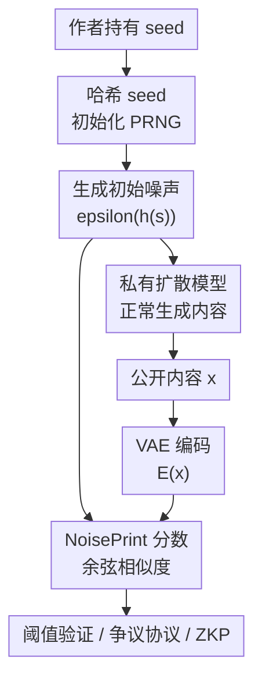

# NoisePrints: Distortion-Free Watermarks for Authorship in Private Diffusion Models

**会议**: ICLR2026  
**OpenReview**: [https://openreview.net/forum?id=gwHCXvPDBd](https://openreview.net/forum?id=gwHCXvPDBd)  
**代码**: 待确认  
**领域**: AI安全 / 生成式水印 / 版权保护  
**关键词**: 扩散模型水印, 作者身份验证, 随机种子, 零知识证明, 版权保护

## 一句话总结
NoisePrints 把扩散模型生成时的随机种子当作天然作者指纹，通过哈希种子生成初始噪声并与生成内容的 VAE latent 做相关性验证，在不改模型、不改采样、不做反演的前提下实现图像和视频生成内容的轻量级作者身份验证。

## 研究背景与动机
**领域现状**：图像和视频扩散模型已经成为视觉内容生产的核心工具，随之而来的作者身份、版权归属和生成来源验证问题也越来越突出。现有水印方法大致分为生成后嵌入、生成过程中修改采样或模型、以及在噪声/latent 空间植入特定模式几类，它们通常把可验证信号显式塞进图像或反推回初始噪声。

**现有痛点**：这些方法在私有扩散模型场景下并不理想。很多方法需要访问模型权重、推理代码或反演过程，而私有模型的所有者可能不愿意公开模型，也未必能作为可信裁判参与版权争议。另一些方法虽然可部署，但会改变生成分布、影响画质，或者需要 DDIM inversion 这类昂贵验证过程；到视频模型这种高维输出上，反演成本会进一步放大。

**核心矛盾**：作者身份验证希望水印足够强、验证足够快、且不破坏输出分布；但传统做法往往要在这三者之间牺牲一项。若把额外模式写进图像，容易产生失真或被再生成攻击擦除；若依赖反演，验证者需要模型和大量算力；若只靠服务商日志，又不适合第三方争议仲裁。

**本文目标**：论文希望构造一种适合私有扩散模型的作者证明机制：生成过程不插入额外扰动，验证时不需要模型权重，只用公开编码器、生成结果和作者持有的秘密种子即可判断“这个内容是否由这个 seed 生成”。进一步地，作者还希望 seed 不必暴露给验证者，从而降低水印被移除或被冒用的风险。

**切入角度**：本文的关键观察是，扩散/flow 模型的初始 Gaussian noise 并不会在去噪过程中完全消失，而会在最终图像或视频 latent 中留下可测的相关性。也就是说，随机种子本身就像一枚天然的“噪声指纹”。如果这个指纹足够稳定，作者就不需要额外嵌入水印，只需证明自己知道对应 seed。

**核心 idea**：NoisePrints 用加密哈希后的 seed 生成初始噪声，把初始噪声与生成内容的 VAE 表示之间的余弦相似度作为所有权分数；如果分数超过按极低误报率校准的阈值，就接受作者声明。

## 方法详解
### 整体框架
NoisePrints 的生成阶段几乎什么都不改：作者选择一个秘密 seed，先经过单向哈希，再初始化 PRNG 采样 Gaussian noise，随后用私有扩散/flow 模型正常生成图像或视频。验证阶段则完全绕开私有模型，只把候选内容送入公开或黑盒可访问的 VAE encoder，得到 latent 表示，再和 seed 重新生成的初始噪声计算相关性。

这个流程的重点不是把水印写进图像，而是把“seed 与输出之间自然残留的相关性”变成可验证证据。哈希函数防止攻击者直接从内容反推出可用 seed，阈值校准控制随机碰撞概率，争议协议处理几何变换和注入式伪造，零知识证明则用于在不泄露 seed 的条件下证明自己确实知道一个通过验证的 seed。

### 关键设计
**1. Seed-as-watermark：把初始噪声当作不失真的作者指纹**

传统水印常常需要修改生成轨迹或输出像素，因此要么引入分布偏移，要么需要后处理嵌入。NoisePrints 反过来利用扩散模型已有的随机性：seed 经过哈希 $h(s)$ 后初始化 PRNG，得到初始噪声 $\epsilon(h(s)) \sim \mathcal{N}(0, I)$，再由私有扩散模型正常去噪得到输出 $x$。生成端不插入任何额外模式，也不改变模型权重或采样步骤，所以输出分布理论上与原模型一致。

这个设计成立的经验基础是：最终内容的 VAE latent $E(x)$ 与真实初始噪声之间的相似度显著高于随机噪声。作者把这种持久相关性称为 NoisePrint。对私有模型尤其重要的是，验证者不需要知道扩散模型权重，只需要能把图像编码到共享 latent 空间，并知道 PRNG 与哈希规则。

**2. 哈希种子与阈值校准：把随机撞库概率压到密码学级别**

如果直接使用原始 seed，攻击者可能通过搜索或构造方式让某个 seed 与目标内容相关。论文因此先用加密哈希 $h(s)$ 处理 seed，再用哈希输出初始化 PRNG。哈希需要满足确定性、高效、抗碰撞、抗原像攻击和近似均匀输出，从而让攻击者难以从图像内容反推有效 seed。

验证分数定义为内容 latent 和初始噪声的余弦相似度：

$$
\phi(x, s) = \frac{\langle E(x), \epsilon(h(s)) \rangle}{\|E(x)\|_2 \|\epsilon(h(s))\|_2}.
$$

若 $\phi(x,s) \ge \tau$，验证者接受作者声明。阈值 $\tau$ 不是拍脑袋设定，而是按随机高维向量落入球冠的概率校准。在独立随机 seed 下，内积大于阈值的概率近似随维度指数下降，论文给出上界：

$$
\Pr[\phi \ge \tau] \le \exp\left(-\frac{d-1}{2}\tau^2\right).
$$

实验中阈值按 $\delta=2^{-128}$ 的目标误报率设置，意味着攻击者随机尝试 seed 命中的概率达到密码学意义上的不可行。

**3. 争议协议：处理几何变换和注入式伪造**

单纯验证 $(x,s)$ 仍有两个边界问题：几何变换会打乱内容和初始噪声的对齐，水印注入者也可能对修改后的图像找到一个能通过验证的伪 seed。为此，论文提出 dispute protocol：每个声明者提交三元组 $(x_i, s_i, g_i)$，其中 $g_i$ 是公开变换族中的可选变换，例如旋转或裁剪逆变换。

扩展分数写作：

$$
\phi(x, s; g) = \frac{\langle E(g\cdot x), \epsilon(h(s)) \rangle}{\|E(g\cdot x)\|_2 \|\epsilon(h(s))\|_2}.
$$

验证者同时检查 self check 和 cross check：声明者自己的内容与 seed 要过阈值，声明者的 seed 对对方内容经过其提交变换后也要过阈值。真正作者在遭遇几何变换时可以提交反向对齐变换恢复相关性；单纯注入者即使能让修改图像与伪 seed 相关，也很难让原图与伪 seed 同时相关。

**4. 零知识证明：证明拥有 seed 但不泄露 seed**

如果作者把 seed 直接交给验证者，seed 泄露后可能被他人用来再次声明所有权，或者用于更精准地移除水印。论文因此把 NoisePrint 验证写成一个零知识证明电路：私有 witness 是 seed，公开输入是图像和阈值，电路内部从 seed 派生噪声、计算余弦相似度，并输出是否超过阈值。

进一步地，作者建议把 seed 分成公开描述字符串和私有随机值两部分。公开字符串可以描述图片和所有权，例如“由某公司生成的某张猫图”，私有随机值保证不可猜测，二者拼接后输入哈希函数。这样 ZKP 不仅证明“我知道某个 seed”，还把证明绑定到特定用户或声明语义上。

### 一个完整示例
假设一个小型创作者用私有 SDXL 微调模型生成了一张海报，并保存 seed `s`。生成时，系统先计算 $h(s)$，用它初始化 PRNG 采样初始噪声，正常跑扩散采样得到图片 $x$。几个月后，另一个人声称这张图来自自己的系统。

创作者把图片 $x$ 和 seed 相关证明提交给第三方验证者。验证者无需拿到私有 SDXL 权重，只用公开 VAE encoder 得到 $E(x)$，再用同一哈希和 PRNG 从 seed 重建 $\epsilon(h(s))$，计算 $\phi(x,s)$。如果分数超过对应 latent 维度下 $2^{-128}$ 误报率阈值，声明成立。

如果对方上传的是裁剪或旋转后的版本，创作者可以在争议协议中提交对应的反向几何变换。验证者把对方图片对齐后再算 cross check；若创作者 seed 同时解释原图和变换图，而对方伪 seed 只能解释自己的改图，就判定创作者胜出。

### 损失函数 / 训练策略
NoisePrints 本身没有训练损失，也不需要微调生成模型。它的“训练策略”更准确地说是部署策略：生成时记录 seed 并使用哈希后的 seed 初始化噪声；验证时用固定 VAE encoder 和 PRNG 计算分数；阈值按目标 FPR 和 latent 维度解析或数值求解。

核心超参是阈值 $\tau$。论文将目标误报率设为 $\delta=2^{-128}$，再根据随机高维向量相关性分布求阈值。对不同模型，latent 维度越大，阈值越低，因为随机相关性集中得更靠近 0；但真实 NoisePrint 分数仍明显高于阈值。

## 实验关键数据

### 主实验
论文先测试无攻击情况下的验证可靠性。图像模型包括 SD2.0、SDXL、Flux.1-schnell、Flux.1-dev，视频模型包括 Wan2.1。所有模型都在极低误报率 $2^{-128}$ 下保持约 0.99 到 1.00 的通过率。

| 模型 | latent 维度 | 平均 NoisePrint 分数 | 阈值 $\tau$ | 通过率 |
|------|-------------|----------------------|-------------|--------|
| SD2.0 | 16,384 | 0.482 ± 0.088 | 0.101739 | 1.00 |
| SDXL | 65,536 | 0.431 ± 0.070 | 0.051000 | 0.99 |
| Flux.1-schnell | 262,144 | 0.197 ± 0.056 | 0.025500 | 0.99 |
| Flux.1-dev | 262,144 | 0.202 ± 0.055 | 0.025500 | 0.99 |
| Wan2.1 | 1,297,920 | 0.0678 ± 0.0247 | 0.011460 | 1.00 |

第二个关键结果是验证速度。传统 baseline 如 WIND、PRC、Gaussian Shading 需要 DDIM inversion；NoisePrints 只需要一次 VAE encode 和一个余弦相似度。余弦相似度本身约 0.1 毫秒量级，避免了数秒到数十秒的反演开销。

| 模型 | VAE 编码耗时 | 反演耗时（WIND/PRC/GS） | NoisePrint 余弦相似度 |
|------|--------------|--------------------------|-------------------------|
| SD2.0 50 steps | 0.037 ± 0.004 s | 3.234 ± 0.075 s | 0.182 ± 0.045 ms |
| SDXL 50 steps | 0.152 ± 0.007 s | 12.704 ± 0.303 s | 0.090 ± 0.018 ms |
| Flux-dev 20 steps | 0.158 ± 0.007 s | 33.594 ± 0.245 s | 0.098 ± 0.005 ms |
| Flux-schnell 4 steps | 0.155 ± 0.006 s | 6.673 ± 0.055 s | 0.100 ± 0.011 ms |
| Wan2.1 25 steps | 6.463 ± 0.102 s | 91.473 ± 0.164 s | 0.097 ± 0.010 ms |

### 消融实验
论文没有用传统“去模块”消融表呈现，但围绕攻击类型比较了关键机制的效果：基本后处理、再生成攻击、定向反演攻击、几何变换争议协议分别对应不同威胁。这里把核心鲁棒性结果整理为机制级分析。

| 场景 / 机制 | 关键指标 | 说明 |
|-------------|----------|------|
| 无攻击验证 | pass rate 0.99-1.00 | 真实 seed 与内容 latent 的相关性显著高于 $2^{-128}$ FPR 阈值 |
| 基本图像处理 | 多数合理质量攻击下 TPR > 0.9 | 亮度、模糊、压缩、resize 等不会完全抹去 seed 相关性 |
| SDEdit 再生成攻击 | 优于 inversion-based baseline | 即便用不同基础模型再生成，NoisePrint 仍能保持较强验证信号 |
| 几何变换 + 争议协议 | 对齐后 100% 过阈值 | rotation、crop & scale 这类攻击可通过提交反向变换恢复 latent 对齐 |
| 定向 DDIM inversion 攻击 | 仍大幅优于 baseline，但更具威胁 | 攻击直接最小化与初始噪声的相关性，是当前更强边界条件 |

### 关键发现
- seed 与输出 latent 的相关性在多种扩散/flow 模型上都稳定存在；即使视频模型 Wan2.1 的平均分数更低，其巨大 latent 维度也让阈值更低，最终仍能达到 1.00 pass rate。
- 验证速度是最实用的优势：baseline 的瓶颈在反演，视频模型上可到 91 秒量级；NoisePrints 把主要成本变成一次编码，余弦相似度本身几乎可以忽略。
- 基本后处理和 SDEdit 再生成攻击下，NoisePrints 保持较好 TPR；但 DDIM inversion 定向优化说明，如果攻击者专门针对相关性分数优化，水印信号仍可能被明显削弱。
- 几何变换不是靠单次分数硬扛，而是靠 dispute protocol 中的显式对齐解决，这让方法边界更清楚，也避免把所有鲁棒性都压在一个阈值上。

## 亮点与洞察
- **把随机性变成权属凭证**：最巧妙的地方是没有“嵌入”水印，而是发现扩散生成的初始噪声本身已经在输出中留下指纹。这让方法天然避免分布偏移，也避免很多水印方法的画质损失争议。
- **验证协议很适合私有模型**：只用 seed、输出、VAE encoder 和 PRNG 规则，不要求第三方持有私有 diffusion weights。对小团队和个人模型所有者来说，这比依赖平台日志或开放模型权重要现实得多。
- **安全分析和实验配合紧密**：随机伪造 seed 的概率用高维球冠概率控制，真实 seed 通过率用多模型实验验证，两者合起来解释了为什么可以把阈值设到 $2^{-128}$ 这种极低 FPR。
- **可以作为水印系统的第一道筛选器**：即使某些争议场景仍需要更重的验证，NoisePrints 也能作为快速 pre-filter，先排除大量明显无效声明，再把少数复杂 case 交给更昂贵的反演或人工审计。

## 局限与展望
- 方法依赖验证者能访问合适的 VAE encoder。如果 VAE 也是私有且服务商不配合，第三方验证就会受限；如果不同 VAE 编码空间差异很大，相关性分数也可能不稳定。
- 它不是通用 real/fake 检测器。真实图片也可能被攻击者注入与某个 seed 相关的模式，因此 NoisePrints 更适合“证明我生成过这个内容”，而不是“判断这张图是否 AI 生成”。
- 争议协议只覆盖预定义的几何变换族。更复杂的质量保持编辑、局部重绘或语义级再创作，可能既保留外观又破坏原始 NoisePrint，这部分仍是开放问题。
- 作者身份与语义变体之间还有距离。若某个视频或图像只是语义上类似原作，但像素/latent 已发生较大变化，NoisePrints 不适合追溯这种“灵感来源”或“派生创作”的所有权。

## 相关工作与启发
- **vs WIND / PRC / Gaussian Shading**: 这些方法依赖噪声或 latent 水印并通过反演验证，鲁棒性强但验证昂贵、需要模型访问。NoisePrints 不做反演，验证轻量，但也更依赖 seed 与内容 latent 的自然相关性。
- **vs post-hoc 图像水印**: 后处理水印部署简单，但容易被再生成、压缩或隐写分析破坏。NoisePrints 绑定生成过程的初始随机性，不在像素中额外藏模式，因此更难通过简单平均或模板提取去除。
- **vs 平台日志 / API 侧审计**: 平台日志可以证明某次调用，但要求服务提供方可信且持续可用。NoisePrints 把证明材料交给内容生成者自己保存，更适合私有模型和第三方争议解决。

## 评分
- 新颖性: ⭐⭐⭐⭐⭐ 直接把扩散初始 seed 与输出 latent 的自然相关性变成水印信号，切入点简洁且有辨识度。
- 实验充分度: ⭐⭐⭐⭐ 多模型、图像/视频、后处理、再生成和定向攻击都有覆盖，但更强语义编辑和跨 VAE 场景仍可继续扩展。
- 写作质量: ⭐⭐⭐⭐ 威胁模型、协议、安全分析和实验逻辑清楚，部分细节依赖 appendix，主文对实现参数还可以更集中。
- 价值: ⭐⭐⭐⭐⭐ 私有生成模型的版权/作者证明是高需求场景，方法轻量、无失真、可和现有水印方案互补，实用潜力很高。

<!-- RELATED:START -->

## 相关论文

- [\[ICLR 2026\] EigenScore: OOD Detection using Posterior Covariance in Diffusion Models](eigenscore_ood_detection_using_posterior_covariance_in_diffusion_models.md)
- [\[ICLR 2026\] Traceable Black-box Watermarks for Federated Learning](traceable_black-box_watermarks_for_federated_learning.md)
- [\[CVPR 2026\] GROW: Watermark Generation with Progressive Guidance for Diffusion Models](../../CVPR2026/ai_safety/grow_watermark_generation_with_progressive_guidance_for_diffusion_models.md)
- [\[CVPR 2026\] Towards Human-Imperceptible Backdoor Attacks on Text-to-Image Diffusion Models](../../CVPR2026/ai_safety/towards_human-imperceptible_backdoor_attacks_on_text-to-image_diffusion_models.md)
- [\[ACL 2025\] Quantifying Misattribution Unfairness in Authorship Attribution](../../ACL2025/ai_safety/quantifying_misattribution_unfairness_in_authorship_attribution.md)

<!-- RELATED:END -->
