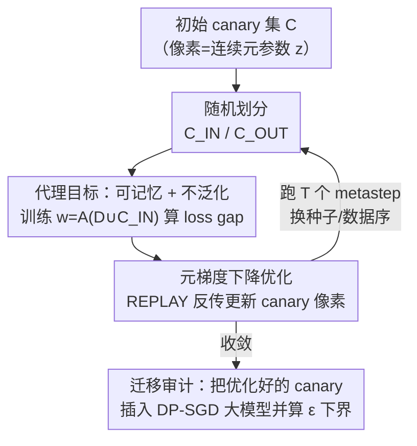

# Optimizing Canaries for Privacy Auditing with Metagradient Descent

**会议**: ICLR 2026  
**OpenReview**: [https://openreview.net/forum?id=3xkYXuHDA6](https://openreview.net/forum?id=3xkYXuHDA6)  
**代码**: 待确认（论文承诺最终版放出公开仓库）  
**领域**: AI安全 / 差分隐私 / 隐私审计  
**关键词**: 差分隐私, DP-SGD, 隐私审计, canary 优化, 元梯度

## 一句话总结
这篇论文用元梯度下降（metagradient descent）去直接优化隐私审计中使用的 canary（探针样本）集合，使得在黑盒、单次训练的差分隐私审计场景下，仅凭最终模型输出就能把经验隐私下界 $\varepsilon$ 提升到现有随机/错标 canary 的数倍。

## 研究背景与动机
**领域现状**：差分隐私（DP）给机器学习提供了严格的隐私保证，其中 DP-SGD 是训练私有深度模型的事实标准——它在每步对每样本梯度做范数裁剪、再加高斯噪声，从而得到理论上的 $(\varepsilon,\delta)$ 上界。但理论上界往往是保守的，会高估真实泄漏。于是研究者用「隐私审计」给出经验下界：审计者往训练集里插入一批特制样本（canary），训练后做成员推断（membership inference, MIA），猜哪些 canary 被用于训练，猜对率越高说明模型记住的隐私信息越多，由此反推出 $\varepsilon$ 的下界。

**现有痛点**：早期审计要跑成百上千次 DP-SGD，代价高到不实用；后续的「单次训练审计」（Steinke 等、Mahloujifar 等）把成本压到一次训练，但**审计的强弱高度依赖 canary 集合的质量**。而过去几乎所有工作都只是简单地从训练集里随机采样、或随机错标几张图当 canary，从没认真问过：这些 canary 是不是接近最优？尤其是在最贴近现实的**黑盒、末迭代（last-iterate）设置**下——审计者既看不到中间训练状态、也改不了梯度，只能插入样本并观察最终模型——审计能力被压得很低。

**核心矛盾**：审计的有效性取决于 canary 能否被模型「强记又不泛化」，但 canary 选择是一个超高维（CIFAR-10 上 $C\in\mathbb{R}^{m\times 32\times 32\times 3}$）的离散设计空间，无法穷举搜索；同时审计目标函数本身含阈值化等不可微部件，常规梯度也用不上。

**本文目标**：把「选 canary」从启发式采样升级为一个可优化问题——在固定审计算法下，求一组让经验下界最大的 canary。

**切入角度**：作者注意到「一张好 canary 要满足：若被纳入训练则 loss 低（可记忆），若未被纳入则 loss 高（不泛化）」这两个性质是**可以写成可微代理目标**的；再借助 Engstrom 等 2025 提出的可扩展元梯度方法 REPLAY，就能直接对 canary 的像素求梯度。

**核心 idea**：用元梯度下降，针对一个为隐私审计量身定制的代理目标，直接在像素空间里把 canary「训练」出来——而且只需在**非私有的小模型**上优化，得到的 canary 还能迁移到更大的、用 DP-SGD 训练的模型上。

## 方法详解

### 整体框架
方法要解决的是「怎么把 canary 集合 $C$ 优化到使审计下界最大」。直接对审计算法 $\text{BBaudit}(\tau,\delta,A,D,C)\to\tilde\varepsilon$ 求梯度行不通（含不可微阈值、且需要训练过程的细粒度访问），所以作者把整条管线拆成两层转换：先用一个可微的**代理目标**近似审计目标，再用**元梯度**对 canary 像素求导并迭代更新。

具体地，把每张 canary 嵌成一个连续元参数 $z$（一个像素一个坐标），训练数据、优化器超参等其余一切都「烘焙」进学习算法 $A$，于是训练得到的模型就是 $w=A(z)$，对它算一个标量度量 $\phi(w)$，元梯度 $\nabla_z\phi(A(z))$ 就是这个度量对 canary 像素的梯度。优化在 $T$ 个 metastep 上循环：每步随机把当前 canary 划成 $C_{\text{IN}}$ / $C_{\text{OUT}}$，把 $C_{\text{IN}}$ 加进训练集训一个（非私有）模型，算代理目标的 loss gap，再用 REPLAY 反传得到对 canary 的梯度并更新。整个优化跑在轻量 ResNet-9 上，最后把收敛的 canary**迁移**去审计真正用 DP-SGD 训练的大模型（Wide ResNet）。

### 关键设计

**1. 隐私审计代理目标：把「可记忆 + 不泛化」写成可微的 loss gap**

审计的真实目标 $\text{BBaudit}$ 含阈值化、排序、假设检验等不可微环节，没法直接优化。作者从黑盒审计与成员推断的内在联系出发：审计无非是把 canary 随机分成 $C_{\text{IN}}$、$C_{\text{OUT}}$，在含 $C_{\text{IN}}$ 的数据上训模型，再用 MIA 区分两者。要让这种区分容易成功，一张好 canary 应当满足两条性质——**可记忆性**（若 $z_i\in C_{\text{IN}}$，模型在它上面 loss 要低）与**不可泛化性**（若 $z_i\in C_{\text{OUT}}$，模型在它上面 loss 要高）。把这两条直接拼成代理目标：

$$\phi(w)=\sum_{i=1}^{m}\big(\mathbb{1}\{z_i\in C_{\text{IN}}\}-\mathbb{1}\{z_i\in C_{\text{OUT}}\}\big)\cdot L(w,z_i),$$

其中 $L$ 是训练用的交叉熵。最大化 $\phi$（等价于最小化 $-\phi$）正好同时压低纳入样本的 loss、抬高未纳入样本的 loss，也就是放大成员/非成员之间的 loss 间隙——这恰是黑盒打分函数（负交叉熵）能利用的信号。它的妙处在于把「审计下界最大」这个不可微目标，替换成一个处处可微、且与 MIA 打分直接对齐的标量，从而打开了梯度优化的大门。

**2. 元梯度下降优化 canary 像素：穿过整个训练过程求导**

有了可微目标还不够，因为 $\phi$ 依赖的是**训练完的**模型 $w=A(z)$，对 canary 像素 $z$ 求导意味着要「穿过整段训练」反传，这正是元梯度（metagradient）——模型最终输出关于训练前就定下的量（这里是训练数据像素）的梯度。小模型可以直接对整个训练过程反传，但不可扩展；作者直接复用 Engstrom 等 2025 的 **REPLAY**，它以显式自动微分的方式高效、省显存地算大规模元梯度。优化按 Algorithm 4 进行：初始化 $m$ 张 canary，循环 $N$ 步，每步随机划 $C_{\text{IN},t}/C_{\text{OUT},t}$、随机采模型初始化与数据顺序定义出一个学习算法 $A$、训出 $w_t$、算 loss gap $\phi(w_t)=L(w_t,C_{\text{IN},t})-L(w_t,C_{\text{OUT},t})$、用 REPLAY 得到 $\nabla_{C_t}$ 并更新 canary。由于严格说 $\phi$ 既经 $w$ 又直接依赖 $z$，作者用全导数法则 $\nabla_z\phi(z,A(z))=\frac{\partial\phi}{\partial w}\cdot\nabla_z A(z)+\frac{\partial\phi}{\partial z}$ 来正确合并两条路径。每步换不同随机种子与数据划分，相当于在「随机性」上做 SGD，逼出的 canary 因此**鲁棒地**可记忆且不泛化，而非过拟合到某一次训练。

**3. 跨算法跨规模迁移：在非私有小模型上优化，搬到 DP-SGD 大模型上审计**

直接在被审计的 DP-SGD 训练过程上算元梯度有两重障碍：DP-SGD 的裁剪+加噪让训练过程更难反传，且端到端在大模型上优化代价高。作者的处理是**解耦优化与审计**：优化阶段用一个「标准的、非私有的」轻量学习算法（ResNet-9 上的普通 SGD）来跑元梯度、产出 canary；审计阶段再把这批 canary 原封不动插进真正要审计的、用 DP-SGD 训练的 Wide ResNet（甚至是先非私有预训练再 DP 微调的模型）。这样做之所以成立，是因为「可记忆且不泛化」是 canary 自身的内禀属性，并不绑定具体训练算法或模型大小——实验证实这种迁移有效，使方法**对 DP-SGD 不可知（agnostic）且计算高效**：审计大模型时无需在大模型上做任何昂贵的元梯度计算。

### 损失函数 / 训练策略
优化目标即代理函数 $\phi$（loss gap），通过 $N$ 个 metastep 的元梯度下降更新 canary（Algorithm 4）。审计阶段固定用两套单次审计协议之一——Steinke 等 2023（Algorithm 1，逐 canary 猜入/出）与 Mahloujifar 等 2024（Algorithm 2，配对后猜哪张入选，经 $f$-DP 与 Algorithm 3 的假设检验定下界）。打分函数取负交叉熵：canary loss 越小，越判定为「被训练过」。canary 集大小 $m=1000$，$\delta=10^{-5}$。

## 实验关键数据

### 主实验
在 CIFAR-10/100、MNIST、Fashion-MNIST 上审计用 DP-SGD 训练（从头训 DP Training / 先非私有预训练再私有微调 DP Finetuning）的 Wide ResNet 16-4，$\varepsilon\in\{8,6,4,2,1\}$，报告 5 次平均经验 $\tilde\varepsilon$。下表摘取 Mahloujifar 审计协议（Table 2）下 $\varepsilon=8$ 的代表性数字，三类 canary 对比：

| 数据集 / 训练 | 本文 Metagradient | Random | Random Mislabeled |
|---------------|-------------------|--------|-------------------|
| CIFAR-10 / DP Training | **0.732** | 0.405 | 0.225 |
| CIFAR-10 / DP Finetuning | **1.207** | 0.687 | 0.632 |
| CIFAR-100 / DP Finetuning | **1.286** | 0.354 | 0.187 |
| MNIST / DP Finetuning | **1.465** | 0.321 | 0.099 |
| Fashion-MNIST / DP Finetuning | **1.483** | 0.056 | 0.398 |

在 Steinke 协议（Table 1）下结论一致，本文 canary 在高隐私预算区普遍把下界拉高 2 倍以上；同时也复现了「Mahloujifar 协议 > Steinke 协议」的下界优势——用优化后的 canary 时这个差距比用随机/错标 canary 时清晰得多。

### 消融 / 分析

| 配置 | 现象 | 说明 |
|------|------|------|
| 低隐私预算 $\varepsilon=1$（部分 $\varepsilon=2$） | 提升变得不稳定、有时趋于 0 | 噪声过大严重削弱记忆信号，所有审计方法整体都失效 |
| ClipBKD（评审期新增对比） | 对单次审计基本无效 | 它原为多次审计构造单张 canary，不适配单次审计所需的大量 canary |
| Gradient Max（评审期新增对比） | 很强，结果互有胜负 | 在 CIFAR-10 上胜过本文、CIFAR-100 持平、MNIST/Fashion-MNIST 不如本文 |

### 关键发现
- **迁移性是核心卖点**：canary 在非私有小 ResNet-9 上优化，搬到 DP-SGD 大 Wide ResNet 仍然有效，无论从头训练还是 DP 微调都成立，说明「可记忆+不泛化」确实是样本内禀属性。
- **DP Finetuning 场景增益最大**：预训练打底后，本文 canary 把下界推到 1.2~1.5，远高于随机 canary 的 0.05~0.7。
- **隐私预算越紧越难审**：$\varepsilon=1$ 时噪声淹没记忆信号，是当前方法（乃至整个黑盒审计）共同的天花板。
- **Gradient Max 的出现**提示「最大化代理模型梯度范数」也是一条有潜力的 canary 构造路线，作者把二者融合列为后续方向。

## 亮点与洞察
- **把启发式的 canary 选择变成可优化问题**：过去十年审计文献基本默认「随机/错标」就够了，本文第一次系统地问「canary 能不能学出来」，并给出肯定答案——这是观念上的推进而不只是刷点。
- **代理目标设计极简却抓住要害**：一行 loss gap 公式同时编码了成员推断需要的两个对立性质，且天然对齐黑盒打分函数，是「把不可微目标可微化」的漂亮范例。
- **解耦优化与审计带来的工程红利**：在便宜的小非私有模型上算元梯度、把成果迁移到昂贵的 DP 大模型，这套「小模型造探针、大模型做审计」的思路可迁移到其他需要昂贵前向/训练的审计或攻击场景。
- **元梯度（REPLAY）的实用落地**：展示了元梯度不只用于调超参/数据加权，还能直接优化「训练数据像素」服务于隐私审计这种全新用途。

## 局限与展望
- **低隐私预算下失效**：$\varepsilon\le 1$ 时提升不稳定甚至归零，方法对最需要严格审计的高隐私区反而最弱。
- **未超越所有对手**：评审期临时提出的 Gradient Max 在 CIFAR-10 上反超本文，说明当前代理目标并非最优，作者也坦承希望未来把二者融合。
- **实验范围限于图像分类 + Wide ResNet**：未验证到 LLM、表格、联邦等其他模态/场景；canary 必须是连续像素才能做元梯度，离散数据（如文本 token）需另想办法。
- **理论-经验差距仍大**：即便提升数倍，得到的经验 $\tilde\varepsilon$（多在 0.1~1.5）距离理论 $\varepsilon=8$ 上界依然遥远，黑盒末迭代审计的根本紧致性问题未解。
- **可改进方向**：把 Gradient Max 的梯度范数项整合进元梯度目标；探索针对低 $\varepsilon$ 区的去噪/信号增强；推广到序列数据的可微 canary 构造。

## 相关工作与启发
- **vs Steinke 等 2023 / Mahloujifar 等 2024**：他们提出了单次审计「协议」（如何插 canary、如何由猜对数反推 $\varepsilon$）；本文不改协议，而是正交地优化「插什么 canary」，因此能即插即用地增强这两套协议，并让 Mahloujifar 协议相对 Steinke 的优势显现得更清楚。
- **vs Jagielski 等 2020（ClipBKD）**：他们用 SVD 造对梯度裁剪鲁棒的单张 canary，面向多次审计；本文面向单次审计需要大量 canary，实验显示 ClipBKD 在单次场景基本失效。
- **vs Nasr 等 2023（白盒 canary 优化）**：白盒可访问中间状态/注入梯度，下界更高但假设不现实；本文坚持更贴近现实的黑盒末迭代设置，在此约束下做优化。
- **vs Engstrom 等 2025（REPLAY 元梯度）**：本文把这套通用元梯度工具迁移到隐私审计这一新应用——优化的不是超参或数据权重，而是直接优化「探针样本的像素」。

## 评分
- 新颖性: ⭐⭐⭐⭐ 首次把 canary 选择形式化为元梯度可优化问题，观念清晰但建立在已有审计协议与 REPLAY 工具之上。
- 实验充分度: ⭐⭐⭐⭐ 覆盖 4 数据集、两套协议、从头训/微调两种范式且报告多次平均，但局限于图像分类与 Wide ResNet。
- 写作质量: ⭐⭐⭐⭐ 代理目标与元梯度推导交代清楚，诚实地纳入评审期对比（Gradient Max 反超）。
- 价值: ⭐⭐⭐⭐ 给隐私审计提供了即插即用、可迁移、低成本的增强手段，对实践中评估 DP 实现有直接用处。

<!-- RELATED:START -->

## 相关论文

- [\[ICLR 2026\] Beyond Membership: Limitations of Add/Remove Adjacency in Differential Privacy](beyond_membership_limitations_of_addremove_adjacency_in_differential_privacy.md)
- [\[ICLR 2026\] Adaptive Methods Are Preferable in High Privacy Settings: An SDE Perspective](adaptive_methods_are_preferable_in_high_privacy_settings_an_sde_perspective.md)
- [\[NeurIPS 2025\] Sequentially Auditing Differential Privacy](../../NeurIPS2025/ai_safety/sequentially_auditing_differential_privacy.md)
- [\[ICLR 2026\] Differentially Private Two-Stage Gradient Descent for Instrumental Variable Regression](differentially_private_two-stage_gradient_descent_for_instrumental_variable_regr.md)
- [\[ICLR 2026\] Person-Centric Annotations of LAION-400M: Auditing Bias and Its Transfer to Models](person-centric_annotations_of_laion-400m_auditing_bias_and_its_transfer_to_model.md)

<!-- RELATED:END -->
