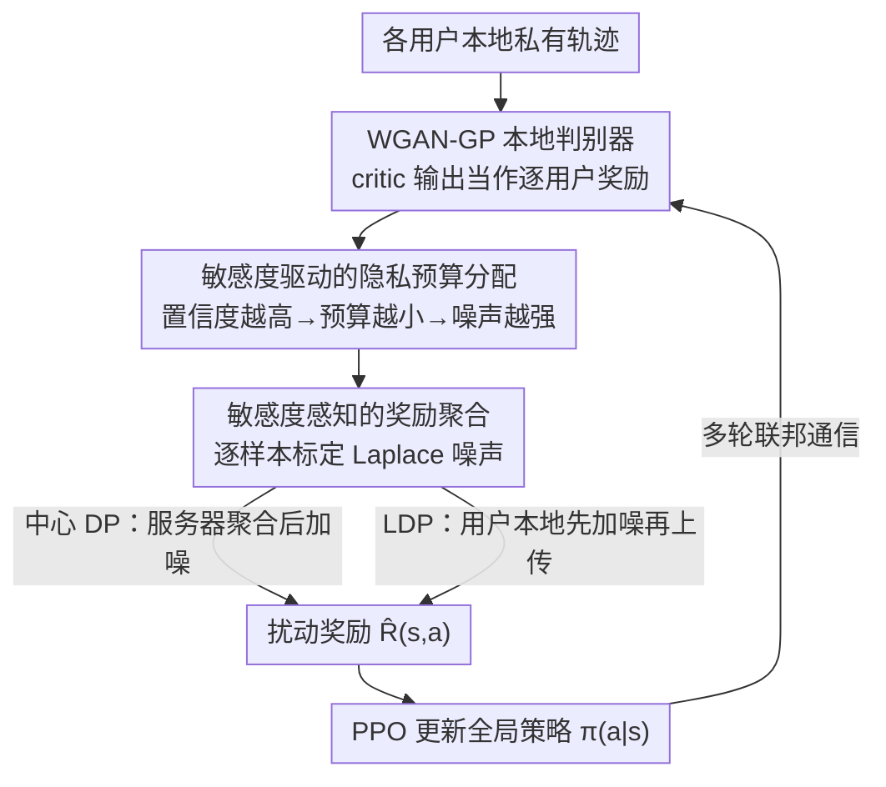

# PateGAIL++: Utility Optimized Private Trajectory Generation with Imitation Learning

**会议**: ICLR 2026  
**OpenReview**: [https://openreview.net/forum?id=Oyfz6G0hmc](https://openreview.net/forum?id=Oyfz6G0hmc)  
**代码**: 待确认  
**领域**: AI 安全 / 差分隐私 / 模仿学习  
**关键词**: 差分隐私, 轨迹生成, 模仿学习, 联邦学习, 成员推断攻击  

## 一句话总结
PateGAIL++ 在联邦式差分隐私模仿学习框架里，按"每个样本的隐私敏感度"动态分配隐私预算、自适应注入 Laplace 噪声，并用 WGAN-GP 稳定离散轨迹下的策略训练，从而在相同隐私预算下显著改善合成移动轨迹的"隐私—效用"折中、对成员推断攻击近乎随机。

## 研究背景与动机
**领域现状**：人类移动轨迹数据对城市规划、智能交通、公共安全很有价值，但原始 GPS 轨迹会暴露家庭住址、作息、社交关系，难以直接发布。主流隐私保护方案是用深度生成模型合成"以假乱真"的轨迹来替代真数据，其中差分隐私（DP）被视为可证明隐私的金标准。代表工作有把 GAN 与 PATE 教师集成结合的 PATE-GAN，以及把 DP 引入生成对抗模仿学习（GAIL）策略训练、并采用联邦部署的 PATEGAIL。

**现有痛点**：这些 DP 轨迹生成方法对所有数据点"一刀切"地注入相同强度的噪声，不管样本本身的隐私风险高低。但轨迹的风险并不均匀——行为独特、与他人重叠少的轨迹段更容易被识别个体身份，而随大流的常见轨迹本身就不敏感。统一加噪会让低风险样本被过度扰动、白白损失效用，同时高风险样本又保护不足，整体折中很差，且难以扩展到大规模异质数据。

**核心矛盾**：隐私预算是固定的、有限的资源（总 $\varepsilon$ 一定），而"逐样本风险"差异巨大；不区分样本地平均花费预算，等于把保护配给到了不需要的地方。

**本文目标**：在联邦 + DP 的约束下学一个全局轨迹生成策略 $\pi(a|s)$，使合成轨迹既统计逼真、可支撑下游预测/推荐（效用），又满足 $(\varepsilon,\delta)$-DP（任何单个用户的轨迹加入与否不显著影响输出）。这要解决三个挑战：C1 如何按数据敏感度分配预算；C2 非均匀噪声下如何给出形式化 DP 证明；C3 自适应噪声下联邦策略训练如何稳定。

**切入角度**：作者注意到，本地判别器对生成样本打的"真实度分数"本身就是一个内生的敏感度信号——分数越接近 1，说明这个状态-动作越像某个用户独特的真实行为，越危险。用模型内部信号而非外部语义标签来度量敏感度，既能逐样本配预算，又不会因为引入非私有信息而破坏 DP 账本。

**核心 idea**：用"判别器置信度反推的逐样本敏感度"来非均匀地分配隐私预算与噪声尺度，把保护集中到真正高风险的轨迹段上，从而在固定总预算下同时提升隐私与效用。

## 方法详解

### 整体框架
PateGAIL++ 沿用联邦数据访问模型：每个用户设备保留自己的私有轨迹，本地训练一个判别器 $D_{\phi_u}$ 评估合成轨迹的可信度；服务器不接触原始轨迹，只接收经差分隐私扰动后的奖励信号，用它更新全局策略 $\pi(a|s)$。整条管线在每一轮联邦通信里循环：本地判别器给每个状态-动作对 $(s,a)$ 打分 → 敏感度模块据此为每个样本算一个隐私预算份额 → 服务器用"敏感度感知的 Laplace 机制"聚合各用户奖励并加噪 → 用扰动后的奖励 $\hat R(s,a)$ 经 PPO 更新全局策略，直到收敛。判别器侧用 WGAN-GP 的 critic 替代原来基于交叉熵的判别器，让离散轨迹下的梯度更平滑。框架还可切换到 LDP 模式：用户在本地先对奖励加噪再上传，服务器连原始奖励都看不到。

### 关键设计

**1. 敏感度驱动的隐私预算分配：让高风险样本拿更少预算、被加更强噪声**

这是全文核心，直接针对"统一加噪"的痛点。作者用本地判别器的输出来度量每个样本的隐私风险：若 $D_{\phi_u}(s,a)\approx 1$，说明这个生成样本和某用户真实行为几乎无法区分，往往对应稀有/独特的行为模式，更易被推断攻击锁定，因此更敏感。于是把敏感度定义为与"距离 1 的置信裕度"成反比：$\text{Sensitivity}(s,a)\propto \frac{1}{1-\hat R(s,a)+\delta'}$，其中 $\delta'>0$ 防止除零。再据此给每个样本分配逐样本预算 $\varepsilon(s,a)=\frac{\varepsilon\cdot w(s,a)}{\sum_{(s',a')} w(s',a')}$，权重 $w(s,a)=1-\hat R_p(s,a)+\delta'$。关键细节：这里用的 $\hat R_p$ 是 $\hat R$ 的一个**差分隐私 pilot 估计**，避免"用真实奖励去分配预算"反而泄露信息。所有样本预算之和被约束为总预算 $\sum_{(s,a)}\varepsilon(s,a)=\varepsilon$，即在固定总账本内重新分配。这样置信度高（更敏感）的样本拿到更小的 $\varepsilon$、被注入更强噪声，低风险样本则少加噪保留效用——保护被花在刀刃上。作者特别强调敏感度只依赖模型内部信号，不引入位置类型、家庭/工作标签等外部语义，否则会依赖非私有信息、破坏端到端 DP 账本。

**2. 敏感度感知的奖励聚合与形式化 DP 保证：把逐样本预算落实到噪声尺度上**

有了逐样本预算还要落实到聚合环节并给出可证明的 DP（挑战 C2）。服务器用敏感度感知的 Laplace 机制聚合各用户奖励：$R(s,a)=\frac{1}{N}\sum_{u=1}^N R^{(u)}(s,a)+\mathrm{Lap}\!\left(\frac{\Delta f}{\varepsilon(s,a)}\right)$，噪声尺度 $\frac{\Delta f}{\varepsilon(s,a)}$ 随该样本的预算自适应变化——预算小则噪声大；当预算被均匀分配时它退化回原 PATEGAIL 的固定 $\lambda$。为应对各用户奖励的方差，沿用 PATEGAIL 的动态补偿项 $\hat R(s,a)=R(s,a)-\beta\cdot\xi(s,a)$，其中 $\xi(s,a)=\sqrt{\mathrm{Var}(R^{(u)}(s,a))+\mathrm{Lap}(0,\frac{\Delta f}{\varepsilon(s,a)})}$，让全局策略最大化用户期望累计奖励的高概率下界。DP 的成立依赖 Laplace 机制 + 顺序组合 + 后处理等性质，并借助 zCDP 这种更紧的隐私账本来支持迭代算法的组合分析（⚠️ 具体常数与界以原文为准）。

**3. WGAN-GP 稳定离散轨迹下的策略学习：换掉会梯度消失的交叉熵判别器**

原 PATEGAIL 用基于交叉熵的判别器，在离散轨迹上常出现梯度消失、更新不稳，而 DP 扰动会进一步放大这种不稳（挑战 C3）。PateGAIL++ 改用带梯度惩罚的 Wasserstein GAN，最小化专家与生成分布的 Wasserstein-1 距离：$\min_{\pi_\theta}\max_{D_\phi}\mathbb{E}_{\pi_E}[D_\phi]-\mathbb{E}_{\pi_\theta}[D_\phi]-\lambda_{GP}\mathbb{E}_{\hat x}[(\|\nabla_{\hat x}D_\phi(\hat x)\|_2-1)^2]$，$\hat x$ 是专家与生成状态-动作对之间的插值。然后直接把每个本地判别器的 critic 输出当作逐用户奖励 $R^{(u)}(s,a)=D^{(u)}_\phi(s,a)$，再走敏感度感知聚合。相比 GAIL 的 log 形式奖励，Wasserstein critic 梯度更平滑、不会奖励饱和，因而在自适应噪声下聚合与策略更新都更稳；作者还可选叠加谱归一化来强化 Lipschitz 连续性，进一步提升判别器鲁棒性、加速策略收敛。

**4. 扩展到本地差分隐私（LDP）：去掉对可信服务器的依赖**

前述中心 DP 假设服务器可信、能看到原始奖励。为放松这一假设，作者把框架推广到 LDP：每个用户在上传前先对自己的奖励加噪，服务器永远看不到任何单个判别器的原始输出。聚合写作 $R(s,a)=\frac{1}{N}\sum_u\big(R^{(u)}(s,a)+\mathrm{Lap}(\frac{\Delta f}{\varepsilon^{(u)}(s,a)})\big)$，并引入逐用户预算 $\varepsilon^{(u)}(s,a)=\varepsilon(s,a)\cdot\frac{w^{(u)}(s,a)}{\sum_u w^{(u)}(s,a)}$，使各用户预算聚合后恰好等于逐样本预算 $\varepsilon(s,a)$；权重可借助同态加密在用户间安全计算，保护个体隐私。这样保护粒度从样本级进一步细化到"样本 + 个体用户"双层，且在更现实的"无可信服务器"假设下仍保有理论保证。

## 实验关键数据

数据集：Geolife（83 用户，2007–2011，PATEGAIL 同款）和 Telecom Shanghai（9481 部手机、3233 基站、6 个月、720 万条记录）。指标用 5 个统计量与真实分布的 Jensen-Shannon 散度（JSD，越低越好）：轨迹级 Radius（回转半径）、DailyLoc（每日访问地点数）；记录级 Distance（相邻点距离）、G-rank（全局热门地点访问频率）、I-rank（个体偏好地点频率）。策略训练用 PPO。

### 主实验
基线（GAN / SeqGAN / Time-Geo / MoveSim / DiffTraj）在集中式、无联邦、无 DP 下训练，PATEGAIL/PATEGAIL++ 在联邦 + DP 扰动下训练，因此并非严格 apples-to-apples，而是展示本文在更强约束下仍具竞争力。

| 方法 | Radius | DailyLoc | Distance | G-rank | I-rank |
|------|--------|----------|----------|--------|--------|
| PATEGAIL(++) (noise=0) | 0.0699 | 0.1046 | 0.0130 | **0.0256** | 0.0176 |
| GAN | 0.6931 | 0.5795 | 0.3191 | 1.0000 | 1.0000 |
| SeqGAN | 0.0757 | 0.0881 | 0.0115 | 0.0752 | 0.0329 |
| Time-Geo | 0.0544 | 0.4955 | 0.4116 | 0.1515 | 0.1461 |
| MoveSim | 0.0311 | 0.0293 | 0.0058 | 0.0387 | 0.0173 |
| DiffTraj | 0.0105 | 0.3792 | 0.0087 | 0.0501 | 0.0576 |

PATEGAIL++ 的 G-rank（0.0256）优于 MoveSim（0.0387），I-rank（0.0176）与 MoveSim（0.0173）相当——在排序语义上更能保住高层轨迹真实性，而 GAN 等基线在这类语义指标上误差很大。

### 噪声鲁棒性（匹配总预算协议）

| 数据集 | 指标 | noise=0.10 PATEGAIL | noise=0.10 PATEGAIL++ |
|--------|------|---------------------|------------------------|
| Geolife | DailyLoc | 0.6915 | **0.4914**（↓≈29%） |
| Geolife | G-rank | 0.0512 | **0.0278** |
| Geolife | I-rank | 0.2698 | **0.0607** |

低噪声（0.01）时两者几乎一致；中等噪声（0.10）起 PATEGAIL++ 在 DailyLoc / G-rank / I-rank 等高层语义上明显领先，Radius/Distance 相当；大噪声（1.00）下优势更稳。即"低噪声相容、强隐私扰动下更鲁棒"。

### 隐私泄露（成员推断攻击，Geolife 白盒）

| Noise | PATEGAIL Acc | PATEGAIL AUC | PATEGAIL++ Acc | PATEGAIL++ AUC |
|-------|--------------|--------------|----------------|----------------|
| 0.01 | 0.6645 | 0.7208 | **0.5115** | **0.4962** |
| 0.10 | 0.6650 | 0.7273 | **0.4880** | **0.4846** |
| 1.00 | 0.5000 | 0.4972 | 0.4890 | 0.4921 |

PATEGAIL 在低噪声下有明显泄露（AUC 0.72），攻击者能可靠推断成员；PATEGAIL++ 在各噪声下都把 AUC 压到 ≈0.5（近乎随机），且不牺牲效用。黑盒 LiRA 攻击下也观察到同样趋势，PATEGAIL++ 攻击准确率约降 10%。

### 消融实验

| 配置 | 关键发现 | 说明 |
|------|---------|------|
| 梯度惩罚 $\lambda_{GP}\in\{1,5,10,15,20\}$ vs w/o | 加 WGAN-GP 几乎所有指标都优于 PATEGAIL | 验证设计 3 的稳定化作用 |
| 用户子集比例（all/80%/40%，$\lambda_{GP}=20$） | 用户数影响逐用户判别器训练（结果在附录） | 因每用户一个判别器 |
| LDP：PATEGAIL+++（带敏感度聚合）vs PATEGAIL++−（不带） | 带敏感度聚合多数设置相当或更优 | 验证设计 4 在本地隐私下仍有效 |

### 关键发现
- 把保护从"均匀"改成"按敏感度配给"，在相同总预算下同时改善了效用（DailyLoc≈−29%）与隐私（MIA AUC 0.72→0.50），说明痛点抓得准。
- 敏感度仅取自判别器置信度这一内生信号，是同时保住效用与不破坏 DP 账本的关键取舍。
- WGAN-GP 的平滑梯度对"自适应噪声下能否稳定收敛"至关重要——去掉后多数指标变差。

## 亮点与洞察
- **用判别器置信度当隐私敏感度**：这是最巧的一笔——判别器分数本就是免费的、内生的"独特性"度量，越像真实用户行为越危险，天然对应该多加噪，省去了任何外部标签且不破坏 DP。
- **预算是守恒资源、按风险再分配**：把固定总 $\varepsilon$ 当成可在样本间重新配给的预算，而非平均分摊，这一视角可迁移到其他 DP 训练（如 DP-SGD 的逐样本/逐步预算分配）。
- **pilot 估计防泄露**：分配预算时用 DP 化的 pilot 奖励而非真实奖励，避免"分配动作本身"成为泄露通道——这是把自适应机制塞进 DP 框架时容易忽略的坑。

## 局限与展望
- 作者承认：敏感度只看状态-动作级的判别器置信度，无法刻画语义层面的隐私风险，如反复造访敏感地点、长程序列模式；未来想引入位置语义（如医院应判更高风险）和长期风险信号。
- 自己发现：与基线并非严格可比（基线无联邦/无 DP），主结果表更像"相容性"展示而非严格 SOTA 证明；不同数据集/噪声下指标互有胜负，Telecom 表上个别设置 PATEGAIL++ 反而更差，结论需结合具体设置看。
- 形式化 DP 证明的常数、组合界在正文较略（依赖 zCDP），复现需补全细节（⚠️ 以原文/附录为准）。

## 相关工作与启发
- **vs PATEGAIL**：同为联邦 + DP 的 GAIL 轨迹生成，但 PATEGAIL 用统一预算/统一噪声、交叉熵判别器；本文改为敏感度驱动的逐样本预算 + WGAN-GP critic，并扩展到 LDP，主要赢在隐私—效用折中与抗 MIA。
- **vs PATE-GAN**：都把 DP 与生成对抗结合，但 PATE-GAN 面向表格/通用合成数据、在时空轨迹这类复杂域效用有限；本文针对移动轨迹的模仿学习场景定制。
- **vs MoveSim/DiffTraj 等集中式生成**：这些方法效用强但无形式化隐私保证、需集中原始数据；本文在联邦 + DP 约束下取得可比的高层语义保真度，换来可证明隐私。

## 评分
- 新颖性: ⭐⭐⭐⭐ 用判别器置信度做逐样本隐私预算分配的视角新颖，且自洽地嵌进 DP 框架
- 实验充分度: ⭐⭐⭐ 两数据集 + 多噪声 + 白/黑盒 MIA 较全面，但与基线非严格可比、部分设置互有胜负
- 写作质量: ⭐⭐⭐⭐ 动机与挑战（C1/C2/C3）拆解清晰，方法与证明对应明确
- 价值: ⭐⭐⭐⭐ 隐私轨迹生成是刚需，敏感度配给预算的思路有较强可迁移性

<!-- RELATED:START -->

## 相关论文

- [\[ICLR 2026\] On Optimal Hyperparameters for Differentially Private Deep Transfer Learning](on_optimal_hyperparameters_for_differentially_private_deep_transfer_learning.md)
- [\[ICLR 2026\] Private Rate-Constrained Optimization with Applications to Fair Learning](private_rate-constrained_optimization_with_applications_to_fair_learning.md)
- [\[ICLR 2026\] RESFL: An Uncertainty-Aware Framework for Responsible Federated Learning by Balancing Privacy, Fairness and Utility](resfl_an_uncertainty-aware_framework_for_responsible_federated_learning_by_balan.md)
- [\[ICML 2025\] Clients Collaborate: Flexible Differentially Private Federated Learning with Guaranteed Improvement of Utility-Privacy Trade-off](../../ICML2025/ai_safety/clients_collaborate_flexible_differentially_private_federated_learning_with_guar.md)
- [\[ICLR 2026\] PE-SGD: Differentially Private Deep Learning via Evolution of Gradient Subspace for Text](pe-sgd_differentially_private_deep_learning_via_evolution_of_gradient_subspace_f.md)

<!-- RELATED:END -->
