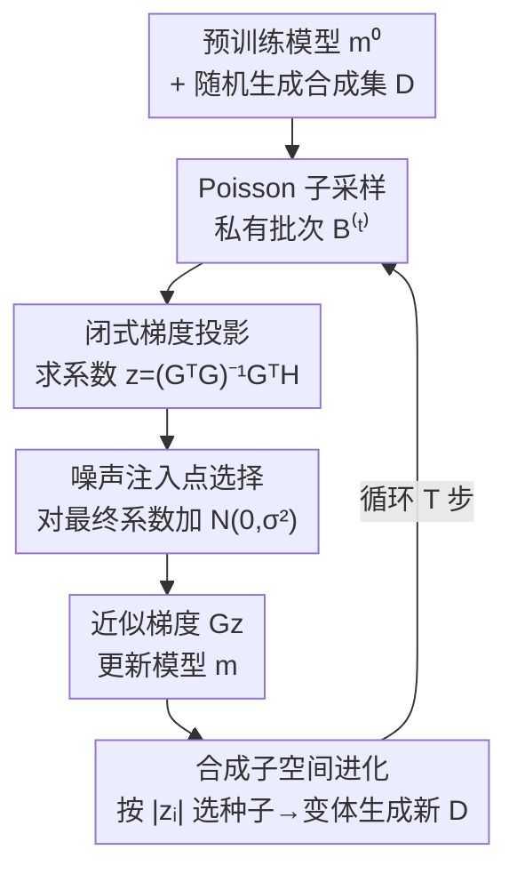

# PE-SGD: Differentially Private Deep Learning via Evolution of Gradient Subspace for Text

**会议**: ICLR 2026  
**OpenReview**: [https://openreview.net/forum?id=713ywmTZHv](https://openreview.net/forum?id=713ywmTZHv)  
**代码**: https://github.com/LindaLydia/PE-SGD  
**领域**: AI安全 / 差分隐私 / LLM微调  
**关键词**: 差分隐私, DP-SGD, 梯度投影, 合成数据进化, 长尾样本

## 一句话总结
PE-SGD 把"梯度投影 + 私有进化合成数据"结合起来做差分隐私微调：用一个会随训练**不断进化**的合成数据集张成梯度投影子空间，并把 DP 噪声加在最优的投影系数上，在私有数据极少（M<500）、隐私预算极紧（ε=1）时显著超过 DP-SGD 及一众投影类基线。

## 研究背景与动机
**领域现状**：在差分隐私下训练语言模型，标准做法是 DP-SGD——对每个样本的梯度做裁剪，然后注入各向同性高斯噪声以满足 (ε, δ)-DP。当私有数据充足时它工作良好，近年也在 LLM 训练上取得成功。

**现有痛点**：DP-SGD 的噪声维度等于参数量 p，维度极高，所以当私有样本只有几百条时，噪声把信号淹没，性能远逊于非私有的普通 SGD。为缓解这一点，梯度投影类方法（PDP-SGD、GEP 等）借助一个非私有数据集张成低维子空间，把带噪私有梯度投影上去，从而降低噪声维度。但这类方法有两个被忽视的缺陷：(1) **投影子空间固定不变**——它们依赖一个固定的（公开）数据集来构造子空间，可随着模型在训练中不断变化，近似 DP 梯度与真实私有梯度之间的 $\ell_2$ 距离会越来越大，固定子空间根本跟不上动态训练；而且大型公开数据集本身可能也是敏感的。(2) **噪声该加在投影流程的哪一步缺乏论证**——有的方法把噪声加在私有梯度上，有的加在投影系数上，还有的加在残差项上，但谁也没说清为什么，而不同位置对性能影响很大。

**核心矛盾**：投影子空间要"贴合当前模型的梯度分布"才能让近似准确，但固定数据集天生做不到动态适配；同时，注入噪声的位置直接决定了"加噪后的近似梯度"还能多接近真实私有梯度，选错了位置就白白损失信息。

**本文目标**：在私有数据有限、ε 很小的场景下，构造一个能随训练**演化**的投影子空间，并找到信息损失最小的**噪声注入点**，让 DP 保护下的近似梯度尽可能对齐真实私有梯度。

**切入角度**：作者先用一个闭式最小二乘分析给出"原则性的梯度投影"，证明 PDP-SGD/GEP 不过是其在 top-k 特征子空间上的特例（用整个子空间反而无信息损失）；再借鉴 Private Evolution（PE）合成数据的思路，让合成样本集随模型一起迭代更新。

**核心 idea**：用一个**随训练进化的小型合成数据集**代替固定公开数据集来张成梯度投影子空间，并把 DP 噪声加在**最终投影系数**上，使近似梯度与真实私有梯度对齐最好。

## 方法详解

### 整体框架
PE-SGD 的目标是从预训练生成模型 $m^{(0)}$ 出发，在保证私有数据集 $B$（大小 $M$，$M<500$）满足 (ε, δ)-DP 的前提下微调出更贴合该私有分布的模型 $m$。与 DP-SGD 直接用带噪私有梯度更新模型不同，PE-SGD 在每一步把私有梯度**投影**到一个由合成样本梯度张成的子空间里，更新模型后再**进化**这批合成样本，使子空间始终贴合当前模型。

整个流程是一个带反馈回环的迭代：训练前先用未训练的 $m^{(0)}$ 随机生成一批合成样本 $D$；每一步对私有集做 Poisson 子采样得到批次 $B^{(t)}$，分别算出合成样本梯度矩阵 $G$ 与私有样本梯度矩阵 $H$，求解最小二乘得到投影系数并加噪，用近似梯度 $Gz$ 更新模型；然后根据系数 $|z_i|$ 选出"得分高"的种子样本，用更新后的模型对它们做变体生成，进化出下一轮的 $D$。如此循环 $T$ 步。

### 关键设计

**1. 闭式原则性梯度投影：用整个合成子空间而非 top-k 特征空间**

针对"投影方法五花八门、缺乏统一原则"的痛点，作者先把投影目标写成最小二乘问题：给定私有梯度 $H=[h_1,\dots,h_M]\in\mathbb{R}^{p\times M}$（取均值 $h=\frac{1}{M}\sum_j h_j$）和合成梯度 $G=[g_1,\dots,g_N]\in\mathbb{R}^{p\times N}$，求系数 $z$ 使近似 $Gz$ 最接近 $h$：

$$\min_{z\in\mathbb{R}^N}\|Gz-h\|_2^2,\qquad z=(G^TG)^{-1}(G^Th)=\frac{1}{M}\sum_{j=1}^M(G^TG)^{-1}(G^Th_j).$$

由于合成样本数 $N\ll p$，这是个欠参数化回归（数值上对 $G^TG+\eta I$ 求逆，$\eta=10^{-6}$），最终投影函数为 $\hat g=Gz=\frac{1}{M}\sum_j[G(G^TG)^{-1}(G^TH)]_{:,j}$。作者证明 PDP-SGD（用 $GG^T$ 的 top-k 特征空间 $E$）和 GEP（用 $G$ 的左奇异向量 + 残差修正）都只是这个闭式解在**子空间被截断到 top-k** 时的特例；直觉上把投影限制在低维特征子空间必然带来信息损失，而 PE-SGD 因为合成集很小（实验中仅 200 条），可以直接用**整个**子空间做近似，无需取 top-k，从而避免这部分损失。

**2. 合成梯度子空间进化：用随训练演化的合成数据替换固定公开集**

针对痛点 C1——固定子空间跟不上动态训练、且大公开集本身敏感——作者让张成子空间的合成数据集 $D$ 在微调中持续进化。借鉴 Private Evolution，训练前用未训练的 $m^{(0)}$ 通过 `RANDOM_API()` 随机生成初始合成样本；之后每一步把投影系数 $z\in\mathbb{R}^N$ 的每个分量 $z_i$ 看作合成样本 $x_i$ 的"得分"——它衡量该合成样本对逼近私有梯度的贡献。由于负的 $z_i$ 同样携带梯度信息，作者按概率正比于 $|z_i|$ 选出 top-K 种子样本 $D_{\text{seed}}$，再用更新后的模型对每个种子通过 `VARIATIONAL_API()` 一次性扩展出 $L-1$ 个变体，得到下一轮的 $D$。这样合成子空间始终贴合当前模型的梯度分布，使近似 DP 梯度与真实私有梯度的 $\ell_2$ 距离不再随训练发散；同时整套流程只需生成式 API、不再依赖大型公开数据集。注意：为隐私安全，选种子之前会先给 $z$ 加上 $\mathcal{N}(0,\sigma^2 I_N)$ 噪声（这一步与下面的噪声注入是同一处加噪）。

**3. 噪声注入点的系统选择：把 DP 噪声加在最终投影系数上**

针对痛点 C2——噪声该加在哪一步无人论证——作者从投影公式 $z=(G^TG)^{-1}(G^TH)$ 中梳理出三个自然的注入点：(1) 给聚合私有梯度 $\sum_j H_{:,j}$（形状 $\mathbb{R}^p$）加噪；(2) 给梯度内积 $\sum_j[G^TH]_{:,j}$（形状 $\mathbb{R}^N$）加噪；(3) 给**最终投影系数** $\sum_j[(G^TG)^{-1}(G^TH)]_{:,j}$（形状 $\mathbb{R}^N$）加噪。实验（Fig. 8）表明第 (3) 种一致最好——既给出更小的 $\ell_2$ 近似误差，又显著提升近似梯度与真实私有梯度的余弦相似度。作者给出的解释是：归一化（或裁剪）在按列聚合前进行，因此各列范数越接近、归一化造成的信息损失越小；他们测量了加噪矩阵各列范数的 STD-to-Mean 与 Min-to-Max 比值，发现最终系数方案的列范数差异最小（STD-to-Mean 最低、Min-to-Max 最高），而"给内积加噪"方案的列范数差异极大，故表现最差。

### 损失函数 / 训练策略
训练以普通 SGD 形式给出更新 $\phi\leftarrow\phi+\eta\cdot Gz/\tilde M$，但近似梯度 $Gz$ 可直接喂给 AdamW 等优化器，与高级优化器完全兼容。敏感度控制上用**归一化**而非裁剪——对系数列 $Z_{:,j}=Z_{:,j}/\|Z_{:,j}\|_2$ 归一化，省去了裁剪阈值 $C$ 这个需要调的超参（裁剪略好但要细调，归一化更省心）。噪声尺度 $\sigma$ 用 Gopi 等人的 PRV Accountant 按 $(\epsilon,\delta,T,\beta)$ 计算。可行性上，作者用 LoRA 让 $p$ 较小以便直接物化 $G,H$ 做矩阵乘；若做全量微调，则可用 GhostSuite 一次反向传播算出所有样本对的梯度点积 $G^TG$、$G^TH$。默认超参 $M=400,\ \beta=0.2,\ T=10,\ N=200,\ L=2$，保证 $(1.0,10^{-5})$-DP。

## 实验关键数据

### 主实验
三个预训练模型（Qwen2.5-3B-Instruct / Llama-3.2-3B-Instruct / GPT2）× 三个 2024 末-2025 新数据集（PubMed / Congressional Speech / bioRxiv，均晚于模型发布以避免见过），评测下一 token 预测 Loss（↓）与 Accuracy（↑）。下表为 ε=1 时各方法的 Loss（Qwen2.5）：

| 数据集 (ε=1) | DP-SGD | PDP-SGD | GEP | Aug-PE | POPri | PE-SGD-FixSample | PE-SGD |
|------|------|------|------|------|------|------|------|
| PubMed | 2.3731 | 2.2502 | 2.4164 | 2.5817 | 2.9344 | 2.2497 | **2.1990** |
| Congressional Speech | 3.1080 | 2.8025 | 2.9103 | 3.0090 | 3.8656 | 2.8024 | **2.7532** |
| bioRxiv | 2.3768 | 2.3325 | 2.4300 | 2.4672 | 2.6178 | 2.3230 | **2.3178** |

PE-SGD 在 ε=1 下三数据集 Loss 全面最低、Accuracy 全面最高；其无进化变体 PE-SGD-FixSample 也已强于多数基线，可作为资源受限时的省钱替代。POPri/Aug-PE 在 M=400 的小私有数据下表现差（难以得到可靠正负样本对）。ε=∞ 时 DP-SGD 反超属预期（此时无噪声、直接训私有梯度）。

### 消融实验

| 配置 | 关键结果 | 说明 |
|------|---------|------|
| PE-SGD（完整） | top10% 难样本 ΔLoss = **-3.49995** | 最优 |
| PE-SGD-FixSample | ΔLoss = -3.41537 | 去掉合成集进化（L=1），仍优于所有基线 |
| 噪声加在内积 (NoisyInnerproduct) | 明显最差 | 列范数差异极大，归一化丢信息多 |
| 噪声加在私有梯度 (NoisyRealGrad) | 次于完整版 | Loss 更高、Acc 略低 |
| L=1 或 L=∞ | 均退化 | 不进化 / 每轮全重生成都差，中间值才好 |

Table 2 显示，在初始 Loss 最大的 10% 长尾样本上，PE-SGD 取得最大的平均 Loss 下降（-3.49995），所有 PE-SGD 变体均超过 DP-SGD，印证"用完整梯度子空间投影"的价值。

### 关键发现
- **更好地解决长尾问题**：逐样本看，PE-SGD 相对 DP-SGD 在初始 Loss 越高的难样本上提升越大（Loss 更低、Acc 更高），私有分布的整体 Loss 分布也整体左移，说明它能从最有价值的"长尾"样本里榨出更多知识。
- **更优的单步更新**：在同一条 SGD 轨迹上做单步更新对比，PE-SGD 每一步都比 DP-SGD 把 Loss 降得更多、Acc 提得更高，即使接近收敛的后期也如此。
- **样本高效**：每轮只需约 200 条合成样本即可获得好性能，验证训练梯度确实落在远小于参数量 p 的低维空间里。
- **噪声位置的决定因素**是加噪矩阵各列范数是否接近——越接近，归一化损失越小，这正是"加在最终系数"胜出的机理。
- **随 M、ε 变化**：M 增大时 PE-SGD 持续改善且始终不弱于（变强的）DP-SGD；ε=1/2/4/8 各设置下 PE-SGD 都稳定优于 DP-SGD。

## 亮点与洞察
- **把"投影方法谱系"统一进一个闭式解**：证明 PDP-SGD/GEP 是其 top-k 截断特例，既给出理论站位，又顺势论证"用整个小子空间无信息损失"，是很漂亮的"先统一再超越"叙事。
- **把 Private Evolution 从'造合成数据'迁移到'造投影子空间'**：合成样本不再是训练数据，而是张成梯度子空间的基，并用投影系数 $|z_i|$ 当进化得分形成闭环——这个把"系数即重要性分数"的用法很巧。
- **噪声注入点用列范数一致性来解释**：把一个看似经验性的选择，归因到"归一化前各列范数差异"的可测量指标（STD-to-Mean / Min-to-Max），让结论可验证而非玄学。
- **去公开数据依赖**：仅靠生成式 API 演化合成集，绕开了"大型公开集本身也敏感"的隐患，这一点在隐私场景下尤其有迁移价值。

## 局限与展望
- 方法默认用 LoRA 把 $p$ 压小以便物化 $G,H$；全量微调要靠 GhostSuite 算点积，工程复杂度与开销在更大模型上仍待验证。
- 进化合成集每轮都要调用生成/变体 API，相比纯 DP-SGD 引入额外的生成成本；论文也承认 FixSample 是其省成本的退路。
- 主战场是"私有数据极少（M<500）+ 紧预算"，当 M 很大时 DP-SGD 本身就是很强的基线，PE-SGD 的优势收窄为"不弱于"，适用边界需明确。
- 评测集中在下一 token 预测 Loss/Acc，下游任务（指令遵循、生成质量）层面的隐私-效用权衡未充分展开。

## 相关工作与启发
- **vs DP-SGD**：DP-SGD 给 $\mathbb{R}^p$ 的私有梯度直接加噪、噪声维度等于参数量；PE-SGD 把梯度投到低维合成子空间、只给 $\mathbb{R}^N$ 的系数加噪，并避免直接用私有梯度更新，故在小数据紧预算下大胜。
- **vs PDP-SGD / GEP**：它们用固定公开集的 top-k 特征/奇异子空间（GEP 还加残差修正），子空间固定且被截断；PE-SGD 用进化的完整子空间，既适配动态训练又无截断损失。
- **vs Aug-PE / POPri**：它们用 DP 合成数据再做（非 DP 的）SFT 或 DPO；PE-SGD 直接把私有梯度投影进训练，合成数据服务于梯度近似而非充当训练样本，故在 M=400 时更稳。

## 评分
- 新颖性: ⭐⭐⭐⭐⭐ 把闭式投影统一、合成子空间进化、噪声位置选择三件事串成一个自洽框架。
- 实验充分度: ⭐⭐⭐⭐ 三模型三数据集 + 噪声位置/L/N/M/ε 全套消融，但下游任务评测偏薄。
- 写作质量: ⭐⭐⭐⭐ 动机用 Fig.1 的 $\ell_2$ 距离驱动，逻辑清晰；公式与算法表完整。
- 价值: ⭐⭐⭐⭐ 在隐私敏感、数据稀缺的 LLM 微调场景有实用价值，且不依赖大公开集。

<!-- RELATED:START -->

## 相关论文

- [\[ICLR 2026\] On Optimal Hyperparameters for Differentially Private Deep Transfer Learning](on_optimal_hyperparameters_for_differentially_private_deep_transfer_learning.md)
- [\[ICLR 2026\] Back to Square Roots: An Optimal Bound on the Matrix Factorization Error for Multi-Epoch Differentially Private SGD](back_to_square_roots_an_optimal_bound_on_the_matrix_factorization_error_for_mult.md)
- [\[ICLR 2026\] Differentially Private Two-Stage Gradient Descent for Instrumental Variable Regression](differentially_private_two-stage_gradient_descent_for_instrumental_variable_regr.md)
- [\[AAAI 2026\] An Improved Privacy and Utility Analysis of Differentially Private SGD with Bounded Domain and Smooth Losses](../../AAAI2026/ai_safety/an_improved_privacy_and_utility_analysis_of_differentially_p.md)
- [\[ICLR 2026\] Missing Mass for Differentially Private Domain Discovery](differentially_private_domain_discovery.md)

<!-- RELATED:END -->
