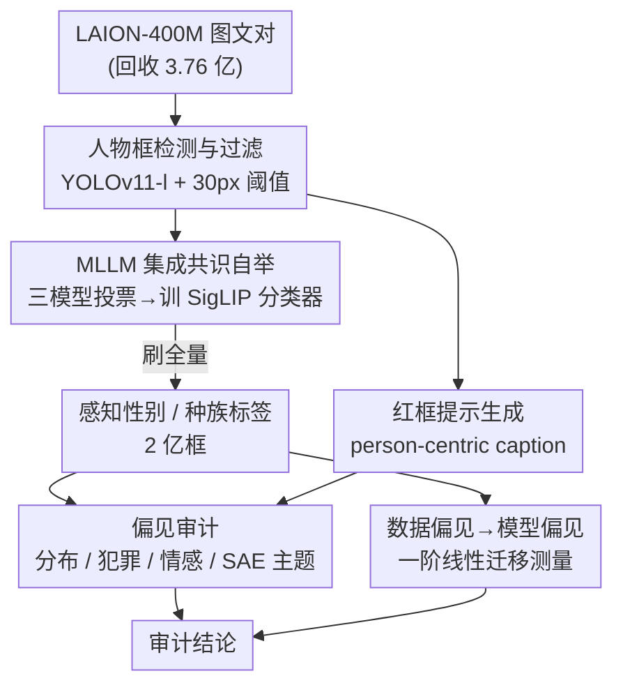

# Person-Centric Annotations of LAION-400M: Auditing Bias and Its Transfer to Models

**会议**: ICLR 2026  
**OpenReview**: [https://openreview.net/forum?id=t3ZMiHhqXm](https://openreview.net/forum?id=t3ZMiHhqXm)  
**代码**: 有（论文 Code is available here，需申请获取带人口属性标签的数据）  
**领域**: AI 安全 / 公平性 / 数据集审计  
**关键词**: 数据集偏见, LAION-400M, 人口属性标注, 偏见迁移, 稀疏自编码器

## 一句话总结
作者为整个 LAION-400M 数据集生成了 2.76 亿个人物边界框 + 感知性别/种族标签 + 人物级 caption，用这套首次覆盖全量 web 数据的标注审计出"男性、黑人、中东裔被过度关联到犯罪和负面内容"等系统性偏见，并证明 CLIP 与 Stable Diffusion 中 60–70% 的性别偏见可以用数据里"性别-概念共现频率"的一条线性拟合直接预测出来。

## 研究背景与动机

**领域现状**：CLIP、Stable Diffusion 这类视觉-语言基础模型在大规模、未经清洗的网络多模态数据（如 LAION-400M）上预训练，已被反复证明带有强烈的人口学偏见。学界普遍假设"模型偏见来自训练数据不平衡"，但这一直只是一个假设，而非可测量的结论。

**现有痛点**：要验证"数据偏见→模型偏见"这条因果链，前提是知道数据里到底有谁、谁和谁共现。但 LAION-400M 这种 web 级数据**根本没有人口学标注**。已有的审计工作要么只看 alt-text 文本子集（文本信息量低、不可靠），要么只标注人脸、只给整图一个性别标签、只覆盖职业等狭窄子集，没人对全量数据做过细粒度的人物级标注。

**核心矛盾**：缺少全量、人物级、视觉 grounded 的标注，研究者既无法刻画数据真实的人口构成，也无法把"数据统计量"直接对齐到"下游模型行为"——只能用美国劳工统计局数据这类外部代理统计来间接猜测。

**本文目标**：(1) 给整个 LAION-400M 造一套高质量人物标注（框 + 感知性别 + 感知种族/族裔 + caption）；(2) 用它审计数据内部的人口分布与有害关联；(3) 第一次在 web 规模上定量回答"模型偏见有多少能被数据共现直接解释"。

**切入角度**：与其相信现成的 MLLM 直接标全量（噪声框、遮挡、低质量图会污染结果），不如用"多模型集成 + 只取共识"自举出干净训练集，再训练专用分类器去刷全量，把成本和噪声同时压下来。

**核心 idea**：用一条自动标注流水线把"全量人物标注"造出来，再用"数据共现 → 模型偏见"的一阶线性拟合，把数据集组成和模型行为之间第一次建立起可测量的经验联系。

## 方法详解

### 整体框架

整篇论文做两件事：先用一条**自动标注流水线**给 LAION-400M（实际回收到 3.76 亿对图文，占原始 90.7%）的每个人打上框、感知性别、感知种族/族裔和一段 caption；再用这套标注做三层审计——数据分布、有害关联（犯罪词/情感/SAE 主题）、以及数据偏见到模型偏见的迁移测量。

标注流水线的关键不是"直接拿 MLLM 标"，而是"**MLLM 集成只取共识 → 训出专用分类器 → 分类器刷全量**"：先用 YOLOv11-l 检测出约 2 亿个人物框并按尺寸过滤；在采样子集上用三个 MLLM（Phi-3.5-Vision、LLaVA-NeXT、InternVL3）投票，只保留三模型一致的样本去微调 SigLIP 性别/种族分类器；这两个分类器再去标全量；同时用 InternVL3-8B 配合"红框视觉提示"为每个人生成 person-centric caption。拿到全量标注后，再分别做分布统计、犯罪/情感关联、SAE 主题挖掘和偏见迁移线性拟合。

### 关键设计

**1. 优先召回的人物框检测与可用性过滤：先把"谁在图里"框全，再剔掉标不动的小框**

整条流水线的起点是"把每个人都框出来"。作者用 YOLOv11-l，置信度阈值取默认的 0.25——这个阈值比同类审计工作（如 Phase）更低，因为这里**优先召回**：宁可多框，也不能漏人，否则后续的分布统计会系统性失真。人工抽检 200 张图显示 82.5% 完全正确、10% 把非人物体误框、7.5% 漏框，作者论证因为单图可含多框、实际漏框率更低。

光召回还不够，关键的第二步是**按尺寸过滤**：对任何边长小于 30 像素的框直接丢弃。这个 30px 不是拍脑袋，而是由"自动性别标注还可不可信"反推出来的——当人物框边长 < 30px 时，自动方法与人工的感知性别标注一致性（Cohen's $\kappa$）跌破 0.8、准确率跌破 90%，说明此时框里已经看不清性别线索，标了也是噪声。过滤后剩下 199,931,986 个人物框、分布在 107,545,236 张图里。分布上大多数框都很小（占图面积 < 10%）、多数图只有一个人，但极端图里能检出多达 55 个人。

**2. MLLM 集成共识自举出专用分类器：用"只取一致"把噪声标注变成干净训练集**

要给 2 亿个框标性别和种族，直接用 MLLM 逐框跑既贵又脏（噪声框、遮挡、多人混入）。作者的做法是**自举（bootstrap）**：先在采样子集上用三个不同的 MLLM（InternVL3-2B、Phi-3.5-Vision、LLaVA-1.6-7B）各标一遍，**只保留三模型完全一致的样本**作为训练信号，再用它微调一个 SigLIP 分类器去刷全量。

性别上，从 300 万采样框里按四类（female / male / mixed / unclear）各取 25,000 张三模型一致的图（mixed 太稀少，放宽到两模型一致，约占该类 25%），训出的 SigLIP 在测试集达 97.2% 准确率，迁移到 Phase 95%、FACET 90%。种族/族裔更难：因为没有现成数据集能处理"缺线索/噪声框"，作者先用 alt-text 关键词把每个种族类目的候选图召回（让标签 grounded 在文本描述上），再用同样三模型投票、只留一致样本，类目用了与既有数据集对齐的七类（Black / East Asian / Hispanic / Middle Eastern / South Asian / Southeast Asian / White）。最终 SigLIP 原始准确率 87.4%——考虑到感知种族本身高度主观（人类标注者之间一致性 $\kappa$ 只有 0.654，而人-分类器一致性 $\kappa = 0.638$，两者几乎一样高），这个数字已经很强。作者特意指出：用 logit 阈值 $\tau$ 提精度不影响结论（只会进一步抬高 White 占比），所以最终用不加阈值的原始预测。这个设计的精妙处在于：**机器-人类一致性逼近人类-人类一致性上限**，说明剩下的分歧主要来自任务本身的主观性（认识论不确定性），而非分类器质量差。

**3. 红框视觉提示驱动的 person-centric caption 与 SAE 主题挖掘：让模型"只描述被框中的那个人"，再无监督地挖出身份-主题关联**

整图级 alt-text 描述的是整张图，没法定位"这个人是谁、和什么关联"。作者要的是**人物级** caption。难点是怎么把"框"这个信息喂给 MLLM、让它只聚焦目标人物又不丢全图上下文。作者利用了"近期 MLLM（InternVL-3、Qwen-VL-2.5）能感知图中视觉标记"这一观察：直接在图上把目标人物用**红色框**画出来，再指令模型"描述被高亮的个体"。通过让 GPT-5.1 在 500 个框上做成对胜率比较，最终选定 InternVL3-8B（对 Qwen2.5-VL-3B 胜率 0.756、对 InternVL3-2B 0.582）生成全量 caption。

拿到约 2 亿条 caption 后，作者用稀疏自编码器（SAE）做**无监督主题挖掘**：先用 granite-embedding 把每条 caption 编码成 embedding，训练 SAE 发现重复出现的主题，再用点互信息衡量某身份 $i$ 与某主题 $t$ 的关联强度：

$$\text{PMI}(i, t) = \log \frac{P(i,t)}{P(i)\,P(t)}$$

其中 $P(i,t)$、$P(t)$ 通过 SAE 隐特征 $F_j$ 边缘化得到——估计每个隐特征的激活概率 $P(F_j)$、给定特征激活时身份的条件概率 $P(i\,|\,F_j)$、以及主题的条件概率 $P(t\,|\,F_j)$（后者用 SAE 解码器 embedding 检索最相似的 5 个主题、归一化成分布）。为保证稳健，作者综合 24 个不同 SAE 的 PMI 分数并对不同粒度的主题聚类积分。结果（14 个交叉身份 = 2 性别 × 7 种族）揭示：男性更关联体育、女性更关联文化；"firearms/weapons""military"关联中东裔，"markets"/食物关联东南亚裔，而 White 身份关联"health""aging""pregnancy"等通用主题——印证了 White 在数据里被当作"默认身份"。

**4. 数据偏见到模型偏见的一阶线性迁移测量：第一次量化"模型偏见有多少能被数据共现直接解释"**

这是论文最有冲击力的一步。作者要测的是**一阶偏见迁移**——模型偏见在多大程度上与"目标概念和偏见变量（性别）在数据中的共现频率"线性相关。对每个社会类目 $c$（取自 Guilbeault 的 3488 个社会角色 + So-B-IT 的 405 个关键词，过滤到在 LAION 出现 ≥100 次的 2617 个），分别算两个量：

- **数据偏见**：检索 alt-text 含 $c$ 的图文对，只留图中只有女性或只有男性的，算其中女性图占比；
- **CLIP 模型偏见**：用标准化的余弦相似度差衡量类目 $c$ 与性别的关联强度

$$d(c) = \frac{\text{mean}_{x\in F}\cos(x, c) - \text{mean}_{y\in M}\cos(y, c)}{\text{stddev}_{w\in F\cup M}\cos(w, c)}$$

其中 $F$、$M$ 分别是女性/男性图像集。Stable Diffusion 偏见则用"给定 prompt 生成 100 张图、其中女性图占比"衡量（SD-1.1/1.4 共生成 742,000 张图，用 YOLO + InternVL 过滤到恰好一个明确性别的人）。

把数据偏见和模型偏见做线性拟合，$R^2$ 就是"模型偏见中能被数据共现线性解释的方差比例"。结果：CLIP 上 $\rho \in \{0.75, 0.80, 0.84\}$、$R^2 \in \{0.57, 0.64, 0.71\}$（用同分布的 LAION 图像探针时最高，强调了探针图像分布的重要性）；Stable Diffusion 上 $R^2 = 0.64, 0.63$。综合下来，**60–70% 的性别偏见可以被一条线性拟合从数据共现直接预测**——剩下 30–40% 来自高阶/非线性效应或模型的偏见放大。作者也诚实指出种族偏见迁移因非白人共现样本太少而结论不确定。

### 一个完整示例

以"犯罪关联审计"走一遍怎么用标注得到结论：作者从 Hamidieh 等扩展出 63 个犯罪相关词，检索 alt-text 含这些词的图，丢掉身份 unclear/mixed 的，统计这批图的性别/种族分布，再与全量基线分布算相对变化 $\Delta$（$\Delta=1.0$ 表示翻倍、$\Delta=-0.5$ 表示减半）。结果：男性比基线高 +57%；种族上中东裔暴涨 +206%、黑人 +51%，而白人和东亚裔各降 -22%。配合情感分析（中东裔负面 caption 比例最高 0.40、平均 VADER 最低 0.03），就得出"男性、黑人、中东裔被系统性地过度关联到犯罪与负面内容"这一可量化的审计结论——这正是"有了全量人物标注后，才能做的精确查询"。

## 实验关键数据

### 标注质量与人类验证

| 任务 | 测试集准确率 | 跨数据集泛化 | 与人类一致性 |
|------|------|------|------|
| 性别分类（SigLIP） | 97.2% | Phase 95% / FACET 90% | $\kappa$ 高，male/female 间零混淆 |
| 种族/族裔分类（SigLIP） | 87.4% | — | 人-机 $\kappa=0.638$，人-人 $\kappa=0.654$ |
| 框检测（人工抽检 200 图） | 82.5% 完全正确 | — | 10% 误框非人 / 7.5% 漏框 |

### 数据集组成与有害关联

| 审计维度 | 关键发现 |
|------|------|
| 性别分布 | 男性 42.3% > 女性 35.3%，仅 17% 图男女同框 → 解释"CLIP 把男性当默认性别" |
| 种族分布 | White ≈28% 是次大类（Black）的约 4 倍；>50% 框 / ≈45% 图为 unclear |
| 犯罪词关联（$\Delta$） | 男性 +57%；中东裔 +206%、黑人 +51%；白人/东亚 各 -22% |
| 情感（负面比例 / VADER） | 女性 0.21/0.12 vs 男性 0.33/0.06；中东裔 0.40/0.03 最负面 |

### 偏见迁移线性拟合

| 模型 | 探针/类目 | Pearson $\rho$ | $R^2$ |
|------|------|------|------|
| CLIP ViT-B-32 | LAION-400M / Guilbeault | 0.84 | 0.71 |
| CLIP ViT-B-32 | Phase / Guilbeault | 0.80 | 0.64 |
| CLIP ViT-B-32 | CausalFace / Guilbeault | 0.75 | 0.57 |
| Stable Diffusion 1.1 | — | 0.80 | 0.64 |
| Stable Diffusion 1.4 | — | 0.80 | 0.63 |

### 关键发现
- **数据共现能线性解释 60–70% 的模型性别偏见**，这是首次在 web 规模上对"数据→模型偏见"做出的可测量结论；剩余部分来自高阶/非线性效应或模型放大。
- **同分布探针很关键**：用 LAION 自身图像当探针时 $R^2$ 最高（0.71），用人脸数据集 CausalFace 最低（0.57），说明"用什么图像测模型偏见"会显著影响结论。
- **感知种族的主观性是天花板**：人-人一致性（$\kappa=0.654$）只比人-机（0.638）略高，分歧集中在 White/Latino/中东、东亚/东南亚等文化地理相近的群体，说明剩余误差很大程度是任务本身的认识论不确定性。
- 用 Chebyshev 多项式等非线性预测器只能把 $R^2$ 提高 1–3 个点，说明一阶共现已经抓住了大部分可解释的偏见。

## 亮点与洞察
- **"集成共识自举"是处理 web 级噪声标注的可复用范式**：不直接信任单个 MLLM，而是用多模型一致性筛出干净种子集去训专用分类器，既压成本又压噪声——这套思路能迁移到任何需要在脏数据上做大规模属性标注的场景。
- **红框视觉提示让 MLLM 做实例级 caption**：不改模型、不微调，仅靠在图上画红框 + 指令"描述高亮个体"，就把"整图描述"变成"人物级描述"，是个零成本的实例定位技巧。
- **把"数据偏见 vs 模型偏见"画成散点 + 线性拟合**，用 $R^2$ 直接读出"数据能解释多少模型偏见"，把一个长期停留在定性假设的问题变成了可量化、可外推的测量——类比 scaling law 的思路用在偏见上。
- **诚实地把主观性当成上限来报告**：用人-人一致性作为人-机一致性的参照系，避免了"分类器准确率低=分类器差"的误读。

## 局限与展望
- 作者承认只捕捉**感知**（而非真实）性别/种族，且性别限于二元、种族限于固定七类，无法表达非二元与混合身份；标签仅供偏见研究、明确禁止用于监控或画像。
- 种族偏见的数据→模型迁移**结论不确定**：非白人群体的概念共现样本太少，无法可靠拟合。
- 只测了**一阶**线性迁移；间接共现（二阶偏见传播）、优化器/采样策略的影响、训练引入的非线性动态都留待未来——后两者需要从头训 CLIP，成本高。
- 自身局限：caption 由 InternVL3-8B 生成，会把生成模型自己的偏见引入标注（作者检查后称犯罪词低、情感总体偏正，但这仍是一个潜在污染源）；30px 过滤虽有依据，但也系统性丢掉了远景/小人物，可能让分布偏向前景主体。

## 相关工作与启发
- **vs Birhane et al. (2023/2024) / Al Sahili et al.**：他们审计 LAION 的文本子集、证明大数据集会放大刻板印象（如把黑人/拉美裔标为"criminal"），但停留在"记录后果"；本文给**全量**做人物级视觉 grounded 标注，能直接追溯偏见来源而非只看文本。
- **vs Zheng et al. (2022)**：他们在 LAION-400M 检出 5000 万张人脸，但目的是训人脸编码器；本文框的是**整个人**而非只是脸，且面向审计而非建模。
- **vs Friedrich/Seshadri 等职业子集标注**：他们只标 LAION-2B/5B 的职业子集、每图一个图像级性别标签；本文给**每个人**一个标签、覆盖全量，支持更直接的组成分析。
- **vs Luccioni/Cheong 等用代理统计**：他们用美国劳工统计局数据等外部代理间接推测数据-模型关系；本文用穷尽标注第一次直接测量，是方法论上的代际差。

## 评分
- 新颖性: ⭐⭐⭐⭐⭐ 首次为 web 级数据集造全量人物标注，并第一次定量回答"数据共现能解释多少模型偏见"。
- 实验充分度: ⭐⭐⭐⭐⭐ 标注质量有人工验证、跨数据集泛化，审计覆盖分布/犯罪/情感/SAE 主题，迁移测量跨 12 个 CLIP + 2 个 SD。
- 写作质量: ⭐⭐⭐⭐⭐ 流程清晰、伦理讨论充分、对主观性和局限非常诚实。
- 价值: ⭐⭐⭐⭐⭐ 标注与代码将成为后续研究数据-模型偏见迁移的基础设施，价值随复用而增长。

<!-- RELATED:START -->

## 相关论文

- [\[ICLR 2026\] Robust Fine-Tuning from Non-Robust Pretrained Models: Mitigating Suboptimal Transfer with Epsilon-Scheduling](robust_fine-tuning_from_non-robust_pretrained_models_mitigating_suboptimal_trans.md)
- [\[ICLR 2026\] Optimizing Canaries for Privacy Auditing with Metagradient Descent](optimizing_canaries_for_privacy_auditing_with_metagradient_descent.md)
- [\[ICLR 2026\] On Optimal Hyperparameters for Differentially Private Deep Transfer Learning](on_optimal_hyperparameters_for_differentially_private_deep_transfer_learning.md)
- [\[CVPR 2026\] Transform to Transfer: Boosting Adversarial Attack Transferability on Vision-Language Pre-training Models](../../CVPR2026/ai_safety/transform_to_transfer_boosting_adversarial_attack_transferability_on_vision-lang.md)
- [\[ICLR 2026\] Wring Out the Bias: A Rotation-Based Alternative to Projection Debiasing](wring_out_the_bias_a_rotation-based_alternative_to_projection_debiasing.md)

<!-- RELATED:END -->
