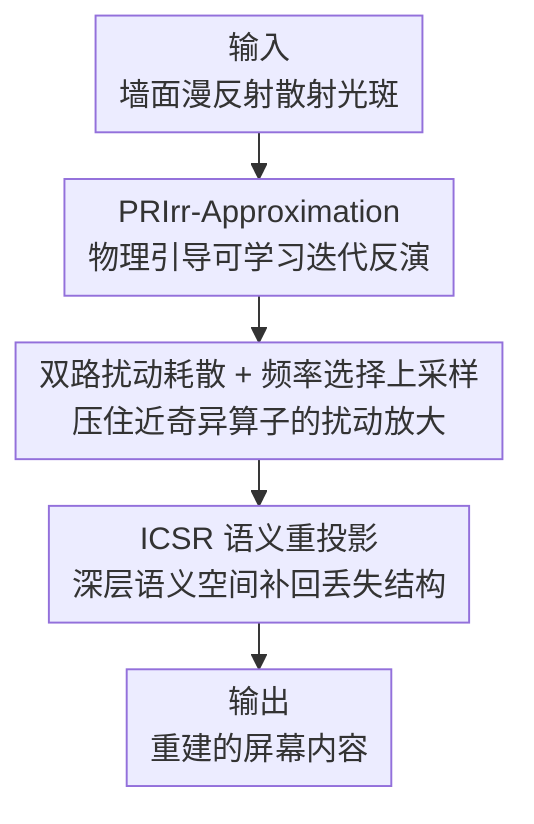

# Physically-Guided Optical Inversion Enable Non-Contact Side-Channel Attack on Isolated Screens

**会议**: ICLR 2026  
**OpenReview**: [https://openreview.net/forum?id=evepIXBxL8](https://openreview.net/forum?id=evepIXBxL8)  
**代码**: 待确认  
**领域**: AI安全 / 侧信道攻击 / 光学反演 / 图像重建  
**关键词**: 侧信道攻击, 光学投影, 物理引导反演, 屏幕内容重建, 漫反射散射

## 一句话总结
本文首次证明墙面漫反射散射光可以充当一条「光学投影侧信道」，并提出物理引导的反演网络 IR4Net，仅凭被动捕获的散射光斑、在无直视、无电磁、无网络连接的条件下，把物理隔离屏幕上的显示内容重建出来。

## 研究背景与动机
**领域现状**：传统侧信道攻击主要靠电磁辐射、声学反射、缓存时序、网络连接等媒介来窃取设备状态。光学侧信道此前虽有研究，但几乎都要求传感器与设备同处一室、或直接对着屏幕（如环境光传感器读取全局照度变化），本质上仍依赖某种「能看见屏幕」的条件。

**现有痛点**：电磁攻击受距离、屏蔽、环境噪声制约，且会暴露攻击者位置；网络攻击需要连通性和软件漏洞，对物理隔离（air-gapped）系统完全无效，还会留下审计日志；主动探测一旦发出信号就容易被检测。换句话说，「物理隔离」长期被当作信息安全的终极防线——没有直接视线、没有电磁泄漏、没有通信链路，就被默认安全。

**核心矛盾**：作者注意到一个被忽视的事实——自发光屏幕的光会照到周围墙面，墙面漫反射回来的散射光斑里其实编码了屏幕内容。但要从这些光斑里把内容反推回来极其困难：屏幕到墙面散射光斑的映射是一个严重病态（ill-conditioned）的非线性过程，其雅可比矩阵在多个方向上奇异值趋于零，违反 Hadamard 稳定性判据，导致输入端微小的辐照度扰动会在反演时被剧烈放大成边缘错位、虚假纹理、语义漂移；同时漫反射、衍射、遮挡造成的不可逆压缩会丢掉大量全局语义结构，使重建高度不确定。

**本文目标**：在这种被动、非接触、无直视的设定下，把散射光斑稳定地反演回原始屏幕图像，既要压住扰动放大，又要补回被压缩丢掉的全局语义。

**核心 idea**：把不稳定的光学反演重新表述为一条**物理约束的可学习迭代轨迹**（用辐射传输方程的前/反向算子约束每一步），并在深层语义空间里**重投影**补回被不可逆压缩抹掉的结构——用物理先验稳住数值、用语义先验补回信息。

## 方法详解

### 整体框架
IR4Net 接收攻击者在墙面（或其他漫反射表面）上被动拍到的散射光斑图像，输出对屏幕原始显示内容的重建。整条管线分两大模块串联：先用 **PRIrr-Approximation（物理正则辐照度逼近）** 把病态反演变成一条受物理算子约束的迭代轨迹，并在迭代中用「双路扰动耗散 + 频率选择上采样」结构性地压住扰动放大，得到一个稳定的初步估计；再用 **ICSR（不可逆约束语义重投影）** 在深层语义空间建立结构↔语义的稳定映射，把遮挡和衍射区域里丢失的全局结构补回来，最终输出边缘连续、纹理一致的屏幕图像。

### 关键设计

**1. PRIrr-Approximation：把不稳定的光学反演改写成物理约束的可学习迭代轨迹**

直接学一个「光斑→屏幕」的端到端映射会撞上前面说的病态问题：传输算子奇异值趋零，反演时微小扰动被指数放大。作者的做法是不再一步到位，而是把光学效应建模成一个传输算子 $\Phi(\cdot)$，并推导其逆近似 $\Psi(\cdot)$，让网络沿着一条受物理一致性约束的迭代路径逐步逼近源辐照度。每一步用**动量初始化**把局部先验和多尺度全局反馈融合，给迭代指定一个相干的更新方向；再用**动量引导的梯度更新**抑制噪声和误差累积，得到逐步收敛的特征估计 $\hat{I}^{(k)}$。直观上，物理算子和动量共同把解的轨迹「锁」在物理可行的区域内，避免反演在近奇异方向上发散——这正是相比纯神经反演的关键区别：约束的不是最终输出，而是整条求解路径。消融里把这套更新策略换成 ADMM / NAG / Heavy-Ball 等经典动量方案后，PSNR、SSIM 全面下降、LPIPS 上升，说明结构感知的动量初始化 + 物理反馈通路确实带来了更稳的反演。

**2. 双路扰动耗散 + 频率选择上采样：在迭代内部结构性地分散并压制扰动能量**

即便有物理轨迹约束，屏幕到墙面那点微小扰动仍会沿多尺度衍射快速放大。作者在迭代特征 $I^{(k)}$ 上并行开两条耗散通路：**空间扩散路**对局部梯度施加二阶微分核（式 1，$\partial^2 I^{(k)}/\partial x\partial y$ 捕捉局部曲率），把扰动在空间上摊开；**语义衰减路**用注意力机制（式 2–4）在语义维度上分散扰动分量，让扰动不在空间上聚集。两路输出在空间域拼接后，进入**多尺度频率分离模块**：先做傅里叶变换（式 5），用门控把特征分成低频/高频两支（式 6），再用基于梯度幅值的自适应门控 $\alpha_c$（式 7–8）融合——核心规则是**只逐层放大具备跨尺度一致性的低频结构成分，让缺乏尺度一致性的高频成分在传播中衰减**。最后配合双线性插值核与可学习上采样核 $\kappa_{up}^{(i)}$ 做分层重建（式 14–15），从低频轮廓到高频细节逐级展开。这套设计的巧妙处在于：它不是事后去噪，而是把「该放大什么、该衰减什么」直接写进上采样的频域门控里，从机制上阻断扰动随上采样层级膨胀。

**3. ICSR：在深层语义空间重投影，补回被不可逆压缩抹掉的全局结构**

PRIrr 解决了「稳」，但漫反射的高压缩、不可逆映射会把全局语义结构和上下文整段丢掉，表现为边缘模糊、纹理伪影、语义错位。ICSR 用两条并行子网络应对：**主映射网络**在先验图引导下专注恢复低层结构细节，给出结构空间特征 $V_P^{(5,c)}$；**协同补全网络**从投影观测里抽取稳定的抽象语义嵌入 $V_R^{(5,c)}$，捕捉全局语义和上下文。关键是建立一个从语义空间到结构空间的稳定映射，让高维语义特征动态反馈进主网络的表示域，对缺失区域做受约束的补全推断。为防止语义漂移、保证两个空间对齐，ICSR 计算两套特征的**余弦相似度**（式 19–20），并以此构造批损失

$$L_{batch} = \frac{1}{N}\sum_{j=1}^{N}(1 - s_j)^{\alpha} + \lambda \lVert \Theta \rVert_2^2$$

其中 $s_j$ 是第 $j$ 个样本的结构↔语义余弦相似度，$(1-s_j)^\alpha$ 惩罚两空间的不一致，$\lambda\lVert\Theta\rVert_2^2$ 是 L2 正则。通过这种多尺度语义对齐，被遮挡、被衍射破坏的区域得以按上下文补全，重建出边缘锐利、语义连贯的图像。

### 损失函数 / 训练策略
ICSR 的核心训练目标即上面的结构↔语义余弦对齐损失 $L_{batch}$（式 21），$\alpha$ 控制对不一致样本的惩罚强度。训练用 PyTorch、单/多卡 NVIDIA RTX 3090，Adam 优化器，固定学习率 $1\times10^{-4}$，batch size 16；四个数据集按 8:1:1 划分 train/val/test。

## 实验关键数据

### 主实验
四个仿真侧信道数据集（ReSh-WebSight 界面布局、ReSh-Password 密码输入、ReSh-Chart 图表渲染、ReSh-Screen 桌面场景）上与重建派（Uformer、ConvIR、UNet 等）和生成派（pix2pix、CycleGAN、BicycleGAN 等）对比。

| 数据集 | 指标 | IR4Net | 最强基线 | 提升 |
|--------|------|--------|----------|------|
| ReSh-Screen | PSNR↑ | 25.812 | 22.299 (Uformer) | +15.7% |
| ReSh-WebSight | RMSE↓ | 26.719 | 31.026 (AST) | -13.9% |
| ReSh-Password | SSIM↑ | 0.887 | 0.874 (Uformer) | +0.013 |
| ReSh-Chart | PSNR↑ | 17.363 | 17.068 (Uformer) | +0.295 |

IR4Net 在四个数据集的 PSNR / RMSE / SSIM 上基本全面领先，尤其在结构复杂的 ReSh-Screen 上优势最明显。

### 消融实验
把 PRIrr 的迭代更新策略替换为经典动量方案（三个数据集，指标 PSNR/SSIM/RMSE/LPIPS）：

| 配置 | Screen PSNR↑ | Screen LPIPS↓ | 说明 |
|------|--------------|---------------|------|
| OURS（本文更新策略） | 25.812 | 0.216 | 结构感知动量初始化 + 物理反馈通路 |
| ADMM | 25.155 | 0.232 | 经典 ADMM 迭代 |
| NAG | 25.090 | 0.235 | Nesterov 加速梯度 |
| Heavy-Ball | 25.077 | 0.231 | 重球动量 |

### 关键发现
- 本文的迭代更新策略在三个数据集上一致优于 ADMM / NAG / Heavy-Ball，验证「结构感知动量初始化 + 物理反馈通路 + 残差门控动态加权」组合对近奇异传输算子下的误差放大有抑制作用。
- **亮度鲁棒性**最能体现物理约束的价值：屏幕亮度从 0 降到 300 nits 时，UNet 在 ReSh-Screen 上 PSNR 暴跌约 68%（20.195→6 附近），而 IR4Net 仅下降约 25.9%（25.812→19.136），扰动放大被显著压住。
- 定性结果显示在边缘、纹理、遮挡区域 IR4Net 重建更连贯，竞品在低照度下出现结构错位和轮廓模糊。

## 亮点与洞察
- **把约束加在求解轨迹而非输出上**：用物理算子 + 动量约束整条迭代路径，是应对病态反演（奇异值趋零）的关键，比端到端学映射稳得多——这个思路可迁移到其他病态逆问题（去散射、显微重建、逆渲染）。
- **频域门控当扰动阀门**：把「放大低频一致结构、衰减高频不一致扰动」直接写进上采样的频域门控，从机制上而非事后去噪上阻断扰动膨胀，是个可复用的 trick。
- **最让人「啊哈」的是威胁模型本身**：证明了纯靠墙面漫反射、在 air-gapped / 电磁屏蔽 / 激光防护玻璃环境下都能反推屏幕内容，直接动摇「物理隔离即安全」的假设，对防御侧是一记警钟。

## 局限与展望
- 实验数据集 ReSh-* 是为模拟界面/密码/图表/桌面而构造的仿真数据，真实世界墙面材质、环境光、相机非线性的多样性是否覆盖充分，论文未充分展开。
- 方法对漫反射几何、距离、表面粗糙度的依赖关系缺少系统刻画；亮度鲁棒只测到 300 nits 衰减，更极端的低光/强干扰未知。
- 大量推导（动量更新、ICSR 映射）放在附录，正文公式较多但部分符号和算子定义偏抽象，复现门槛较高；部分公式以原文为准。
- 作为攻击范式，防御对策（如墙面涂层、随机化亮度、光学扰动）是自然的后续方向。

## 相关工作与启发
- **vs 传统电磁/网络侧信道**：电磁攻击受距离屏蔽限制且暴露位置，网络攻击对 air-gapped 无效且留日志；本文用环境介质（墙面散射）作隐蔽信道，被动、非接触、难拦截，攻击可行性和隐蔽性都更强。
- **vs 既有光学侧信道**（如环境光传感器读全局照度）：以往方法需传感器与设备同处或直视屏幕；本文首次把**独立、远程的墙面漫反射**当成可用光学侧信道，无需直视。
- **vs 物理引导图像复原**（去雾/显微重建/逆渲染）：这些方法的物理假设针对特定传输或成像机制，难以刻画多尺度衍射和波前干涉；IR4Net 专门面向强漫射投影下恢复被遮挡的自发光图案。

## 评分
- 新颖性: ⭐⭐⭐⭐⭐ 首次提出墙面漫反射光学投影侧信道范式，动摇物理隔离安全假设
- 实验充分度: ⭐⭐⭐⭐ 四数据集 + 多基线 + 迭代策略消融 + 亮度鲁棒性，但数据集为仿真构造
- 写作质量: ⭐⭐⭐ 想法清晰，但用词晦涩、公式密集、关键推导多在附录
- 价值: ⭐⭐⭐⭐⭐ 揭示物理隔离环境的新泄漏通道，对安全防御有现实警示意义

<!-- RELATED:START -->

## 相关论文

- [\[CVPR 2026\] What Your Features Reveal: Data-Efficient Black-Box Feature Inversion Attack for Split DNNs](../../CVPR2026/ai_safety/what_your_features_reveal_data-efficient_black-box_feature_inversion_attack_for_.md)
- [\[ICLR 2026\] ReTrace: Reinforcement Learning-Guided Reconstruction Attacks on Machine Unlearning](retrace_reinforcement_learning-guided_reconstruction_attacks_on_machine_unlearni.md)
- [\[NeurIPS 2025\] Exploration of Incremental Synthetic Non-Morphed Images for Single Morphing Attack Detection](../../NeurIPS2025/ai_safety/exploration_of_incremental_synthetic_non-morphed_images_for_single_morphing_atta.md)
- [\[ICLR 2026\] Robust Fine-Tuning from Non-Robust Pretrained Models: Mitigating Suboptimal Transfer with Epsilon-Scheduling](robust_fine-tuning_from_non-robust_pretrained_models_mitigating_suboptimal_trans.md)
- [\[ICML 2026\] TimeGuard: Channel-wise Pool Training for Backdoor Defense in Time Series Forecasting](../../ICML2026/ai_safety/timeguard_channel-wise_pool_training_for_backdoor_defense_in_time_series_forecas.md)

<!-- RELATED:END -->
