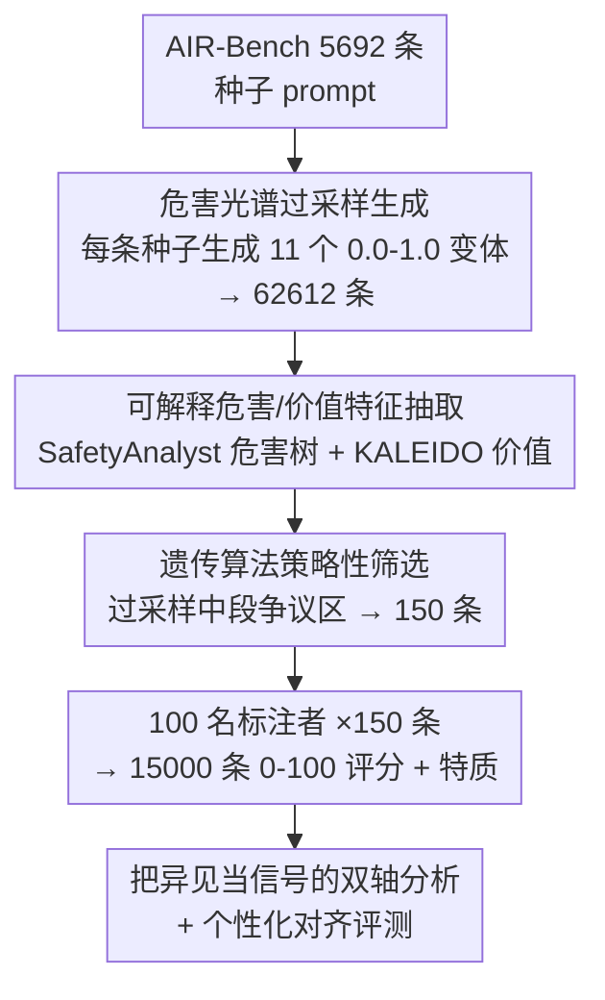

# PluriHarms: Benchmarking the Full Spectrum of Human Judgments on AI Harm

**会议**: ICLR 2026  
**OpenReview**: [https://openreview.net/forum?id=u7lXflJQX9](https://openreview.net/forum?id=u7lXflJQX9)  
**项目页**: [https://jl3676.github.io/PluriHarms](https://jl3676.github.io/PluriHarms)  
**代码**: 见项目页  
**领域**: AI 安全 / 对齐 / 数据集与基准  
**关键词**: 多元安全、危害判断、标注者异见、个性化对齐、安全基准

## 一句话总结
PluriHarms 用"过采样生成 → 可解释特征抽取 → 遗传算法筛选"的自动化流水线，造出 150 条横跨"完全无害到明确有害"光谱、且刻意聚焦边界争议的 prompt，配上 100 名标注者的 15,000 条评分与人口学/心理特质，把"标注者异见"当成信号而非噪声来研究，并据此评测安全模型——发现个性化对齐能显著提升对人类危害判断的预测，但仍有很大改进空间。

## 研究背景与动机
**领域现状**：当前主流的 AI 安全评测与对齐都把"有害性"当二元变量——一段内容要么 benign、要么 harmful（如 HarmBench、WildGuard 的训练范式）。这种单一视角对过滤极端内容是实用的。

**现有痛点**：二元安全策略带来两个结构性问题。其一，它聚焦于黑白分明的样本，导致安全数据集过度采样"极端无害 vs 极端有害"两端（如"西雅图今天天气"对比"如何贩卖儿童"），把系统最容易翻车的"模糊中间地带"给遮蔽了。其二，它无视边界样本上真实存在的、有意义的**异见**：对争议性政治话题、边缘幽默、敏感个人经历，持不同价值观的人会给出不同判断，而现有做法把这种标注分歧当成"统计噪声"取平均抹掉。

**核心矛盾**：危害判断本质上依赖价值观，是多元的、依赖语境的；但"取共识、取平均"的范式假定危害有唯一正确答案。把异见抹平，等于丢掉了"不同合法视角如何理解危害"这一关键信号，也就无法构建能识别、建模、适配多元人类视角的"多元安全"系统。

**本文目标**：(1) 造一个真正覆盖危害全光谱、且密集落在争议边界的 prompt 基准；(2) 系统刻画危害判断由哪些"prompt 特征"和"标注者特质"共同塑造、异见从何而来；(3) 评测现有安全模型与对齐方法能否捕捉这种多元性。

**切入角度**：作者用两条正交的轴来组织问题——**危害轴**（benign→harmful）和**异见轴**（agreement→disagreement）。只选 prompt（而非 response）来标注，因为 prompt 是模型无关的，能让每个标注者评更多样本以做强的"个体内"分析，且现实护栏本就主要作用在 prompt 上。

**核心 idea**：把"异见"从噪声升级为一等公民——用可控生成 + 遗传算法主动制造争议边界样本，再用混合效应模型拆解异见的社会-心理根源，最后证明"个性化对齐 > 共识对齐"。

## 方法详解

### 整体框架
PluriHarms 不是一个模型，而是"一条造数据的流水线 + 一套分析框架 + 一组评测协议"。整体分四步：先让 LLM 沿危害光谱**过采样生成**海量带细粒度危害等级的 prompt 变体；再用现成的安全/价值模型抽取**人类可解释的危害特征与价值特征**；然后用**遗传算法**从大池子里策略性筛出 150 条、刻意过采样中段争议区；最后收集 100 名标注者的评分，用**混合效应模型**把危害判断拆解成 prompt 特征 × 标注者特质，并在此基准上评测安全模型的个性化对齐能力。

### 关键设计

**1. 沿危害光谱过采样生成：强制造出细粒度的"危害梯度"而非只有黑白两端**

二元数据集的根病是只有极端样本、缺中间地带。作者反其道而行：以 AIR-Bench 2024 的 5,692 条 prompt 为种子，让 DeepSeek-V3 对**每一条种子生成 11 个变体**，在保持核心语义不变的前提下，把危害等级从 $0.0$（完全无害）连续调到 $1.0$（明确有害），最终得到 62,612 条 prompt。这种"过度生成"是刻意的——它逼模型为每个语义骨架产出可控、细粒度的危害渐变，从而获得在任意危害等级、尤其在模糊中段的覆盖，也给后续按目标分布灵活裁剪子集留足空间。人类标注事后验证了这套合成等级确实有效：合成危害等级与人类平均评分的 Spearman 相关达 $r=0.59$（$p=2.2\times10^{-15}$），且中高危害段（0.4–0.8）的评分方差和熵都更高，正好对应更高的标注分歧。

**2. 可解释危害/价值特征抽取：给每条 prompt 装上"为什么有害"的结构化标签**

要解释异见，光有一个危害分数不够，必须知道危害判断挂靠在哪些**可解释维度**上。作者假设危害感知有两大支柱——危害本身和背后的价值观——于是用两个专用模型抽特征：用 SafetyAnalyst 构建"危害树"，把潜在危害后果分解为针对利益相关者的**有害行为**（16 类，如 Criminal Activities）和**有害效果**（7 类，如 Physical Harm）；用 KALEIDO 标注每条 prompt 关联的价值、权利与义务，再用 BERTopic 把这些聚成 39 个价值类别（如 Right to Privacy、Duty to Promote Public Welfare）。这套人类可解释表示是整个分析的基石：后面所有"哪类危害最拉高评分""哪个特质放大对儿童危害的敏感度"的结论，都靠这 16+7+39 维特征空间才能算出来。

**3. 遗传算法策略性筛选边界样本：把 6 万条压成 150 条，但让中段争议区占大头**

有了大池子，怎么选出"既覆盖光谱、又密集落在争议边界、还在行为/效果/价值上保持多样"的 150 条？均匀随机采样会被两端的简单样本淹没。作者用遗传算法（10,000 代）配自定义的约束保持算子（如限制每个种子集最多出 2 条），去逼近一组目标分布。适应度定义为候选子集的经验特征分布与目标分布之间 **Jensen–Shannon 距离的倒数**（距离越小、适应度越高）。目标分布对危害等级做了精心的过采样：Level 0.5 占 24%、0.4 与 0.6 各 20%、0.3 与 0.7 各 10%……两端 0.0/1.0 各只占 1%，同时对行为/效果/价值做均匀采样以保证主题多样。结果就是一个"中间胖、两端瘦"的基准，刚好把评测火力集中在系统最易失败、人类最易分歧的地带。

**4. 把异见当信号的双轴分析 + 个性化对齐评测：用混合效应模型拆解分歧，再证明个性化 > 共识**

这是 PluriHarms 与以往基准的根本区别——异见不被取平均抹掉，而被建模。作者用一系列**混合效应线性回归**（带 lasso 特征选择）回答四个问题：RQ1 prompt 特征如何影响判断（含 annotator 随机截距，$R^2=0.273$，儿童危害/自我伤害/犯罪等"迫近、有形"的危害显著拉高评分，而心理伤害/社会伤害等抽象危害系数为负）；RQ2 标注者特质如何影响（含 prompt 随机截距，$R^2=0.0232$，在线毒性经历和社媒频率正向、教育/性别/政治倾向负向）；RQ3 特质是否调制 prompt 特征（如种族/性取向/政治倾向放大对儿童危害的权重，$\beta\approx0.034$），证明异见来自"谁在标 × 标什么"的结构化交互；RQ4 用 BIC 逐步加特征，确认加 prompt 特征带来最大增益，但叠加特质及其交互仍持续改善。落到评测：把数据集切成 100 条对齐集 + 50 条测试集，用 MAE 评安全模型。结论是——对齐到聚合（平均）评分几乎没收益（WildGuard 概率、SafetyAnalyst 聚合都差不多），而**个性化对齐持续胜出**，其中个性化 k-shot steering 最强；把 prompt 安全当概率变量而非二元也更好；通用大模型反而比专用安全模型预测得更准。

## 实验关键数据

### 主实验：安全模型在 PluriHarms 上的表现（MAE↓，越低越好）

| 类别 | 模型 / 方法 | MAE（个性化） | MAE（聚合） |
|------|------------|---------------|-------------|
| Baseline | Random | — | 0.386 |
| 通用模型 | GPT-4.1 Zero-Shot | — | 0.263 |
| 通用模型 | GPT-4.1 Value Profile | 0.233 | 0.260 |
| 通用模型 | GPT-4.1 K-Shot | **0.196** | 0.254 |
| 通用模型 | GPT-5 K-Shot | **0.195** | 0.256 |
| 通用模型 | Claude Sonnet-3.7 K-Shot | 0.201 | 0.250 |
| 通用模型 | Qwen-8B K-Shot | 0.197 | 0.257 |
| 专用安全 | WildGuard 7B Zero-Shot (Prob.) | — | 0.364 |
| 专用安全 | WildGuard 7B Zero-Shot (Cls.) | — | 0.403 |
| 专用安全 | SafetyAnalyst 8B | 0.311 | 0.361 |

要点：个性化 k-shot 把 MAE 压到 ~0.195–0.20，明显优于聚合（~0.25）和专用安全模型（0.31–0.40）；WildGuard 用概率（0.364）比用二元分类（0.403）更好，说明二元化本身有损失。

### 分析实验：不同特征类型对危害判断的贡献（ΔBIC，相对 Null Model BIC=41796）

| 模型 | 新增特征 | ΔBIC |
|------|---------|------|
| Model 1 | + 标注者特质 | −1338 |
| Model 2 | + 特质 × 特质交互 | −526 |
| Model 3 | + prompt 特征（行为/效果/价值） | −2389 |
| Model 4 | Model 3 + 特质 | −1107 |
| Model 5 | Model 4 + 特质交互 | −891 |
| Model 6 | Model 5 + prompt×特质交互 | −496 |

### 关键发现
- **prompt 特征贡献最大**：单加 prompt 特征带来 ΔBIC=−2389，是所有特征类型里增益最大的，说明"内容危害类型"是危害判断的主导力量。
- **异见是结构化的、不是噪声**：在 prompt 特征之上叠加标注者特质（−1107）及其交互（−891）仍持续改善拟合，证明系统性分歧来自"标注者是谁 × prompt 描述什么危害"的交互，而非单一因素。
- **个性化 > 共识**：聚合模型把异质标注者塌缩成平均，必然抹掉差异；个性化方法能直接从用户自己的样本学到其对危害特征的"特异权重"，因而 MAE 显著更低。
- **危害感知偏向"迫近、有形"**：儿童危害、自我伤害、犯罪等直接危险驱动高评分；心理/社会/制度性等抽象危害反而系数为负——人更看重眼前可触的风险。

## 亮点与洞察
- **把"标注分歧"当一等公民**：以往基准取平均、PluriHarms 主动制造并建模分歧，这一视角转变让"多元安全"从口号变成可测量的研究对象。
- **遗传算法 + JS 距离做数据塑形**：用适应度=1/JS 距离去逼近一个"中间胖"的目标分布，是把"想要什么样的数据分布"显式写进优化目标的优雅做法，可迁移到任何需要控制覆盖/多样性的数据集构建。
- **prompt 而非 response 的取舍很聪明**：选 prompt 换来模型无关性 + 每人标更多样本（强个体内分析）+ 贴合现实护栏作用位置，是经过权衡的设计而非偷懒。
- **"专用安全模型反被通用大模型超越"是个警钟**：说明现有专用 guardrail 在多元/边界判断上的泛化不足，留出了明确的改进空间。

## 局限与展望
- **规模偏小**：150 条 prompt、100 名标注者（均来自 Prolific），覆盖的人群与文化多样性有限，"全光谱"主要指危害等级光谱而非全球价值观光谱。
- **只标 prompt 不标 response**：换来了分析强度，但现实危害往往取决于模型实际回复，prompt 级判断与 response 级安全之间仍有 gap。
- **危害等级由 DeepSeek 合成**：合成等级虽被人类验证相关（$r=0.59$，但 $R^2$ 仅 0.36），生成模型自身的偏置可能渗入光谱。
- **特质能解释的方差很小**（$R^2=0.0232$）：作者解释为设计使然（变异主要在 prompt 层），但也意味着仅靠所测特质难以个性化预测，个性化收益更多来自 k-shot 直接拟合样本。

## 相关工作与启发
- **vs WildGuard / HarmBench（二元 guardrail）**: 它们做"安全/不安全"二分类，PluriHarms 把危害当连续变量并显式建模异见；实验也证明二元化（WildGuard Cls. 0.403）比概率化（0.364）更差。
- **vs SafetyAnalyst / KALEIDO**: 这两个是被 PluriHarms 复用的"特征抽取器"（危害树、价值标注），PluriHarms 在它们之上加了遗传算法筛选与异见分析，把单点工具串成研究框架。
- **vs 价值对齐 / pluralistic alignment（如 value profile steering）**: 同样关注多元价值，但 PluriHarms 提供了一个带细粒度危害光谱 + 边界争议样本的标准基准，让"个性化对齐 > 共识对齐"这一命题第一次可被定量验证。

## 评分
- 新颖性: ⭐⭐⭐⭐⭐ 把"异见即噪声"翻转为"异见即信号"，并用可控生成+遗传算法落地，视角与方法都新。
- 实验充分度: ⭐⭐⭐⭐ 4 个 RQ 的混合效应分析 + 跨 GPT/Claude/Qwen/专用模型的大规模评测充分，但样本规模偏小。
- 写作质量: ⭐⭐⭐⭐⭐ 双轴框架清晰，流水线、分析、评测层层递进，结论自洽。
- 价值: ⭐⭐⭐⭐⭐ 为多元安全提供了可复用的基准与方法范式，对 alignment 社区影响明确。

<!-- RELATED:START -->

## 相关论文

- [\[ICLR 2026\] Fair Decision Utility in Human-AI Collaboration: Interpretable Confidence Adjustment for Humans with Cognitive Disparities](fair_decision_utility_in_human-ai_collaboration_interpretable_confidence_adjustm.md)
- [\[CVPR 2026\] Detecting Compressed AI-Generated Images via Phase Spectrum Robustness](../../CVPR2026/ai_safety/detecting_compressed_ai-generated_images_via_phase_spectrum_robustness.md)
- [\[ICLR 2026\] Generative Adversarial Post-Training Mitigates Reward Hacking in Live Human-AI Music Interaction](generative_adversarial_post-training_mitigates_reward_hacking_in_live_human-ai_m.md)
- [\[ICLR 2026\] Certifying the Full YOLO Pipeline: A Probabilistic Verification Approach](certifying_the_full_yolo_pipeline_a_probabilistic_verification_approach.md)
- [\[ICLR 2026\] Formalising Human-in-the-Loop: Computational Reductions, Failure Modes, and Legal–Moral Responsibility](formalising_human-in-the-loop_computational_reductions_failure_modes_and_legal-m.md)

<!-- RELATED:END -->
