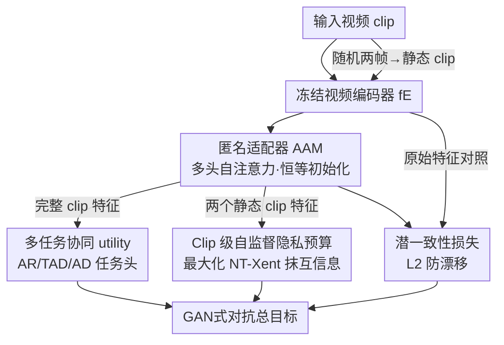

# Privacy Beyond Pixels: Latent Anonymization for Privacy-Preserving Video Understanding

**会议**: ICLR 2026  
**OpenReview**: [https://openreview.net/forum?id=ncA3UUL0Ri](https://openreview.net/forum?id=ncA3UUL0Ri)  
**代码**: 待确认  
**领域**: AI安全 / 隐私保护 / 视频理解  
**关键词**: 潜空间匿名, 隐私保护, 视频基础模型, 自监督, 性别偏见

## 一句话总结
在冻结的视频基础模型上挂一个轻量「匿名适配器」，直接在潜特征空间里用自监督对抗训练抹掉肤色/性别/着装等私密信息，让一套匿名特征通用于动作识别、时序检测、异常检测等多种下游任务——隐私泄露下降 35%，下游任务性能只掉 1-2%。

## 研究背景与动机

**领域现状**：视频基础模型（VFM，如 VideoMAE、V-JEPA）能抽出强大的时空特征，实践中常见做法是把这些特征抽取出来、存起来，然后复用到动作识别、时序动作检测、异常检测等多个任务上（病人监护、运动分析、监控等场景）。

**现有痛点**：这些高质量特征同时泄露了大量私密属性——攻击者只要在特征上训一个分类器，就能读出肤色、性别、着装等敏感信息，所以直接存储/分享这些特征是不安全的。而现有的隐私保护方法几乎全是**像素级（输入级）匿名**：它们改写输入帧，于是（1）必须用改过的数据**重训整个 utility 模型**——对在数百万视频上、用特定训练配方训出来的大型 VFM 完全不现实；（2）只对**单一下游任务**有效，比如 SPAct 只能做动作识别、TeD-SPAD 只能做异常检测，换个任务就失灵。

**核心矛盾**：像素级匿名的根本问题在于它把「匿名」和「具体 utility 任务」绑死了——改的是输入、训的是整条任务链路，所以既贵又不通用，跟「冻结大模型 + 特征复用」的现代范式格格不入。

**本文目标**：在**不动冻结编码器、不针对具体任务**的前提下，让抽出来的潜特征既保住通用视频理解能力，又抹掉私密属性，且这套匿名特征能直接迁移到未见过的下游任务。

**切入角度**：作者把战场从像素空间搬到**潜特征空间**——既然下游用的是特征，那就只在特征上做手术。给冻结编码器后面挂一个轻量、即插即用的适配器，只学「如何修改特征」，不碰大模型本身。

**核心 idea**：用一个在 clip 级时序特征上工作的匿名适配器（AAM），配合三个训练目标，在潜空间里 GAN 式对抗地「抹空间信息、留时序信息」——空间信息恰好承载肤色/着装等隐私，时序信息恰好是 utility 任务要的。

## 方法详解

### 整体框架

方法叫 **SPLAVU**（Self-supervised Privacy-preservation via Latent Anonymization for general Video Understanding）。整条流水线只有一个可训练件：挂在**冻结视频编码器** $f_E$ 后面的**匿名适配器** $f_A$（AAM），其余编码器和任务头全部冻结/离线训练。

输入一个视频 clip，先过冻结编码器拿到 clip 级全局嵌入 $h_t = f_E(x_t)$（Transformer 取 [CLS]、CNN 取平均池化）；同时从该视频里随机抽两帧、拼成两个「静态 clip」。所有 clip 都经 $f_E$ 再经 $f_A$。$f_A$ 的输出兵分三路：完整 clip 特征送进各 utility 任务头（动作识别/时序检测/异常检测）算 utility 损失；两个静态 clip 特征送进自监督隐私预算损失；同时 $f_A$ 前后的特征算潜一致性损失。三类损失以 GAN 式对抗方式联合优化、梯度全部回传到 $f_A$。训练完只需把这个轻量 $f_A$ 接到现成 $f_E$ 后面就能用。

### 关键设计

**1. 潜空间匿名范式 + 轻量匿名适配器 AAM：把匿名从输入搬到特征、从重训降为插件**

针对像素级匿名「要重训大模型、且任务专用」的痛点，SPLAVU 完全不碰冻结编码器 $f_E$，只在它后面挂一个即插即用的小模块 $f_A$（AAM）来改写潜特征，因此无需重新抽特征、无需微调 VFM。AAM 用多头自注意力 Transformer 实现，关键在于它作用于 **clip 级时序特征**而非单帧——这样匿名器能在时序维度上「沟通」，天然贴合视频任务，而以往方法都是 2D U-Net 逐帧处理。AAM 还有两个工程要点：**恒等初始化**（一开始等于不改特征，保证训练稳定）和**保持特征维度不变**（输出形状与 $f_E$ 一致，下游任务头无需改动）。正因它只在单个 clip 级嵌入上动手、且与具体任务解耦，这套匿名才第一次做到「跨任务通用、且能上大规模 VFM」。

**2. Clip 级自监督隐私预算：不用隐私标签，靠抹互信息摧毁空间隐私**

隐私保护最棘手的地方是不该依赖私密属性标签（采集这些标签本身就侵犯隐私）。作者的直觉是：同一视频里两帧之间**共享大量互信息**，而这些共享的多是静态空间信息（肤色、着装、背景），恰恰是隐私所在。于是从同一视频采两帧拼成两个静态 clip，用 SimCLR 的 NT-Xent 对比损失度量二者相似度：

$$L_B^{(i)} = -\log \frac{d(\bar h^{(i)}_{\bar t_1}, \bar h^{(i)}_{\bar t_2})}{\sum_{j=1}^{N}\mathbb{1}_{[j\neq i]}\,[\,d(\bar h^{(i)}_{\bar t_1}, \bar h^{(j)}_{\bar t_1}) + d(\bar h^{(i)}_{\bar t_1}, \bar h^{(j)}_{\bar t_2})\,]}$$

其中 $d(u,v)=\exp(u^\top v/(\lVert u\rVert\lVert v\rVert\tau))$ 是带温度 $\tau$ 的相似度。NT-Xent 本来是要**最大化**同源 clip 相似度，作者反其道而行之——在总目标里给它**负号去最大化该损失**，逼匿名器去**破坏**两个静态 clip 间的互信息，从而抹掉共享的空间隐私信息。两个关键区别让它比前作更自然：一是匿名器跨时序工作（3D clip 而非 2D 帧），与 utility 损失一配合就学会「只删空间、留住解任务所需的时序信息」；二是计算静态 clip 特征时**直接复用 $f_E$ 本身**（把帧平铺成标准 clip 形状），而非像旧方法另起一个独立图像编码器，使隐私-utility 的相互作用更顺畅。

**3. 潜一致性损失：防止匿名器对见过的 utility 任务过拟合，保住未见任务的泛化**

只有隐私损失 + utility 损失时，作者发现匿名过程会**过拟合到训练用的代理 utility 任务**（Tab. 6），换个未见任务就崩。原因是匿名器可能把特征整体推到一个只对训练任务有利的新空间。为此加一个潜一致性损失，约束匿名前后特征别漂太远：

$$L_{LC}^{(i)} = \lVert f_E(x^{(i)}) - f_A(f_E(x^{(i)}))\rVert_2^2$$

它保住了 $f_E$ 原本的通用潜结构，使匿名后的特征仍能迁移到训练时没见过的任务。Tab. 6 直接印证：去掉 $L_{LC}$ 后在未见的 THUMOS14（mAP）上从 56.50 暴跌到 3.81——没有它匿名就退化成对动作识别的特化。有意思的是它也是一个「旋钮」：对于步态这类**依赖时序签名**的敏感属性，保留 $L_{LC}$ 反而不会过度压制（Tab. 7）。

**4. 多任务协同 utility + GAN 式对抗总目标：用多任务梯度把匿名和效用拧成一股绳**

为保住动作理解能力，作者用协同训练框架让多个任务共同优化匿名器。借助潜空间表述，**第一次实现了用其他下游任务的梯度来做匿名训练**：动作识别头用标准交叉熵，时序检测和异常检测直接接入 SOTA 方法（TriDet、MGFN）的训练目标，三者加权合并：

$$L_{T^*}^{(i)} = \omega_{AR}L_{AR} + \omega_{TAD}L_{TAD} + \omega_{AD}L_{AD}$$

默认三个权重都设为 1。最终总目标把三类损失拧在一起，并用负号让隐私项与 utility/一致性项对抗：

$$L^{(i)} = \omega_{LC}L_{LC}^{(i)} + \omega_{T}L_{T^*}^{(i)} - \omega_{B}L_{B}^{(i)}$$

这是一个 GAN 式博弈：隐私项被最大化、与 $L_T$ 和 $L_{LC}$ 对抗拉扯，直到匿名器学会「删掉所有编码的空间信息、只留下 utility 任务必需的部分」。消融（Tab. 5）显示即使训练时只见过部分任务，靠潜一致性损失也能泛化到未见任务（如只用 TAD 训练，AR/AD 性能仍在非匿名分数 1.3% 以内）。

### 损失函数 / 训练策略
- $f_A$ 恒等初始化；$f_E$ 用 Kinetics400 预训练权重并冻结；各任务头先在非匿名特征上单独训好（动作识别为线性层，TAD/AD 用 TriDet/MGFN）。
- 训练是 $L_B$（隐私）与 $L_{T^*}$（效用）的对抗优化，再由 $L_{LC}$ 正则；梯度全部回传到 $f_A$ 与任务头。
- 隐私是「越高越私密」，故 $L_B$ 取负号最大化。

## 实验关键数据

### 主实验（Tab. 1：下游任务套件上的隐私-效用权衡）

| 骨干 | 方法 | VISPR 隐私 cMAP↓ | K400 Top-1↑ | UCF101 Top-1↑ | THUMOS14 mAP↑ | UCF-Crime AUC↑ |
|------|------|------|------|------|------|------|
| I3D | Raw Videos | 63.64 | 62.67 | 90.30 | 25.29 | 77.68 |
| I3D | TeD-SPAD'23 | 52.30 | 47.20 | 76.64 | 17.27 | 74.81 |
| I3D | **Ours** | **41.07** (↓35.5%) | 62.11 (↓0.9%) | 90.14 (↓0.2%) | 24.92 (↓1.5%) | 75.69 (↓2.6%) |
| VideoMAE-B | Raw / **Ours** | 70.47 / **49.92** (↓28.9%) | 74.86 / 74.23 | 96.80 / 96.11 | 60.82 / 60.50 | 85.79 / 85.08 |
| V-JEPA-H | Raw / **Ours** | 72.44 / **51.42** (↓29.0%) | 77.03 / 76.62 | 97.67 / 97.54 | 66.66 / 66.30 | 85.79 / 84.81 |

关键对比：旧方法（SPAct/TeD-SPAD）在 THUMOS14 时序检测上掉得很惨（25.29→16~17），而 SPLAVU 几乎不掉（24.92），且隐私降幅远更大。

时序私密属性（Tab. 2）：在 VP-HMDB51/VP-UCF101 上，SPLAVU 的 cMAP（70.5/69.6）与**用监督隐私标签训练**的版本（70.4/69.5）持平，但动作准确率几乎不掉，说明无标签自监督就够了。

### 消融实验

| 配置（LT / LB / LLC） | VISPR cMAP↓ | HMDB51 Top-1↑ | THUM14 mAP↑ | 说明 |
|------|------|------|------|------|
| ✗ / ✗ / ✗ | 70.47 | 74.20 | 60.82 | 原始特征 |
| ✗ / ✓ / ✓ | 45.12 | 4.71 | 1.52 | 没 utility → 效用全崩 |
| ✓ / ✗ / ✓ | 70.44 | 73.17 | 60.34 | 没隐私损失 → 隐私没降 |
| ✓ / ✓ / ✗ | 51.70 | 72.88 | **3.81** | 去掉潜一致性 → 未见任务暴跌 |
| ✓ / ✓ / ✓ | 54.35 | 73.92 | 56.50 | 完整模型 |

### 关键发现
- **潜一致性损失最关键也最微妙**：去掉它后在未见任务 THUMOS14 上 mAP 从 56.50 崩到 3.81，证明它是「跨未见任务泛化」的命门（Tab. 6）。
- **数据高效**：即便只在小数据集 HMDB51 上训练匿名器，也能在全部下游任务保持优秀的隐私-效用权衡（Tab. 4）。
- **任务可泛化**：训练时只见一个任务（如只 TAD），未见任务性能仍在非匿名分数 1.3% 内（Tab. 5）。
- **缓解性别偏见**：在 NTU-Bias-F 上把感知性别子类准确率差距 9.42% 相对缩小 42.3%；真实场景 Toyota Smarthome 上相对缩小 39.5%（Tab. 3）——且没用任何显式去偏目标。
- **步态这类时序隐私可调**：保留 $L_{LC}$ 时步态识别（Casia-B）仍部分保留，去掉 $L_{LC}$ 则从 53.45 进一步压到 26.67（Tab. 7），说明一致性损失同时控制时序私密属性的去留。

## 亮点与洞察
- **「抹空间、留时序」的物理直觉很漂亮**：隐私（肤色/着装）几乎全在空间通道，utility（动作）几乎全在时序通道；把匿名器放在 clip 级时序特征上做对比互信息最小化，相当于天然地把两者分离开。
- **复用编码器自身算静态 clip 特征**，而不是另起一个图像编码器，是个容易被忽略但很关键的设计——它让隐私损失与 utility 损失在同一特征空间里博弈，相互作用更自然。
- **潜一致性损失把「过拟合到代理任务」这个隐患直接变成可调旋钮**：既保住未见任务泛化，又能控制步态这类时序敏感属性的保留程度，一举两得。
- **顺带把隐私保护和去偏统一起来**：自监督地抹掉与人相关的虚假相关，等价于一种去偏，这个「隐私即去偏」的观察可迁移到其他公平性任务。

## 局限与展望
- 性别评估用了 male/female 二元假设，作者自己承认不够包容、不能覆盖所有性别类别。
- 隐私-效用仍是权衡而非两全：大骨干上隐私 cMAP 仍有 49~51（远高于随机），并非彻底抹除；UCF-Crime 等任务仍有 ~1-3% 的下游损失。
- 不同骨干、不同任务的降幅不可直接横比（任务难度/指标不同），表里的「↓x%」需结合各自 baseline 看。
- 主要面向 RGB 视频与 clip 级全局嵌入；对需要 dense/patch 级特征的任务、或采集端隐私（传感器层）不在覆盖范围。

## 相关工作与启发
- **vs SPAct (CVPR'22)**：同样用自监督互信息最小化，但 SPAct 是**像素级、且只针对动作识别**，换任务（如时序检测）就崩；本文搬到潜空间、跨多任务通用，且无需重训 VFM。
- **vs TeD-SPAD (ICCV'23)**：把 SPAct 的自监督隐私目标适配到**异常检测单任务**；本文用一套匿名特征同时覆盖 AR/TAD/AD 多任务，THUMOS14 上效用保持远更好。
- **vs Wu et al. (TPAMI'20, VITA)**：基于 U-Net 的对抗匿名，2D 逐帧、需私密属性标签且重训任务模型；本文 3D clip 级、自监督无标签、冻结编码器即插即用。

## 评分
- 新颖性: ⭐⭐⭐⭐⭐ 首次把视频隐私匿名搬到潜空间、做到冻结大模型 + 跨任务通用，范式层面的创新。
- 实验充分度: ⭐⭐⭐⭐⭐ 三类骨干 × 五类任务 + 数据规模/任务泛化/步态/性别偏见/特征反演攻击多角度消融。
- 写作质量: ⭐⭐⭐⭐ 三个损失与对抗机制讲得清楚，图 2 工作流直观。
- 价值: ⭐⭐⭐⭐⭐ 直击「特征复用时代」的隐私痛点，即插即用、数据高效，且顺带缓解性别偏见，落地性强。

<!-- RELATED:START -->

## 相关论文

- [\[ICLR 2026\] Rethinking LoRA for Privacy-Preserving Federated Learning in Large Models](rethinking_lora_for_privacy-preserving_federated_learning_in_large_models.md)
- [\[ICLR 2026\] Beyond Membership: Limitations of Add/Remove Adjacency in Differential Privacy](beyond_membership_limitations_of_addremove_adjacency_in_differential_privacy.md)
- [\[CVPR 2026\] PrivateEyes: Gaze-Preserving Anonymization for Data Sharing](../../CVPR2026/ai_safety/privateeyes_gaze-preserving_anonymization_for_data_sharing.md)
- [\[ICML 2026\] MetaMoE: Diversity-Aware Proxy Selection for Privacy-Preserving Mixture-of-Experts Unification](../../ICML2026/ai_safety/metamoe_diversity-aware_proxy_selection_for_privacy-preserving_mixture-of-expert.md)
- [\[ICCV 2025\] FedMeNF: Privacy-Preserving Federated Meta-Learning for Neural Fields](../../ICCV2025/ai_safety/fedmenf_privacy-preserving_federated_meta-learning_for_neural_fields.md)

<!-- RELATED:END -->
