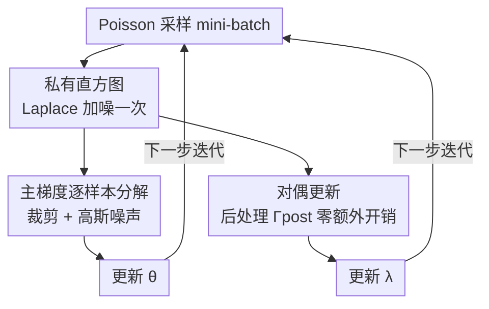

# Private Rate-Constrained Optimization with Applications to Fair Learning

**会议**: ICLR 2026  
**OpenReview**: [https://openreview.net/forum?id=mex3rvs2KX](https://openreview.net/forum?id=mex3rvs2KX)  
**代码**: https://github.com/cleverhans-lab/dp-raco  
**领域**: 差分隐私 / 公平学习 / 约束优化  
**关键词**: 差分隐私, 速率约束, 群体公平, SGDA, 私有直方图

## 一句话总结
本文提出 RaCO-DP——一个差分隐私版的随机梯度下降-上升（SGDA）算法，通过把"群体公平"等各类速率约束统一成基于直方图的"广义速率约束"，让整套约束优化的额外隐私开销只相当于每步私有估计一个 mini-batch 直方图的代价，从而在隐私-效用-公平三角上 Pareto 超越了现有私有公平学习方法。

## 研究背景与动机
**领域现状**：可信机器学习里有一大类任务——群体公平（demographic parity、equalized odds）、稳健优化、代价敏感学习——都能写成"在满足某些**速率约束**（prediction rate constraints）的前提下最小化模型误差"的约束优化问题。所谓速率约束，就是对模型在不同数据子集上的预测率（例如各性别群体被预测为"正"的比例）施加条件。当这些任务训练在病历、员工档案这类敏感数据上时，又必须加上差分隐私（DP）保护。

**现有痛点**：私有约束优化几乎只研究过"公平"这一种约束，且这些专门为公平定制的方法无法推广到更一般的速率约束。更根本的是，标准 DP 优化工具（DP-SGD）依赖一个前提：目标函数能**按单样本分解**，这样才能做逐样本梯度裁剪和加噪。但速率约束依赖的是跨群体的**聚合统计量**（某个子集里多少样本被预测为某类），天然带有样本间依赖，破坏了可分解性，因此没法直接塞进 DP-SGD。

**核心矛盾**：DP-SGD 的隐私保证建立在"每个样本对梯度的影响可被单独裁剪"之上；而速率约束（或其正则项）里出现的归一化项 $|B_{\cap I}|$（mini-batch 落在某子集里的样本数）涉及整个 mini-batch，无法拆成单样本项。可分解性与速率约束这两者根本不兼容。

**本文目标**：构建第一个面向**任意速率约束**的通用 DP 框架，既能处理多分类、又能在 DP 下高效评估约束，并给出非凸情形下的收敛性证明。

**切入角度**：作者观察到所有速率约束本质上都是在"数据集的某个划分（partition）的各子集上、各类别的预测率"的线性组合。如果先把这些预测率私有地汇总成一张直方图，那么**约束求值和约束梯度都只是对这张直方图的后处理**——而后处理不消耗额外隐私预算。

**核心 idea**：用一张"每步私有估计、主更新与对偶更新共用"的直方图，把速率约束的隐私开销压缩到只剩"私有发布一个直方图"那么多。

## 方法详解

### 整体框架
RaCO-DP 求解的是约束经验风险最小化的拉格朗日 min-max 形式：

$$\min_{\theta\in\mathbb{R}^d}\ \max_{\lambda\in\Lambda}\ \Big\{ L(\theta,\lambda) := \ell(\theta) + \sum_{j=1}^{J}\lambda_j\big(\Gamma_j(\theta)-\gamma_j\big) \Big\}$$

其中 $\theta$ 是模型参数（primal），$\lambda$ 是拉格朗日乘子（dual），$\Gamma_j$ 是第 $j$ 条速率约束，$\gamma_j$ 是松弛阈值。它在标准 SGDA（对 $\theta$ 下降、对 $\lambda$ 上升）外面套一层差分隐私。

每一步迭代在一个 Poisson 采样得到的 mini-batch $B^{(t)}$ 上做三件事：(1) **私有直方图计算**——对划分的每个子集 $D_q$、每个类别 $k$，私有地累加 mini-batch 里属于 $D_q$ 的样本的 softmax 预测，得到带噪直方图 $\hat H^{(t)}$；(2) **私有主更新**——把拉格朗日里跟约束有关的项**改写成可逐样本计算**的形式（依赖 $\hat H^{(t)}$ 做后处理），然后像 DP-SGD 一样逐样本裁剪、求平均、加高斯噪声更新 $\theta$；(3) **私有对偶更新**——直接在 $\hat H^{(t)}$ 上后处理算出每条约束的取值，从而更新 $\lambda$ 而不花额外隐私预算。整个算法的隐私性来自把"子采样的 Laplace 机制 + 子采样的高斯机制"在 $T$ 步上做组合（composition）。

> 上图里的直方图、主梯度分解、对偶后处理三块，对应下面的关键设计 2/3/4；而它们能被"统一成一张直方图"的前提，是关键设计 1 的广义速率约束。

### 关键设计

**1. 广义速率约束：把所有速率约束统一成直方图可表达的形式**

现有速率约束（Goh、Cotter 等）只定义在二分类上，且看不出怎么在 DP 下高效求值。作者把它推广成：先取数据集的一个"全局划分" $\{D_1,\dots,D_Q\}$，再允许每条约束在这个划分的**任意子集并集**上计算预测率。形式上，第 $j$ 条约束写成

$$\Gamma_j(\theta) = \sum_{I\in\mathcal{I}_j}\sum_{k=1}^{K}\alpha_{j,I,k}\,P_k\big(\cup_{i\in I}D_i;\theta\big)$$

其中 $\mathcal{I}_j\subseteq 2^{[Q]}$ 是子集族、$\alpha_j$ 是公开的权重向量，$P_k(\cdot;\theta,\tau)=\frac{1}{|D|}\sum_x \sigma_\tau(h(\theta;x))_k$ 是用 tempered softmax $\sigma_\tau$ 软化后的可微预测率（温度 $\tau\to\infty$ 时退回硬预测率）。以人口公平为例，全局划分就是敏感群体（如 Asian/Black/Caucasian），某条约束的局部数据集是 {Asian, Non-Asian}，权重取 $+1/-1$。这个统一形式有两个好处：它天然支持多分类（旧形式做不到），并且**所有约束都归结为"在划分子集上、按类别求预测率之和"**——这正是后续能用一张直方图搞定隐私的结构基础。作者还指出全局划分越小（$Q$ 越小），噪声利用越高效、隐私-效用越好。

**2. 私有直方图：一次加噪，主更新与对偶更新共享**

每步要算的所有量（主梯度里的归一化项、对偶里的约束取值）都依赖"各子集各类别的预测率之和"。作者把它们汇成一张直方图 $H^{(t)}_{q,k}=\sum_{x\in D_q\cap B^{(t)}}\sigma(h(\theta;x))_k$。关键观察是这张直方图的 $\ell_1$ 敏感度恰好为 1：每个样本只属于全局划分的一个子集，且它的 softmax 预测在各类别上加和为 1，所以单个样本最多改变直方图 $\ell_1$ 范数 1。于是只需对每个元素加 Laplace 噪声即可达 $\varepsilon$-DP：

$$\hat H^{(t)}_{q,k} = H^{(t)}_{q,k} + \mathrm{Lap}(1/\varepsilon)$$

由于 $\hat H^{(t)}$ 已经是 DP 的，之后无论主更新还是对偶更新都只是对它做**后处理**，根据差分隐私的后处理性质不再消耗任何额外预算。这就是"额外隐私开销 = 私有发布一个直方图"这句话的来源——把原本要多次查询数据的开销压缩成了一次。

**3. 主梯度的逐样本分解：拆掉对整个 mini-batch 的依赖**

DP-SGD 要求每个样本对梯度的贡献可被单独裁剪，而正则项 $R(\theta,\lambda;B)$ 里出现的 $P_k(B_{\cap I};\theta)=\frac{1}{|B_{\cap I}|}\sum_{x\in B_{\cap I}}\sigma(h(\theta;x))_k$ 带有归一化分母 $|B_{\cap I}|$，它取决于整个 mini-batch，挡住了逐样本分解。作者的破解办法是注意到 $|B_{\cap I}|=\sum_{i\in I}\sum_k H^{(t)}_{i,k}$，于是可以用直方图把这个分母"读出来"，得到逐样本的正则项估计：

$$\hat R(\theta,\lambda;H,x)=\sum_{j=1}^{J}\lambda_j\Big(\sum_{I\in\mathcal{I}_j}\sum_{k_1}\alpha_{j,I,k_1}\frac{\mathbb{1}[x\in B_{\cap I}]}{\sum_{i\in I}\sum_{k_2}H^{(t)}_{i,k_2}}\sigma(h(\theta;x))_{k_1}-\gamma_j\Big)$$

实际计算时把 $H$ 换成私有版 $\hat H$。这样每个样本的梯度（损失项 $\frac{\nabla_\theta\ell(\theta;x)}{r|D|}$ 加上上式对 $\theta$ 的导数）就是良定义的、可逐样本裁剪的量，于是标准 DP-SGD 三件套——裁剪、平均、加高斯噪声——直接适用。注意这个估计因归一化项是有偏的，作者把这种偏置纳入了收敛性分析。

**4. 对偶更新零额外开销 + 偏置梯度下的收敛性分析**

对偶梯度就是约束当前取值减去松弛 $\nabla_\lambda L_j=\Gamma_j(\theta^{(t)};B^{(t)})-\gamma_j$，若直接在 mini-batch 上重新评估约束会再花一次隐私预算。作者引入一个后处理函数直接作用在私有直方图上：

$$\Gamma^{\text{post}}_j(\hat H^{(t)})=\sum_{I\in\mathcal{I}_j}\sum_{k_1}\alpha_{j,I,k_1}\frac{\sum_{i\in I}\hat H^{(t)}_{i,k_1}}{\sum_{i\in I}\sum_{k_2}\hat H^{(t)}_{i,k_2}}$$

它把"子集内各样本的预测和"替换成直方图对应计数，因 $\hat H^{(t)}$ 已是 DP，对偶更新不再花一分隐私预算。理论上，由于直方图带噪导致主/对偶梯度**有偏**、且噪声尺度随维度 $d$ 与约束数 $J$ 剧烈变化，经典 SGDA 收敛证明不适用。作者给出一套新分析：它允许有偏梯度、对偶误差只需用 $\ell_\infty$（而非 $\ell_2$）刻画，并**利用对偶参数的线性结构**把收敛速率从 Lin 等人的 $T^{-1/6}$ 提升到 $T^{-1/4}$，逼近普通极小化（而非 min-max）问题的速率。最终（无裁剪版）证明：在 Lipschitz 且光滑假设下，算法以高概率找到 $(\alpha,\alpha)$-stationary point，且

$$\alpha=O\Big(\big(\tfrac{\sqrt{d\log(JKn/\rho)\log(n/\delta)}}{n\varepsilon}\big)^{1/3}+\tfrac{K^{1/4}\sqrt{\log(n/\delta)}\log^{1/4}(JKn/\rho)}{(n\varepsilon)^{1/4}}\Big)$$

其中 $n=\min_q|D_q|$ 是最小子集规模——这也解释了为何全局划分越小、子集越大，效用越好。

### 损失函数 / 训练策略
目标是拉格朗日 min-max；对偶变量约束在紧致凸集 $\Lambda$ 上（限制约束不满足时的惩罚，保证非凸下可分析）。隐私参数由定理 4.1 给出尺度：Laplace 参数 $b\ge 2\max(1/\varepsilon, r\sqrt{T\log(T/\delta)}/\varepsilon)$、高斯噪声 $\sigma\ge 10\max(C\log(T/\delta)/(r|D|\varepsilon), C\sqrt{T\log(T/\delta)}/(|D|\varepsilon))$；实验中改用更紧的数值隐私会计器（Doroshenko 等）。mini-batch 用 Poisson 采样以享受子采样隐私放大。tempered softmax 温度 $\tau=1$ 在实践中已足以让软约束逼近硬约束。裁剪范数 $C$ 是关键超参（过小会把收敛推出可行域）。

## 实验关键数据

### 主实验
评测覆盖三类约束（人口公平 demographic parity、假阴性率 FNR、equalized odds）与多个数据集（Adult、Credit-Card、Parkinsons、ACSEmployment、CelebA、Heart），baseline 包括 DP-FERMI（Lowy 2023）、Tran 2021、Jagielski 2019，统一 $\delta=10^{-5}$。

| 场景 | 模型 / 数据 | 关键结果 | 对比 |
|------|------------|---------|------|
| 表格数据公平 | 逻辑回归 / Adult、Credit、Parkinsons | 同隐私预算下，任意固定公平差距处准确率均高于所有 baseline（Pareto 占优） | 优于 DP-FERMI / Tran 2021 |
| 深度网络 | ResNet16(6.4M) / CelebA, $\varepsilon=1$ | 90% 准确率 + 仅 10% 人口差距 | 接近非私有 95% |
| 多约束扩展 | 逻辑回归 / ACSEmployment | 18 个子群约束同时满足，$\varepsilon=1$ 下仍具竞争力 | 对比非私有 SGDA |
| 计算效率 | Adult | 每步训练比 DP-FERMI **快约三个数量级** | 同硬件公开代码对比 |

### 消融 / 分析实验

| 配置 | 现象 | 说明 |
|------|------|------|
| 约束可满足性 (Adult) | 硬速率约束稳定收敛到预设 $\gamma$（$\gamma=0.01\sim0.2$） | 直接拉格朗日比 baseline 的"间接调超参"更可靠 |
| 温度 $\tau=1$ | 已足以在实践中强制硬约束 | 无需精调温度 |
| 裁剪范数 $C$（FNR=0, 无噪声） | $C<12.5$ 时无法满足约束 | 裁剪会让收敛偏出可行域，$C$ 是关键超参 |
| 硬约束替代软约束（对偶更新） | 效用提升有限，且偏离理论保证 | 软约束是默认更稳的选择 |

### 关键发现
- **隐私差距何时收窄**：当数据量相对模型维度很大、收敛很快（几十步内）时，可用大 batch 降噪 + 子采样放大，$\sigma$ 和 $b$ 都小，RaCO-DP 几乎追平非私有准确率（逻辑回归上明显）；换成 ResNet16 这类高容量模型后差距重新拉大。
- **直接可控的公平度**：与 DP-FERMI 这类靠惩罚项+调超参间接控制公平不同，RaCO-DP 让从业者**直接指定最大允许差距** $\gamma$，约束满足性实测可靠。
- **更强的隐私语义**：相比只保护敏感标签隐私（label privacy）的 Tran/Jagielski，RaCO-DP 保护整个数据集，却仍取得更优的隐私-公平 trade-off。

## 亮点与洞察
- **"一张直方图"的杠杆**：把所有速率约束的隐私开销压缩成"私有发布一张直方图"，靠的是 $\ell_1$ 敏感度恰为 1（样本属于唯一子集 + softmax 加和为 1）这个干净的结构——这是把可信 ML 约束塞进 DP 的关键支点，思路可迁移到其他"聚合统计驱动"的约束。
- **后处理免费午餐用到极致**：主更新借直方图读出归一化分母、对偶更新直接在直方图上算约束值，两处都只是后处理，因此除直方图外不再有任何隐私成本。
- **利用对偶线性结构加速收敛**：把 min-max 的收敛分析从 $T^{-1/6}$ 提到 $T^{-1/4}$，说明"对偶参数是线性的"这一结构性事实可以被显式利用——对一般私有 min-max 优化有借鉴价值。
- **打破"隐私必然损害公平"的成见**：作者论证只要算法设计得当，人口公平这类约束下的隐私-公平 trade-off 远没想象中严重。

## 局限与展望
- **裁剪带来的偏置**：梯度裁剪会使 SGD 收敛偏离可行域，裁剪范数 $C$ 成为敏感超参（如 FNR=0 时 $C<12.5$ 直接失败）；这是 DP-SGD 类方法的通病而非本文独有，但仍需谨慎调。
- **软约束 vs 硬约束**：理论保证建立在软约束（tempered softmax）上；实践中可换硬约束，但会脱离理论保证且效用收益有限。
- **收敛速率较慢**：相比 Lowy 2023 的 proxy-objective 方法，RaCO-DP 理论收敛率更慢，换来的是更强通用性（任意可组合的速率约束），因此直接横向比较有 caveat。
- **作者展望**：探索个体公平（individual fairness）下的私有学习——这类约束无法写成速率约束，需要新思路。

## 相关工作与启发
- **vs DP-FERMI (Lowy et al. 2023)**：他们为公平设计一个 proxy 目标做随机优化、只能间接控制公平度；RaCO-DP 直接面向速率约束、支持任意约束自由组合、可直接指定最大差距，且在更强的标准 DP（而非更弱的敏感属性 DP）下仍取得更优 trade-off，每步还快约三个数量级。
- **vs Jagielski 2019 / Tran 2023（敏感属性隐私）**：这类方法只保护敏感标签、注噪更少所以效用更高，但个体仍可能被非敏感属性重识别，隐私语义弱于本文，不可直接比较。
- **vs Berrada et al. 2023**：他们用裸 DP-SGD、发现良好泛化模型下隐私-公平 trade-off 不明显，但其"公平"是误差差距（更像子群泛化）；本文表明对 demographic parity 这类约束确实需要专门缓解，而恰当的算法设计能克服 trade-off。
- **vs 经典 SGDA / DP min-max（Yang 2022, Lin 2020, Bassily 等）**：本文是首批把速率约束 + DP + 非凸 SGDA 收敛分析打通的工作，且用对偶线性结构换来了更快速率。

## 评分
- 新颖性: ⭐⭐⭐⭐⭐ 首个面向任意速率约束的通用 DP 框架，"广义速率约束 + 私有直方图后处理"的结构化洞察很干净。
- 实验充分度: ⭐⭐⭐⭐ 覆盖三类约束、表格到深度网络、单约束到 18 约束，Pareto 占优且效率优势显著；少量比较因隐私语义/收敛率差异有 caveat。
- 写作质量: ⭐⭐⭐⭐⭐ 动机—结构—算法—理论层层递进，图 1 把广义速率约束讲得很直观。
- 价值: ⭐⭐⭐⭐⭐ 把可信 ML 里一大类约束统一纳入 DP，并给出可直接指定公平度的实用工具，应用面广。

<!-- RELATED:START -->

## 相关论文

- [\[ICLR 2026\] A Bayesian Nonparametric Framework for Private, Fair, and Balanced Tabular Data Synthesis](a_bayesian_nonparametric_framework_for_private_fair_and_balanced_tabular_data_sy.md)
- [\[ICLR 2026\] On Optimal Hyperparameters for Differentially Private Deep Transfer Learning](on_optimal_hyperparameters_for_differentially_private_deep_transfer_learning.md)
- [\[ICLR 2026\] Fair Graph Machine Learning under Adversarial Missingness Processes](fair_graph_machine_learning_under_adversarial_missingness_processes.md)
- [\[ICLR 2026\] Fair Reinforcement Learning for Just AI](fair_reinforcement_learning_for_just_ai.md)
- [\[ICLR 2026\] PateGAIL++: Utility Optimized Private Trajectory Generation with Imitation Learning](pategail_utility_optimized_private_trajectory_generation_with_imitation_learning.md)

<!-- RELATED:END -->
