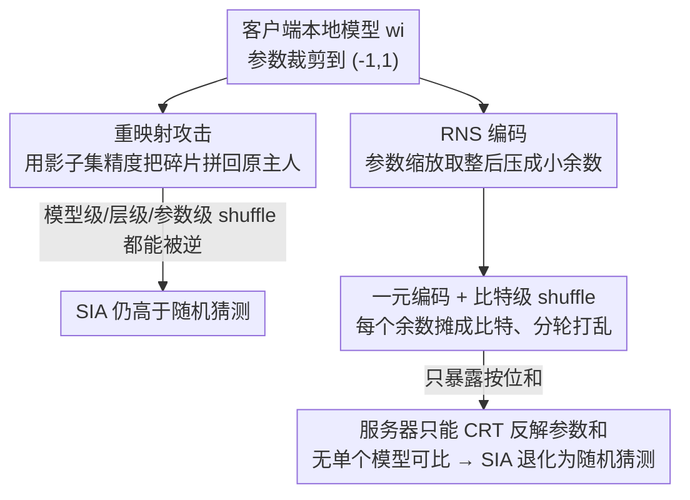

# Protection against Source Inference Attacks in Federated Learning

**会议**: ICLR 2026  
**OpenReview**: [https://openreview.net/forum?id=1GMw3IwEHW](https://openreview.net/forum?id=1GMw3IwEHW)  
**代码**: 待确认  
**领域**: AI 安全 / 联邦学习隐私  
**关键词**: 联邦学习, 来源推断攻击, shuffle 模型, 剩余数系统, 隐私保护

## 一句话总结
针对联邦学习里"服务器猜某条数据属于哪个客户端"的来源推断攻击（SIA），本文指出标准 shuffle 不够用——攻击者能借影子数据集把打乱的模型重新映射回原主人；作者把**参数级 shuffle 与剩余数系统（RNS）+ 一元编码**组合到比特粒度，让服务器只能看到聚合结果、看不到任何单个客户端模型，从而把 SIA 成功率压回随机猜测水平，且几乎不损失联合模型精度。

## 研究背景与动机
**领域现状**：联邦学习（FL）最初被宣传为"数据不出本地"的隐私友好范式：每个客户端用本地数据训练、只上传模型更新，服务器用 FedAvg 之类的聚合函数合成全局模型 $W \leftarrow \sum_{i=1}^{n} \frac{N_i}{N} w_i$。但 honest-but-curious（诚实但好奇）的中央服务器能观测到每个客户端聚合前的更新，由此发起一系列隐私攻击。

**现有痛点**：成员推断攻击（MIA）只问"这条数据有没有被用于训练"，而**来源推断攻击（SIA）**更狠——它问"这条已知被用于训练的数据，**究竟是哪个客户端**拥有的"。攻击方式是把目标数据点在各个客户端模型（聚合前）上的预测精度做对比，谁的模型在这条数据上表现最好，它大概率就是数据主人。这在跨机构场景里是致命的：若几家医院联合建模、医院 A 专攻癌症，服务器一旦通过 SIA 确认某病人数据来自医院 A，就几乎能断定该病人患癌。

**核心矛盾**：MIA 靠的是模型过拟合，可以用正则化、知识蒸馏缓解；但 SIA 靠的是**客户端之间数据分布的异质性差异**——只要各客户端的本地模型彼此"长得不一样"，攻击就成立。于是常规防御集体失灵：差分隐私（DP）要把噪声加到足以让各本地模型互相难以区分的程度，精度会被严重拖垮；正则化防御不缩小分布差异、几乎无效；针对数据重建攻击（DRA）的防御（如 InstaHide、FedAdOb）防的是梯度反演，而 SIA 根本不需要重建数据。

**本文目标**：在已被广泛研究的 **shuffle 模型**（存在一个可信打乱器 shuffler，作为客户端与服务器之间的中介）下，设计一个能把 SIA 精度降到随机猜测、又不牺牲联合模型精度、还能与 DP 等机制无缝叠加的防御。

**切入角度**：直觉上，shuffler 把"数据主人 ↔ 数值"的连线打断了，似乎 SIA 就该失败。但作者先证明：**朴素的模型级 shuffle 根本不够**——只要攻击者手里有目标客户端的一个小"影子数据集"（同分布、互不相交），就能把打乱后的模型按"在影子集上的精度"重新映射回原主人。

**核心 idea**：既然粗粒度 shuffle 能被逆，就把 shuffle 的粒度细化到**比特级**——用 RNS 把参数压成若干小余数、再用一元编码把每个余数摊成比特位，分轮打乱。如此一来服务器只能恢复出每个参数的**求和值**（聚合所必需），而拿不到任何单个客户端的模型，SIA 因"无模型可比"而退化为随机猜测。

## 方法详解
本文方法分两块：**第 5 节的"进攻"**——构造三种重映射攻击，证明朴素 shuffle 在各种粒度下都能被逆；**第 6 节的"防御"**——参数级 shuffle 叠加 RNS + 一元编码（Algorithm 1），把泄露限制到只剩聚合和。理解了进攻为什么成功，才能理解防御为什么必须做到比特级。

### 整体框架
威胁模型：攻击者是诚实但好奇的中央服务器，能看到可信 shuffler 的输出（shuffler 不与服务器合谋），且已知某数据点 $z$ 被用于训练（例如来自一次 MIA），还掌握目标客户端的一个影子数据集 $S_x$（仅用于逆 shuffle，SIA 本身不依赖它）。目标聚焦在 cross-silo 设定（2–100 个客户端、通信/算力强，如医院联盟），且参数已裁剪到 $(-1, 1)$、聚合用 FedAvg。

防御端的数据流：每个客户端把本地模型的每个参数先缩放取整 $\lfloor p \cdot 10^r \rfloor$、做 RNS 编码得到若干余数，每个余数再一元编码成比特向量，分轮发给 shuffler；shuffler 把所有客户端同一余数位的比特向量拼接后**按位打乱**再发给服务器；服务器对打乱后的比特向量按位求和，借中国剩余定理（CRT）从余数和反解出**参数和**，除以 $n$ 与 $10^r$ 得到聚合模型。攻击端的数据流则是反方向：拿到打乱后的模型/层/参数，用影子集 $S_x$ 的精度作为"指纹"，把碎片重新拼回目标客户端。

### 关键设计

**1. 三种重映射攻击：证明"打乱"在任何粒度上都能被逆**

这是本文的"反派设定"，也是防御必须做到比特级的理由。作者按 shuffle 粒度从粗到细给出三个攻击算法，全部把复杂度压到 $O(n \cdot \lVert S_x \rVert)$ 级别（$n$ 是客户端数，$\lVert S_x \rVert$ 是影子集大小），证明它们都"可行而非纸面威胁"。**模型级**（Algorithm 2）：shuffler 整体打乱各客户端模型 $w_{\pi(1)},\dots,w_{\pi(n)}$，攻击者逐个在 $S_x$ 上测精度，精度最高者即目标主人，$O(n \cdot \lVert S_x \rVert)$。**层级**（Algorithm 3）：按层分别打乱，本会让组合数爆炸；但作者只盯**最后一层** FC$_L$ 重映射、其余层直接 FedAvg 平均，复杂度又回到 $O(n \cdot \lVert S_x \rVert)$——直觉是末层最反映过拟合、也最反映输入分布差异，正是 SIA 要利用的信号。**参数级**（Algorithm 5）：逐参数打乱（每个参数都重采一个排列，防止攻击者锁定某个易区分的离群参数倒推排列）；攻击者复制全局模型、每次只把末层 FC$_L$ 的某一个参数换成 $n$ 个候选之一、保留使 $S_x$ 精度最高的那个，复杂度 $O(k \cdot n \cdot \lVert S_x \rVert)$（$k$ 为末层参数数）。三者中参数级最难逆——例如 CIFAR-10 在 $\alpha=0.1$ 下 SIA 从 50% 被压到 28%，但**仍高于随机猜测**，说明仅靠加细 shuffle 粒度不能根治。

**2. 参数级 shuffle 叠加 RNS 压缩 + 一元编码到比特粒度（Algorithm 1）**

既然参数级仍有残余泄露，作者把粒度推到极致——比特级，核心是让"打乱的比特向量"在隐私上等价于"只暴露它的和"。先用 **RNS** 把参数压短：选一组两两互素的模数 $M=\{m_1,\dots,m_u\}$，满足 $\prod_m m < n(10^r-1)$；由于 RNS 只处理整数，引入双方约定的缩放因子 $10^r$（$r$ 是保留的小数位精度），参数 $p \in (-1,1)$ 先变成 $\lfloor p\cdot 10^r \rfloor$，再编码成余数 $\{p_1,\dots,p_u\}$，其中 $p_i = x \bmod m_i$。RNS 的关键性质是**加法可在余数域直接逐位相加**，所以服务器只要分别累加各客户端的同位余数、再用中国剩余定理还原，就能得到参数和。每个余数 $p_i$ 接着用**一元编码** $U(x,k)=\{1\}^x\cup\{0\}^{k-x}$ 摊成 $m_i$ 个比特、在**单独一轮 shuffle** 里提交；shuffler 把全体客户端的这些比特位拼起来按位打乱。这样服务器收到的每个比特向量，唯一能恢复的信息就是它的 1 的个数（即该余数位的和），别的什么都没有——于是只剩聚合模型、没有任何单个本地模型可供 SIA 对比，攻击退化为随机猜测（Theorem 1）。RNS 编码是无损的（精度 $r$ 足够时不掉点，Claim A.1），因此满足"保精度"目标；通信轮数等于模数个数 $u$、每轮每参数只发 $O(u\cdot m_u)$ 比特、$m_i$ 通常很小，开销可控。

**3. 三档信任假设 + 与 DP/DRA 的兼容性**

防御不绑定单一信任模型，而是给出可插拔的三档 shuffler 信任假设，配合 MixNet 实现（Alg. 8）：**完全可信**——可直接看明文，还能叠加 Run-Length Encoding（RLE）压缩进一步降通信，此时膨胀因子可低至 1.03×；**半诚实**——遵守协议但不该看到明文，用洋葱加密（Onion Encryption）挡住；**部分恶意**——除一台外其余 MixNet 服务器可任意作恶，用零知识证明（ZKP）防篡改。若让每个 FL 客户端自己跑一台 MixNet 服务器，则每个客户端只需信任自己、无需信任任何额外实体（满足设计规范 S.5）。由于 ZKP 昂贵，作者建议只挑一部分参数配 ZKP 当作"陷阱"——一旦某服务器篡改这些参数对应的 ZKP 就会失败、暴露作恶者；陷阱参数可随机选，也可优先选记忆更集中的参数。整套机制对 DP-SGD 完全兼容（编码与 shuffle 视为模型混淆后的后处理，不影响 DP 保证），并能附带缓解 DRA——因为细粒度打乱等效于把 batch 放大到 $n$ 倍，使重建损失从 $3\times10^{-4}$ 飙到 0.98，重建图像彻底糊掉。

### 一个例子：服务器视角下的一次聚合
设 2 个客户端、精度 $r=1$、模数 $M=\{3,5,7\}$。客户端 A 的某参数 $p_A=0.3 \Rightarrow \lfloor 0.3\cdot 10 \rfloor = 3$，RNS 编码为 $\{3\bmod 3, 3\bmod 5, 3\bmod 7\}=\{0,3,3\}$；客户端 B 的 $p_B=0.4 \Rightarrow 4$，编码为 $\{1,4,4\}$。每个余数一元编码后分轮提交并被按位打乱——服务器拿到第一轮（模 3 那位）的混合比特向量，只能数出 1 的个数 $=0+1=1$，得到余数和 1；同理第二轮得 $3+4=7\equiv 2 \pmod 5$，第三轮得 $3+4=7\equiv 0 \pmod 7$。服务器对余数和 $(1,2,0)$ 用 CRT 反解出参数和 $7$，除以 $10^r\cdot n = 10\cdot 2$ 得聚合值 $0.35$——正是 $(0.3+0.4)/2$。整个过程里服务器**无法区分**哪 1 个比特来自 A、哪个来自 B，因此拿不到 $p_A$ 或 $p_B$ 单独的值，SIA 无从下手。

### 损失函数 / 训练策略
方法不改训练目标，本质是聚合协议层的无损编码 + 打乱，因此联合模型的训练损失与普通 FedAvg 一致；唯一可调旋钮是精度 $r$（决定保留几位小数 → 决定精度与通信开销的权衡）与模数集 $M$（在满足 $n\cdot v < \lfloor (M-1)/2 \rfloor$、$v=10^r-1$ 的前提下取最小互素模数以省通信）。

## 实验关键数据

### 主实验
数据集/模型：MNIST+CNN、CIFAR-10+CNN、CIFAR-100+ResNet-18（另在附录补 MLP/合成、HAR 时序、Newsgroups 文本）。用 Dirichlet 参数 $\alpha$ 控制异质性（越小越异质），影子集为目标客户端训练集的 5%，只报告最佳 SIA 精度。上界基线是无 shuffle 的 vanilla FL，下界是随机猜测。

| 设定（CIFAR-10, $\alpha=0.1$, 10 客户端） | SIA 成功率 | 说明 |
|---|---|---|
| Vanilla FL（无 shuffle，上界） | ~50% | 不打乱时攻击最强 |
| 模型级 shuffle + Alg. 2 逆映射 | ~50% | 几乎完全被逆 |
| 参数级 shuffle + Alg. 5 逆映射 | ~28% | 最难逆，但仍高于随机 |
| **Alg. 1（本文）** | ≈随机猜测 | 验证 Theorem 1 |

CIFAR-100/ResNet-18 在 $\alpha=0.1$ 下，模型级逆映射（Alg. 2）达 ~78%、层级（Alg. 3）仅 ~60%（末层定位策略对 ResNet 较弱，因过拟合也存于其他层），而 Alg. 1 始终压到随机猜测。

### 通信与精度分析

| 模型/数据集 | $r$ | 膨胀因子（vs vanilla FL，半诚实） |
|---|---|---|
| CNN / MNIST | 3 | 1.04× |
| CNN / CIFAR-10 | 5 | 1.81× |
| ResNet / CIFAR-100 | 5 | 1.81× |
| MLP / 合成、CNN / HAR、Transformer / Newsgroups | 4 | 1.28× |

精度方面：MNIST 用 $r=2$ 即接近 vanilla、$r=3$ 基本持平；CIFAR-10/100 需 $r=3$ 逼近、$r=8$ 完全匹配。完全可信 shuffler + RLE 时 CIFAR-100 膨胀因子可降到 1.03×。计算开销可忽略——ResNet 的 1100 万参数编码仅需约 19 秒。

### 关键发现
- **异质性越高，SIA 越强、防御越关键**：$\alpha$ 越小，模型差异越大，朴素 shuffle 越容易被逆；而恰是这种高异质场景最贴近 SIA 的真实威胁，本文方法在此仍稳压到随机猜测。
- **粒度决定残余泄露**：模型级 ≈ 完全可逆，参数级把泄露压低但不归零，唯有比特级（RNS+一元编码）才能做到"只剩聚合和"。
- **精度旋钮 $r$ 可小**：复杂数据集 $r=4$ 即可在 <3% 精度损失下获得最优 SIA 防护，通信膨胀仅约 1.28×，跨 silo 场景完全可接受（对比 cross-device 的 SA 协议本身就有 ≥1.73× 膨胀）。

## 亮点与洞察
- **"暴露打乱的比特向量 = 只暴露它的和"（Proposition A.2）**：这是全文的支点——它把"无噪声"的隐私放大与无损聚合统一起来，让防御既不像 DP 那样靠加噪伤精度，又能把信息泄露精确锁死在聚合层面。
- **RNS 把"比特级 shuffle 通信爆炸"这一最大障碍化解**：一元编码天然会把数值摊成大量比特，直接做会让通信失控；先用 RNS 压成几个小余数再编码，把每轮比特数压到 $O(u\cdot m_u)$，是让方法落地的关键工程巧思。
- **攻击本身是独立贡献**：三种重映射攻击首次证明"shuffle 不等于安全"，且复杂度都是攻击者可承受的 $O(n\lVert S_x\rVert)$ 级，对所有用 shuffle 模型的 FL 系统都是一记警钟。
- **可迁移性**：Alg. 1 实际是一个"只泄露和"的安全聚合原语，作者已示范它顺带能挡 DRA（等效放大 batch）；这种"把 shuffler 变成对手眼中的安全聚合器"的思路，可推广到任何"只需聚合结果即可保护"的隐私场景。

## 局限与展望
- **仅限基于求和的聚合**：方法依赖"余数域可直接相加"，因此只覆盖 FedAvg/FedSGD/FedProx 这类 sum-based 聚合；对中位数、聚类、排名类聚合不直接适用，附录仅给出初步讨论。
- **依赖可信 shuffler 的存在**：本文整个防御建立在 shuffle 模型之上，无 shuffler 的纯两方/去中心场景如何防 SIA 仍是开放问题。
- **未考虑去聚合攻击与跨攻击组合**：服务器只看联合模型反推本地模型的 disaggregation 攻击、以及它与 SIA 的组合，未纳入威胁模型。
- **影子数据集假设**：逆 shuffle 攻击假设攻击者持有目标客户端 5% 同分布影子集，虽与 MIA 文献的常见假设一致，但现实中获取难度因场景而异。

## 相关工作与启发
- **vs 差分隐私（DP-SGD）**：DP 靠加噪让本地模型互相难分，但要压住 SIA 所需噪声会严重伤精度；本文是**无噪声**防御，靠"只暴露聚合和"达到等效保护，且与 DP 正交、可叠加共存。
- **vs 正则化 / 知识蒸馏（FedMD）防御**：这些防的是过拟合（对 MIA 有效），但不缩小客户端间分布差异，对 SIA 几乎无效（FedMD 只略降、仍远高于随机）；本文直击 SIA 的分布差异根源。
- **vs Secure Aggregation（SA）**：SA 用门限秘密共享，在与 shuffle 模型对齐的 $t=n-1$ 信任假设下通信成本飙升、且一旦有客户端掉线就无法恢复；MixNet shuffle 只需 $n$ 台中 1 台可信、即便其余全掉线仍能输出，信任与存活性假设都更弱。
- **vs InstaHide / FedAdOb 等 DRA 防御**：它们防梯度反演重建数据，而 SIA 假设数据已知、只问归属，二者正交；本文方法反而能顺带缓解 DRA。

## 评分
- 新颖性: ⭐⭐⭐⭐⭐ 首个 shuffle 模型下针对 SIA 的鲁棒防御，且"打乱比特向量≡暴露其和"+ RNS 压缩的组合是新思路
- 实验充分度: ⭐⭐⭐⭐ 覆盖图像/时序/文本/表格多模态与多种聚合，但 SIA 成功率多以图呈现、缺逐点数值表
- 写作质量: ⭐⭐⭐⭐ "先证攻击可逆、再给防御"的结构清晰，设计规范 S.1–S.5 一以贯之
- 价值: ⭐⭐⭐⭐⭐ 直接补上 SIA 防御的空白，且方法可作通用安全聚合原语，对跨机构隐私 FL 有实用意义

<!-- RELATED:START -->

## 相关论文

- [\[ICLR 2026\] Federated Learning of Quantile Inference under Local Differential Privacy](federated_learning_of_quantile_inference_under_local_differential_privacy.md)
- [\[ICLR 2026\] Robust Federated Inference](robust_federated_inference.md)
- [\[ICML 2025\] Theoretically Unmasking Inference Attacks Against LDP-Protected Clients in Federated Vision Models](../../ICML2025/ai_safety/theoretically_unmasking_inference_attacks_against_ldp-protected_clients_in_feder.md)
- [\[ICLR 2026\] Traceable Black-box Watermarks for Federated Learning](traceable_black-box_watermarks_for_federated_learning.md)
- [\[ICCV 2025\] Find a Scapegoat: Poisoning Membership Inference Attack and Defense to Federated Learning](../../ICCV2025/ai_safety/find_a_scapegoat_poisoning_membership_inference_attack_and_defense_to_federated_.md)

<!-- RELATED:END -->
