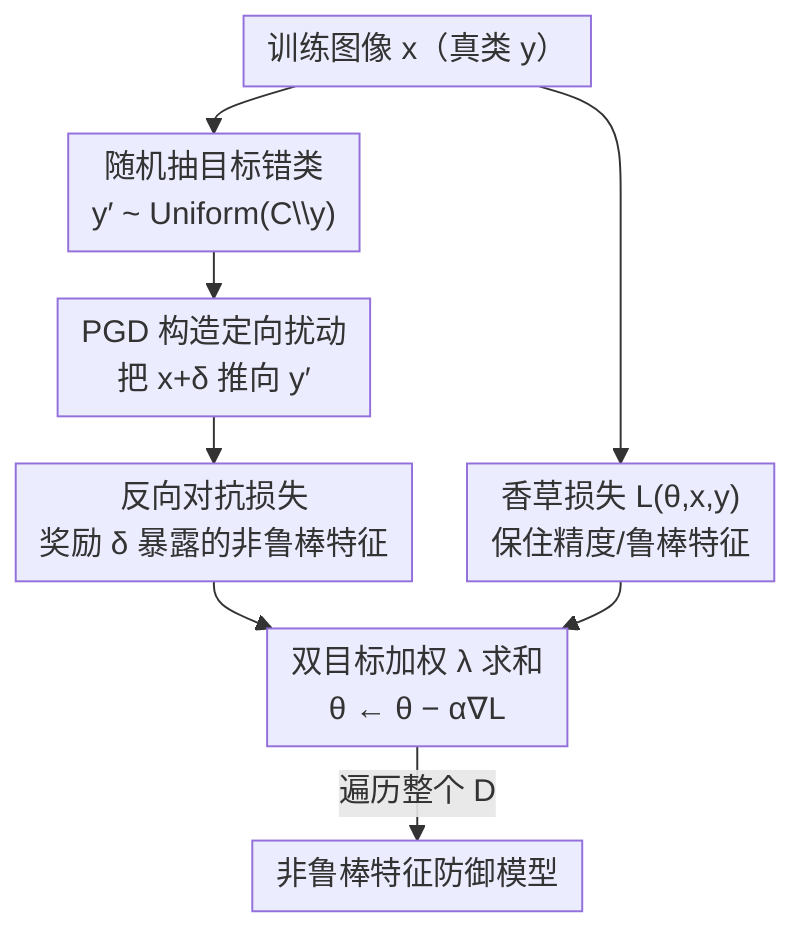

# Reducing Information Dependency Does Not Cause Training Data Privacy. Adversarially Non-Robust Features Do.

**会议**: ICLR 2026  
**OpenReview**: [https://openreview.net/forum?id=BnEG8pn3pK](https://openreview.net/forum?id=BnEG8pn3pK)  
**代码**: https://github.com/BreuerLabs/Anti-Adversarial-Training  
**领域**: AI安全 / 训练数据隐私 / 模型逆向攻击  
**关键词**: 模型逆向攻击, 训练数据重建, 信息依赖, 非鲁棒特征, 对抗鲁棒性

## 一句话总结
本文用三个反直觉实验推翻了"降低训练数据-模型信息依赖能防止重建攻击"这一主流假设，证明模型逆向攻击（MIA）下的隐私其实来自"对抗非鲁棒特征"，并据此提出反向对抗训练 AT-AT，把 ResNet-152 的重建率从 84% 压到 6.5%，同时精度高于现有 SOTA 防御。

## 研究背景与动机
**领域现状**：模型逆向攻击（Model Inversion Attack, MIA）已成为衡量高分辨率视觉模型"泄露训练数据"程度的主流工具——攻击者拥有白盒模型访问权和大量算力/外部数据，能逐类重建出训练样本（如人脸）。为防御 MIA，近年一批 SOTA 方法（MID、BiDO、TL-DMI、SCA）几乎都建立在同一条理论假设上：**训练数据泄露源于训练输入与模型内部表征/输出之间过度的"信息依赖"（包括死记硬背式的 rote memorization）**，因此只要减少这种依赖（用互信息正则、HSIC 惩罚、稀疏编码、少调参数等手段），就能堵住重建。

**现有痛点**：这条"信息依赖 → 重建"理论从未被严格验证。它把"防御有效"和"信息依赖下降"默认绑定，但没人检验过：那些有效的防御是否真的降低了依赖指标？而那些把依赖压到极低/极高的模型，隐私到底是好是坏？

**核心矛盾**：信息依赖的直觉（"模型记得越多 → 越容易被重建"）与实际重建机制可能根本不是一回事。如果机制错了，整个防御设计方向（"少记一点"）就是缘木求鱼。

**本文目标**：(1) 验证"信息依赖驱动泄露"是否成立；(2) 找出真正决定 MIA 可重建性的表征属性；(3) 据此设计一个直接操纵该属性的防御。

**切入角度**：作者把视线从"信息论依赖"转向对抗样本文献里的**非鲁棒特征（non-robust features）**——那些"可泛化、对分类有用、但人眼不可感知、且脆弱"的特征（Ilyas et al., 2019）。直觉是：人眼能重建出来的东西依赖于人眼可感知的"鲁棒特征"；如果模型只靠人眼看不懂的非鲁棒特征做分类，那重建出来的图自然就没法被人/外部模型认出是哪一类。

**核心 idea**：用"非鲁棒特征"而非"信息依赖"来解释并制造 MIA 隐私——故意让模型学不可感知的非鲁棒特征，就能既挡住重建、又保住精度。

## 方法详解

### 整体框架
全文是一条"先证伪旧理论、再建立新因果、最后做出防御"的三段式论证链，而非传统的单一 pipeline：

1. **证伪（第 3 节）**：三个反直觉实验，分别打掉"信息依赖 → 泄露"假设的三个推论。
2. **关联（第 4 节）**：系统性测量隐私防御对对抗样本的鲁棒性，发现"泄露下降"与"对抗鲁棒精度下降"呈强线性相关（$R^2\approx0.93$–$0.95$），说明 SOTA 防御其实是在无意识地把模型推向非鲁棒特征。
3. **因果（第 5 节）**：提出 **Anti Adversarial Training（AT-AT）**，故意奖励非鲁棒特征，用随机对照实验（一半 $\lambda=0$ 对照、一半 $\lambda>0$ 处理）证明这个机制能**因果地**造出更强的防御。

唯一带有明确训练流程的是 AT-AT，其单步 SGD 循环如下：

### 关键设计

**1. 三实验证伪"信息依赖→泄露"：从三个角度各打一枪**

作者针对旧理论的三个必然推论各设计一个实验，全部翻车。其一，**有效防御并不降低依赖指标**：MIA 文献里衡量依赖的标准量是 HSIC（输入 $X$ 与中间嵌入 $Z_j$ 的依赖），定义为
$$\mathrm{HSIC}(X, Z_j) = \big\|\, \mathbb{E}[\phi(X)\psi(Z_j)^\top] - \mathbb{E}[\phi(X)]\,\mathbb{E}[\psi(Z_j)]^\top \,\big\|_{\mathrm{HS}}^2$$
其中 $\phi,\psi$ 把 $X,Z_j$ 映入再生核希尔伯特空间，$\|\cdot\|_{\mathrm{HS}}$ 为 Hilbert-Schmidt 范数。实测发现 TL-DMI、NegLS 这些把重建率（AttAcc@1）压得最低的防御，HSIC 几乎不降甚至上升；反过来，把 BiDO 的 HSIC 权重 $\lambda_x$ 调大、人为把 HSIC 压低的 BiDO\*\* 模型，防御反而变差。其二，**完美死记也不会被重建**：用 Zhang et al. (2017) 的随机标签设定让网络死记整个训练集（训练精度 ~1.0、测试精度 ~0.001），此时 MIA 完全失败、L2 重建距离飙高——最大化信息依赖却最隐私。其三，**没看过的像素照样被重建**：作者用 lasso 删掉每张训练图 >97% 的像素再训练，这些像素在信息论界（Cramér-Rao / Fisher Information Loss / HCR 界）下享有"任意强"的隐私保证（无偏估计方差无界），但 PPA 攻击仍能把 >50% 的重建图分类回原类——删掉 97% 数据带来的隐私提升微乎其微。三枪打完，结论是：**降低信息依赖既非泄露的充分条件、也非必要条件**。

**2. 隐私-对抗鲁棒性权衡：用一条线性回归量化"隐私的鲁棒性代价"**

既然依赖解释不了，作者改用非鲁棒特征解释，并做了 MIA 防御对对抗样本鲁棒性的首次系统评测。在 AutoAttack（默认 $\epsilon=0.031$ 时所有防御鲁棒精度都为 0，故改用更小的 $\epsilon\in\{0.031,0.0025,0.0005,10^{-5}\}$ 探测不同幅度的非鲁棒特征）下，作者用 OLS / Beta 回归把泄露建模成鲁棒精度的线性函数（并控制干净测试精度，因为更准的模型通常泄露更多）：
$$\mathrm{Leakage}_{\text{AttAcc@1},j}=\beta_0+\beta_1\mathrm{TestAcc}_j+\beta_2\mathrm{Acc}_{\epsilon=0.0025,j}+\beta_3\mathrm{Acc}_{\epsilon=0.0005,j}+\beta_4\mathrm{Acc}_{\epsilon=10^{-5},j}+e_j$$
结果惊人：只凭鲁棒精度就能几乎完美预测泄露（$R^2\approx0.93$–$0.95$，MAE 仅 0.042–0.05），而控制鲁棒精度后干净精度对泄露几乎无显著贡献。由此可换算"隐私的鲁棒性代价"——按 Beta 模型，把 PPA 泄露（AttAcc@1）降 1 个百分点，对应 $\epsilon=0.0025$ 时鲁棒精度显著下降 0.31 pp、$\epsilon=0.0005$ 时下降 5.4 pp、$\epsilon=10^{-5}$ 时下降 0.91 pp。值得注意的是，这条权衡只对"通用信息依赖类"防御（MID/BiDO/TL-DMI）成立，对"梯度抑制类"防御（NegLS/RoLSS/Trap-MID）不成立——后者靠别的机制防御。这等于把"SOTA 防御其实是在偷偷牺牲鲁棒性换隐私"这件事钉死成了可量化的统计事实。

**3. AT-AT 反向对抗训练：把非鲁棒特征从"副作用"变成"被故意奖励的信号"**

前两个设计只证明了非鲁棒特征与隐私**相关**，第三个设计要证明它能**因果地**造出隐私。经典对抗训练（AT, Madry et al., 2017）把每张干净图 $x$ 换成最易翻类的扰动 $x+\delta$，并奖励"对 $\delta$ 鲁棒"的特征当作信号、惩罚 $\delta$ 里的非鲁棒特征。AT-AT 把这套逻辑**完全反过来**：把人眼可见的图像 $x$ 当作要忽略的"噪声"，把扰动 $\delta$ 暴露出的不可感知但可泛化的非鲁棒特征当作要学的"信号"，即优化 $(x_{\text{Yoda}}+\delta_{\text{Luke}})\to\text{Luke}$。由于纯靠非鲁棒特征无法在人脸识别这类难任务上拿到可用精度，AT-AT 用一个由用户选择的 $\lambda$ 平衡的双目标损失：
$$\min_\theta\ \mathbb{E}_{(x,y)\sim D}\Big[\,L(\theta,x,y)\ +\ \lambda\cdot\min_{\delta\in S}L(\theta,x+\delta,y')\,\Big],\quad y'\neq y$$
每步 SGD：抽训练图 $x$ 和均匀随机目标错类 $y'$，用 PGD 算出把 $x$ 推向 $y'$ 的定向扰动 $\delta$，再把"香草损失（学真类 $y$、保精度）"和"反向对抗损失（学错类 $y'$、奖励 $\delta$ 的非鲁棒特征）"加权求和。为证因果，作者训 10 个 RN-152、随机一半设 $\lambda=0$（等价 NoDef）、一半设 $\lambda>0$，Beta 回归显示处理组把 PPA AttAcc@1 从 84% 降到 6.5%（泄露几率降 77 倍，$p<10^{-16}$，$z=38.0$）。$\lambda$ 还是个**可调旋钮**——它换来的对抗脆弱性成本可控，给私有模型提供了新的设计轴。

### 损失函数 / 训练策略
核心损失即上式 AT-AT 双目标：香草项保证可用精度（同时不可避免地含部分鲁棒特征），反向对抗项用 PGD 内层 $\min_{\delta\in S}L(\theta,x+\delta,y')$ 把模型推向非鲁棒特征。$\lambda$ 越大越偏隐私（重建越难、对抗越脆弱），构成可调的隐私-鲁棒性权衡。

## 实验关键数据

实验聚焦白盒高分辨率人脸识别：数据集 FaceScrub / CelebA（外加 Stanford Dogs 验证泛化），攻击 PPA / IF-GMI / PPDG，架构 ResNet-152 / ResNet-18 / DenseNet-169；隐私指标用外部 Inception-v3 的 AttAcc@1/@5、L2-FaceNet 距离、Eval Confidence；鲁棒性用 AutoAttack 四攻击集成的最差精度。

### 主实验：三个证伪实验

| 实验 | 设定（RN-152, FaceScrub） | 关键现象 | 对旧理论的打击 |
|------|--------------------------|---------|----------------|
| HSIC 检验 | 各防御的 AttAcc@1 vs HSIC | TL-DMI 把 AttAcc@1 压到 0.190 但 HSIC 几乎不降；BiDO\*\* 把 HSIC 压低反而防御变差（AttAcc@1 0.815） | 有效防御不降依赖 |
| 死记设定 | 随机标签训练 | 训练精度 1.000 / 测试 0.958→0.001；L2-Face 0.768→1.249，重建崩溃 | 最大依赖却最隐私 |
| 未见像素 | 删 97.8% 像素再训练 | TestAcc 0.910，AttAcc@1 仍 0.592（NoDef 0.881，TL-DMI 0.163） | 信息论界保证形同虚设 |

### 隐私-鲁棒性回归 + AT-AT 因果

| 项目 | 数值 | 说明 |
|------|------|------|
| 泄露 ~ 鲁棒精度回归 | $R^2\approx0.93$–$0.95$，MAE 0.042–0.05 | 仅凭鲁棒精度即可预测泄露 |
| 干净精度系数 | -0.011 ± 1.033（OLS） | 控制鲁棒精度后几乎不显著 |
| 隐私代价 @ $\epsilon=0.0005$ | 降 1 pp 泄露 ↔ 降 5.4 pp 鲁棒精度 | 中等幅度非鲁棒特征代价最大 |
| AT-AT 因果效应 | AttAcc@1 84% → 6.5%，$p<10^{-16}$ | 随机对照（$\lambda=0$ vs $\lambda>0$） |

### 关键发现
- **真正决定 MIA 可重建性的是"非鲁棒精度/鲁棒精度"而非信息依赖**：鲁棒精度单变量就能把泄露解释到 $R^2\approx0.95$，干净精度补充信息几乎为零。
- **隐私-鲁棒性权衡是非均匀的**：最大/最小幅度的非鲁棒特征代价小，"中等" $\epsilon=0.0005$ 的代价最大且最不稳定（95% CI 跨度极大）。
- **权衡只对通用依赖类防御成立**：梯度抑制类防御（NegLS/RoLSS/Trap-MID）走的是另一条机制路线，不在这条线性关系上。
- **AT-AT 全面占优**：在所有数据集/攻击/隐私指标下，AT-AT（红点）都在比 7 个 SOTA 基线更高的精度上取得更强隐私。

## 亮点与洞察
- **把对抗样本的"非鲁棒特征"理论嫁接到隐私上**：Ilyas et al. 说非鲁棒特征是"可泛化但人眼不可感知"的真实特征；本文一针见血地指出——正因人眼看不懂，它天然适合"准确分类但不暴露可视化信息"的隐私学习目标。这个跨领域连接是全文最"啊哈"的地方。
- **用因果实验而非相关性下结论**：随机对照 + Beta 回归（处理/对照随机分配）让"非鲁棒特征导致隐私"成为因果而非巧合，论证强度远超一般经验论文。
- **可量化的"隐私代价表"**：把"降 1 pp 泄露要付多少 pp 鲁棒精度"算成带置信区间的数，给防御设计提供了可操作的成本核算。
- **可迁移思路**：任何"想隐藏但要可用"的场景（如联邦学习的中间表征、模型水印）都可借鉴"让有用信息落在人/外部模型不可感知的子空间"的设计哲学。

## 局限与展望
- **作者承认的局限**：范围仅限高分辨率图像分类；是否推广到 LLM、扩散模型这些同样"记忆驱动隐私"的范式仍是开放问题。
- **隐私换来对抗脆弱性**：AT-AT 和所有通用防御一样，会增加对对抗样本的脆弱性——只是这里成本可由 $\lambda$ 调控，但脆弱性本身没消除，部署到安全敏感场景需谨慎。
- **自己发现的局限**：实验局限于人脸/狗这类自然图像与 MIA 重建指标，"人眼不可感知 = 隐私"的等式在医学影像、遥感等"机器读图"场景可能不成立（那里外部判别器本就不是人眼）；另外评测隐私靠外部 Inception-v3 的 AttAcc，换一个更强的外部识别器结论是否稳健值得追问。
- **改进思路**：把 $\lambda$ 做成逐样本/逐类自适应，对高敏感类多压非鲁棒特征；或把非鲁棒特征防御与差分隐私结合，验证两条隐私机制是否正交叠加。

## 相关工作与启发
- **vs MID / BiDO / SCA**: 它们用互信息/HSIC/稀疏编码降"信息依赖"防 MIA；本文证明这些指标降不降与防御强弱无关，它们其实是在无意识地把模型推向非鲁棒特征——机制被本文重新解释。
- **vs TL-DMI**: 它靠"少调参数 → 少编码私有信息"防御并性能强劲，但本文实验显示其 HSIC 不降、且鲁棒精度大幅下降，印证其真实机制也是非鲁棒特征转移。
- **vs 经典对抗训练 AT（Madry et al.）**: AT 奖励鲁棒特征以抗对抗扰动；AT-AT 把目标完全反转、奖励非鲁棒特征以抗重建，两者是同一框架的镜像。
- **vs 信息论隐私界（Fisher Information Loss / HCR 界）**: 这些理论在无偏估计假设下给删像素数据"任意强"保证；本文用 97% 删像素仍被重建的实验证明这些假设过于乐观，实践中对现代 MIA 几乎无保护力。

## 评分
- 新颖性: ⭐⭐⭐⭐⭐ 推翻领域主流假设并给出全新解释机制，跨领域连接漂亮
- 实验充分度: ⭐⭐⭐⭐⭐ 7 防御×3 攻击×3 架构×3 数据集 + 56 种回归规格 + 随机对照因果检验
- 写作质量: ⭐⭐⭐⭐ 论证链清晰、三实验设计巧妙，但理论细节多压在附录
- 价值: ⭐⭐⭐⭐⭐ 重写了 MIA 防御的设计指南，并揭示隐私-鲁棒性新权衡轴

<!-- RELATED:START -->

## 相关论文

- [\[ICLR 2026\] Why Do Unlearnable Examples Work: A Novel Perspective of Mutual Information](why_do_unlearnable_examples_work_a_novel_perspective_of_mutual_information.md)
- [\[CVPR 2026\] Towards Robust Vision Transformers: Path Dependency Analysis and a Simple Two-Stage Adversarial Training](../../CVPR2026/ai_safety/towards_robust_vision_transformers_path_dependency_analysis_and_a_simple_two-sta.md)
- [\[CVPR 2026\] ReMoE: Region-Mixture Experts for Adversarially-Robust Vision Transformers](../../CVPR2026/ai_safety/remoe_region-mixture_experts_for_adversarially-robust_vision_transformers.md)
- [\[ICLR 2026\] Robust Fine-Tuning from Non-Robust Pretrained Models: Mitigating Suboptimal Transfer with Epsilon-Scheduling](robust_fine-tuning_from_non-robust_pretrained_models_mitigating_suboptimal_trans.md)
- [\[ICLR 2026\] Discrete Latent Features Ablate Adversarial Attack: A Robust Prompt Tuning Framework for VLMs](discrete_latent_features_ablate_adversarial_attack_a_robust_prompt_tuning_framew.md)

<!-- RELATED:END -->
