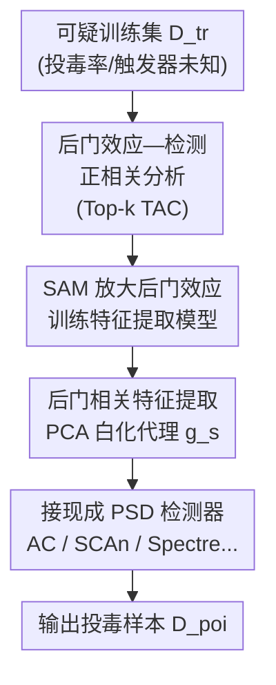

# Reliable Poisoned Sample Detection against Backdoor Attacks Enhanced by Sharpness-Aware Minimization

**会议**: ICLR 2026  
**OpenReview**: [https://openreview.net/forum?id=q5ePtZc9N7](https://openreview.net/forum?id=q5ePtZc9N7)  
**代码**: 待确认  
**领域**: AI安全 / 后门防御  
**关键词**: 后门攻击, 投毒样本检测, Sharpness-Aware Minimization, 触发激活变化, 特征可分性

## 一句话总结
本文发现投毒样本检测（PSD）方法在弱后门攻击下大幅失效的根本原因是"后门效应"太弱，于是提出用 Sharpness-Aware Minimization（SAM）训练特征提取模型来**放大**后门效应，从而即插即用地增强各类已有 PSD 方法，平均真阳率（TPR）提升 +34.3%。

## 研究背景与动机

**领域现状**：针对数据投毒型后门攻击，预训练阶段的投毒样本检测（Poisoned Sample Detection, PSD）是一条很有前景的防御路线。它的通用范式是：先在可疑（可能含毒）数据集上正常训练一个模型，再利用投毒样本与干净样本在特征空间上的统计差异（聚类、谱分析等）把投毒样本挑出来，代表方法有 Activation Clustering、Spectral Signature、SCAn、Spectre、Beatrix 等。

**现有痛点**：作者观察到，这些"先进"的 PSD 方法一旦遇到**弱后门攻击**（低投毒率如 0.5%/1%、或弱触发器如 Adap-Blend）就会显著退化——投毒样本和干净样本在特征空间里挤成一团，检测器无从下手。值得注意的是，弱后门效应**并不等于**攻击成功率（ASR）低：很多情况下 ASR 仍然很高，但检测性能已经崩了，意味着攻击依然危险却防不住。

**核心矛盾**：作者把退化的根因归结为"**后门效应**（backdoor effect）变弱"——即触发器诱发的神经元激活相对良性特征激活的相对强度变小，可用 Trigger Activation Change（TAC）指标度量。他们在 CIFAR-10/ResNet-18 上做统计分析，发现 Top-k TAC 与检测 AUC 的 Pearson 相关系数高达 0.73、与轮廓系数（Silhouette）相关系数高达 0.87，证实"后门效应强 → 特征可分 → 好检测"是一条强正相关链。

**本文目标**：在防御者无法改动触发器属性、投毒率等数据层面因素的前提下，如何提升弱后门下的检测可分性？

**切入角度**：既然数据层面动不了，那就从"**用来提特征的那个模型怎么训**"下手。作者借用了 SAM 的一个已知性质——SAM 倾向于产生稀疏激活，会放大主导激活、抑制弱激活。如果后门相关神经元恰好是"主导"的那一批，SAM 就能把它们进一步放大。

**核心 idea**：用 SAM 代替普通 SGD 来训练 PSD 的特征提取模型，主动**放大**后门效应、拉开投毒样本与干净样本的特征间距，使现有检测器更容易工作——这是一个模型无关、攻击无关的即插即用增强模块，而非一个新检测器。

## 方法详解

### 整体框架

整篇方法围绕一个反直觉的操作展开：**防御时故意把后门学得更"狠"**，从而让投毒样本更容易暴露。整体分两段：先用统计分析建立"后门效应↔检测性能"的因果直觉，再据此设计一个三阶段的 SAM-enhanced PSD 流水线。输入是一个可能含毒的训练集 $D_{tr}$（防御者不知道投毒率 $p$、触发器 $\Delta$、生成函数 $g$，但能拿到少量干净参考样本），输出是被判定为投毒的样本集合 $D_{poi}$。

关键转换发生在第一阶段：传统范式被动接受 SGD 训出来的特征，本文则把第一阶段换成 SAM 训练，主动放大 Top-k TAC 神经元的激活差异；第二阶段从中间层激活里提取后门相关特征（用 PCA 白化做代理，因为防御者拿不到真实 TAC 索引）；第三阶段把这些特征喂给任意一个现成 PSD 检测器。

### 关键设计

**1. 后门效应与检测性能的强正相关：把"检测难"翻译成"TAC 低"**

这一设计回答的是"PSD 为什么会在弱攻击下失效"。作者用 Trigger Activation Change（TAC）量化后门效应。对第 $l$ 层第 $j$ 个神经元，TAC 定义为干净样本 $x$ 与其投毒对应物 $\tilde{x}$ 在该神经元激活上的平方差均值：

$$\text{TAC}^{(l)}_j(D) = \frac{1}{|D|}\sum_{x \in D}\left(f^{(l)}_j(x) - f^{(l)}_j(\tilde{x})\right)^2$$

TAC 越大说明该神经元对触发器越敏感，可视为"后门神经元"。再取最后一层卷积层里 TAC 最高的 $k$ 个神经元（$k=30$）求平均得到 Top-k TAC：$\text{Top-}k\,\text{TAC}^{(l)}(D) = \frac{1}{|T_k|}\sum_{j \in T_k}\text{TAC}^{(l)}_j(D)$。作者在多种攻击/防御组合下扫投毒率，发现 Top-k TAC 与检测 AUC 呈 Pearson 0.73（回归 $R^2=0.54$）、与轮廓系数呈 Pearson 0.87（$R^2=0.76$）的强线性正相关。结论很关键：检测难不是检测器不行，而是后门效应被攻击者刻意压弱了；只要能在不知道攻击细节的情况下把 Top-k TAC 抬上去，检测性能就能跟着回来。这条相关性就是后面整套方法的立论基础。

**2. SAM 选择性放大后门神经元：用平坦最小值优化反向喂大触发激活**

这一设计解决"怎么不碰数据就把 TAC 抬上去"。SAM 的目标是在权重的 $\rho$-邻域内做 min-max 优化：$\min_\theta \max_{\|\epsilon\|_2 \le \rho} L(\theta+\epsilon)$，其更新规则相比 SGD 多了一个二阶正则项 $\theta^{SAM}_{t+1} \approx \theta_t - \eta[\nabla L(\theta_t) + \rho \frac{\nabla^2 L(\theta_t)\nabla L(\theta_t)}{\|\nabla L(\theta_t)\|}]$。作者在两层 ReLU 网络 $f(x;\theta)=a^\top\sigma(Wx)$ 上做理论分解，给出 **Proposition 1**：在若干条件下（神经元在投毒输入上激活、在干净输入上不激活、输出权重为负），SAM 相比 SGD 会让这些"后门神经元"的 TAC 单步**至少增加** $\eta\rho$ 量级的一项。直觉是 SAM 为了精确拟合投毒数据点，会被驱动去选择性放大这些神经元的预激活。实证上（Fig. 3），SAM 一致地抬高了高 TAC 神经元（后门神经元，蓝条）、压低无关神经元（红条），等于把后门效应"锐化"了。这与 FT-SAM 形成鲜明对比——后者用干净数据在训练后**抑制**后门来修模型，本文则用投毒数据在预训练阶段**放大**后门来助检测，方向完全相反。

**3. SAM-enhanced PSD 三阶段框架：用 PCA 白化代理绕过未知的 TAC 索引**

这一设计把前两点落地成可即插即用的流水线。**Stage-1**：用 SAM（Eq. 3）训练一个含后门的模型 $f_{\theta_{SAM}}$。**Stage-2**：取中间层特征 $g=\phi_{\theta_{SAM}}(x)$，但防御者并不知道哪些神经元是真正的 Top-k TAC 神经元，于是用一个 PCA 白化代理来逼近后门相关特征：$g_s = \Sigma^{-1/2}Pg$，其中 $P$ 是从训练数据估出的 PCA 投影矩阵，$\Sigma$ 是从干净参考集加动态筛选的候选干净样本估出的协方差矩阵——白化把后门方向的差异放大、便于后续检测器抓取。**Stage-3**：把 $g_s$ 当输入喂给任意现成 PSD 检测器（如 Activation Clustering）。整个框架模型无关、攻击无关，对现有 PSD 方法零侵入：只换"用哪个模型提特征"，检测算法本身不动，因此能无缝套到 Spectre/SCAn/SS/AC/Beatrix 等一系列方法上。

### 损失函数 / 训练策略
核心训练目标就是 SAM 的 sharpness-aware 交叉熵：内层对权重做 $\ell_2$ 半径为 $\rho$ 的最坏扰动、外层最小化扰动后损失。$\rho$ 是控制扰动预算的关键超参，直接决定后门效应被放大的程度。其余沿用标准后门训练设置（投毒率默认 5%，弱攻击场景另设 1%/0.5%）。

## 实验关键数据

### 主实验

在 13 种后门攻击 × 5 种 PSD 检测器（Spectre/SCAn/SS/AC/Beatrix）× 多数据集（CIFAR-10/GTSRB/Tiny-ImageNet）× 多架构（ResNet-18/VGG19-BN/DenseNet-161）上评估，指标为 TPR↑、FPR↓、F1↑。下表为 CIFAR-10/ResNet-18 上各检测器叠加 SAM 后的平均变化：

| 检测器 | TPR 平均变化 | FPR 平均变化 | F1 平均变化 |
|--------|------|------|------|
| Spectre + SAM | **+30.6** | −1.7 | +26.1 |
| SCAn + SAM | +3.2 | −0.0 | +1.9 |
| SS + SAM | +20.5 | −1.1 | +19.4 |
| AC + SAM | +29.8 | +3.0 | +13.7 |
| Beatrix + SAM | **+87.4** | −1.8 | +68.1 |

弱攻击下增益尤其惊人：Beatrix 在 Blended 上 TPR 从 5.0%→99.8%、F1 5.0%→87.6%；AC 在 Adap-Blend 上 TPR 1.5%→97.1%；Spectre 在 WaNet 上 TPR 66.4%→97.7%。全表平均 TPR 增益 +34.3%。

### 消融与跨数据集

| 配置 | 现象 | 说明 |
|------|------|------|
| GTSRB / Blended / AC | 0.0% → 99.7% TPR | 原本完全失效的组合被救活 |
| GTSRB / LF / AC | 0.0% → 87.9% TPR | 弱触发器下显著回升 |
| 受限/筛选/OOD 干净辅助集 | 仍保持鲁棒 | Sec. D.2.2，对参考集质量不敏感 |

### 关键发现
- **后门效应是检测性能的瓶颈**：Top-k TAC 与 AUC 强正相关（0.73），证明"检测难"本质是"后门弱"，把 TAC 抬上去就能恢复检测。
- **SAM 是选择性放大器**：它只抬高后门神经元、压低无关神经元（Fig. 3），并有 Proposition 1 的理论下界支撑，而非无差别增强。
- **对 Beatrix 增益最大**：Beatrix 依赖高阶统计的特征可分性，SAM 放大后门方差后让它从"几乎全废"变成"近乎完美"，说明该方法此前的失效正是被弱可分性卡住的。

## 亮点与洞察
- **"放大后门来防后门"的反直觉视角**：常规防御都在抑制后门，本文却故意把后门学得更狠，因为更狠的后门=更可分的投毒样本，这个逆向思路很巧妙。
- **把工程问题转成可度量的物理量**：用 Top-k TAC 把"检测难易"量化成神经元激活强度，再用相关性实验坐实因果方向，为方法提供了扎实的立论。
- **即插即用、零侵入**：只替换特征提取模型、不改检测算法，能无缝增强一整排现成 PSD 方法——这种"增强范式"而非"新检测器"的定位很有迁移价值，可推广到其他依赖特征可分性的安全检测任务。

## 局限与展望
- 理论分析建立在两层 ReLU 网络的简化设定上，深层网络的普适性只靠 Fig. 3 经验验证，严格性有限。
- 故意放大后门意味着训出的就是一个被后门污染更重的模型，仅用于提特征/检测；若误用于部署会更危险，方法的"副产物"需谨慎处理。
- SAM 训练相比 SGD 计算开销翻倍（每步两次前向/反向），大规模数据集上的成本未充分讨论。
- $\rho$ 的选择对放大程度敏感，论文未给出无攻击先验下如何自适应选 $\rho$ 的方案。

## 相关工作与启发
- **vs FT-SAM**：同样用 SAM，但 FT-SAM 用干净数据在训练后**抑制**后门来修模型，本文用投毒数据在预训练阶段**放大**后门来助检测，目标与方向完全相反。
- **vs 传统 PSD（AC/SS/SCAn/Spectre/Beatrix）**：它们都在"被动接受 SGD 特征"的前提下设计更精巧的检测器，本文不造新检测器，而是改造第一阶段的特征来源，是对它们的统一增强。
- **vs 自适应攻击（Adap-Blend/TaCT）**：这些攻击专门压弱特征层可分性来逃避检测，本文从训练侧把可分性重新拉回来，正面回应了这类攻击的威胁模型。

## 评分
- 新颖性: ⭐⭐⭐⭐⭐ "放大后门来检测后门"的逆向视角 + TAC 因果分析，立意新颖
- 实验充分度: ⭐⭐⭐⭐⭐ 13 攻击 × 5 检测器 × 3 数据集 × 3 架构，覆盖面极广
- 写作质量: ⭐⭐⭐⭐ 观察—理论—方法链条清晰，部分理论细节需翻附录
- 价值: ⭐⭐⭐⭐⭐ 即插即用、平均 TPR +34.3%，对后门防御实用价值高

<!-- RELATED:START -->

## 相关论文

- [\[ICLR 2026\] Membership Privacy Risks of Sharpness Aware Minimization](sam_membership_privacy_risks.md)
- [\[ICLR 2026\] Test-Time Poisoned Sample Detection by Exploiting Shallow Malicious Matching in Backdoored CLIP](test-time_poisoned_sample_detection_by_exploiting_shallow_malicious_matching_in_.md)
- [\[ICLR 2026\] Defending against Backdoor Attacks via Module Switching](defending_against_backdoor_attacks_via_module_switching.md)
- [\[AAAI 2026\] Transferable Backdoor Attacks for Code Models via Sharpness-Aware Adversarial Perturbation](../../AAAI2026/ai_safety/transferable_backdoor_attacks_for_code_models_via_sharpness-aware_adversarial_pe.md)
- [\[ICLR 2026\] TrojanTO: Action-Level Backdoor Attacks Against Trajectory Optimization Models](trojanto_action-level_backdoor_attacks_against_trajectory_optimization_models.md)

<!-- RELATED:END -->
