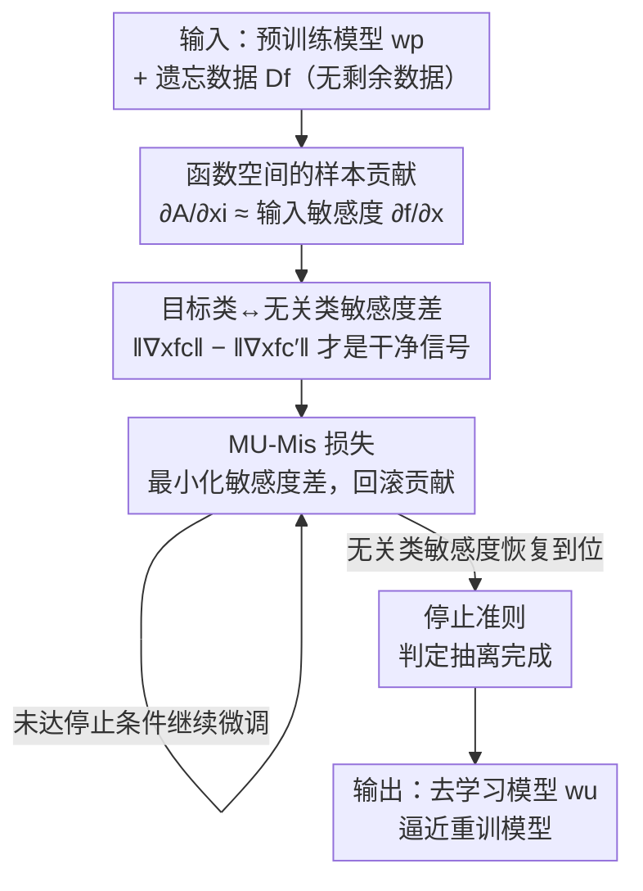

# Remaining-data-free Machine Unlearning by Suppressing Sample Contribution

**会议**: ICLR 2026  
**OpenReview**: [https://openreview.net/forum?id=3iw5t2W41F](https://openreview.net/forum?id=3iw5t2W41F)  
**代码**: https://github.com/poppopbean0903/MU-Mis  
**领域**: AI 安全 / 隐私 / 机器去学习  
**关键词**: 机器去学习, 输入敏感度, 样本贡献, 被遗忘权, remaining-data-free  

## 一句话总结
本文把"样本对训练的贡献"刻画为预训练模型对该样本的输入敏感度，并提出 MU-Mis：只用预训练模型和遗忘数据、不碰任何剩余数据，通过最小化"目标类与无关类的敏感度差"直接抹掉遗忘样本的贡献，首次让一个 remaining-data-free 方法在效用上追平依赖剩余数据的 SOTA。

## 研究背景与动机

**领域现状**：机器去学习（Machine Unlearning, MU）要从一个训练好的模型里抹掉特定训练样本的影响，让模型表现得像这些数据从未参与训练（"被遗忘权"的技术落地）。理想做法是用剩余数据从头重训，但代价太高，因此近似去学习通过微调预训练模型去逼近重训模型的输出分布。

**现有痛点**：预训练模型和重训模型的本质差异，就在于遗忘数据从"贡献者"变成了"旁观者"。但"样本对训练的贡献到底是什么"极难刻画——早期方法靠回溯训练轨迹、累加历史梯度，既违背去学习对效率的要求，又因训练的增量性而效果有限。于是主流方法绕开这个难题，改用启发式：随机改标签、从"无能教师"做知识蒸馏来制造混淆。

**核心矛盾**：这些"制造混淆"的操作没有识别"该忘什么"，会引发灾难性去学习 / 过度遗忘——剩余数据上的效用严重退化；退化又逼着方法回头用剩余数据做修复，既拖慢效率，又在剩余数据不可得（隐私、合规）时根本跑不通。换句话说，缺乏对样本贡献的精确刻画，是一切退化和补救的根源。

**切入角度**：作者不再去参数空间累加历史梯度，而是直接看训练算法对样本的导数 $\partial A_D/\partial x_i$——训练集内的样本满足 $\partial A_D/\partial x_i \neq 0$，集外样本则为 0（类比 SVM 里只有训练数据能当支持向量影响决策边界）。抽走样本贡献，就等价于压制 $\partial A_D/\partial x_i$。

**核心 idea**：训练算法 $A_D$ 没有闭式表达，但作者从理论上证明 $\partial A_D/\partial x_i$ 可以被"学好的模型对其输入的敏感度" $\partial f(x)/\partial x$ 近似——一句话：**样本对训练的贡献，会体现为训练后模型对它输入变化的敏感度上升**，于是只用预训练模型本身就能定位贡献并抹掉它。

## 方法详解

### 整体框架

MU-Mis（Machine Unlearning by Minimizing Input Sensitivity）的输入只有两样东西：预训练模型权重 $w_p$ 和需要遗忘的数据 $D_f$——**全程不接触剩余数据 $D_r$**。整条链路是：先从理论上把"样本贡献"翻译成"模型对输入的敏感度"，再把这个敏感度细化到"目标类 logit 与无关类 logit 的敏感度差"，然后构造一个直接压这个差的损失去微调模型，最后用一个停止准则决定何时收手。和"制造混淆再修补"的旧范式不同，它是一次精准、对症的抽离，因此不破坏剩余数据上的效用，也就省掉了用剩余数据修复的环节。

### 关键设计

**1. 把样本贡献从参数空间搬到函数空间：用输入敏感度做可优化的代理**

旧方法卡在"贡献藏在训练轨迹里"——要去学习就得回放历史梯度，既慢又因增量性而不准。本文换了一个空间：训练是从数据集到函数的映射 $f = A(D)$，对梯度下降做一阶 Taylor 展开后，学到的函数可写成 $f(x;w_p) = f(x;w_0) - \eta \sum_k g_k^\top(x) \sum_i g_k(x_i)(e_c - p(x_i))$，其中 $g_k(x)=\partial f/\partial w|_{w_k}$。对它分别求 $\partial f/\partial x_i$（训练样本对学习的影响）和 $\partial f/\partial x$（推理时模型对输入的敏感度），二者在 $x=x_i$ 处相等：$S_k(x_i,x_i)=C_k(x_i,x_i)$。进一步把某个训练样本 $\hat x$ 的敏感度拆成"贡献项 $-\eta\sum_k S_k(\hat x,\hat x)$ + 残差项"，作者论证残差项远小于贡献项（随机初始化的 $f_0$ 几乎不响应输入，且 $S_k(\hat x,\tilde x)\ll S_k(\hat x,\hat x)$）。

因此结论是 $\partial f(x_i;w_p)/\partial x_i$ 可以当作样本 $x_i$ 贡献的体现——这恰好呼应"记忆即自影响"的定义（样本在自身上的预测随其微小变化的差异）。实证上更直观：随机初始化模型对输入的敏感度 $\|\nabla_x f\|_F$ 只有约 $10^{-4}$，训练后暴涨到 $10^3$，量级跳了好几个数量级，说明训练确实把模型对训练样本的敏感度推高了。这一步的价值是：贡献从此变成一个**只需预训练模型、可直接对输入求导、可优化**的量，彻底绕开了回放轨迹。

**2. 目标类与无关类的敏感度差：从粗糙的总敏感度里提纯出"干净"的贡献信号**

光看总敏感度 $\|\nabla_x f\|_F$ 还不够干净。训练会把样本预测推向正确标签，所以贡献在不同 logit 上是不对称的。作者分别看目标类 logit 的敏感度 $\|\nabla_x f_c\|_F$ 和无关类的平均敏感度 $\|\nabla_x f_{c'}\|_F$：随机初始化时两者量级相当，训练后 $\|\nabla_x f_c\|_F$ 显著超过 $\|\nabla_x f_{c'}\|_F$。这有一个生成式解读支撑——判别式 softmax 分类器隐含是个密度模型，logit 是未归一化的对数密度，$\nabla_x f_i(x)=\nabla_x \log p_\theta(x|y=i)$，所以目标类的输入梯度天然更大。

更关键的是它和重训模型对得上：对每个遗忘样本，作者比较重训模型与预训练模型在三个量（$\|\nabla_x f_c\|_F$、$\|\nabla_x f_{c'}\|_F$、二者之差）上的逐样本变化方向。结果一致：重训模型里目标类敏感度更低、无关类敏感度更高，于是**敏感度幅度差 $\|\nabla_x f_c\|_F - \|\nabla_x f_{c'}\|_F$ 在重训模型里始终更小**。这就把"该往哪个方向去学习"钉死了——压缩这个差，就是朝重训模型走，因此它是一个可靠的优化目标，而不是凭空设定一个目标值。

**3. MU-Mis 损失：直接最小化敏感度差，把贡献"回滚"掉**

有了可靠信号，去学习就变成一个干净的优化问题。损失定义为

$$L(D_f; w) = \frac{1}{N_f} \sum_{x_f \in D_f} \left( \|\nabla_x f_c(x_f, w)\|_F^2 - \|\nabla_x f_{c'}(x_f, w)\|_F^2 \right)$$

其中 $c$ 是样本目标类，$c'\neq c$ 是一个**每次计算损失都重新随机抽取**的无关类。最小化它会同时把目标类敏感度 $\|\nabla_x f_c\|_F$ 往下压（回滚）、把无关类敏感度 $\|\nabla_x f_{c'}\|_F$ 往上抬（恢复），正好对应前面观察到的"重训模型该有的样子"。这就是"suppressing sample contribution"的字面落地：不制造任何混淆标签、不蒸馏无能教师，只是把训练当初堆上去的敏感度差原路减回去。因为操作对症且只动遗忘数据相关的部分，剩余数据上的效用几乎不受波及，这正是它能 remaining-data-free 的根本原因。

**4. 停止准则：用无关类敏感度的恢复程度判断"抽离完成"**

直接优化损失有个风险——优化过头会把模型推垮。作者在优化过程中观察到一条稳定规律：随损失下降，遗忘精度 FA 稳步掉、剩余/测试精度（RA/TA）先轻微下滑再随无关类 logit 敏感度的恢复而回升，且 RA 在该敏感度回到初始水平时恰好逼近重训模型。于是设一个阈值比 $\delta$：当无关类敏感度 $\|\nabla_x f_{c'}\|_F$ 既越过此前记录的最小值 $\epsilon$、又相对初始值恢复超过 $\delta$ 时停止。这个准则让算法在"抽离刚好完成、效用尚未受损"时收手，无需任何剩余数据来监控验证精度，保证了实际部署的可操作性。

### 损失函数 / 训练策略
核心损失即上式 $L(D_f;w)$；优化是对预训练模型做梯度下降微调 $w_{t+1}\leftarrow w_t - \eta\nabla L$。每轮对每个遗忘样本随机换一个无关类 $c'$ 以避免偏向某个固定类；终止由停止准则（阈值比 $\delta$ + 无关类敏感度回升）控制，整个过程轻量且只前向/反向遗忘数据这一小批。

## 实验关键数据

评测覆盖 3 类去学习任务（full-class / sub-class / random-subset）、6 个数据集（CIFAR-100、PinsFaceRecognition、Tiny ImageNet、CIFAR-20、CIFAR-10、SVHN），骨干以 ResNet-18 为主、额外测 ViT；对比 8 个依赖剩余数据的方法和 4 个 remaining-data-free 方法。核心指标是去学习模型与重训模型在 FA/RA/TA 上的平均差距（Avg. Gap，越小越好）、MIA 隐私指标、以及运行时间 RTE。

### 主实验（full-class，ResNet-18）

| 数据集 | 方法 | RA | FA | TA | Avg. Gap↓ | RTE(s) |
|--------|------|-----|-----|-----|-----------|--------|
| CIFAR-100 | Retrain（金标） | 76.52 | 0.00 | 75.76 | 0.00 | 7432 |
| CIFAR-100 | SalUn（依赖剩余数据） | 76.63 | 1.20 | 75.85 | 0.47 | 254 |
| CIFAR-100 | SCAR（free，需 OOD） | 71.33 | 5.61 | 70.66 | 5.29 | 367 |
| CIFAR-100 | JiT（free） | 65.44 | 3.00 | 64.87 | 8.32 | 15 |
| CIFAR-100 | **MU-Mis（free）** | 76.42 | 0.00 | 75.64 | **0.07** | **30** |
| Tiny ImageNet | Retrain | 65.36 | 0.00 | 64.90 | 0.00 | 10367 |
| Tiny ImageNet | SalUn | 65.21 | 0.00 | 64.88 | 0.06 | 2630 |
| Tiny ImageNet | **MU-Mis** | 64.95 | 0.00 | 64.85 | **0.15** | **83** |

MU-Mis 把所有 remaining-data-free 基线甩开一大截（它们普遍出现 RA/TA 偏离重训模型 >5% 的红色退化），同时和最强的依赖剩余数据方法 SalUn 几乎打平：在 Tiny ImageNet 上 Avg. Gap 仅高 0.09，但速度快约 30×。在 ViT 上效率优势更夸张——SalUn 需 81 分钟，MU-Mis 只要 3 分钟。

### 子类任务与消融视角

| 任务 | 方法 | Avg. Gap↓ | 说明 |
|------|------|-----------|------|
| sub-class Sea | MU-Mis | 0.20 | 全场最小 |
| sub-class Sea | SCAR | 6.77 | free 方法明显落后 |
| sub-class Rocket | MU-Mis | 0.49 | 与重训高度一致 |
| sub-class Rocket | LoTus | 44.42 | 依赖剩余数据也可能崩 |

论文未在正文给传统"去模块"消融表（方法本身是单一损失），而是把分析放在：① 敏感度差与重训模型方向一致性的实证（图 4，三个量的升降比例跨设置稳定）；② 顺序去学习的鲁棒性（图 5/6）；③ 与重训模型的 KL 散度。

### 关键发现
- **顺序去学习暴露旧方法三类缺陷**：性能恢复（BT/SalUn 的遗忘类精度回升，知识没真删）、知识残留（FT 靠灾难性遗忘，在子类相似数据上删不干净）、效用崩塌（SSD 多轮后 RA 从 84% 级别掉到 76%）；MU-Mis 在 utility 和 resilience 两个 Avg. Gap 上都贴近重训，且全程 KL 散度最低。
- **MU-Mis 的"原则性"体现在 KL**：即使在最难的 random-subset 上整体不及 RUM，它对遗忘数据的 KL 散度却最低，说明它的移除比 SalUn/RUM 更接近重训模型的真实分布。
- **效率优势随模型规模放大**：模型越大（ViT），不碰剩余数据带来的提速越显著。

## 亮点与洞察
- **把"贡献"从参数空间换到函数空间**是最漂亮的一手：参数空间里贡献藏在历史轨迹中、不可优化；换到输入敏感度后，贡献变成一个对输入直接求导、只需预训练模型、可端到端优化的量，整条路线豁然开朗。
- **用"和重训模型方向一致"来证明目标合理**：作者没有凭直觉设损失，而是先实测重训模型让敏感度差变小，再据此定优化方向——这让"最小化敏感度差"有了金标准背书，而非又一个启发式。
- **remaining-data-free 却不掉效用**，根源在于操作对症：只回滚遗忘样本造成的敏感度差，不制造全局混淆，所以剩余数据上的表现自然不被殃及——这把"为什么不需要剩余数据修复"解释得很彻底。
- 思路可迁移：用"模型对输入的敏感度"作为样本影响/记忆的代理，可能对成员推断、数据估值、隐私审计等问题同样有用。

## 局限与展望
- **random-subset 是软肋**：在删除混合记忆程度样本的最难场景下，MU-Mis 不及 RUM，作者把它列为最值得继续攻的方向。
- **理论近似有省略**：推导中略去了 softmax 概率 $p(x_i)$ 对 $x_i$ 的导数、以及 $g_k$ 随 $x_i$ 变化的项，残差项"远小于贡献项"靠 MLP 直觉和经验佐证而非严格界，分类任务、交叉熵之外的适用性需谨慎。
- **停止准则依赖阈值 $\delta$**：虽然论文称对超参不敏感，但 $\delta$ 仍是需要调的旋钮，且不同任务/骨干下"无关类敏感度恢复到位"的判定可能漂移。
- 评测集中在图像分类，文本、生成模型等场景下"目标类 vs 无关类 logit"的设定如何推广尚未验证。

## 相关工作与启发
- **vs 梯度回放类（Amnesiac / DeltaGrad / 影响函数）**：它们在参数空间累加/反演历史梯度，要么需存轨迹、要么需逆 Hessian，且影响函数在 DNN 上因依赖凸性/最优性假设而脆弱；本文把贡献搬到函数空间，只用预训练模型求输入梯度，避开了这些。
- **vs 制造混淆类（随机标签 RL / 无能教师蒸馏 BT/SCRUB / SalUn）**：它们不识别"删什么"，靠混淆触发遗忘，导致过度遗忘、需剩余数据修复；MU-Mis 精确定位并抽离贡献，省掉修复环节。
- **vs 其他 remaining-data-free（JiT / SCAR）**：JiT 靠最小化局部 Lipschitz 平滑输出、SCAR 需额外 OOD 数据蒸馏，二者都与 SOTA 有明显差距；MU-Mis 不需任何额外数据，且首次把 free 方法的效用拉到与依赖剩余数据的 SOTA 同档。

## 评分
- 新颖性: ⭐⭐⭐⭐⭐ 把样本贡献重述为输入敏感度、并细化到目标/无关类敏感度差，视角新且理论实证两条腿都立得住
- 实验充分度: ⭐⭐⭐⭐ 3 任务 6 数据集 + ViT + 顺序去学习 + KL/MIA 全覆盖，仅 random-subset 偏弱
- 写作质量: ⭐⭐⭐⭐ 从动机到理论到方法链条清晰，但理论近似的省略项交代偏简
- 价值: ⭐⭐⭐⭐⭐ 首个在效用上追平依赖剩余数据 SOTA 的 remaining-data-free 方法，且快一个量级，部署价值高

<!-- RELATED:START -->

## 相关论文

- [\[ICLR 2026\] Distributional Machine Unlearning via Selective Data Removal](distributional_machine_unlearning_via_selective_data_removal.md)
- [\[ICLR 2026\] Label Smoothing Improves Machine Unlearning](label_smoothing_improves_machine_unlearning.md)
- [\[CVPR 2025\] Towards Source-Free Machine Unlearning](../../CVPR2025/ai_safety/towards_source-free_machine_unlearning.md)
- [\[ICLR 2026\] Machine Unlearning under Retain–Forget Entanglement](machine_unlearning_under_retainforget_entanglement.md)
- [\[ICLR 2026\] FERD: Fairness-Enhanced Data-Free Adversarial Robustness Distillation](ferd_fairness-enhanced_data-free_adversarial_robustness_distillation.md)

<!-- RELATED:END -->
